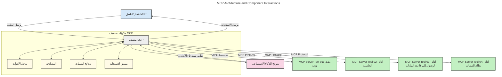
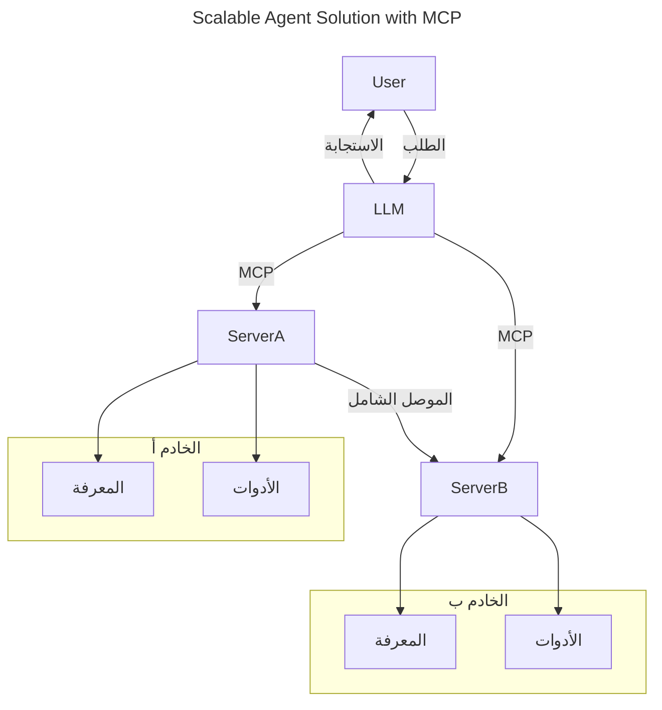
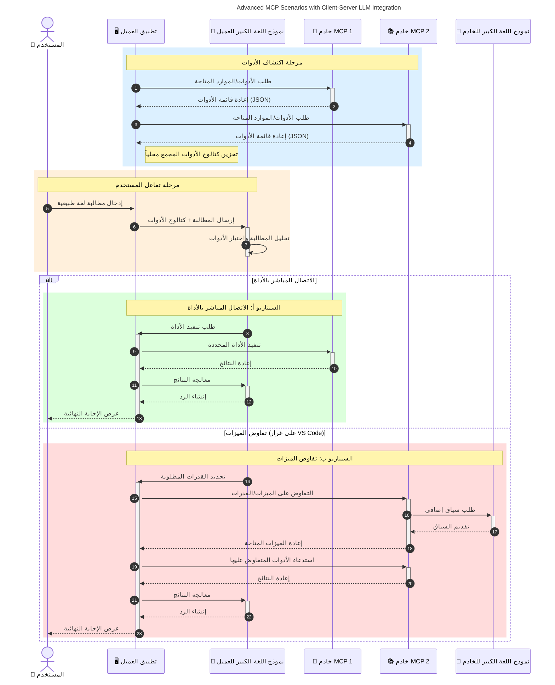

# مقدمة في بروتوكول سياق النموذج (MCP): لماذا هو مهم لتطبيقات الذكاء الاصطناعي القابلة للتوسع

_(انقر على الصورة أعلاه لمشاهدة فيديو هذا الدرس)_

تُعد تطبيقات الذكاء الاصطناعي التوليدية خطوة كبيرة إلى الأمام لأنها غالبًا ما تتيح للمستخدم التفاعل مع التطبيق باستخدام مطالبات اللغة الطبيعية. ومع ذلك، مع استثمار المزيد من الوقت والموارد في هذه التطبيقات، تريد التأكد من أنك تستطيع دمج الوظائف والموارد بسهولة بطريقة تجعل من السهل التوسع، وأن تطبيقك يمكن أن يلبي أكثر من نموذج مستخدم واحد، ويتعامل مع تعقيدات النماذج المختلفة. باختصار، بناء تطبيقات الذكاء الاصطناعي التوليدية سهل للبدء، ولكن مع نموها وتعقيدها، ستحتاج إلى البدء في تحديد بنية وربما الاعتماد على معيار لضمان بناء تطبيقاتك بطريقة متسقة. هنا يأتي دور MCP لتنظيم الأمور وتوفير معيار.

---

## **🔍 ما هو بروتوكول سياق النموذج (MCP)؟**

بروتوكول سياق النموذج (MCP) هو **واجهة مفتوحة وموحدة** تسمح لنماذج اللغة الكبيرة (LLMs) بالتفاعل بسلاسة مع أدوات خارجية وواجهات برمجة التطبيقات ومصادر البيانات. يوفر بنية ثابتة لتعزيز وظائف نموذج الذكاء الاصطناعي بما يتجاوز بيانات التدريب الخاصة به، مما يمكن أنظمة الذكاء الاصطناعي من أن تكون أكثر ذكاءً وقابلية للتوسع وأكثر استجابة.

---

## **🎯 لماذا تعتبر المعايير مهمة في الذكاء الاصطناعي**

مع تعقد تطبيقات الذكاء الاصطناعي التوليدية، من الضروري اعتماد معايير تضمن **قابلية التوسع، وقابلية التمديد، وقابلية الصيانة،** و**تجنب التقييد بالمورد الواحد**. يعالج MCP هذه الاحتياجات عن طريق:

- توحيد تكاملات النموذج مع الأدوات
- تقليل الحلول المخصصة الهشة والفردية
- السماح بتواجد نماذج متعددة من موردين مختلفين ضمن نظام بيئي واحد

**ملاحظة:** رغم أن MCP يصف نفسه كمعيار مفتوح المصدر، لا توجد خطط لتوحيد MCP من خلال أي هيئات معايير موجودة مثل IEEE أو IETF أو W3C أو ISO أو أي هيئة معايير أخرى.

---

## **📚 الأهداف التعليمية**

بنهاية هذه المقالة، ستكون قادرًا على:

- تعريف **بروتوكول سياق النموذج (MCP)** وحالات استخدامه
- فهم كيف يقوم MCP بتوحيد التواصل بين النموذج والأدوات
- التعرف على العناصر الأساسية لهندسة MCP
- استكشاف تطبيقات حقيقية لـ MCP في سياقات الشركات والتنمية

---

## **💡 لماذا يعد بروتوكول سياق النموذج (MCP) نقلة نوعية**

### **🔗 MCP يحل مشكلة التجزئة في تفاعلات الذكاء الاصطناعي**

قبل MCP، كان دمج النماذج مع الأدوات يتطلب:

- كود مخصص لكل زوج أداة-نموذج
- واجهات برمجة تطبيقات غير موحدة لكل مورد
- انقطاعات متكررة بسبب التحديثات
- قابلية توسع ضعيفة مع المزيد من الأدوات

### **✅ فوائد توحيد MCP**

| **الفائدة**              | **الوصف**                                                                |
|--------------------------|-------------------------------------------------------------------------|
| التوافقية                | تعمل نماذج اللغة الكبيرة بسلاسة مع الأدوات عبر مورّدين مختلفين          |
| الاتساق                  | سلوك موحد عبر المنصات والأدوات                                           |
| إعادة الاستخدام          | يمكن استخدام الأدوات المبنية مرة واحدة عبر مشاريع وأنظمة متعددة          |
| تسريع التطوير            | تقليل وقت التطوير باستخدام واجهات موحدة قابلة للتوصيل والتشغيل         |

---

## **🧱 نظرة عامة على هندسة MCP عالية المستوى**

يتبع MCP نموذج **العميل-الخادم**، حيث:

- **مضيفو MCP** يقومون بتشغيل نماذج الذكاء الاصطناعي
- **عملاء MCP** يبدؤون الطلبات
- **خوادم MCP** تقدم السياق، الأدوات، والقدرات

### **العناصر الأساسية:**

- **الموارد** – بيانات ثابتة أو ديناميكية للنماذج  
- **المطالبات** – سير عمل محدد مسبقًا للتوليد الموجه  
- **الأدوات** – وظائف تنفيذ مثل البحث، الحسابات  
- **العينة** – سلوك وكيل من خلال تفاعلات متكررة (تم إلغاءه في إصدار المرشح `2026-07-28`)
- **الاستنباط** – طلبات يبدأها الخادم لإدخال المستخدم
- **الجذور** – حدود نظام الملفات للتحكم في وصول الخادم (تم إلغاءه في إصدار المرشح `2026-07-28`)

### **هندسة البروتوكول:**

يستخدم MCP بنية من طبقتين:
- **طبقة البيانات**: اتصال مبني على JSON-RPC 2.0 مع إدارة دورة الحياة وال primitives
- **طبقة النقل**: قنوات اتصال STDIO (محلية) وHTTP قابل للبث مع SSE (عن بُعد)

---

## كيف تعمل خوادم MCP

تعمل خوادم MCP بالطريقة التالية:

- **تدفق الطلب**:
    1. يبدأ المستخدم النهائي أو برنامج يعمل نيابة عنه الطلب.
    2. يرسل **عميل MCP** الطلب إلى **مضيف MCP** الذي يدير وقت تشغيل نموذج الذكاء الاصطناعي.
    3. يتلقى **نموذج الذكاء الاصطناعي** مطالبة المستخدم وقد يطلب الوصول إلى أدوات أو بيانات خارجية عبر مكالمات أداة واحدة أو أكثر.
    4. يتواصل **مضيف MCP**، وليس النموذج مباشرة، مع **خادم (خوادم) MCP** المناسب باستخدام البروتوكول الموحد.
- **وظائف مضيف MCP**:
    - **سجل الأدوات**: يحتفظ بكاتالوج الأدوات المتاحة وقدراتها.
    - **المصادقة**: يتحقق من الأذونات للوصول إلى الأدوات.
    - **معالج الطلبات**: يعالج طلبات الأدوات الواردة من النموذج.
    - **منسق الاستجابات**: ينظم مخرجات الأدوات بصيغة يمكن للنموذج فهمها.
- **تنفيذ خادم MCP**:
    - يوجه **مضيف MCP** مكالمات الأدوات إلى خادم (خوادم) MCP واحد أو أكثر، كل منها يعرض وظائف متخصصة (مثل البحث، الحسابات، استعلامات قواعد البيانات).
    - يؤدي **خوادم MCP** عملياتها الخاصة وتعيد النتائج إلى **مضيف MCP** بشكل متناسق.
    - ينظم **مضيف MCP** هذه النتائج وينقلها إلى **نموذج الذكاء الاصطناعي**.
- **إكمال الاستجابة**:
    - يدمج **نموذج الذكاء الاصطناعي** مخرجات الأدوات في استجابة نهائية.
    - يرسل **مضيف MCP** هذه الاستجابة مرة أخرى إلى **عميل MCP** الذي يقدمها للمستخدم النهائي أو البرنامج المستدعي.
    

## 👨‍💻 كيف تبني خادم MCP (مع أمثلة)

تتيح خوادم MCP لك توسيع قدرات نماذج اللغة الكبيرة عن طريق توفير البيانات والوظائف. 

هل أنت مستعد لتجربته؟ إليك حزم SDK محددة للغة البرمجة و/أو البيئة مع أمثلة لإنشاء خوادم MCP بسيطة بلغات/بيئات مختلفة:

- **Python SDK**: https://github.com/modelcontextprotocol/python-sdk

- **TypeScript SDK**: https://github.com/modelcontextprotocol/typescript-sdk

- **Java SDK**: https://github.com/modelcontextprotocol/java-sdk

- **C#/.NET SDK**: https://github.com/modelcontextprotocol/csharp-sdk

## 🌍 حالات استخدام حقيقية لـ MCP

يتيح MCP مجموعة واسعة من التطبيقات من خلال توسيع قدرات الذكاء الاصطناعي:

| **التطبيق**              | **الوصف**                                                               |
|------------------------|-------------------------------------------------------------------------|
| تكامل بيانات المؤسسات  | ربط نماذج اللغة الكبيرة بقواعد البيانات، أنظمة إدارة علاقات العملاء، أو أدوات داخلية |
| أنظمة الذكاء الاصطناعي الوكيلة | تمكين الوكلاء المستقلين مع وصول الأدوات وسير عمل اتخاذ القرار          |
| التطبيقات متعددة الوسائط | دمج أدوات النصوص، الصور، والصوت ضمن تطبيق ذكاء اصطناعي موحد           |
| تكامل البيانات في الوقت الحقيقي | إحضار بيانات حية إلى تفاعلات الذكاء الاصطناعي من أجل مخرجات أكثر دقة وحديثة |

### 🧠 MCP = معيار عالمي لتفاعلات الذكاء الاصطناعي

يعمل بروتوكول سياق النموذج (MCP) كمعيار عالمي لتفاعلات الذكاء الاصطناعي، مثل كيف وحد USB-C الاتصالات المادية للأجهزة. في عالم الذكاء الاصطناعي، يوفر MCP واجهة موحدة، تسمح للنماذج (العملاء) بالاندماج بسلاسة مع الأدوات الخارجية ومزودي البيانات (الخوادم). هذا يلغي الحاجة إلى بروتوكولات مخصصة ومتنوعة لكل API أو مصدر بيانات.

تحت MCP، تتبع الأداة المتوافقة مع MCP (المشار إليها كخادم MCP) معيارًا موحدًا. يمكن لهذه الخوادم سرد الأدوات أو الإجراءات التي تقدمها وتنفيذ تلك الإجراءات عند طلب وكيل الذكاء الاصطناعي. المنصات التي تدعم MCP قادرة على اكتشاف الأدوات المتوفرة من الخوادم واستدعائها عبر هذا البروتوكول الموحد.

### 💡 يسهل الوصول إلى المعرفة

إلى جانب تقديم الأدوات، يسهل MCP أيضًا الوصول إلى المعرفة. يمكّن التطبيقات من توفير سياق لنماذج اللغة الكبيرة (LLMs) من خلال ربطها بمصادر بيانات متنوعة. على سبيل المثال، قد يمثل خادم MCP مستودع وثائق الشركة، مما يسمح للوكلاء بسحب المعلومات ذات الصلة عند الطلب. يمكن لخادم آخر معالجة إجراءات محددة مثل إرسال رسائل البريد الإلكتروني أو تحديث السجلات. من منظور الوكيل، هذه أدوات يمكن استخدامها – بعض الأدوات تُرجع بيانات (سياق المعرفة)، في حين تؤدي أخرى إجراءات. يدير MCP كلا الحالتين بكفاءة.

يكتسب الوكيل المتصل بخادم MCP تلقائيًا معرفة قدرات الخادم المتاحة والبيانات التي يمكن الوصول إليها عبر تنسيق موحد. تمكن هذه التوحيد من توفر الأدوات بشكل ديناميكي. على سبيل المثال، إضافة خادم MCP جديد إلى نظام الوكيل يجعل وظائفه قابلة للاستخدام فورًا دون الحاجة إلى تخصيص إضافي لتعليمات الوكيل.

يتماشى هذا التكامل السلس مع التدفق الموضح في الرسم البياني التالي، حيث توفر الخوادم الأدوات والمعرفة، مما يضمن تعاونًا سلسًا بين الأنظمة.

### 👉 مثال: حل وكيل قابل للتوسع

يمكن للموصل العالمي تمكين خوادم MCP من التواصل ومشاركة القدرات مع بعضها البعض، مما يسمح لـ ServerA بتفويض المهام إلى ServerB أو الوصول إلى أدواته ومعرفته. يجمع هذا بين الأدوات والبيانات عبر الخوادم، مما يدعم هندسات وكيلة قابلة للتوسع والنمذجة المعيارية. نظرًا لأن MCP يوحد عرض الأدوات، يمكن للوكلاء اكتشاف التوجيهات بين الخوادم ديناميكيًا دون تكاملات مبرمجة مسبقًا.

توحيد الأدوات والمعرفة: يمكن الوصول إلى الأدوات والبيانات عبر الخوادم، مما يمكّن هندسات وكلاء أكثر قابلية للتوسع والنمذجة.

### 🔄 سيناريوهات MCP متقدمة مع دمج LLM على جانب العميل

إلى جانب هندسة MCP الأساسية، هناك سيناريوهات متقدمة حيث يحتوي كل من العميل والخادم على نماذج لغة كبيرة، مما يتيح تفاعلات أكثر تعقيدًا. في الرسم البياني التالي، يمكن أن يكون **تطبيق العميل** بيئة تطوير متكاملة تحتوي على عدد من أدوات MCP المتاحة للاستخدام من قبل نموذج اللغة الكبير:

## 🔐 الفوائد العملية لـ MCP

فيما يلي الفوائد العملية لاستخدام MCP:

- **التحديث**: يمكن للنماذج الوصول إلى معلومات محدثة تتجاوز بيانات التدريب
- **تمديد القدرات**: يمكن للنماذج الاستفادة من أدوات متخصصة لمهام لم تتدرب عليها
- **تقليل الهلوسات**: توفر مصادر البيانات الخارجية أساسًا واقعيًا
- **الخصوصية**: يمكن أن تبقى البيانات الحساسة داخل بيئات مؤمنة بدلاً من تضمينها في المطالبات

## 📌 نقاط رئيسية يجب تذكرها

فيما يلي نقاط رئيسية لاستخدام MCP:

- **MCP** يوحد كيفية تفاعل نماذج الذكاء الاصطناعي مع الأدوات والبيانات
- يعزز **قابلية التوسعة، الاتساق، والتوافقية**
- يساعد MCP على **تقليل وقت التطوير، تحسين الموثوقية، وتوسيع قدرات النماذج**
- تمكن بنية العميل-الخادم **تطبيقات ذكاء اصطناعي مرنة وقابلة للتوسعة**

## 🧠 تمرين

فكر في تطبيق ذكاء اصطناعي ترغب في بنائه.

- ما هي **الأدوات أو البيانات الخارجية** التي يمكن أن تعزز قدراته؟
- كيف يمكن أن يجعل MCP التكامل **أسهل وأكثر موثوقية؟**

## موارد إضافية

- [مستودع MCP على GitHub](https://github.com/modelcontextprotocol)

## ما التالي

التالي: [الفصل 1: المفاهيم الأساسية](../01-CoreConcepts/README.md)

---

<!-- CO-OP TRANSLATOR DISCLAIMER START -->
**تنويه**:
تمت ترجمة هذا المستند باستخدام خدمة الترجمة بالذكاء الاصطناعي [Co-op Translator](https://github.com/Azure/co-op-translator). بينما نسعى للدقة، يرجى العلم أن الترجمات الآلية قد تحتوي على أخطاء أو عدم دقة. يجب اعتبار المستند الأصلي بلغته الأصلية المصدر الرسمي والمعتمد. للمعلومات الهامة، يُنصح بالاستعانة بترجمة بشرية محترفة. نحن غير مسؤولين عن أي سوء فهم أو تفسير ناتج عن استخدام هذه الترجمة.
<!-- CO-OP TRANSLATOR DISCLAIMER END -->