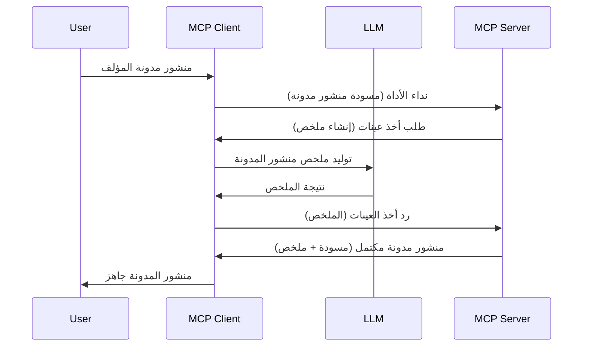

> [مهجور: إصدار المرشح 2026-07-28](https://blog.modelcontextprotocol.io/posts/2026-07-28-release-candidate/)

# العينات - تفويض الميزات إلى العميل

> **ملاحظة التوقف عن الاستخدام:** إصدار المرشح لمواصفة MCP بتاريخ `2026-07-28` يشير إلى أن العينات أصبحت مهجورة لصالح التكامل المباشر مع واجهات برمجة التطبيقات لمزودي LLM. العينات لا تزال تعمل في `2025-11-25` ولمدة عام على الأقل بعد أي توقف رسمي عن الاستخدام، لذا كل شيء في هذا الدرس لا يزال صالحًا - لكن يجب على تصميمات الخادم الجديدة تقييم نمط البديل. انظر [ما الجديد في MCP: مرشح إصدار 2026-07-28](../../01-CoreConcepts/mcp-2026-07-28-release-candidate.md).

أحيانًا، تحتاج إلى تعاون بين عميل MCP وخادم MCP لتحقيق هدف مشترك. قد يكون لديك حالة يطلب فيها الخادم مساعدة LLM الذي يعمل على العميل. في هذا الحالة، العينات هي ما يجب عليك استخدامه.

لنستعرض بعض حالات الاستخدام وكيفية بناء حل يتضمن العينات.

## نظرة عامة

في هذا الدرس، نركز على شرح متى وأين تستخدم العينات وكيفية تهيئتها.

## أهداف التعلم

في هذا الفصل، سنقوم بـ:

- شرح ما هي العينات ومتى تستخدمها.
- عرض كيفية تهيئة العينات في MCP.
- تقديم أمثلة للعينات أثناء العمل.

## ما هي العينات ولماذا نستخدمها؟

العينات هي ميزة متقدمة تعمل على النحو التالي:



### طلب العينات

حسنًا، الآن لدينا نظرة عامة على سيناريو معقول، دعونا نتحدث عن طلب العينات الذي يرسله الخادم إلى العميل. إليك كيف يمكن أن يبدو مثل هذا الطلب بصيغة JSON-RPC:

```json
{
  "jsonrpc": "2.0",
  "id": 1,
  "method": "sampling/createMessage",
  "params": {
    "messages": [
      {
        "role": "user",
        "content": {
          "type": "text",
          "text": "Create a blog post summary of the following blog post: <BLOG POST>"
        }
      }
    ],
    "modelPreferences": {
      "hints": [
        {
          "name": "claude-3-sonnet"
        }
      ],
      "intelligencePriority": 0.8,
      "speedPriority": 0.5
    },
    "systemPrompt": "You are a helpful assistant.",
    "maxTokens": 100
  }
}
```

هناك بعض الأمور الجديرة بالذكر هنا:

- المطالَب، ضمن content -> text، هو المفتاح الخاص بنا وهو تعليمة لـ LLM لتلخيص محتوى منشور المدونة.

- **modelPreferences**. هذا القسم هو مجرد تفضيل، توصية لتكوين استخدام مع LLM. يمكن للمستخدم اختيار اتباع هذه التوصيات أو تعديلها. في هذا الحالة هناك توصيات حول النموذج الذي يستخدمونه وكذلك أولوية السرعة والذكاء.
- **systemPrompt**، هذا هو مطالَب النظام العادي الخاص بك والذي يعطي LLM شخصية ويحتوي على تعليمات توجيهية.
- **maxTokens**، هذه خاصية أخرى تستخدم لتحديد عدد الرموز الموصى به استخدامها لهذه المهمة.

### رد العينات

هذا الرد هو ما ينتهي به كاملاً عميل MCP إلى إرساله مرة أخرى إلى خادم MCP وهو نتيجة استدعاء العميل لـ LLM، الانتظار لهذا الرد ثم تشكيل هذه الرسالة. إليك كيف يمكن أن يكون بصيغة JSON-RPC:

```json
{
  "jsonrpc": "2.0",
  "id": 1,
  "result": {
    "role": "assistant",
    "content": {
      "type": "text",
      "text": "Here's your abstract <ABSTRACT>"
    },
    "model": "gpt-5",
    "stopReason": "endTurn"
  }
}
```

لاحظ كيف أن الرد هو ملخص لمنشور المدونة تمامًا كما طلبنا. لاحظ أيضًا كيف أن النموذج المستخدم ليس ما طلبناه بل "gpt-5" بدلاً من "claude-3-sonnet". هذا لتوضيح أن المستخدم يمكنه تغيير رأيه حول ما يستخدم وأن طلب العينات هو مجرد توصية.

حسنًا، الآن بعد أن فهمنا التدفق الرئيسي، والمهمة المفيدة لاستخدامه "إنشاء منشور مدونة + ملخص"، لنرَ ماذا نحتاج لنجعلها تعمل.

### أنواع الرسائل

رسائل العينات ليست مقيدة بالنص فقط بل يمكنك إرسال صور وصوت أيضًا. إليك كيف يظهر JSON-RPC مختلفًا:

**نص**

```json
{
  "type": "text",
  "text": "The message content"
}
```

**محتوى الصورة**

```json
{
  "type": "image",
  "data": "base64-encoded-image-data",
  "mimeType": "image/jpeg"
}
```

**محتوى الصوت**

```json
{
  "type": "audio",
  "data": "base64-encoded-audio-data",
  "mimeType": "audio/wav"
}
```

> ملاحظة: لمزيد من المعلومات التفصيلية عن العينات، اطلع على [الوثائق الرسمية](https://modelcontextprotocol.io/specification/2025-11-25/client/sampling)

## كيفية تهيئة العينات في العميل

> ملاحظة: إذا كنت تبني خادمًا فقط، لا تحتاج إلى الكثير هنا.

في العميل، تحتاج إلى تحديد الميزة التالية كما يلي:

```json
{
  "capabilities": {
    "sampling": {}
  }
}
```

سيتم التقاط هذا عند بدء العميل المختار مع الخادم.

## مثال على العينات أثناء العمل - إنشاء منشور مدونة

لنبرمج خادم عينات معًا، سنحتاج إلى القيام بما يلي:

1. إنشاء أداة على الخادم.
1. يجب على هذه الأداة إنشاء طلب عينات.
1. يجب على الأداة الانتظار حتى يتم الرد على طلب العميل للعينات.
1. ثم يتم إنتاج نتيجة الأداة.

لنرَ الكود خطوة بخطوة:

### -1- إنشاء الأداة

**python**

```python
@mcp.tool()
async def create_blog(title: str, content: str, ctx: Context[ServerSession, None]) -> str:
    """Create a blog post and generate a summary"""

```

### -2- إنشاء طلب العينات

قم بتمديد أداتك بالكود التالي:

**python**

```python
post = BlogPost(
        id=len(posts) + 1,
        title=title,
        content=content,
        abstract=""
    )

prompt = f"Create an abstract of the following blog post: title: {title} and draft: {content} "

result = await ctx.session.create_message(
        messages=[
            SamplingMessage(
                role="user",
                content=TextContent(type="text", text=prompt),
            )
        ],
        max_tokens=100,
)

```

### -3- انتظر الرد وأعد الرد

**python**

```python
post.abstract = result.content.text

posts.append(post)

# إرجاع المنتج الكامل
return json.dumps({
    "id": post.title,
    "abstract": post.abstract
})
```

### -4- الكود الكامل

**python**

```python
from starlette.applications import Starlette
from starlette.routing import Mount, Host

from mcp.server.fastmcp import Context, FastMCP

from mcp.server.session import ServerSession
from mcp.types import SamplingMessage, TextContent

import json


from uuid import uuid4
from typing import List
from pydantic import BaseModel


mcp = FastMCP("Blog post generator")

# التطبيق = FastAPI()

posts = []

class BlogPost(BaseModel):
    id: int
    title: str
    content: str
    abstract: str

posts: List[BlogPost] = []

@mcp.tool()
async def create_blog(title: str, content: str, ctx: Context[ServerSession, None]) -> str:
    """Create a blog post and generate a summary"""

    post = BlogPost(
        id=len(posts) + 1,
        title=title,
        content=content,
        abstract=""
    )

    prompt = f"Create an abstract of the following blog post: title: {title} and draft: {content} "

    result = await ctx.session.create_message(
        messages=[
            SamplingMessage(
                role="user",
                content=TextContent(type="text", text=prompt),
            )
        ],
        max_tokens=100,
    )

    post.abstract = result.content.text

    posts.append(post)

    # إرجاع المقالة الكاملة في المدونة
    return json.dumps({
        "id": post.title,
        "abstract": post.abstract
    })

if __name__ == "__main__":
    print("Starting server...")
    # mcp.run()
    mcp.run(transport="streamable-http")

# تشغيل التطبيق باستخدام: python server.py
```

### -5- اختباره في Visual Studio Code

لاختبار هذا في Visual Studio Code، قم بما يلي:

1. ابدأ الخادم في الطرفية
1. أضفه إلى *mcp.json* (وتأكد من تشغيله) مثل ما يلي:

   ```json
   "servers": {
      "blog-server": {
        "type": "http",
        "url": "http://localhost:8000/mcp"
      }
   }
   ```

1. أكتب مطالَب:

   ```text
   create a blog post named "Where Python comes from", the content is "Python is actually named after Monty Python Flying Circus"
   ```

1. اسمح بحدوث العينات. في المرة الأولى التي تختبر فيها هذا، سيتم عرض حوار إضافي تحتاج إلى قبوله، ثم سترى الحوار العادي لطلب تشغيل أداة.

1. افحص النتائج. سترى النتائج معروضة بشكل جميل في GitHub Copilot Chat ولكن يمكنك أيضًا فحص الرد الخام JSON.

**مكافأة**. أدوات Visual Studio Code تدعم العينات بشكل ممتاز. يمكنك تهيئة الوصول للعينات على الخادم المثبت لديك بالتالي:

1. انتقل إلى قسم الامتدادات.
1. اختر أيقونة الترس الخاصة بالخادم المثبت في قسم "MCP SERVERS - INSTALLED".
1 اختر "تهيئة الوصول للنموذج"، هنا يمكنك اختيار النماذج التي يسمح لـ GitHub Copilot باستخدامها عند تنفيذ العينات. كما يمكنك رؤية كل طلبات العينات التي حدثت مؤخرًا باختيار "إظهار طلبات العينات".

## المهمة

في هذه المهمة، ستبني نوعًا مختلفًا من العينات، وهو تكامل عينات يدعم توليد وصف منتج. إليك السيناريو الخاص بك:

**السيناريو**: موظف المكتب الخلفي في التجارة الإلكترونية يحتاج للمساعدة، يستغرق وقتًا طويلاً جدًا لتوليد أوصاف المنتجات. لذلك، ستبني حلًا يمكنك من خلاله استدعاء أداة "create_product" مع "title" و "keywords" كوسيطين ويجب أن تنتج منتجًا كاملاً بما في ذلك حقل "description" يجب ملؤه بواسطة LLM الخاص بالعميل.

نصيحة: استخدم ما تعلمته سابقًا لبناء هذا الخادم وأداته باستخدام طلب عينات.

## الحل

[الحل](./solution/README.md)

## النقاط الرئيسية

العينات ميزة قوية تسمح للخادم بتفويض المهام إلى العميل عندما يحتاج إلى مساعدة LLM.

## ما التالي

- [الفصل 4 - التنفيذ العملي](../../04-PracticalImplementation/README.md)

---

<!-- CO-OP TRANSLATOR DISCLAIMER START -->
**تنويه**:
تمت ترجمة هذا المستند باستخدام خدمة الترجمة بالذكاء الاصطناعي [Co-op Translator](https://github.com/Azure/co-op-translator). بينما نسعى للدقة، يرجى العلم أن الترجمات الآلية قد تحتوي على أخطاء أو عدم دقة. يجب اعتبار المستند الأصلي بلغته الأصلية المصدر الرسمي والمعتمد. للمعلومات الهامة، يُنصح بالاستعانة بترجمة بشرية محترفة. نحن غير مسؤولين عن أي سوء فهم أو تفسير ناتج عن استخدام هذه الترجمة.
<!-- CO-OP TRANSLATOR DISCLAIMER END -->