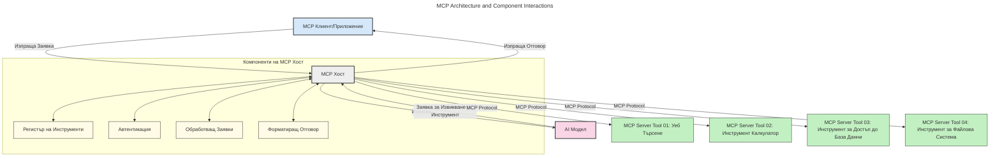
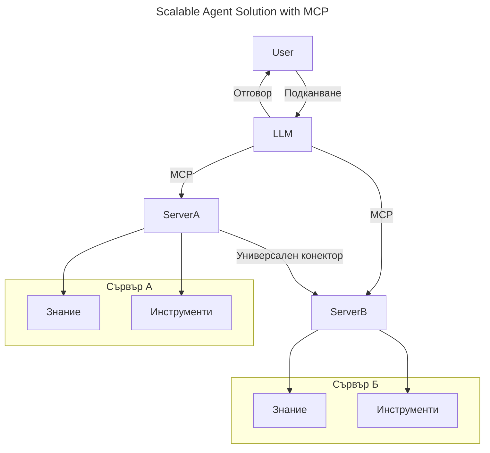
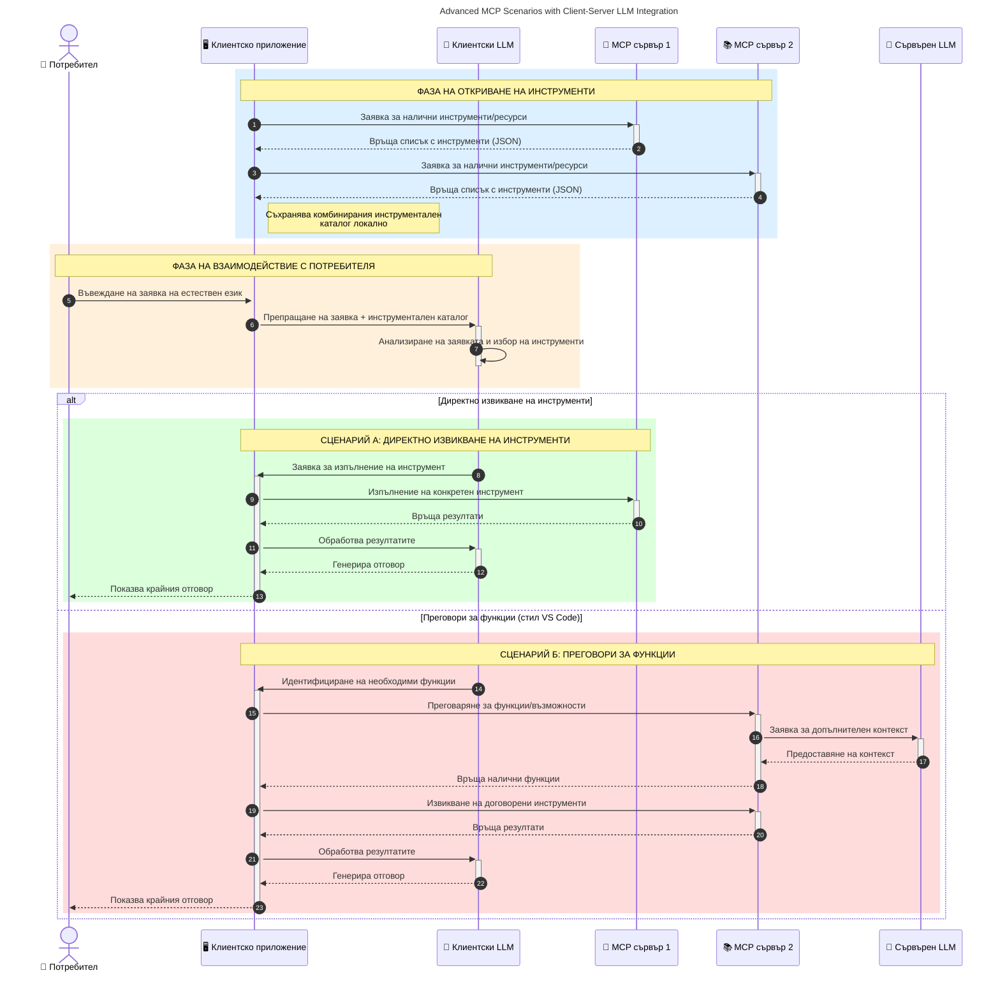

# Въведение в протокола за контекст на моделите (MCP): Защо е важен за мащабируеми AI приложения

_(Кликнете върху изображението по-горе, за да гледате видеото към този урок)_

Генеративните AI приложения са голям напредък, тъй като често позволяват на потребителя да взаимодейства с приложението чрез естествен езикови подкани. Въпреки това, когато се инвестират повече време и ресурси в такива приложения, искате да сте сигурни, че можете лесно да интегрирате функционалности и ресурси по начин, който е лесен за разширяване, че приложението ви може да обслужва повече от един модел и да се справя с различни особености на моделите. С други думи, започването на изграждането на генеративни AI приложения е лесно, но с нарастването и усложняването им трябва да започнете да дефинирате архитектура и вероятно ще трябва да разчитате на стандарт, който да гарантира, че вашите приложения са изградени по консистентен начин. Тук влиза MCP, за да организира нещата и да осигури стандарт.

---

## **🔍 Какво е протокол за контекст на моделите (MCP)?**

**Протоколът за контекст на моделите (MCP)** е **отворен, стандартизиран интерфейс**, който позволява на големите езикови модели (LLM) да взаимодействат безпроблемно с външни инструменти, API-та и източници на данни. Той осигурява последователна архитектура за разширяване на функционалността на AI моделите отвъд техните обучителни данни, което дава възможност за по-умни, мащабируеми и по-отзивчиви AI системи.

---

## **🎯 Защо стандартите в AI са важни**

С докарването на генеративните AI приложения до по-голяма сложност, е важно да се приемат стандарти, които осигуряват **мащабируемост, разширяемост, поддръжка** и **избягване на обвързване с доставчици**. MCP отговаря на тези нужди чрез:

- Обединяване на интеграциите между модели и инструменти
- Намаляване на чупливи, еднократни персонализирани решения
- Позволяване на множество модели от различни доставчици да съжителстват в една екосистема

**Забележка:** Макар MCP да се рекламира като отворен стандарт, няма планове той да бъде стандартизиран чрез съществуващи стандартизиращи организации като IEEE, IETF, W3C, ISO или други.

---

## **📚 Учебни цели**

Към края на тази статия ще можете:

- Да дефинирате **Протокола за контекст на моделите (MCP)** и неговите случаи на употреба
- Да разберете как MCP стандартизира комуникацията между модел и инструмент
- Да идентифицирате основните компоненти на архитектурата на MCP
- Да изследвате реални приложения на MCP в бизнес и разработващ контекст

---

## **💡 Защо протоколът за контекст на моделите (MCP) е пробив**

### **🔗 MCP решава проблема с фрагментацията в AI взаимодействията**

Преди MCP, интегрирането на модели с инструменти изискваше:

- Персонализиран код за всяка двойка модел-инструмент
- Нестандартизирани API-та за всеки доставчик
- Чести прекъсвания заради актуализации
- Лоша мащабируемост с нарастването на инструментите

### **✅ Предимства на стандартизацията на MCP**

| **Предимство**             | **Описание**                                                                |
|---------------------------|-----------------------------------------------------------------------------|
| Интероперабилност          | LLM работят безпроблемно с инструменти от различни доставчици              |
| Консистентност             | Униформено поведение между платформи и инструменти                         |
| Повторна употреба          | Инструменти, създадени веднъж, могат да се използват в проекти и системи   |
| Ускорено развитие          | Намаляване на времето за разработка чрез използване на стандартизирани интерфейси plug-and-play |

---

## **🧱 Обзор на високо ниво на архитектурата на MCP**

MCP следва **клиент-сървър модел**, където:

- **MCP хостове** управляват AI моделите
- **MCP клиенти** инициират заявки
- **MCP сървъри** осигуряват контекст, инструменти и възможности

### **Ключови компоненти:**

- **Ресурси** – Статични или динамични данни за моделите  
- **Подкани** – Предефинирани работни потоци за насочено генериране  
- **Инструменти** – Изпълними функции като търсене, изчисления  
- **Семплиране** – Агентично поведение чрез рекурсивни взаимодействия (отпаднало като кандидат за версия на `2026-07-28`)
- **Илицитиране** – Заявки, инициирани от сървъра за потребителски вход
- **Корени** – Граници на файловата система за контрол на достъпа на сървъра (отпаднало като кандидат за версия на `2026-07-28`)

### **Архитектура на протокола:**

MCP използва двуслойна архитектура:
- **Слой данни**: Комуникация базирана на JSON-RPC 2.0 с управление на жизнения цикъл и примитиви
- **Транспорен слой**: STDIO (локален) и Streamable HTTP със SSE (удалена) комуникационни канали

---

## Как работят MCP сървърите

MCP сървърите работят по следния начин:

- **Поток на заявката**:
    1. Заявката е инициирана от краен потребител или софтуер, действащ от негово име.
    2. **MCP клиентът** изпраща заявката до **MCP хост**, който управлява AI моделното време.
    3. **AI моделът** получава потребителската подкана и може да поиска достъп до външни инструменти или данни чрез един или повече инструментарни повиквания.
    4. **MCP хостът**, а не самият модел, комуникира със съответния(те) **MCP сървър(и)**, използвайки стандартизирания протокол.
- **Функционалност на MCP хоста**:
    - **Регистър на инструменти**: Поддържа каталог на наличните инструменти и техните възможности.
    - **Аутентикация**: Проверява разрешенията за достъп до инструментите.
    - **Обработчик на заявки**: Обработва входящите заявки за инструменти от модела.
    - **Форматиране на отговори**: Структурира изхода от инструментите в формат, който моделът разбира.
- **Изпълнение на MCP сървъра**:
    - **MCP хостът** насочва повикванията към един или повече **MCP сървъри**, всеки предлагащ специализирани функции (например търсене, изчисления, заявки към бази данни).
    - **MCP сървърите** изпълняват своите операции и връщат резултатите обратно на **MCP хоста** в последователен формат.
    - **MCP хостът** форматира и препраща тези резултати към **AI модела**.
- **Завършване на отговор**:
    - **AI моделът** включва изхода от инструментите в крайния отговор.
    - **MCP хостът** изпраща този отговор обратно на **MCP клиента**, който го доставя до крайния потребител или извикващия софтуер.
    

## 👨‍💻 Как да изградим MCP сървър (с примери)

MCP сървърите ви позволяват да разширите възможностите на LLM като предоставяте данни и функционалност. 

Готови ли сте да пробвате? Ето SDK-та по езици и/или стекове с примери за създаване на прости MCP сървъри на различни езици/стекове:

- **Python SDK**: https://github.com/modelcontextprotocol/python-sdk

- **TypeScript SDK**: https://github.com/modelcontextprotocol/typescript-sdk

- **Java SDK**: https://github.com/modelcontextprotocol/java-sdk

- **C#/.NET SDK**: https://github.com/modelcontextprotocol/csharp-sdk

## 🌍 Реални случаи на употреба на MCP

MCP поддържа широк спектър от приложения като разширява AI възможностите:

| **Приложение**           | **Описание**                                                               |
|------------------------|-----------------------------------------------------------------------------|
| Интеграция на корпоративни данни | Връзка на LLM с бази данни, CRM системи или вътрешни инструменти            |
| Агентичен AI системи    | Позволяване на автономни агенти с достъп до инструменти и работни потоци за вземане на решения |
| Мултимодални приложения | Комбиниране на текст, изображения и аудио инструменти в едно обединено AI приложение |
| Реално време интеграция на данни | Внасяне на живи данни в AI взаимодействия за по-точни, актуални резултати   |

### 🧠 MCP = Универсален стандарт за AI взаимодействия

Протоколът за контекст на моделите (MCP) действа като универсален стандарт за AI взаимодействия, подобно на това как USB-C стандартизира физическите връзки за устройства. В света на AI, MCP осигурява последователен интерфейс, позволяващ на моделите (клиенти) да се интегрират безпроблемно с външни инструменти и доставчици на данни (сървъри). Това премахва нуждата от разнообразни, персонализирани протоколи за всеки API или източник на данни.

Под MCP, съвместим инструмент с MCP (наречен MCP сървър) следва обединен стандарт. Тези сървъри могат да изброяват инструментите или действията, които предлагат, и да изпълняват тези действия при поискване от AI агент. Платформи за AI агенти, поддържащи MCP, могат да откриват наличните инструменти от сървърите и да ги използват чрез този стандартен протокол.

### 💡 Улеснява достъпа до знания

Освен предоставяне на инструменти, MCP улеснява и достъпа до знания. Той позволява на приложенията да предоставят контекст на големи езикови модели (LLM), свързвайки ги с различни източници на данни. Например, MCP сървър може да представлява хранилище с документи на компания, позволявайки на агентите да извличат релевантна информация при поискване. Друг сървър може да обработва специфични действия като изпращане на имейли или актуализиране на записи. От перспективата на агента, това просто са инструменти, които може да използва — някои инструменти връщат данни (контекст на знания), докато други изпълняват действия. MCP ефективно управлява и двете.

Агент, свързващ се с MCP сървър, автоматично научава наличните възможности и достъпните данни на сървъра чрез стандартен формат. Тази стандартизация позволява динамична наличност на инструменти. Например, добавянето на нов MCP сървър в системата на агента прави функциите му незабавно използваеми без необходимост от допълнително персонализиране на инструкциите за агента.

Тази опростена интеграция съответства на потока, илюстриран в следната диаграма, където сървърите предоставят както инструменти, така и знания, осигурявайки безпроблемно сътрудничество между системите. 

### 👉 Пример: Мащабируемо агентно решение

Универсалният конектор позволява на MCP сървърите да комуникират и споделят възможности помежду си, като позволява на ServerA да делегира задачи на ServerB или да достъпва неговите инструменти и знания. Това федерализира инструментите и данните между сървърите, подпомагайки мащабируеми и модулни архитектури на агенти. Тъй като MCP стандартизира показването на инструменти, агентите могат динамично да откриват и насочват заявки между сървърите без твърдо кодирани интеграции.

Федерация на инструменти и знания: Инструментите и данните могат да се достъпват през сървърите, позволявайки по-мащабируеми и модулни агентни архитектури.

### 🔄 Разширени сценарии на MCP с LLM интеграция на клиентската страна

Освен базовата архитектура на MCP, съществуват разширени сценарии, където и клиентът, и сървърът съдържат LLM, което позволява по сложни взаимодействия. В следната диаграма **Клиентското приложение** може да бъде IDE с множество MCP инструменти на разположение за използване от LLM:

## 🔐 Практически ползи на MCP

Ето практическите ползи от използването на MCP:

- **Актуалност**: Моделите имат достъп до най-новата информация, отвъд техните обучителни данни
- **Разширение на възможности**: Моделите могат да използват специализирани инструменти за задачи, за които не са били обучавани
- **Намаляване на халюцинациите**: Външните източници на данни осигуряват фактологично основание
- **Поверителност**: Чувствителните данни могат да останат в сигурна среда, вместо да са вплетени в подкани

## 📌 Основни изводи

Следват основните изводи за използването на MCP:

- **MCP** стандартизира как AI моделите взаимодействат с инструменти и данни
- Насърчава **разширяемост, консистентност и интероперабилност**
- MCP помага да се **намали времето за разработка, подобри надеждността и разшири възможностите на моделите**
- Клиент-сървър архитектурата **позволява гъвкави, разширяеми AI приложения**

## 🧠 Упражнение

Помислете за AI приложение, което ви интересува да изграждате.

- Кои **външни инструменти или данни** биха подобрили неговите възможности?
- Как MCP може да направи интеграцията **по-проста и по-надеждна?**

## Допълнителни ресурси

- [MCP GitHub репозитория](https://github.com/modelcontextprotocol)

## Какво следва

Следва: [Глава 1: Основни концепции](../01-CoreConcepts/README.md)

---

<!-- CO-OP TRANSLATOR DISCLAIMER START -->
**Отказ от отговорност**:
Този документ е преведен с помощта на AI преводачески услуга [Co-op Translator](https://github.com/Azure/co-op-translator). Въпреки че се стремим към точност, моля имайте предвид, че автоматизираните преводи могат да съдържат грешки или неточности. Оригиналният документ на неговия роден език трябва да се счита за авторитетен източник. За критична информация се препоръчва професионален човешки превод. Ние не носим отговорност за каквито и да е недоразумения или неправилни тълкувания, произтичащи от използването на този превод.
<!-- CO-OP TRANSLATOR DISCLAIMER END -->