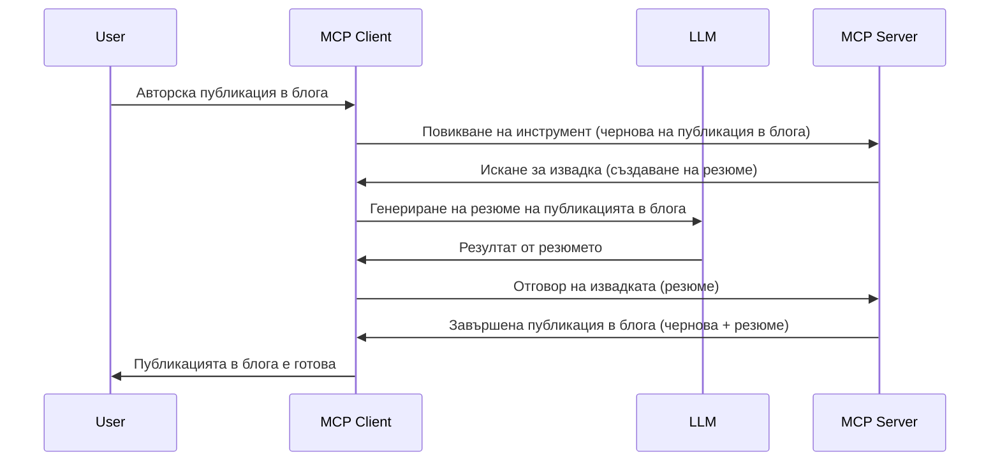

> [ОТМЕНЕНО: ИЗДАНИЕ ЗА КАНДИДАТИ ЗА ПУБЛИКУВАНЕ 2026-07-28](https://blog.modelcontextprotocol.io/posts/2026-07-28-release-candidate/)

# Sampling - делегиране на функции на Клиента

> **Уведомление за оттегляне:** кандидатът за публикуване на спецификация MCP `2026-07-28` маркира Sampling като остаряло в полза на директната интеграция с API-та на доставчици на LLM. Sampling продължава да работи в `2025-11-25` и поне една година след официалното оттегляне, така че всичко в този урок остава валидно — но новите сървърни дизайни трябва да оценят шаблона за замяна. Вижте [Какво се променя в MCP: Кандидат за издание 2026-07-28](../../01-CoreConcepts/mcp-2026-07-28-release-candidate.md).

Понякога трябва MCP Клиентът и MCP Сървърът да си сътрудничат, за да постигнат обща цел. Може да имате случай, в който Сървърът се нуждае от помощта на LLM, който е на клиента. За тази ситуация трябва да използвате sampling.

Нека разгледаме някои случаи на употреба и как да изградим решение, включващо sampling.

## Преглед

В този урок се фокусираме върху обяснението кога и къде да използваме Sampling и как да го конфигурираме.

## Цели на обучението

В този раздел ще:

- Обясним какво е Sampling и кога да се използва.
- Покажем как да конфигурираме Sampling в MCP.
- Предоставим примери за работа със Sampling.

## Какво е Sampling и защо да го използваме?

Sampling е разширена функция, която работи по следния начин:



### Запитване за sampling

Добре, сега имаме бегъл преглед на достоверен сценарий, нека говорим за запитването за sampling, което сървърът изпраща към клиента. Ето как може да изглежда такова запитване във формат JSON-RPC:

```json
{
  "jsonrpc": "2.0",
  "id": 1,
  "method": "sampling/createMessage",
  "params": {
    "messages": [
      {
        "role": "user",
        "content": {
          "type": "text",
          "text": "Create a blog post summary of the following blog post: <BLOG POST>"
        }
      }
    ],
    "modelPreferences": {
      "hints": [
        {
          "name": "claude-3-sonnet"
        }
      ],
      "intelligencePriority": 0.8,
      "speedPriority": 0.5
    },
    "systemPrompt": "You are a helpful assistant.",
    "maxTokens": 100
  }
}
```

Има няколко неща, които заслужават внимание:

- Подсказката, под content -> text, е нашата подсказка, която е инструкция за LLM да обобщи съдържанието на блог пост.

- **modelPreferences**. Този раздел е точно това – предпочитание, препоръка за каква конфигурация да се използва с LLM. Потребителят може да избере дали да приеме тези препоръки или да ги промени. В този случай има препоръки за модела, използване и приоритет на скорост и интелигентност.
- **systemPrompt**, това е нормалната ви системна подсказка, която дава на LLM личност и съдържа указания.
- **maxTokens**, това е друга характеристика, която показва колко токена се препоръчват за тази задача.

### Отговор на sampling

Този отговор е това, което MCP Клиентът изпраща обратно на MCP Сървъра и е резултат от извикването на LLM, изчакване на отговора и след това изготвяне на това съобщение. Ето как може да изглежда във формат JSON-RPC:

```json
{
  "jsonrpc": "2.0",
  "id": 1,
  "result": {
    "role": "assistant",
    "content": {
      "type": "text",
      "text": "Here's your abstract <ABSTRACT>"
    },
    "model": "gpt-5",
    "stopReason": "endTurn"
  }
}
```

Забележете как отговорът е абстрактно резюме на блог поста, точно както поискахме. Също така забележете, че използваният `model` не е този, който поискахме, а "gpt-5" вместо "claude-3-sonnet". Това илюстрира, че потребителят може да промени решението си какво да използва и че вашето запитване за sampling е препоръка.

Добре, сега когато разбираме основния поток и полезната задача да го използваме за "създаване на блог пост + резюме", нека видим какво трябва да направим, за да заработи.

### Типове съобщения

Съобщенията за sampling не са ограничени само до текст, а можете да изпращате и изображения и аудио. Ето как JSON-RPC изглежда различно:

**Текст**

```json
{
  "type": "text",
  "text": "The message content"
}
```

**Изображение**

```json
{
  "type": "image",
  "data": "base64-encoded-image-data",
  "mimeType": "image/jpeg"
}
```

**Аудио**

```json
{
  "type": "audio",
  "data": "base64-encoded-audio-data",
  "mimeType": "audio/wav"
}
```

> ЗАБЕЛЕЖКА: за по-подробна информация за Sampling, вижте [официалната документация](https://modelcontextprotocol.io/specification/2025-11-25/client/sampling)

## Как да конфигурираме Sampling в Клиента

> Забележка: ако изграждате само сървър, не е нужно да правите много тук.

В клиент трябва да посочите следната функция по този начин:

```json
{
  "capabilities": {
    "sampling": {}
  }
}
```

Това ще бъде взето предвид, когато избраният клиент се инициализира със сървъра.

## Пример за Sampling в действие - Създаване на блог пост

Нека програмираме sampling сървър заедно, ще трябва да направим следното:

1. Създаване на инструмент на Сървъра.
1. Този инструмент трябва да създаде запитване за sampling.
1. Инструментът трябва да изчака отговора на клиента за sampling.
1. След това трябва да се получи резултатът от инструмента.

Нека видим кода стъпка по стъпка:

### -1- Създаване на инструмента

**python**

```python
@mcp.tool()
async def create_blog(title: str, content: str, ctx: Context[ServerSession, None]) -> str:
    """Create a blog post and generate a summary"""

```

### -2- Създаване на запитване за sampling

Разширете вашия инструмент със следния код:

**python**

```python
post = BlogPost(
        id=len(posts) + 1,
        title=title,
        content=content,
        abstract=""
    )

prompt = f"Create an abstract of the following blog post: title: {title} and draft: {content} "

result = await ctx.session.create_message(
        messages=[
            SamplingMessage(
                role="user",
                content=TextContent(type="text", text=prompt),
            )
        ],
        max_tokens=100,
)

```

### -3- Изчакайте отговора и върнете отговора

**python**

```python
post.abstract = result.content.text

posts.append(post)

# върнете пълния продукт
return json.dumps({
    "id": post.title,
    "abstract": post.abstract
})
```

### -4- Пълен код

**python**

```python
from starlette.applications import Starlette
from starlette.routing import Mount, Host

from mcp.server.fastmcp import Context, FastMCP

from mcp.server.session import ServerSession
from mcp.types import SamplingMessage, TextContent

import json


from uuid import uuid4
from typing import List
from pydantic import BaseModel


mcp = FastMCP("Blog post generator")

# app = FastAPI()

posts = []

class BlogPost(BaseModel):
    id: int
    title: str
    content: str
    abstract: str

posts: List[BlogPost] = []

@mcp.tool()
async def create_blog(title: str, content: str, ctx: Context[ServerSession, None]) -> str:
    """Create a blog post and generate a summary"""

    post = BlogPost(
        id=len(posts) + 1,
        title=title,
        content=content,
        abstract=""
    )

    prompt = f"Create an abstract of the following blog post: title: {title} and draft: {content} "

    result = await ctx.session.create_message(
        messages=[
            SamplingMessage(
                role="user",
                content=TextContent(type="text", text=prompt),
            )
        ],
        max_tokens=100,
    )

    post.abstract = result.content.text

    posts.append(post)

    # върни пълната публикация в блога
    return json.dumps({
        "id": post.title,
        "abstract": post.abstract
    })

if __name__ == "__main__":
    print("Starting server...")
    # mcp.run()
    mcp.run(transport="streamable-http")

# стартирай приложението с: python server.py
```

### -5- Тестване във Visual Studio Code

За да тествате това във Visual Studio Code, направете следното:

1. Стартирайте сървъра в терминала
1. Добавете го в *mcp.json* (и се уверете, че е стартиран), нещо като:

   ```json
   "servers": {
      "blog-server": {
        "type": "http",
        "url": "http://localhost:8000/mcp"
      }
   }
   ```

1. Въведете подсказка:

   ```text
   create a blog post named "Where Python comes from", the content is "Python is actually named after Monty Python Flying Circus"
   ```

1. Позволете да се извърши sampling. При първото тестване ще видите допълнителен диалог, който трябва да приемете, след което ще видите нормалния диалог, в който ви се иска да стартирате инструмент.

1. Прегледайте резултатите. Ще видите резултатите както красиво представени в GitHub Copilot Chat, така и можете да разгледате суровия JSON отговор.

**Бонус**. Инструментите във Visual Studio Code имат отлична поддръжка за sampling. Можете да конфигурирате достъпа до Sampling на вашия инсталиран сървър, като отидете в:

1. Раздела за разширения.
1. Изберете иконата на зъбно колело за вашия инсталиран сървър в секцията "MCP SERVERS - INSTALLED".
1 Изберете "Configure Model Access", тук можете да изберете кои модели GitHub Copilot е разрешено да използва при sampling. Можете също да видите всички скорошни заявки за sampling, като изберете "Show Sampling requests".

## Задача

В тази задача ще изградите малко по-различен Sampling, а именно интеграция за sampling, която поддържа генериране на описание на продукт. Ето вашия сценарий:

**Сценарий**: Служителят в бекофиса на електронен магазин се нуждае от помощ, отнема твърде много време да се генерират описания на продукти. Затова трябва да изградите решение, при което можете да извикате инструмент "create_product" с аргументи "title" и "keywords", и той трябва да произведе пълен продукт, включително поле "description", което се попълва от LLM на клиента.

СЪВЕТ: използвайте наученото по-рано, за да построите този сървър и неговия инструмент, използвайки запитване за sampling.

## Решение

[Решение](./solution/README.md)

## Основни изводи

Sampling е мощна функция, която позволява на сървъра да делегира задачи на клиента, когато се нуждае от помощ от LLM.

## Какво следва

- [Глава 4 - Практическа реализация](../../04-PracticalImplementation/README.md)

---

<!-- CO-OP TRANSLATOR DISCLAIMER START -->
**Отказ от отговорност**:
Този документ е преведен с помощта на AI преводачески услуга [Co-op Translator](https://github.com/Azure/co-op-translator). Въпреки че се стремим към точност, моля имайте предвид, че автоматизираните преводи могат да съдържат грешки или неточности. Оригиналният документ на неговия роден език трябва да се счита за авторитетен източник. За критична информация се препоръчва професионален човешки превод. Ние не носим отговорност за каквито и да е недоразумения или неправилни тълкувания, произтичащи от използването на този превод.
<!-- CO-OP TRANSLATOR DISCLAIMER END -->