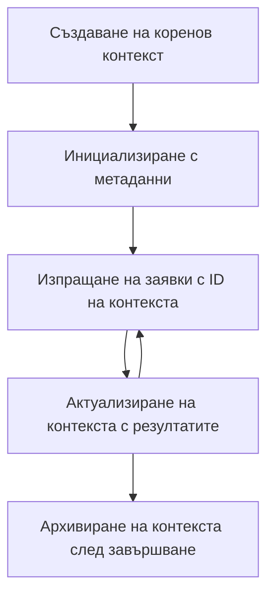

> [ЗАСТАРЯЛО: 2026-07-28 КАНДИДАТ ЗА ИЗДАНИЕ](https://blog.modelcontextprotocol.io/posts/2026-07-28-release-candidate/#roots-sampling-and-logging-are-deprecated)

# Коренни контексти в MCP

> **Известие за остаряване:** кандидатът за издание на спецификацията за MCP `2026-07-28` отбелязва Корените като остарели в полза на параметрите на инструментите, URI на ресурси или конфигурация на сървъра. Корените продължават да работят в `2025-11-25` и поне една година след всяко официално остаряване, така че всичко в този урок остава валидно - но новият дизайн на сървърите трябва да оцени заместителния модел. Вижте [Какво се променя в MCP: Кандидат за издание 2026-07-28](../../01-CoreConcepts/mcp-2026-07-28-release-candidate.md).

Коренните контексти са основна концепция в Протокола за Контекст на Модел, която осигурява постоянен слой за поддържане на история на разговорите и споделено състояние през множество заявки и сесии.

## Въведение

В този урок ще разгледаме как да създаваме, управляваме и използваме коренни контексти в MCP.

## Цели на обучението

В края на този урок ще можете да:

- Разберете предназначението и структурата на коренните контексти
- Създавате и управлявате коренни контексти с помощта на MCP клиентски библиотеки
- Прилагате коренни контексти в приложения на .NET, Java, JavaScript и Python
- Използвате коренни контексти за многократни обрати в разговори и управление на състоянието
- Прилагате добри практики за управление на коренните контексти

## Разбиране на коренните контексти

Коренните контексти служат като контейнери, които държат историята и състоянието за поредица от свързани взаимодействия. Те позволяват:

- **Постоянство на разговора**: Поддържане на свързани многократни обрати в разговор
- **Управление на паметта**: Записване и възстановяване на информация през взаимодействията
- **Управление на състоянието**: Проследяване на напредъка в сложни работни процеси
- **Споделяне на контекст**: Позволяване на множество клиенти да имат достъп до едно и също състояние на разговора

В MCP коренните контексти имат следните ключови характеристики:

- Всеки коренен контекст има уникален идентификатор.
- Те могат да съдържат история на разговора, потребителски предпочитания и друга метаданна информация.
- Те могат да бъдат създавани, достъпвани и архивирани при необходимост.
- Поддържат прецизен контрол на достъпа и разрешения.

## Жизнен цикъл на коренен контекст



## Работа с коренни контексти

Ето пример как да създадем и управляваме коренни контексти.

### Реализация на C#

```csharp
// .NET Example: Root Context Management
using Microsoft.Mcp.Client;
using System;
using System.Threading.Tasks;
using System.Collections.Generic;

public class RootContextExample
{
    private readonly IMcpClient _client;
    private readonly IRootContextManager _contextManager;
    
    public RootContextExample(IMcpClient client, IRootContextManager contextManager)
    {
        _client = client;
        _contextManager = contextManager;
    }
    
    public async Task DemonstrateRootContextAsync()
    {
        // 1. Create a new root context
        var contextResult = await _contextManager.CreateRootContextAsync(new RootContextCreateOptions
        {
            Name = "Customer Support Session",
            Metadata = new Dictionary<string, string>
            {
                ["CustomerName"] = "Acme Corporation",
                ["PriorityLevel"] = "High",
                ["Domain"] = "Cloud Services"
            }
        });
        
        string contextId = contextResult.ContextId;
        Console.WriteLine($"Created root context with ID: {contextId}");
        
        // 2. First interaction using the context
        var response1 = await _client.SendPromptAsync(
            "I'm having issues scaling my web service deployment in the cloud.", 
            new SendPromptOptions { RootContextId = contextId }
        );
        
        Console.WriteLine($"First response: {response1.GeneratedText}");
        
        // Second interaction - the model will have access to the previous conversation
        var response2 = await _client.SendPromptAsync(
            "Yes, we're using containerized deployments with Kubernetes.", 
            new SendPromptOptions { RootContextId = contextId }
        );
        
        Console.WriteLine($"Second response: {response2.GeneratedText}");
        
        // 3. Add metadata to the context based on conversation
        await _contextManager.UpdateContextMetadataAsync(contextId, new Dictionary<string, string>
        {
            ["TechnicalEnvironment"] = "Kubernetes",
            ["IssueType"] = "Scaling"
        });
        
        // 4. Get context information
        var contextInfo = await _contextManager.GetRootContextInfoAsync(contextId);
        
        Console.WriteLine("Context Information:");
        Console.WriteLine($"- Name: {contextInfo.Name}");
        Console.WriteLine($"- Created: {contextInfo.CreatedAt}");
        Console.WriteLine($"- Messages: {contextInfo.MessageCount}");
        
        // 5. When the conversation is complete, archive the context
        await _contextManager.ArchiveRootContextAsync(contextId);
        Console.WriteLine($"Archived context {contextId}");
    }
}
```

В предишния код ние:

1. Създадохме коренен контекст за сесия за обслужване на клиенти.
1. Изпратихме множество съобщения в този контекст, позволявайки на модела да поддържа състоянието.
1. Обновихме контекста с релевантна метаданна информация въз основа на разговора.
1. Взехме информация за контекста, за да разберем историята на разговора.
1. Архивирахме контекста, когато разговорът приключи.

## Пример: Прилагане на коренен контекст за финансов анализ

В този пример ще създадем коренен контекст за сесия на финансов анализ, демонстрирайки как се поддържа състояние през множество взаимодействия.

### Реализация на Java

```java
// Пример на Java: Имплементация на Root Context
package com.example.mcp.contexts;

import com.mcp.client.McpClient;
import com.mcp.client.ContextManager;
import com.mcp.models.RootContext;
import com.mcp.models.McpResponse;

import java.util.HashMap;
import java.util.Map;
import java.util.UUID;

public class RootContextsDemo {
    private final McpClient client;
    private final ContextManager contextManager;
    
    public RootContextsDemo(String serverUrl) {
        this.client = new McpClient.Builder()
            .setServerUrl(serverUrl)
            .build();
            
        this.contextManager = new ContextManager(client);
    }
    
    public void demonstrateRootContext() throws Exception {
        // Създаване на метаданни за контекста
        Map<String, String> metadata = new HashMap<>();
        metadata.put("projectName", "Financial Analysis");
        metadata.put("userRole", "Financial Analyst");
        metadata.put("dataSource", "Q1 2025 Financial Reports");
        
        // 1. Създаване на нов root context
        RootContext context = contextManager.createRootContext("Financial Analysis Session", metadata);
        String contextId = context.getId();
        
        System.out.println("Created context: " + contextId);
        
        // 2. Първо взаимодействие
        McpResponse response1 = client.sendPrompt(
            "Analyze the trends in Q1 financial data for our technology division",
            contextId
        );
        
        System.out.println("First response: " + response1.getGeneratedText());
        
        // 3. Актуализиране на контекста с важна информация, получена от отговора
        contextManager.addContextMetadata(contextId, 
            Map.of("identifiedTrend", "Increasing cloud infrastructure costs"));
        
        // Второ взаимодействие - използване на същия контекст
        McpResponse response2 = client.sendPrompt(
            "What's driving the increase in cloud infrastructure costs?",
            contextId
        );
        
        System.out.println("Second response: " + response2.getGeneratedText());
        
        // 4. Генериране на резюме на сесията за анализ
        McpResponse summaryResponse = client.sendPrompt(
            "Summarize our analysis of the technology division financials in 3-5 key points",
            contextId
        );
        
        // Съхранение на резюмето в метаданните на контекста
        contextManager.addContextMetadata(contextId, 
            Map.of("analysisSummary", summaryResponse.getGeneratedText()));
            
        // Вземане на актуализирана информация за контекста
        RootContext updatedContext = contextManager.getRootContext(contextId);
        
        System.out.println("Context Information:");
        System.out.println("- Created: " + updatedContext.getCreatedAt());
        System.out.println("- Last Updated: " + updatedContext.getLastUpdatedAt());
        System.out.println("- Analysis Summary: " + 
            updatedContext.getMetadata().get("analysisSummary"));
            
        // 5. Архивиране на контекста при приключване
        contextManager.archiveContext(contextId);
        System.out.println("Context archived");
    }
}
```

В предишния код ние:

1. Създадохме коренен контекст за сесия на финансов анализ.
2. Изпратихме множество съобщения в този контекст, позволявайки на модела да поддържа състоянието.
3. Обновихме контекста с релевантна метаданна информация въз основа на разговора.
4. Генерирахме резюме на сесията за анализа и го съхранихме в метаданните на контекста.
5. Архивирахме контекста, когато разговорът приключи.

## Пример: Управление на коренен контекст

Ефективното управление на коренните контексти е ключово за поддържане на история на разговора и състоянието. По-долу е даден пример как да реализирате управление на коренен контекст.

### Реализация на JavaScript

```javascript
// Пример с JavaScript: Управление на MCP коренови контексти
const { McpClient, RootContextManager } = require('@mcp/client');

class ContextSession {
  constructor(serverUrl, apiKey = null) {
    // Инициализиране на MCP клиент
    this.client = new McpClient({
      serverUrl,
      apiKey
    });
    
    // Инициализиране на мениджър на контекст
    this.contextManager = new RootContextManager(this.client);
  }
  
  /**
   * Create a new conversation context
   * @param {string} sessionName - Name of the conversation session
   * @param {Object} metadata - Additional metadata for the context
   * @returns {Promise<string>} - Context ID
   */
  async createConversationContext(sessionName, metadata = {}) {
    try {
      const contextResult = await this.contextManager.createRootContext({
        name: sessionName,
        metadata: {
          ...metadata,
          createdAt: new Date().toISOString(),
          status: 'active'
        }
      });
      
      console.log(`Created root context '${sessionName}' with ID: ${contextResult.id}`);
      return contextResult.id;
    } catch (error) {
      console.error('Error creating root context:', error);
      throw error;
    }
  }
  
  /**
   * Send a message in an existing context
   * @param {string} contextId - The root context ID
   * @param {string} message - The user's message
   * @param {Object} options - Additional options
   * @returns {Promise<Object>} - Response data
   */
  async sendMessage(contextId, message, options = {}) {
    try {
      // Изпрати съобщението, използвайки посочения контекст
      const response = await this.client.sendPrompt(message, {
        rootContextId: contextId,
        temperature: options.temperature || 0.7,
        allowedTools: options.allowedTools || []
      });
      
      // По избор съхраняване на важни прозрения от разговора
      if (options.storeInsights) {
        await this.storeConversationInsights(contextId, message, response.generatedText);
      }
      
      return {
        message: response.generatedText,
        toolCalls: response.toolCalls || [],
        contextId
      };
    } catch (error) {
      console.error(`Error sending message in context ${contextId}:`, error);
      throw error;
    }
  }
  
  /**
   * Store important insights from a conversation
   * @param {string} contextId - The root context ID
   * @param {string} userMessage - User's message
   * @param {string} aiResponse - AI's response
   */
  async storeConversationInsights(contextId, userMessage, aiResponse) {
    try {
      // Извличане на потенциални прозрения (в реално приложение това би било по-сложно)
      const combinedText = userMessage + "\n" + aiResponse;
      
      // Прост евристичен метод за идентифициране на потенциални прозрения
      const insightWords = ["important", "key point", "remember", "significant", "crucial"];
      
      const potentialInsights = combinedText
        .split(".")
        .filter(sentence => 
          insightWords.some(word => sentence.toLowerCase().includes(word))
        )
        .map(sentence => sentence.trim())
        .filter(sentence => sentence.length > 10);
      
      // Съхраняване на прозрения в метаданните на контекста
      if (potentialInsights.length > 0) {
        const insights = {};
        potentialInsights.forEach((insight, index) => {
          insights[`insight_${Date.now()}_${index}`] = insight;
        });
        
        await this.contextManager.updateContextMetadata(contextId, insights);
        console.log(`Stored ${potentialInsights.length} insights in context ${contextId}`);
      }
    } catch (error) {
      console.warn('Error storing conversation insights:', error);
      // Некритична грешка, така че само записване на предупреждение
    }
  }
  
  /**
   * Get summary information about a context
   * @param {string} contextId - The root context ID
   * @returns {Promise<Object>} - Context information
   */
  async getContextInfo(contextId) {
    try {
      const contextInfo = await this.contextManager.getContextInfo(contextId);
      
      return {
        id: contextInfo.id,
        name: contextInfo.name,
        created: new Date(contextInfo.createdAt).toLocaleString(),
        lastUpdated: new Date(contextInfo.lastUpdatedAt).toLocaleString(),
        messageCount: contextInfo.messageCount,
        metadata: contextInfo.metadata,
        status: contextInfo.status
      };
    } catch (error) {
      console.error(`Error getting context info for ${contextId}:`, error);
      throw error;
    }
  }
  
  /**
   * Generate a summary of the conversation in a context
   * @param {string} contextId - The root context ID
   * @returns {Promise<string>} - Generated summary
   */
  async generateContextSummary(contextId) {
    try {
      // Помоли модела да генерира резюме на досегашния разговор
      const response = await this.client.sendPrompt(
        "Please summarize our conversation so far in 3-4 sentences, highlighting the main points discussed.",
        { rootContextId: contextId, temperature: 0.3 }
      );
      
      // Съхрани резюмето в метаданните на контекста
      await this.contextManager.updateContextMetadata(contextId, {
        conversationSummary: response.generatedText,
        summarizedAt: new Date().toISOString()
      });
      
      return response.generatedText;
    } catch (error) {
      console.error(`Error generating context summary for ${contextId}:`, error);
      throw error;
    }
  }
  
  /**
   * Archive a context when it's no longer needed
   * @param {string} contextId - The root context ID
   * @returns {Promise<Object>} - Result of the archive operation
   */
  async archiveContext(contextId) {
    try {
      // Генерирай окончателно резюме преди архивиране
      const summary = await this.generateContextSummary(contextId);
      
      // Архивиране на контекста
      await this.contextManager.archiveContext(contextId);
      
      return {
        status: "archived",
        contextId,
        summary
      };
    } catch (error) {
      console.error(`Error archiving context ${contextId}:`, error);
      throw error;
    }
  }
}

// Пример за използване
async function demonstrateContextSession() {
  const session = new ContextSession('https://mcp-server-example.com');
  
  try {
    // 1. Създаване на нов контекст за разговор за техническа поддръжка на продукт
    const contextId = await session.createConversationContext(
      'Product Support - Database Performance',
      {
        customer: 'Globex Corporation',
        product: 'Enterprise Database',
        severity: 'Medium',
        supportAgent: 'AI Assistant'
      }
    );
    
    // 2. Първо съобщение в разговора
    const response1 = await session.sendMessage(
      contextId,
      "I'm experiencing slow query performance on our database cluster after the latest update.",
      { storeInsights: true }
    );
    console.log('Response 1:', response1.message);
    
    // Продължаващо съобщение в същия контекст
    const response2 = await session.sendMessage(
      contextId,
      "Yes, we've already checked the indexes and they seem to be properly configured.",
      { storeInsights: true }
    );
    console.log('Response 2:', response2.message);
    
    // 3. Вземи информация за контекста
    const contextInfo = await session.getContextInfo(contextId);
    console.log('Context Information:', contextInfo);
    
    // 4. Генерирай и покажи резюме на разговора
    const summary = await session.generateContextSummary(contextId);
    console.log('Conversation Summary:', summary);
    
    // 5. Архивирай контекста след приключване
    const archiveResult = await session.archiveContext(contextId);
    console.log('Archive Result:', archiveResult);
    
    // 6. Обработи всякакви грешки с лекота
  } catch (error) {
    console.error('Error in context session demonstration:', error);
  }
}

demonstrateContextSession();
```

В предишния код ние:

1. Създадохме коренен контекст за разговор за поддръжка на продукт с функцията `createConversationContext`. В този случай контекстът е свързан с проблеми с производителността на базата данни.

1. Изпратихме множество съобщения в този контекст, позволявайки на модела да поддържа състоянието с функцията `sendMessage`. Изпращаните съобщения са относно бавна производителност на запитвания и конфигурация на индекси.

1. Обновихме контекста с релевантна метаданна информация въз основа на разговора.

1. Генерирахме резюме на разговора и го съхранихме в метаданните на контекста с функцията `generateContextSummary`.

1. Архивирахме контекста, когато разговорът приключи с функцията `archiveContext`.

1. Обработихме грешки внимателно за осигуряване на стабилност.

## Коренен контекст за многократна помощ

В този пример ще създадем коренен контекст за сесия за помощ с многократни обрати, демонстрирайки как да поддържаме състояние през множество взаимодействия.

### Реализация на Python

```python
# Пример на Python: Основен контекст за многократна помощ
import asyncio
from datetime import datetime
from mcp_client import McpClient, RootContextManager

class AssistantSession:
    def __init__(self, server_url, api_key=None):
        self.client = McpClient(server_url=server_url, api_key=api_key)
        self.context_manager = RootContextManager(self.client)
    
    async def create_session(self, name, user_info=None):
        """Create a new root context for an assistant session"""
        metadata = {
            "session_type": "assistant",
            "created_at": datetime.now().isoformat(),
        }
        
        # Добавяне на информация за потребителя, ако е предоставена
        if user_info:
            metadata.update({f"user_{k}": v for k, v in user_info.items()})
            
        # Създаване на основния контекст
        context = await self.context_manager.create_root_context(name, metadata)
        return context.id
    
    async def send_message(self, context_id, message, tools=None):
        """Send a message within a root context"""
        # Създаване на опции с ID на контекста
        options = {
            "root_context_id": context_id
        }
        
        # Добавяне на инструменти, ако са посочени
        if tools:
            options["allowed_tools"] = tools
        
        # Изпращане на подканата в контекста
        response = await self.client.send_prompt(message, options)
        
        # Актуализиране на метаданните на контекста с напредъка на разговора
        await self.context_manager.update_context_metadata(
            context_id,
            {
                f"message_{datetime.now().timestamp()}": message[:50] + "...",
                "last_interaction": datetime.now().isoformat()
            }
        )
        
        return response
    
    async def get_conversation_history(self, context_id):
        """Retrieve conversation history from a context"""
        context_info = await self.context_manager.get_context_info(context_id)
        messages = await self.client.get_context_messages(context_id)
        
        return {
            "context_info": context_info,
            "messages": messages
        }
    
    async def end_session(self, context_id):
        """End an assistant session by archiving the context"""
        # Първо генериране на обобщаваща подканa
        summary_response = await self.client.send_prompt(
            "Please summarize our conversation and any key points or decisions made.",
            {"root_context_id": context_id}
        )
        
        # Съхраняване на обобщението в метаданните
        await self.context_manager.update_context_metadata(
            context_id,
            {
                "summary": summary_response.generated_text,
                "ended_at": datetime.now().isoformat(),
                "status": "completed"
            }
        )
        
        # Архивиране на контекста
        await self.context_manager.archive_context(context_id)
        
        return {
            "status": "completed",
            "summary": summary_response.generated_text
        }

# Пример за употреба
async def demo_assistant_session():
    assistant = AssistantSession("https://mcp-server-example.com")
    
    # 1. Създаване на сесия
    context_id = await assistant.create_session(
        "Technical Support Session",
        {"name": "Alex", "technical_level": "advanced", "product": "Cloud Services"}
    )
    print(f"Created session with context ID: {context_id}")
    
    # 2. Първо взаимодействие
    response1 = await assistant.send_message(
        context_id, 
        "I'm having trouble with the auto-scaling feature in your cloud platform.",
        ["documentation_search", "diagnostic_tool"]
    )
    print(f"Response 1: {response1.generated_text}")
    
    # Второ взаимодействие в същия контекст
    response2 = await assistant.send_message(
        context_id,
        "Yes, I've already checked the configuration settings you mentioned, but it's still not working."
    )
    print(f"Response 2: {response2.generated_text}")
    
    # 3. Получаване на историята
    history = await assistant.get_conversation_history(context_id)
    print(f"Session has {len(history['messages'])} messages")
    
    # 4. Приключване на сесията
    end_result = await assistant.end_session(context_id)
    print(f"Session ended with summary: {end_result['summary']}")

if __name__ == "__main__":
    asyncio.run(demo_assistant_session())
```

В предишния код ние:

1. Създадохме коренен контекст за сесия за техническа поддръжка с функцията `create_session`. Контекстът включва информация за потребителя като име и техническо ниво.

1. Изпратихме множество съобщения в този контекст, позволявайки на модела да поддържа състоянието с функцията `send_message`. Изпращаните съобщения са за проблеми с функцията за автоматично мащабиране.

1. Възстановихме историята на разговора чрез функцията `get_conversation_history`, която предоставя информация за контекста и съобщенията.

1. Приключихме сесията като архивирахме контекста и генерирахме резюме с функцията `end_session`. Резюмето обхваща ключови моменти от разговора.

## Добри практики за коренен контекст

Ето някои добри практики за ефективно управление на коренните контексти:

- **Създавайте фокусирани контексти**: Създавайте отделни коренни контексти за различни цели на разговор или области, за да се запази яснота.

- **Определяйте политики за изтичане**: Прилагайте политики за архивиране или изтриване на стари контексти, за да управлявате съхранението и да спазвате политики за задържане на данни.

- **Съхранявайте релевантна метаданна**: Използвайте метаданните на контекста, за да съхранявате важна информация за разговора, която може да е полезна по-късно.

- **Използвайте ID-та на контекста последователно**: След създаването на контекст, използвайте неговото ID последователно за всички свързани заявки, за да се поддържа непрекъснатост.

- **Генерирайте резюмета**: Когато контекстът порасне голям, обмисляйте генерирането на резюмета, които да улавят съществената информация, докато управлявате размера на контекста.

- **Прилагайте контрол на достъпа**: За системи с множество потребители, прилагайте подходящ контрол на достъпа за осигуряване на поверителност и сигурност на контекстите на разговорите.

- **Управлявайте ограниченията на контекста**: Осъзнавайте ограниченията на размера на контекста и прилагайте стратегии за справяне с много дълги разговори.

- **Архивирайте при приключване**: Архивирайте контекстите, когато разговорите са приключили, за да освободите ресурси, като същевременно запазите историята на разговора.

## Какво следва

- [5.5 Рутинг](../mcp-routing/README.md)

---

<!-- CO-OP TRANSLATOR DISCLAIMER START -->
**Отказ от отговорност**:
Този документ е преведен с помощта на AI преводачески услуга [Co-op Translator](https://github.com/Azure/co-op-translator). Въпреки че се стремим към точност, моля имайте предвид, че автоматизираните преводи могат да съдържат грешки или неточности. Оригиналният документ на неговия роден език трябва да се счита за авторитетен източник. За критична информация се препоръчва професионален човешки превод. Ние не носим отговорност за каквито и да е недоразумения или неправилни тълкувания, произтичащи от използването на този превод.
<!-- CO-OP TRANSLATOR DISCLAIMER END -->