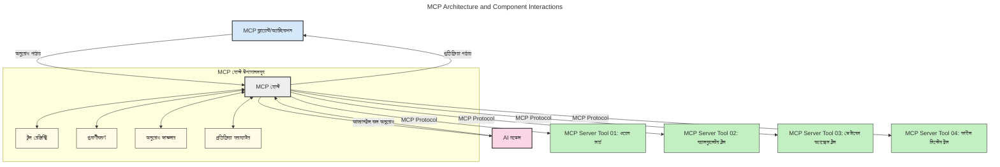
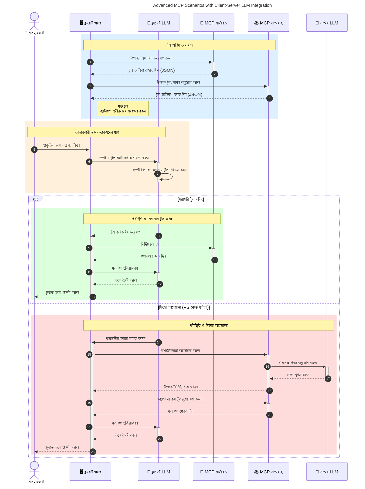

# মডেল প্রসঙ্গ প্রোটোকল (MCP) পরিচিতি: স্কেলেবল AI অ্যাপ্লিকেশনগুলির জন্য কেন এটি গুরুত্বপূর্ণ

[](https://youtu.be/agBbdiOPLQA)

_(এই পাঠের ভিডিও দেখতে উপরের ছবিতে ক্লিক করুন)_

জেনারেটিভ AI অ্যাপ্লিকেশনগুলি একটি অনন্য অগ্রগতি কারণ এগুলি প্রায়শই ব্যবহারকারীকে স্বাভাবিক ভাষার প্রম্পট ব্যবহার করে অ্যাপের সাথে মিথস্ক্রিয়া করার সুযোগ দেয়। তবে, যখন এই ধরনের অ্যাপে আরও সময় এবং সম্পদ বিনিয়োগ করা হয়, তখন আপনি চাইবেন যে আপনি সহজেই বিভিন্ন ফাংশনালিটি এবং সম্পদ সংহত করতে পারেন এমনভাবে যাতে এটি সহজে সম্প্রসারণযোগ্য হয়, আপনার অ্যাপ একাধিক মডেল ব্যবহারের জন্য প্রস্তুত থাকে, এবং বিভিন্ন মডেলের জটিলতা পরিচালনা করতে পারে। সংক্ষেপে, জেনারেটিভ AI অ্যাপ নির্মাণ করা শুরুতে সহজ, কিন্তু যখন এগুলো বৃদ্ধি পায় এবং জটিল হয়, তখন আপনাকে একটি স্থাপত্য নির্ধারণ শুরু করতে হবে এবং সম্ভবত একটি মানক অনুসরণ করতে হবে যাতে আপনার অ্যাপগুলি একটি নির্ভরযোগ্য পদ্ধতিতে নির্মিত হয়। এ অবস্থায় MCP এসে বিষয়গুলিকে সংগঠিত করে এবং একটি মানক প্রদান করে।

---

## **🔍 মডেল প্রসঙ্গ প্রোটোকল (MCP) কী?**

**মডেল প্রসঙ্গ প্রোটোকল (MCP)** একটি **খোলা, মানসম্মত ইন্টারফেস** যা বড় ভাষা মডেলগুলিকে (LLM) বাইরের সরঞ্জাম, API, এবং ডেটা উৎসের সাথে নির্বিঘ্নে যোগাযোগ করার অনুমতি দেয়। এটি একটি সামঞ্জস্যপূর্ণ স্থাপত্য প্রদান করে যা AI মডেলের কার্যকারিতা তাদের প্রশিক্ষণ ডেটার বাইরে বৃদ্ধি করে, বুদ্ধিমত্তা, স্কেলেবিলিটি এবং আরও সাড়া দেয় এমন AI সিস্টেমের জন্য সক্ষম করে তোলে।

---

## **🎯 AI-তে মানসম্মতকরণ কেন গুরুত্বপূর্ণ**

যেহেতু জেনারেটিভ AI অ্যাপ্লিকেশনগুলি আরও জটিল হয়ে উঠছে, তাই এমন মানদণ্ড আপنان করার প্রয়োজনীয়তা আছে যা **স্কেলেবিলিটি, সম্প্রসারণযোগ্যতা, রক্ষণাবেক্ষণযোগ্যতা,** এবং **ভেন্ডর লক-ইন এড়ানো** নিশ্চিত করে। MCP এই প্রয়োজনীয়তাগুলো পূরণ করে:

- মডেল-টুল ইন্টিগ্রেশনগুলিকে একীভূত করা
- দুর্বল, এককালীন কাস্টম সমাধান কমানো
- একক ইকোসিস্টেমে বিভিন্ন ভেন্ডরের একাধিক মডেল সম্মিলিতভাবে চলতে দেওয়া

**দ্রষ্টব্য:** MCP নিজেকে একটি খোলা মানদণ্ড হিসেবে বিল করে, তবে MCP কে IEEE, IETF, W3C, ISO বা অন্য কোনও বিদ্যমান মান সংস্থার মাধ্যমে মানদণ্ডায়িত করার কোনও পরিকল্পনা নেই।

---

## **📚 শেখার লক্ষ্যমাত্রা**

এই নিবন্ধের শেষে, আপনি সক্ষম হবেন:

- **মডেল প্রসঙ্গ প্রোটোকল (MCP)** কী এবং এর ব্যবহারের ক্ষেত্রগুলি সংজ্ঞায়িত করতে
- MCP কিভাবে মডেল-টু-টুল যোগাযোগ মানসম্মত করে তা বুঝতে
- MCP স্থাপত্যের মূল উপাদানগুলি চিনতে
- MCP এর বাস্তব জীবন প্রয়োগগুলি উদ্যোগ এবং উন্নয়ন প্রেক্ষাপটে অনুসন্ধান করতে

---

## **💡 মডেল প্রসঙ্গ প্রোটোকল (MCP) কেন একটি গেম-চেঞ্জার**

### **🔗 MCP AI মিথস্ক্রিয়ায় বিভাজন দূর করে**

MCP এর আগে, মডেল-সরঞ্জাম সংযোগের জন্য প্রয়োজন ছিল:

- প্রতিটি টুল-মডেল জোড়ার জন্য কাস্টম কোড
- প্রতিটি ভেন্ডরের জন্য অ-মানসম্মত API
- আপডেটের কারণে প্রায়ই ব্যবধান আসা
- বেশি সংখ্যক টুলের জন্য দুর্বল স্কেলেবিলিটি

### **✅ MCP মানসম্মতকরণের সুবিধাসমূহ**

| **সুবিধা**              | **বর্ণনা**                                                                |
|--------------------------|--------------------------------------------------------------------------|
| আন্তঃপরিবর্তনীয়তা    | LLM গুলো বিভিন্ন ভেন্ডারের টুলগুলোর সাথে নির্বিঘ্নে কাজ করে              |
| সামঞ্জস্য              | প্ল্যাটফর্ম এবং টুল জুড়ে একরকম আচরণ                                   |
| পুনব্যবহারযোগ্যতা     | একবার নির্মিত টুলগুলো প্রকল্প এবং সিস্টেম জুড়ে ব্যবহার করতে পারে           |
| ত্বরান্বিত উন্নয়ন     | মানসম্মত, প্লাগ-অ্যান্ড-প্লে ইন্টারফেস ব্যবহার করে ডেভ টাইম কমানো          |

---

## **🧱 উচ্চ-স্তরের MCP স্থাপত্য সংক্ষিপ্ত বিবরণ**

MCP একটি **ক্লায়েন্ট-সার্ভার মডেল** অনুসরণ করে, যেখানে:

- **MCP হোস্টরা** AI মডেল চালায়
- **MCP ক্লায়েন্টরা** অনুরোধ শুরু করে
- **MCP সার্ভাররা** প্রসঙ্গ, টুল এবং সক্ষমতা প্রদান করে

### **মূল উপাদান:**

- **সম্পদ** – মডেলের জন্য স্থির বা গতিশীল ডেটা  
- **প্রম্পট** – পরিচালিত গ্রন্থনাগুলির জন্য পূর্বনির্ধারিত কর্মপ্রবাহ  
- **টুলস** – অনুসন্ধান, হিসাব ইত্যাদি নির্বাহযোগ্য ফাংশন  
- **স্যাম্পলিং** – পুনরাবৃত্তিমূলক মিথস্ক্রিয়ার মাধ্যমে এজেন্টিক আচরণ (ভার্সন `2026-07-28` রিলিজ প্রার্থীতে বাতিল)  
- **ইলিসিটেশন** – ব্যবহারকারী ইনপুটের জন্য সার্ভার-নির্মিত অনুরোধ  
- **রুটস** – সার্ভার অ্যাক্সেস কন্ট্রোলের জন্য ফাইলসিস্টেম সীমানা (ভার্সন `2026-07-28` রিলিজ প্রার্থীতে বাতিল)  

### **প্রোটোকল স্থাপত্য:**

MCP দুটি স্তরের স্থাপত্য ব্যবহার করে:
- **ডেটা স্তর**: JSON-RPC 2.0 ভিত্তিক যোগাযোগ, জীবনচক্র ব্যবস্থাপনা এবং প্রিমিটিভ সহ
- **ট্রান্সপোর্ট স্তর**: STDIO (স্থানীয়) এবং স্ট্রিমেবল HTTP সহ SSE (রিমোট) যোগাযোগ চ্যানেল

---

## MCP সার্ভারগুলি কিভাবে কাজ করে

MCP সার্ভারগুলি নিচেরভাবে অপারেট করে:

- **অনুরোধ প্রবাহ**:
    1. একজন শেষ ব্যবহারকারী বা তাদের পক্ষ থেকে সফটওয়্যার দ্বারা একটি অনুরোধ শুরু হয়।
    2. **MCP ক্লায়েন্ট** একটি অনুরোধ পাঠায় এক **MCP হোস্ট**-কে, যেটি AI মডেল রানটাইম পরিচালনা করে।
    3. **AI মডেল** ব্যবহারকারীর প্রম্পট গ্রহণ করে এবং এক বা একাধিক টুল কলের মাধ্যমে বাইরের টুল বা ডেটার অ্যাক্সেস চাইতে পারে।
    4. **MCP হোস্ট** সরাসরি মডেল নয়, মানসম্মত প্রোটোকল ব্যবহার করে সংশ্লিষ্ট **MCP সার্ভার(গুলি)**-র সাথে যোগাযোগ করে।
- **MCP হোস্ট কার্যকারিতা**:
    - **টুল রেজিস্ট্রি**: উপলব্ধ টুল এবং তাদের সক্ষমতার তালিকা সংরক্ষণ করে।
    - **প্রমাণীকরণ**: টুল অ্যাক্সেসের অনুমতি যাচাই করে।
    - **অনুরোধ হ্যান্ডলার**: মডেলের পাঠানো টুল অনুরোধ প্রক্রিয়া করে।
    - **প্রতিক্রিয়া ফরম্যাটার**: এমন ফরম্যাটে টুল আউটপুট গঠন করে যা মডেল বুঝতে পারে।
- **MCP সার্ভার বাস্তবায়ন**:
    - **MCP হোস্ট** এক বা একাধিক **MCP সার্ভার**-কে টুল কল রুট করে, প্রতিটি বিশেষায়িত ফাংশন (যেমনঃ অনুসন্ধান, হিসাব, ডেটাবেস অনুসন্ধান) প্রদান করে।
    - **MCP সার্ভার(গুলি)** তাদের সংশ্লিষ্ট কাজ সম্পাদন করে এবং ফলাফলগুলি একটি সামঞ্জস্যপূর্ণ ফরম্যাটে **MCP হোস্ট**-কে ফেরত দেয়।
    - **MCP হোস্ট** ফলাফলগুলো ফরম্যাট করে এবং এগুলো AI মডেলের কাছে রিলে করে।
- **প্রতিক্রিয়া সম্পন্নকরণ**:
    - **AI মডেল** টুল আউটপুটগুলো চূড়ান্ত প্রতিক্রিয়ায় অন্তর্ভুক্ত করে।
    - **MCP হোস্ট** এই প্রতিক্রিয়া **MCP ক্লায়েন্ট**-কে পাঠায়, যা এটি শেষ ব্যবহারকারী বা কল করা সফটওয়্যারে সরবরাহ করে।
    



## 👨‍💻 কিভাবে MCP সার্ভার তৈরি করবেন (উদাহরণসহ)

MCP সার্ভার আপনাকে LLM ক্ষমতা সম্প্রসারণ করতে দেয় ডেটা এবং ফাংশনালিটি প্রদান করে।

চেষ্টা করতে готовы? এখানে বিভিন্ন ভাষা/স্ট্যাকের জন্য SDK এবং উদাহরণ রয়েছে যা বিভিন্ন ভাষা/স্ট্যাকে সাধারণ MCP সার্ভার তৈরি করার পদ্ধতি দেখায়:

- **Python SDK**: https://github.com/modelcontextprotocol/python-sdk

- **TypeScript SDK**: https://github.com/modelcontextprotocol/typescript-sdk

- **Java SDK**: https://github.com/modelcontextprotocol/java-sdk

- **C#/.NET SDK**: https://github.com/modelcontextprotocol/csharp-sdk


## 🌍 MCP এর বাস্তব জীবনের ব্যবহার ক্ষেত্রসমূহ

MCP AI ক্ষমতা সম্প্রসারণ করে বিভিন্ন ধরণের অ্যাপ্লিকেশন সক্রিয় করে:

| **অ্যাপ্লিকেশন**              | **বর্ণনা**                                                                |
|------------------------------|--------------------------------------------------------------------------|
| এন্টারপ্রাইজ ডেটা ইন্টিগ্রেশন | LLM গুলোকে ডেটাবেস, CRM, বা অভ্যন্তরীণ টুলের সাথে সংযোগ করানো            |
| এজেন্টিক AI সিস্টেম          | টুল অ্যাক্সেস এবং সিদ্ধান্ত গ্রহণ কর্মপ্রবাহের মাধ্যমে স্বয়ংক্রিয় এজেন্ট সক্ষম করা |
| মাল্টি-মোডাল অ্যাপ্লিকেশন   | পাঠ্য, ছবি, এবং অডিও টুল একক ঐকিক AI অ্যাপে সম্মিলিত করা                |
| রিয়েল-টাইম ডেটা ইন্টিগ্রেশন | AI মিথস্ক্রিয়াতে লাইভ ডেটা নিয়ে আসা অধিক সঠিক, বর্তমান আউটপুটের জন্য   |


### 🧠 MCP = AI মিথস্ক্রিয়ার সর্বজনীন মানদণ্ড

মডেল প্রসঙ্গ প্রোটোকল (MCP) AI মিথস্ক্রিয়ার জন্য একটি সর্বজনীন মানদণ্ড হিসেবে কাজ করে, ঠিক যেভাবে USB-C ডিভাইসগুলোর জন্য শারীরিক সংযোগকে মানসম্মত করেছে। AI জগতের মধ্যে, MCP একটি সামঞ্জস্যপূর্ণ ইন্টারফেস প্রদান করে, যা মডেল (ক্লায়েন্ট) গুলোকে বাহ্যিক টুল এবং ডেটা প্রদানকারী (সার্ভার)-এর সাথে নির্বিঘ্নে সংহত হতে দেয়। এতে প্রতিটি API বা ডেটা উৎসের জন্য বিচিত্র, কাস্টম প্রোটোকলের প্রয়োজনীয়তা মুছে যায়।

MCP এর অধীনে, MCP অনুকূল টুল (যাকে MCP সার্ভার বলা হয়) একটি একক মান অনুসরণ করে। এই সার্ভারগুলো তাদের সরবরাহকৃত টুল বা ক্রিয়াকলাপের তালিকা দিতে পারে এবং AI এজেন্টের অনুরোধে তারা সেই ক্রিয়াকলাপগুলি সম্পাদন করে। MCP সমর্থিত AI এজেন্ট প্ল্যাটফর্মগুলো সার্ভার থেকে উপলব্ধ টুল খুঁজে পেতে এবং এই মানসম্মত প্রোটোকলের মাধ্যমে সেগুলো আহ্বান করতে সক্ষম।

### 💡 জ্ঞানে সহজ প্রবেশাধিকারকে সহজতর করে

শুধুমাত্র টুল না দিয়েই, MCP জ্ঞানের প্রবেশাধিকারও সহজ করে। এটি অ্যাপ্লিকেশনগুলোকে বড় ভাষা মডেলগুলিকে (LLM) বিভিন্ন ডেটা উৎসের সাথে সংযুক্ত করে প্রসঙ্গ প্রদান করতে সক্ষম করে। উদাহরণস্বরূপ, একটি MCP সার্ভার হয়তো একটি কোম্পানির ডকুমেন্ট রিপোজিটরিকে প্রতিনিধিত্ব করবে, যা এজেন্টকে প্রাসঙ্গিক তথ্য প্রয়োজন অনুযায়ী আনতে দেবে। অন্য একটি সার্ভার ইমেইল পাঠানো বা রেকর্ড আপডেটের মতো নির্দিষ্ট ক্রিয়াকলাপ পরিচালনা করতে পারে। এজেন্ট দৃষ্টিভঙ্গি থেকে এগুলো কেবলমাত্র টুল যা এটি ব্যবহার করতে পারে—কিছু টুল ডেটা (জ্ঞান প্রসঙ্গ) প্রদান করে, অন্যগুলো ক্রিয়াকলাপ সম্পাদন করে। MCP দক্ষতার সাথে উভয়কেই পরিচালনা করে।

একটি এজেন্ট যখন একটি MCP সার্ভারের সাথে সংযুক্ত হয়, তখন স্বয়ংক্রিয়ভাবে সার্ভারের উপলব্ধ সক্ষমতা এবং প্রবেশযোগ্য ডেটা একটি মানসম্মত ফরম্যাটে জানতে পারে। এই মানসম্মতকরণ ডাইনামিক টুল উপলব্ধতা নিশ্চিত করে। উদাহরণস্বরূপ, একটি নতুন MCP সার্ভার একটি এজেন্টের সিস্টেমে যোগ করলে তার ফাংশনসমূহ অবিলম্বে ব্যবহারযোগ্য হয়, অতিরিক্ত কোন এজেন্টের নির্দেশনা কাস্টমাইজেশন ছাড়াই।

এই নির্মল সমন্বয় নিচের চিত্রে প্রদর্শিত প্রবাহের সাথে সঙ্গতিপূর্ণ, যেখানে সার্ভারগুলো টুল এবং জ্ঞান উভয়ই প্রদান করে, সিস্টেম জুড়ে নির্বিঘ্ন সহযোগিতা নিশ্চিত করে।

### 👉 উদাহরণ: স্কেলেবল এজেন্ট সমাধান

```mermaid
---
title: Scalable Agent Solution with MCP
description: A diagram illustrating how a user interacts with an LLM that connects to multiple MCP servers, with each server providing both knowledge and tools, creating a scalable AI system architecture
---
graph TD
    User -->|প্রম্পট| LLM
    LLM -->|উত্তর| User
    LLM -->|MCP| ServerA
    LLM -->|MCP| ServerB
    ServerA -->|ইউনিভার্সাল সংযোগকারী| ServerB
    ServerA --> KnowledgeA
    ServerA --> ToolsA
    ServerB --> KnowledgeB
    ServerB --> ToolsB

    subgraph সার্ভার এ
        KnowledgeA[জ্ঞান]
        ToolsA[সরঞ্জাম]
    end

    subgraph সার্ভার বি
        KnowledgeB[জ্ঞান]
        ToolsB[সরঞ্জাম]
    end
```
 ইউনিভার্সাল কানেক্টর MCP সার্ভারগুলোর মধ্যে যোগাযোগ এবং সক্ষমতা ভাগাভাগি করতে দেয়, ServerA কে ServerB এর কাছে কাজ য়োটাতে বা তার টুল ও জ্ঞানে অ্যাক্সেস করতে সক্ষম করে। এটি সার্ভার জুড়ে টুল এবং ডেটার ফেডারেশন ঘটায়, যা স্কেলেবল ও মডুলার এজেন্টিক স্থাপত্যসমূহকে সহায়তা করে। MCP টুল এক্সপোজারকে মানসম্মত করার কারণে, এজেন্টগুলো ডাইনামিকভাবে সার্ভার থেকে টুল খুঁজে পেতে এবং অনুরোধ প্রেরণ করতে পারে হার্ডকোডেড ইন্টিগ্রেশন ছাড়াই।


টুল এবং জ্ঞান ফেডারেশন: সার্ভার জুড়ে টুলস এবং ডেটা প্রবেশ করানো যায়, যা আরও স্কেলেবল ও মডুলার এজেন্টিক স্থাপত্য তৈরি করে।

### 🔄 ক্লায়েন্ট-পাশের LLM ইন্টিগ্রেশনসহ উন্নত MCP সিনারিও

মৌলিক MCP স্থাপত্যের বাইরে, এমন উন্নত সিনারিও রয়েছে যেখানে উভয় ক্লায়েন্ট ও সার্ভারেই LLM থাকে, যা আরও জটিল মিথস্ক্রিয়া সক্ষম করে। নিম্নলিখিত চিত্রে, **ক্লায়েন্ট অ্যাপ** একটি IDE হতে পারে যেখানে LLM ব্যবহারের জন্য MCP টুলস উপলব্ধ থাকে:



## 🔐 MCP এর ব্যবহারিক সুবিধাসমূহ

MCP ব্যবহারের ব্যবহারিক সুবিধাসমূহ হল:

- **তাজা তথ্য**: মডেলরা তাদের প্রশিক্ষণ ডেটার বাইরে আপডেটেড তথ্য অ্যাক্সেস করতে পারে
- **ক্ষমতা সম্প্রসারণ**: মডেলরা এমন বিশেষায়িত টুল ব্যবহার করতে পারে যা তাদের প্রশিক্ষণ হয়নি
- **হ্যালুসিনেশন হ্রাস**: বাইরের ডেটা উৎস সত্যভিত্তিক ভিত্তি প্রদান করে
- **গোপনীয়তা**: সংবেদনশীল ডেটা প্রম্পটের মধ্যে এমবেড হওয়ার পরিবর্তে নিরাপদ পরিবেশে থাকতে পারে

## 📌 মূল সারাংশ

MCP ব্যবহারের জন্য মূল সারাংশ সুত্রগুলি হল:

- **MCP** AI মডেলগুলো কিভাবে টুল এবং ডেটার সাথে মিথস্ক্রিয়া করে তা মানসম্মত করে
- **সম্প্রসারণযোগ্যতা, সামঞ্জস্য এবং আন্তঃপরিবর্তনীয়তা** প্রচার করে
- MCP উন্নয়ন সময় কমায়, নির্ভরযোগ্যতা বাড়ায় এবং মডেল ক্ষমতা বিস্তৃত করে
- ক্লায়েন্ট-সার্ভার স্থাপত্য নরম, সম্প্রসারণযোগ্য AI অ্যাপ্লিকেশন সক্ষম করে

## 🧠 অনুশীলন

আপনি যে AI অ্যাপ্লিকেশন তৈরি করতে ইচ্ছুক তা নিয়ে চিন্তা করুন।

- কোন **বাহ্যিক টুল বা ডেটা** এর মাধ্যমে এর ক্ষমতা বৃদ্ধি পেতে পারে?
- কিভাবে MCP ইন্টিগ্রেশনকে **সহজ এবং আরও নির্ভরযোগ্য** করতে পারে?

## অতিরিক্ত সম্পদ

- [MCP গিটহাব রিপোজিটরি](https://github.com/modelcontextprotocol)


## পরবর্তী ধাপ

পরবর্তী: [অধ্যায় ১: মূল ধারণা](../01-CoreConcepts/README.md)

---

<!-- CO-OP TRANSLATOR DISCLAIMER START -->
**অস্বীকৃতি**:
এই নথিটি AI অনুবাদ পরিষেবা [Co-op Translator](https://github.com/Azure/co-op-translator) ব্যবহার করে অনূদিত হয়েছে। যদিও আমরা শুদ্ধতার জন্য চেষ্টা করি, অনুগ্রহ করে মনে রাখবেন যে স্বয়ংক্রিয় অনুবাদে ত্রুটি বা অসঙ্গতি থাকতে পারে। মূল নথিটি তার স্বভাষায় কর্তৃত্বপূর্ণ উৎস হিসেবে বিবেচিত হওয়া উচিত। গুরুত্বপূর্ণ তথ্যের জন্য পেশাদার মানব অনুবাদ সুপারিশ করা হয়। এই অনুবাদের ব্যবহারে প্রয়োজনীয় ভুল বোঝাবুঝি বা ভুল ব্যাখ্যার জন্য আমরা দায়বদ্ধ নই।
<!-- CO-OP TRANSLATOR DISCLAIMER END -->