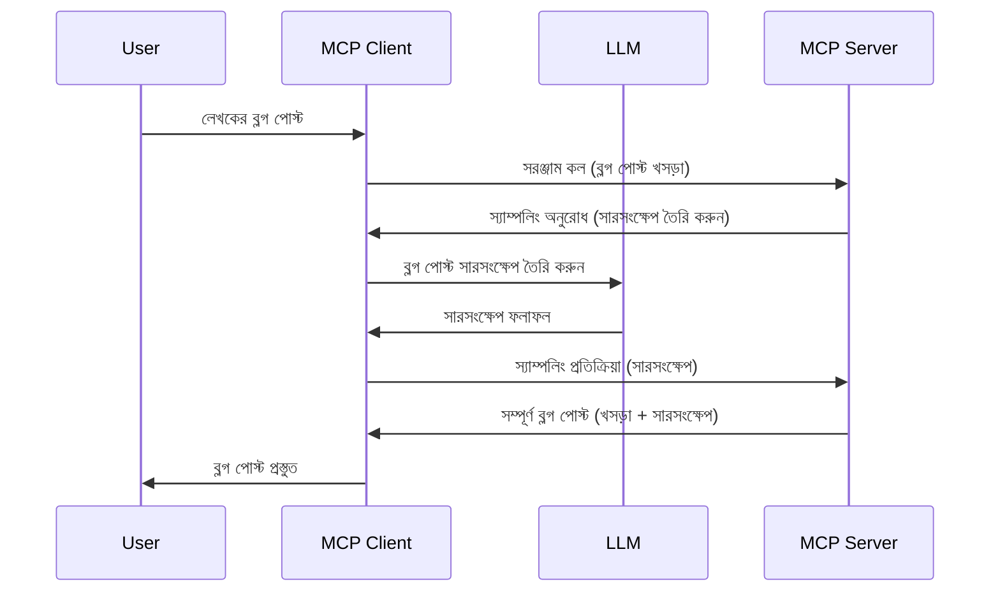

> [অপ্রচলিত: ২০২৬-০৭-২৮ রিলিজ ক্যান্ডিডেট](https://blog.modelcontextprotocol.io/posts/2026-07-28-release-candidate/)

# স্যাম্পলিং - ক্লায়েন্টকে বৈশিষ্ট্য প্রতিনিধি হিসেবে দেত্তয়া

> **অপ্রচলন নোটিশ:** `২০২৬-০৭-২৮` MCP স্পেসিফিকেশন রিলিজ ক্যান্ডিডেট স্যাম্পলিংকে অপ্রচলিত হিসেবে চিহ্নিত করেছে LLM প্রদানকারী API-র সাথে সরাসরি ইন্টিগ্রেশনের পক্ষে। স্যাম্পলিং `২০২৫-১১-২৫` এ কাজ চালিয়ে যাবে এবং কোনও আনুষ্ঠানিক অপ্রচলনের অন্তত এক বছর পরে পর্যন্ত তাই এই পাঠের সমস্ত কিছু প্রযোজ্য রয়েছে — কিন্তু নতুন সার্ভার ডিজাইনগুলি প্রতিস্থাপন প্যাটার্ন মূল্যায়ন করা উচিত। দেখুন [MCP-তে কী পরিবর্তন হচ্ছে: ২০২৬-০৭-২৮ রিলিজ ক্যান্ডিডেট](../../01-CoreConcepts/mcp-2026-07-28-release-candidate.md)।

কখনও কখনও, MCP ক্লায়েন্ট এবং MCP সার্ভারকে একটি সাধারণ লক্ষ্য অর্জনের জন্য সহযোগিতা করতে হয়। এমন একটি পরিস্থিতি থাকতে পারে যেখানে সার্ভার ক্লায়েন্টে থাকা একটি LLM-এর সাহায্য প্রয়োজন। এই পরিস্থিতির জন্য স্যাম্পলিং ব্যবহার করাই উচিত।

আসুন কিছু ব্যবহার ক্ষেত্রে অন্বেষণ করি এবং স্যাম্পলিং জড়িত সমাধান কীভাবে তৈরি করতে হয় তা দেখি।

## ওভারভিউ

এই পাঠে, আমরা স্যাম্পলিং কখন এবং কোথায় ব্যবহার করব এবং কীভাবে এটি কনফিগার করা যায় তা ব্যাখ্যা করতে ফোকাস করব।

## শেখার উদ্দেশ্য

এই অধ্যায়ে আমরা করব:

- স্যাম্পলিং কী এবং কখন এটি ব্যবহার করা হয় তা ব্যাখ্যা করা।
- MCP-তে স্যাম্পলিং কিভাবে কনফিগার করতে হয় তা প্রদর্শন করা।
- স্যাম্পলিংয়ের উদাহরণ প্রদান করা।

## স্যাম্পলিং কী এবং কেন ব্যবহার করবেন?

স্যাম্পলিং একটি উন্নত বৈশিষ্ট্য যা নিম্নরূপ কাজ করে:



### স্যাম্পলিং অনুরোধ

ঠিক আছে, এখন আমাদের কাছে একটি বিশ্বাসযোগ্য পরিস্থিতির সার্বিক চিত্র রয়েছে, চলুন সার্ভার থেকে ক্লায়েন্টে ফেরত পাঠানো স্যাম্পলিং অনুরোধের কথা বলি। JSON-RPC ফরম্যাটে এরকম একটি অনুরোধ দেখতে এরকম হতে পারে:

```json
{
  "jsonrpc": "2.0",
  "id": 1,
  "method": "sampling/createMessage",
  "params": {
    "messages": [
      {
        "role": "user",
        "content": {
          "type": "text",
          "text": "Create a blog post summary of the following blog post: <BLOG POST>"
        }
      }
    ],
    "modelPreferences": {
      "hints": [
        {
          "name": "claude-3-sonnet"
        }
      ],
      "intelligencePriority": 0.8,
      "speedPriority": 0.5
    },
    "systemPrompt": "You are a helpful assistant.",
    "maxTokens": 100
  }
}
```

এখানে কয়েকটি গুরুত্বপূর্ণ বিষয় রয়েছে:

- প্রম্পট, content -> text এর অধীনে, আমাদের প্রম্পট যা LLM-কে ব্লগ পোস্টের বিষয়বস্তু সংক্ষেপ করতে নির্দেশ দেয়।

- **modelPreferences**। এই অংশটি একটি পছন্দ, LLM-র সাথে ব্যবহার করার জন্য কনফিগারেশনের একটি সুপারিশ। ব্যবহারকারী এই সুপারিশ অনুসরণ করতে বা পরিবর্তন করতে পারে। এখানে মডেল ব্যবহার, গতি এবং বুদ্ধিমত্তা অগ্রাধিকার সম্পর্কে সুপারিশ রয়েছে।
- **systemPrompt**, এটি আপনার সাধারণ সিস্টেম প্রম্পট যা আপনার LLM-কে একটি ব্যক্তিত্ব দেয় এবং নির্দেশনার নির্দেশিকা ধারণ করে।
- **maxTokens**, এটি আরেকটি বৈশিষ্ট্য যা বলে দেয় এই কাজের জন্য কত টোকেন ব্যবহারের সুপারিশ করা হচ্ছে।

### স্যাম্পলিং প্রতিক্রিয়া

এই প্রতিক্রিয়াটি MCP ক্লায়েন্ট থেকে MCP সার্ভারে ফেরত পাঠানো হয় এবং এটি ক্লায়েন্টের LLM কল করার, সেই প্রতিক্রিয়ার জন্য অপেক্ষা করার এবং তারপর এই বার্তা তৈরি করার ফলাফল। JSON-RPC-তে এরকম হতে পারে:

```json
{
  "jsonrpc": "2.0",
  "id": 1,
  "result": {
    "role": "assistant",
    "content": {
      "type": "text",
      "text": "Here's your abstract <ABSTRACT>"
    },
    "model": "gpt-5",
    "stopReason": "endTurn"
  }
}
```

লক্ষ্য করুন প্রতিক্রিয়াটি ব্লগ পোস্টের সংক্ষেপ যেমন আমরা চেয়েছিলাম ঠিক তেমন, এবং ব্যবহৃত `model` আমরা যেটি চেয়েছিলাম না তার পরিবর্তে "gpt-5" "claude-3-sonnet" এর উপর ব্যবহার হয়েছে। এটি নির্দেশ করে যে ব্যবহারকারী সিদ্ধান্ত পরিবর্তন করতে পারে এবং আপনার স্যাম্পলিং অনুরোধ একটি সুপারিশ মাত্র।

ঠিক আছে, এখন আমরা মূল প্রবাহ বুঝে গেছি এবং "ব্লগ পোস্ট তৈরি + সংক্ষেপ" এর জন্য এটি একটি উপযোগী কাজ, চলুন দেখি এটি কাজ করার জন্য আমাদের কী করতে হবে।

### বার্তা ধরনের

স্যাম্পলিং বার্তাগুলি শুধুমাত্র টেক্সটেই সীমাবদ্ধ নয়, আপনি ছবি এবং অডিওও পাঠাতে পারেন। JSON-RPC এর পার্থক্য এরকম:

**টেক্সট**

```json
{
  "type": "text",
  "text": "The message content"
}
```

**চিত্র বিষয়বস্তু**

```json
{
  "type": "image",
  "data": "base64-encoded-image-data",
  "mimeType": "image/jpeg"
}
```

**অডিও বিষয়বস্তু**

```json
{
  "type": "audio",
  "data": "base64-encoded-audio-data",
  "mimeType": "audio/wav"
}
```

> নোট: স্যাম্পলিং সম্পর্কে আরও বিস্তারিত তথ্যের জন্য [অফিশিয়াল ডকুমেন্টেশন](https://modelcontextprotocol.io/specification/2025-11-25/client/sampling) দেখুন

## ক্লায়েন্টে স্যাম্পলিং কনফিগার করবেন কিভাবে

> নোট: আপনি যদি শুধুমাত্র একটি সার্ভার নির্মাণ করেন, এখানে খুব বেশি কিছু করার দরকার নেই।

একটি ক্লায়েন্টে, আপনাকে নিম্নলিখিত বৈশিষ্ট্যটি নির্দিষ্ট করতে হবে এভাবে:

```json
{
  "capabilities": {
    "sampling": {}
  }
}
```

এটি তখন আপনার নির্বাচিত ক্লায়েন্ট সার্ভারটির সাথে আরম্ভ করার সময় ব্যবহৃত হবে।

## কর্মে স্যাম্পলিং এর একটি উদাহরণ - একটি ব্লগ পোস্ট তৈরি করা

আসুন একসাথে একটি স্যাম্পলিং সার্ভার কোড করি, আমাদের নিম্নলিখিত কাজ করতে হবে:

1. সার্ভারে একটি টুল তৈরি করুন।
1. উক্ত টুল স্যাম্পলিং অনুরোধ তৈরি করবে
1. টুল ক্লায়েন্টের স্যাম্পলিং অনুরোধের উত্তর পাওয়ার জন্য অপেক্ষা করবে।
1. তারপর টুলের ফলাফল তৈরি করা হবে।

চলুন ধাপে ধাপে কোড দেখি:

### -১- টুল তৈরি করা

**python**

```python
@mcp.tool()
async def create_blog(title: str, content: str, ctx: Context[ServerSession, None]) -> str:
    """Create a blog post and generate a summary"""

```

### -২- একটি স্যাম্পলিং অনুরোধ তৈরি করা

আপনার টুলকে নিম্নলিখিত কোড দ্বারা বাড়ান:

**python**

```python
post = BlogPost(
        id=len(posts) + 1,
        title=title,
        content=content,
        abstract=""
    )

prompt = f"Create an abstract of the following blog post: title: {title} and draft: {content} "

result = await ctx.session.create_message(
        messages=[
            SamplingMessage(
                role="user",
                content=TextContent(type="text", text=prompt),
            )
        ],
        max_tokens=100,
)

```

### -৩- প্রতিক্রিয়ার জন্য অপেক্ষা করুন এবং প্রতিক্রিয়া ফেরত দিন

**python**

```python
post.abstract = result.content.text

posts.append(post)

# সম্পূর্ণ পণ্য ফেরত দিন
return json.dumps({
    "id": post.title,
    "abstract": post.abstract
})
```

### -৪- পূর্ণ কোড

**python**

```python
from starlette.applications import Starlette
from starlette.routing import Mount, Host

from mcp.server.fastmcp import Context, FastMCP

from mcp.server.session import ServerSession
from mcp.types import SamplingMessage, TextContent

import json


from uuid import uuid4
from typing import List
from pydantic import BaseModel


mcp = FastMCP("Blog post generator")

# app = FastAPI()

posts = []

class BlogPost(BaseModel):
    id: int
    title: str
    content: str
    abstract: str

posts: List[BlogPost] = []

@mcp.tool()
async def create_blog(title: str, content: str, ctx: Context[ServerSession, None]) -> str:
    """Create a blog post and generate a summary"""

    post = BlogPost(
        id=len(posts) + 1,
        title=title,
        content=content,
        abstract=""
    )

    prompt = f"Create an abstract of the following blog post: title: {title} and draft: {content} "

    result = await ctx.session.create_message(
        messages=[
            SamplingMessage(
                role="user",
                content=TextContent(type="text", text=prompt),
            )
        ],
        max_tokens=100,
    )

    post.abstract = result.content.text

    posts.append(post)

    # সম্পূর্ণ ব্লগ পোস্ট ফেরত দিন
    return json.dumps({
        "id": post.title,
        "abstract": post.abstract
    })

if __name__ == "__main__":
    print("Starting server...")
    # mcp.run()
    mcp.run(transport="streamable-http")

# অ্যাপ চালান: python server.py দিয়ে
```

### -৫- ভিজুয়াল স্টুডিও কোডে পরীক্ষা করা

এটি ভিজুয়াল স্টুডিও কোডে পরীক্ষা করার জন্য, নিম্নলিখিত কাজ করুন:

1. টার্মিনালে সার্ভার শুরু করুন
1. এটিকে *mcp.json* এ যোগ করুন (এবং নিশ্চিত করুন এটি চালু আছে) উদাহরণ স্বরূপ এই রকম:

   ```json
   "servers": {
      "blog-server": {
        "type": "http",
        "url": "http://localhost:8000/mcp"
      }
   }
   ```

1. একটি প্রম্পট টাইপ করুন:

   ```text
   create a blog post named "Where Python comes from", the content is "Python is actually named after Monty Python Flying Circus"
   ```

1. স্যাম্পলিং এর অনুমতি দিন। প্রথমবার এই পরীক্ষা চালালে একটি অতিরিক্ত ডায়ালগ দেখা যাবে যা আপনাকে গ্রহণ করতে হবে, তারপর আপনি একটি টুল চালানোর জন্য নিয়মিত ডায়ালগ দেখতে পাবেন

1. ফলাফলের পরিদর্শন করুন। ফলাফলগুলি GitHub Copilot Chat-এ সুন্দরভাবে প্রদর্শিত হবে এবং কাঁচা JSON প্রতিক্রিয়া ও দেখতে পারবেন।

**বোনাস**। ভিজুয়াল স্টুডিও কোড টুলিং স্যাম্পলিংয়ের জন্য চমৎকার সমর্থন রয়েছে। আপনি আপনার ইনস্টল করা সার্ভারের স্যাম্পলিং অ্যাক্সেস এইভাবে কনফিগার করতে পারেন:

1. এক্সটেনশন সেকশনে যান।
1. "MCP SERVERS - INSTALLED" সেকশনে আপনার ইনস্টল করা সার্ভারের জন্য কগ্ আইকন নির্বাচন করুন।
1 "Configure Model Access" নির্বাচন করুন, এখানে আপনি নির্ধারণ করতে পারেন কোন মডেলগুলো GitHub Copilot স্যাম্পলিং সম্পাদনের সময় ব্যবহার করতে পারবে। এছাড়াও "Show Sampling requests" নির্বাচন করে সাম্প্রতিক সব স্যাম্পলিং অনুরোধ দেখতে পারেন।

## অ্যাসাইনমেন্ট

এই অ্যাসাইনমেন্টে, আপনি একটি সামান্য ভিন্ন স্যাম্পলিং তৈরি করবেন অর্থাৎ একটি স্যাম্পলিং ইন্টিগ্রেশন যা একটি পণ্য বর্ণনা জেনারেট করতে সমর্থন করে। আপনার পরিস্থিতি হলো:

**পরিস্থিতি**: একটি ই-কমার্সের ব্যাক অফিস কর্মীদের সাহায্যের দরকার, পণ্য বর্ণনা তৈরি করতে অনেক সময় লাগে। তাই আপনাকে এমন একটি সমাধান তৈরি করতে হবে যেখানে "create_product" নামক একটি টুল কল করলে "title" এবং "keywords" আর্গুমেন্ট হিসাবে পাঠানো হবে এবং এটি একটি সম্পূর্ণ পণ্য তৈরি করবে যার মধ্যে "description" ক্ষেত্র থাকবে যা ক্লায়েন্টের LLM দ্বারা পূরণ করা হবে।

টিপ: পূর্বে যা শিখেছেন তা ব্যবহার করে এই সার্ভার এবং এর টুলটি তৈরি করুন একটি স্যাম্পলিং অনুরোধ ব্যবহার করে।

## সমাধান

[সমাধান](./solution/README.md)

## মূল শিক্ষা

স্যাম্পলিং একটি শক্তিশালী বৈশিষ্ট্য যা সার্ভারকে ক্লায়েন্টের সাহায্য নিতে এবং কাজগুলি ক্লায়েন্টকে দায়িত্ব দেওয়ার সুযোগ দেয় যখন LLM-র সাহায্য প্রয়োজন হয়।

## পরবর্তী কি

- [অধ্যায় ৪ - ব্যবহারিক বাস্তবায়ন](../../04-PracticalImplementation/README.md)

---

<!-- CO-OP TRANSLATOR DISCLAIMER START -->
**অস্বীকৃতি**:
এই নথিটি AI অনুবাদ পরিষেবা [Co-op Translator](https://github.com/Azure/co-op-translator) ব্যবহার করে অনূদিত হয়েছে। যদিও আমরা শুদ্ধতার জন্য চেষ্টা করি, অনুগ্রহ করে মনে রাখবেন যে স্বয়ংক্রিয় অনুবাদে ত্রুটি বা অসঙ্গতি থাকতে পারে। মূল নথিটি তার স্বভাষায় কর্তৃত্বপূর্ণ উৎস হিসেবে বিবেচিত হওয়া উচিত। গুরুত্বপূর্ণ তথ্যের জন্য পেশাদার মানব অনুবাদ সুপারিশ করা হয়। এই অনুবাদের ব্যবহারে প্রয়োজনীয় ভুল বোঝাবুঝি বা ভুল ব্যাখ্যার জন্য আমরা দায়বদ্ধ নই।
<!-- CO-OP TRANSLATOR DISCLAIMER END -->