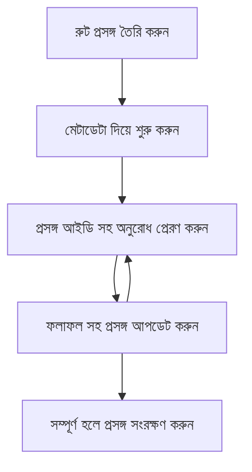

> [অপরিহার্য: ২০২৬-০৭-২৮ রিলিজ ক্যান্ডিডেট](https://blog.modelcontextprotocol.io/posts/2026-07-28-release-candidate/#roots-sampling-and-logging-are-deprecated)

# এমসিপি রুট কনটেক্সটস্

> **বর্জনের নোটিশ:** `২০২৬-০৭-২৮` এমসিপি স্পেসিফিকেশন রিলিজ ক্যান্ডিডেট টুল প্যারামিটারস্, রিসোর্স ইউআরআই, অথবা সার্ভার কনফিগারেশনের পক্ষে রুটস্ কে বর্জনযোগ্য হিসেবে চিহ্নিত করেছে। রুটস্ `২০২৫-১১-২৫` পর্যন্ত এবং আনুষ্ঠানিক বর্জনের কমপক্ষে এক বছর পরেও কার্যকর থাকে, তাই এই পাঠের সবকিছু বৈধই থাকবে — কিন্তু নতুন সার্ভার ডিজাইন গুলো বর্জনের পরিবর্তন প্যাটার্ন মূল্যায়ন করা উচিত। দেখুন [এমসিপি তে কি পরিবর্তন হচ্ছে: ২০২৬-০৭-২৮ রিলিজ ক্যান্ডিডেট](../../01-CoreConcepts/mcp-2026-07-28-release-candidate.md)।

রুট কনটেক্সটগুলো মডেল কনটেক্সট প্রোটোকলের একটি মৌলিক ধারণা যা একাধিক অনুরোধ এবং সেশনের মাঝে কথোপকথনের ইতিহাস এবং ভাগ করা অবস্থা বজায় রাখার জন্য একটি স্থায়ী স্তর প্রদান করে।

## পরিচিতি

এই পাঠে, আমরা এমসিপি তে রুট কনটেক্সট তৈরি, পরিচালনা এবং ব্যবহার করার পদ্ধতি জানব।

## শিখনের লক্ষ্যসমূহ

এই পাঠের শেষে, আপনি সক্ষম হবেন:

- রুট কনটেক্সটের উদ্দেশ্য ও গঠন বুঝতে
- এমসিপি ক্লায়েন্ট লাইব্রেরি ব্যবহার করে রুট কনটেক্সট তৈরি এবং পরিচালনা করতে
- .NET, জাভা, জাভাস্ক্রিপ্ট, এবং পাইথন অ্যাপ্লিকেশনে রুট কনটেক্সট প্রয়োগ করতে
- মাল্টি-টার্ন কথোপকথন এবং স্টেট ম্যানেজমেন্টের জন্য রুট কনটেক্সট ব্যবহার করতে
- রুট কনটেক্সট পরিচালনার জন্য সেরা পদ্ধতি প্রয়োগ করতে

## রুট কনটেক্সটগুলি বুঝা

রুট কনটেক্সটগুলো একটি ধারার সম্পর্কিত সংলাপের ইতিহাস এবং অবস্থা ধারণকারী ধারক হিসেবে কাজ করে। এগুলো সক্ষম করে:

- **কথোপকথন স্থায়িত্ব**: স্পষ্ট ও ধারাবাহিক মাল্টি-টার্ন কথোপকথন বজায় রাখা
- **মেমরি ম্যানেজমেন্ট**: কথোপকথনের মাঝে তথ্য সংরক্ষণ এবং পুনরুদ্ধার
- **স্টেট ম্যানেজমেন্ট**: জটিল ওয়ার্কফ্লোতে অগ্রগতি ট্র্যাক করা
- **কনটেক্সট শেয়ারিং**: একাধিক ক্লায়েন্টকে একই কথোপকথন অবস্থা প্রবেশাধিকার দেওয়া

এমসিপিতে, রুট কনটেক্সটের প্রধান বৈশিষ্ট্যগুলো হলো:

- প্রতিটি রুট কনটেক্সটের একটি অনন্য সনাক্তকারী থাকে।
- এতে কথোপকথন ইতিহাস, ব্যবহারকারীর প্রেফারেন্স এবং অন্যান্য মেটাডেটা থাকতে পারে।
- রুট কনটেক্সট তৈরি, প্রবেশ ও আর্কাইভ করা যায় যেভাবে প্রয়োজন।
- ফাইন-গ্রেইনড এক্সেস কন্ট্রোল ও অনুমতি সমর্থন করে।

## রুট কনটেক্সটের জীবনচক্র



## রুট কনটেক্সট নিয়ে কাজ করা

এখানে রুট কনটেক্সট তৈরি এবং পরিচালনার একটি উদাহরণ দেওয়া হলো।

### সি# ইমপ্লিমেন্টেশন

```csharp
// .NET Example: Root Context Management
using Microsoft.Mcp.Client;
using System;
using System.Threading.Tasks;
using System.Collections.Generic;

public class RootContextExample
{
    private readonly IMcpClient _client;
    private readonly IRootContextManager _contextManager;
    
    public RootContextExample(IMcpClient client, IRootContextManager contextManager)
    {
        _client = client;
        _contextManager = contextManager;
    }
    
    public async Task DemonstrateRootContextAsync()
    {
        // 1. Create a new root context
        var contextResult = await _contextManager.CreateRootContextAsync(new RootContextCreateOptions
        {
            Name = "Customer Support Session",
            Metadata = new Dictionary<string, string>
            {
                ["CustomerName"] = "Acme Corporation",
                ["PriorityLevel"] = "High",
                ["Domain"] = "Cloud Services"
            }
        });
        
        string contextId = contextResult.ContextId;
        Console.WriteLine($"Created root context with ID: {contextId}");
        
        // 2. First interaction using the context
        var response1 = await _client.SendPromptAsync(
            "I'm having issues scaling my web service deployment in the cloud.", 
            new SendPromptOptions { RootContextId = contextId }
        );
        
        Console.WriteLine($"First response: {response1.GeneratedText}");
        
        // Second interaction - the model will have access to the previous conversation
        var response2 = await _client.SendPromptAsync(
            "Yes, we're using containerized deployments with Kubernetes.", 
            new SendPromptOptions { RootContextId = contextId }
        );
        
        Console.WriteLine($"Second response: {response2.GeneratedText}");
        
        // 3. Add metadata to the context based on conversation
        await _contextManager.UpdateContextMetadataAsync(contextId, new Dictionary<string, string>
        {
            ["TechnicalEnvironment"] = "Kubernetes",
            ["IssueType"] = "Scaling"
        });
        
        // 4. Get context information
        var contextInfo = await _contextManager.GetRootContextInfoAsync(contextId);
        
        Console.WriteLine("Context Information:");
        Console.WriteLine($"- Name: {contextInfo.Name}");
        Console.WriteLine($"- Created: {contextInfo.CreatedAt}");
        Console.WriteLine($"- Messages: {contextInfo.MessageCount}");
        
        // 5. When the conversation is complete, archive the context
        await _contextManager.ArchiveRootContextAsync(contextId);
        Console.WriteLine($"Archived context {contextId}");
    }
}
```

উপরের কোডে আমরা করেছি:

1. গ্রাহক সাপোর্ট সেশনের জন্য একটি রুট কনটেক্সট তৈরি করেছি।
1. ঐ কনটেক্সটের মধ্যে একাধিক বার্তা পাঠিয়েছি, মডেলকে অবস্থা বজায় রাখতে সক্ষম করেছি।
1. কথোপকথনের ভিত্তিতে প্রাসঙ্গিক মেটাডেটা দিয়ে কনটেক্সট আপডেট করেছি।
1. কথোপকথন ইতিহাস বোঝার জন্য কনটেক্সট তথ্য পুনরুদ্ধার করেছি।
1. কথোপকথন শেষ হলে কনটেক্সট আর্কাইভ করেছি।

## উদাহরণ: আর্থিক বিশ্লেষণের জন্য রুট কনটেক্সট বাস্তবায়ন

এই উদাহরণে, আমরা আর্থিক বিশ্লেষণ সেশনের জন্য রুট কনটেক্সট তৈরি করব, যা একাধিক আন্তঃক্রিয়ার মাধ্যমে অবস্থা বজায় রাখার পদ্ধতি প্রদর্শন করে।

### জাভা ইমপ্লিমেন্টেশন

```java
// জাভা উদাহরণ: রুট কনটেক্সট ইমপ্লিমেন্টেশন
package com.example.mcp.contexts;

import com.mcp.client.McpClient;
import com.mcp.client.ContextManager;
import com.mcp.models.RootContext;
import com.mcp.models.McpResponse;

import java.util.HashMap;
import java.util.Map;
import java.util.UUID;

public class RootContextsDemo {
    private final McpClient client;
    private final ContextManager contextManager;
    
    public RootContextsDemo(String serverUrl) {
        this.client = new McpClient.Builder()
            .setServerUrl(serverUrl)
            .build();
            
        this.contextManager = new ContextManager(client);
    }
    
    public void demonstrateRootContext() throws Exception {
        // কনটেক্সট মেটাডাটা তৈরি করুন
        Map<String, String> metadata = new HashMap<>();
        metadata.put("projectName", "Financial Analysis");
        metadata.put("userRole", "Financial Analyst");
        metadata.put("dataSource", "Q1 2025 Financial Reports");
        
        // ১. নতুন একটি রুট কনটেক্সট তৈরি করুন
        RootContext context = contextManager.createRootContext("Financial Analysis Session", metadata);
        String contextId = context.getId();
        
        System.out.println("Created context: " + contextId);
        
        // ২. প্রথম ইন্টারঅ্যাকশন
        McpResponse response1 = client.sendPrompt(
            "Analyze the trends in Q1 financial data for our technology division",
            contextId
        );
        
        System.out.println("First response: " + response1.getGeneratedText());
        
        // ৩. প্রতিক্রিয়া থেকে প্রাপ্ত গুরুত্বপূর্ণ তথ্য দিয়ে কনটেক্সট আপডেট করুন
        contextManager.addContextMetadata(contextId, 
            Map.of("identifiedTrend", "Increasing cloud infrastructure costs"));
        
        // দ্বিতীয় ইন্টারঅ্যাকশন - একই কনটেক্সট ব্যবহার করে
        McpResponse response2 = client.sendPrompt(
            "What's driving the increase in cloud infrastructure costs?",
            contextId
        );
        
        System.out.println("Second response: " + response2.getGeneratedText());
        
        // ৪. বিশ্লেষণ সেশনের একটি সারাংশ তৈরি করুন
        McpResponse summaryResponse = client.sendPrompt(
            "Summarize our analysis of the technology division financials in 3-5 key points",
            contextId
        );
        
        // সারাংশটি কনটেক্সট মেটাডাটায় সংরক্ষণ করুন
        contextManager.addContextMetadata(contextId, 
            Map.of("analysisSummary", summaryResponse.getGeneratedText()));
            
        // আপডেট হওয়া কনটেক্সট তথ্য পান
        RootContext updatedContext = contextManager.getRootContext(contextId);
        
        System.out.println("Context Information:");
        System.out.println("- Created: " + updatedContext.getCreatedAt());
        System.out.println("- Last Updated: " + updatedContext.getLastUpdatedAt());
        System.out.println("- Analysis Summary: " + 
            updatedContext.getMetadata().get("analysisSummary"));
            
        // ৫. কাজ শেষ হলে কনটেক্সট সংরক্ষণ করুন
        contextManager.archiveContext(contextId);
        System.out.println("Context archived");
    }
}
```

উপরের কোডে আমরা করেছি:

1. আর্থিক বিশ্লেষণ সেশনের জন্য একটি রুট কনটেক্সট তৈরি করেছি।
2. ঐ কনটেক্সটের মধ্যে একাধিক বার্তা পাঠিয়েছি, মডেলকে অবস্থা বজায় রাখতে সক্ষম করেছি।
3. কথোপকথনের ভিত্তিতে প্রাসঙ্গিক মেটাডেটা দিয়ে কনটেক্সট আপডেট করেছি।
4. বিশ্লেষণ সেশনের সারাংশ তৈরি করে কনটেক্সট মেটাডেটায় সংরক্ষণ করেছি।
5. কথোপকথন শেষ হলে কনটেক্সট আর্কাইভ করেছি।

## উদাহরণ: রুট কনটেক্সট ব্যবস্থাপনা

কথোপকথন ইতিহাস ও অবস্থা বজায় রাখার জন্য রুট কনটেক্সট কার্যকরভাবে পরিচালনা করা অত্যন্ত গুরুত্বপূর্ণ। নিচে রুট কনটেক্সট ব্যবস্থাপনার একটি উদাহরণ দেওয়া হলো।

### জাভাস্ক্রিপ্ট ইমপ্লিমেন্টেশন

```javascript
// JavaScript উদাহরণ: MCP রুট কনটেক্সটগুলি পরিচালনা করা
const { McpClient, RootContextManager } = require('@mcp/client');

class ContextSession {
  constructor(serverUrl, apiKey = null) {
    // MCP ক্লায়েন্ট শুরু করুন
    this.client = new McpClient({
      serverUrl,
      apiKey
    });
    
    // কনটেক্সট ম্যানেজার শুরু করুন
    this.contextManager = new RootContextManager(this.client);
  }
  
  /**
   * Create a new conversation context
   * @param {string} sessionName - Name of the conversation session
   * @param {Object} metadata - Additional metadata for the context
   * @returns {Promise<string>} - Context ID
   */
  async createConversationContext(sessionName, metadata = {}) {
    try {
      const contextResult = await this.contextManager.createRootContext({
        name: sessionName,
        metadata: {
          ...metadata,
          createdAt: new Date().toISOString(),
          status: 'active'
        }
      });
      
      console.log(`Created root context '${sessionName}' with ID: ${contextResult.id}`);
      return contextResult.id;
    } catch (error) {
      console.error('Error creating root context:', error);
      throw error;
    }
  }
  
  /**
   * Send a message in an existing context
   * @param {string} contextId - The root context ID
   * @param {string} message - The user's message
   * @param {Object} options - Additional options
   * @returns {Promise<Object>} - Response data
   */
  async sendMessage(contextId, message, options = {}) {
    try {
      // নির্দিষ্ট করা কনটেক্সট ব্যবহার করে বার্তা পাঠান
      const response = await this.client.sendPrompt(message, {
        rootContextId: contextId,
        temperature: options.temperature || 0.7,
        allowedTools: options.allowedTools || []
      });
      
      // ঐচ্ছিকভাবে কথোপকথনের গুরুত্বপূর্ণ অন্তর্দৃষ্টি সংরক্ষণ করুন
      if (options.storeInsights) {
        await this.storeConversationInsights(contextId, message, response.generatedText);
      }
      
      return {
        message: response.generatedText,
        toolCalls: response.toolCalls || [],
        contextId
      };
    } catch (error) {
      console.error(`Error sending message in context ${contextId}:`, error);
      throw error;
    }
  }
  
  /**
   * Store important insights from a conversation
   * @param {string} contextId - The root context ID
   * @param {string} userMessage - User's message
   * @param {string} aiResponse - AI's response
   */
  async storeConversationInsights(contextId, userMessage, aiResponse) {
    try {
      // সম্ভাব্য অন্তর্দৃষ্টি বের করুন (একটি বাস্তব অ্যাপে, এটি আরও জটিল হবে)
      const combinedText = userMessage + "\n" + aiResponse;
      
      // সম্ভাব্য অন্তর্দৃষ্টি চিহ্নিত করার জন্য সহজ নীতি
      const insightWords = ["important", "key point", "remember", "significant", "crucial"];
      
      const potentialInsights = combinedText
        .split(".")
        .filter(sentence => 
          insightWords.some(word => sentence.toLowerCase().includes(word))
        )
        .map(sentence => sentence.trim())
        .filter(sentence => sentence.length > 10);
      
      // কনটেক্সট মেটাডেটায় অন্তর্দৃষ্টি সংরক্ষণ করুন
      if (potentialInsights.length > 0) {
        const insights = {};
        potentialInsights.forEach((insight, index) => {
          insights[`insight_${Date.now()}_${index}`] = insight;
        });
        
        await this.contextManager.updateContextMetadata(contextId, insights);
        console.log(`Stored ${potentialInsights.length} insights in context ${contextId}`);
      }
    } catch (error) {
      console.warn('Error storing conversation insights:', error);
      // অপ্রয়োজনীয় ত্রুটি, তাই শুধু সতর্কতা লগ করুন
    }
  }
  
  /**
   * Get summary information about a context
   * @param {string} contextId - The root context ID
   * @returns {Promise<Object>} - Context information
   */
  async getContextInfo(contextId) {
    try {
      const contextInfo = await this.contextManager.getContextInfo(contextId);
      
      return {
        id: contextInfo.id,
        name: contextInfo.name,
        created: new Date(contextInfo.createdAt).toLocaleString(),
        lastUpdated: new Date(contextInfo.lastUpdatedAt).toLocaleString(),
        messageCount: contextInfo.messageCount,
        metadata: contextInfo.metadata,
        status: contextInfo.status
      };
    } catch (error) {
      console.error(`Error getting context info for ${contextId}:`, error);
      throw error;
    }
  }
  
  /**
   * Generate a summary of the conversation in a context
   * @param {string} contextId - The root context ID
   * @returns {Promise<string>} - Generated summary
   */
  async generateContextSummary(contextId) {
    try {
      // এখন পর্যন্ত কথোপকথনের সারসংক্ষেপ তৈরি করতে মডেলকে প্রশ্ন করুন
      const response = await this.client.sendPrompt(
        "Please summarize our conversation so far in 3-4 sentences, highlighting the main points discussed.",
        { rootContextId: contextId, temperature: 0.3 }
      );
      
      // সারসংক্ষেপ কনটেক্সট মেটাডেটায় সংরক্ষণ করুন
      await this.contextManager.updateContextMetadata(contextId, {
        conversationSummary: response.generatedText,
        summarizedAt: new Date().toISOString()
      });
      
      return response.generatedText;
    } catch (error) {
      console.error(`Error generating context summary for ${contextId}:`, error);
      throw error;
    }
  }
  
  /**
   * Archive a context when it's no longer needed
   * @param {string} contextId - The root context ID
   * @returns {Promise<Object>} - Result of the archive operation
   */
  async archiveContext(contextId) {
    try {
      // সংরক্ষণের আগে একটি চূড়ান্ত সারসংক্ষেপ তৈরি করুন
      const summary = await this.generateContextSummary(contextId);
      
      // কনটেক্সট আর্কাইভ করুন
      await this.contextManager.archiveContext(contextId);
      
      return {
        status: "archived",
        contextId,
        summary
      };
    } catch (error) {
      console.error(`Error archiving context ${contextId}:`, error);
      throw error;
    }
  }
}

// উদাহরণ ব্যবহারের
async function demonstrateContextSession() {
  const session = new ContextSession('https://mcp-server-example.com');
  
  try {
    // 1. একটি পণ্য সহায়তা কথোপকথনের জন্য নতুন কনটেক্সট তৈরি করুন
    const contextId = await session.createConversationContext(
      'Product Support - Database Performance',
      {
        customer: 'Globex Corporation',
        product: 'Enterprise Database',
        severity: 'Medium',
        supportAgent: 'AI Assistant'
      }
    );
    
    // ২. কথোপকথনের প্রথম বার্তা
    const response1 = await session.sendMessage(
      contextId,
      "I'm experiencing slow query performance on our database cluster after the latest update.",
      { storeInsights: true }
    );
    console.log('Response 1:', response1.message);
    
    // একই কনটেক্সটে ফলো-আপ বার্তা
    const response2 = await session.sendMessage(
      contextId,
      "Yes, we've already checked the indexes and they seem to be properly configured.",
      { storeInsights: true }
    );
    console.log('Response 2:', response2.message);
    
    // ৩. কনটেক্সট সম্পর্কে তথ্য পান
    const contextInfo = await session.getContextInfo(contextId);
    console.log('Context Information:', contextInfo);
    
    // ৪. কথোপকথনের সারসংক্ষেপ তৈরি করুন এবং প্রদর্শন করুন
    const summary = await session.generateContextSummary(contextId);
    console.log('Conversation Summary:', summary);
    
    // ৫. কাজ শেষ হলে কনটেক্সট আর্কাইভ করুন
    const archiveResult = await session.archiveContext(contextId);
    console.log('Archive Result:', archiveResult);
    
    // ৬. যেকোনো ত্রুটি সুন্দরভাবে পরিচালনা করুন
  } catch (error) {
    console.error('Error in context session demonstration:', error);
  }
}

demonstrateContextSession();
```

উপরের কোডে আমরা করেছি:

1. `createConversationContext` ফাংশন ব্যবহার করে প্রোডাক্ট সাপোর্ট কথোপকথনের জন্য একটি রুট কনটেক্সট তৈরি করেছি। এখানে কনটেক্সটটি ডাটাবেস পারফরমেন্স সমস্যা নিয়ে।

1. `sendMessage` ফাংশন ব্যবহার করে ঐ কনটেক্সটের মধ্যে একাধিক বার্তা পাঠিয়েছি, মডেলকে অবস্থা বজায় রাখতে সক্ষম করেছি। পাঠানো বার্তাগুলো ছিল ধীর কুয়েরি পারফরমেন্স এবং ইনডেক্স কনফিগারেশন বিষয়ে।

1. কথোপকথনের ভিত্তিতে প্রাসঙ্গিক মেটাডেটা দিয়ে কনটেক্সট আপডেট করেছি।

1. `generateContextSummary` ফাংশন দিয়ে কথোপকথনের সারাংশ তৈরি করে কনটেক্সট মেটাডেটায় সংরক্ষণ করেছি।

1. কথোপকথন শেষ হলে `archiveContext` ফাংশন দিয়ে কনটেক্সট আর্কাইভ করেছি।

1. ত্রুটিগুলো সুন্দরভাবে পরিচালনা করেছি যাতে স্থায়িত্ব নিশ্চিত হয়।

## মাল্টি-টার্ন সহায়তার জন্য রুট কনটেক্সট

এই উদাহরণে, আমরা মাল্টি-টার্ন সহায়তা সেশনের জন্য একটি রুট কনটেক্সট তৈরি করব, যা একাধিক আন্তঃক্রিয়ার মাধ্যমে অবস্থা বজায় রাখার পদ্ধতি প্রদর্শন করে।

### পাইথন ইমপ্লিমেন্টেশন

```python
# পাইথন উদাহরণ: মাল্টি-টার্ন সহায়তার জন্য রুট প্রসঙ্গ
import asyncio
from datetime import datetime
from mcp_client import McpClient, RootContextManager

class AssistantSession:
    def __init__(self, server_url, api_key=None):
        self.client = McpClient(server_url=server_url, api_key=api_key)
        self.context_manager = RootContextManager(self.client)
    
    async def create_session(self, name, user_info=None):
        """Create a new root context for an assistant session"""
        metadata = {
            "session_type": "assistant",
            "created_at": datetime.now().isoformat(),
        }
        
        # যদি দেওয়া হয় তবে ব্যবহারকারীর তথ্য যুক্ত করুন
        if user_info:
            metadata.update({f"user_{k}": v for k, v in user_info.items()})
            
        # রুট প্রসঙ্গ তৈরি করুন
        context = await self.context_manager.create_root_context(name, metadata)
        return context.id
    
    async def send_message(self, context_id, message, tools=None):
        """Send a message within a root context"""
        # প্রসঙ্গ আইডি সহ বিকল্প তৈরি করুন
        options = {
            "root_context_id": context_id
        }
        
        # নির্দিষ্ট করা হলে সরঞ্জাম যোগ করুন
        if tools:
            options["allowed_tools"] = tools
        
        # প্রসঙ্গের মধ্যে প্রম্পট পাঠান
        response = await self.client.send_prompt(message, options)
        
        # কথোপকথনের অগ্রগতি সহ প্রসঙ্গ মেটাডেটা আপডেট করুন
        await self.context_manager.update_context_metadata(
            context_id,
            {
                f"message_{datetime.now().timestamp()}": message[:50] + "...",
                "last_interaction": datetime.now().isoformat()
            }
        )
        
        return response
    
    async def get_conversation_history(self, context_id):
        """Retrieve conversation history from a context"""
        context_info = await self.context_manager.get_context_info(context_id)
        messages = await self.client.get_context_messages(context_id)
        
        return {
            "context_info": context_info,
            "messages": messages
        }
    
    async def end_session(self, context_id):
        """End an assistant session by archiving the context"""
        # প্রথমে একটি সারাংশ প্রম্পট তৈরি করুন
        summary_response = await self.client.send_prompt(
            "Please summarize our conversation and any key points or decisions made.",
            {"root_context_id": context_id}
        )
        
        # মেটাডেটায় সারাংশ সংরক্ষণ করুন
        await self.context_manager.update_context_metadata(
            context_id,
            {
                "summary": summary_response.generated_text,
                "ended_at": datetime.now().isoformat(),
                "status": "completed"
            }
        )
        
        # প্রসঙ্গ সংরক্ষণ করুন
        await self.context_manager.archive_context(context_id)
        
        return {
            "status": "completed",
            "summary": summary_response.generated_text
        }

# উদাহরণের ব্যবহার
async def demo_assistant_session():
    assistant = AssistantSession("https://mcp-server-example.com")
    
    # ১. সেশন তৈরি করুন
    context_id = await assistant.create_session(
        "Technical Support Session",
        {"name": "Alex", "technical_level": "advanced", "product": "Cloud Services"}
    )
    print(f"Created session with context ID: {context_id}")
    
    # ২. প্রথম ইন্টারঅ্যাকশন
    response1 = await assistant.send_message(
        context_id, 
        "I'm having trouble with the auto-scaling feature in your cloud platform.",
        ["documentation_search", "diagnostic_tool"]
    )
    print(f"Response 1: {response1.generated_text}")
    
    # একই প্রসঙ্গে দ্বিতীয় ইন্টারঅ্যাকশন
    response2 = await assistant.send_message(
        context_id,
        "Yes, I've already checked the configuration settings you mentioned, but it's still not working."
    )
    print(f"Response 2: {response2.generated_text}")
    
    # ৩. ইতিহাস পান
    history = await assistant.get_conversation_history(context_id)
    print(f"Session has {len(history['messages'])} messages")
    
    # ৪. সেশন শেষ করুন
    end_result = await assistant.end_session(context_id)
    print(f"Session ended with summary: {end_result['summary']}")

if __name__ == "__main__":
    asyncio.run(demo_assistant_session())
```

উপরের কোডে আমরা করেছি:

1. `create_session` ফাংশন ব্যবহার করে একটি টেকনিক্যাল সাপোর্ট সেশনের জন্য রুট কনটেক্সট তৈরি করেছি। কনটেক্সটটিতে ব্যবহারকারীর তথ্য যেমন নাম এবং প্রযুক্তিগত স্তর অন্তর্ভুক্ত ছিল।

1. `send_message` ফাংশন ব্যবহার করে ঐ কনটেক্সটের মধ্যে একাধিক বার্তা পাঠিয়েছি, মডেলকে অবস্থা বজায় রাখতে সক্ষম করেছি। এই বার্তাগুলো ছিল অটো-স্কেলিং ফিচারের সমস্যা সম্বন্ধে।

1. `get_conversation_history` ফাংশন ব্যবহার করে কথোপকথন ইতিহাস পুনরুদ্ধার করেছি, যা কনটেক্সট তথ্য এবং বার্তা প্রদান করে।

1. সেশন শেষ করে কনটেক্সট আর্কাইভ এবং একটি সারাংশ তৈরি করেছি `end_session` ফাংশনের মাধ্যমে। সারাংশটি কথোপকথনের মূল পয়েন্টগুলো ধারণ করে।

## রুট কনটেক্সটের জন্য সেরা পদ্ধতি

রুট কনটেক্সট কার্যকরভাবে পরিচালনার জন্য কিছু সেরা পদ্ধতি নিচে দেওয়া হলো:

- **মনোনিবেশিত কনটেক্সট তৈরি করুন**: বিভিন্ন কথোপকথনের উদ্দেশ্য বা ডোমেইনের জন্য পৃথক রুট কনটেক্সট তৈরি করুন যাতে স্পষ্টতা বজায় থাকে।

- **মেয়াদ উত্তীর্ণ নীতি নির্ধারণ করুন**: পুরাতন কনটেক্সট আর্কাইভ বা মুছে ফেলার নীতি প্রয়োগ করুন যাতে স্টোরেজ নিয়ন্ত্রণ এবং ডাটা রিটেনশন নীতিমালি মেনে চলে।

- **প্রাসঙ্গিক মেটাডেটা সংরক্ষণ করুন**: কথোপকথন সম্পর্কিত গুরুত্বপূর্ণ তথ্য সংরক্ষণের জন্য কনটেক্সট মেটাডেটা ব্যবহার করুন যা পরবর্তীতে কাজে লাগতে পারে।

- **কনটেক্সট আইডি ধারাবাহিকভাবে ব্যবহার করুন**: একবার কনটেক্সট তৈরি হলে এর আইডি সকল সম্পর্কিত অনুরোধে ধারাবাহিকভাবে ব্যবহার করুন যাতে সম্পর্ক বজায় থাকে।

- **সারাংশ তৈরি করুন**: যখন কোনও কনটেক্সট বড় হয়ে যায়, তখন প্রয়োজনীয় তথ্য ধারণের জন্য সারাংশ তৈরি করা বিবেচনা করুন, এতে কনটেক্সট আকার নিয়ন্ত্রণে থাকে।

- **এক্সেস কন্ট্রোল প্রয়োগ করুন**: মাল্টি-ইউজার সিস্টেমের জন্য কথোপকথন কনটেক্সটের গোপনীয়তা ও নিরাপত্তার জন্য যথাযথ এক্সেস কন্ট্রোল বাস্তবায়ন করুন।

- **কনটেক্সট সীমাবদ্ধতা মোকাবেলা করুন**: কনটেক্সট আকারের সীমাবদ্ধতা সম্পর্কে সচেতন থাকুন এবং খুব দীর্ঘ কথোপকথনের ক্ষেত্রে ব্যবস্থাপনা কৌশল গ্রহণ করুন।

- **কথোপকথন সম্পন্ন হলে আর্কাইভ করুন**: কথোপকথন শেষ হলে কনটেক্সট আর্কাইভ করুন যাতে রিসোর্স মুক্ত হয় এবং কথোপকথনের ইতিহাস সংরক্ষিত থাকে।

## পরবর্তী বিষয়

- [৫.৫ রাউটিং](../mcp-routing/README.md)

---

<!-- CO-OP TRANSLATOR DISCLAIMER START -->
**অস্বীকৃতি**:
এই নথিটি AI অনুবাদ পরিষেবা [Co-op Translator](https://github.com/Azure/co-op-translator) ব্যবহার করে অনূদিত হয়েছে। যদিও আমরা শুদ্ধতার জন্য চেষ্টা করি, অনুগ্রহ করে মনে রাখবেন যে স্বয়ংক্রিয় অনুবাদে ত্রুটি বা অসঙ্গতি থাকতে পারে। মূল নথিটি তার স্বভাষায় কর্তৃত্বপূর্ণ উৎস হিসেবে বিবেচিত হওয়া উচিত। গুরুত্বপূর্ণ তথ্যের জন্য পেশাদার মানব অনুবাদ সুপারিশ করা হয়। এই অনুবাদের ব্যবহারে প্রয়োজনীয় ভুল বোঝাবুঝি বা ভুল ব্যাখ্যার জন্য আমরা দায়বদ্ধ নই।
<!-- CO-OP TRANSLATOR DISCLAIMER END -->