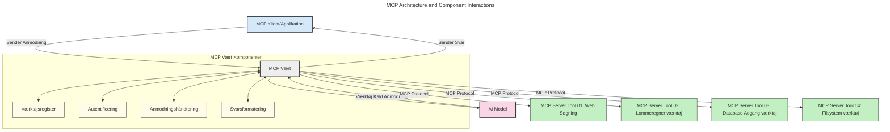
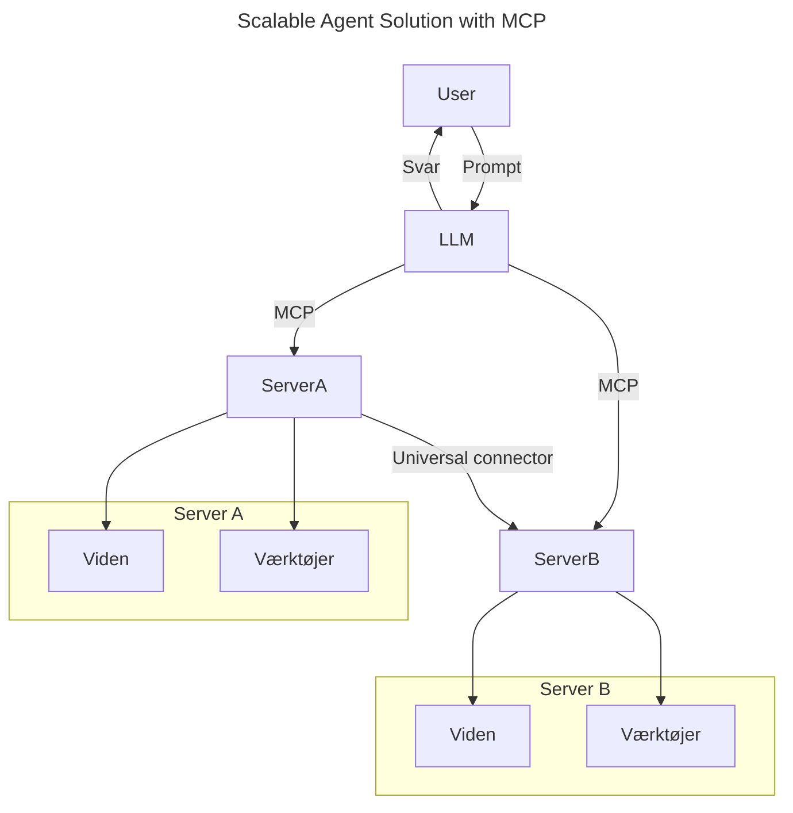
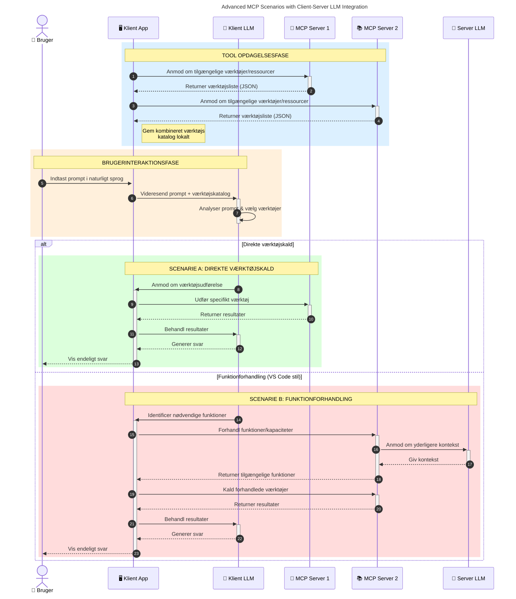

# Introduktion til Model Context Protocol (MCP): Hvorfor det er vigtigt for skalerbare AI-applikationer

_(Klik på billedet ovenfor for at se videoen til denne lektion)_

Generative AI-applikationer er et stort skridt fremad, da de ofte lader brugeren interagere med appen ved hjælp af naturlige sprogprompt. Men efterhånden som flere tid og ressourcer investeres i sådanne apps, vil du sikre, at du nemt kan integrere funktionaliteter og ressourcer på en måde, der gør det let at udvide, at din app kan håndtere mere end én model, og at den kan håndtere forskellige modelkompleksiteter. Kort sagt er det nemt at bygge Gen AI-apps i starten, men efterhånden som de vokser og bliver mere komplekse, skal du begynde at definere en arkitektur og sandsynligvis stole på en standard for at sikre, at dine apps bygges på en ensartet måde. Her kommer MCP ind for at organisere tingene og give en standard.

---

## **🔍 Hvad er Model Context Protocol (MCP)?**

**Model Context Protocol (MCP)** er en **åben, standardiseret grænseflade**, der tillader store sprogmodeller (LLM'er) at interagere problemfrit med eksterne værktøjer, API'er og datakilder. Den tilbyder en konsekvent arkitektur til at forbedre AI-models funktionalitet ud over deres træningsdata, hvilket muliggør klogere, skalerbare og mere responsive AI-systemer.

---

## **🎯 Hvorfor standardisering i AI er vigtigt**

Efterhånden som generative AI-applikationer bliver mere komplekse, er det essentielt at adoptere standarder, der sikrer **skalerbarhed, udvidelsesmuligheder, vedligeholdelse** og **undgåelse af leverandørlåsning**. MCP håndterer disse behov ved:

- Samling af model-værktøjs integrationer
- Reduktion af skrøbelige, enkeltstående tilpassede løsninger
- Tilladelse af flere modeller fra forskellige leverandører at eksistere inden for ét økosystem

**Bemærk:** Selvom MCP præsenterer sig som en åben standard, er der ingen planer om at standardisere MCP gennem eksisterende standardiseringsorganer som IEEE, IETF, W3C, ISO eller andre standardorganer.

---

## **📚 Læringsmål**

Ved afslutningen af denne artikel vil du kunne:

- Definere **Model Context Protocol (MCP)** og dets anvendelsestilfælde
- Forstå hvordan MCP standardiserer model-til-værktøj kommunikation
- Identificere kernekomponenterne i MCP-arkitekturen
- Udforske virkelige anvendelser af MCP i virksomheds- og udviklingskontekster

---

## **💡 Hvorfor Model Context Protocol (MCP) er en game-changer**

### **🔗 MCP løser fragmentering i AI-interaktioner**

Før MCP krævede integration af modeller med værktøjer:

- Tilpasset kode per værktøj-model par
- Ikke-standard API'er for hver leverandør
- Hyppige afbrydelser på grund af opdateringer
- Dårlig skalerbarhed med flere værktøjer

### **✅ Fordele ved MCP-standardisering**

| **Fordel**               | **Beskrivelse**                                                                |
|--------------------------|--------------------------------------------------------------------------------|
| Interoperabilitet        | LLM'er arbejder problemfrit med værktøjer på tværs af forskellige leverandører|
| Konsistens               | Ensartet opførsel på tværs af platforme og værktøjer                           |
| Genbrug                  | Værktøjer bygget én gang kan bruges i flere projekter og systemer              |
| Accelereret udvikling    | Reducer udviklingstid ved at bruge standardiserede, plug-and-play grænseflader |

---

## **🧱 Overordnet MCP-arkitektur oversigt**

MCP følger en **client-server model**, hvor:

- **MCP Hosts** kører AI-modellerne
- **MCP Clients** initierer forespørgsler
- **MCP Servers** leverer kontekst, værktøjer og funktionaliteter

### **Nøglekomponenter:**

- **Ressourcer** – Statisk eller dynamisk data til modeller  
- **Prompter** – Foruddefinerede workflows til guidet generering  
- **Værktøjer** – Eksekverbare funktioner som søgning, beregninger  
- **Sampling** – Agentisk adfærd via recursive interaktioner (forældet i `2026-07-28` releasekandidat)
- **Elicitering** – Server-initierede forespørgsler om brugerinput
- **Roots** – Filsystemgrænser for serveradgangskontrol (forældet i `2026-07-28` releasekandidat)

### **Protokolarkitektur:**

MCP bruger en to-lags arkitektur:
- **Datalag**: JSON-RPC 2.0 baseret kommunikation med livscyklusstyring og primitive funktioner
- **Transportlag**: STDIO (lokal) og Streamable HTTP med SSE (fjern) kommunikationskanaler

---

## Hvordan MCP-servere virker

MCP-servere opererer på følgende måde:

- **Forespørgselsflow**:
    1. En forespørgsel initieres af en slutbruger eller software, der handler på deres vegne.
    2. **MCP Clienten** sender forespørgslen til en **MCP Host**, som styrer AI-modellens runtime.
    3. **AI-modellen** modtager brugerens prompt og kan anmode om adgang til eksterne værktøjer eller data via en eller flere værktøjsopkald.
    4. **MCP Hosten**, ikke modellen direkte, kommunikerer med de relevante **MCP Server(e)** ved hjælp af den standardiserede protokol.
- **MCP Host Funktionalitet**:
    - **Værktøjsregister**: Vedligeholder en katalog over tilgængelige værktøjer og deres kapaciteter.
    - **Autentifikation**: Verificerer tilladelser for værktøjsadgang.
    - **Forespørgselsbehandler**: Behandler indkommende værktøjsforespørgsler fra modellen.
    - **Responsformaterer**: Strukturerer værktøjsoutput i et format, som modellen kan forstå.
- **MCP Server Eksekvering**:
    - **MCP Hosten** ruter værktøjsopkald til en eller flere **MCP Servere**, som hver eksponerer specialiserede funktioner (f.eks. søgning, beregninger, databaseforespørgsler).
    - **MCP Serverne** udfører deres respektive operationer og returnerer resultater til **MCP Hosten** i et konsistent format.
    - **MCP Hosten** formaterer og videresender disse resultater til **AI-modellen**.
- **Responsafslutning**:
    - **AI-modellen** inkorporerer værktøjsoutput i et endeligt svar.
    - **MCP Hosten** sender dette svar tilbage til **MCP Clienten**, som leverer det til slutbrugeren eller kaldende software.
    

## 👨‍💻 Hvordan man bygger en MCP-server (med eksempler)

MCP-servere giver dig mulighed for at udvide LLM-funktionaliteter ved at levere data og funktioner. 

Klar til at prøve? Her er sprog- og/eller stack-specifikke SDK'er med eksempler på at oprette simple MCP-servere i forskellige sprog/stacks:

- **Python SDK**: https://github.com/modelcontextprotocol/python-sdk

- **TypeScript SDK**: https://github.com/modelcontextprotocol/typescript-sdk

- **Java SDK**: https://github.com/modelcontextprotocol/java-sdk

- **C#/.NET SDK**: https://github.com/modelcontextprotocol/csharp-sdk

## 🌍 Virkelige anvendelsestilfælde for MCP

MCP muliggør en bred vifte af applikationer ved at udvide AI-funktionaliteter:

| **Anvendelse**               | **Beskrivelse**                                                                |
|------------------------------|--------------------------------------------------------------------------------|
| Enterprise Data Integration  | Forbind LLM'er til databaser, CRM'er eller interne værktøjer                   |
| Agentiske AI-systemer        | Muliggør autonome agenter med værktøjsadgang og beslutningsworkflows          |
| Multi-modale applikationer   | Kombiner tekst-, billede- og lydværktøjer i en samlet AI-app                   |
| Real-time data integration   | Bring live data ind i AI-interaktioner for mere præcise, aktuelle output      |

### 🧠 MCP = Universel standard for AI-interaktioner

Model Context Protocol (MCP) fungerer som en universel standard for AI-interaktioner, ligesom USB-C standardiserede fysiske forbindelser for enheder. I AI-verdenen giver MCP en konsekvent grænseflade, der gør det muligt for modeller (klienter) at integrere problemfrit med eksterne værktøjer og dataleverandører (servere). Dette eliminerer behovet for forskellige, tilpassede protokoller for hver API eller datakilde.

Under MCP følger et MCP-kompatibelt værktøj (kaldet en MCP-server) en samlet standard. Disse servere kan liste de værktøjer eller handlinger, de tilbyder, og eksekvere disse handlinger, når de anmodes af en AI-agent. AI-agentplatforme, der understøtter MCP, kan opdage tilgængelige værktøjer på serverne og kalde dem gennem denne standardprotokol.

### 💡 Faciliterer adgang til viden

Udover at tilbyde værktøjer faciliterer MCP også adgang til viden. Det gør det muligt for applikationer at give kontekst til store sprogmodeller (LLM'er) ved at forbinde dem til forskellige datakilder. For eksempel kan en MCP-server repræsentere et virksomheds dokumentlager, der gør det muligt for agenter at hente relevant information efter behov. En anden server kunne håndtere specifikke handlinger som at sende e-mails eller opdatere poster. Fra agentens perspektiv er dette blot værktøjer, det kan bruge — nogle værktøjer returnerer data (videns-kontekst), mens andre udfører handlinger. MCP håndterer begge effektivt.

En agent, der forbinder til en MCP-server, lærer automatisk serverens tilgængelige kapaciteter og tilgængelige data gennem et standardformat. Denne standardisering muliggør dynamisk tilgængelighed af værktøjer. For eksempel gør tilføjelsen af en ny MCP-server til en agents system dens funktioner straks brugbare uden yderligere tilpasning af agentens instruktioner.

Denne strømlinede integration stemmer overens med flowet vist i følgende diagram, hvor servere leverer både værktøjer og viden, hvilket sikrer problemfrit samarbejde på tværs af systemer. 

### 👉 Eksempel: Skalerbar agentløsning

Den Universelle Connector muliggør, at MCP-servere kan kommunikere og dele kapaciteter med hinanden, hvilket tillader ServerA at delegere opgaver til ServerB eller få adgang til dens værktøjer og viden. Dette føder værktøjer og data på tværs af servere, hvilket understøtter skalerbare og modulære agentarkitekturer. Fordi MCP standardiserer værktøjseksponering, kan agenter dynamisk opdage og dirigere forespørgsler mellem servere uden hårdkodede integrationer.

Værktøjs- og vidensføderation: Værktøjer og data kan tilgås på tværs af servere, hvilket muliggør mere skalerbare og modulære agentiske arkitekturer.

### 🔄 Avancerede MCP-scenarier med klient-side LLM-integration

Ud over den grundlæggende MCP-arkitektur findes der avancerede scenarier, hvor både klient og server indeholder LLM'er, hvilket muliggør mere sofistikerede interaktioner. I følgende diagram kunne **Client App** være et IDE med et antal MCP-værktøjer tilgængelige for brug via LLM'en:

## 🔐 Praktiske fordele ved MCP

Her er de praktiske fordele ved at bruge MCP:

- **Friskhed**: Modeller kan få adgang til opdateret information ud over deres træningsdata
- **Udvidelse af kapaciteter**: Modeller kan udnytte specialiserede værktøjer til opgaver, de ikke er trænet til
- **Reduceret hallucination**: Eksterne datakilder giver faktuel forankring
- **Privathed**: Følsomme data kan forblive i sikre miljøer i stedet for at blive indlejret i prompts

## 📌 Vigtige pointer

Følgende er nøglepointer for brug af MCP:

- **MCP** standardiserer, hvordan AI-modeller interagerer med værktøjer og data
- Fremmer **udvidelsesmuligheder, konsistens og interoperabilitet**
- MCP hjælper **med at reducere udviklingstid, forbedre pålidelighed og udvide modelkapaciteter**
- Klient-server arkitekturen **muliggør fleksible, udvidelige AI-applikationer**

## 🧠 Øvelse

Tænk på en AI-applikation, du er interesseret i at bygge.

- Hvilke **eksterne værktøjer eller data** kunne forbedre dens kapaciteter?
- Hvordan kunne MCP gøre integrationen **nemmere og mere pålidelig?**

## Yderligere ressourcer

- [MCP GitHub Repository](https://github.com/modelcontextprotocol)

## Hvad kommer herefter

Næste: [Kapitel 1: Kernebegreber](../01-CoreConcepts/README.md)

---

<!-- CO-OP TRANSLATOR DISCLAIMER START -->
**Ansvarsfraskrivelse**:
Dette dokument er blevet oversat ved hjælp af AI-oversættelsestjenesten [Co-op Translator](https://github.com/Azure/co-op-translator). Selvom vi bestræber os på nøjagtighed, skal du være opmærksom på, at automatiserede oversættelser kan indeholde fejl eller unøjagtigheder. Det originale dokument på dets oprindelige sprog bør betragtes som den autoritative kilde. For kritisk information anbefales professionel menneskelig oversættelse. Vi påtager os intet ansvar for misforståelser eller fejltolkninger, der opstår som følge af brugen af denne oversættelse.
<!-- CO-OP TRANSLATOR DISCLAIMER END -->