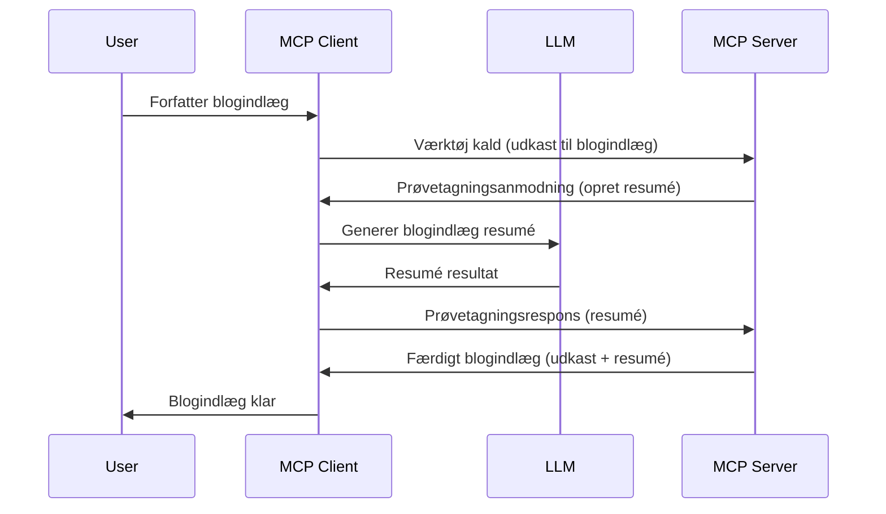

> [UDTJENT: 2026-07-28 RELEASE CANDIDATE](https://blog.modelcontextprotocol.io/posts/2026-07-28-release-candidate/)

# Sampling - deleger funktioner til Klienten

> **Afmeldingsbesked:** `2026-07-28` MCP specifikations udgivelseskandidat markerer Sampling som udtjent til fordel for direkte integration med LLM-udbyder API'er. Sampling fortsætter med at fungere i `2025-11-25` og i mindst et år efter enhver formel afmelding, så alt i denne lektion forbliver gyldigt — men nye serverdesign bør evaluere erstatningsmønstret. Se [Hvad ændres i MCP: Udgivelseskandidaten 2026-07-28](../../01-CoreConcepts/mcp-2026-07-28-release-candidate.md).

Nogle gange har du brug for, at MCP Klienten og MCP Serveren samarbejder for at opnå et fælles mål. Du kan have en situation, hvor Serveren har brug for hjælp fra en LLM, der sidder på klienten. Til denne situation er Sampling det, du bør bruge.

Lad os udforske nogle brugssager og hvordan man bygger en løsning, der involverer sampling.

## Oversigt

I denne lektion fokuserer vi på at forklare, hvornår og hvor man skal bruge Sampling, og hvordan man konfigurerer det.

## Læringsmål

I dette kapitel vil vi:

- Forklare hvad Sampling er, og hvornår det skal bruges.
- Vise hvordan man konfigurerer Sampling i MCP.
- Give eksempler på Sampling i praksis.

## Hvad er Sampling og hvorfor bruge det?

Sampling er en avanceret funktion, der fungerer på følgende måde:



### Sampling anmodning

Ok, nu har vi et overblik over et troværdigt scenarie, lad os tale om den sampling anmodning, som serveren sender tilbage til klienten. Her er, hvordan sådan en anmodning kan se ud i JSON-RPC format:

```json
{
  "jsonrpc": "2.0",
  "id": 1,
  "method": "sampling/createMessage",
  "params": {
    "messages": [
      {
        "role": "user",
        "content": {
          "type": "text",
          "text": "Create a blog post summary of the following blog post: <BLOG POST>"
        }
      }
    ],
    "modelPreferences": {
      "hints": [
        {
          "name": "claude-3-sonnet"
        }
      ],
      "intelligencePriority": 0.8,
      "speedPriority": 0.5
    },
    "systemPrompt": "You are a helpful assistant.",
    "maxTokens": 100
  }
}
```

Der er et par ting her værd at nævne:

- Prompt, under content -> text, er vores prompt som er en instruktion til LLM om at opsummere indholdet af blogindlægget.

- **modelPreferences**. Denne sektion er netop det, en præference, en anbefaling af hvilken konfiguration der skal bruges med LLM. Brugeren kan vælge om de vil følge disse anbefalinger eller ændre dem. I dette tilfælde er der anbefalinger om model at bruge samt hastighed og intelligens prioritet.
- **systemPrompt**, dette er din normale systemprompt, der giver din LLM en personlighed og indeholder vejledende instruktioner.
- **maxTokens**, dette er en anden egenskab, der bruges til at angive, hvor mange tokens der anbefales at bruge til denne opgave.

### Sampling svar

Dette svar er, hvad MCP Klienten til sidst sender tilbage til MCP Serveren og er resultatet af, at klienten kalder LLM'en, venter på det svar og derefter konstruerer denne besked. Her er, hvordan det kan se ud i JSON-RPC:

```json
{
  "jsonrpc": "2.0",
  "id": 1,
  "result": {
    "role": "assistant",
    "content": {
      "type": "text",
      "text": "Here's your abstract <ABSTRACT>"
    },
    "model": "gpt-5",
    "stopReason": "endTurn"
  }
}
```

Bemærk hvordan svaret er et abstrakt af blogindlægget præcis som vi bad om. Bemærk også, hvordan den brugte `model` ikke er den, vi bad om, men "gpt-5" over "claude-3-sonnet". Dette illustrerer, at brugeren kan skifte mening om, hvad der skal bruges, og at din sampling anmodning er en anbefaling.

Ok, nu hvor vi forstår hovedflowet, og en nyttig opgave at bruge det til "blogindlæg oprettelse + abstrakt", lad os se, hvad vi skal gøre for at få det til at fungere.

### Beskedtyper

Sampling beskeder er ikke begrænset til blot tekst, men du kan også sende billeder og lyd. Her er hvordan JSON-RPC ser anderledes ud:

**Tekst**

```json
{
  "type": "text",
  "text": "The message content"
}
```

**Billedindhold**

```json
{
  "type": "image",
  "data": "base64-encoded-image-data",
  "mimeType": "image/jpeg"
}
```

**Lydindhold**

```json
{
  "type": "audio",
  "data": "base64-encoded-audio-data",
  "mimeType": "audio/wav"
}
```

> BEMÆRK: for mere detaljeret info om Sampling, se [officielle dokumenter](https://modelcontextprotocol.io/specification/2025-11-25/client/sampling)

## Sådan konfigureres Sampling i Klienten

> Bemærk: hvis du kun bygger en server, behøver du ikke gøre meget her.

I en klient skal du specificere følgende funktion på denne måde:

```json
{
  "capabilities": {
    "sampling": {}
  }
}
```

Dette vil derefter blive opfanget, når din valgte klient initialiseres med serveren.

## Eksempel på Sampling i praksis - Opret et Blogindlæg

Lad os kode en sampling server sammen, vi skal gøre følgende:

1. Opret et værktøj på Serveren.
1. Dette værktøj skal oprette en sampling anmodning
1. Værktøjet skal vente på, at klientens sampling anmodning bliver besvaret.
1. Herefter skal værktøjets resultat produceres.

Lad os se koden trin for trin:

### -1- Opret værktøjet

**python**

```python
@mcp.tool()
async def create_blog(title: str, content: str, ctx: Context[ServerSession, None]) -> str:
    """Create a blog post and generate a summary"""

```

### -2- Opret en sampling anmodning

Udvid dit værktøj med følgende kode:

**python**

```python
post = BlogPost(
        id=len(posts) + 1,
        title=title,
        content=content,
        abstract=""
    )

prompt = f"Create an abstract of the following blog post: title: {title} and draft: {content} "

result = await ctx.session.create_message(
        messages=[
            SamplingMessage(
                role="user",
                content=TextContent(type="text", text=prompt),
            )
        ],
        max_tokens=100,
)

```

### -3- Vent på svaret og returner svaret

**python**

```python
post.abstract = result.content.text

posts.append(post)

# returner det komplette produkt
return json.dumps({
    "id": post.title,
    "abstract": post.abstract
})
```

### -4- Fuld kode

**python**

```python
from starlette.applications import Starlette
from starlette.routing import Mount, Host

from mcp.server.fastmcp import Context, FastMCP

from mcp.server.session import ServerSession
from mcp.types import SamplingMessage, TextContent

import json


from uuid import uuid4
from typing import List
from pydantic import BaseModel


mcp = FastMCP("Blog post generator")

# app = FastAPI()

posts = []

class BlogPost(BaseModel):
    id: int
    title: str
    content: str
    abstract: str

posts: List[BlogPost] = []

@mcp.tool()
async def create_blog(title: str, content: str, ctx: Context[ServerSession, None]) -> str:
    """Create a blog post and generate a summary"""

    post = BlogPost(
        id=len(posts) + 1,
        title=title,
        content=content,
        abstract=""
    )

    prompt = f"Create an abstract of the following blog post: title: {title} and draft: {content} "

    result = await ctx.session.create_message(
        messages=[
            SamplingMessage(
                role="user",
                content=TextContent(type="text", text=prompt),
            )
        ],
        max_tokens=100,
    )

    post.abstract = result.content.text

    posts.append(post)

    # returner det komplette blogindlæg
    return json.dumps({
        "id": post.title,
        "abstract": post.abstract
    })

if __name__ == "__main__":
    print("Starting server...")
    # mcp.kør()
    mcp.run(transport="streamable-http")

# kør app med: python server.py
```

### -5- Test det i Visual Studio Code

For at teste dette i Visual Studio Code, gør følgende:

1. Start server i terminal
1. Tilføj det til *mcp.json* (og sørg for at det er startet) eksempelvis sådan her:

   ```json
   "servers": {
      "blog-server": {
        "type": "http",
        "url": "http://localhost:8000/mcp"
      }
   }
   ```

1. Skriv en prompt:

   ```text
   create a blog post named "Where Python comes from", the content is "Python is actually named after Monty Python Flying Circus"
   ```

1. Tillad sampling at ske. Første gang du tester dette, vil du blive præsenteret for en ekstra dialog, som du skal acceptere, derefter vil du se den normale dialog, der beder dig om at køre et værktøj

1. Undersøg resultater. Du vil se resultaterne både flot gengivet i GitHub Copilot Chat, men du kan også undersøge det rå JSON-svar.

**Bonus**. Visual Studio Code værktøjerne har god understøttelse for sampling. Du kan konfigurere Sampling adgang på din installerede server ved at navigere til den sådan her:

1. Naviger til udvidelsesafsnittet.
1. Vælg tandhjulsikonet for din installerede server i afsnittet "MCP SERVERS - INSTALLED".
1 Vælg "Konfigurer Model Adgang", her kan du vælge hvilke modeller GitHub Copilot må bruge ved udførelse af sampling. Du kan også se alle sampling anmodninger, der er sket for nyligt, ved at vælge "Vis Sampling anmodninger".

## Opgave

I denne opgave skal du bygge en lidt anderledes Sampling, nemlig en sampling integration, der understøtter generering af en produktbeskrivelse. Her er dit scenarie:

**Scenario**: Backoffice-medarbejderen i en e-handel har brug for hjælp, det tager alt for lang tid at generere produktbeskrivelser. Derfor skal du bygge en løsning, hvor du kan kalde et værktøj "create_product" med "title" og "keywords" som argumenter, og det skal producere et komplet produkt inklusive et "description"-felt, der skal udfyldes af en klients LLM.

TIP: brug det, du lærte tidligere, til at konstruere denne server og dens værktøj ved hjælp af en sampling anmodning.

## Løsning

[Løsning](./solution/README.md)

## Vigtige pointer

Sampling er en kraftfuld funktion, der tillader serveren at delegere opgaver til klienten, når den har brug for hjælp fra en LLM.

## Hvad er Næste Skridt

- [Kapitel 4 - Praktisk implementering](../../04-PracticalImplementation/README.md)

---

<!-- CO-OP TRANSLATOR DISCLAIMER START -->
**Ansvarsfraskrivelse**:
Dette dokument er blevet oversat ved hjælp af AI-oversættelsestjenesten [Co-op Translator](https://github.com/Azure/co-op-translator). Selvom vi bestræber os på nøjagtighed, skal du være opmærksom på, at automatiserede oversættelser kan indeholde fejl eller unøjagtigheder. Det originale dokument på dets oprindelige sprog bør betragtes som den autoritative kilde. For kritisk information anbefales professionel menneskelig oversættelse. Vi påtager os intet ansvar for misforståelser eller fejltolkninger, der opstår som følge af brugen af denne oversættelse.
<!-- CO-OP TRANSLATOR DISCLAIMER END -->