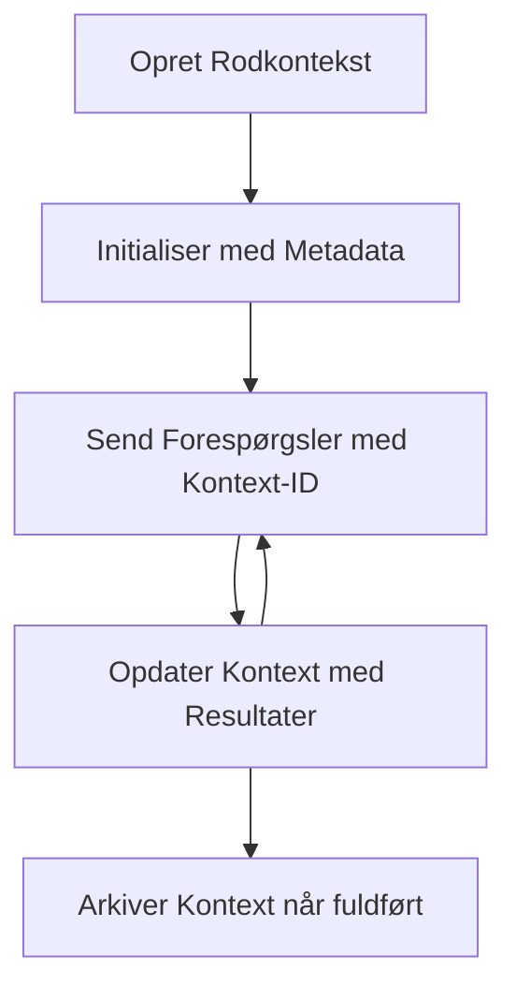

> [FORÆLDET: 2026-07-28 RELEASE CANDIDATE](https://blog.modelcontextprotocol.io/posts/2026-07-28-release-candidate/#roots-sampling-and-logging-are-deprecated)

# MCP Root Contexts

> **Bemærkning om forældelse:** MCP-specifikationsudgivelses-kandidaten `2026-07-28` markerer Roots som forældet til fordel for værktøjsparametre, ressource-URIs eller serverkonfiguration. Roots fortsætter med at fungere i `2025-11-25` og i mindst et år efter enhver formel forældelse, så alt i denne lektion forbliver gyldigt - men nye serverdesign bør evaluere erstatningsmønsteret. Se [Hvad ændres i MCP: Udgivelseskandidaten 2026-07-28](../../01-CoreConcepts/mcp-2026-07-28-release-candidate.md).

Root-kontekster er et fundamentalt koncept i Model Context Protocol, der giver et vedvarende lag til at opretholde samtalehistorik og delt tilstand på tværs af flere forespørgsler og sessioner.

## Introduktion

I denne lektion vil vi udforske, hvordan man opretter, administrerer og bruger root-kontekster i MCP.

## Læringsmål

Når du er færdig med denne lektion, vil du kunne:

- Forstå formålet og strukturen af root-kontekster
- Oprette og administrere root-kontekster ved hjælp af MCP-klientbiblioteker
- Implementere root-kontekster i .NET, Java, JavaScript og Python applikationer
- Bruge root-kontekster til multi-turn samtaler og tilstandsstyring
- Implementere bedste praksis for root-kontekst-administration

## Forstå Root-kontekster

Root-kontekster fungerer som containere, der holder historik og tilstand for en række relaterede interaktioner. De muliggør:

- **Samtalepersistens**: Opretholdelse af sammenhængende multi-turn samtaler
- **Hukommelsesstyring**: Lagre og hente oplysninger på tværs af interaktioner
- **Tilstandsstyring**: Spore fremskridt i komplekse arbejdsgange
- **Kontekstdeling**: Tillade flere klienter at få adgang til samme samtale-tilstand

I MCP har root-kontekster disse nøglekarakteristika:

- Hver root-kontekst har en unik identifikator.
- De kan indeholde samtalehistorik, brugerpræferencer og anden metadata.
- De kan oprettes, tilgås og arkiveres efter behov.
- De understøtter finmasket adgangskontrol og tilladelser.

## Root Context Lifecycle



## Arbejde med Root-kontekster

Her er et eksempel på, hvordan man opretter og administrerer root-kontekster.

### C# Implementation

```csharp
// .NET Example: Root Context Management
using Microsoft.Mcp.Client;
using System;
using System.Threading.Tasks;
using System.Collections.Generic;

public class RootContextExample
{
    private readonly IMcpClient _client;
    private readonly IRootContextManager _contextManager;
    
    public RootContextExample(IMcpClient client, IRootContextManager contextManager)
    {
        _client = client;
        _contextManager = contextManager;
    }
    
    public async Task DemonstrateRootContextAsync()
    {
        // 1. Create a new root context
        var contextResult = await _contextManager.CreateRootContextAsync(new RootContextCreateOptions
        {
            Name = "Customer Support Session",
            Metadata = new Dictionary<string, string>
            {
                ["CustomerName"] = "Acme Corporation",
                ["PriorityLevel"] = "High",
                ["Domain"] = "Cloud Services"
            }
        });
        
        string contextId = contextResult.ContextId;
        Console.WriteLine($"Created root context with ID: {contextId}");
        
        // 2. First interaction using the context
        var response1 = await _client.SendPromptAsync(
            "I'm having issues scaling my web service deployment in the cloud.", 
            new SendPromptOptions { RootContextId = contextId }
        );
        
        Console.WriteLine($"First response: {response1.GeneratedText}");
        
        // Second interaction - the model will have access to the previous conversation
        var response2 = await _client.SendPromptAsync(
            "Yes, we're using containerized deployments with Kubernetes.", 
            new SendPromptOptions { RootContextId = contextId }
        );
        
        Console.WriteLine($"Second response: {response2.GeneratedText}");
        
        // 3. Add metadata to the context based on conversation
        await _contextManager.UpdateContextMetadataAsync(contextId, new Dictionary<string, string>
        {
            ["TechnicalEnvironment"] = "Kubernetes",
            ["IssueType"] = "Scaling"
        });
        
        // 4. Get context information
        var contextInfo = await _contextManager.GetRootContextInfoAsync(contextId);
        
        Console.WriteLine("Context Information:");
        Console.WriteLine($"- Name: {contextInfo.Name}");
        Console.WriteLine($"- Created: {contextInfo.CreatedAt}");
        Console.WriteLine($"- Messages: {contextInfo.MessageCount}");
        
        // 5. When the conversation is complete, archive the context
        await _contextManager.ArchiveRootContextAsync(contextId);
        Console.WriteLine($"Archived context {contextId}");
    }
}
```

I den foregående kode har vi:

1. Oprettet en root-kontekst for en kundesupportsession.
1. Sendt flere beskeder inden for den kontekst, hvilket giver modellen mulighed for at opretholde tilstand.
1. Opdateret konteksten med relevant metadata baseret på samtalen.
1. Hentet kontekstinformation for at forstå samtalehistorikken.
1. Arkiveret konteksten, da samtalen var færdig.

## Eksempel: Root-kontekst-implementering til finansiel analyse

I dette eksempel vil vi oprette en root-kontekst for en finansiel analysesession og demonstrere, hvordan man opretholder tilstand på tværs af flere interaktioner.

### Java Implementation

```java
// Java Eksempel: Rodkontekst Implementering
package com.example.mcp.contexts;

import com.mcp.client.McpClient;
import com.mcp.client.ContextManager;
import com.mcp.models.RootContext;
import com.mcp.models.McpResponse;

import java.util.HashMap;
import java.util.Map;
import java.util.UUID;

public class RootContextsDemo {
    private final McpClient client;
    private final ContextManager contextManager;
    
    public RootContextsDemo(String serverUrl) {
        this.client = new McpClient.Builder()
            .setServerUrl(serverUrl)
            .build();
            
        this.contextManager = new ContextManager(client);
    }
    
    public void demonstrateRootContext() throws Exception {
        // Opret kontekst metadata
        Map<String, String> metadata = new HashMap<>();
        metadata.put("projectName", "Financial Analysis");
        metadata.put("userRole", "Financial Analyst");
        metadata.put("dataSource", "Q1 2025 Financial Reports");
        
        // 1. Opret en ny rodkontekst
        RootContext context = contextManager.createRootContext("Financial Analysis Session", metadata);
        String contextId = context.getId();
        
        System.out.println("Created context: " + contextId);
        
        // 2. Første interaktion
        McpResponse response1 = client.sendPrompt(
            "Analyze the trends in Q1 financial data for our technology division",
            contextId
        );
        
        System.out.println("First response: " + response1.getGeneratedText());
        
        // 3. Opdater kontekst med vigtige oplysninger opnået fra svar
        contextManager.addContextMetadata(contextId, 
            Map.of("identifiedTrend", "Increasing cloud infrastructure costs"));
        
        // Anden interaktion - brug af samme kontekst
        McpResponse response2 = client.sendPrompt(
            "What's driving the increase in cloud infrastructure costs?",
            contextId
        );
        
        System.out.println("Second response: " + response2.getGeneratedText());
        
        // 4. Generer et sammendrag af analysesessionen
        McpResponse summaryResponse = client.sendPrompt(
            "Summarize our analysis of the technology division financials in 3-5 key points",
            contextId
        );
        
        // Gem sammendraget i kontekst metadata
        contextManager.addContextMetadata(contextId, 
            Map.of("analysisSummary", summaryResponse.getGeneratedText()));
            
        // Hent opdaterede kontekst oplysninger
        RootContext updatedContext = contextManager.getRootContext(contextId);
        
        System.out.println("Context Information:");
        System.out.println("- Created: " + updatedContext.getCreatedAt());
        System.out.println("- Last Updated: " + updatedContext.getLastUpdatedAt());
        System.out.println("- Analysis Summary: " + 
            updatedContext.getMetadata().get("analysisSummary"));
            
        // 5. Arkiver kontekst når færdig
        contextManager.archiveContext(contextId);
        System.out.println("Context archived");
    }
}
```

I den foregående kode har vi:

1. Oprettet en root-kontekst for en finansiel analysesession.
2. Sendt flere beskeder inden for den kontekst, hvilket giver modellen mulighed for at opretholde tilstand.
3. Opdateret konteksten med relevant metadata baseret på samtalen.
4. Genereret et resumé af analysesessionen og gemt det i kontekstmetadataen.
5. Arkiveret konteksten, da samtalen var færdig.

## Eksempel: Root-kontekst-administration

Effektiv administration af root-kontekster er afgørende for at opretholde samtalehistorik og tilstand. Nedenfor er et eksempel på, hvordan man implementerer root-kontekst-administration.

### JavaScript Implementation

```javascript
// JavaScript eksempel: Håndtering af MCP Root Contexts
const { McpClient, RootContextManager } = require('@mcp/client');

class ContextSession {
  constructor(serverUrl, apiKey = null) {
    // Initialiser MCP-klienten
    this.client = new McpClient({
      serverUrl,
      apiKey
    });
    
    // Initialiser kontekststyring
    this.contextManager = new RootContextManager(this.client);
  }
  
  /**
   * Create a new conversation context
   * @param {string} sessionName - Name of the conversation session
   * @param {Object} metadata - Additional metadata for the context
   * @returns {Promise<string>} - Context ID
   */
  async createConversationContext(sessionName, metadata = {}) {
    try {
      const contextResult = await this.contextManager.createRootContext({
        name: sessionName,
        metadata: {
          ...metadata,
          createdAt: new Date().toISOString(),
          status: 'active'
        }
      });
      
      console.log(`Created root context '${sessionName}' with ID: ${contextResult.id}`);
      return contextResult.id;
    } catch (error) {
      console.error('Error creating root context:', error);
      throw error;
    }
  }
  
  /**
   * Send a message in an existing context
   * @param {string} contextId - The root context ID
   * @param {string} message - The user's message
   * @param {Object} options - Additional options
   * @returns {Promise<Object>} - Response data
   */
  async sendMessage(contextId, message, options = {}) {
    try {
      // Send beskeden ved hjælp af den angivne kontekst
      const response = await this.client.sendPrompt(message, {
        rootContextId: contextId,
        temperature: options.temperature || 0.7,
        allowedTools: options.allowedTools || []
      });
      
      // Valgfrit gem vigtige indsigter fra samtalen
      if (options.storeInsights) {
        await this.storeConversationInsights(contextId, message, response.generatedText);
      }
      
      return {
        message: response.generatedText,
        toolCalls: response.toolCalls || [],
        contextId
      };
    } catch (error) {
      console.error(`Error sending message in context ${contextId}:`, error);
      throw error;
    }
  }
  
  /**
   * Store important insights from a conversation
   * @param {string} contextId - The root context ID
   * @param {string} userMessage - User's message
   * @param {string} aiResponse - AI's response
   */
  async storeConversationInsights(contextId, userMessage, aiResponse) {
    try {
      // Udtræk potentielle indsigter (i en rigtig app ville dette være mere sofistikeret)
      const combinedText = userMessage + "\n" + aiResponse;
      
      // Enkel heuristik til at identificere potentielle indsigter
      const insightWords = ["important", "key point", "remember", "significant", "crucial"];
      
      const potentialInsights = combinedText
        .split(".")
        .filter(sentence => 
          insightWords.some(word => sentence.toLowerCase().includes(word))
        )
        .map(sentence => sentence.trim())
        .filter(sentence => sentence.length > 10);
      
      // Gem indsigter i kontekstmetadata
      if (potentialInsights.length > 0) {
        const insights = {};
        potentialInsights.forEach((insight, index) => {
          insights[`insight_${Date.now()}_${index}`] = insight;
        });
        
        await this.contextManager.updateContextMetadata(contextId, insights);
        console.log(`Stored ${potentialInsights.length} insights in context ${contextId}`);
      }
    } catch (error) {
      console.warn('Error storing conversation insights:', error);
      // Ikke-kritisk fejl, så log blot en advarsel
    }
  }
  
  /**
   * Get summary information about a context
   * @param {string} contextId - The root context ID
   * @returns {Promise<Object>} - Context information
   */
  async getContextInfo(contextId) {
    try {
      const contextInfo = await this.contextManager.getContextInfo(contextId);
      
      return {
        id: contextInfo.id,
        name: contextInfo.name,
        created: new Date(contextInfo.createdAt).toLocaleString(),
        lastUpdated: new Date(contextInfo.lastUpdatedAt).toLocaleString(),
        messageCount: contextInfo.messageCount,
        metadata: contextInfo.metadata,
        status: contextInfo.status
      };
    } catch (error) {
      console.error(`Error getting context info for ${contextId}:`, error);
      throw error;
    }
  }
  
  /**
   * Generate a summary of the conversation in a context
   * @param {string} contextId - The root context ID
   * @returns {Promise<string>} - Generated summary
   */
  async generateContextSummary(contextId) {
    try {
      // Bed modellen om at generere et resumé af samtalen indtil nu
      const response = await this.client.sendPrompt(
        "Please summarize our conversation so far in 3-4 sentences, highlighting the main points discussed.",
        { rootContextId: contextId, temperature: 0.3 }
      );
      
      // Gem resuméet i kontekstmetadata
      await this.contextManager.updateContextMetadata(contextId, {
        conversationSummary: response.generatedText,
        summarizedAt: new Date().toISOString()
      });
      
      return response.generatedText;
    } catch (error) {
      console.error(`Error generating context summary for ${contextId}:`, error);
      throw error;
    }
  }
  
  /**
   * Archive a context when it's no longer needed
   * @param {string} contextId - The root context ID
   * @returns {Promise<Object>} - Result of the archive operation
   */
  async archiveContext(contextId) {
    try {
      // Generer et endeligt resumé før arkivering
      const summary = await this.generateContextSummary(contextId);
      
      // Arkivér konteksten
      await this.contextManager.archiveContext(contextId);
      
      return {
        status: "archived",
        contextId,
        summary
      };
    } catch (error) {
      console.error(`Error archiving context ${contextId}:`, error);
      throw error;
    }
  }
}

// Eksempel på brug
async function demonstrateContextSession() {
  const session = new ContextSession('https://mcp-server-example.com');
  
  try {
    // 1. Opret en ny kontekst til en produktsupportsamtale
    const contextId = await session.createConversationContext(
      'Product Support - Database Performance',
      {
        customer: 'Globex Corporation',
        product: 'Enterprise Database',
        severity: 'Medium',
        supportAgent: 'AI Assistant'
      }
    );
    
    // 2. Første besked i samtalen
    const response1 = await session.sendMessage(
      contextId,
      "I'm experiencing slow query performance on our database cluster after the latest update.",
      { storeInsights: true }
    );
    console.log('Response 1:', response1.message);
    
    // Opfølgende besked i samme kontekst
    const response2 = await session.sendMessage(
      contextId,
      "Yes, we've already checked the indexes and they seem to be properly configured.",
      { storeInsights: true }
    );
    console.log('Response 2:', response2.message);
    
    // 3. Få information om konteksten
    const contextInfo = await session.getContextInfo(contextId);
    console.log('Context Information:', contextInfo);
    
    // 4. Generer og vis samtaleresumé
    const summary = await session.generateContextSummary(contextId);
    console.log('Conversation Summary:', summary);
    
    // 5. Arkivér konteksten når du er færdig
    const archiveResult = await session.archiveContext(contextId);
    console.log('Archive Result:', archiveResult);
    
    // 6. Håndter eventuelle fejl på en smidig måde
  } catch (error) {
    console.error('Error in context session demonstration:', error);
  }
}

demonstrateContextSession();
```

I den foregående kode har vi:

1. Oprettet en root-kontekst for en produktstøttesamtale med funktionen `createConversationContext`. I dette tilfælde handler konteksten om databasepræstationsproblemer.

1. Sendt flere beskeder inden for den kontekst, hvilket giver modellen mulighed for at opretholde tilstand med funktionen `sendMessage`. De sendte beskeder handler om langsom forespørgselspræstation og indekskonfiguration.

1. Opdateret konteksten med relevant metadata baseret på samtalen.

1. Genereret et resumé af samtalen og gemt det i kontekstmetadataen med funktionen `generateContextSummary`.

1. Arkiveret konteksten, da samtalen var færdig, med funktionen `archiveContext`.

1. Håndteret fejl på en robust måde for at sikre stabilitet.

## Root-kontekst til Multi-Turn Assistance

I dette eksempel vil vi oprette en root-kontekst for en multi-turn assistance-session og demonstrere, hvordan man opretholder tilstand på tværs af flere interaktioner.

### Python Implementation

```python
# Python-eksempel: Rodkontekst for flertrinsassistance
import asyncio
from datetime import datetime
from mcp_client import McpClient, RootContextManager

class AssistantSession:
    def __init__(self, server_url, api_key=None):
        self.client = McpClient(server_url=server_url, api_key=api_key)
        self.context_manager = RootContextManager(self.client)
    
    async def create_session(self, name, user_info=None):
        """Create a new root context for an assistant session"""
        metadata = {
            "session_type": "assistant",
            "created_at": datetime.now().isoformat(),
        }
        
        # Tilføj brugeroplysninger, hvis de er angivet
        if user_info:
            metadata.update({f"user_{k}": v for k, v in user_info.items()})
            
        # Opret rodkontext
        context = await self.context_manager.create_root_context(name, metadata)
        return context.id
    
    async def send_message(self, context_id, message, tools=None):
        """Send a message within a root context"""
        # Opret indstillinger med kontekst-ID
        options = {
            "root_context_id": context_id
        }
        
        # Tilføj værktøjer, hvis angivet
        if tools:
            options["allowed_tools"] = tools
        
        # Send prompten inden for konteksten
        response = await self.client.send_prompt(message, options)
        
        # Opdater kontekstmetadata med samtaleforløb
        await self.context_manager.update_context_metadata(
            context_id,
            {
                f"message_{datetime.now().timestamp()}": message[:50] + "...",
                "last_interaction": datetime.now().isoformat()
            }
        )
        
        return response
    
    async def get_conversation_history(self, context_id):
        """Retrieve conversation history from a context"""
        context_info = await self.context_manager.get_context_info(context_id)
        messages = await self.client.get_context_messages(context_id)
        
        return {
            "context_info": context_info,
            "messages": messages
        }
    
    async def end_session(self, context_id):
        """End an assistant session by archiving the context"""
        # Generer først en opsummeringsprompt
        summary_response = await self.client.send_prompt(
            "Please summarize our conversation and any key points or decisions made.",
            {"root_context_id": context_id}
        )
        
        # Gem opsummering i metadata
        await self.context_manager.update_context_metadata(
            context_id,
            {
                "summary": summary_response.generated_text,
                "ended_at": datetime.now().isoformat(),
                "status": "completed"
            }
        )
        
        # Arkiver konteksten
        await self.context_manager.archive_context(context_id)
        
        return {
            "status": "completed",
            "summary": summary_response.generated_text
        }

# Eksempel på brug
async def demo_assistant_session():
    assistant = AssistantSession("https://mcp-server-example.com")
    
    # 1. Opret session
    context_id = await assistant.create_session(
        "Technical Support Session",
        {"name": "Alex", "technical_level": "advanced", "product": "Cloud Services"}
    )
    print(f"Created session with context ID: {context_id}")
    
    # 2. Første interaktion
    response1 = await assistant.send_message(
        context_id, 
        "I'm having trouble with the auto-scaling feature in your cloud platform.",
        ["documentation_search", "diagnostic_tool"]
    )
    print(f"Response 1: {response1.generated_text}")
    
    # Anden interaktion i samme kontekst
    response2 = await assistant.send_message(
        context_id,
        "Yes, I've already checked the configuration settings you mentioned, but it's still not working."
    )
    print(f"Response 2: {response2.generated_text}")
    
    # 3. Hent historik
    history = await assistant.get_conversation_history(context_id)
    print(f"Session has {len(history['messages'])} messages")
    
    # 4. Afslut session
    end_result = await assistant.end_session(context_id)
    print(f"Session ended with summary: {end_result['summary']}")

if __name__ == "__main__":
    asyncio.run(demo_assistant_session())
```

I den foregående kode har vi:

1. Oprettet en root-kontekst for en teknisk supportsession med funktionen `create_session`. Konteksten indeholder brugeroplysninger såsom navn og teknisk niveau.

1. Sendt flere beskeder inden for den kontekst, hvilket giver modellen mulighed for at opretholde tilstand med funktionen `send_message`. De sendte beskeder drejer sig om problemer med auto-skalering funktionaliteten.

1. Hentet samtalehistorik ved hjælp af funktionen `get_conversation_history`, som giver kontekstinformation og beskeder.

1. Afsluttet sessionen ved at arkivere konteksten og generere et resumé med funktionen `end_session`. Resuméet indfanger nøglepunkter fra samtalen.

## Bedste praksis for root-kontekst

Her er nogle bedste praksis for effektiv administration af root-kontekster:

- **Opret fokuserede kontekster**: Opret separate root-kontekster for forskellige samtaleformål eller domæner for at bevare klarhed.

- **Sæt udløbspolitikker**: Implementer politikker for at arkivere eller slette gamle kontekster for at håndtere lagring og overholde datalagringspolitikker.

- **Gem relevant metadata**: Brug kontekstmetadata til at lagre vigtig information om samtalen, som kan være nyttig senere.

- **Brug kontekst-ID'er konsekvent**: Når en kontekst er oprettet, brug dens ID konsekvent for alle relaterede forespørgsler for at opretholde kontinuitet.

- **Generer resuméer**: Når en kontekst vokser stor, overvej at generere resuméer for at fange væsentlig information, samtidig med at kontekststørrelsen håndteres.

- **Implementer adgangskontrol**: For multi-brugersystemer skal du implementere passende adgangskontrol for at sikre privatliv og sikkerhed af samtalekontekster.

- **Håndter kontekstbegrænsninger**: Vær opmærksom på kontekststørrelsesbegrænsninger og implementer strategier for håndtering af meget lange samtaler.

- **Arkiver ved afslutning**: Arkiver kontekster, når samtaler er afsluttet, for at frigøre ressourcer samtidig med at samtalehistorikken bevares.

## Hvad er det næste?

- [5.5 Routing](../mcp-routing/README.md)

---

<!-- CO-OP TRANSLATOR DISCLAIMER START -->
**Ansvarsfraskrivelse**:
Dette dokument er blevet oversat ved hjælp af AI-oversættelsestjenesten [Co-op Translator](https://github.com/Azure/co-op-translator). Selvom vi bestræber os på nøjagtighed, skal du være opmærksom på, at automatiserede oversættelser kan indeholde fejl eller unøjagtigheder. Det originale dokument på dets oprindelige sprog bør betragtes som den autoritative kilde. For kritisk information anbefales professionel menneskelig oversættelse. Vi påtager os intet ansvar for misforståelser eller fejltolkninger, der opstår som følge af brugen af denne oversættelse.
<!-- CO-OP TRANSLATOR DISCLAIMER END -->