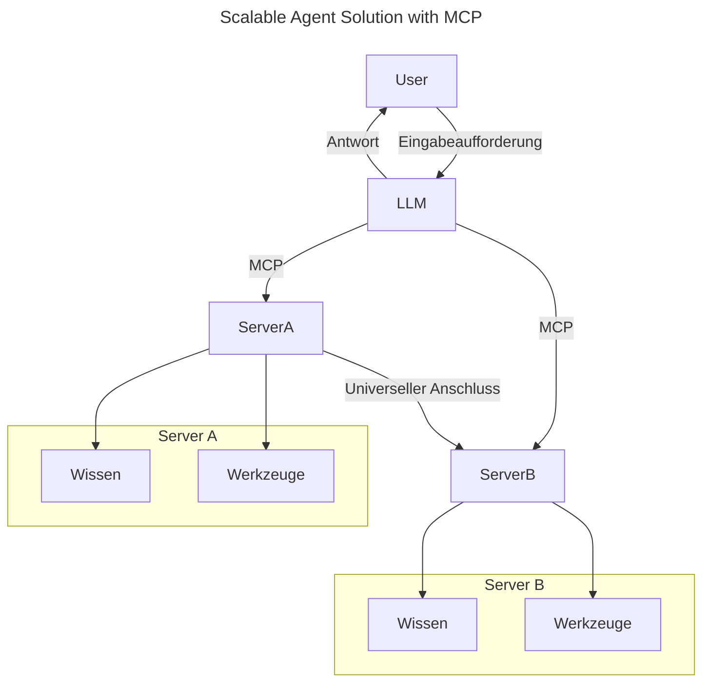
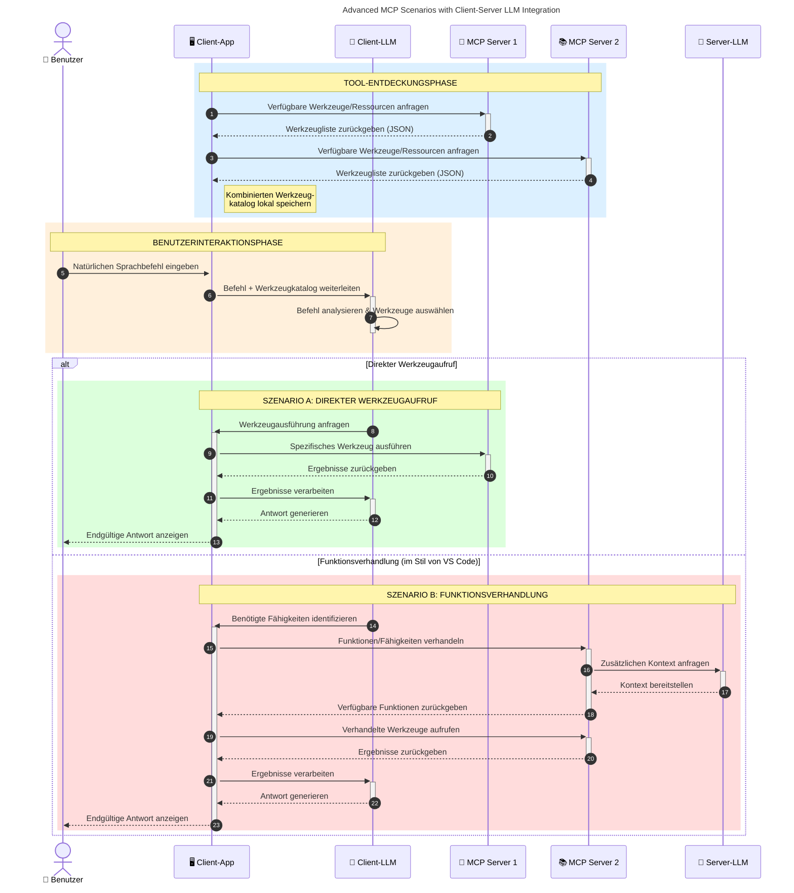

# Einführung in das Model Context Protocol (MCP): Warum es für skalierbare KI-Anwendungen wichtig ist

[](https://youtu.be/agBbdiOPLQA)

_(Klicken Sie auf das Bild oben, um das Video zu dieser Lektion anzusehen)_

Generative KI-Anwendungen sind ein großer Fortschritt, da sie dem Benutzer oft erlauben, mit der App über natürlichsprachliche Eingaben zu interagieren. Wenn jedoch mehr Zeit und Ressourcen in solche Apps investiert werden, möchten Sie sicherstellen, dass Sie Funktionen und Ressourcen so integrieren können, dass die Erweiterung einfach ist, dass Ihre App mehrere Modelle unterstützen kann und verschiedene Modellbesonderheiten handhabt. Kurz gesagt, das Erstellen von generativen KI-Apps ist anfangs einfach, aber mit wachsender Komplexität müssen Sie eine Architektur definieren und wahrscheinlich auf einen Standard zurückgreifen, um eine konsistente Erstellung Ihrer Apps sicherzustellen. Hier kommt MCP ins Spiel, um alles zu organisieren und einen Standard bereitzustellen.

---

## **🔍 Was ist das Model Context Protocol (MCP)?**

Das **Model Context Protocol (MCP)** ist eine **offene, standardisierte Schnittstelle**, die es großen Sprachmodellen (LLMs) ermöglicht, nahtlos mit externen Werkzeugen, APIs und Datenquellen zu interagieren. Es bietet eine konsistente Architektur zur Erweiterung der Funktionalität von KI-Modellen über ihre Trainingsdaten hinaus und ermöglicht so intelligentere, skalierbare und reaktionsfähigere KI-Systeme.

---

## **🎯 Warum Standardisierung in der KI wichtig ist**

Da generative KI-Anwendungen komplexer werden, ist es unerlässlich, Standards zu übernehmen, die **Skalierbarkeit, Erweiterbarkeit, Wartbarkeit** und das **Vermeiden von Anbieterabhängigkeiten** gewährleisten. MCP deckt diese Bedürfnisse ab durch:

- Vereinheitlichung der Modell-Werkzeug-Integrationen
- Reduzierung brüchiger, einmaliger maßgeschneiderter Lösungen
- Ermöglichung des gleichzeitigen Einsatzes mehrerer Modelle von verschiedenen Anbietern in einem Ökosystem

**Hinweis:** Obwohl MCP sich als offener Standard versteht, gibt es keine Pläne, MCP durch bestehende Standardisierungsgremien wie IEEE, IETF, W3C, ISO oder andere Standardsorgane zu standardisieren.

---

## **📚 Lernziele**

Am Ende dieses Artikels werden Sie in der Lage sein:

- Das **Model Context Protocol (MCP)** und seine Anwendungsfälle zu definieren
- Zu verstehen, wie MCP die Kommunikation zwischen Modell und Werkzeug standardisiert
- Die Kernkomponenten der MCP-Architektur zu identifizieren
- Echte Anwendungsbeispiele von MCP in Unternehmens- und Entwicklungsumgebungen zu erkunden

---

## **💡 Warum das Model Context Protocol (MCP) ein Game-Changer ist**

### **🔗 MCP löst Fragmentierung in der KI-Interaktion**

Vor MCP erforderte die Integration von Modellen mit Werkzeugen:

- Maßgeschneiderten Code pro Werkzeug-Modell-Paar
- Nicht standardisierte APIs für jeden Anbieter
- Häufige Unterbrechungen durch Updates
- Schlechte Skalierbarkeit bei zunehmender Anzahl von Werkzeugen

### **✅ Vorteile der MCP-Standardisierung**

| **Vorteil**               | **Beschreibung**                                                                |
|--------------------------|--------------------------------------------------------------------------------|
| Interoperabilität        | LLMs arbeiten nahtlos mit Werkzeugen unterschiedlicher Anbieter zusammen        |
| Konsistenz               | Einheitliches Verhalten über Plattformen und Werkzeuge hinweg                   |
| Wiederverwendbarkeit     | Einmal entwickelte Werkzeuge können in verschiedenen Projekten und Systemen genutzt werden |
| Beschleunigte Entwicklung | Verkürzung der Entwicklungszeit durch Verwendung standardisierter Plug-and-Play-Schnittstellen |

---

## **🧱 Überblick über die MCP-Architektur auf hoher Ebene**

MCP folgt einem **Client-Server-Modell**, wobei:

- **MCP Hosts** die KI-Modelle betreiben
- **MCP Clients** Anfragen initiieren
- **MCP Servers** Kontext, Werkzeuge und Fähigkeiten bereitstellen

### **Schlüsselkomponenten:**

- **Ressourcen** – Statische oder dynamische Daten für Modelle  
- **Prompts** – Vorgegebene Arbeitsabläufe für gesteuerte Generierung  
- **Werkzeuge** – Ausführbare Funktionen wie Suche, Berechnungen  
- **Sampling** – Agentenverhalten via rekursive Interaktionen (veraltet im Release-Kandidaten `2026-07-28`)
- **Elicitation** – Serverinitiierte Anfragen an Benutzerinput
- **Roots** – Dateisystemgrenzen für Zugriffskontrolle am Server (veraltet im Release-Kandidaten `2026-07-28`)

### **Protokollarchitektur:**

MCP verwendet eine zweischichtige Architektur:
- **Datenebene**: JSON-RPC 2.0 basierte Kommunikation mit Lebenszyklusverwaltung und Primitiven
- **Transportschicht**: STDIO (lokal) und streamfähiges HTTP mit SSE (remote) Kommunikationskanäle

---

## Wie MCP-Server funktionieren

MCP-Server arbeiten wie folgt:

- **Anfragefluss**:
    1. Eine Anfrage wird von einem Endbenutzer oder einer stellvertretenden Software initiiert.
    2. Der **MCP-Client** sendet die Anfrage an einen **MCP-Host**, der die Laufzeit des KI-Modells verwaltet.
    3. Das **KI-Modell** erhält den Benutzer-Prompt und kann Zugriff auf externe Werkzeuge oder Daten über eine oder mehrere Werkzeugaufrufe anfragen.
    4. Der **MCP-Host** kommuniziert, nicht das Modell direkt, mittels des standardisierten Protokolls mit dem entsprechenden **MCP-Server/die entsprechenden MCP-Server**.
- **Funktionalität des MCP-Hosts**:
    - **Werkzeug-Register**: Führt einen Katalog verfügbarer Werkzeuge und ihrer Fähigkeiten.
    - **Authentifizierung**: Überprüft Berechtigungen für den Werkzeugzugriff.
    - **Anfrage-Handler**: Verarbeitet eingehende Werkzeuganfragen vom Modell.
    - **Antwortformatierer**: Formatiert Werkzeugausgaben in einem vom Modell verständlichen Format.
- **Ausführung im MCP-Server**:
    - Der **MCP-Host** leitet Werkzeugaufrufe an einen oder mehrere **MCP-Server** weiter, die spezialisierte Funktionen offenbaren (z.B. Suche, Berechnungen, Datenbankabfragen).
    - Die **MCP-Server** führen ihre jeweiligen Operationen aus und liefern Ergebnisse in konsistentem Format an den **MCP-Host** zurück.
    - Der **MCP-Host** formatiert und leitet diese Ergebnisse an das **KI-Modell** weiter.
- **Abschluss der Antwort**:
    - Das **KI-Modell** integriert die Werkzeugausgaben in eine finale Antwort.
    - Der **MCP-Host** sendet diese Antwort zurück an den **MCP-Client**, der sie an den Endbenutzer oder die aufrufende Software übermittelt.
    

```mermaid
---
title: MCP Architecture and Component Interactions
description: A diagram showing the flows of the components in MCP.
---
graph TD
    Client[MCP Client/Anwendung] -->|Sendet Anfrage| H[MCP Host]
    H -->|Ruft auf| A[KI-Modell]
    A -->|Werkzeugaufruf-Anfrage| H
    H -->|MCP Protocol| T1[MCP Server Tool 01: Websuche]
    H -->|MCP Protocol| T2[MCP Server Tool 02: Taschenrechner-Werkzeug]
    H -->|MCP Protocol| T3[MCP Server Tool 03: Datenbankzugriffs-Werkzeug]
    H -->|MCP Protocol| T4[MCP Server Tool 04: Dateisystem-Werkzeug]
    H -->|Sendet Antwort| Client

    subgraph „MCP Host Komponenten“
        H
        G[Werkzeug-Register]
        I[Authentifizierung]
        J[Anfrage-Handler]
        K[Antwort-Formatierer]
    end

    H <--> G
    H <--> I
    H <--> J
    H <--> K

    style A fill:#f9d5e5,stroke:#333,stroke-width:2px
    style H fill:#eeeeee,stroke:#333,stroke-width:2px
    style Client fill:#d5e8f9,stroke:#333,stroke-width:2px
    style G fill:#fffbe6,stroke:#333,stroke-width:1px
    style I fill:#fffbe6,stroke:#333,stroke-width:1px
    style J fill:#fffbe6,stroke:#333,stroke-width:1px
    style K fill:#fffbe6,stroke:#333,stroke-width:1px
    style T1 fill:#c2f0c2,stroke:#333,stroke-width:1px
    style T2 fill:#c2f0c2,stroke:#333,stroke-width:1px
    style T3 fill:#c2f0c2,stroke:#333,stroke-width:1px
    style T4 fill:#c2f0c2,stroke:#333,stroke-width:1px
```

## 👨‍💻 Wie man einen MCP-Server baut (mit Beispielen)

MCP-Server ermöglichen es, die Fähigkeiten großer Sprachmodelle durch Bereitstellung von Daten und Funktionalität zu erweitern. 

Bereit, es auszuprobieren? Hier sind sprach- und/oder stack-spezifische SDKs mit Beispielen zur Erstellung einfacher MCP-Server in verschiedenen Sprachen/Stacks:

- **Python SDK**: https://github.com/modelcontextprotocol/python-sdk

- **TypeScript SDK**: https://github.com/modelcontextprotocol/typescript-sdk

- **Java SDK**: https://github.com/modelcontextprotocol/java-sdk

- **C#/.NET SDK**: https://github.com/modelcontextprotocol/csharp-sdk


## 🌍 Anwendungsfälle aus der Praxis für MCP

MCP ermöglicht ein breites Spektrum an Anwendungen durch Erweiterung der KI-Fähigkeiten:

| **Anwendung**                | **Beschreibung**                                                              |
|------------------------------|------------------------------------------------------------------------------|
| Unternehmensdatenintegration | Verbindung von LLMs mit Datenbanken, CRMs oder internen Werkzeugen           |
| Agentenbasierte KI-Systeme   | Ermöglicht autonome Agenten mit Werkzeugzugriff und Entscheidungsabläufen    |
| Multimodale Anwendungen      | Kombination von Text-, Bild- und Audiowerkzeugen in einer einheitlichen AI-App |
| Echtzeit-Datenintegration    | Einbringen von Live-Daten in KI-Interaktionen für genauere und aktuellere Ergebnisse |


### 🧠 MCP = Universeller Standard für KI-Interaktionen

Das Model Context Protocol (MCP) fungiert als universeller Standard für KI-Interaktionen, ähnlich wie USB-C physische Verbindungen für Geräte standardisiert hat. In der Welt der KI bietet MCP eine konsistente Schnittstelle, die es Modellen (Clients) ermöglicht, nahtlos mit externen Werkzeugen und Datenanbietern (Servern) zu integrieren. Dies beseitigt die Notwendigkeit für vielfältige, maßgeschneiderte Protokolle für jede API oder Datenquelle.

Unter MCP folgt ein MCP-kompatibles Werkzeug (als MCP-Server bezeichnet) einem einheitlichen Standard. Diese Server können die Werkzeuge oder Aktionen auflisten, die sie anbieten, und diese Aktionen ausführen, wenn ein KI-Agent sie anfordert. KI-Agent-Plattformen, die MCP unterstützen, sind in der Lage, verfügbare Werkzeuge von den Servern zu entdecken und diese über dieses Standardprotokoll aufzurufen.

### 💡 Erleichtert Zugang zu Wissen

Über die Bereitstellung von Werkzeugen hinaus erleichtert MCP auch den Zugang zu Wissen. Es ermöglicht Anwendungen, großen Sprachmodellen (LLMs) Kontext bereitzustellen, indem sie mit verschiedenen Datenquellen verbunden werden. Beispielsweise könnte ein MCP-Server das Dokumentenarchiv eines Unternehmens darstellen, sodass Agenten relevante Informationen bei Bedarf abrufen können. Ein anderer Server könnte spezifische Aktionen wie das Versenden von E-Mails oder das Aktualisieren von Datensätzen übernehmen. Aus der Perspektive des Agenten sind dies einfach Werkzeuge, die er nutzen kann – manche Werkzeuge liefern Daten (Wissenskontext), andere führen Aktionen aus. MCP verwaltet beides effizient.

Ein Agent, der sich mit einem MCP-Server verbindet, lernt automatisch die verfügbaren Fähigkeiten und zugänglichen Daten des Servers über ein Standardformat kennen. Diese Standardisierung ermöglicht eine dynamische Werkzeugverfügbarkeit. Zum Beispiel macht das Hinzufügen eines neuen MCP-Servers zum System eines Agenten dessen Funktionen sofort nutzbar, ohne dass eine weitere Anpassung der Agentenanweisungen nötig ist.

Diese schlanke Integration entspricht dem im folgenden Diagramm dargestellten Ablauf, bei dem Server sowohl Werkzeuge als auch Wissen bereitstellen und so eine nahtlose Zusammenarbeit über Systeme hinweg sicherstellen. 

### 👉 Beispiel: Skalierbare Agentenlösung


Der Universal Connector ermöglicht es MCP-Servern, miteinander zu kommunizieren und Fähigkeiten zu teilen, sodass ServerA Aufgaben an ServerB delegieren oder dessen Werkzeuge und Wissen zugreifen kann. Dies födert Werkzeuge und Daten über Server hinweg, was skalierbare und modulare Agentenarchitekturen unterstützt. Da MCP die Werkzeugbereitstellung standardisiert, können Agenten dynamisch Werkzeuge entdecken und Anfragen zwischen Servern routen, ohne fest kodierte Integrationen.


Werkzeug- und Wissensföderation: Werkzeuge und Daten können über Server hinweg zugänglich gemacht werden, was skalierbare und modulare agentenbasierte Architekturen ermöglicht.

### 🔄 Erweiterte MCP-Szenarien mit Client-seitiger LLM-Integration

Über die grundlegende MCP-Architektur hinaus gibt es erweiterte Szenarien, in denen sowohl Client als auch Server LLMs enthalten, was anspruchsvollere Interaktionen ermöglicht. Im folgenden Diagramm könnte die **Client-App** eine IDE sein, mit einer Anzahl von MCP-Werkzeugen, die vom LLM genutzt werden können:



## 🔐 Praktische Vorteile von MCP

Hier sind die praktischen Vorteile der Verwendung von MCP:

- **Aktualität**: Modelle können auf aktuelle Informationen zugreifen, die über ihre Trainingsdaten hinausgehen
- **Erweiterung der Fähigkeiten**: Modelle können spezialisierte Werkzeuge für Aufgaben nutzen, für die sie nicht trainiert wurden
- **Reduzierte Halluzinationen**: Externe Datenquellen liefern faktische Grundlage
- **Datenschutz**: Sensible Daten können in sicheren Umgebungen bleiben, anstatt in Prompts eingebettet zu sein

## 📌 Wichtige Erkenntnisse

Hier die wichtigsten Erkenntnisse zur Nutzung von MCP:

- **MCP** standardisiert, wie KI-Modelle mit Werkzeugen und Daten interagieren
- Fördert **Erweiterbarkeit, Konsistenz und Interoperabilität**
- MCP hilft, **Entwicklungszeit zu reduzieren, Zuverlässigkeit zu verbessern und Modellfähigkeiten zu erweitern**
- Die Client-Server-Architektur **ermöglicht flexible, erweiterbare KI-Anwendungen**

## 🧠 Übung

Denken Sie an eine KI-Anwendung, die Sie interessiert zu entwickeln.

- Welche **externen Werkzeuge oder Daten** könnten ihre Fähigkeiten verbessern?
- Wie könnte MCP die Integration **einfacher und zuverlässiger machen**?

## Zusätzliche Ressourcen

- [MCP GitHub Repository](https://github.com/modelcontextprotocol)


## Was kommt als Nächstes

Weiter zu: [Kapitel 1: Kernkonzepte](../01-CoreConcepts/README.md)

---

<!-- CO-OP TRANSLATOR DISCLAIMER START -->
**Haftungsausschluss**:
Dieses Dokument wurde mit dem KI-Übersetzungsdienst [Co-op Translator](https://github.com/Azure/co-op-translator) übersetzt. Obwohl wir uns um Genauigkeit bemühen, beachten Sie bitte, dass automatisierte Übersetzungen Fehler oder Ungenauigkeiten enthalten können. Das Originaldokument in seiner Ursprungssprache gilt als maßgebliche Quelle. Bei kritischen Informationen wird eine professionelle menschliche Übersetzung empfohlen. Wir übernehmen keine Haftung für Missverständnisse oder Fehlinterpretationen, die aus der Verwendung dieser Übersetzung entstehen.
<!-- CO-OP TRANSLATOR DISCLAIMER END -->