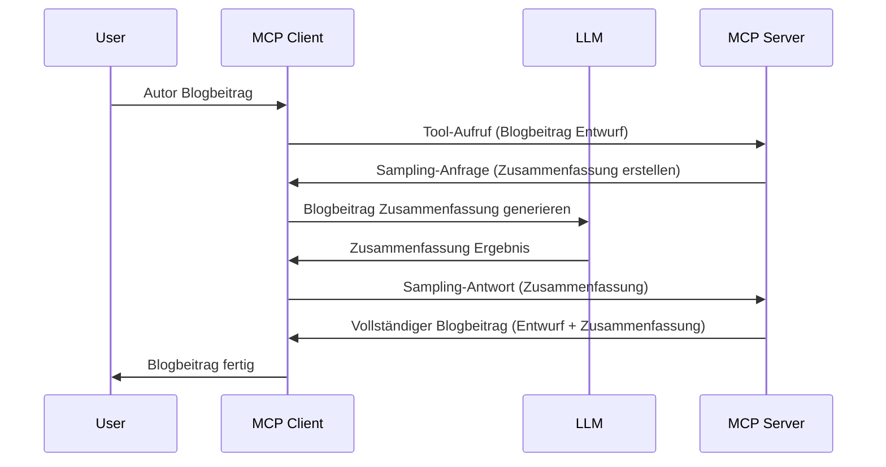

> [VERALTET: 2026-07-28 RELEASE CANDIDATE](https://blog.modelcontextprotocol.io/posts/2026-07-28-release-candidate/)

# Sampling – Delegiere Funktionen an den Client

> **Hinweis zur Veraltung:** Der `2026-07-28` MCP Spezifikations-Release Candidate markiert Sampling als veraltet zugunsten der direkten Integration mit LLM-Anbieter-APIs. Sampling funktioniert weiterhin in `2025-11-25` und für mindestens ein Jahr nach einer formellen Veraltung, daher bleibt alles in dieser Lektion gültig – aber neue Server-Designs sollten das Ersatzmuster evaluieren. Siehe [Was sich in MCP ändert: Der Release Candidate vom 2026-07-28](../../01-CoreConcepts/mcp-2026-07-28-release-candidate.md).

Manchmal müssen der MCP Client und der MCP Server zusammenarbeiten, um ein gemeinsames Ziel zu erreichen. Es kann sein, dass der Server die Hilfe eines LLM benötigt, das auf dem Client sitzt. Für diese Situation sollten Sie Sampling verwenden.

Lassen Sie uns einige Anwendungsfälle untersuchen und wie man eine Lösung mit Sampling baut.

## Überblick

In dieser Lektion konzentrieren wir uns darauf zu erklären, wann und wo Sampling genutzt wird und wie man es konfiguriert.

## Lernziele

In diesem Kapitel werden wir:

- Erklären, was Sampling ist und wann es verwendet wird.
- Zeigen, wie Sampling in MCP konfiguriert wird.
- Beispiele für Sampling in der Praxis liefern.

## Was ist Sampling und warum nutzen?

Sampling ist eine erweiterte Funktion, die folgendermaßen funktioniert:



### Sampling-Anfrage

Gut, nun haben wir einen groben Überblick über ein glaubwürdiges Szenario, lassen Sie uns über die Sampling-Anfrage sprechen, die der Server an den Client zurücksendet. So könnte eine solche Anfrage im JSON-RPC-Format aussehen:

```json
{
  "jsonrpc": "2.0",
  "id": 1,
  "method": "sampling/createMessage",
  "params": {
    "messages": [
      {
        "role": "user",
        "content": {
          "type": "text",
          "text": "Create a blog post summary of the following blog post: <BLOG POST>"
        }
      }
    ],
    "modelPreferences": {
      "hints": [
        {
          "name": "claude-3-sonnet"
        }
      ],
      "intelligencePriority": 0.8,
      "speedPriority": 0.5
    },
    "systemPrompt": "You are a helpful assistant.",
    "maxTokens": 100
  }
}
```

Hier gibt es ein paar Punkte, die erwähnenswert sind:

- Prompt, unter content -> text, ist unser Prompt, der eine Anweisung an das LLM ist, Blogpost-Inhalte zusammenzufassen.

- **modelPreferences**. Dieser Abschnitt ist genau das, eine Präferenz, eine Empfehlung, welche Konfiguration beim LLM verwendet werden soll. Der Nutzer kann entscheiden, ob er diese Empfehlungen übernimmt oder ändert. In diesem Fall gibt es Empfehlungen zu Modell, Geschwindigkeit und Intelligenz-Priorität.
- **systemPrompt**, dies ist Ihr normaler System-Prompt, der Ihrem LLM eine Persönlichkeit gibt und Anleitung enthält.
- **maxTokens**, dies ist eine weitere Eigenschaft, die angibt, wie viele Tokens für diese Aufgabe empfohlen werden.

### Sampling-Antwort

Diese Antwort ist das, was der MCP Client letztlich an den MCP Server zurücksendet. Es ist das Ergebnis eines Aufrufs des LLM durch den Client, das Warten auf die Antwort und anschließendem Aufbau dieser Nachricht. So könnte es im JSON-RPC aussehen:

```json
{
  "jsonrpc": "2.0",
  "id": 1,
  "result": {
    "role": "assistant",
    "content": {
      "type": "text",
      "text": "Here's your abstract <ABSTRACT>"
    },
    "model": "gpt-5",
    "stopReason": "endTurn"
  }
}
```

Beachten Sie, dass die Antwort eine Zusammenfassung des Blogposts ist, genau wie wir es angefordert haben. Beachten Sie ebenfalls, dass das verwendete `model` nicht das angeforderte war, sondern "gpt-5" statt "claude-3-sonnet". Dies soll illustrieren, dass der Nutzer seine Meinung ändern kann und Ihre Sampling-Anfrage eine Empfehlung ist.

Gut, nun, da wir den Hauptablauf verstehen und die nützliche Aufgabe "Blogpost-Erstellung + Zusammenfassung" kennen, sehen wir, was wir tun müssen, um es zum Laufen zu bringen.

### Nachrichtentypen

Sampling-Nachrichten sind nicht nur auf Text beschränkt, sondern Sie können auch Bilder und Audio senden. So sieht das JSON-RPC unterschiedlich aus:

**Text**

```json
{
  "type": "text",
  "text": "The message content"
}
```

**Bildinhalt**

```json
{
  "type": "image",
  "data": "base64-encoded-image-data",
  "mimeType": "image/jpeg"
}
```

**Audioinhalt**

```json
{
  "type": "audio",
  "data": "base64-encoded-audio-data",
  "mimeType": "audio/wav"
}
```

> HINWEIS: Für detailliertere Informationen zu Sampling siehe die [offiziellen Dokumente](https://modelcontextprotocol.io/specification/2025-11-25/client/sampling)

## Wie man Sampling im Client konfiguriert

> Hinweis: Wenn Sie nur einen Server bauen, müssen Sie hier nicht viel tun.

Im Client müssen Sie die folgende Funktionalität wie folgt spezifizieren:

```json
{
  "capabilities": {
    "sampling": {}
  }
}
```

Dies wird dann erkannt, wenn Ihr gewählter Client mit dem Server initialisiert wird.

## Beispiel für Sampling in Aktion – Einen Blogpost erstellen

Lassen Sie uns zusammen einen Sampling-Server programmieren, wir müssen folgendes tun:

1. Ein Tool auf dem Server erstellen.
1. Dieses Tool soll eine Sampling-Anfrage erstellen.
1. Das Tool soll auf die Antwort der Sampling-Anfrage vom Client warten.
1. Danach soll das Tool-Ergebnis produziert werden.

Sehen wir uns den Code Schritt für Schritt an:

### -1- Tool erstellen

**python**

```python
@mcp.tool()
async def create_blog(title: str, content: str, ctx: Context[ServerSession, None]) -> str:
    """Create a blog post and generate a summary"""

```

### -2- Sampling-Anfrage erstellen

Erweitern Sie Ihr Tool mit folgendem Code:

**python**

```python
post = BlogPost(
        id=len(posts) + 1,
        title=title,
        content=content,
        abstract=""
    )

prompt = f"Create an abstract of the following blog post: title: {title} and draft: {content} "

result = await ctx.session.create_message(
        messages=[
            SamplingMessage(
                role="user",
                content=TextContent(type="text", text=prompt),
            )
        ],
        max_tokens=100,
)

```

### -3- Auf die Antwort warten und zurückgeben

**python**

```python
post.abstract = result.content.text

posts.append(post)

# gib das komplette Produkt zurück
return json.dumps({
    "id": post.title,
    "abstract": post.abstract
})
```

### -4- Vollständiger Code

**python**

```python
from starlette.applications import Starlette
from starlette.routing import Mount, Host

from mcp.server.fastmcp import Context, FastMCP

from mcp.server.session import ServerSession
from mcp.types import SamplingMessage, TextContent

import json


from uuid import uuid4
from typing import List
from pydantic import BaseModel


mcp = FastMCP("Blog post generator")

# app = FastAPI()

posts = []

class BlogPost(BaseModel):
    id: int
    title: str
    content: str
    abstract: str

posts: List[BlogPost] = []

@mcp.tool()
async def create_blog(title: str, content: str, ctx: Context[ServerSession, None]) -> str:
    """Create a blog post and generate a summary"""

    post = BlogPost(
        id=len(posts) + 1,
        title=title,
        content=content,
        abstract=""
    )

    prompt = f"Create an abstract of the following blog post: title: {title} and draft: {content} "

    result = await ctx.session.create_message(
        messages=[
            SamplingMessage(
                role="user",
                content=TextContent(type="text", text=prompt),
            )
        ],
        max_tokens=100,
    )

    post.abstract = result.content.text

    posts.append(post)

    # gebe den vollständigen Blogbeitrag zurück
    return json.dumps({
        "id": post.title,
        "abstract": post.abstract
    })

if __name__ == "__main__":
    print("Starting server...")
    # mcp.run()
    mcp.run(transport="streamable-http")

# starte die App mit: python server.py
```

### -5- Testen in Visual Studio Code

Um dies in Visual Studio Code zu testen, gehen Sie wie folgt vor:

1. Server im Terminal starten
1. Dies zu *mcp.json* hinzufügen (und sicherstellen, dass es gestartet ist), z.B. so:

   ```json
   "servers": {
      "blog-server": {
        "type": "http",
        "url": "http://localhost:8000/mcp"
      }
   }
   ```

1. Einen Prompt eingeben:

   ```text
   create a blog post named "Where Python comes from", the content is "Python is actually named after Monty Python Flying Circus"
   ```

1. Sampling erlauben. Beim ersten Test bekommen Sie einen zusätzlichen Dialog zur Zustimmung, danach sehen Sie den normalen Dialog, der Sie auffordert, ein Tool auszuführen.

1. Ergebnisse prüfen. Sie sehen die Ergebnisse sowohl schön dargestellt in GitHub Copilot Chat als auch können Sie die rohe JSON-Antwort inspizieren.

**Bonus**. Die Visual Studio Code-Tools haben großartige Unterstützung für Sampling. Sie können den Zugriff auf Sampling auf Ihrem installierten Server konfigurieren, indem Sie folgendes tun:

1. Zum Erweiterungsbereich navigieren.
1. Das Zahnrad-Symbol für Ihren installierten Server im Abschnitt "MCP SERVERS - INSTALLED" auswählen.
1 „Modellzugang konfigurieren“ auswählen, hier können Sie auswählen, welche Modelle GitHub Copilot beim Sampling verwenden darf. Sie können auch alle letzten Sampling-Anfragen sehen, indem Sie „Sampling-Anfragen anzeigen“ auswählen.

## Aufgabe

In dieser Aufgabe werden Sie eine etwas andere Sampling-Integration bauen, nämlich eine Sampling-Integration, die die Generierung einer Produktbeschreibung unterstützt. Hier ist Ihr Szenario:

**Szenario**: Der Backoffice-Mitarbeiter in einem E-Commerce benötigt Hilfe, es dauert viel zu lange, Produktbeschreibungen zu erstellen. Daher sollen Sie eine Lösung bauen, bei der Sie ein Tool "create_product" mit den Argumenten "title" und "keywords" aufrufen können, das ein vollständiges Produkt inklusive einem "description"-Feld erzeugt, das von einem LLM des Clients befüllt werden soll.

TIPP: Verwenden Sie, was Sie vorher gelernt haben, um diesen Server und sein Tool mit einer Sampling-Anfrage zu konstruieren.

## Lösung

[Lösung](./solution/README.md)

## Wichtige Erkenntnisse

Sampling ist eine mächtige Funktion, die es dem Server erlaubt, Aufgaben an den Client zu delegieren, wenn er die Hilfe eines LLM benötigt.

## Was kommt als Nächstes

- [Kapitel 4 – Praktische Umsetzung](../../04-PracticalImplementation/README.md)

---

<!-- CO-OP TRANSLATOR DISCLAIMER START -->
**Haftungsausschluss**:
Dieses Dokument wurde mit dem KI-Übersetzungsdienst [Co-op Translator](https://github.com/Azure/co-op-translator) übersetzt. Obwohl wir uns um Genauigkeit bemühen, beachten Sie bitte, dass automatisierte Übersetzungen Fehler oder Ungenauigkeiten enthalten können. Das Originaldokument in seiner Ursprungssprache gilt als maßgebliche Quelle. Bei kritischen Informationen wird eine professionelle menschliche Übersetzung empfohlen. Wir übernehmen keine Haftung für Missverständnisse oder Fehlinterpretationen, die aus der Verwendung dieser Übersetzung entstehen.
<!-- CO-OP TRANSLATOR DISCLAIMER END -->