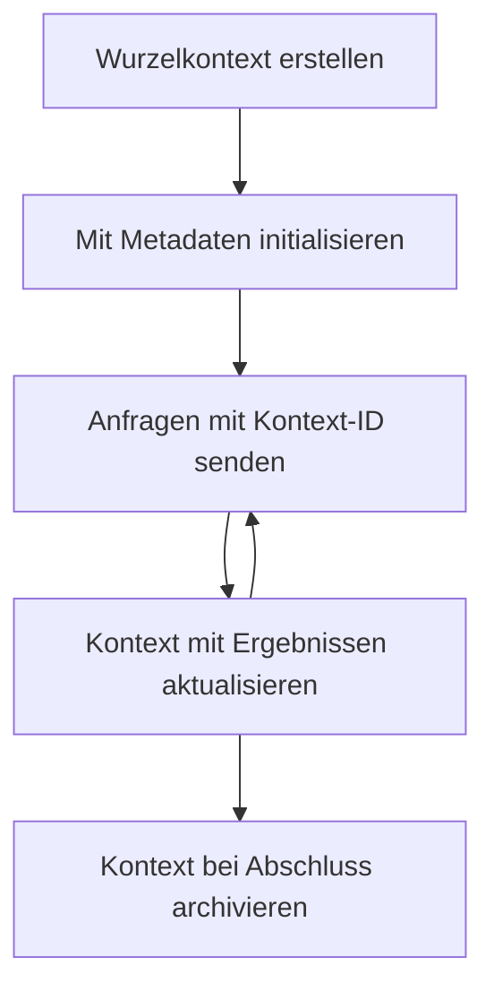

> [VERALTET: 2026-07-28 RELEASE CANDIDATE](https://blog.modelcontextprotocol.io/posts/2026-07-28-release-candidate/#roots-sampling-and-logging-are-deprecated)

# MCP Root-Kontexte

> **Deprecation-Hinweis:** Der MCP-Spezifikations-Release-Kandidat `2026-07-28` kennzeichnet Roots als veraltet zugunsten von Tool-Parametern, Ressourcen-URIs oder Serverkonfiguration. Roots funktionieren weiterhin in `2025-11-25` und mindestens ein Jahr nach einer formalen Veraltung, sodass alles in dieser Lektion gültig bleibt – neue Server-Designs sollten jedoch das Ersatzmuster evaluieren. Siehe [Was sich im MCP ändert: Der 2026-07-28 Release-Kandidat](../../01-CoreConcepts/mcp-2026-07-28-release-candidate.md).

Root-Kontexte sind ein grundlegendes Konzept im Model Context Protocol, das eine persistente Ebene bietet, um Gesprächshistorie und gemeinsamen Zustand über mehrere Anfragen und Sitzungen hinweg zu erhalten.

## Einführung

In dieser Lektion werden wir erkunden, wie man Root-Kontexte in MCP erstellt, verwaltet und nutzt. 

## Lernziele

Am Ende dieser Lektion werden Sie in der Lage sein:

- Den Zweck und die Struktur von Root-Kontexten zu verstehen
- Root-Kontexte mit MCP-Clientbibliotheken zu erstellen und zu verwalten
- Root-Kontexte in .NET-, Java-, JavaScript- und Python-Anwendungen zu implementieren
- Root-Kontexte für mehrschrittige Konversationen und Zustandsverwaltung zu nutzen
- Best Practices für das Management von Root-Kontexten umzusetzen

## Verständnis von Root-Kontexten

Root-Kontexte dienen als Container, die die Historie und den Zustand für eine Reihe zusammenhängender Interaktionen speichern. Sie ermöglichen:

- **Konversationspersistenz**: Aufrechterhaltung kohärenter mehrschrittiger Konversationen
- **Speicherverwaltung**: Speichern und Abrufen von Informationen über Interaktionen hinweg
- **Zustandsverwaltung**: Nachverfolgung des Fortschritts in komplexen Arbeitsabläufen
- **Kontextteilung**: Ermöglichen, dass mehrere Clients denselben Konversationszustand nutzen

Im MCP haben Root-Kontexte folgende Schlüsselfunktionen:

- Jeder Root-Kontext hat eine eindeutige Kennung.
- Sie können Konversationshistorie, Benutzerpräferenzen und andere Metadaten enthalten.
- Sie können bei Bedarf erstellt, zugegriffen und archiviert werden.
- Sie unterstützen fein granulare Zugriffskontrolle und Berechtigungen.

## Lebenszyklus eines Root-Kontexts



## Arbeiten mit Root-Kontexten

Hier ein Beispiel, wie man Root-Kontexte erstellt und verwaltet.

### C#-Implementierung

```csharp
// .NET Example: Root Context Management
using Microsoft.Mcp.Client;
using System;
using System.Threading.Tasks;
using System.Collections.Generic;

public class RootContextExample
{
    private readonly IMcpClient _client;
    private readonly IRootContextManager _contextManager;
    
    public RootContextExample(IMcpClient client, IRootContextManager contextManager)
    {
        _client = client;
        _contextManager = contextManager;
    }
    
    public async Task DemonstrateRootContextAsync()
    {
        // 1. Create a new root context
        var contextResult = await _contextManager.CreateRootContextAsync(new RootContextCreateOptions
        {
            Name = "Customer Support Session",
            Metadata = new Dictionary<string, string>
            {
                ["CustomerName"] = "Acme Corporation",
                ["PriorityLevel"] = "High",
                ["Domain"] = "Cloud Services"
            }
        });
        
        string contextId = contextResult.ContextId;
        Console.WriteLine($"Created root context with ID: {contextId}");
        
        // 2. First interaction using the context
        var response1 = await _client.SendPromptAsync(
            "I'm having issues scaling my web service deployment in the cloud.", 
            new SendPromptOptions { RootContextId = contextId }
        );
        
        Console.WriteLine($"First response: {response1.GeneratedText}");
        
        // Second interaction - the model will have access to the previous conversation
        var response2 = await _client.SendPromptAsync(
            "Yes, we're using containerized deployments with Kubernetes.", 
            new SendPromptOptions { RootContextId = contextId }
        );
        
        Console.WriteLine($"Second response: {response2.GeneratedText}");
        
        // 3. Add metadata to the context based on conversation
        await _contextManager.UpdateContextMetadataAsync(contextId, new Dictionary<string, string>
        {
            ["TechnicalEnvironment"] = "Kubernetes",
            ["IssueType"] = "Scaling"
        });
        
        // 4. Get context information
        var contextInfo = await _contextManager.GetRootContextInfoAsync(contextId);
        
        Console.WriteLine("Context Information:");
        Console.WriteLine($"- Name: {contextInfo.Name}");
        Console.WriteLine($"- Created: {contextInfo.CreatedAt}");
        Console.WriteLine($"- Messages: {contextInfo.MessageCount}");
        
        // 5. When the conversation is complete, archive the context
        await _contextManager.ArchiveRootContextAsync(contextId);
        Console.WriteLine($"Archived context {contextId}");
    }
}
```

Im obigen Code haben wir:

1. Einen Root-Kontext für eine Kundensupport-Sitzung erstellt.
1. Mehrere Nachrichten innerhalb dieses Kontexts gesendet, damit das Modell den Zustand verwalten kann.
1. Den Kontext mit relevanten Metadaten basierend auf der Konversation aktualisiert.
1. Kontextinformationen abgerufen, um die Gesprächshistorie zu verstehen.
1. Den Kontext archiviert, als die Konversation abgeschlossen war.

## Beispiel: Root-Kontext-Implementierung für Finanzanalysen

In diesem Beispiel erstellen wir einen Root-Kontext für eine Finanzanalyse-Sitzung und zeigen, wie man den Zustand über mehrere Interaktionen hinweg pflegt.

### Java-Implementierung

```java
// Java Beispiel: Implementierung des Root-Kontexts
package com.example.mcp.contexts;

import com.mcp.client.McpClient;
import com.mcp.client.ContextManager;
import com.mcp.models.RootContext;
import com.mcp.models.McpResponse;

import java.util.HashMap;
import java.util.Map;
import java.util.UUID;

public class RootContextsDemo {
    private final McpClient client;
    private final ContextManager contextManager;
    
    public RootContextsDemo(String serverUrl) {
        this.client = new McpClient.Builder()
            .setServerUrl(serverUrl)
            .build();
            
        this.contextManager = new ContextManager(client);
    }
    
    public void demonstrateRootContext() throws Exception {
        // Kontext-Metadaten erstellen
        Map<String, String> metadata = new HashMap<>();
        metadata.put("projectName", "Financial Analysis");
        metadata.put("userRole", "Financial Analyst");
        metadata.put("dataSource", "Q1 2025 Financial Reports");
        
        // 1. Erstellen eines neuen Root-Kontexts
        RootContext context = contextManager.createRootContext("Financial Analysis Session", metadata);
        String contextId = context.getId();
        
        System.out.println("Created context: " + contextId);
        
        // 2. Erste Interaktion
        McpResponse response1 = client.sendPrompt(
            "Analyze the trends in Q1 financial data for our technology division",
            contextId
        );
        
        System.out.println("First response: " + response1.getGeneratedText());
        
        // 3. Aktualisieren des Kontexts mit wichtigen Informationen aus der Antwort
        contextManager.addContextMetadata(contextId, 
            Map.of("identifiedTrend", "Increasing cloud infrastructure costs"));
        
        // Zweite Interaktion - Verwendung desselben Kontexts
        McpResponse response2 = client.sendPrompt(
            "What's driving the increase in cloud infrastructure costs?",
            contextId
        );
        
        System.out.println("Second response: " + response2.getGeneratedText());
        
        // 4. Erstellen einer Zusammenfassung der Analysesitzung
        McpResponse summaryResponse = client.sendPrompt(
            "Summarize our analysis of the technology division financials in 3-5 key points",
            contextId
        );
        
        // Speichern der Zusammenfassung in den Kontext-Metadaten
        contextManager.addContextMetadata(contextId, 
            Map.of("analysisSummary", summaryResponse.getGeneratedText()));
            
        // Aktualisierte Kontextinformationen abrufen
        RootContext updatedContext = contextManager.getRootContext(contextId);
        
        System.out.println("Context Information:");
        System.out.println("- Created: " + updatedContext.getCreatedAt());
        System.out.println("- Last Updated: " + updatedContext.getLastUpdatedAt());
        System.out.println("- Analysis Summary: " + 
            updatedContext.getMetadata().get("analysisSummary"));
            
        // 5. Kontext nach Abschluss archivieren
        contextManager.archiveContext(contextId);
        System.out.println("Context archived");
    }
}
```

Im obigen Code haben wir:

1. Einen Root-Kontext für eine Finanzanalyse-Sitzung erstellt.
2. Mehrere Nachrichten innerhalb dieses Kontexts gesendet, damit das Modell den Zustand verwalten kann.
3. Den Kontext mit relevanten Metadaten basierend auf der Konversation aktualisiert.
4. Eine Zusammenfassung der Analysesitzung erstellt und in den Kontextmetadaten gespeichert.
5. Den Kontext archiviert, als die Konversation abgeschlossen war.

## Beispiel: Root-Kontext-Verwaltung

Die effektive Verwaltung von Root-Kontexten ist entscheidend, um Gesprächshistorie und Zustand aufrechtzuerhalten. Unten finden Sie ein Beispiel zur Implementierung des Root-Kontext-Managements.

### JavaScript-Implementierung

```javascript
// JavaScript Beispiel: Verwaltung von MCP Root-Kontexten
const { McpClient, RootContextManager } = require('@mcp/client');

class ContextSession {
  constructor(serverUrl, apiKey = null) {
    // Initialisiere den MCP-Client
    this.client = new McpClient({
      serverUrl,
      apiKey
    });
    
    // Initialisiere den Kontext-Manager
    this.contextManager = new RootContextManager(this.client);
  }
  
  /**
   * Create a new conversation context
   * @param {string} sessionName - Name of the conversation session
   * @param {Object} metadata - Additional metadata for the context
   * @returns {Promise<string>} - Context ID
   */
  async createConversationContext(sessionName, metadata = {}) {
    try {
      const contextResult = await this.contextManager.createRootContext({
        name: sessionName,
        metadata: {
          ...metadata,
          createdAt: new Date().toISOString(),
          status: 'active'
        }
      });
      
      console.log(`Created root context '${sessionName}' with ID: ${contextResult.id}`);
      return contextResult.id;
    } catch (error) {
      console.error('Error creating root context:', error);
      throw error;
    }
  }
  
  /**
   * Send a message in an existing context
   * @param {string} contextId - The root context ID
   * @param {string} message - The user's message
   * @param {Object} options - Additional options
   * @returns {Promise<Object>} - Response data
   */
  async sendMessage(contextId, message, options = {}) {
    try {
      // Sende die Nachricht mit dem angegebenen Kontext
      const response = await this.client.sendPrompt(message, {
        rootContextId: contextId,
        temperature: options.temperature || 0.7,
        allowedTools: options.allowedTools || []
      });
      
      // Optional wichtige Erkenntnisse aus dem Gespräch speichern
      if (options.storeInsights) {
        await this.storeConversationInsights(contextId, message, response.generatedText);
      }
      
      return {
        message: response.generatedText,
        toolCalls: response.toolCalls || [],
        contextId
      };
    } catch (error) {
      console.error(`Error sending message in context ${contextId}:`, error);
      throw error;
    }
  }
  
  /**
   * Store important insights from a conversation
   * @param {string} contextId - The root context ID
   * @param {string} userMessage - User's message
   * @param {string} aiResponse - AI's response
   */
  async storeConversationInsights(contextId, userMessage, aiResponse) {
    try {
      // Potenzielle Erkenntnisse extrahieren (in einer echten App wäre dies ausgefeilter)
      const combinedText = userMessage + "\n" + aiResponse;
      
      // Einfache Heuristik zur Identifizierung potenzieller Erkenntnisse
      const insightWords = ["important", "key point", "remember", "significant", "crucial"];
      
      const potentialInsights = combinedText
        .split(".")
        .filter(sentence => 
          insightWords.some(word => sentence.toLowerCase().includes(word))
        )
        .map(sentence => sentence.trim())
        .filter(sentence => sentence.length > 10);
      
      // Erkenntnisse in den Metadaten des Kontexts speichern
      if (potentialInsights.length > 0) {
        const insights = {};
        potentialInsights.forEach((insight, index) => {
          insights[`insight_${Date.now()}_${index}`] = insight;
        });
        
        await this.contextManager.updateContextMetadata(contextId, insights);
        console.log(`Stored ${potentialInsights.length} insights in context ${contextId}`);
      }
    } catch (error) {
      console.warn('Error storing conversation insights:', error);
      // Nicht-kritischer Fehler, daher nur Warnung protokollieren
    }
  }
  
  /**
   * Get summary information about a context
   * @param {string} contextId - The root context ID
   * @returns {Promise<Object>} - Context information
   */
  async getContextInfo(contextId) {
    try {
      const contextInfo = await this.contextManager.getContextInfo(contextId);
      
      return {
        id: contextInfo.id,
        name: contextInfo.name,
        created: new Date(contextInfo.createdAt).toLocaleString(),
        lastUpdated: new Date(contextInfo.lastUpdatedAt).toLocaleString(),
        messageCount: contextInfo.messageCount,
        metadata: contextInfo.metadata,
        status: contextInfo.status
      };
    } catch (error) {
      console.error(`Error getting context info for ${contextId}:`, error);
      throw error;
    }
  }
  
  /**
   * Generate a summary of the conversation in a context
   * @param {string} contextId - The root context ID
   * @returns {Promise<string>} - Generated summary
   */
  async generateContextSummary(contextId) {
    try {
      // Fordere das Modell auf, eine Zusammenfassung des bisherigen Gesprächs zu erstellen
      const response = await this.client.sendPrompt(
        "Please summarize our conversation so far in 3-4 sentences, highlighting the main points discussed.",
        { rootContextId: contextId, temperature: 0.3 }
      );
      
      // Speichere die Zusammenfassung in den Metadaten des Kontexts
      await this.contextManager.updateContextMetadata(contextId, {
        conversationSummary: response.generatedText,
        summarizedAt: new Date().toISOString()
      });
      
      return response.generatedText;
    } catch (error) {
      console.error(`Error generating context summary for ${contextId}:`, error);
      throw error;
    }
  }
  
  /**
   * Archive a context when it's no longer needed
   * @param {string} contextId - The root context ID
   * @returns {Promise<Object>} - Result of the archive operation
   */
  async archiveContext(contextId) {
    try {
      // Erzeuge eine abschließende Zusammenfassung vor der Archivierung
      const summary = await this.generateContextSummary(contextId);
      
      // Archivieren des Kontexts
      await this.contextManager.archiveContext(contextId);
      
      return {
        status: "archived",
        contextId,
        summary
      };
    } catch (error) {
      console.error(`Error archiving context ${contextId}:`, error);
      throw error;
    }
  }
}

// Beispielhafte Verwendung
async function demonstrateContextSession() {
  const session = new ContextSession('https://mcp-server-example.com');
  
  try {
    // 1. Erstelle einen neuen Kontext für ein Produktunterstützungsgespräch
    const contextId = await session.createConversationContext(
      'Product Support - Database Performance',
      {
        customer: 'Globex Corporation',
        product: 'Enterprise Database',
        severity: 'Medium',
        supportAgent: 'AI Assistant'
      }
    );
    
    // 2. Erste Nachricht im Gespräch
    const response1 = await session.sendMessage(
      contextId,
      "I'm experiencing slow query performance on our database cluster after the latest update.",
      { storeInsights: true }
    );
    console.log('Response 1:', response1.message);
    
    // Folge Nachricht im gleichen Kontext
    const response2 = await session.sendMessage(
      contextId,
      "Yes, we've already checked the indexes and they seem to be properly configured.",
      { storeInsights: true }
    );
    console.log('Response 2:', response2.message);
    
    // 3. Informationen über den Kontext abrufen
    const contextInfo = await session.getContextInfo(contextId);
    console.log('Context Information:', contextInfo);
    
    // 4. Zusammenfassung des Gesprächs erstellen und anzeigen
    const summary = await session.generateContextSummary(contextId);
    console.log('Conversation Summary:', summary);
    
    // 5. Kontext nach Abschluss archivieren
    const archiveResult = await session.archiveContext(contextId);
    console.log('Archive Result:', archiveResult);
    
    // 6. Fehler elegant behandeln
  } catch (error) {
    console.error('Error in context session demonstration:', error);
  }
}

demonstrateContextSession();
```

Im obigen Code haben wir:

1. Einen Root-Kontext für ein Support-Gespräch zum Produkt mit der Funktion `createConversationContext` erstellt. In diesem Fall geht es um Datenbank-Performanceprobleme.

1. Mehrere Nachrichten innerhalb dieses Kontexts mit der Funktion `sendMessage` gesendet, wodurch das Modell den Zustand verwalten konnte. Die Nachrichten handeln von langsamer Abfrageperformance und Indexkonfiguration.

1. Den Kontext mit relevanten Metadaten basierend auf der Konversation aktualisiert.

1. Eine Zusammenfassung der Konversation generiert und in den Kontextmetadaten mit der Funktion `generateContextSummary` gespeichert.

1. Den Kontext archiviert, als die Konversation abgeschlossen war, mit der Funktion `archiveContext`.

1. Fehler elegant behandelt, um Robustheit sicherzustellen.

## Root-Kontext für mehrstufige Assistenz

In diesem Beispiel erstellen wir einen Root-Kontext für eine mehrstufige Assistenzsitzung und zeigen, wie man den Zustand über mehrere Interaktionen aufrechterhält.

### Python-Implementierung

```python
# Python-Beispiel: Root-Kontext für mehrstufige Assistenz
import asyncio
from datetime import datetime
from mcp_client import McpClient, RootContextManager

class AssistantSession:
    def __init__(self, server_url, api_key=None):
        self.client = McpClient(server_url=server_url, api_key=api_key)
        self.context_manager = RootContextManager(self.client)
    
    async def create_session(self, name, user_info=None):
        """Create a new root context for an assistant session"""
        metadata = {
            "session_type": "assistant",
            "created_at": datetime.now().isoformat(),
        }
        
        # Benutzerinformationen hinzufügen, falls vorhanden
        if user_info:
            metadata.update({f"user_{k}": v for k, v in user_info.items()})
            
        # Erstelle den Root-Kontext
        context = await self.context_manager.create_root_context(name, metadata)
        return context.id
    
    async def send_message(self, context_id, message, tools=None):
        """Send a message within a root context"""
        # Optionen mit Kontext-ID erstellen
        options = {
            "root_context_id": context_id
        }
        
        # Werkzeuge hinzufügen, falls angegeben
        if tools:
            options["allowed_tools"] = tools
        
        # Prompt innerhalb des Kontexts senden
        response = await self.client.send_prompt(message, options)
        
        # Kontext-Metadaten mit Gesprächsverlauf aktualisieren
        await self.context_manager.update_context_metadata(
            context_id,
            {
                f"message_{datetime.now().timestamp()}": message[:50] + "...",
                "last_interaction": datetime.now().isoformat()
            }
        )
        
        return response
    
    async def get_conversation_history(self, context_id):
        """Retrieve conversation history from a context"""
        context_info = await self.context_manager.get_context_info(context_id)
        messages = await self.client.get_context_messages(context_id)
        
        return {
            "context_info": context_info,
            "messages": messages
        }
    
    async def end_session(self, context_id):
        """End an assistant session by archiving the context"""
        # Zuerst eine Zusammenfassungsaufforderung generieren
        summary_response = await self.client.send_prompt(
            "Please summarize our conversation and any key points or decisions made.",
            {"root_context_id": context_id}
        )
        
        # Zusammenfassung in Metadaten speichern
        await self.context_manager.update_context_metadata(
            context_id,
            {
                "summary": summary_response.generated_text,
                "ended_at": datetime.now().isoformat(),
                "status": "completed"
            }
        )
        
        # Den Kontext archivieren
        await self.context_manager.archive_context(context_id)
        
        return {
            "status": "completed",
            "summary": summary_response.generated_text
        }

# Beispielverwendung
async def demo_assistant_session():
    assistant = AssistantSession("https://mcp-server-example.com")
    
    # 1. Sitzung erstellen
    context_id = await assistant.create_session(
        "Technical Support Session",
        {"name": "Alex", "technical_level": "advanced", "product": "Cloud Services"}
    )
    print(f"Created session with context ID: {context_id}")
    
    # 2. Erste Interaktion
    response1 = await assistant.send_message(
        context_id, 
        "I'm having trouble with the auto-scaling feature in your cloud platform.",
        ["documentation_search", "diagnostic_tool"]
    )
    print(f"Response 1: {response1.generated_text}")
    
    # Zweite Interaktion im gleichen Kontext
    response2 = await assistant.send_message(
        context_id,
        "Yes, I've already checked the configuration settings you mentioned, but it's still not working."
    )
    print(f"Response 2: {response2.generated_text}")
    
    # 3. Verlauf abrufen
    history = await assistant.get_conversation_history(context_id)
    print(f"Session has {len(history['messages'])} messages")
    
    # 4. Sitzung beenden
    end_result = await assistant.end_session(context_id)
    print(f"Session ended with summary: {end_result['summary']}")

if __name__ == "__main__":
    asyncio.run(demo_assistant_session())
```

Im obigen Code haben wir:

1. Einen Root-Kontext für eine technische Support-Sitzung mit der Funktion `create_session` erstellt. Der Kontext enthält Benutzerinformationen wie Name und technisches Niveau.

1. Mehrere Nachrichten innerhalb dieses Kontexts mit der Funktion `send_message` gesendet, wodurch das Modell den Zustand verwalten konnte. Die gesendeten Nachrichten behandeln Probleme mit der Auto-Scaling-Funktion.

1. Die Gesprächshistorie mit der Funktion `get_conversation_history` abgerufen, die Kontextinformationen und Nachrichten liefert.

1. Die Sitzung beendet, indem der Kontext archiviert und mit der Funktion `end_session` eine Zusammenfassung generiert wurde. Die Zusammenfassung erfasst Schlüsselpunkte der Konversation.

## Best Practices für Root-Kontexte

Hier einige Best Practices für die effektive Verwaltung von Root-Kontexten:

- **Fokussierte Kontexte erstellen**: Erstellen Sie separate Root-Kontexte für unterschiedliche Gesprächszwecke oder -domänen, um Klarheit zu bewahren.

- **Ablaufrichtlinien setzen**: Implementieren Sie Richtlinien, um alte Kontexte zu archivieren oder zu löschen, um Speicher zu verwalten und Compliance mit Datenaufbewahrungsregeln zu gewährleisten.

- **Relevante Metadaten speichern**: Verwenden Sie Kontextmetadaten, um wichtige Informationen über die Konversation zu speichern, die später nützlich sein könnten.

- **Kontext-IDs konsistent verwenden**: Verwenden Sie nach Erstellung des Kontexts seine ID konsequent für alle zugehörigen Anfragen, um Kontinuität sicherzustellen.

- **Zusammenfassungen erstellen**: Wenn ein Kontext groß wird, ziehen Sie in Erwägung, Zusammenfassungen zu generieren, um wesentliche Informationen zu erfassen und gleichzeitig die Kontextgröße zu verwalten.

- **Zugriffskontrolle implementieren**: Für Multi-User-Systeme implementieren Sie angemessene Zugriffskontrollen, um Privatsphäre und Sicherheit der Konversationskontexte zu gewährleisten.

- **Kontextbeschränkungen berücksichtigen**: Seien Sie sich der Größenbeschränkungen für Kontexte bewusst und implementieren Sie Strategien zum Umgang mit sehr langen Konversationen.

- **Archivieren bei Abschluss**: Archivieren Sie Kontexte, wenn Konversationen abgeschlossen sind, um Ressourcen freizugeben und gleichzeitig die Gesprächshistorie zu bewahren.

## Was kommt als Nächstes

- [5.5 Routing](../mcp-routing/README.md)

---

<!-- CO-OP TRANSLATOR DISCLAIMER START -->
**Haftungsausschluss**:
Dieses Dokument wurde mit dem KI-Übersetzungsdienst [Co-op Translator](https://github.com/Azure/co-op-translator) übersetzt. Obwohl wir uns um Genauigkeit bemühen, beachten Sie bitte, dass automatisierte Übersetzungen Fehler oder Ungenauigkeiten enthalten können. Das Originaldokument in seiner Ursprungssprache gilt als maßgebliche Quelle. Bei kritischen Informationen wird eine professionelle menschliche Übersetzung empfohlen. Wir übernehmen keine Haftung für Missverständnisse oder Fehlinterpretationen, die aus der Verwendung dieser Übersetzung entstehen.
<!-- CO-OP TRANSLATOR DISCLAIMER END -->