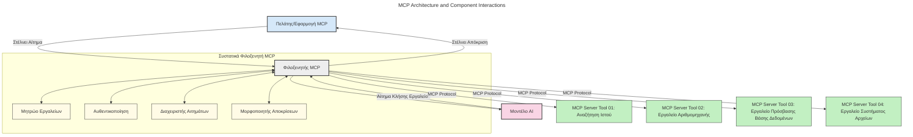
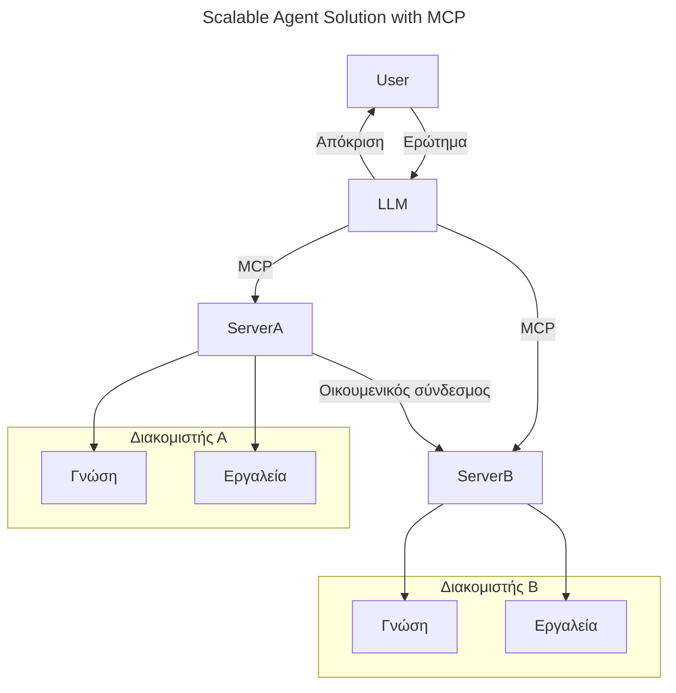
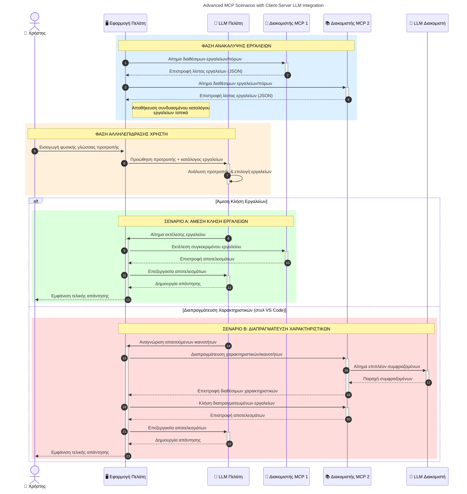

# Εισαγωγή στο Πρωτόκολλο Πλαισίου Μοντέλου (MCP): Γιατί Είναι Σημαντικό για Κλιμακώσιμες Εφαρμογές Τεχνητής Νοημοσύνης

_(Κάντε κλικ στην εικόνα παραπάνω για να δείτε το βίντεο αυτής της μαθήματος)_

Οι εφαρμογές γενετικής τεχνητής νοημοσύνης είναι ένα μεγάλο βήμα προόδου καθώς συχνά επιτρέπουν στον χρήστη να αλληλεπιδρά με την εφαρμογή χρησιμοποιώντας φυσικές γλωσσικές εντολές. Ωστόσο, καθώς επενδύεται περισσότερος χρόνος και πόροι σε τέτοιες εφαρμογές, θέλετε να διασφαλίσετε ότι μπορείτε να ενσωματώσετε εύκολα λειτουργικότητες και πόρους με τέτοιο τρόπο ώστε να είναι εύκολο να επεκταθεί, ότι η εφαρμογή σας μπορεί να εξυπηρετεί περισσότερα από ένα μοντέλα που χρησιμοποιούνται και να χειρίζεται διάφορες ιδιαιτερότητες των μοντέλων. Με λίγα λόγια, η κατασκευή εφαρμογών γενετικής τεχνητής νοημοσύνης είναι εύκολη για να ξεκινήσει, αλλά καθώς μεγαλώνουν και γίνονται πιο πολύπλοκες, πρέπει να αρχίσετε να ορίζετε μια αρχιτεκτονική και πιθανότατα θα χρειαστεί να βασιστείτε σε ένα πρότυπο για να διασφαλίσετε ότι οι εφαρμογές σας είναι κατασκευασμένες με συνεπή τρόπο. Εδώ έρχεται το MCP για να οργανώσει τα πράγματα και να παρέχει ένα πρότυπο.

---

## **🔍 Τι είναι το Πρωτόκολλο Πλαισίου Μοντέλου (MCP);**

Το **Πρωτόκολλο Πλαισίου Μοντέλου (MCP)** είναι μια **ανοιχτή, τυποποιημένη διεπαφή** που επιτρέπει στα Μεγάλα Μοντέλα Γλώσσας (LLMs) να αλληλεπιδρούν απρόσκοπτα με εξωτερικά εργαλεία, APIs και πηγές δεδομένων. Παρέχει μια συνεπή αρχιτεκτονική για να βελτιώσει τη λειτουργικότητα του μοντέλου AI πέρα από τα δεδομένα εκπαίδευσής τους, επιτρέποντας εξυπνότερα, κλιμακώσιμα και πιο ανταποκρινόμενα συστήματα AI.

---

## **🎯 Γιατί η Τυποποίηση στην Τεχνητή Νοημοσύνη Είναι Σημαντική**

Καθώς οι εφαρμογές γενετικής τεχνητής νοημοσύνης γίνονται πιο πολύπλοκες, είναι ουσιώδες να υιοθετηθούν πρότυπα που διασφαλίζουν την **κλιμακωσιμότητα, επεκτασιμότητα, διατηρησιμότητα** και **αποφυγή δεσμεύσεων σε προμηθευτές**. Το MCP καλύπτει αυτές τις ανάγκες με:

- Ενοποίηση των ενσωματώσεων μοντέλων-εργαλείων  
- Μείωση εύθραυστων, μεμονωμένων προσαρμοσμένων λύσεων  
- Επιτρέπει σε πολλαπλά μοντέλα από διαφορετικούς προμηθευτές να συνυπάρχουν μέσα σε ένα οικοσύστημα  

**Σημείωση:** Ενώ το MCP παρουσιάζεται ως ανοιχτό πρότυπο, δεν υπάρχουν σχέδια για τυποποίησή του μέσω υπαρχόντων φορέων τυποποίησης όπως IEEE, IETF, W3C, ISO ή άλλων φορέων.

---

## **📚 Μαθησιακοί Στόχοι**

Μέχρι το τέλος αυτού του άρθρου, θα μπορείτε να:

- Ορίσετε το **Πρωτόκολλο Πλαισίου Μοντέλου (MCP)** και τις περιπτώσεις χρήσης του  
- Κατανοήσετε πώς το MCP τυποποιεί την επικοινωνία μοντέλου-εργαλείου  
- Αναγνωρίσετε τα βασικά στοιχεία της αρχιτεκτονικής MCP  
- Εξερευνήσετε πραγματικές εφαρμογές του MCP σε επιχειρησιακά και αναπτυξιακά περιβάλλοντα  

---

## **💡 Γιατί το Πρωτόκολλο Πλαισίου Μοντέλου (MCP) Αλλάζει το Παιχνίδι**

### **🔗 Το MCP Επιλύει τη Χαοτικότητα στις Αλληλεπιδράσεις AI**

Πριν το MCP, η ενσωμάτωση μοντέλων με εργαλεία απαιτούσε:

- Ειδικό κώδικα ανά ζεύγος εργαλείου-μοντέλου  
- Μη τυποποιημένα APIs για κάθε προμηθευτή  
- Συχνά διακοπές λόγω ενημερώσεων  
- Κακή κλιμακωσιμότητα με περισσότερα εργαλεία  

### **✅ Οφέλη της Τυποποίησης MCP**

| **Όφελος**              | **Περιγραφή**                                                                |
|--------------------------|--------------------------------------------------------------------------------|
| Διαλειτουργικότητα         | Τα LLM συνεργάζονται άψογα με εργαλεία από διαφορετικούς προμηθευτές            |
| Συνοχή                   | Ομοιόμορφη συμπεριφορά μεταξύ πλατφορμών και εργαλείων                        |
| Επαναχρησιμοποίηση        | Εργαλεία που χτίζονται μία φορά μπορούν να χρησιμοποιηθούν σε πολλά έργα και συστήματα |
| Επιτάχυνση Ανάπτυξης     | Μείωση χρόνου ανάπτυξης χρησιμοποιώντας τυποποιημένες, έτοιμες διεπαφές       |

---

## **🧱 Επισκόπηση της Υψηλού Επιπέδου Αρχιτεκτονικής MCP**

Το MCP ακολουθεί ένα **μοντέλο πελάτη-διακομιστή**, όπου:

- **Οι MCP Hosts** τρέχουν τα μοντέλα AI  
- **Οι MCP Clients** ξεκινούν αιτήματα  
- **Οι MCP Servers** παρέχουν πλαίσιο, εργαλεία και δυνατότητες  

### **Βασικά Στοιχεία:**

- **Πόροι** – Στατικά ή δυναμικά δεδομένα για τα μοντέλα  
- **Προτροπές** – Προκαθορισμένα ροές εργασίας για καθοδηγούμενη παραγωγή  
- **Εργαλεία** – Εκτελέσιμες λειτουργίες όπως αναζητήσεις, υπολογισμοί  
- **Δειγματοληψία** – Συμπεριφορά πράκτορα μέσω αναδρομικών αλληλεπιδράσεων (λήγει στην υποψήφια έκδοση `2026-07-28`)  
- **Προτροπή Εξαγωγής Πληροφοριών** – Αιτήματα εισόδου χρήστη που ξεκινούν οι διακομιστές  
- **Roots** – Όρια συστήματος αρχείων για έλεγχο πρόσβασης διακομιστών (λήγει στην υποψήφια έκδοση `2026-07-28`)  

### **Αρχιτεκτονική Πρωτοκόλλου:**

Το MCP χρησιμοποιεί αρχιτεκτονική δύο επιπέδων:
- **Επίπεδο Δεδομένων**: Επικοινωνία βασισμένη σε JSON-RPC 2.0 με διαχείριση κύκλου ζωής και πρωτόγονα στοιχεία  
- **Επίπεδο Μεταφοράς**: Τοπική (STDIO) και ρεύμα HTTP με SSE (απομακρυσμένη) επικοινωνία  

---

## Πώς Λειτουργούν οι MCP Servers

Οι διακομιστές MCP λειτουργούν ως εξής:

- **Ροή Αιτήματος**:
    1. Ένα αίτημα ξεκινά από έναν τελικό χρήστη ή από λογισμικό που ενεργεί εκ μέρους του.  
    2. Ο **MCP Client** στέλνει το αίτημα σε έναν **MCP Host**, ο οποίος διαχειρίζεται τον χρόνο εκτέλεσης του AI μοντέλου.  
    3. Το **AI Μοντέλο** λαμβάνει την προτροπή του χρήστη και μπορεί να ζητήσει πρόσβαση σε εξωτερικά εργαλεία ή δεδομένα μέσω μίας ή περισσότερων κλήσεων σε εργαλεία.  
    4. Ο **MCP Host**, όχι το μοντέλο άμεσα, επικοινωνεί με τον/τους κατάλληλο/ους **MCP Server(iς)** χρησιμοποιώντας το τυποποιημένο πρωτόκολλο.  
- **Λειτουργικότητα MCP Host**:
    - **Κατάλογος Εργαλείων**: Διατηρεί ένα κατάλογο των διαθέσιμων εργαλείων και των δυνατοτήτων τους.  
    - **Έλεγχος Ταυτότητας**: Επαληθεύει τα δικαιώματα για πρόσβαση σε εργαλεία.  
    - **Διαχείριση Αιτημάτων**: Επεξεργάζεται τα εισερχόμενα αιτήματα εργαλείων από το μοντέλο.  
    - **Μορφοποιητής Απαντήσεων**: Δομεί τα αποτελέσματα εργαλείων σε μορφή που μπορεί να κατανοήσει το μοντέλο.  
- **Εκτέλεση MCP Server**:
    - Ο **MCP Host** δρομολογεί κλήσεις εργαλείων σε έναν ή περισσότερους **MCP Servers**, καθένας από τους οποίους παρέχει εξειδικευμένες λειτουργίες (π.χ., αναζήτηση, υπολογισμοί, ερωτήματα βάσεων δεδομένων).  
    - Οι **MCP Servers** εκτελούν τις αντίστοιχες λειτουργίες και επιστρέφουν τα αποτελέσματα στον **MCP Host** με συνεπή μορφή.  
    - Ο **MCP Host** μορφοποιεί και μεταβιβάζει αυτά τα αποτελέσματα στο **AI Μοντέλο**.  
- **Ολοκλήρωση Απάντησης**:
    - Το **AI Μοντέλο** ενσωματώνει τα αποτελέσματα των εργαλείων σε μια τελική απάντηση.  
    - Ο **MCP Host** στέλνει αυτή την απάντηση πίσω στον **MCP Client**, ο οποίος την παραδίδει στον τελικό χρήστη ή στο λογισμικό που την κάλεσε.  
    

## 👨‍💻 Πώς να Δημιουργήσετε έναν MCP Server (Με Παραδείγματα)

Οι MCP servers σας επιτρέπουν να επεκτείνετε τις δυνατότητες των LLM παρέχοντας δεδομένα και λειτουργικότητα.  

Έτοιμοι να το δοκιμάσετε; Εδώ υπάρχουν SDKs κατά γλώσσα και/ή στοίβα με παραδείγματα δημιουργίας απλών MCP servers σε διαφορετικές γλώσσες/στοίβες:  

- **Python SDK**: https://github.com/modelcontextprotocol/python-sdk  

- **TypeScript SDK**: https://github.com/modelcontextprotocol/typescript-sdk  

- **Java SDK**: https://github.com/modelcontextprotocol/java-sdk  

- **C#/.NET SDK**: https://github.com/modelcontextprotocol/csharp-sdk  

## 🌍 Ρεαλιστικές Περιπτώσεις Χρήσης για το MCP

Το MCP επιτρέπει ένα ευρύ φάσμα εφαρμογών επεκτείνοντας τις δυνατότητες της τεχνητής νοημοσύνης:  

| **Εφαρμογή**              | **Περιγραφή**                                                                |
|------------------------------|--------------------------------------------------------------------------------|
| Ολοκλήρωση Επιχειρησιακών Δεδομένων  | Συνδέει LLMs με βάσεις δεδομένων, CRM ή εσωτερικά εργαλεία                   |
| Agentic AI Συστήματα           | Επιτρέπει αυτόνομους πράκτορες με πρόσβαση σε εργαλεία και ροές λήψης αποφάσεων |
| Πολλαπλές Μοντέλα Εφαρμογές     | Συνδυάζει εργαλεία κειμένου, εικόνας και ήχου μέσα σε μία ενιαία εφαρμογή AI  |
| Ολοκλήρωση Δεδομένων σε Πραγματικό Χρόνο   | Φέρνει ζωντανά δεδομένα σε αλληλεπιδράσεις AI για πιο ακριβή, τρέχοντα αποτελέσματα |

### 🧠 MCP = Παγκόσμιο Πρότυπο για Αλληλεπιδράσεις AI

Το Πρωτόκολλο Πλαισίου Μοντέλου (MCP) λειτουργεί ως παγκόσμιο πρότυπο για τις αλληλεπιδράσεις AI, παρόμοια με το πώς το USB-C τυποποίησε τις φυσικές συνδέσεις για συσκευές. Στον κόσμο της AI, το MCP παρέχει μια συνεπή διεπαφή, επιτρέποντας στα μοντέλα (πελάτες) να ενσωματωθούν απρόσκοπτα με εξωτερικά εργαλεία και παρόχους δεδομένων (διακομιστές). Αυτό εξαφανίζει την ανάγκη για διαφορετικά, προσαρμοσμένα πρωτόκολλα για κάθε API ή πηγή δεδομένων.

Μέσω του MCP, ένα εργαλείο συμβατό με MCP (αναφερόμενο ως MCP server) ακολουθεί ένα ενιαίο πρότυπο. Αυτοί οι διακομιστές μπορούν να εμφανίζουν τα εργαλεία ή τις ενέργειες που προσφέρουν και να εκτελούν αυτές τις ενέργειες όταν ζητηθούν από έναν AI πράκτορα. Οι πλατφόρμες AI πρακτόρων που υποστηρίζουν MCP είναι ικανές να ανακαλύψουν διαθέσιμα εργαλεία από τους διακομιστές και να τα καλούν μέσω αυτού του τυποποιημένου πρωτοκόλλου.

### 💡 Διευκολύνει την Πρόσβαση στη Γνώση

Πέρα από την παροχή εργαλείων, το MCP διευκολύνει επίσης την πρόσβαση στη γνώση. Επιτρέπει στις εφαρμογές να παρέχουν πλαίσιο στα μεγάλα μοντέλα γλώσσας (LLMs) συνδέοντάς τα με διάφορες πηγές δεδομένων. Για παράδειγμα, ένας MCP server μπορεί να αντιπροσωπεύει την αποθήκη εγγράφων μιας εταιρείας, επιτρέποντας στους πράκτορες να ανακτούν σχετικές πληροφορίες κατόπιν ζήτησης. Ένας άλλος διακομιστής μπορεί να χειρίζεται συγκεκριμένες ενέργειες όπως αποστολή email ή ενημέρωση αρχείων. Από την οπτική γωνία του πράκτορα, αυτά είναι απλώς εργαλεία που μπορεί να χρησιμοποιήσει — κάποια επιστρέφουν δεδομένα (πλαίσιο γνώσης), ενώ άλλα εκτελούν ενέργειες. Το MCP διαχειρίζεται αποτελεσματικά και τα δύο.

Ένας πράκτορας που συνδέεται με έναν MCP server μαθαίνει αυτόματα τις διαθέσιμες δυνατότητες και τα προσβάσιμα δεδομένα του διακομιστή μέσω ενός τυποποιημένου φορμάτ. Αυτή η τυποποίηση επιτρέπει τη δυναμική διαθεσιμότητα εργαλείων. Για παράδειγμα, προσθέτοντας έναν νέο MCP server στο σύστημα ενός πράκτορα, οι λειτουργίες του γίνονται αμέσως διαθέσιμες χωρίς να απαιτείται περαιτέρω προσαρμογή των οδηγιών του πράκτορα.

Αυτή η απλοποιημένη ενσωμάτωση ευθυγραμμίζεται με τη ροή που απεικονίζεται στο παρακάτω διάγραμμα, όπου οι διακομιστές παρέχουν τόσο εργαλεία όσο και γνώση, διασφαλίζοντας απρόσκοπτη συνεργασία μεταξύ συστημάτων. 

### 👉 Παράδειγμα: Κλιμακώσιμη Λύση Πράκτορα

Ο Universal Connector επιτρέπει στους MCP servers να επικοινωνούν και να μοιράζονται δυνατότητες μεταξύ τους, επιτρέποντας στον ServerA να αναθέτει εργασίες στον ServerB ή να έχει πρόσβαση στα εργαλεία και τη γνώση του. Αυτό διευρύνει τα εργαλεία και τα δεδομένα μεταξύ διακομιστών, υποστηρίζοντας κλιμακώσιμες και αρθρωτές αρχιτεκτονικές πρακτόρων. Επειδή το MCP τυποποιεί την έκθεση εργαλείων, οι πράκτορες μπορούν να ανακαλύπτουν δυναμικά και να κατευθύνουν αιτήματα μεταξύ διακομιστών χωρίς ενσωματωμένες, σκληρά κωδικοποιημένες ενσωματώσεις.

Ομοσπονδία εργαλείων και γνώσης: Εργαλεία και δεδομένα μπορούν να προσπελαστούν μεταξύ διακομιστών, επιτρέποντας πιο κλιμακώσιμες και αρθρωτές αρχιτεκτονικές πρακτόρων.

### 🔄 Προχωρημένα Σενάρια MCP με Ενσωμάτωση LLM στην Πλευρά του Πελάτη

Πέρα από την βασική αρχιτεκτονική MCP, υπάρχουν προχωρημένα σενάρια όπου τόσο ο πελάτης όσο και ο διακομιστής περιέχουν LLMs, επιτρέποντας πιο εξελιγμένες αλληλεπιδράσεις. Στο παρακάτω διάγραμμα, η **Εφαρμογή Πελάτη** θα μπορούσε να είναι ένα IDE με έναν αριθμό εργαλείων MCP διαθέσιμων για χρήση από το LLM:

## 🔐 Πρακτικά Οφέλη του MCP

Ακολουθούν τα πρακτικά οφέλη από τη χρήση του MCP:

- **Φρεσκάδα**: Τα μοντέλα μπορούν να έχουν πρόσβαση σε ενημερωμένες πληροφορίες πέρα από τα δεδομένα εκπαίδευσής τους  
- **Επέκταση Δυνατοτήτων**: Τα μοντέλα μπορούν να αξιοποιήσουν εξειδικευμένα εργαλεία για εργασίες για τις οποίες δεν εκπαιδεύτηκαν  
- **Μείωση Παρερμηνειών**: Εξωτερικές πηγές δεδομένων παρέχουν πραγματική βάση  
- **Απόρρητο**: Ευαίσθητα δεδομένα μπορούν να παραμείνουν σε ασφαλή περιβάλλοντα αντί να ενσωματώνονται στις προτροπές  

## 📌 Κύρια Συμπεράσματα

Τα ακόλουθα είναι βασικά συμπεράσματα για τη χρήση του MCP:

- **Το MCP** τυποποιεί τον τρόπο που τα μοντέλα AI αλληλεπιδρούν με εργαλεία και δεδομένα  
- Προάγει την **επεκτασιμότητα, τη συνοχή και τη διαλειτουργικότητα**  
- Το MCP βοηθάει στη **μείωση του χρόνου ανάπτυξης, βελτίωση αξιοπιστίας και επέκταση των δυνατοτήτων των μοντέλων**  
- Η αρχιτεκτονική πελάτη-διακομιστή **επιτρέπει ευέλικτες, επεκτάσιμες εφαρμογές AI**  

## 🧠 Άσκηση

Σκεφτείτε μια εφαρμογή AI που σας ενδιαφέρει να δημιουργήσετε.

- Ποια **εξωτερικά εργαλεία ή δεδομένα** θα μπορούσαν να ενισχύσουν τις δυνατότητές της;  
- Πώς το MCP θα έκανε την ενσωμάτωση **απλούστερη και πιο αξιόπιστη**;  

## Επιπλέον Πόροι

- [Αποθετήριο MCP στο GitHub](https://github.com/modelcontextprotocol)  

## Τι ακολουθεί

Επόμενο: [Κεφάλαιο 1: Βασικές Έννοιες](../01-CoreConcepts/README.md)

---

<!-- CO-OP TRANSLATOR DISCLAIMER START -->
**Αποποίηση ευθυνών**:
Αυτό το έγγραφο έχει μεταφραστεί χρησιμοποιώντας την υπηρεσία μετάφρασης με τεχνητή νοημοσύνη [Co-op Translator](https://github.com/Azure/co-op-translator). Ενώ επιδιώκουμε την ακρίβεια, παρακαλούμε να έχετε υπόψη ότι οι αυτοματοποιημένες μεταφράσεις ενδέχεται να περιέχουν λάθη ή ανακρίβειες. Το πρωτότυπο έγγραφο στη μητρική του γλώσσα πρέπει να θεωρείται η αυθεντική πηγή. Για κρίσιμες πληροφορίες, συνιστάται επαγγελματική ανθρώπινη μετάφραση. Δεν φέρουμε ευθύνη για τυχόν παρεξηγήσεις ή λανθασμένες ερμηνείες που προκύπτουν από τη χρήση αυτής της μετάφρασης.
<!-- CO-OP TRANSLATOR DISCLAIMER END -->