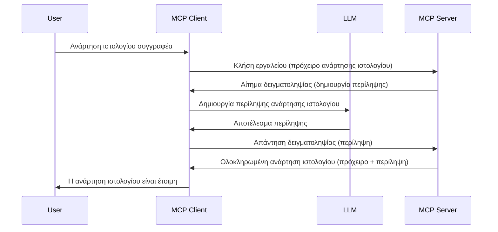

> [ΠΑΡΑΙΤΗΣΗ: 2026-07-28 RELEASE CANDIDATE](https://blog.modelcontextprotocol.io/posts/2026-07-28-release-candidate/)

# Sampling - ανάθεση λειτουργιών στον Πελάτη

> **Ειδοποίηση παραίτησης:** ο υποψήφιος προς δημοσίευση προδιαγραφής MCP `2026-07-28` σηματοδοτεί το Sampling ως παρωχημένο υπέρ της άμεσης ενσωμάτωσης με τα API παρόχων LLM. Το Sampling συνεχίζει να λειτουργεί στο `2025-11-25` και για τουλάχιστον ένα έτος μετά από οποιαδήποτε επίσημη παύση, επομένως όλα σε αυτό το μάθημα παραμένουν έγκυρα — αλλά οι νέοι σχεδιασμοί διακομιστών θα πρέπει να αξιολογήσουν το νέο πρότυπο αντικατάστασης. Δείτε [Τι αλλάζει στο MCP: Ο υποψήφιος προς δημοσίευση του 2026-07-28](../../01-CoreConcepts/mcp-2026-07-28-release-candidate.md).

Μερικές φορές, χρειάζεται ο MCP Πελάτης και ο MCP Διακομιστής να συνεργαστούν για να πετύχουν έναν κοινό στόχο. Μπορεί να υπάρχει μια περίπτωση όπου ο Διακομιστής χρειάζεται τη βοήθεια ενός LLM που βρίσκεται στον πελάτη. Για αυτή την κατάσταση, το sampling είναι αυτό που πρέπει να χρησιμοποιήσετε.

Ας εξερευνήσουμε μερικές περιπτώσεις χρήσης και πώς να δημιουργήσουμε μια λύση που περιλαμβάνει sampling.

## Επισκόπηση

Σε αυτό το μάθημα, εστιάζουμε στο να εξηγήσουμε πότε και πού να χρησιμοποιήσετε το Sampling και πώς να το ρυθμίσετε.

## Στόχοι Μάθησης

Σε αυτό το κεφάλαιο, θα:

- Εξηγήσουμε τι είναι το Sampling και πότε να το χρησιμοποιήσουμε.
- Δείξουμε πώς να ρυθμίσετε το Sampling στο MCP.
- Παρέχουμε παραδείγματα του Sampling σε δράση.

## Τι είναι το Sampling και γιατί να το χρησιμοποιήσουμε;

Το Sampling είναι μια προηγμένη λειτουργία που λειτουργεί ως εξής:



### Αίτημα Sampling

Εντάξει, τώρα που έχουμε μια συνολική εικόνα ενός αξιόπιστου σεναρίου, ας μιλήσουμε για το αίτημα sampling που στέλνει ο διακομιστής στον πελάτη. Δείτε πώς μπορεί να φαίνεται ένα τέτοιο αίτημα σε μορφή JSON-RPC:

```json
{
  "jsonrpc": "2.0",
  "id": 1,
  "method": "sampling/createMessage",
  "params": {
    "messages": [
      {
        "role": "user",
        "content": {
          "type": "text",
          "text": "Create a blog post summary of the following blog post: <BLOG POST>"
        }
      }
    ],
    "modelPreferences": {
      "hints": [
        {
          "name": "claude-3-sonnet"
        }
      ],
      "intelligencePriority": 0.8,
      "speedPriority": 0.5
    },
    "systemPrompt": "You are a helpful assistant.",
    "maxTokens": 100
  }
}
```

Υπάρχουν μερικά σημεία εδώ που αξίζει να επισημανθούν:

- Το Prompt, κάτω από content -> text, είναι η εντολή μας για το LLM να συνοψίσει το περιεχόμενο μιας ανάρτησης ιστολογίου.

- **modelPreferences**. Αυτή η ενότητα είναι απλώς μια προτίμηση, μια σύσταση για το ποια διαμόρφωση να χρησιμοποιηθεί με το LLM. Ο χρήστης μπορεί να επιλέξει αν θα ακολουθήσει αυτές τις συστάσεις ή να τις αλλάξει. Σε αυτή την περίπτωση υπάρχουν συστάσεις για το μοντέλο που θα χρησιμοποιηθεί, την ταχύτητα και την προτεραιότητα νοημοσύνης.
- **systemPrompt**, αυτό είναι το συνηθισμένο σύστημα εκκίνησής σας που δίνει προσωπικότητα στο LLM σας και περιέχει οδηγίες καθοδήγησης.
- **maxTokens**, αυτό είναι ένα ακόμα χαρακτηριστικό που καθορίζει πόσους κόκκους (tokens) συνιστάται να χρησιμοποιηθούν για αυτή την εργασία.

### Απάντηση Sampling

Αυτή η απάντηση είναι αυτό που στέλνει τελικά ο MCP Πελάτης πίσω στον MCP Διακομιστή και είναι το αποτέλεσμα της κλήσης του LLM από τον πελάτη, της αναμονής για αυτήν την απάντηση και μετά της κατασκευής αυτού του μηνύματος. Δείτε πώς μπορεί να φαίνεται σε JSON-RPC:

```json
{
  "jsonrpc": "2.0",
  "id": 1,
  "result": {
    "role": "assistant",
    "content": {
      "type": "text",
      "text": "Here's your abstract <ABSTRACT>"
    },
    "model": "gpt-5",
    "stopReason": "endTurn"
  }
}
```

Σημειώστε πώς η απάντηση είναι μια περίληψη της ανάρτησης ιστολογίου ακριβώς όπως ζητήσαμε. Επίσης σημειώστε πώς το χρησιμοποιημένο `μοντέλο` δεν είναι αυτό που ζητήσαμε αλλά "gpt-5" αντί "claude-3-sonnet". Αυτό επιδεικνύει ότι ο χρήστης μπορεί να αλλάξει γνώμη για το τι θα χρησιμοποιήσει και ότι το αίτημα sampling σας είναι μια σύσταση.

Εντάξει, τώρα που καταλαβαίνουμε την κύρια ροή, και μια χρήσιμη εργασία για να τη χρησιμοποιήσεις είναι "δημιουργία ανάρτησης ιστολογίου + περίληψη", ας δούμε τι χρειαζόμαστε για να λειτουργήσει.

### Τύποι μηνυμάτων

Τα μηνύματα sampling δεν περιορίζονται μόνο σε κείμενο αλλά μπορείτε επίσης να στείλετε εικόνες και ήχο. Δείτε πώς διαφέρει η μορφή JSON-RPC:

**Κείμενο**

```json
{
  "type": "text",
  "text": "The message content"
}
```

**Περιεχόμενο εικόνας**

```json
{
  "type": "image",
  "data": "base64-encoded-image-data",
  "mimeType": "image/jpeg"
}
```

**Περιεχόμενο ήχου**

```json
{
  "type": "audio",
  "data": "base64-encoded-audio-data",
  "mimeType": "audio/wav"
}
```

> ΣΗΜΕΙΩΣΗ: για περισσότερες λεπτομέρειες σχετικά με το Sampling, δείτε τα [επίσημα έγγραφα](https://modelcontextprotocol.io/specification/2025-11-25/client/sampling)

## Πώς να ρυθμίσετε το Sampling στον Πελάτη

> Σημείωση: αν κατασκευάζετε μόνο έναν διακομιστή, δεν χρειάζεται να κάνετε πολλά εδώ.

Σε έναν πελάτη, θα χρειαστεί να ορίσετε την παρακάτω λειτουργία ως εξής:

```json
{
  "capabilities": {
    "sampling": {}
  }
}
```

Αυτό στη συνέχεια θα ενεργοποιηθεί όταν ο επιλεγμένος πελάτης σας ξεκινάει με τον διακομιστή.

## Παράδειγμα Sampling σε δράση - Δημιουργία ανάρτησης ιστολογίου

Ας κωδικοποιήσουμε έναν sampling διακομιστή μαζί, θα χρειαστεί να κάνουμε τα ακόλουθα:

1. Δημιουργήστε ένα εργαλείο στον Διακομιστή.
1. Το εργαλείο αυτό θα πρέπει να δημιουργεί ένα αίτημα sampling.
1. Το εργαλείο θα πρέπει να περιμένει την απάντηση στο αίτημα sampling από τον πελάτη.
1. Στη συνέχεια θα πρέπει να παραχθεί το αποτέλεσμα του εργαλείου.

Ας δούμε τον κώδικα βήμα-βήμα:

### -1- Δημιουργήστε το εργαλείο

**python**

```python
@mcp.tool()
async def create_blog(title: str, content: str, ctx: Context[ServerSession, None]) -> str:
    """Create a blog post and generate a summary"""

```

### -2- Δημιουργήστε αίτημα sampling

Επεκτείνετε το εργαλείο σας με τον ακόλουθο κώδικα:

**python**

```python
post = BlogPost(
        id=len(posts) + 1,
        title=title,
        content=content,
        abstract=""
    )

prompt = f"Create an abstract of the following blog post: title: {title} and draft: {content} "

result = await ctx.session.create_message(
        messages=[
            SamplingMessage(
                role="user",
                content=TextContent(type="text", text=prompt),
            )
        ],
        max_tokens=100,
)

```

### -3- Περιμένετε την απάντηση και επιστρέψτε την απάντηση

**python**

```python
post.abstract = result.content.text

posts.append(post)

# επιστρέψτε το πλήρες προϊόν
return json.dumps({
    "id": post.title,
    "abstract": post.abstract
})
```

### -4- Πλήρης κώδικας

**python**

```python
from starlette.applications import Starlette
from starlette.routing import Mount, Host

from mcp.server.fastmcp import Context, FastMCP

from mcp.server.session import ServerSession
from mcp.types import SamplingMessage, TextContent

import json


from uuid import uuid4
from typing import List
from pydantic import BaseModel


mcp = FastMCP("Blog post generator")

# app = FastAPI()

posts = []

class BlogPost(BaseModel):
    id: int
    title: str
    content: str
    abstract: str

posts: List[BlogPost] = []

@mcp.tool()
async def create_blog(title: str, content: str, ctx: Context[ServerSession, None]) -> str:
    """Create a blog post and generate a summary"""

    post = BlogPost(
        id=len(posts) + 1,
        title=title,
        content=content,
        abstract=""
    )

    prompt = f"Create an abstract of the following blog post: title: {title} and draft: {content} "

    result = await ctx.session.create_message(
        messages=[
            SamplingMessage(
                role="user",
                content=TextContent(type="text", text=prompt),
            )
        ],
        max_tokens=100,
    )

    post.abstract = result.content.text

    posts.append(post)

    # επιστρέψτε την πλήρη ανάρτηση ιστολογίου
    return json.dumps({
        "id": post.title,
        "abstract": post.abstract
    })

if __name__ == "__main__":
    print("Starting server...")
    # mcp.run()
    mcp.run(transport="streamable-http")

# εκτελέστε την εφαρμογή με: python server.py
```

### -5- Δοκιμή στο Visual Studio Code

Για να το δοκιμάσετε στο Visual Studio Code, κάντε τα εξής:

1. Ξεκινήστε τον διακομιστή στο τερματικό
1. Προσθέστε το στο *mcp.json* (και βεβαιωθείτε ότι έχει ξεκινήσει) π.χ. κάπως έτσι:

   ```json
   "servers": {
      "blog-server": {
        "type": "http",
        "url": "http://localhost:8000/mcp"
      }
   }
   ```

1. Πληκτρολογήστε ένα prompt:

   ```text
   create a blog post named "Where Python comes from", the content is "Python is actually named after Monty Python Flying Circus"
   ```

1. Επιτρέψτε το sampling να συμβεί. Την πρώτη φορά που το δοκιμάζετε θα εμφανιστεί ένα επιπλέον παράθυρο διαλόγου το οποίο θα χρειαστεί να αποδεχτείτε, στη συνέχεια θα δείτε τον κανονικό διάλογο που σας ζητά να εκτελέσετε ένα εργαλείο.

1. Εξετάστε τα αποτελέσματα. Θα δείτε τα αποτελέσματα τόσο ωραία αποδοσμένα στο GitHub Copilot Chat, αλλά μπορείτε επίσης να δείτε την ακατέργαστη JSON απάντηση.

**Μπόνους**. Το εργαλείο Visual Studio Code έχει εξαιρετική υποστήριξη για το sampling. Μπορείτε να ρυθμίσετε την πρόσβαση στο Sampling στον εγκατεστημένο σας διακομιστή μεταβαίνοντας ως εξής:

1. Μεταβείτε στην ενότητα επέκτασης.
1. Επιλέξτε το εικονίδιο γραναζιού για τον εγκατεστημένο σας διακομιστή στην ενότητα "MCP SERVERS - INSTALLED".
1 Επιλέξτε "Configure Model Access", εδώ μπορείτε να επιλέξετε ποια μοντέλα επιτρέπεται να χρησιμοποιεί το GitHub Copilot κατά την εκτέλεση sampling. Μπορείτε επίσης να δείτε όλα τα πρόσφατα αιτήματα sampling επιλέγοντας "Show Sampling requests".

## Ανάθεση

Σε αυτή την ανάθεση, θα κατασκευάσετε ένα ελαφρώς διαφορετικό Sampling, συγκεκριμένα μια ενσωμάτωση sampling που υποστηρίζει τη δημιουργία περιγραφής προϊόντος. Ιδού το σενάριό σας:

**Σενάριο**: Ο υπάλληλος του back office σε ένα ηλεκτρονικό κατάστημα χρειάζεται βοήθεια, του παίρνει πάρα πολύ χρόνο να δημιουργήσει περιγραφές προϊόντων. Επομένως, θα δημιουργήσετε μια λύση όπου μπορείτε να καλέσετε ένα εργαλείο "create_product" με "title" και "keywords" ως παραμέτρους και θα πρέπει να παράγει ένα ολοκληρωμένο προϊόν που θα περιλαμβάνει πεδίο "description" που θα συμπληρώνεται από το LLM του πελάτη.

TIP: χρησιμοποιήστε όσα μάθατε νωρίτερα για να κατασκευάσετε αυτόν τον διακομιστή και το εργαλείο χρησιμοποιώντας ένα αίτημα sampling.

## Λύση

[Λύση](./solution/README.md)

## Κύρια σημεία

Το Sampling είναι μια ισχυρή λειτουργία που επιτρέπει στον διακομιστή να αναθέτει εργασίες στον πελάτη όταν χρειάζεται τη βοήθεια ενός LLM.

## Τι ακολουθεί

- [Κεφάλαιο 4 - Πρακτική εφαρμογή](../../04-PracticalImplementation/README.md)

---

<!-- CO-OP TRANSLATOR DISCLAIMER START -->
**Αποποίηση ευθυνών**:
Αυτό το έγγραφο έχει μεταφραστεί χρησιμοποιώντας την υπηρεσία μετάφρασης με τεχνητή νοημοσύνη [Co-op Translator](https://github.com/Azure/co-op-translator). Ενώ επιδιώκουμε την ακρίβεια, παρακαλούμε να έχετε υπόψη ότι οι αυτοματοποιημένες μεταφράσεις ενδέχεται να περιέχουν λάθη ή ανακρίβειες. Το πρωτότυπο έγγραφο στη μητρική του γλώσσα πρέπει να θεωρείται η αυθεντική πηγή. Για κρίσιμες πληροφορίες, συνιστάται επαγγελματική ανθρώπινη μετάφραση. Δεν φέρουμε ευθύνη για τυχόν παρεξηγήσεις ή λανθασμένες ερμηνείες που προκύπτουν από τη χρήση αυτής της μετάφρασης.
<!-- CO-OP TRANSLATOR DISCLAIMER END -->