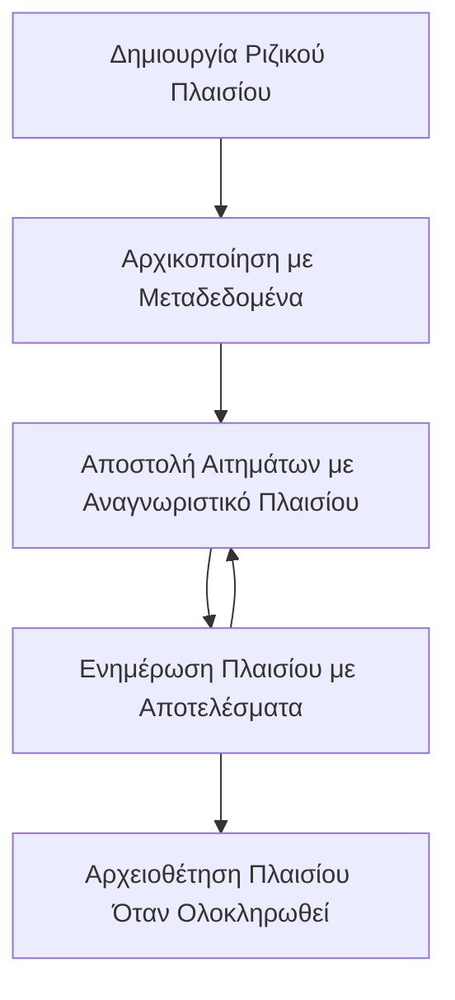

> [ΑΠΑΡΧΑΙΩΜΕΝΟ: ΥΠΟΨΗΦΙΟ ΓΙΑ ΕΚΔΟΣΗ 2026-07-28](https://blog.modelcontextprotocol.io/posts/2026-07-28-release-candidate/#roots-sampling-and-logging-are-deprecated)

# Ρίζες Περιεχομένων MCP

> **Ειδοποίηση απαραιώσεως:** ο υποψήφιος για έκδοση προδιαγραφής MCP `2026-07-28` χαρακτηρίζει τις Ρίζες ως απαρχαιωμένες υπέρ παραμέτρων εργαλείων, URIs πόρων ή ρυθμίσεων διακομιστή. Οι ρίζες συνεχίζουν να λειτουργούν στο `2025-11-25` και για τουλάχιστον έναν χρόνο μετά οποιαδήποτε επίσημη απαρχαίωση, οπότε όλα σε αυτό το μάθημα παραμένουν έγκυρα - αλλά τα νέα σχέδια διακομιστών θα πρέπει να αξιολογήσουν το πρότυπο αντικατάστασης. Δείτε [Τι αλλάζει στο MCP: Ο υποψήφιος για έκδοση 2026-07-28](../../01-CoreConcepts/mcp-2026-07-28-release-candidate.md).

Οι ρίζες περιεχομένων είναι μια θεμελιώδης έννοια στο Πρωτόκολλο Συμφραζομένων Μοντέλου που παρέχει ένα επίμονο επίπεδο για τη διατήρηση ιστορικού συνομιλίας και κοινής κατάστασης σε πολλαπλά αιτήματα και συνεδρίες.

## Εισαγωγή

Σε αυτό το μάθημα, θα εξερευνήσουμε πώς να δημιουργούμε, να διαχειριζόμαστε και να αξιοποιούμε τις ρίζες περιεχομένων στο MCP. 

## Στόχοι Μάθησης

Μέχρι το τέλος αυτού του μαθήματος, θα μπορείτε να:

- Κατανοείτε τον σκοπό και τη δομή των ριζών περιεχομένων
- Δημιουργείτε και διαχειρίζεστε ρίζες περιεχομένων χρησιμοποιώντας τις βιβλιοθήκες πελατών MCP
- Εφαρμόζετε ρίζες περιεχομένων σε εφαρμογές .NET, Java, JavaScript και Python
- Αξιοποιείτε τις ρίζες περιεχομένων για διαλόγους πολλαπλών βημάτων και διαχείριση κατάστασης
- Εφαρμόζετε βέλτιστες πρακτικές για τη διαχείριση ριζών περιεχομένων

## Κατανόηση των Ριζών Περιεχομένων

Οι ρίζες περιεχομένων λειτουργούν ως δοχεία που κρατούν το ιστορικό και την κατάσταση μιας σειράς σχετικών αλληλεπιδράσεων. Επιτρέπουν:

- **Διατήρηση Συνομιλίας**: Διατήρηση συνεκτικών διαλόγων πολλαπλών βημάτων
- **Διαχείριση Μνήμης**: Αποθήκευση και ανάκτηση πληροφοριών μέσω των αλληλεπιδράσεων
- **Διαχείριση Κατάστασης**: Παρακολούθηση προόδου σε πολύπλοκες ροές εργασιών
- **Κοινή Χρήση Περιεχομένου**: Επιτρέποντας σε πολλούς πελάτες να έχουν πρόσβαση στην ίδια κατάσταση συνομιλίας

Στο MCP, οι ρίζες περιεχομένων έχουν τα εξής βασικά χαρακτηριστικά:

- Κάθε ρίζα περιεχομένων έχει ένα μοναδικό αναγνωριστικό.
- Μπορούν να περιέχουν ιστορικό συνομιλίας, προτιμήσεις χρήστη και άλλα μεταδεδομένα.
- Μπορούν να δημιουργούνται, να προσπελαύνονται και να αρχειοθετούνται κατά περίπτωση.
- Υποστηρίζουν λεπτομερή έλεγχο πρόσβασης και άδειες.

## Κύκλος Ζωής Ρίζας Περιεχομένου



## Εργασία με Ρίζες Περιεχομένων

Ακολουθεί ένα παράδειγμα για το πώς να δημιουργείτε και να διαχειρίζεστε ρίζες περιεχομένων. 

### Υλοποίηση σε C#

```csharp
// .NET Example: Root Context Management
using Microsoft.Mcp.Client;
using System;
using System.Threading.Tasks;
using System.Collections.Generic;

public class RootContextExample
{
    private readonly IMcpClient _client;
    private readonly IRootContextManager _contextManager;
    
    public RootContextExample(IMcpClient client, IRootContextManager contextManager)
    {
        _client = client;
        _contextManager = contextManager;
    }
    
    public async Task DemonstrateRootContextAsync()
    {
        // 1. Create a new root context
        var contextResult = await _contextManager.CreateRootContextAsync(new RootContextCreateOptions
        {
            Name = "Customer Support Session",
            Metadata = new Dictionary<string, string>
            {
                ["CustomerName"] = "Acme Corporation",
                ["PriorityLevel"] = "High",
                ["Domain"] = "Cloud Services"
            }
        });
        
        string contextId = contextResult.ContextId;
        Console.WriteLine($"Created root context with ID: {contextId}");
        
        // 2. First interaction using the context
        var response1 = await _client.SendPromptAsync(
            "I'm having issues scaling my web service deployment in the cloud.", 
            new SendPromptOptions { RootContextId = contextId }
        );
        
        Console.WriteLine($"First response: {response1.GeneratedText}");
        
        // Second interaction - the model will have access to the previous conversation
        var response2 = await _client.SendPromptAsync(
            "Yes, we're using containerized deployments with Kubernetes.", 
            new SendPromptOptions { RootContextId = contextId }
        );
        
        Console.WriteLine($"Second response: {response2.GeneratedText}");
        
        // 3. Add metadata to the context based on conversation
        await _contextManager.UpdateContextMetadataAsync(contextId, new Dictionary<string, string>
        {
            ["TechnicalEnvironment"] = "Kubernetes",
            ["IssueType"] = "Scaling"
        });
        
        // 4. Get context information
        var contextInfo = await _contextManager.GetRootContextInfoAsync(contextId);
        
        Console.WriteLine("Context Information:");
        Console.WriteLine($"- Name: {contextInfo.Name}");
        Console.WriteLine($"- Created: {contextInfo.CreatedAt}");
        Console.WriteLine($"- Messages: {contextInfo.MessageCount}");
        
        // 5. When the conversation is complete, archive the context
        await _contextManager.ArchiveRootContextAsync(contextId);
        Console.WriteLine($"Archived context {contextId}");
    }
}
```

Στον προηγούμενο κώδικα έχουμε:

1. Δημιουργήσει μια ρίζα περιεχομένου για μια συνεδρία υποστήριξης πελατών.
1. Στείλει πολλαπλά μηνύματα μέσα σε αυτό το περιεχόμενο, επιτρέποντας στο μοντέλο να διατηρεί κατάσταση.
1. Ενημερώσει το περιεχόμενο με σχετικά μεταδεδομένα βασισμένα στη συνομιλία.
1. Ανακτήσει πληροφορίες περιεχομένου για να κατανοήσει το ιστορικό συνομιλίας.
1. Αρχειοθετήσει το περιεχόμενο όταν η συνομιλία ολοκληρώθηκε.

## Παράδειγμα: Υλοποίηση Ρίζας Περιεχομένου για χρηματοοικονομική ανάλυση

Σε αυτό το παράδειγμα, θα δημιουργήσουμε μια ρίζα περιεχομένου για μια συνεδρία χρηματοοικονομικής ανάλυσης, παρουσιάζοντας πώς να διατηρείτε την κατάσταση μέσα από πολλαπλές αλληλεπιδράσεις.

### Υλοποίηση σε Java

```java
// Παράδειγμα Java: Υλοποίηση Ρίζας Πλαισίου
package com.example.mcp.contexts;

import com.mcp.client.McpClient;
import com.mcp.client.ContextManager;
import com.mcp.models.RootContext;
import com.mcp.models.McpResponse;

import java.util.HashMap;
import java.util.Map;
import java.util.UUID;

public class RootContextsDemo {
    private final McpClient client;
    private final ContextManager contextManager;
    
    public RootContextsDemo(String serverUrl) {
        this.client = new McpClient.Builder()
            .setServerUrl(serverUrl)
            .build();
            
        this.contextManager = new ContextManager(client);
    }
    
    public void demonstrateRootContext() throws Exception {
        // Δημιουργία μεταδεδομένων πλαισίου
        Map<String, String> metadata = new HashMap<>();
        metadata.put("projectName", "Financial Analysis");
        metadata.put("userRole", "Financial Analyst");
        metadata.put("dataSource", "Q1 2025 Financial Reports");
        
        // 1. Δημιουργία νέου ριζικού πλαισίου
        RootContext context = contextManager.createRootContext("Financial Analysis Session", metadata);
        String contextId = context.getId();
        
        System.out.println("Created context: " + contextId);
        
        // 2. Πρώτη αλληλεπίδραση
        McpResponse response1 = client.sendPrompt(
            "Analyze the trends in Q1 financial data for our technology division",
            contextId
        );
        
        System.out.println("First response: " + response1.getGeneratedText());
        
        // 3. Ενημέρωση πλαισίου με σημαντικές πληροφορίες που αποκτήθηκαν από την απάντηση
        contextManager.addContextMetadata(contextId, 
            Map.of("identifiedTrend", "Increasing cloud infrastructure costs"));
        
        // Δεύτερη αλληλεπίδραση - χρήση του ίδιου πλαισίου
        McpResponse response2 = client.sendPrompt(
            "What's driving the increase in cloud infrastructure costs?",
            contextId
        );
        
        System.out.println("Second response: " + response2.getGeneratedText());
        
        // 4. Δημιουργία περίληψης της συνεδρίας ανάλυσης
        McpResponse summaryResponse = client.sendPrompt(
            "Summarize our analysis of the technology division financials in 3-5 key points",
            contextId
        );
        
        // Αποθήκευση της περίληψης στα μεταδεδομένα πλαισίου
        contextManager.addContextMetadata(contextId, 
            Map.of("analysisSummary", summaryResponse.getGeneratedText()));
            
        // Λήψη ενημερωμένων πληροφοριών πλαισίου
        RootContext updatedContext = contextManager.getRootContext(contextId);
        
        System.out.println("Context Information:");
        System.out.println("- Created: " + updatedContext.getCreatedAt());
        System.out.println("- Last Updated: " + updatedContext.getLastUpdatedAt());
        System.out.println("- Analysis Summary: " + 
            updatedContext.getMetadata().get("analysisSummary"));
            
        // 5. Αρχειοθέτηση πλαισίου όταν ολοκληρωθεί
        contextManager.archiveContext(contextId);
        System.out.println("Context archived");
    }
}
```

Στον προηγούμενο κώδικα, έχουμε:

1. Δημιουργήσει μια ρίζα περιεχομένου για μια συνεδρία χρηματοοικονομικής ανάλυσης.
2. Στείλει πολλαπλά μηνύματα μέσα σε αυτό το περιεχόμενο, επιτρέποντας στο μοντέλο να διατηρεί κατάσταση.
3. Ενημερώσει το περιεχόμενο με σχετικά μεταδεδομένα βασισμένα στη συνομιλία.
4. Δημιουργήσει μια περίληψη της συνεδρίας ανάλυσης και την αποθηκεύσει στα μεταδεδομένα του περιεχομένου.
5. Αρχειοθετήσει το περιεχόμενο όταν ολοκληρώθηκε η συνομιλία.

## Παράδειγμα: Διαχείριση Ρίζας Περιεχομένου

Η αποτελεσματική διαχείριση των ριζών περιεχομένων είναι κρίσιμη για τη διατήρηση του ιστορικού συνομιλίας και της κατάστασης. Ακολουθεί ένα παράδειγμα εφαρμογής διαχείρισης ρίζας περιεχομένου.

### Υλοποίηση σε JavaScript

```javascript
// Παράδειγμα JavaScript: Διαχείριση των MCP Root Contexts
const { McpClient, RootContextManager } = require('@mcp/client');

class ContextSession {
  constructor(serverUrl, apiKey = null) {
    // Αρχικοποίηση του πελάτη MCP
    this.client = new McpClient({
      serverUrl,
      apiKey
    });
    
    // Αρχικοποίηση διαχειριστή συμφραζομένων
    this.contextManager = new RootContextManager(this.client);
  }
  
  /**
   * Create a new conversation context
   * @param {string} sessionName - Name of the conversation session
   * @param {Object} metadata - Additional metadata for the context
   * @returns {Promise<string>} - Context ID
   */
  async createConversationContext(sessionName, metadata = {}) {
    try {
      const contextResult = await this.contextManager.createRootContext({
        name: sessionName,
        metadata: {
          ...metadata,
          createdAt: new Date().toISOString(),
          status: 'active'
        }
      });
      
      console.log(`Created root context '${sessionName}' with ID: ${contextResult.id}`);
      return contextResult.id;
    } catch (error) {
      console.error('Error creating root context:', error);
      throw error;
    }
  }
  
  /**
   * Send a message in an existing context
   * @param {string} contextId - The root context ID
   * @param {string} message - The user's message
   * @param {Object} options - Additional options
   * @returns {Promise<Object>} - Response data
   */
  async sendMessage(contextId, message, options = {}) {
    try {
      // Αποστολή μηνύματος χρησιμοποιώντας το συγκεκριμένο πλαίσιο
      const response = await this.client.sendPrompt(message, {
        rootContextId: contextId,
        temperature: options.temperature || 0.7,
        allowedTools: options.allowedTools || []
      });
      
      // Προαιρετικά αποθήκευση σημαντικών πληροφοριών από τη συνομιλία
      if (options.storeInsights) {
        await this.storeConversationInsights(contextId, message, response.generatedText);
      }
      
      return {
        message: response.generatedText,
        toolCalls: response.toolCalls || [],
        contextId
      };
    } catch (error) {
      console.error(`Error sending message in context ${contextId}:`, error);
      throw error;
    }
  }
  
  /**
   * Store important insights from a conversation
   * @param {string} contextId - The root context ID
   * @param {string} userMessage - User's message
   * @param {string} aiResponse - AI's response
   */
  async storeConversationInsights(contextId, userMessage, aiResponse) {
    try {
      // Εξαγωγή πιθανών πληροφοριών (σε μια πραγματική εφαρμογή, αυτό θα ήταν πιο εξελιγμένο)
      const combinedText = userMessage + "\n" + aiResponse;
      
      // Απλός κανόνας για τον εντοπισμό πιθανών πληροφοριών
      const insightWords = ["important", "key point", "remember", "significant", "crucial"];
      
      const potentialInsights = combinedText
        .split(".")
        .filter(sentence => 
          insightWords.some(word => sentence.toLowerCase().includes(word))
        )
        .map(sentence => sentence.trim())
        .filter(sentence => sentence.length > 10);
      
      // Αποθήκευση πληροφοριών στα μεταδεδομένα του πλαισίου
      if (potentialInsights.length > 0) {
        const insights = {};
        potentialInsights.forEach((insight, index) => {
          insights[`insight_${Date.now()}_${index}`] = insight;
        });
        
        await this.contextManager.updateContextMetadata(contextId, insights);
        console.log(`Stored ${potentialInsights.length} insights in context ${contextId}`);
      }
    } catch (error) {
      console.warn('Error storing conversation insights:', error);
      // Μη κρίσιμο σφάλμα, οπότε απλά καταγράψτε προειδοποίηση
    }
  }
  
  /**
   * Get summary information about a context
   * @param {string} contextId - The root context ID
   * @returns {Promise<Object>} - Context information
   */
  async getContextInfo(contextId) {
    try {
      const contextInfo = await this.contextManager.getContextInfo(contextId);
      
      return {
        id: contextInfo.id,
        name: contextInfo.name,
        created: new Date(contextInfo.createdAt).toLocaleString(),
        lastUpdated: new Date(contextInfo.lastUpdatedAt).toLocaleString(),
        messageCount: contextInfo.messageCount,
        metadata: contextInfo.metadata,
        status: contextInfo.status
      };
    } catch (error) {
      console.error(`Error getting context info for ${contextId}:`, error);
      throw error;
    }
  }
  
  /**
   * Generate a summary of the conversation in a context
   * @param {string} contextId - The root context ID
   * @returns {Promise<string>} - Generated summary
   */
  async generateContextSummary(contextId) {
    try {
      // Ζητήστε από το μοντέλο να δημιουργήσει περίληψη της συνομιλίας μέχρι στιγμής
      const response = await this.client.sendPrompt(
        "Please summarize our conversation so far in 3-4 sentences, highlighting the main points discussed.",
        { rootContextId: contextId, temperature: 0.3 }
      );
      
      // Αποθήκευση της περίληψης στα μεταδεδομένα του πλαισίου
      await this.contextManager.updateContextMetadata(contextId, {
        conversationSummary: response.generatedText,
        summarizedAt: new Date().toISOString()
      });
      
      return response.generatedText;
    } catch (error) {
      console.error(`Error generating context summary for ${contextId}:`, error);
      throw error;
    }
  }
  
  /**
   * Archive a context when it's no longer needed
   * @param {string} contextId - The root context ID
   * @returns {Promise<Object>} - Result of the archive operation
   */
  async archiveContext(contextId) {
    try {
      // Δημιουργία τελικής περίληψης πριν την αρχειοθέτηση
      const summary = await this.generateContextSummary(contextId);
      
      // Αρχειοθέτηση του πλαισίου
      await this.contextManager.archiveContext(contextId);
      
      return {
        status: "archived",
        contextId,
        summary
      };
    } catch (error) {
      console.error(`Error archiving context ${contextId}:`, error);
      throw error;
    }
  }
}

// Παράδειγμα χρήσης
async function demonstrateContextSession() {
  const session = new ContextSession('https://mcp-server-example.com');
  
  try {
    // 1. Δημιουργήστε ένα νέο πλαίσιο για μια συνομιλία υποστήριξης προϊόντος
    const contextId = await session.createConversationContext(
      'Product Support - Database Performance',
      {
        customer: 'Globex Corporation',
        product: 'Enterprise Database',
        severity: 'Medium',
        supportAgent: 'AI Assistant'
      }
    );
    
    // 2. Πρώτο μήνυμα στη συνομιλία
    const response1 = await session.sendMessage(
      contextId,
      "I'm experiencing slow query performance on our database cluster after the latest update.",
      { storeInsights: true }
    );
    console.log('Response 1:', response1.message);
    
    // Μήνυμα παρακολούθησης στο ίδιο πλαίσιο
    const response2 = await session.sendMessage(
      contextId,
      "Yes, we've already checked the indexes and they seem to be properly configured.",
      { storeInsights: true }
    );
    console.log('Response 2:', response2.message);
    
    // 3. Λάβετε πληροφορίες για το πλαίσιο
    const contextInfo = await session.getContextInfo(contextId);
    console.log('Context Information:', contextInfo);
    
    // 4. Δημιουργήστε και εμφανίστε περίληψη της συνομιλίας
    const summary = await session.generateContextSummary(contextId);
    console.log('Conversation Summary:', summary);
    
    // 5. Αρχειοθετήστε το πλαίσιο όταν τελειώσετε
    const archiveResult = await session.archiveContext(contextId);
    console.log('Archive Result:', archiveResult);
    
    // 6. Αντιμετωπίστε τυχόν σφάλματα με ευγένεια
  } catch (error) {
    console.error('Error in context session demonstration:', error);
  }
}

demonstrateContextSession();
```

Στον προηγούμενο κώδικα έχουμε:

1. Δημιουργήσει μια ρίζα περιεχομένου για μια συνομιλία υποστήριξης προϊόντος με τη λειτουργία `createConversationContext`. Σε αυτή την περίπτωση, το περιεχόμενο αφορά προβλήματα απόδοσης βάσης δεδομένων.

1. Στείλει πολλαπλά μηνύματα μέσα σε αυτό το περιεχόμενο, επιτρέποντας στο μοντέλο να διατηρεί κατάσταση με τη λειτουργία `sendMessage`. Τα μηνύματα που στέλνονται αφορούν αργές αποδόσεις ερωτημάτων και διαμόρφωση ευρετηρίων.

1. Ενημερώσει το περιεχόμενο με σχετικά μεταδεδομένα βασισμένα στη συνομιλία.

1. Δημιουργήσει μια περίληψη της συνομιλίας και την αποθηκεύσει στα μεταδεδομένα με τη λειτουργία `generateContextSummary`.

1. Αρχειοθετήσει το περιεχόμενο όταν ολοκληρώθηκε η συνομιλία με τη λειτουργία `archiveContext`.

1. Διαχειριστεί σφάλματα με επιδεξιότητα για να εξασφαλίσει αξιοπιστία.

## Ρίζα Περιεχομένου για Πολυβηματική Υποστήριξη

Σε αυτό το παράδειγμα, θα δημιουργήσουμε μια ρίζα περιεχομένου για μια συνεδρία πολυβηματικής υποστήριξης, παρουσιάζοντας πώς να διατηρούμε κατάσταση μέσα από πολλαπλές αλληλεπιδράσεις.

### Υλοποίηση σε Python

```python
# Παράδειγμα Python: Βασικό Πλαίσιο για Πολυγλωσσική Βοήθεια
import asyncio
from datetime import datetime
from mcp_client import McpClient, RootContextManager

class AssistantSession:
    def __init__(self, server_url, api_key=None):
        self.client = McpClient(server_url=server_url, api_key=api_key)
        self.context_manager = RootContextManager(self.client)
    
    async def create_session(self, name, user_info=None):
        """Create a new root context for an assistant session"""
        metadata = {
            "session_type": "assistant",
            "created_at": datetime.now().isoformat(),
        }
        
        # Προσθήκη πληροφοριών χρήστη αν παρέχονται
        if user_info:
            metadata.update({f"user_{k}": v for k, v in user_info.items()})
            
        # Δημιουργία του βασικού πλαισίου
        context = await self.context_manager.create_root_context(name, metadata)
        return context.id
    
    async def send_message(self, context_id, message, tools=None):
        """Send a message within a root context"""
        # Δημιουργία επιλογών με αναγνωριστικό πλαισίου
        options = {
            "root_context_id": context_id
        }
        
        # Προσθήκη εργαλείων αν καθορίζονται
        if tools:
            options["allowed_tools"] = tools
        
        # Αποστολή της προτροπής μέσα στο πλαίσιο
        response = await self.client.send_prompt(message, options)
        
        # Ενημέρωση μεταδεδομένων πλαισίου με την πρόοδο της συνομιλίας
        await self.context_manager.update_context_metadata(
            context_id,
            {
                f"message_{datetime.now().timestamp()}": message[:50] + "...",
                "last_interaction": datetime.now().isoformat()
            }
        )
        
        return response
    
    async def get_conversation_history(self, context_id):
        """Retrieve conversation history from a context"""
        context_info = await self.context_manager.get_context_info(context_id)
        messages = await self.client.get_context_messages(context_id)
        
        return {
            "context_info": context_info,
            "messages": messages
        }
    
    async def end_session(self, context_id):
        """End an assistant session by archiving the context"""
        # Δημιουργία πρώτα περίληψης προτροπής
        summary_response = await self.client.send_prompt(
            "Please summarize our conversation and any key points or decisions made.",
            {"root_context_id": context_id}
        )
        
        # Αποθήκευση περίληψης στα μεταδεδομένα
        await self.context_manager.update_context_metadata(
            context_id,
            {
                "summary": summary_response.generated_text,
                "ended_at": datetime.now().isoformat(),
                "status": "completed"
            }
        )
        
        # Αρχειοθέτηση του πλαισίου
        await self.context_manager.archive_context(context_id)
        
        return {
            "status": "completed",
            "summary": summary_response.generated_text
        }

# Παράδειγμα χρήσης
async def demo_assistant_session():
    assistant = AssistantSession("https://mcp-server-example.com")
    
    # 1. Δημιουργία συνεδρίας
    context_id = await assistant.create_session(
        "Technical Support Session",
        {"name": "Alex", "technical_level": "advanced", "product": "Cloud Services"}
    )
    print(f"Created session with context ID: {context_id}")
    
    # 2. Πρώτη αλληλεπίδραση
    response1 = await assistant.send_message(
        context_id, 
        "I'm having trouble with the auto-scaling feature in your cloud platform.",
        ["documentation_search", "diagnostic_tool"]
    )
    print(f"Response 1: {response1.generated_text}")
    
    # Δεύτερη αλληλεπίδραση στο ίδιο πλαίσιο
    response2 = await assistant.send_message(
        context_id,
        "Yes, I've already checked the configuration settings you mentioned, but it's still not working."
    )
    print(f"Response 2: {response2.generated_text}")
    
    # 3. Λήψη ιστορικού
    history = await assistant.get_conversation_history(context_id)
    print(f"Session has {len(history['messages'])} messages")
    
    # 4. Λήξη συνεδρίας
    end_result = await assistant.end_session(context_id)
    print(f"Session ended with summary: {end_result['summary']}")

if __name__ == "__main__":
    asyncio.run(demo_assistant_session())
```

Στον προηγούμενο κώδικα έχουμε:

1. Δημιουργήσει μια ρίζα περιεχομένου για μια συνεδρία τεχνικής υποστήριξης με τη λειτουργία `create_session`. Το περιεχόμενο περιλαμβάνει πληροφορίες χρήστη όπως όνομα και τεχνικό επίπεδο.

1. Στείλει πολλαπλά μηνύματα μέσα σε αυτό το περιεχόμενο, επιτρέποντας στο μοντέλο να διατηρεί κατάσταση με τη λειτουργία `send_message`. Τα μηνύματα αφορούν προβλήματα με τη λειτουργία αυτόματης κλιμάκωσης.

1. Ανακτήσει το ιστορικό συνομιλίας χρησιμοποιώντας τη λειτουργία `get_conversation_history`, που παρέχει πληροφορίες περιεχομένου και μηνύματα.

1. Ολοκληρώσει τη συνεδρία αρχειοθετώντας το περιεχόμενο και δημιουργώντας μια περίληψη με τη λειτουργία `end_session`. Η περίληψη καταγράφει τα βασικά σημεία της συνομιλίας.

## Βέλτιστες Πρακτικές για τις Ρίζες Περιεχομένων

Εδώ είναι μερικές βέλτιστες πρακτικές για την αποτελεσματική διαχείριση ριζών περιεχομένων:

- **Δημιουργήστε Εστιασμένα Περιεχόμενα**: Δημιουργήστε ξεχωριστές ρίζες περιεχομένων για διαφορετικούς σκοπούς ή τομείς συνομιλίας για να διατηρήσετε την σαφήνεια.

- **Θέστε Πολιτικές Λήξης**: Εφαρμόστε πολιτικές για αρχειοθέτηση ή διαγραφή παλαιών περιεχομένων για διαχείριση αποθηκευτικού χώρου και συμμόρφωση με πολιτικές διατήρησης δεδομένων.

- **Αποθηκεύστε Σχετικά Μεταδεδομένα**: Χρησιμοποιήστε τα μεταδεδομένα του περιεχομένου για να αποθηκεύσετε σημαντικές πληροφορίες της συνομιλίας που μπορεί να είναι χρήσιμες αργότερα.

- **Χρησιμοποιήστε τα Αναγνωριστικά Περιεχομένου Συστηματικά**: Μόλις δημιουργηθεί ένα περιεχόμενο, χρησιμοποιήστε το ID του συστηματικά για όλα τα σχετικά αιτήματα για να διατηρείται η συνέχεια.

- **Δημιουργήστε Περιλήψεις**: Όταν ένα περιεχόμενο μεγαλώνει πολύ, σκεφτείτε να δημιουργήσετε περιλήψεις για να καταγράψετε ουσιώδεις πληροφορίες ενώ διαχειρίζεστε το μέγεθος του περιεχομένου.

- **Εφαρμόστε Έλεγχο Πρόσβασης**: Για συστήματα με πολλούς χρήστες, εφαρμόστε σωστούς ελέγχους πρόσβασης για να εξασφαλίσετε την ιδιωτικότητα και ασφάλεια των ριζών συνομιλίας.

- **Αντιμετωπίστε τους Περιορισμούς Περιεχομένου**: Να είστε ενήμεροι για τους περιορισμούς μεγέθους της ρίζας περιεχομένου και να εφαρμόζετε στρατηγικές για τη διαχείριση πολύ μεγάλων συνομιλιών.

- **Αρχειοθετήστε Όταν Ολοκληρωθεί**: Αρχειοθετήστε τις ρίζες όταν οι συνομιλίες ολοκληρώνονται για να ελευθερώσετε πόρους διατηρώντας ταυτόχρονα το ιστορικό συνομιλίας.

## Τι ακολουθεί

- [5.5 Δρομολόγηση](../mcp-routing/README.md)

---

<!-- CO-OP TRANSLATOR DISCLAIMER START -->
**Αποποίηση ευθυνών**:
Αυτό το έγγραφο έχει μεταφραστεί χρησιμοποιώντας την υπηρεσία μετάφρασης με τεχνητή νοημοσύνη [Co-op Translator](https://github.com/Azure/co-op-translator). Ενώ επιδιώκουμε την ακρίβεια, παρακαλούμε να έχετε υπόψη ότι οι αυτοματοποιημένες μεταφράσεις ενδέχεται να περιέχουν λάθη ή ανακρίβειες. Το πρωτότυπο έγγραφο στη μητρική του γλώσσα πρέπει να θεωρείται η αυθεντική πηγή. Για κρίσιμες πληροφορίες, συνιστάται επαγγελματική ανθρώπινη μετάφραση. Δεν φέρουμε ευθύνη για τυχόν παρεξηγήσεις ή λανθασμένες ερμηνείες που προκύπτουν από τη χρήση αυτής της μετάφρασης.
<!-- CO-OP TRANSLATOR DISCLAIMER END -->