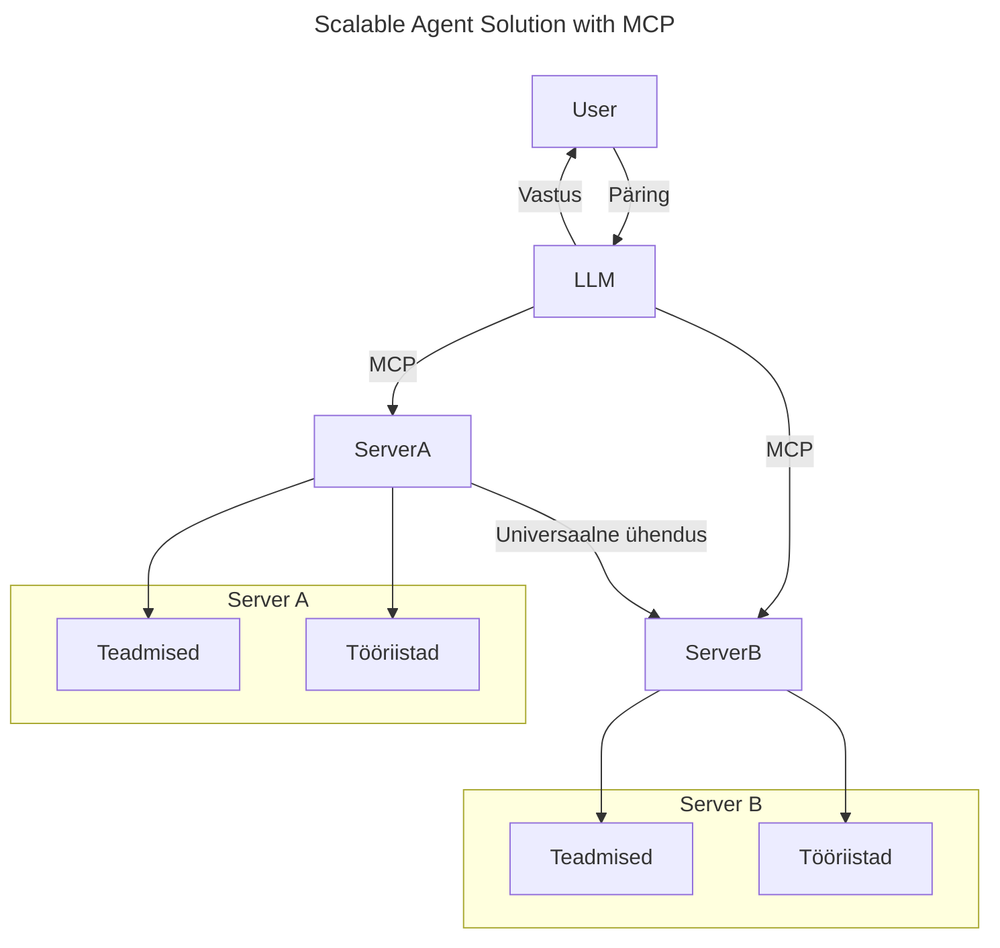
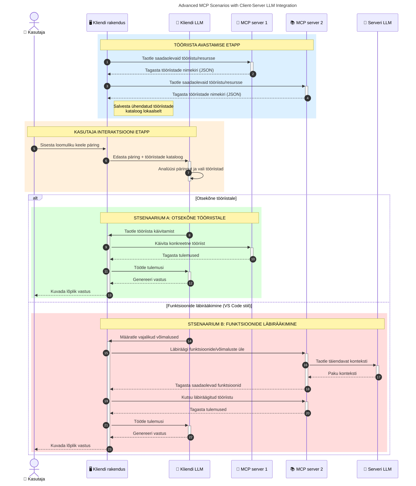

# Tutvustus Mudeli konteksti protokollile (MCP): Miks see on oluline skaleeritavate AI rakenduste jaoks

[](https://youtu.be/agBbdiOPLQA)

_(Klõpsa ülalolevale pildile, et vaadata selle õppetunni videot)_

Generatiivsed AI rakendused on suur samm edasi, kuna need võimaldavad kasutajal sageli suhelda rakendusega loomuliku keele käskude abil. Kuid kuna sellistesse rakendustesse investeeritakse rohkem aega ja ressursse, soovid veenduda, et saad funktsionaalsusi ja ressursse hõlpsasti integreerida nii, et neid oleks lihtne laiendada, et sinu rakendus suudaks teenindada rohkem kui ühte mudelit ja käsitleda erinevaid mudelite spetsiifikasid. Lühidalt, Generatiivsete AI rakenduste loomine on alguses lihtne, kuid kui need kasvavad ja muutuvad keerukamaks, tuleb hakata määratlema arhitektuuri ning tõenäoliselt tugineda standardile, et tagada rakenduste ehitamine ühtsel viisil. Siin tuleb mängu MCP, mis organiseerib asju ja pakub standardi.

---

## **🔍 Mis on Mudelikonteksti protokoll (MCP)?**

**Mudelikonteksti protokoll (MCP)** on **avatud, standardiseeritud liides**, mis võimaldab suurtele keelemudelitele (LLM) sujuvalt suhelda välistööriistade, API-de ja andmeallikatega. See pakub ühtset arhitektuuri, et täiustada AI mudeli funktsionaalsust kaugemale nende treeningandmetest, võimaldades targemaid, skaleeritavaid ja reageerivamaid AI süsteeme.

---

## **🎯 Miks on AI standardiseerimine oluline**

Kuna generatiivsed AI rakendused muutuvad keerukamaks, on oluline võtta kasutusele standardid, mis tagavad **skaleeritavuse, laiendatavuse, hooldatavuse** ja **tarnijast sõltumatuse vältimise**. MCP vastab nendele vajadustele, pakkudes:

- Mudeli-tööriista integratsioonide ühtlustamist
- Ühekordsete ja haprate kohandatud lahenduste vähendamist
- Võimalust, et erinevate tarnijate mitmed mudelid saavad samas ökosüsteemis koos eksisteerida

**Märkus:** Kuigi MCP tutvustab end avanädala standardina, puuduvad plaanid MCP standardiseerimiseks läbi olemasolevate standardiorganisatsioonide nagu IEEE, IETF, W3C, ISO või muu taolise keha.

---

## **📚 Õpieesmärgid**

Selle artikli lõpuks oskad:

- Määratleda **Mudelikonteksti protokolli (MCP)** ja selle kasutusjuhtumeid
- Mõista, kuidas MCP standardiseerib mudeli ja tööriista vahelise kommunikatsiooni
- Tuvastada MCP arhitektuuri põhikomponente
- Uurida MCP praktilisi rakendusi ettevõtte- ja arenduskontekstis

---

## **💡 Miks on Mudelikonteksti protokoll (MCP) mängumuutja**

### **🔗 MCP lahendab AI interaktsioonide killustatuse**

Enne MCP-d nõudis mudelite integreerimine tööriistadega:

- Kohandatud koodi iga tööriista-mudeli paari jaoks
- Ei-standardseid API-sid iga tarnija jaoks
- Sageli katkestusi uuenduste tõttu
- Kehva skaleeritavust tööriistade arvu kasvades

### **✅ MCP standardiseerimise eelised**

| **Eelis**               | **Kirjeldus**                                                                  |
|------------------------|--------------------------------------------------------------------------------|
| Ühilduvus              | LLM-id töötavad sujuvalt tööriistadega eri tarnijatelt                         |
| Järjepidevus           | Ühtsed käitumismustrid platvormidel ja tööriistadel                           |
| Taaskasutatavus        | Üks kord loodud tööriistu saab kasutada mitmes projektis ja süsteemis         |
| Kiirendatud arendus    | Vähenda arendust aega, kasutades standardiseeritud ja plug-and-play liideseid  |

---

## **🧱 Üldine MCP arhitektuuri ülevaade**

MCP järgib **kliendi-serveri mudelit**, kus:

- **MCP Hostid** haldavad AI mudeleid
- **MCP Kliendid** algatavad päringuid
- **MCP Serverid** pakuvad konteksti, tööriistu ja võimekusi

### **Olulised komponendid:**

- **Ressursid** – staatilised või dünaamilised andmed mudelitele  
- **Põhjalikes juhistes** – eelmääratletud töövood juhitud generaatoritele  
- **Tööriistad** – täidetavad funktsioonid nagu otsing, arvutused  
- **Valik** – agentne käitumine rekursiivsete interaktsioonide kaudu (vabandatud `2026-07-28` versiooni kandidaadis)
- **Eeldamine** – serveri algatatud kasutajasisendi päringud
- **Juurte piirid** – failisüsteemi piirid serveri juurdepääsukontrolliks (vabandatud `2026-07-28` versiooni kandidaadis)

### **Protokolli arhitektuur:**

MCP kasutab kahekihilist arhitektuuri:
- **Andmekiht**: JSON-RPC 2.0-põhine kommunikatsioon elutsüklijuhtimise ja primitiividega
- **Transpordikiht**: STDIO (kohalik) ja voogedastusega HTTP koos SSE-ga (kaug) kommunikatsioonikanalid

---

## Kuidas MCP serverid töötavad

MCP serverid töötavad järgmiselt:

- **Päringu voog**:
    1. Päringu algatab lõppkasutaja või tema nimel tegutsev tarkvara.
    2. **MCP klient** saadab päringu **MCP hostile**, kes haldab AI mudeli tööaega.
    3. **AI mudel** saab kasutaja päringu ning võib taotleda juurdepääsu välistööriistadele või andmetele ühe või mitme tööriistakõne kaudu.
    4. **MCP host**, mitte mudel otseselt, suhtleb sobiva(te) **MCP serveri(de)**ga, kasutades standardiseeritud protokolli.
- **MCP hosti funktsioonid**:
    - **Tööriistade register**: Hoiab nimekirja saadaolevatest tööriistadest ja nende võimetest.
    - **Autentimine**: Kontrollib tööriistadele juurdepääsu õigusi.
    - **Päringute töötleja**: Töötleb mudelilt tulevaid tööriista päringuid.
    - **Vastusevormindaja**: Strukturiseerib tööriista väljundid mudeli jaoks arusaadavasse vormi.
- **MCP serveri täitmine**:
    - **MCP host** suunab tööriistakõned ühe või mitme **MCP serveri** poole, mis pakuvad spetsialiseeritud funktsioone (nt otsing, arvutused, andmebaasi päringud).
    - **MCP serverid** täidavad oma toimingud ja tagastavad tulemused **MCP hostile** ühtses vormingus.
    - **MCP host** vormindab ja edastab need tulemused edasi **AI mudelile**.
- **Vastuse lõpetamine**:
    - **AI mudel** kaasab tööriista väljundid lõplikku vastusesse.
    - **MCP host** saadab selle vastuse tagasi **MCP kliendile**, kes edastab selle lõppkasutajale või päringut algatanud tarkvarale.
    

```mermaid
---
title: MCP Architecture and Component Interactions
description: A diagram showing the flows of the components in MCP.
---
graph TD
    Client[MCP klient/rakendus] -->|Saadab taotluse| H[MCP host]
    H -->|Kutsus esile| A[tehisintellekti mudel]
    A -->|Tööriista kutse taotlus| H
    H -->|MCP Protocol| T1[MCP Server Tool 01: Veebipõhine otsing
    H -->|MCP Protocol| T2[MCP Server Tool 02: Kalkulaatori tööriist
    H -->|MCP Protocol| T3[MCP Server Tool 03: Andmebaasi ligipääsu tööriist
    H -->|MCP Protocol| T4[MCP Server Tool 04: Failisüsteemi tööriist
    H -->|Saadab vastuse| Client

    subgraph "MCP Host komponendid"
        H
        G[Tööriistade register]
        I[Autentimine]
        J[Taotluste töötleja]
        K[Vastuse vormindaja]
    end

    H <--> G
    H <--> I
    H <--> J
    H <--> K

    style A fill:#f9d5e5,stroke:#333,stroke-width:2px
    style H fill:#eeeeee,stroke:#333,stroke-width:2px
    style Client fill:#d5e8f9,stroke:#333,stroke-width:2px
    style G fill:#fffbe6,stroke:#333,stroke-width:1px
    style I fill:#fffbe6,stroke:#333,stroke-width:1px
    style J fill:#fffbe6,stroke:#333,stroke-width:1px
    style K fill:#fffbe6,stroke:#333,stroke-width:1px
    style T1 fill:#c2f0c2,stroke:#333,stroke-width:1px
    style T2 fill:#c2f0c2,stroke:#333,stroke-width:1px
    style T3 fill:#c2f0c2,stroke:#333,stroke-width:1px
    style T4 fill:#c2f0c2,stroke:#333,stroke-width:1px
```

## 👨‍💻 Kuidas ehitada MCP serverit (näidetega)

MCP serverid võimaldavad laiendada LLM võimeid, pakkudes andmeid ja funktsionaalsust. 

Kas oled valmis proovima? Siin on keele- ja lähenemispõhised SDK-d näidetega, kuidas luua lihtsaid MCP servereid mitmes keeles/lähenemises:

- **Python SDK**: https://github.com/modelcontextprotocol/python-sdk

- **TypeScript SDK**: https://github.com/modelcontextprotocol/typescript-sdk

- **Java SDK**: https://github.com/modelcontextprotocol/java-sdk

- **C#/.NET SDK**: https://github.com/modelcontextprotocol/csharp-sdk


## 🌍 MCP praktilised kasutusviisid

MCP võimaldab laia valikut rakendusi, laiendades AI võimeid:

| **Rakendus**                 | **Kirjeldus**                                                                |
|-----------------------------|--------------------------------------------------------------------------------|
| Ettevõtteandmete integratsioon | Ühenda LLM-id andmebaaside, CRM-ide või sisetööriistadega                       |
| Agentne AI süsteemid         | Võimalda autonoomsetel agentidel tööriistade ligipääs ja otsustuskäigud        |
| Mitmemodaalsed rakendused    | Ühenda tekst-, pilt- ja helitööriistad ühes ühtses AI rakenduses               |
| Reaalajas andmete integreerimine | Too AI interaktsioonidesse otseülekande andmeid täpsemate ja ajakohaste väljundite jaoks |


### 🧠 MCP = universaalne AI interaktsioonide standard

Mudelikonteksti protokoll (MCP) toimib AI interaktsioonide universaalse standardina, sarnaselt USB-C-le, mis standardiseeris seadmete füüsilisi ühendusi. AI maailmas pakub MCP ühtset liidest, mis võimaldab mudelitel (kliendid) sujuvalt integreeruda välistööriistade ja andmepakkujatega (serverid). See elimineerib vajaduse iga API või andmeallika puhul erinevate kohandatud protokollide järele.

MCP-s järgib MCP-ühilduv tööriist (tuntud kui MCP server) ühtset standardit. Need serverid võivad loetleda pakutavad tööriistad või toimingud ja täita neid AI agendi nõudmisel. MCP-t toetavad AI agentide platvormid suudavad avastada serverite tööriistu ja neid selle standardprotokolli kaudu käivitada.

### 💡 Lihtsustab ligipääsu teadmistele

Lisaks tööriistade pakkumisele lihtsustab MCP ka ligipääsu teadmistele. See võimaldab rakendustel pakkuda suurtele keelemudelitele (LLM) konteksti, ühendades neid erinevate andmeallikatega. Näiteks võib MCP server esindada ettevõtte dokumentide hoidlat, võimaldades agentidel vajadusel asjakohast teavet otsida. Teine server võib hallata spetsiifilisi toiminguid, näiteks e-kirjade saatmist või andmete uuendamist. Agendi vaatekohast on need lihtsalt tööriistad – mõned pakuvad teadmiste konteksti, teised täidavad toiminguid. MCP haldab mõlemaid tõhusalt.

Agenid, mis ühenduvad MCP serveriga, õpivad automaatselt serveri saadaval olevaid võimeid ja ligipääsetavaid andmeid standardse vormingu kaudu. See standardiseerimine võimaldab tööriistade dünaamilist kättesaadavust. Näiteks uue MCP serveri lisamine agendi süsteemi muudab selle funktsioonid koheselt kasutatavaks ilma agendi juhiste täiendava kohandamiseta.

See sujuv integratsioon vastab alloleval diagrammil kujutatud voole, kus serverid pakuvad nii tööriistu kui teadmisi, tagades süsteemide vahelise katkematu koostöö. 

### 👉 Näide: Skaleeritav agenidirakendus


Universaalne Ühendaja võimaldab MCP serveritel omavahel suhelda ja jagada võimeid, võimaldades ServerA-l delegeerida ülesandeid ServerB-le või kasutada selle tööriistu ja teadmisi. See loob tööriistade ja andmete föderatsiooni serverite vahel, toetades skaleeritavaid ja modulaarseid agenidi arhitektuure. Kuna MCP standardiseerib tööriistade eksponeerimise, saavad agenid dünaamiliselt avastada ja suunata päringuid serverite vahel ilma rangete eelprogrammeeritud integratsioonideta.


Tööriistade ja teadmiste föderatsioon: tööriistu ja andmeid saab serverite vahel kasutada, võimaldades skaleeritavat ja modulaarset agentset arhitektuuri.

### 🔄 Täiustatud MCP stsenaariumid kliendipoolse LLM integratsiooniga

Põhilise MCP arhitektuuri kõrval eksisteerivad täiustatud stsenaariumid, kus nii klient kui server sisaldavad LLM-e, võimaldades keerukamaid interaktsioone. Järgmises diagrammis võib **Kliendirakendus** olla IDE, kus on kasutajale LLM poolt kättesaadavad mitmed MCP tööriistad:



## 🔐 MCP praktilised eelised

Siin on MCP kasutamise praktilised eelised:

- **Uudsus**: Mudelid pääsevad ligi ajakohasele infole väljaspool oma treeningandmeid
- **Võimekuslaiendus**: Mudelid saavad kasutada spetsialiseeritud tööriistu ülesanneteks, milleks neid pole treenitud
- **Hallutsinatsioonide vähendamine**: Välised andmeallikad pakuvad faktilist alust
- **Privaatsus**: Sensitiivne info võib jääda turvalisse keskkonda, mitte sisestatud juhistesse

## 📌 Peamised järeldused

Järgnevad on MCP kasutamise peamised järeldused:

- **MCP** standardiseerib, kuidas AI mudelid suhtlevad tööriistade ja andmetega
- Edendab **laiendatavust, järjepidevust ja ühilduvust**
- MCP aitab **vähendada arendusaega, parandada usaldusväärsust ja laiendada mudeli võimeid**
- Kliendi-serveri arhitektuur **võimaldab paindlikke, laiendatavaid AI rakendusi**

## 🧠 Harjutus

Mõtle AI rakendusele, mida soovid ehitada.

- Millised **välised tööriistad või andmed** võiksid selle võimeid täiendada?
- Kuidas võiks MCP teha integratsiooni **lihtsamaks ja usaldusväärsemaks?**

## Lisamaterjalid

- [MCP GitHubi hoidla](https://github.com/modelcontextprotocol)


## Järgmine samm

Järgmine: [1. peatükk: Põhimõisted](../01-CoreConcepts/README.md)

---

<!-- CO-OP TRANSLATOR DISCLAIMER START -->
**Lahtiütlus**:
See dokument on tõlgitud kasutades AI tõlketeenust [Co-op Translator](https://github.com/Azure/co-op-translator). Kuigi me püüdleme täpsuse poole, palun pange tähele, et automatiseeritud tõlgetes võib esineda vigu või ebatäpsusi. Originaaldokument selle emakeeles tuleks pidada autoriteetseks allikaks. Olulise teabe puhul soovitatakse kasutada professionaalset inimtõlget. Me ei vastuta selle tõlkega seotud eksimustest või valesti mõistmistest.
<!-- CO-OP TRANSLATOR DISCLAIMER END -->