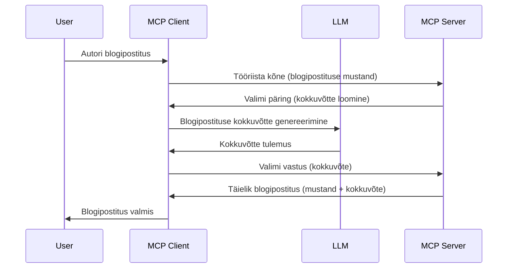

> [VANANENUD: 2026-07-28 RELEASE CANDIDATE](https://blog.modelcontextprotocol.io/posts/2026-07-28-release-candidate/)

# Proovivõtt - omaduste delegeerimine kliendile

> **Märkus vananemise kohta:** `2026-07-28` MCP spetsifikatsiooni release candidate märkis Proovivõtu vananenuks, eelistades otsest integreerimist LLM pakkujate API-dega. Proovivõtt töötab jätkuvalt `2025-11-25` ja vähemalt aasta pärast ametlikku vananemist, seega on selle õppetüki sisu endiselt kehtiv — kuid uued serveridisainid peaksid hindama asendusmustri kasutamist. Vaata [Mida muutub MCP-s: 2026-07-28 Release Candidate](../../01-CoreConcepts/mcp-2026-07-28-release-candidate.md).

Mõnikord on vaja, et MCP klient ja MCP server teeksid koostööd ühise eesmärgi saavutamiseks. Võib olla olukord, kus server vajab abi kliendis asuvast LLM-ist. Sellisel juhul tuleks kasutada proovivõttu.

Vaatame mõningaid kasutusjuhte ja kuidas proovivõtu lahendust ehitada.

## Ülevaade

Selles õppetükis keskendume proovivõtu kasutamise aegadele ja kohtadele ning selle seadistamisele.

## Õpieesmärgid

Selles peatükis:

- Selgitame, mis on proovivõtt ja millal seda kasutada.
- Näitame, kuidas MCP-s proovivõttu seadistada.
- Anname näiteid proovivõtu kasutamisest.

## Mis on proovivõtt ja miks seda kasutada?

Proovivõtt on arenenud funktsioon, mis töötab järgmiselt:



### Proovivõtu päring

Nüüd, kui meil on üldine ülevaade usutavast stsenaariumist, räägime serveri kliendile tagastatavast proovivõtu päringust. Selline päring võib JSON-RPC formaadis välja näha järgmine:

```json
{
  "jsonrpc": "2.0",
  "id": 1,
  "method": "sampling/createMessage",
  "params": {
    "messages": [
      {
        "role": "user",
        "content": {
          "type": "text",
          "text": "Create a blog post summary of the following blog post: <BLOG POST>"
        }
      }
    ],
    "modelPreferences": {
      "hints": [
        {
          "name": "claude-3-sonnet"
        }
      ],
      "intelligencePriority": 0.8,
      "speedPriority": 0.5
    },
    "systemPrompt": "You are a helpful assistant.",
    "maxTokens": 100
  }
}
```

Siin on paar märkimisväärset asja:

- Prompt, sisu -> tekst, on meie juhis, mille abil palutakse LLM-il blogipostituse sisu kokku võtta.

- **modelPreferences**. See osa on soovitus, millist konfiguratsiooni LLM-iga kasutada. Kasutaja võib otsustada järgida seda soovitust või muuta seda. Antud juhul on soovitused mudeli, kiiruse ja intelligentsuse prioriteedi kohta.
- **systemPrompt**, see on sinu tavaline süsteemiprompt, mis annab su LLM-ile iseloomu ja juhised.
- **maxTokens**, see on veel üks omadus, mis näitab, mitu tokenit selle ülesande jaoks soovitatakse kasutada.

### Proovivõtu vastus

See vastus on see, mida MCP klient saadab tagasi MCP serverile ning on kliendi poolt LLM-i kutsumise, vastuse ootamise ja sõnumi koostamise tulemus. Selline välja näeb JSON-RPC formaadis:

```json
{
  "jsonrpc": "2.0",
  "id": 1,
  "result": {
    "role": "assistant",
    "content": {
      "type": "text",
      "text": "Here's your abstract <ABSTRACT>"
    },
    "model": "gpt-5",
    "stopReason": "endTurn"
  }
}
```

Pane tähele, et vastus on blogipostituse kokkuvõte, nagu palusime. Samuti pane tähele, et kasutatud `model` pole see, mida me küsisime, vaid "gpt-5" "claude-3-sonnet" asemel. See illustreerib, et kasutaja võib oma meelt muuta ja sinu proovivõtu päring on soovituslik.

Nüüd, kui mõistame peamist voogu ja kasulikku ülesannet "blogipostituse loomine + kokkuvõte", vaatame, mida selle toimimiseks vaja on teha.

### Sõnumitüübid

Proovivõtu sõnumid ei ole piiratud ainult tekstiga, vaid võid saata ka pilte ja heli. Nii näeb JSON-RPC erisusi välja:

**Tekst**

```json
{
  "type": "text",
  "text": "The message content"
}
```

**Pildi sisu**

```json
{
  "type": "image",
  "data": "base64-encoded-image-data",
  "mimeType": "image/jpeg"
}
```

**Heli sisu**

```json
{
  "type": "audio",
  "data": "base64-encoded-audio-data",
  "mimeType": "audio/wav"
}
```

> MÄRGE: proovivõtu üksikasjalikuma info kohta vaata [ametlikku dokumentatsiooni](https://modelcontextprotocol.io/specification/2025-11-25/client/sampling)

## Kuidas proovivõttu kliendis seadistada

> Märkus: kui ehitad ainult serverit, pole siin palju vaja teha.

Kliendis tuleb määrata järgmine omadus selliselt:

```json
{
  "capabilities": {
    "sampling": {}
  }
}
```

See valitakse üles, kui sinu valitud klient serveriga ühendust loob.

## Näide proovivõtu kasutamisest - blogipostituse loomine

Kodeerime koos proovivõtuserveri, järgmist on vaja teha:

1. Loo serveris tööriist.
1. See tööriist peaks looma proovivõtu päringu.
1. Tööriist peaks ootama kliendi proovivõtu vastust.
1. Seejärel peaks tööriista tulemus valmima.

Vaatame koodi samm-sammult:

### -1- Loo tööriist

**python**

```python
@mcp.tool()
async def create_blog(title: str, content: str, ctx: Context[ServerSession, None]) -> str:
    """Create a blog post and generate a summary"""

```

### -2- Loo proovivõtu päring

Lisa oma tööriista järgmine kood:

**python**

```python
post = BlogPost(
        id=len(posts) + 1,
        title=title,
        content=content,
        abstract=""
    )

prompt = f"Create an abstract of the following blog post: title: {title} and draft: {content} "

result = await ctx.session.create_message(
        messages=[
            SamplingMessage(
                role="user",
                content=TextContent(type="text", text=prompt),
            )
        ],
        max_tokens=100,
)

```

### -3- Oota vastust ja tagasta vastus

**python**

```python
post.abstract = result.content.text

posts.append(post)

# tagastage täielik toode
return json.dumps({
    "id": post.title,
    "abstract": post.abstract
})
```

### -4- Täiskood

**python**

```python
from starlette.applications import Starlette
from starlette.routing import Mount, Host

from mcp.server.fastmcp import Context, FastMCP

from mcp.server.session import ServerSession
from mcp.types import SamplingMessage, TextContent

import json


from uuid import uuid4
from typing import List
from pydantic import BaseModel


mcp = FastMCP("Blog post generator")

# app = FastAPI()

posts = []

class BlogPost(BaseModel):
    id: int
    title: str
    content: str
    abstract: str

posts: List[BlogPost] = []

@mcp.tool()
async def create_blog(title: str, content: str, ctx: Context[ServerSession, None]) -> str:
    """Create a blog post and generate a summary"""

    post = BlogPost(
        id=len(posts) + 1,
        title=title,
        content=content,
        abstract=""
    )

    prompt = f"Create an abstract of the following blog post: title: {title} and draft: {content} "

    result = await ctx.session.create_message(
        messages=[
            SamplingMessage(
                role="user",
                content=TextContent(type="text", text=prompt),
            )
        ],
        max_tokens=100,
    )

    post.abstract = result.content.text

    posts.append(post)

    # tagastab kogu blogipostituse
    return json.dumps({
        "id": post.title,
        "abstract": post.abstract
    })

if __name__ == "__main__":
    print("Starting server...")
    # mcp.run()
    mcp.run(transport="streamable-http")

# käivita rakendus käsuga: python server.py
```

### -5- Testimine Visual Studio Code'is

Selle testimiseks Visual Studio Code'is tee järgmist:

1. Käivita server terminalis
1. Lisa see *mcp.json*-i (ja veendu, et see on tööle pandud), näiteks nii:

   ```json
   "servers": {
      "blog-server": {
        "type": "http",
        "url": "http://localhost:8000/mcp"
      }
   }
   ```

1. Tippige prompt:

   ```text
   create a blog post named "Where Python comes from", the content is "Python is actually named after Monty Python Flying Circus"
   ```

1. Luba proovivõtt toimuda. Esimest korda testides ilmub lisadialoog, mille tuleb kinnitada, seejärel näed tavapärast dialoogi, mis palub tööriista käivitada

1. Uuri tulemusi. Näed tulemusi nii ilusti renderdatud kujul GitHub Copilot Chatis kui ka võid vaadata toore JSON vastust.

**Boonus**. Visual Studio Code tööriistad toetavad proovivõttu suurepäraselt. Sa võid proovivõtu ligipääsu konfigureerida oma paigaldatud serverilt, navigeerides sinna nii:

1. Ava laienduste sektsioon.
1. Vali hammasratta ikoon oma paigaldatud serveri juures "MCP SERVERS - INSTALLED" sektsioonis.
1. Vali "Configure Model Access", siin saad valida, milliseid mudeleid GitHub Copilot võib proovivõtu tegemisel kasutada. Näed ka kõiki hiljutisi proovivõtu päringuid, valides "Show Sampling requests".

## Kodune ülesanne

Selles ülesandes ehitad veidi erineva proovivõtu, nimelt proovivõtu integratsiooni, mis toetab tootekirjelduse genereerimist. Siin on sinu stsenaarium:

**Stsenaarium**: e-kaubanduse back office töötaja vajab abi, sest tootekirjelduste loomine võtab liiga kaua aega. Seega ehitad lahenduse, kus kutsud tööriista "create_product" koos argumentidega "title" ja "keywords", mille tulemusena luuakse täielik toode, sealhulgas "description" väli, mida täidab kliendi LLM.

VINK: kasuta varasemalt õpitud teadmisi serveri ja tööriista ülesehitamiseks proovivõtu päringu abil.

## Lahendus

[Lahendus](./solution/README.md)

## Peamised mõtted

Proovivõtt on võimas omadus, mis võimaldab serveril delegeerida ülesandeid kliendile, kui vajab abi LLM-ilt.

## Mis edasi

- [Peatükk 4 - Praktiline rakendamine](../../04-PracticalImplementation/README.md)

---

<!-- CO-OP TRANSLATOR DISCLAIMER START -->
**Lahtiütlus**:
See dokument on tõlgitud kasutades AI tõlketeenust [Co-op Translator](https://github.com/Azure/co-op-translator). Kuigi me püüdleme täpsuse poole, palun pange tähele, et automatiseeritud tõlgetes võib esineda vigu või ebatäpsusi. Originaaldokument selle emakeeles tuleks pidada autoriteetseks allikaks. Olulise teabe puhul soovitatakse kasutada professionaalset inimtõlget. Me ei vastuta selle tõlkega seotud eksimustest või valesti mõistmistest.
<!-- CO-OP TRANSLATOR DISCLAIMER END -->