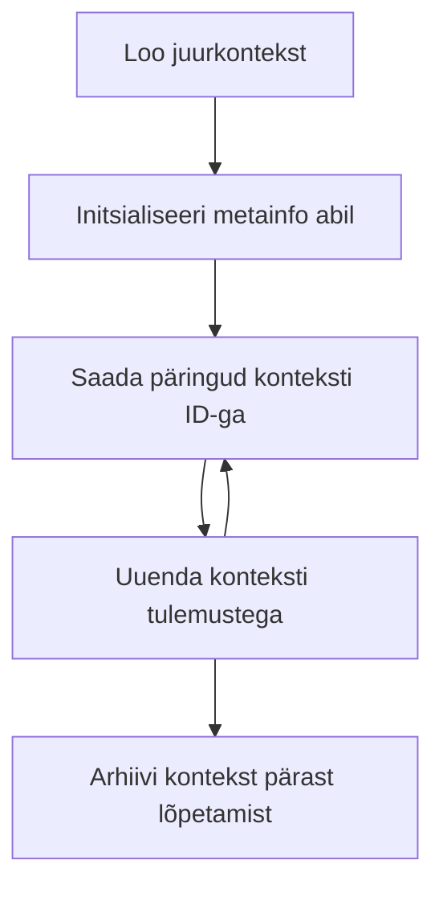

> [VANANENUD: 2026-07-28 VÄLJAANDMINE KANDIDAAT](https://blog.modelcontextprotocol.io/posts/2026-07-28-release-candidate/#roots-sampling-and-logging-are-deprecated)

# MCP juurkontekstid

> **Vananemisavaldus:** `2026-07-28` MCP spetsifikatsiooni väljaandmiskandidaat märgib juured vananenuks tööriista parameetrite, ressurssi URI-de või serveri konfiguratsiooni kasuks. Juured töötavad edasi versioonis `2025-11-25` ja vähemalt aasta järgi pärast ametlikku vananemist, nii et kõik selle õppetunni sisu kehtib endiselt – kuid uute serveri disainide puhul tuleks hinnata asendusmustri kasutamist. Vaata [Mis muutub MCP-s: 2026-07-28 väljaandmiskandidaat](../../01-CoreConcepts/mcp-2026-07-28-release-candidate.md).

Juurkontekstid on Model Context Protocoli põhikontseptsioon, mis pakuvad püsivat kihti vestluse ajaloo ja jagatud oleku säilitamiseks mitme päringu ja seansi vahel.

## Sissejuhatus

Selles õppetükis uurime, kuidas luua, hallata ja kasutada juurkontekste MCP-s.

## Õpieesmärgid

Selle õppetüki lõpuks oskad sa:

- Mõista juurkontekstide eesmärki ja ülesehitust
- Luua ja hallata juurkontekste MCP klienditeekide abil
- Rakendada juurkontekste .NET, Java, JavaScripti ja Python rakendustes
- Kasutada juurkontekste mitme vooru vestlusteks ja oleku haldamiseks
- Rakendada juurkontekstide haldamise parimaid tavasid

## Juurkontekstide mõistmine

Juurkontekstid toimivad konteineritena, mis hoiavad seotud suhtluste ajalugu ja olekut. Need võimaldavad:

- **Vestluse püsimine**: Järjepidevate mitme vooru vestluste säilitamine
- **Mälu haldus**: Teabe salvestamine ja pärimine suhtluste vahel
- **Oleku haldus**: Edusammude jälgimine keerulistes töövoogudes
- **Konteksti jagamine**: Lubades mitmel kliendil pääseda juurde samale vestluse olekule

MCP-s on juurkontekstidel järgmised põhiomadused:

- Igal juurkontekstil on unikaalne identifikaator.
- Neis võib sisalduda vestluse ajalugu, kasutaja eelistusi ja muud metaandmed.
- Neid saab luua, kasutada ja arhiveerida vastavalt vajadusele.
- Nad toetavad peenhäälestatud juurdepääsukontrolli ja õigusi.

## Juurkonteksti elutsükkel



## Töötamine juurkontekstidega

Siin on näide, kuidas luua ja hallata juurkontekste.

### C# rakendus

```csharp
// .NET Example: Root Context Management
using Microsoft.Mcp.Client;
using System;
using System.Threading.Tasks;
using System.Collections.Generic;

public class RootContextExample
{
    private readonly IMcpClient _client;
    private readonly IRootContextManager _contextManager;
    
    public RootContextExample(IMcpClient client, IRootContextManager contextManager)
    {
        _client = client;
        _contextManager = contextManager;
    }
    
    public async Task DemonstrateRootContextAsync()
    {
        // 1. Create a new root context
        var contextResult = await _contextManager.CreateRootContextAsync(new RootContextCreateOptions
        {
            Name = "Customer Support Session",
            Metadata = new Dictionary<string, string>
            {
                ["CustomerName"] = "Acme Corporation",
                ["PriorityLevel"] = "High",
                ["Domain"] = "Cloud Services"
            }
        });
        
        string contextId = contextResult.ContextId;
        Console.WriteLine($"Created root context with ID: {contextId}");
        
        // 2. First interaction using the context
        var response1 = await _client.SendPromptAsync(
            "I'm having issues scaling my web service deployment in the cloud.", 
            new SendPromptOptions { RootContextId = contextId }
        );
        
        Console.WriteLine($"First response: {response1.GeneratedText}");
        
        // Second interaction - the model will have access to the previous conversation
        var response2 = await _client.SendPromptAsync(
            "Yes, we're using containerized deployments with Kubernetes.", 
            new SendPromptOptions { RootContextId = contextId }
        );
        
        Console.WriteLine($"Second response: {response2.GeneratedText}");
        
        // 3. Add metadata to the context based on conversation
        await _contextManager.UpdateContextMetadataAsync(contextId, new Dictionary<string, string>
        {
            ["TechnicalEnvironment"] = "Kubernetes",
            ["IssueType"] = "Scaling"
        });
        
        // 4. Get context information
        var contextInfo = await _contextManager.GetRootContextInfoAsync(contextId);
        
        Console.WriteLine("Context Information:");
        Console.WriteLine($"- Name: {contextInfo.Name}");
        Console.WriteLine($"- Created: {contextInfo.CreatedAt}");
        Console.WriteLine($"- Messages: {contextInfo.MessageCount}");
        
        // 5. When the conversation is complete, archive the context
        await _contextManager.ArchiveRootContextAsync(contextId);
        Console.WriteLine($"Archived context {contextId}");
    }
}
```

Eelnevas koodis me:

1. Loodud juurkonteksti klienditoe sessiooni jaoks.
1. Saadetud mitmeid sõnumeid selles kontekstis, võimaldades mudelil säilitada olekut.
1. Uuendanud konteksti asjakohaste metaandmetega vastavalt vestlusele.
1. Pärinud kontekstitabeli, et mõista vestluse ajalugu.
1. Arhiveerinud konteksti, kui vestlus oli lõpetatud.

## Näide: Juurkonteksti rakendus finantsanalüüsi jaoks

Selles näites loome juurkonteksti finantsanalüüsi sessiooniks, demonstreerides oleku säilitamist mitme suhtluse vältel.

### Java rakendus

```java
// Java näide: juurkonteksti teostus
package com.example.mcp.contexts;

import com.mcp.client.McpClient;
import com.mcp.client.ContextManager;
import com.mcp.models.RootContext;
import com.mcp.models.McpResponse;

import java.util.HashMap;
import java.util.Map;
import java.util.UUID;

public class RootContextsDemo {
    private final McpClient client;
    private final ContextManager contextManager;
    
    public RootContextsDemo(String serverUrl) {
        this.client = new McpClient.Builder()
            .setServerUrl(serverUrl)
            .build();
            
        this.contextManager = new ContextManager(client);
    }
    
    public void demonstrateRootContext() throws Exception {
        // Loo konteksti metaandmed
        Map<String, String> metadata = new HashMap<>();
        metadata.put("projectName", "Financial Analysis");
        metadata.put("userRole", "Financial Analyst");
        metadata.put("dataSource", "Q1 2025 Financial Reports");
        
        // 1. Loo uus juurkontekst
        RootContext context = contextManager.createRootContext("Financial Analysis Session", metadata);
        String contextId = context.getId();
        
        System.out.println("Created context: " + contextId);
        
        // 2. Esimene suhtlus
        McpResponse response1 = client.sendPrompt(
            "Analyze the trends in Q1 financial data for our technology division",
            contextId
        );
        
        System.out.println("First response: " + response1.getGeneratedText());
        
        // 3. Uuenda konteksti olulisest vastusest saadud teabega
        contextManager.addContextMetadata(contextId, 
            Map.of("identifiedTrend", "Increasing cloud infrastructure costs"));
        
        // Teine suhtlus – sama konteksti kasutamine
        McpResponse response2 = client.sendPrompt(
            "What's driving the increase in cloud infrastructure costs?",
            contextId
        );
        
        System.out.println("Second response: " + response2.getGeneratedText());
        
        // 4. Koosta analüüsiseansi kokkuvõte
        McpResponse summaryResponse = client.sendPrompt(
            "Summarize our analysis of the technology division financials in 3-5 key points",
            contextId
        );
        
        // Salvesta kokkuvõte konteksti metaandmetesse
        contextManager.addContextMetadata(contextId, 
            Map.of("analysisSummary", summaryResponse.getGeneratedText()));
            
        // Hangi uuendatud konteksti teave
        RootContext updatedContext = contextManager.getRootContext(contextId);
        
        System.out.println("Context Information:");
        System.out.println("- Created: " + updatedContext.getCreatedAt());
        System.out.println("- Last Updated: " + updatedContext.getLastUpdatedAt());
        System.out.println("- Analysis Summary: " + 
            updatedContext.getMetadata().get("analysisSummary"));
            
        // 5. Arhiveeri kontekst, kui valmis
        contextManager.archiveContext(contextId);
        System.out.println("Context archived");
    }
}
```

Eelnevas koodis me:

1. Loodud juurkonteksti finantsanalüüsi sessiooni jaoks.
2. Saadetud mitmeid sõnumeid selles kontekstis, võimaldades mudelil säilitada olekut.
3. Uuendanud konteksti asjakohaste metaandmetega vastavalt vestlusele.
4. Koostanud sessiooni kokkuvõtte ja salvestanud selle konteksti metaandmetesse.
5. Arhiveerinud konteksti, kui vestlus oli lõpetatud.

## Näide: Juurkonteksti haldus

Juurkontekstide tõhus haldamine on oluline vestluste ajaloo ja oleku säilitamiseks. Allpool on näide, kuidas juurkonteksti haldust rakendada.

### JavaScripti rakendus

```javascript
// JavaScripti näide: MCP juurkontekstide haldamine
const { McpClient, RootContextManager } = require('@mcp/client');

class ContextSession {
  constructor(serverUrl, apiKey = null) {
    // MCP kliendi initsialiseerimine
    this.client = new McpClient({
      serverUrl,
      apiKey
    });
    
    // Konteksti halduri initsialiseerimine
    this.contextManager = new RootContextManager(this.client);
  }
  
  /**
   * Create a new conversation context
   * @param {string} sessionName - Name of the conversation session
   * @param {Object} metadata - Additional metadata for the context
   * @returns {Promise<string>} - Context ID
   */
  async createConversationContext(sessionName, metadata = {}) {
    try {
      const contextResult = await this.contextManager.createRootContext({
        name: sessionName,
        metadata: {
          ...metadata,
          createdAt: new Date().toISOString(),
          status: 'active'
        }
      });
      
      console.log(`Created root context '${sessionName}' with ID: ${contextResult.id}`);
      return contextResult.id;
    } catch (error) {
      console.error('Error creating root context:', error);
      throw error;
    }
  }
  
  /**
   * Send a message in an existing context
   * @param {string} contextId - The root context ID
   * @param {string} message - The user's message
   * @param {Object} options - Additional options
   * @returns {Promise<Object>} - Response data
   */
  async sendMessage(contextId, message, options = {}) {
    try {
      // Saada sõnum määratud konteksti abil
      const response = await this.client.sendPrompt(message, {
        rootContextId: contextId,
        temperature: options.temperature || 0.7,
        allowedTools: options.allowedTools || []
      });
      
      // Valikuliselt salvestada vestlusest olulised teadmised
      if (options.storeInsights) {
        await this.storeConversationInsights(contextId, message, response.generatedText);
      }
      
      return {
        message: response.generatedText,
        toolCalls: response.toolCalls || [],
        contextId
      };
    } catch (error) {
      console.error(`Error sending message in context ${contextId}:`, error);
      throw error;
    }
  }
  
  /**
   * Store important insights from a conversation
   * @param {string} contextId - The root context ID
   * @param {string} userMessage - User's message
   * @param {string} aiResponse - AI's response
   */
  async storeConversationInsights(contextId, userMessage, aiResponse) {
    try {
      // Võimalike teadmiste väljavõtmine (päris rakenduses oleks see keerukam)
      const combinedText = userMessage + "\n" + aiResponse;
      
      // Lihtne heuristika võimalike teadmiste tuvastamiseks
      const insightWords = ["important", "key point", "remember", "significant", "crucial"];
      
      const potentialInsights = combinedText
        .split(".")
        .filter(sentence => 
          insightWords.some(word => sentence.toLowerCase().includes(word))
        )
        .map(sentence => sentence.trim())
        .filter(sentence => sentence.length > 10);
      
      // Salvesta teadmised konteksti metainfosse
      if (potentialInsights.length > 0) {
        const insights = {};
        potentialInsights.forEach((insight, index) => {
          insights[`insight_${Date.now()}_${index}`] = insight;
        });
        
        await this.contextManager.updateContextMetadata(contextId, insights);
        console.log(`Stored ${potentialInsights.length} insights in context ${contextId}`);
      }
    } catch (error) {
      console.warn('Error storing conversation insights:', error);
      // Mittekriitiline viga, seega logi lihtsalt hoiatust
    }
  }
  
  /**
   * Get summary information about a context
   * @param {string} contextId - The root context ID
   * @returns {Promise<Object>} - Context information
   */
  async getContextInfo(contextId) {
    try {
      const contextInfo = await this.contextManager.getContextInfo(contextId);
      
      return {
        id: contextInfo.id,
        name: contextInfo.name,
        created: new Date(contextInfo.createdAt).toLocaleString(),
        lastUpdated: new Date(contextInfo.lastUpdatedAt).toLocaleString(),
        messageCount: contextInfo.messageCount,
        metadata: contextInfo.metadata,
        status: contextInfo.status
      };
    } catch (error) {
      console.error(`Error getting context info for ${contextId}:`, error);
      throw error;
    }
  }
  
  /**
   * Generate a summary of the conversation in a context
   * @param {string} contextId - The root context ID
   * @returns {Promise<string>} - Generated summary
   */
  async generateContextSummary(contextId) {
    try {
      // Palu mudelil genereerida seni toimunud vestluse kokkuvõte
      const response = await this.client.sendPrompt(
        "Please summarize our conversation so far in 3-4 sentences, highlighting the main points discussed.",
        { rootContextId: contextId, temperature: 0.3 }
      );
      
      // Salvesta kokkuvõte konteksti metainfosse
      await this.contextManager.updateContextMetadata(contextId, {
        conversationSummary: response.generatedText,
        summarizedAt: new Date().toISOString()
      });
      
      return response.generatedText;
    } catch (error) {
      console.error(`Error generating context summary for ${contextId}:`, error);
      throw error;
    }
  }
  
  /**
   * Archive a context when it's no longer needed
   * @param {string} contextId - The root context ID
   * @returns {Promise<Object>} - Result of the archive operation
   */
  async archiveContext(contextId) {
    try {
      // Genereeri lõplik kokkuvõte enne arhiveerimist
      const summary = await this.generateContextSummary(contextId);
      
      // Arhiveeri kontekst
      await this.contextManager.archiveContext(contextId);
      
      return {
        status: "archived",
        contextId,
        summary
      };
    } catch (error) {
      console.error(`Error archiving context ${contextId}:`, error);
      throw error;
    }
  }
}

// Näidiskasutus
async function demonstrateContextSession() {
  const session = new ContextSession('https://mcp-server-example.com');
  
  try {
    // 1. Loo uus kontekst tootetoe vestluseks
    const contextId = await session.createConversationContext(
      'Product Support - Database Performance',
      {
        customer: 'Globex Corporation',
        product: 'Enterprise Database',
        severity: 'Medium',
        supportAgent: 'AI Assistant'
      }
    );
    
    // 2. Vestluse esimene sõnum
    const response1 = await session.sendMessage(
      contextId,
      "I'm experiencing slow query performance on our database cluster after the latest update.",
      { storeInsights: true }
    );
    console.log('Response 1:', response1.message);
    
    // Järgnev sõnum samas kontekstis
    const response2 = await session.sendMessage(
      contextId,
      "Yes, we've already checked the indexes and they seem to be properly configured.",
      { storeInsights: true }
    );
    console.log('Response 2:', response2.message);
    
    // 3. Hangi teavet konteksti kohta
    const contextInfo = await session.getContextInfo(contextId);
    console.log('Context Information:', contextInfo);
    
    // 4. Genereeri ja kuva vestluse kokkuvõte
    const summary = await session.generateContextSummary(contextId);
    console.log('Conversation Summary:', summary);
    
    // 5. Arhiveeri kontekst kui töö lõpetatud
    const archiveResult = await session.archiveContext(contextId);
    console.log('Archive Result:', archiveResult);
    
    // 6. Käsitle kõik vead sujuvalt
  } catch (error) {
    console.error('Error in context session demonstration:', error);
  }
}

demonstrateContextSession();
```

Eelnevas koodis me:

1. Loodud juurkonteksti toote toe vestluses funktsiooniga `createConversationContext`. Seekord käsitles kontekst andmebaasi jõudlusprobleeme.

1. Saadetud mitmeid sõnumeid selles kontekstis funktsiooniga `sendMessage`. Saadetavad sõnumid olid seotud aeglase päringu jõudluse ja indeksi konfiguratsiooniga.

1. Uuendanud konteksti asjakohaste metaandmetega vastavalt vestlusele.

1. Koostanud vestluse kokkuvõtte ja salvestanud selle konteksti metaandmetesse funktsiooniga `generateContextSummary`.

1. Arhiveerinud konteksti, kui vestlus oli lõpetatud funktsiooniga `archiveContext`.

1. Käsitlenud tõrkeid sujuvalt stabiilsuse tagamiseks.

## Juurkontekst mitmevoorulise abi jaoks

Selles näites loome juurkonteksti mitme vooru abisessiooniks, demonstreerides oleku säilitamist mitme suhtluse vältel.

### Pythoni rakendus

```python
# Pythoni näide: juurkontekst mitme vooru abistamiseks
import asyncio
from datetime import datetime
from mcp_client import McpClient, RootContextManager

class AssistantSession:
    def __init__(self, server_url, api_key=None):
        self.client = McpClient(server_url=server_url, api_key=api_key)
        self.context_manager = RootContextManager(self.client)
    
    async def create_session(self, name, user_info=None):
        """Create a new root context for an assistant session"""
        metadata = {
            "session_type": "assistant",
            "created_at": datetime.now().isoformat(),
        }
        
        # Lisa kasutaja info, kui see on olemas
        if user_info:
            metadata.update({f"user_{k}": v for k, v in user_info.items()})
            
        # Loo juurkontekst
        context = await self.context_manager.create_root_context(name, metadata)
        return context.id
    
    async def send_message(self, context_id, message, tools=None):
        """Send a message within a root context"""
        # Loo valikud koos kontekti ID-ga
        options = {
            "root_context_id": context_id
        }
        
        # Lisa tööriistad, kui need on määratud
        if tools:
            options["allowed_tools"] = tools
        
        # Saada prompt konteksi sees
        response = await self.client.send_prompt(message, options)
        
        # Uuenda konteksti metaandmeid vestluse edenemisega
        await self.context_manager.update_context_metadata(
            context_id,
            {
                f"message_{datetime.now().timestamp()}": message[:50] + "...",
                "last_interaction": datetime.now().isoformat()
            }
        )
        
        return response
    
    async def get_conversation_history(self, context_id):
        """Retrieve conversation history from a context"""
        context_info = await self.context_manager.get_context_info(context_id)
        messages = await self.client.get_context_messages(context_id)
        
        return {
            "context_info": context_info,
            "messages": messages
        }
    
    async def end_session(self, context_id):
        """End an assistant session by archiving the context"""
        # Tekita esmalt kokkuvõtte prompt
        summary_response = await self.client.send_prompt(
            "Please summarize our conversation and any key points or decisions made.",
            {"root_context_id": context_id}
        )
        
        # Salvesta kokkuvõte metaandmetesse
        await self.context_manager.update_context_metadata(
            context_id,
            {
                "summary": summary_response.generated_text,
                "ended_at": datetime.now().isoformat(),
                "status": "completed"
            }
        )
        
        # Arhiveeri kontekst
        await self.context_manager.archive_context(context_id)
        
        return {
            "status": "completed",
            "summary": summary_response.generated_text
        }

# Näite kasutamine
async def demo_assistant_session():
    assistant = AssistantSession("https://mcp-server-example.com")
    
    # 1. Loo seanss
    context_id = await assistant.create_session(
        "Technical Support Session",
        {"name": "Alex", "technical_level": "advanced", "product": "Cloud Services"}
    )
    print(f"Created session with context ID: {context_id}")
    
    # 2. Esimene suhtlus
    response1 = await assistant.send_message(
        context_id, 
        "I'm having trouble with the auto-scaling feature in your cloud platform.",
        ["documentation_search", "diagnostic_tool"]
    )
    print(f"Response 1: {response1.generated_text}")
    
    # Teine suhtlus samas kontekstis
    response2 = await assistant.send_message(
        context_id,
        "Yes, I've already checked the configuration settings you mentioned, but it's still not working."
    )
    print(f"Response 2: {response2.generated_text}")
    
    # 3. Võta ajalugu
    history = await assistant.get_conversation_history(context_id)
    print(f"Session has {len(history['messages'])} messages")
    
    # 4. Lõpeta seanss
    end_result = await assistant.end_session(context_id)
    print(f"Session ended with summary: {end_result['summary']}")

if __name__ == "__main__":
    asyncio.run(demo_assistant_session())
```

Eelnevas koodis me:

1. Loodud juurkonteksti tehnilise toe sessiooni jaoks funktsiooniga `create_session`. Kontekst hõlmab kasutajateavet nagu nimi ja tehniline tase.

1. Saadetud mitmeid sõnumeid selles kontekstis funktsiooniga `send_message`. Saadetavad sõnumid olid seotud auto-skaalumise funktsiooniga seotud probleemidega.

1. Pärinud vestluse ajaloo funktsiooniga `get_conversation_history`, mis annab konteksti info ja sõnumid.

1. Lõpetanud sessiooni, arhiveerides konteksti ja koostades kokkuvõtte funktsiooniga `end_session`. Kokkuvõte hõlmab vestluse põhipunkte.

## Juurkonteksti parimad tavad

Siin on mõned parimad tavad juurkontekstide tõhusaks haldamiseks:

- **Loo fookustatud kontekstid:** Loo erinevate vestluse eesmärkide või valdkondade jaoks eraldi juurkontekstid, et säilitada selgust.

- **Sea aegumispoliitikad:** Rakenda poliitikaid vanade kontekstide arhiveerimiseks või kustutamiseks, et hallata salvestust ja järgida andmete säilitamise nõudeid.

- **Salvesta olulised metaandmed:** Kasuta konteksti metaandmeid, et säilitada vestluse kohta olulist teavet, mis võib hiljem kasuks tulla.

- **Kasuta konteksti ID-sid järjekindlalt:** Kui kontekst on loodud, kasuta selle ID-d järjekindlalt kõigi seotud päringute puhul, et säilitada järjepidevus.

- **Koosta kokkuvõtteid:** Kui kontekst muutub suureks, kaalu kokkuvõtete koostamist, et tabada olulisi andmeid ja hallata konteksti suurust.

- **Rakenda juurdepääsukontrolli:** Mitme kasutajaga süsteemide puhul rakenda korralikku juurdepääsukontrolli, et tagada vestluse kontekstide privaatsus ja turvalisus.

- **Käsitle konteksti piiranguid:** Ole teadlik konteksti suuruse piirangutest ja rakenda strateegiaid väga pikkade vestluste käsitlemiseks.

- **Arhiveeri pärast lõpetamist:** Arhiveeri kontekstid, kui vestlused on lõpetatud, et vabastada ressursse ja säilitada vestluse ajalugu.

## Mis järgmiseks

- [5.5 Marsruutimine](../mcp-routing/README.md)

---

<!-- CO-OP TRANSLATOR DISCLAIMER START -->
**Lahtiütlus**:
See dokument on tõlgitud kasutades AI tõlketeenust [Co-op Translator](https://github.com/Azure/co-op-translator). Kuigi me püüdleme täpsuse poole, palun pange tähele, et automatiseeritud tõlgetes võib esineda vigu või ebatäpsusi. Originaaldokument selle emakeeles tuleks pidada autoriteetseks allikaks. Olulise teabe puhul soovitatakse kasutada professionaalset inimtõlget. Me ei vastuta selle tõlkega seotud eksimustest või valesti mõistmistest.
<!-- CO-OP TRANSLATOR DISCLAIMER END -->