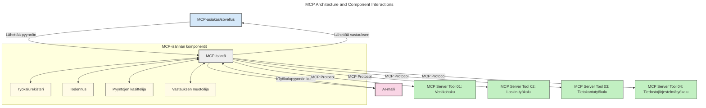
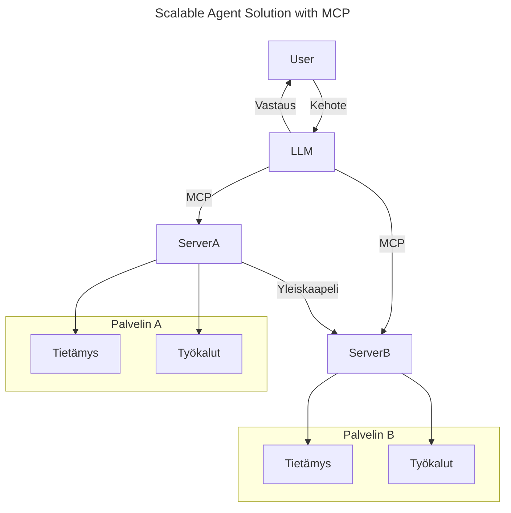
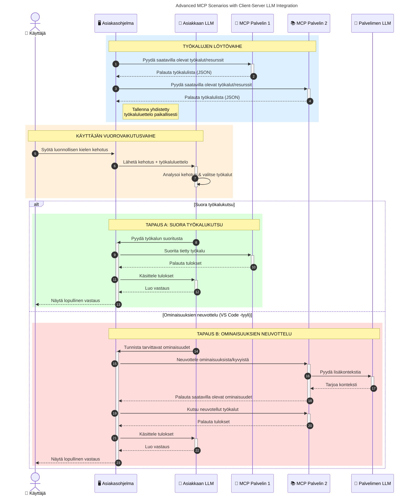

# Johdanto Model Context Protocoliin (MCP): Miksi se on tärkeää skaalautuville tekoälysovelluksille

_(Klikkaa yllä olevaa kuvaa katsellaksesi tämän oppitunnin videon)_

Generatiiviset tekoälysovellukset ovat suuri edistysaskel, koska ne usein antavat käyttäjän olla vuorovaikutuksessa sovelluksen kanssa luonnollisen kielen kehotteiden avulla. Kuitenkin, kun sovelluksiin investoidaan enemmän aikaa ja resursseja, haluat varmistaa, että voit helposti integroida toiminnallisuuksia ja resursseja siten, että sovellusta on helppo laajentaa, että sovelluksesi pystyy käyttämään useampaa mallia samanaikaisesti ja hallitsemaan erilaisten mallien erityispiirteitä. Lyhyesti sanottuna, generatiivisten tekoälysovellusten rakentaminen on aluksi helppoa, mutta kun ne kasvavat ja monimutkaistuvat, sinun täytyy alkaa määritellä arkkitehtuuria ja todennäköisesti luottaa standardiin varmistaaksesi, että sovelluksesi rakennetaan johdonmukaisesti. Tässä MCP astuu kuvaan järjestämään asioita ja tarjoamaan standardin.

---

## **🔍 Mikä on Model Context Protocol (MCP)?**

**Model Context Protocol (MCP)** on **avoin, standardoitu rajapinta**, joka mahdollistaa suurten kielimallien (LLM) saumattoman vuorovaikutuksen ulkoisten työkalujen, sovellusliittymien ja tietolähteiden kanssa. Se tarjoaa yhdenmukaisen arkkitehtuurin tekoälymallien toiminnallisuuden parantamiseksi heidän koulutusaineistonsa ulkopuolella, mahdollistaen älykkäämpiä, skaalautuvia ja reagoivampia tekoälyjärjestelmiä.

---

## **🎯 Miksi tekoälyn standardointi on tärkeää**

Kun generatiiviset tekoälysovellukset muuttuvat monimutkaisemmiksi, on olennaista omaksua standardeja, jotka varmistavat **skaalautuvuuden, laajennettavuuden, ylläpidettävyyden** ja **toimittajalukituksen välttämisen**. MCP vastaa näihin tarpeisiin:

- Yhdistelemällä mallien ja työkalujen integraatiot
- Vähentämällä hauraita, kertaluonteisia räätälöityjä ratkaisuja
- Mahdollistamalla useiden eri toimittajien mallien yhteiselon yhdessä ekosysteemissä

**Huom:** Vaikka MCP esittää itsensä avoimena standardina, ei ole suunnitelmia standardoida MCP:tä olemassa olevien standardointielinten kuten IEEE, IETF, W3C, ISO tai muiden vastaavien kautta.

---

## **📚 Oppimistavoitteet**

Tämän artikkelin lopuksi osaat:

- Määritellä **Model Context Protocolin (MCP)** ja sen käyttötapaukset
- Ymmärtää, miten MCP standardisoi mallin ja työkalun välisen viestinnän
- Tunnistaa MCP-arkkitehtuurin keskeiset osat
- Tutkia MCP:n käytännön sovelluksia yritys- ja kehitysympäristöissä

---

## **💡 Miksi Model Context Protocol (MCP) on pelin muuttaja**

### **🔗 MCP ratkaisee tekoälyn vuorovaikutuksen pirstaloitumisen**

Ennen MCP:tä mallien ja työkalujen yhdistäminen vaati:

- Räätälöityä koodia kutakin työkalu-malliparia varten
- Ei-standardisoituja sovellusliittymiä jokaiselle toimittajalle
- Usein katkoksia päivitysten vuoksi
- Huonoa skaalautuvuutta työkalujen määrän kasvaessa

### **✅ MCP-standardoinnin hyödyt**

| **Hyöty**                | **Kuvaus**                                                                    |
|--------------------------|-------------------------------------------------------------------------------|
| Yhteensopivuus            | LLM:t toimivat saumattomasti työkalujen kanssa eri toimittajilta              |
| Yhdenmukaisuus            | Yhtenäinen käyttäytyminen alustoilla ja työkaluissa                           |
| Uudelleenkäytettävyys     | Kerran rakennetut työkalut voidaan käyttää projekteissa ja järjestelmissä      |
| Nopeutettu kehitys        | Kehitysaikaa vähennetään käyttämällä standardoituja, "plug-and-play" -rajapintoja |

---

## **🧱 Yleiskuva MCP:n arkkitehtuurista**

MCP noudattaa **asiakas-palvelin-mallia**, jossa:

- **MCP-hostit** ajavat tekoälymalleja
- **MCP-asiakkaat** aloittavat pyynnöt
- **MCP-palvelimet** tarjoavat kontekstin, työkalut ja kyvykkyydet

### **Keskeiset komponentit:**

- **Resurssit** – Staattista tai dynaamista tietoa malleille  
- **Kehotteet** – Ennalta määriteltyjä työnkulkuja ohjattuun generointiin  
- **Työkalut** – Suoritettavat funktiot, kuten haku, laskelmat  
- **Näytteenotto** – Agenttikäyttäytymistä rekursiivisten vuorovaikutusten kautta (poistettu käytöstä `2026-07-28` julkaisuehdokkaassa)  
- **Elicitaatio** – Palvelimen aloittamia pyyntöjä käyttäjän panokselle  
- **Roots** – Tiedostojärjestelmän rajat palvelimen käyttöoikeuksien hallinnassa (poistettu käytöstä `2026-07-28` julkaisuehdokkaassa)  

### **Protokollan arkkitehtuuri:**

MCP käyttää kaksikerroksista arkkitehtuuria:
- **Datalayer**: JSON-RPC 2.0:aan perustuva viestintä elinkaaren hallinnalla ja perustoiminnoilla
- **Kuljetuskerros**: Paikallinen STDIO ja Streamable HTTP SSE:n (Server-Sent Events) kanssa etäyhteyteen

---

## Kuinka MCP-palvelimet toimivat

MCP-palvelimet toimivat seuraavasti:

- **Pyyntövirta**:
    1. Pyyntö käynnistyy loppukäyttäjän tai tämän puolesta toimivan ohjelmiston toimesta.
    2. **MCP-asiakas** lähettää pyynnön **MCP-hostille**, joka hallinnoi tekoälymallin suoritusta.
    3. **Tekoälymalli** vastaanottaa käyttäjän kehotteen ja voi pyytää pääsyä ulkoisiin työkaluihin tai datoihin yhden tai useamman työkalukutsun kautta.
    4. **MCP-host** ei kommunikaatiota mallin kautta suoraan, vaan käyttää standardoitua protokollaa asianmukaisten **MCP-palvelimien** kanssa.
- **MCP-hostin toiminnot**:
    - **Työkaluluettelo**: Pitää kirjaa käytettävissä olevista työkaluista ja niiden kyvyistä.
    - **Autentikointi**: Tarkistaa käyttöoikeudet työkalujen käyttöön.
    - **Pyyntöjen käsittelijä**: Käsittelee mallilta tulevat työkalupyynnöt.
    - **Vastausten muotoilija**: Rakentaa työkalutuotokset mallin ymmärtämään muotoon.
- **MCP-palvelimen suoritus**:
    - **MCP-host** ohjaa työkalukutsut yhdelle tai useammalle **MCP-palvelimelle**, jotka tarjoavat erikoistuneita toimintoja (esim. haku, laskelmat, tietokantakyselyt).
    - **MCP-palvelimet** suorittavat omat toimenpiteensä ja palauttavat tulokset **MCP-hostille** yhdenmukaisessa muodossa.
    - **MCP-host** muotoilee ja välittää tulokset tekoälymallille.
- **Vastauksen valmistuminen**:
    - **Tekoälymalli** liittää työkalutuotokset lopulliseen vastaukseen.
    - **MCP-host** lähettää tämän vastauksen takaisin **MCP-asiakkaalle**, joka toimittaa sen loppukäyttäjälle tai kutsuvalle ohjelmistolle.
    

## 👨‍💻 Kuinka rakentaa MCP-palvelin (esimerkkien kera)

MCP-palvelimet antavat sinun laajentaa LLM-mallien kyvykkyyksiä tarjoamalla dataa ja toiminnallisuutta. 

Valmiina kokeilemaan? Tässä on kieli- ja/tai teknologiapinoon perustuvia SDK:ita esimerkeillä yksinkertaisten MCP-palvelimien luomisesta eri kielillä/tekniikoilla:

- **Python SDK**: https://github.com/modelcontextprotocol/python-sdk

- **TypeScript SDK**: https://github.com/modelcontextprotocol/typescript-sdk

- **Java SDK**: https://github.com/modelcontextprotocol/java-sdk

- **C#/.NET SDK**: https://github.com/modelcontextprotocol/csharp-sdk

## 🌍 MCP:n käytännön käyttötapaukset

MCP mahdollistaa monenlaiset sovellukset laajentamalla tekoälyn kyvykkyyksiä:

| **Sovellus**                | **Kuvaus**                                                                    |
|----------------------------|-------------------------------------------------------------------------------|
| Yritystiedon integrointi   | Yhdistää LLM:t tietokantoihin, CRM-järjestelmiin tai sisäisiin työkaluihin    |
| Agenttipohjaiset tekoälyjärjestelmät | Mahdollistaa autonomiset agentit työkalujen käytöllä ja päätöksentekoprosesseilla |
| Monimodaaliset sovellukset | Yhdistää teksti-, kuva- ja äänityökalut yhteen yhtenäiseen tekoälysovellukseen |
| Reaaliaikainen dataintegraatio | Tuo live-dataa tekoälyn vuorovaikutuksiin tarkempien ja ajankohtaisempien tulosten saamiseksi |

### 🧠 MCP = Universaali standardi tekoälyn vuorovaikutukseen

Model Context Protocol (MCP) toimii universaalina standardina tekoälyn vuorovaikutuksessa, aivan kuten USB-C standardisoi fyysiset liitännät laitteille. Tekoälyn maailmassa MCP tarjoaa yhdenmukaisen rajapinnan, jonka avulla mallit (asiakkaat) voivat integroitua saumattomasti ulkoisiin työkaluihin ja tietolähteisiin (palvelimet). Tämä poistaa tarpeen käyttää erilaisia, räätälöityjä protokollia jokaiselle API:lle tai tietolähteelle.

MCP:n puitteissa MCP-yhteensopiva työkalu (jota kutsutaan MCP-palvelimeksi) noudattaa yhtenäistä standardia. Nämä palvelimet voivat listata tarjoamansa työkalut tai toiminnot ja suorittaa ne pyyntöjen mukaan tekoälyagentilta. MCP-yhteensopivat tekoälyagenttialustat voivat löytää palvelimien tarjoamat työkalut ja kutsua niitä tämän standardoidun protokollan kautta.

### 💡 Helpottaa tiedon saatavuutta

MCP ei tarjoa vain työkaluja, vaan helpottaa myös tiedon saatavuutta. Se mahdollistaa sovellusten tarjoavan kontekstia suurille kielimalleille (LLM) yhdistämällä ne eri tietolähteisiin. Esimerkiksi MCP-palvelin voi edustaa yrityksen asiakirjavarastoa, jolloin agentit voivat tarvittaessa hakea sieltä asiaankuuluvaa tietoa. Toinen palvelin voi hoitaa tiettyjä toimintoja, kuten sähköpostien lähettämistä tai tietueiden päivittämistä. Agentin näkökulmasta nämä ovat vain työkaluja—joidenkin työkalujen avulla haetaan tietoa (tietokontextia), kun toiset suorittavat toimintoja. MCP hallinnoi molempia tehokkaasti.

Agentti, joka yhdistää MCP-palvelimeen, oppii automaattisesti palvelimen saatavilla olevat kyvykkyydet ja käytettävissä olevan datan standardimuodon kautta. Tämä standardisointi mahdollistaa työkalujen dynaamisen saatavuuden. Esimerkiksi uuden MCP-palvelimen lisääminen agentin järjestelmään tekee sen toiminnot välittömästi käyttökelpoisiksi ilman lisämuokkauksia agentin ohjeistukseen.

Tämä virtaviivainen integrointi noudattaa alla olevaa kuvaa, jossa palvelimet tarjoavat sekä työkalut että tiedon, varmistaen saumattoman yhteistyön järjestelmien välillä. 

### 👉 Esimerkki: Skaalautuva agenttiratkaisu

Universal Connector mahdollistaa MCP-palvelinten välisen kommunikaation ja kyvykkyyksien jakamisen, jolloin ServerA voi delegoida tehtäviä ServerB:lle tai käyttää tämän työkaluja ja tietoja. Tämä yhdistää työkalut ja tiedot palvelimien kesken tukien skaalautuvia ja modulaarisia agenttiarkkitehtuureja. Koska MCP standardisoi työkalujen esittämisen, agentit voivat löytää ja ohjata pyyntöjä palvelinten välillä dynaamisesti ilman kovakoodattuja integraatioita.

Työkalujen ja tiedon yhdistäminen: Työkalut ja tiedot ovat käytettävissä palvelinten välillä mahdollistaen skaalautuvammat ja modulaarisemmat agenttijärjestelmät.

### 🔄 Edistyneet MCP-skenaariot asiakaspuolen LLM-integraatiolla

Perusarkkitehtuurin lisäksi on olemassa edistyneempiä skenaarioita, joissa sekä asiakas että palvelin sisältävät LLM-malleja, mahdollistaen monimutkaisempia vuorovaikutuksia. Alla olevassa kaaviossa **Asiakassovellus** voisi olla IDE, jossa on useita MCP-työkaluja käyttäjän LLM:n hyödynnettävänä:

## 🔐 MCP:n käytännön hyödyt

Tässä MCP:n käytännön hyödyt:

- **Ajantasaisuus**: Mallit pääsevät käsiksi viimeisimpiin tietoihin koulutusdatan lisäksi
- **Kyvykkyyksien laajennus**: Mallit voivat hyödyntää erikoistuneita työkaluja tehtäviin, joihin niitä ei ole koulutettu
- **Harhojen vähentäminen**: Ulkoiset tietolähteet tuovat faktapohjaa
- **Tietosuoja**: Arkaluonteiset tiedot voivat jäädä turvallisiin ympäristöihin eikä niitä tarvitse upottaa kehotteisiin

## 📌 Keskeiset opit

Tässä keskeisiä oppeja MCP:n käytöstä:

- **MCP** standardisoi, miten tekoälymallit ovat vuorovaikutuksessa työkalujen ja datan kanssa
- Edistää **laajennettavuutta, yhdenmukaisuutta ja yhteentoimivuutta**
- MCP auttaa **vähentämään kehitysaikaa, parantamaan luotettavuutta ja laajentamaan mallin kyvykkyyksiä**
- Asiakas-palvelin-arkkitehtuuri **mahdollistaa joustavat, laajennettavat tekoälysovellukset**

## 🧠 Harjoitus

Mieti tekoälysovellusta, jonka rakentamisesta olet kiinnostunut.

- Mitkä **ulkoiset työkalut tai data** voisivat parantaa sen kyvykkyyksiä?
- Miten MCP voisi tehdä integraatiosta **yksinkertaisempaa ja luotettavampaa?**

## Lisäresurssit

- [MCP GitHub Repository](https://github.com/modelcontextprotocol)

## Mitä seuraavaksi

Seuraavaksi: [Luku 1: Keskeiset käsitteet](../01-CoreConcepts/README.md)

---

<!-- CO-OP TRANSLATOR DISCLAIMER START -->
**Vastuuvapauslauseke**:
Tämä asiakirja on käännetty käyttämällä tekoälypohjaista käännöspalvelua [Co-op Translator](https://github.com/Azure/co-op-translator). Vaikka pyrimme tarkkuuteen, otathan huomioon, että automaattiset käännökset saattavat sisältää virheitä tai epätarkkuuksia. Alkuperäinen asiakirja sen alkuperäiskielellä on virallinen lähde. Tärkeissä asioissa suositellaan ammattimaista ihmiskäännöstä. Emme ole vastuussa tämän käännöksen käytöstä aiheutuvista väärinymmärryksistä tai tulkinnoista.
<!-- CO-OP TRANSLATOR DISCLAIMER END -->