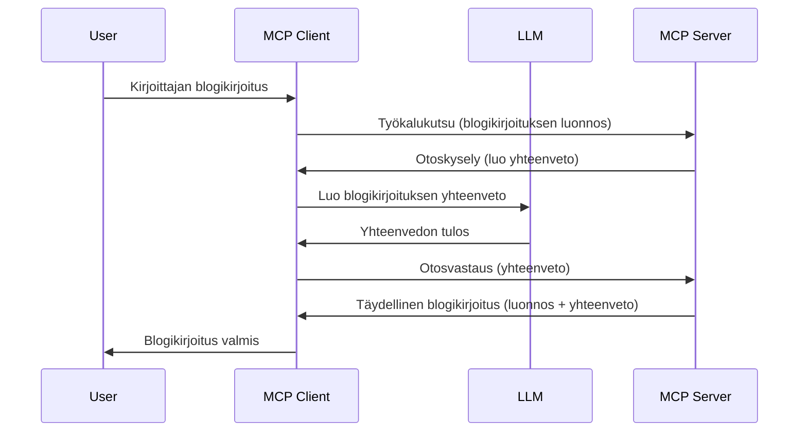

> [VANHENTUNUT: 2026-07-28 JULKAISUEHDOKAS](https://blog.modelcontextprotocol.io/posts/2026-07-28-release-candidate/)

# Näytteistys - delegoi ominaisuudet Clientille

> **Vanhentumisilmoitus:** `2026-07-28` MCP-spesifikaation julkaisuehdokas merkitsee Näytteistyksen vanhentuneeksi LLM-tarjoajien API:iden suoralle integraatiolle. Näytteistys toimii edelleen versiossa `2025-11-25` ja vähintään vuoden virallisen vanhentamisen jälkeen, joten kaiken tämän oppitunnin sisältö on edelleen pätevää — mutta uudet palvelinsuunnittelut tulisi arvioida korvaavaa mallia. Katso [Mitä MCP:ssä muuttuu: Vuoden 2026-07-28 julkaisuehdokas](../../01-CoreConcepts/mcp-2026-07-28-release-candidate.md).

Joskus MCP Clientin ja MCP Serverin täytyy tehdä yhteistyötä yhteisen tavoitteen saavuttamiseksi. Sinulla voi olla tilanne, jossa Serveri tarvitsee apua asiakkaalla sijaitsevalta LLM:ltä. Tähän tilanteeseen sinun tulisi käyttää näytteistystä.

Tutkitaanpa joitakin käyttötapauksia ja miten rakentaa ratkaisua, joka sisältää näytteistyksen.

## Yleiskatsaus

Tässä oppitunnissa keskitymme selittämään, milloin ja missä Näytteistystä kannattaa käyttää ja miten se konfiguroidaan.

## Oppimistavoitteet

Tässä luvussa me:

- Selitämme mitä Näytteistys on ja milloin sitä käyttää.
- Näytämme miten Näytteistys konfiguroidaan MCP:ssä.
- Tarjoamme esimerkkejä Näytteistyksestä käytännössä.

## Mitä on Näytteistys ja miksi sitä käyttää?

Näytteistys on edistynyt ominaisuus, joka toimii seuraavasti:



### Näytteistyspyyntö

Ok, nyt kun meillä on kokonaiskuva uskottavasta tilanteesta, puhutaan palvelimen asiakkaalle lähettämästä näytteistyspyynnöstä. Tässä on miltä tällainen pyyntö voi näyttää JSON-RPC-muodossa:

```json
{
  "jsonrpc": "2.0",
  "id": 1,
  "method": "sampling/createMessage",
  "params": {
    "messages": [
      {
        "role": "user",
        "content": {
          "type": "text",
          "text": "Create a blog post summary of the following blog post: <BLOG POST>"
        }
      }
    ],
    "modelPreferences": {
      "hints": [
        {
          "name": "claude-3-sonnet"
        }
      ],
      "intelligencePriority": 0.8,
      "speedPriority": 0.5
    },
    "systemPrompt": "You are a helpful assistant.",
    "maxTokens": 100
  }
}
```

Tässä on muutama seikka mainitsemisen arvoinen:

- Kehote, sisällössä -> teksti, on kehotteemme, joka on ohje LLM:lle tiivistää blogikirjoituksen sisältö.

- **modelPreferences**. Tämä osio on juuri sellainen — suositus siitä, mitä asetuksia LLM:n kanssa kannattaa käyttää. Käyttäjä voi päättää, noudattaako näitä suosituksia vai muuttaako niitä. Tässä tapauksessa suosituksissa on mallin valinta sekä nopeuden ja älykkyyden priorisointi.
- **systemPrompt**, tämä on normaali järjestelmäkehote, joka antaa LLM:lle persoonallisuuden ja sisältää ohjeistuksia.
- **maxTokens**, tämä on toinen ominaisuus, jolla kerrotaan, kuinka monta tokenia tälle tehtävälle suositellaan käytettäväksi.

### Näytteistysvastaus

Tämä vastaus on mitä MCP Client lopulta lähettää takaisin MCP Serverille ja se on asiakkaan kutsuman LLM:n tulos, odotussanan vastauksen valmistumisesta ja sitten tämän viestin rakentamisesta. Tässä esimerkki JSON-RPC-muodossa:

```json
{
  "jsonrpc": "2.0",
  "id": 1,
  "result": {
    "role": "assistant",
    "content": {
      "type": "text",
      "text": "Here's your abstract <ABSTRACT>"
    },
    "model": "gpt-5",
    "stopReason": "endTurn"
  }
}
```

Huomaa, että vastaus on blogikirjoituksen tiivistelmä kuten pyysimme. Huomaa myös, että käytetty `model` ei ole se, mitä pyysimme vaan "gpt-5" "claude-3-sonnetin" sijaan. Tämä havainnollistaa, että käyttäjä voi muuttaa mielensä käytettävästä mallista ja että näytteistyspyyntö on suositus.

Ok, nyt kun ymmärrämme päävirran, ja hyödyllisen tehtävän sitä varten "blogikirjoituksen luominen + tiivistelmä", katsotaan mitä meidän täytyy tehdä sen toimimiseksi.

### Viestityypit

Näytteistysviestit eivät rajoitu pelkkään tekstiin, vaan voit lähettää myös kuvia ja ääntä. Tässä, miten JSON-RPC eroaa:

**Teksti**

```json
{
  "type": "text",
  "text": "The message content"
}
```

**Kuvasisältö**

```json
{
  "type": "image",
  "data": "base64-encoded-image-data",
  "mimeType": "image/jpeg"
}
```

**Äänisisältö**

```json
{
  "type": "audio",
  "data": "base64-encoded-audio-data",
  "mimeType": "audio/wav"
}
```

> HUOM: lisätietoja Näytteistyksestä löydät [virallisista ohjeista](https://modelcontextprotocol.io/specification/2025-11-25/client/sampling)

## Kuinka konfiguroida Näytteistys Clientillä

> Huomautus: jos rakennat pelkästään palvelinta, sinun ei tarvitse tehdä paljon tässä.

Clientillä sinun tulee määritellä seuraava ominaisuus tällaisella tavalla:

```json
{
  "capabilities": {
    "sampling": {}
  }
}
```

Tämä otetaan käyttöön, kun valitsemasi client alustaa yhteyden palvelimeen.

## Esimerkki Näytteistyksestä - Luo blogikirjoitus

Koodataan yhdessä näytteistys-palvelin; meidän pitää tehdä seuraavat:

1. Luo työkalu Serverille.
1. Työkalun pitää luoda näytteistyspyyntö.
1. Työkalun pitää odottaa asiakkaan vastauksena tulevaa näytteistyspyyntöä.
1. Sitten työkalun tulos pitää tuottaa.

Käydään koodi vaihe vaiheelta:

### -1- Luo työkalu

**python**

```python
@mcp.tool()
async def create_blog(title: str, content: str, ctx: Context[ServerSession, None]) -> str:
    """Create a blog post and generate a summary"""

```

### -2- Luo näytteistyspyyntö

Laajenna työkalua seuraavalla koodilla:

**python**

```python
post = BlogPost(
        id=len(posts) + 1,
        title=title,
        content=content,
        abstract=""
    )

prompt = f"Create an abstract of the following blog post: title: {title} and draft: {content} "

result = await ctx.session.create_message(
        messages=[
            SamplingMessage(
                role="user",
                content=TextContent(type="text", text=prompt),
            )
        ],
        max_tokens=100,
)

```

### -3- Odota vastausta ja palauta vastaus

**python**

```python
post.abstract = result.content.text

posts.append(post)

# palauta täydellinen tuote
return json.dumps({
    "id": post.title,
    "abstract": post.abstract
})
```

### -4- Koko koodi

**python**

```python
from starlette.applications import Starlette
from starlette.routing import Mount, Host

from mcp.server.fastmcp import Context, FastMCP

from mcp.server.session import ServerSession
from mcp.types import SamplingMessage, TextContent

import json


from uuid import uuid4
from typing import List
from pydantic import BaseModel


mcp = FastMCP("Blog post generator")

# app = FastAPI()

posts = []

class BlogPost(BaseModel):
    id: int
    title: str
    content: str
    abstract: str

posts: List[BlogPost] = []

@mcp.tool()
async def create_blog(title: str, content: str, ctx: Context[ServerSession, None]) -> str:
    """Create a blog post and generate a summary"""

    post = BlogPost(
        id=len(posts) + 1,
        title=title,
        content=content,
        abstract=""
    )

    prompt = f"Create an abstract of the following blog post: title: {title} and draft: {content} "

    result = await ctx.session.create_message(
        messages=[
            SamplingMessage(
                role="user",
                content=TextContent(type="text", text=prompt),
            )
        ],
        max_tokens=100,
    )

    post.abstract = result.content.text

    posts.append(post)

    # palauta koko blogikirjoitus
    return json.dumps({
        "id": post.title,
        "abstract": post.abstract
    })

if __name__ == "__main__":
    print("Starting server...")
    # mcp.run()
    mcp.run(transport="streamable-http")

# käynnistä sovellus komennolla: python server.py
```

### -5- Testaa se Visual Studio Codessa

Testataksesi tätä Visual Studio Codessa, tee seuraavasti:

1. Käynnistä palvelin terminaalissa
1. Lisää se *mcp.json*-tiedostoon (ja varmista, että se on käynnissä), esimerkiksi näin:

   ```json
   "servers": {
      "blog-server": {
        "type": "http",
        "url": "http://localhost:8000/mcp"
      }
   }
   ```

1. Kirjoita kehotus:

   ```text
   create a blog post named "Where Python comes from", the content is "Python is actually named after Monty Python Flying Circus"
   ```

1. Salli näytteistyksen tapahtua. Ensimmäisellä testauskerralla sinulle esitetään ylimääräinen dialogi, jonka hyväksyt, sitten näet normaalin työkalun käynnistysdialogin.

1. Tarkastele tuloksia. Näet tulokset siististi renderöitynä GitHub Copilot Chatissa, mutta voit myös tarkastella raakaa JSON-vastausta.

**Bonus**. Visual Studio Coden työkalut tukevat hyvin näytteistystä. Voit konfiguroida Näytteistys-liittymän asennetulla palvelimellasi seuraavasti:

1. Mene laajennososioon.
1. Valitse ratassarake asennetun palvelimesi kohdalta "MCP SERVERS - INSTALLED" osiossa.
1 Valitse "Configure Model Access", täältä voit valita, mitä malleja GitHub Copilot saa käyttää näytteistyksessä. Voit myös nähdä kaikki viimeaikaiset näytteistyspyynnöt valitsemalla "Show Sampling requests".

## Tehtävä

Tässä tehtävässä rakennat hieman erilaista Näytteistystä, nimittäin näytteistysintegraation, joka tukee tuotteen kuvauksen generointia. Tässä skenaario:

**Skenaario**: Verkkokaupan back office -työntekijä tarvitsee apua, koska tuotetekstien kirjoittaminen vie liikaa aikaa. Rakennat siksi ratkaisun, jossa voit kutsua työkalua "create_product" argumenteilla "title" ja "keywords", ja sen tulisi tuottaa valmis tuote, jossa on "description"-kenttä, jonka täyttää asiakkaan LLM.

VINKKI: käytä aiemmin oppimaasi rakentaaksesi tämä palvelin ja sen työkalu käyttämällä näytteistyspyyntöä.

## Ratkaisu

[Ratkaisu](./solution/README.md)

## Keskeiset opit

Näytteistys on tehokas ominaisuus, joka antaa palvelimen delegoida tehtäviä asiakkaalle silloin, kun se tarvitsee apua LLM:ltä.

## Mitä seuraavaksi

- [Luku 4 - Käytännön toteutus](../../04-PracticalImplementation/README.md)

---

<!-- CO-OP TRANSLATOR DISCLAIMER START -->
**Vastuuvapauslauseke**:
Tämä asiakirja on käännetty käyttämällä tekoälypohjaista käännöspalvelua [Co-op Translator](https://github.com/Azure/co-op-translator). Vaikka pyrimme tarkkuuteen, otathan huomioon, että automaattiset käännökset saattavat sisältää virheitä tai epätarkkuuksia. Alkuperäinen asiakirja sen alkuperäiskielellä on virallinen lähde. Tärkeissä asioissa suositellaan ammattimaista ihmiskäännöstä. Emme ole vastuussa tämän käännöksen käytöstä aiheutuvista väärinymmärryksistä tai tulkinnoista.
<!-- CO-OP TRANSLATOR DISCLAIMER END -->