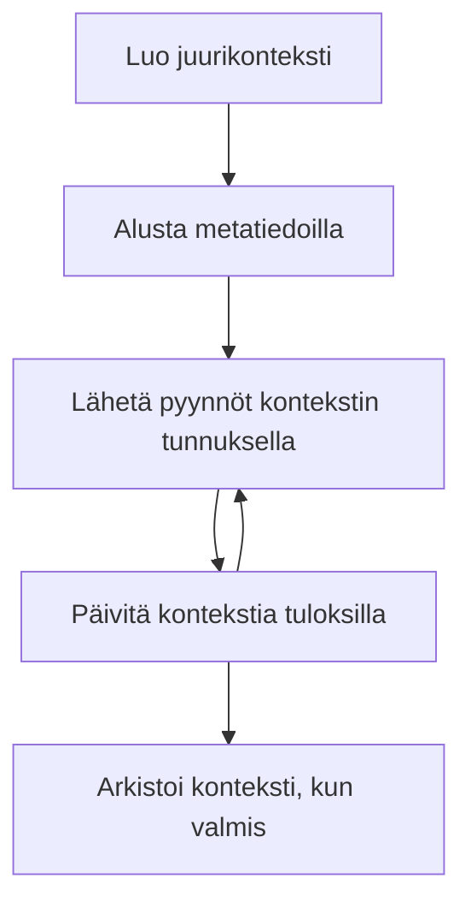

> [VANHENTUNUT: 2026-07-28 JULKAISUEHDOKAS](https://blog.modelcontextprotocol.io/posts/2026-07-28-release-candidate/#roots-sampling-and-logging-are-deprecated)

# MCP Juuriympäristöt

> **Vanhentumisilmoitus:** MCP spesifikaation versioehdokas `2026-07-28` merkitsee Rootsien vanhentuneiksi työkaluparametrien, resurssi-URI:iden tai palvelimen konfiguraation hyväksi. Rootsit toimivat edelleen versiossa `2025-11-25` ja vähintään vuoden ajan minkä tahansa virallisen vanhentumisilmoituksen jälkeen, joten tämän oppitunnin kaikki sisältö on edelleen voimassa – mutta uusien palvelinsuunnitelmien tulee harkita korvaavaa mallia. Katso lisää kohdasta [Mitä MCP:ssa muuttuu: 2026-07-28 Julkaisuehdokas](../../01-CoreConcepts/mcp-2026-07-28-release-candidate.md).

Juuriympäristöt ovat keskeinen käsite Model Context Protocolissa, joka tarjoaa pysyvän kerroksen keskusteluhistorian ja jaetun tilan ylläpitämiseen usean pyynnön ja istunnon yli.

## Johdanto

Tässä oppitunnissa tutustumme siihen, miten luoda, hallita ja hyödyntää juuriympäristöjä MCP:ssä.

## Oppimistavoitteet

Oppitunnin lopussa osaat:

- Ymmärtää juuriympäristöjen tarkoituksen ja rakenteen
- Luoda ja hallita juuriympäristöjä MCP-asiakirjastojen avulla
- Toteuttaa juuriympäristöt .NET-, Java-, JavaScript- ja Python-sovelluksissa
- Hyödyntää juuriympäristöjä monivaiheisissa keskusteluissa ja tilanhallinnassa
- Soveltaa parhaita käytäntöjä juuriympäristöjen hallinnassa

## Juuriympäristöjen ymmärtäminen

Juuriympäristöt toimivat säiliöinä, jotka säilyttävät sarjan toisiinsa liittyviä vuorovaikutuksia ja tilaa. Ne mahdollistavat:

- **Keskustelun pysyvyys**: Johdonmukaisten monivaiheisten keskusteluiden ylläpitäminen
- **Muistinhallinta**: Tiedon tallentaminen ja hakeminen vuorovaikutusten välillä
- **Tilanhallinta**: Edistymisen seuranta monimutkaisissa työnkuluissa
- **Ympäristön jakaminen**: Mahdollistaa useiden asiakkaiden pääsyn samaan keskustelutilaan

MCP:ssä juuriympäristöillä on seuraavat keskeiset ominaisuudet:

- Jokaisella juuriympäristöllä on ainutlaatuinen tunniste.
- Ne voivat sisältää keskusteluhistorian, käyttäjän mieltymykset ja muuta metatietoa.
- Ne voidaan luoda, käyttää ja arkistoida tarpeen mukaan.
- Ne tukevat hienojakoista pääsynhallintaa ja käyttöoikeuksia.

## Juuriympäristön elinkaari



## Työskentely juuriympäristöjen kanssa

Tässä on esimerkki siitä, miten luoda ja hallita juuriympäristöjä.

### C# Toteutus

```csharp
// .NET Example: Root Context Management
using Microsoft.Mcp.Client;
using System;
using System.Threading.Tasks;
using System.Collections.Generic;

public class RootContextExample
{
    private readonly IMcpClient _client;
    private readonly IRootContextManager _contextManager;
    
    public RootContextExample(IMcpClient client, IRootContextManager contextManager)
    {
        _client = client;
        _contextManager = contextManager;
    }
    
    public async Task DemonstrateRootContextAsync()
    {
        // 1. Create a new root context
        var contextResult = await _contextManager.CreateRootContextAsync(new RootContextCreateOptions
        {
            Name = "Customer Support Session",
            Metadata = new Dictionary<string, string>
            {
                ["CustomerName"] = "Acme Corporation",
                ["PriorityLevel"] = "High",
                ["Domain"] = "Cloud Services"
            }
        });
        
        string contextId = contextResult.ContextId;
        Console.WriteLine($"Created root context with ID: {contextId}");
        
        // 2. First interaction using the context
        var response1 = await _client.SendPromptAsync(
            "I'm having issues scaling my web service deployment in the cloud.", 
            new SendPromptOptions { RootContextId = contextId }
        );
        
        Console.WriteLine($"First response: {response1.GeneratedText}");
        
        // Second interaction - the model will have access to the previous conversation
        var response2 = await _client.SendPromptAsync(
            "Yes, we're using containerized deployments with Kubernetes.", 
            new SendPromptOptions { RootContextId = contextId }
        );
        
        Console.WriteLine($"Second response: {response2.GeneratedText}");
        
        // 3. Add metadata to the context based on conversation
        await _contextManager.UpdateContextMetadataAsync(contextId, new Dictionary<string, string>
        {
            ["TechnicalEnvironment"] = "Kubernetes",
            ["IssueType"] = "Scaling"
        });
        
        // 4. Get context information
        var contextInfo = await _contextManager.GetRootContextInfoAsync(contextId);
        
        Console.WriteLine("Context Information:");
        Console.WriteLine($"- Name: {contextInfo.Name}");
        Console.WriteLine($"- Created: {contextInfo.CreatedAt}");
        Console.WriteLine($"- Messages: {contextInfo.MessageCount}");
        
        // 5. When the conversation is complete, archive the context
        await _contextManager.ArchiveRootContextAsync(contextId);
        Console.WriteLine($"Archived context {contextId}");
    }
}
```

Edellisessä koodissa olemme:

1. Luoneet juuriympäristön asiakastukisessiolle.
1. Lähettäneet useita viestejä kyseisessä ympäristössä, jolloin malli voi ylläpitää tilaa.
1. Päivittäneet ympäristön asiaankuuluvilla metatiedoilla keskustelun perusteella.
1. Haettu ympäristön tietoa keskusteluhistorian ymmärtämiseksi.
1. Arkistoitu ympäristö, kun keskustelu oli päättynyt.

## Esimerkki: Juuriympäristön toteutus talousanalyysille

Tässä esimerkissä luomme juuriympäristön talousanalyysisessiolle, joka osoittaa, miten ylläpitää tilaa useiden vuorovaikutusten yli.

### Java Toteutus

```java
// Java-esimerkki: Juurikontekstin toteutus
package com.example.mcp.contexts;

import com.mcp.client.McpClient;
import com.mcp.client.ContextManager;
import com.mcp.models.RootContext;
import com.mcp.models.McpResponse;

import java.util.HashMap;
import java.util.Map;
import java.util.UUID;

public class RootContextsDemo {
    private final McpClient client;
    private final ContextManager contextManager;
    
    public RootContextsDemo(String serverUrl) {
        this.client = new McpClient.Builder()
            .setServerUrl(serverUrl)
            .build();
            
        this.contextManager = new ContextManager(client);
    }
    
    public void demonstrateRootContext() throws Exception {
        // Luo kontekstin metatiedot
        Map<String, String> metadata = new HashMap<>();
        metadata.put("projectName", "Financial Analysis");
        metadata.put("userRole", "Financial Analyst");
        metadata.put("dataSource", "Q1 2025 Financial Reports");
        
        // 1. Luo uusi juurikonteksti
        RootContext context = contextManager.createRootContext("Financial Analysis Session", metadata);
        String contextId = context.getId();
        
        System.out.println("Created context: " + contextId);
        
        // 2. Ensimmäinen vuorovaikutus
        McpResponse response1 = client.sendPrompt(
            "Analyze the trends in Q1 financial data for our technology division",
            contextId
        );
        
        System.out.println("First response: " + response1.getGeneratedText());
        
        // 3. Päivitä konteksti saatujen tärkeiden tietojen avulla vastauksesta
        contextManager.addContextMetadata(contextId, 
            Map.of("identifiedTrend", "Increasing cloud infrastructure costs"));
        
        // Toinen vuorovaikutus - käytä samaa kontekstia
        McpResponse response2 = client.sendPrompt(
            "What's driving the increase in cloud infrastructure costs?",
            contextId
        );
        
        System.out.println("Second response: " + response2.getGeneratedText());
        
        // 4. Luo yhteenveto analyysisessiosta
        McpResponse summaryResponse = client.sendPrompt(
            "Summarize our analysis of the technology division financials in 3-5 key points",
            contextId
        );
        
        // Tallenna yhteenveto kontekstin metatietoihin
        contextManager.addContextMetadata(contextId, 
            Map.of("analysisSummary", summaryResponse.getGeneratedText()));
            
        // Hae päivitetyt kontekstin tiedot
        RootContext updatedContext = contextManager.getRootContext(contextId);
        
        System.out.println("Context Information:");
        System.out.println("- Created: " + updatedContext.getCreatedAt());
        System.out.println("- Last Updated: " + updatedContext.getLastUpdatedAt());
        System.out.println("- Analysis Summary: " + 
            updatedContext.getMetadata().get("analysisSummary"));
            
        // 5. Arkistoi konteksti, kun se on valmis
        contextManager.archiveContext(contextId);
        System.out.println("Context archived");
    }
}
```

Edellisessä koodissa olemme:

1. Luoneet juuriympäristön talousanalyysisessiolle.
2. Lähettäneet useita viestejä kyseisessä ympäristössä, jolloin malli voi ylläpitää tilaa.
3. Päivittäneet ympäristön asiaankuuluvilla metatiedoilla keskustelun perusteella.
4. Luoneet yhteenvedon analyysisessiosta ja tallentaneet sen ympäristön metatietoihin.
5. Arkistoineet ympäristön, kun keskustelu oli päättynyt.

## Esimerkki: Juuriympäristön hallinta

Juuriympäristöjen tehokas hallinta on ratkaisevan tärkeää keskusteluhistorian ja tilan ylläpitämiseksi. Alla on esimerkki, miten juuriympäristön hallinta voidaan toteuttaa.

### JavaScript Toteutus

```javascript
// JavaScript-esimerkki: MCP-pääkontekstien hallinta
const { McpClient, RootContextManager } = require('@mcp/client');

class ContextSession {
  constructor(serverUrl, apiKey = null) {
    // Alusta MCP-asiakas
    this.client = new McpClient({
      serverUrl,
      apiKey
    });
    
    // Alusta kontekstinhallinta
    this.contextManager = new RootContextManager(this.client);
  }
  
  /**
   * Create a new conversation context
   * @param {string} sessionName - Name of the conversation session
   * @param {Object} metadata - Additional metadata for the context
   * @returns {Promise<string>} - Context ID
   */
  async createConversationContext(sessionName, metadata = {}) {
    try {
      const contextResult = await this.contextManager.createRootContext({
        name: sessionName,
        metadata: {
          ...metadata,
          createdAt: new Date().toISOString(),
          status: 'active'
        }
      });
      
      console.log(`Created root context '${sessionName}' with ID: ${contextResult.id}`);
      return contextResult.id;
    } catch (error) {
      console.error('Error creating root context:', error);
      throw error;
    }
  }
  
  /**
   * Send a message in an existing context
   * @param {string} contextId - The root context ID
   * @param {string} message - The user's message
   * @param {Object} options - Additional options
   * @returns {Promise<Object>} - Response data
   */
  async sendMessage(contextId, message, options = {}) {
    try {
      // Lähetä viesti määritetyllä kontekstilla
      const response = await this.client.sendPrompt(message, {
        rootContextId: contextId,
        temperature: options.temperature || 0.7,
        allowedTools: options.allowedTools || []
      });
      
      // Tallenna tarvittaessa keskustelun tärkeitä oivalluksia
      if (options.storeInsights) {
        await this.storeConversationInsights(contextId, message, response.generatedText);
      }
      
      return {
        message: response.generatedText,
        toolCalls: response.toolCalls || [],
        contextId
      };
    } catch (error) {
      console.error(`Error sending message in context ${contextId}:`, error);
      throw error;
    }
  }
  
  /**
   * Store important insights from a conversation
   * @param {string} contextId - The root context ID
   * @param {string} userMessage - User's message
   * @param {string} aiResponse - AI's response
   */
  async storeConversationInsights(contextId, userMessage, aiResponse) {
    try {
      // Etsi mahdollisia oivalluksia (todellisessa sovelluksessa tämä olisi monimutkaisempaa)
      const combinedText = userMessage + "\n" + aiResponse;
      
      // Yksinkertainen heuristiikka mahdollisten oivallusten tunnistamiseen
      const insightWords = ["important", "key point", "remember", "significant", "crucial"];
      
      const potentialInsights = combinedText
        .split(".")
        .filter(sentence => 
          insightWords.some(word => sentence.toLowerCase().includes(word))
        )
        .map(sentence => sentence.trim())
        .filter(sentence => sentence.length > 10);
      
      // Tallenna oivallukset kontekstin metatietoihin
      if (potentialInsights.length > 0) {
        const insights = {};
        potentialInsights.forEach((insight, index) => {
          insights[`insight_${Date.now()}_${index}`] = insight;
        });
        
        await this.contextManager.updateContextMetadata(contextId, insights);
        console.log(`Stored ${potentialInsights.length} insights in context ${contextId}`);
      }
    } catch (error) {
      console.warn('Error storing conversation insights:', error);
      // Ei-kriittinen virhe, kirjaa vain varoitus
    }
  }
  
  /**
   * Get summary information about a context
   * @param {string} contextId - The root context ID
   * @returns {Promise<Object>} - Context information
   */
  async getContextInfo(contextId) {
    try {
      const contextInfo = await this.contextManager.getContextInfo(contextId);
      
      return {
        id: contextInfo.id,
        name: contextInfo.name,
        created: new Date(contextInfo.createdAt).toLocaleString(),
        lastUpdated: new Date(contextInfo.lastUpdatedAt).toLocaleString(),
        messageCount: contextInfo.messageCount,
        metadata: contextInfo.metadata,
        status: contextInfo.status
      };
    } catch (error) {
      console.error(`Error getting context info for ${contextId}:`, error);
      throw error;
    }
  }
  
  /**
   * Generate a summary of the conversation in a context
   * @param {string} contextId - The root context ID
   * @returns {Promise<string>} - Generated summary
   */
  async generateContextSummary(contextId) {
    try {
      // Pyydä mallia laatimaan yhteenveto tähän asti käydystä keskustelusta
      const response = await this.client.sendPrompt(
        "Please summarize our conversation so far in 3-4 sentences, highlighting the main points discussed.",
        { rootContextId: contextId, temperature: 0.3 }
      );
      
      // Tallenna yhteenveto kontekstin metatietoihin
      await this.contextManager.updateContextMetadata(contextId, {
        conversationSummary: response.generatedText,
        summarizedAt: new Date().toISOString()
      });
      
      return response.generatedText;
    } catch (error) {
      console.error(`Error generating context summary for ${contextId}:`, error);
      throw error;
    }
  }
  
  /**
   * Archive a context when it's no longer needed
   * @param {string} contextId - The root context ID
   * @returns {Promise<Object>} - Result of the archive operation
   */
  async archiveContext(contextId) {
    try {
      // Luo lopullinen yhteenveto ennen arkistointia
      const summary = await this.generateContextSummary(contextId);
      
      // Arkistoi konteksti
      await this.contextManager.archiveContext(contextId);
      
      return {
        status: "archived",
        contextId,
        summary
      };
    } catch (error) {
      console.error(`Error archiving context ${contextId}:`, error);
      throw error;
    }
  }
}

// Esimerkin käyttö
async function demonstrateContextSession() {
  const session = new ContextSession('https://mcp-server-example.com');
  
  try {
    // 1. Luo uusi konteksti tuotteentukikeskustelua varten
    const contextId = await session.createConversationContext(
      'Product Support - Database Performance',
      {
        customer: 'Globex Corporation',
        product: 'Enterprise Database',
        severity: 'Medium',
        supportAgent: 'AI Assistant'
      }
    );
    
    // 2. Keskustelun ensimmäinen viesti
    const response1 = await session.sendMessage(
      contextId,
      "I'm experiencing slow query performance on our database cluster after the latest update.",
      { storeInsights: true }
    );
    console.log('Response 1:', response1.message);
    
    // Jatkoviestillä samassa kontekstissa
    const response2 = await session.sendMessage(
      contextId,
      "Yes, we've already checked the indexes and they seem to be properly configured.",
      { storeInsights: true }
    );
    console.log('Response 2:', response2.message);
    
    // 3. Hanki tietoa kontekstista
    const contextInfo = await session.getContextInfo(contextId);
    console.log('Context Information:', contextInfo);
    
    // 4. Luo ja näytä keskustelun yhteenveto
    const summary = await session.generateContextSummary(contextId);
    console.log('Conversation Summary:', summary);
    
    // 5. Arkistoi konteksti valmiina
    const archiveResult = await session.archiveContext(contextId);
    console.log('Archive Result:', archiveResult);
    
    // 6. Käsittele mahdolliset virheet joustavasti
  } catch (error) {
    console.error('Error in context session demonstration:', error);
  }
}

demonstrateContextSession();
```

Edellisessä koodissa olemme:

1. Luoneet juuriympäristön tuotetukikeskustelulle funktiolla `createConversationContext`. Tässä ympäristö käsittelee tietokannan suorituskykyyn liittyviä ongelmia.

1. Lähettäneet useita viestejä kyseisessä ympäristössä, jolloin malli voi ylläpitää tilaa funktiolla `sendMessage`. Lähetettävät viestit koskevat hitaita kyselysuorituksia ja indeksoinnin asetuksia.

1. Päivittäneet ympäristön asiaankuuluvilla metatiedoilla keskustelun perusteella.

1. Luoneet yhteenvedon keskustelusta ja tallentaneet sen ympäristön metatietoihin funktiolla `generateContextSummary`.

1. Arkistoineet ympäristön keskustelun päätyttyä funktiolla `archiveContext`.

1. Käsitelleet virheitä joustavasti varmistaaksemme vakaan toiminnan.

## Juuriympäristö monivaiheisessa avustuksessa

Tässä esimerkissä luomme juuriympäristön monivaiheiselle avustussessiolle, joka osoittaa tilan ylläpitämisen useiden vuorovaikutusten yli.

### Python Toteutus

```python
# Python-esimerkki: Juuriympäristö monivaiheiselle avustukselle
import asyncio
from datetime import datetime
from mcp_client import McpClient, RootContextManager

class AssistantSession:
    def __init__(self, server_url, api_key=None):
        self.client = McpClient(server_url=server_url, api_key=api_key)
        self.context_manager = RootContextManager(self.client)
    
    async def create_session(self, name, user_info=None):
        """Create a new root context for an assistant session"""
        metadata = {
            "session_type": "assistant",
            "created_at": datetime.now().isoformat(),
        }
        
        # Lisää käyttäjätiedot, jos ne on annettu
        if user_info:
            metadata.update({f"user_{k}": v for k, v in user_info.items()})
            
        # Luo juuriympäristö
        context = await self.context_manager.create_root_context(name, metadata)
        return context.id
    
    async def send_message(self, context_id, message, tools=None):
        """Send a message within a root context"""
        # Luo asetukset sisältäen kontekstin tunnisteen
        options = {
            "root_context_id": context_id
        }
        
        # Lisää työkalut, jos ne on määritelty
        if tools:
            options["allowed_tools"] = tools
        
        # Lähetä kehotus kontekstissa
        response = await self.client.send_prompt(message, options)
        
        # Päivitä kontekstin metatiedot keskustelun edistymisen mukaan
        await self.context_manager.update_context_metadata(
            context_id,
            {
                f"message_{datetime.now().timestamp()}": message[:50] + "...",
                "last_interaction": datetime.now().isoformat()
            }
        )
        
        return response
    
    async def get_conversation_history(self, context_id):
        """Retrieve conversation history from a context"""
        context_info = await self.context_manager.get_context_info(context_id)
        messages = await self.client.get_context_messages(context_id)
        
        return {
            "context_info": context_info,
            "messages": messages
        }
    
    async def end_session(self, context_id):
        """End an assistant session by archiving the context"""
        # Luo ensin yhteenvetokehotus
        summary_response = await self.client.send_prompt(
            "Please summarize our conversation and any key points or decisions made.",
            {"root_context_id": context_id}
        )
        
        # Tallenna yhteenveto metatietoihin
        await self.context_manager.update_context_metadata(
            context_id,
            {
                "summary": summary_response.generated_text,
                "ended_at": datetime.now().isoformat(),
                "status": "completed"
            }
        )
        
        # Arkistoi konteksti
        await self.context_manager.archive_context(context_id)
        
        return {
            "status": "completed",
            "summary": summary_response.generated_text
        }

# Esimerkin käyttö
async def demo_assistant_session():
    assistant = AssistantSession("https://mcp-server-example.com")
    
    # 1. Luo istunto
    context_id = await assistant.create_session(
        "Technical Support Session",
        {"name": "Alex", "technical_level": "advanced", "product": "Cloud Services"}
    )
    print(f"Created session with context ID: {context_id}")
    
    # 2. Ensimmäinen vuorovaikutus
    response1 = await assistant.send_message(
        context_id, 
        "I'm having trouble with the auto-scaling feature in your cloud platform.",
        ["documentation_search", "diagnostic_tool"]
    )
    print(f"Response 1: {response1.generated_text}")
    
    # Toinen vuorovaikutus samassa kontekstissa
    response2 = await assistant.send_message(
        context_id,
        "Yes, I've already checked the configuration settings you mentioned, but it's still not working."
    )
    print(f"Response 2: {response2.generated_text}")
    
    # 3. Hae historia
    history = await assistant.get_conversation_history(context_id)
    print(f"Session has {len(history['messages'])} messages")
    
    # 4. Lopeta istunto
    end_result = await assistant.end_session(context_id)
    print(f"Session ended with summary: {end_result['summary']}")

if __name__ == "__main__":
    asyncio.run(demo_assistant_session())
```

Edellisessä koodissa olemme:

1. Luoneet juuriympäristön teknisen tukisession yhteyteen funktiolla `create_session`. Ympäristö sisältää käyttäjätietoja kuten nimi ja tekninen taso.

1. Lähettäneet useita viestejä kyseisessä ympäristössä, jolloin malli voi ylläpitää tilaa funktiolla `send_message`. Lähetettävät viestit käsittelevät automaattisen skaalausominaisuuden ongelmia.

1. Haettu keskusteluhistoria funktiolla `get_conversation_history`, joka tarjoaa ympäristötiedot ja viestit.

1. Päättänyt session arkistoimalla ympäristön ja luomalla yhteenvedon funktiolla `end_session`. Yhteenveto tiivistää keskustelun keskeiset kohdat.

## Juuriympäristöjen parhaat käytännöt

Tässä on joitakin parhaita käytäntöjä juuriympäristöjen tehokkaaseen hallintaan:

- **Luo fokusoituja ympäristöjä**: Luo erilliset juuriympäristöt eri keskustelutarkoituksia tai -alueita varten selkeyden säilyttämiseksi.

- **Aseta vanhenemispolitiikat**: Toteuta politiikat vanhojen ympäristöjen arkistointiin tai poistoon tallennustilan hallitsemiseksi ja tietojen säilyttämiskäytäntöjen noudattamiseksi.

- **Tallenna asiaankuuluvat metatiedot**: Käytä ympäristön metatietoja tallentaaksesi keskustelun kannalta tärkeitä tietoja myöhempää käyttöä varten.

- **Käytä ympäristön tunnisteita johdonmukaisesti**: Kun ympäristö on luotu, käytä sen tunnistetta johdonmukaisesti kaikissa siihen liittyvissä pyynnöissä jatkuvuuden säilyttämiseksi.

- **Luo yhteenvetoja**: Kun ympäristö kasvaa suureksi, harkitse yhteenvedon luomista olennaisten tietojen tallentamiseksi ja ympäristön koon hallitsemiseksi.

- **Toteuta pääsynhallinta**: Monikäyttäjäjärjestelmissä toteuta asianmukaiset pääsynhallintamekanismit keskusteluympäristöjen yksityisyyden ja turvallisuuden takaamiseksi.

- **Ota huomioon ympäristön rajoitukset**: Ole tietoinen ympäristön koon rajoituksista ja toteuta strategioita hyvin pitkien keskustelujen käsittelemiseksi.

- **Arkistoi keskustelun päätyttyä**: Arkistoi ympäristöt keskustelun päätyttyä vapauttaaksesi resursseja säilyttäen samalla keskusteluhistorian.

## Mitä seuraavaksi

- [5.5 Reititys](../mcp-routing/README.md)

---

<!-- CO-OP TRANSLATOR DISCLAIMER START -->
**Vastuuvapauslauseke**:
Tämä asiakirja on käännetty käyttämällä tekoälypohjaista käännöspalvelua [Co-op Translator](https://github.com/Azure/co-op-translator). Vaikka pyrimme tarkkuuteen, otathan huomioon, että automaattiset käännökset saattavat sisältää virheitä tai epätarkkuuksia. Alkuperäinen asiakirja sen alkuperäiskielellä on virallinen lähde. Tärkeissä asioissa suositellaan ammattimaista ihmiskäännöstä. Emme ole vastuussa tämän käännöksen käytöstä aiheutuvista väärinymmärryksistä tai tulkinnoista.
<!-- CO-OP TRANSLATOR DISCLAIMER END -->