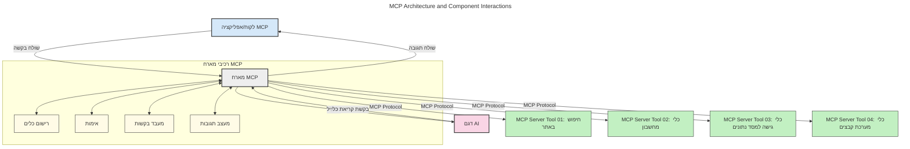
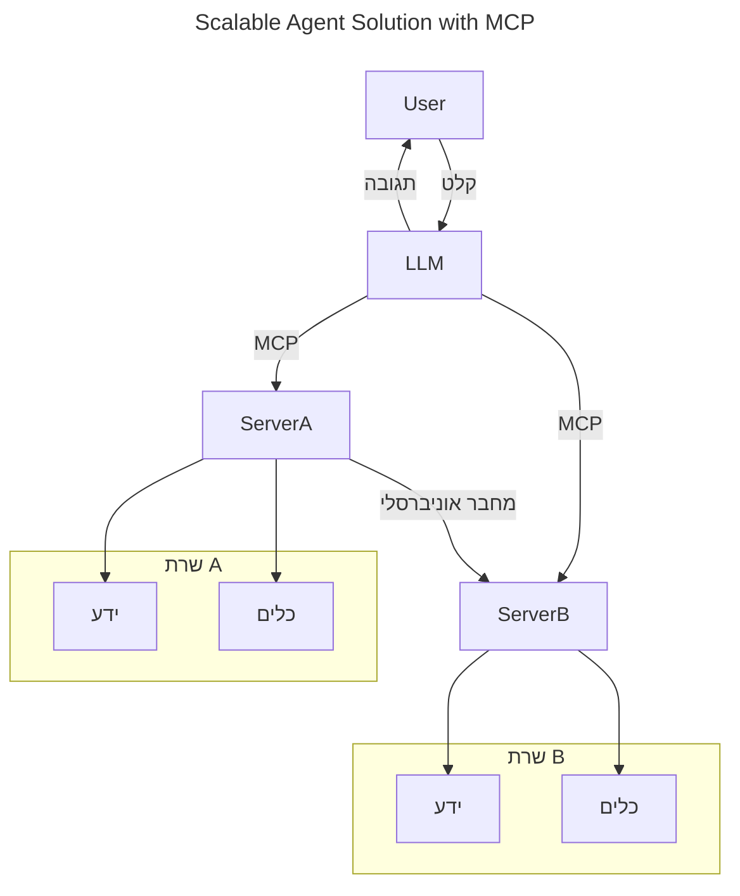
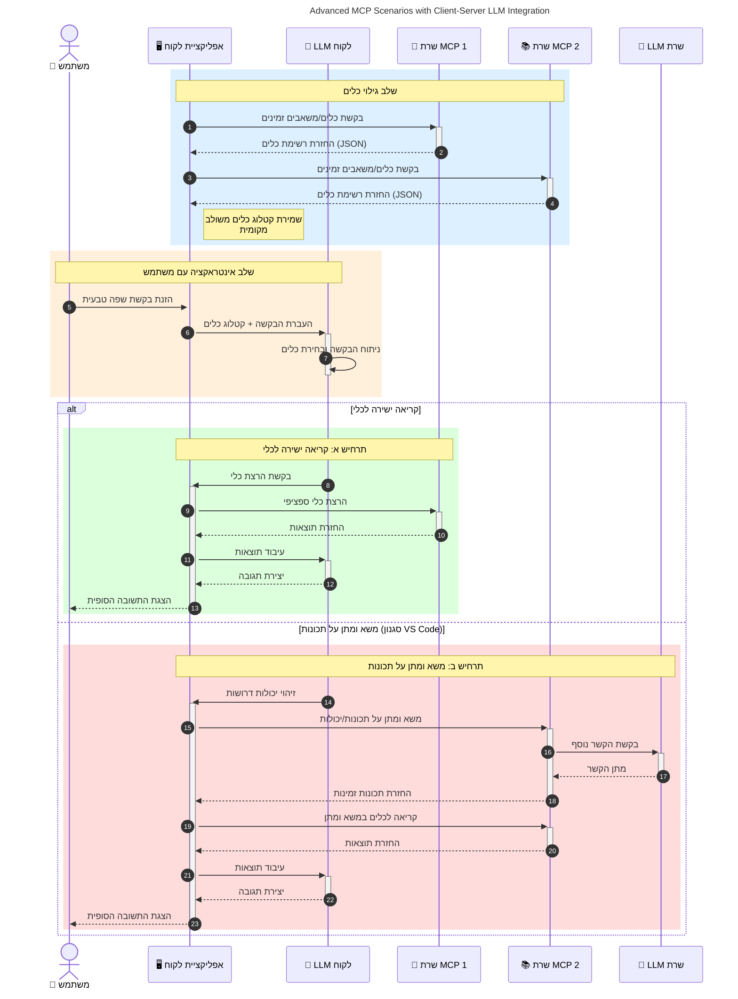

# מבוא לפרוטוקול הקשר הדגם (MCP): מדוע הוא חשוב ליישומי בינה מלאכותית סקלאביליים

_(לחצו על התמונה למעלה כדי לצפות בסרטון של השיעור הזה)_

יישומי בינה מלאכותית גנרטיביים הם צעד משמעותי קדימה שכן לעיתים קרובות הם מאפשרים למשתמש אינטראקציה עם האפליקציה באמצעות פקודות בשפה טבעית. עם זאת, ככל שמשקיעים יותר זמן ומשאבים ביישומים כאלו, חשוב לוודא שניתן לשלב פונקציונליות ומשאבים בקלות בצורה שמאפשרת הרחבה, שהאפליקציה שלכם תוכל לתמוך ביותר מדגם אחד ולנהל סיבוכיות משתנה בדגמים. בקיצור, בניית יישומי בינה מלאכותית גנרטיביים קלה בתחילה, אבל כשהם מתרחבים ומסובכים יותר, יש להתחיל להגדיר ארכיטקטורה וסביר שתצטרכו להישען על תקן כדי להבטיח שהאפליקציות שלכם יבנו באופן עקבי. כאן נכנס MCP כדי לארגן את הדברים ולספק תקן.

---

## **🔍 מהו פרוטוקול הקשר הדגם (MCP)?**

**פרוטוקול הקשר הדגם (MCP)** הוא **ממשק פתוח ומאוחד** שמאפשר לדגמי שפה גדולים (LLMs) לתקשר בצורה חלקה עם כלים חיצוניים, ממשקי API ומקורות נתונים. הוא מספק ארכיטקטורה עקבית לשיפור פונקציונליות דגמי AI מעבר לנתוני האימון שלהם, ומאפשר מערכות בינה מלאכותית חכמות, סקלאביליות ותגובה מהירה יותר.

---

## **🎯 מדוע סטנדרטיזציה בבינה מלאכותית חשובה**

כאשר יישומי בינה מלאכותית גנרטיביים הופכים למורכבים יותר, יש צורך לאמץ תקנים שמבטיחים **סקלאביליות, הרחבה, תחזוקה** ו**הימנעות מהיתפסות לספק יחיד**. MCP מתמודד עם צרכים אלו על ידי:

- איחוד אינטגרציות דגם-כלי
- הפחתת פתרונות מותאמים אישית שבירים וחד-פעמיים
- אפשרות לקיומם של מספר דגמים מספקים שונים במערכת אקולוגית אחת

**הערה:** אף ש-MCP מציג את עצמו כתקן פתוח, אין תכניות לסטנדרטיזציה של MCP דרך גופי תקינה קיימים כגון IEEE, IETF, W3C, ISO או כל גוף תקינה אחר.

---

## **📚 מטרות למידה**

בסוף מאמר זה תוכל:

- להגדיר את **פרוטוקול הקשר הדגם (MCP)** ושימושיו
- להבין כיצד MCP מתמקד בתקשורת מודל-כלי
- לזהות את המרכיבים המרכזיים בארכיטקטורת MCP
- לחקור יישומים מעשיים של MCP בהקשרים ארגוניים ופיתוחיים

---

## **💡 מדוע פרוטוקול הקשר הדגם (MCP) משנה את הכללים**

### **🔗 MCP פותר בידוד באינטראקציות בינה מלאכותית**

לפני MCP, אינטגרציה של דגמים עם כלים דרשה:

- קוד מותאם אישית לכל זוג כלי-דגם
- ממשקי API לא סטנדרטיים לכל ספק
- שבירות תכופה עקב עדכונים
- יכולת סקלאביליות ירודה עם כלים רבים יותר

### **✅ יתרונות הסטנדרטיזציה של MCP**

| **יתרון**              | **תיאור**                                                                |
|--------------------------|-------------------------------------------------------------------------|
| תפעוליות    | דגמי שפה גדולים עובדים חלק עם כלים מספקים שונים                        |
| עקביות       | התנהגות אחידה בין פלטפורמות וכלים                                     |
| שימוש חוזר   | כלים שנבנו פעם יכולים לשמש בפרויקטים ומערכות שונות                   |
| פיתוח מואץ  | מקצר זמן פיתוח באמצעות ממשקים סטנדרטיים plug-and-play                 |

---

## **🧱 סקירת ארכיטקטורת MCP ברמת על**

MCP פועל במודל **לקוח-שרת**, כש:

- **מארחי MCP** מנהלים את הדגמים
- **לקוחות MCP** יוזמים בקשות
- **שרתי MCP** מספקים הקשר, כלים ויכולות

### **מרכיבים עיקריים:**

- **משאבים** – נתונים סטטיים או דינמיים לדגמים  
- **תמריצים** – זרימות עבודה מוגדרות מראש ליצירה מונחית  
- **כלים** – פונקציות להפעלה כמו חיפוש, חישובים  
- **דגימה** – התנהגות סוכנית באמצעות אינטראקציות רקורסיביות (מושמט בגרסת המועמד לשחרור `2026-07-28`)
- **הפקה** – בקשות יזומות מהשרת לקבלת קלט משתמש
- **שורשים** – גבולות מערכת הקבצים לבקרת גישה לשרת (מושמט בגרסת המועמד לשחרור `2026-07-28`)

### **ארכיטקטורת הפרוטוקול:**

MCP משתמש בארכיטקטורה דו-שכבתית:
- **שכבת הנתונים**: תקשורת מבוססת JSON-RPC 2.0 עם ניהול מחזור חיים ופרימיטיבים
- **שכבת ההובלה**: STDIO (מקומי) ו-HTTP זרם עם SSE (מרוחק) ערוצי תקשורת

---

## כיצד שרתי MCP פועלים

שרתי MCP פועלים באופן הבא:

- **זרימת בקשות**:
    1. בקשה מיוזמת משתמש קצה או תוכנה הפועלת בשמו.
    2. **לקוח MCP** שולח את הבקשה ל**מארח MCP** המנהל את זמן הריצה של דגם ה-AI.
    3. **דגם ה-AI** מקבל את הפקודה מהמשתמש ועלול לבקש גישה לכלים חיצוניים או לנתונים דרך קריאות כלי אחת או יותר.
    4. ה**מארח MCP**, ולא הדגם ישירות, מתקשר עם **שרת (שרתים) MCP** המתאים באמצעות הפרוטוקול המואחד.
- **פונקציית מארח MCP**:
    - **רישום כלים**: מתחזק קטלוג של כלים זמינים ויכולותיהם.
    - **אימות**: מאשר הרשאות לגישה לכלים.
    - **מטפל בבקשות**: מעבד בקשות כלים נכנסות מהדגם.
    - **מעצב תשובות**: מארגן פלטים של כלים בפורמט שהדגם מסוגל להבין.
- **ביצוע שרת MCP**:
    - ה**מארח MCP** מנתב קריאות כלים לאחד או יותר מ**שרתי MCP**, כל אחד חושף פונקציות מיוחדות (כגון חיפוש, חישובים, שאילתות מסד נתונים).
    - שרתי ה**MCP** מבצעים את פעולותיהם ומחזירים תוצאות ל**מארח MCP** בפורמט עקבי.
    - ה**מארח MCP** מעצב ומשדר את התוצאות האלו לדגם.
- **השלמת התגובה**:
    - דגם ה-AI משלב את פלטי הכלים לתגובה סופית.
    - ה**מארח MCP** שולח תגובה זו חזרה ל**לקוח MCP**, שמספק אותה למשתמש הקצה או לתוכנה הקוראת.
    

## 👨‍💻 כיצד לבנות שרת MCP (עם דוגמאות)

שרתי MCP מאפשרים להרחיב את יכולות דגמי השפה הגדולים בכך שהם מספקים נתונים ופונקציונליות.

מוכנים לנסות? הנה SDKים ספציפיים לשפות ו/או מערכות עם דוגמאות ליצירת שרתי MCP פשוטים בשפות וסביבות שונות:

- **Python SDK**: https://github.com/modelcontextprotocol/python-sdk

- **TypeScript SDK**: https://github.com/modelcontextprotocol/typescript-sdk

- **Java SDK**: https://github.com/modelcontextprotocol/java-sdk

- **C#/.NET SDK**: https://github.com/modelcontextprotocol/csharp-sdk

## 🌍 מקרי שימוש מעשיים ל-MCP

MCP מאפשר טווח רחב של יישומים על ידי הרחבת יכולות ה-AI:

| **יישום**              | **תיאור**                                                                |
|------------------------------|-------------------------------------------------------------------------|
| אינטגרציה של נתונים ארגוניים  | חיבור דגמי שפה גדולים למסדי נתונים, מערכות CRM, או כלים פנימיים       |
| מערכות AI סוכניות          | הפעלת סוכנים אוטונומיים עם גישה לכלים וזרמי עבודה לקבלת החלטות          |
| יישומים מולטי-מודאליים      | שילוב טקסט, תמונה ואודיו בתוך אפליקציית AI מאוחדת אחת                  |
| אינטגרציה של נתונים בזמן אמת | הבאת נתונים חיים לאינטראקציות AI לתוצאות מדויקות ועדכניות יותר          |

### 🧠 MCP = תקן אוניברסלי לאינטראקציות בינה מלאכותית

פרוטוקול הקשר הדגם (MCP) משמש כתקן אוניברסלי לאינטראקציות בינה מלאכותית, בדומה לאופן שבו USB-C סטנדרט חיבורים פיזיים למכשירים. בעולם ה-AI, MCP מספק ממשק עקבי, המאפשר לדגמים (לקוחות) להשתלב בצורה חלקה עם כלים חיצוניים וספקי נתונים (שרתים). זה מבטל את הצורך בפרוטוקולים מותאמים ומגוונים לכל API או מקור נתונים.

תחת MCP, כלי תואם MCP (המכונה שרת MCP) פועל לפי תקן מאוחד. שרתים אלו יכולים לרשום את הכלים או הפעולות שהם מציעים ולבצע את הפעולות האלה כשהן מבוקשות על ידי סוכן AI. פלטפורמות סוכני AI התומכות ב-MCP יכולות לגלות כלים זמינים משרתים ולהפעיל אותם באמצעות פרוטוקול זה.

### 💡 מקל על גישה לידע

מעבר להצעת כלים, MCP גם מסייע בגישה לידע. הוא מאפשר ליישומים לספק הקשר לדגמי שפה גדולים (LLMs) על ידי קישורם למקורות נתונים שונים. לדוגמה, שרת MCP עשוי לייצג מאגר מסמכים של חברה, המאפשר לסוכנים לשלוף מידע רלוונטי לפי דרישה. שרת אחר יכול לטפל בפעולות ספציפיות כמו שליחת מיילים או עדכון רשומות. מבחינת הסוכן, אלו פשוט כלים שהוא יכול להשתמש בהם — כלים מסוימים מחזירים נתונים (הקשר ידע), ואחרים מבצעים פעולות. MCP מנהל שניהם ביעילות.

סוכן שמתחבר לשרת MCP לומד אוטומטית את היכולות הזמינות ואת הנתונים הנגישים דרך פורמט סטנדרטי. סטנדרטיזציה זו מאפשרת זמינות דינמית של כלים. לדוגמה, הוספת שרת MCP חדש למערכת הסוכן הופכת את הפונקציות שלו לזמינות מיד ללא צורך בהתאמה נוספת של ההנחיות של הסוכן.

אינטגרציה חלקה זו מתיישרת עם הזרימה המתוארת בדיאגרמה הבאה, שבה השרתים מספקים גם כלים וגם ידע, ומבטיחים שיתוף פעולה חלק בין מערכות.

### 👉 דוגמה: פתרון סוכני סקלאבילי

המכלול האוניברסלי מאפשר לשרתי MCP לתקשר ולחלוק יכולות ביניהם, מה שמאפשר ל-ServerA להאציל משימות ל-ServerB או לגשת לכלים וידע שלו. זה פדרציה של כלים ונתונים בין שרתים, התומכת בארכיטקטורות סוכניים מודולריות וסקלאביליות. מאחר ש-MCP מסטנדרט חשיפת כלים, סוכנים יכולים לגלות ולנתב בקשות בין שרתים בצורה דינמית ללא אינטגרציות מקודדות מראש.

פדרציית כלים וידע: כלים ונתונים נגישים בין שרתים, תומכים בארכיטקטורות סוכניות יותר סקלביליות ומודולריות.

### 🔄 תרחישי MCP מתקדמים עם אינטגרציית LLM בצד הלקוח

מעבר לארכיטקטורה הבסיסית של MCP, קיימים תרחישים מתקדמים בהם גם הלקוח וגם השרת מכילים דגמי שפה גדולים, ומאפשרים אינטראקציות מתוחכמות יותר. בדיאגרמה הבאה, **אפליקציית הלקוח** יכולה להיות IDE עם מספר כלים זמינים ל-LLM לשימוש המשתמש:

## 🔐 יתרונות מעשיים של MCP

הנה היתרונות המעשיים של שימוש ב-MCP:

- **טריות**: דגמים יכולים לגשת למידע עדכני מעבר לנתוני האימון שלהם
- **הרחבת יכולות**: דגמים יכולים להשתמש בכלים מתמחים למשימות שלא אומנו עבורן
- **צמצום הזיות**: מקורות נתונים חיצוניים מספקים עיגון עובדתי
- **פרטיות**: נתונים רגישים יכולים להישאר בסביבות מאובטחות במקום להיות מוטמעים בתקשרורים

## 📌 נקודות מרכזיות

להלן נקודות מרכזיות לשימוש ב-MCP:

- **MCP** מסטנדרט את האינטראקציה של דגמי AI עם כלים ונתונים
- מקדם **הרחבה, עקביות, ותפעוליות**
- MCP עוזר **לקצר זמני פיתוח, לשפר אמינות ולהרחיב יכולות דגם**
- ארכיטקטורת לקוח-שרת **מאפשרת יישומי AI גמישים והרחבתיים**

## 🧠 תרגיל

חשוב על יישום AI שאתה מעוניין לבנות.

- אילו **כלים או נתונים חיצוניים** יכולים לשפר את יכולותיו?
- כיצד MCP יכול להפוך את האינטגרציה ל**פשוטה ואמינה יותר?**

## משאבים נוספים

- [מאגר MCP ב-GitHub](https://github.com/modelcontextprotocol)

## מה הלאה

ההמשך: [פרק 1: מושגי יסוד](../01-CoreConcepts/README.md)

---

<!-- CO-OP TRANSLATOR DISCLAIMER START -->
**כתב ויתור**:
מסמך זה תורגם באמצעות שירות תרגום אוטומטי [Co-op Translator](https://github.com/Azure/co-op-translator). למרות שאנו שואפים לדיוק, יש לקחת בחשבון שתרגומים אוטומטיים עלולים להכיל שגיאות או אי-דיוקים. יש להחשיב את המסמך המקורי בשפתו הטבעית כמקור הסמכות. למידע קריטי מומלץ להשתמש בתרגום מקצועי על ידי מתרגם אדם. אנו לא אחראים לכל אי-הבנה או פירוש שגוי הנובע מהשימוש בתרגום זה.
<!-- CO-OP TRANSLATOR DISCLAIMER END -->