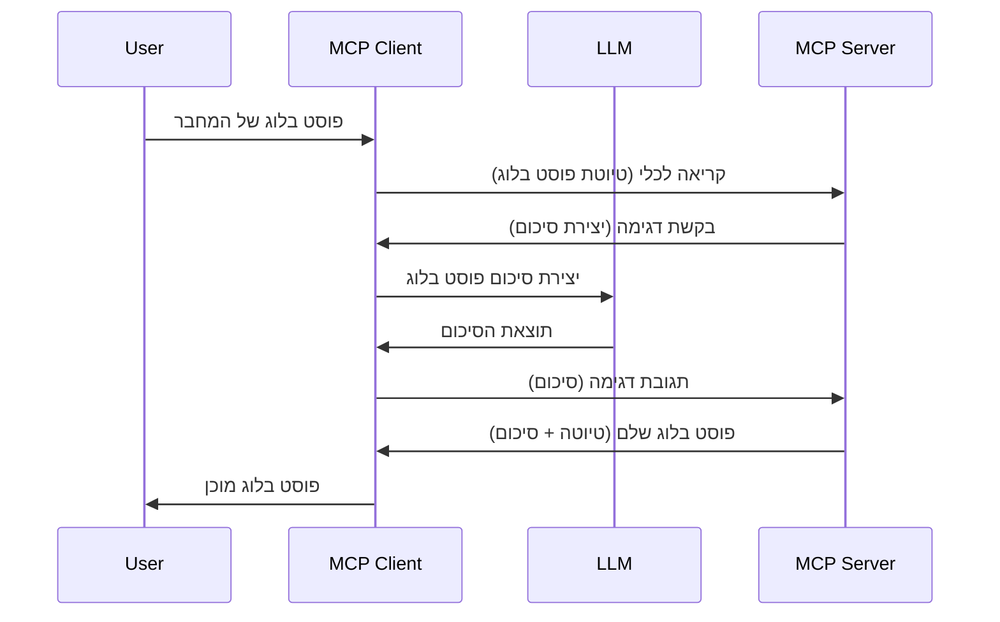

> [ישן: מועמד לשחרור 2026-07-28](https://blog.modelcontextprotocol.io/posts/2026-07-28-release-candidate/)

# דגימה - להאציל תכונות ללקוח

> **הודעת הפסקת תמיכה:** מועמד פרסום המפרט MCP `2026-07-28` מסמן את הדגימה כמפסיקה לטובת אינטגרציה ישירה עם ממשקי API של ספקי LLM. הדגימה ממשיכה לפעול ב-`2025-11-25` ולמשך לפחות שנה לאחר הפסקה רשמית, לכן כל מה שבשיעור זה נשאר תקף — אך עיצובים חדשים של שרתים צריכים להעריך את דפוס ההחלפה. ראו [מה מתחלף ב-MCP: מועמד פרסום 2026-07-28](../../01-CoreConcepts/mcp-2026-07-28-release-candidate.md).

לפעמים, אתם צריכים ש-MCP Client ו-MCP Server ישתפו פעולה להשגת מטרה משותפת. ייתכן שיש מצב בו השרת צריך עזרה מ-LLM שנמצא אצל הלקוח. עבור מצב כזה, דגימה היא מה שעליכם להשתמש בו.

בואו נחקור כמה מקרים שימוש ואיך לבנות פתרון הכולל דגימה.

## סקירה כללית

בשיעור זה, נתמקד בהסבר מתי והיכן להשתמש בדגימה ואיך להגדיר אותה.

## מטרות הלמידה

בפרק זה, נלמד:

- להסביר מהי דגימה ומתי להשתמש בה.
- להראות כיצד להגדיר דגימה ב-MCP.
- לספק דוגמאות להפעלה של דגימה.

## מהי דגימה ומדוע להשתמש בה?

דגימה היא תכונה מתקדמת שפועלת כך:



### בקשת דגימה

טוב, עכשיו שיש לנו תסריט כללי סביר, בוא נדבר על בקשת הדגימה שהשרת שולח בחזרה ללקוח. כך בקשה כזו יכולה להיראות בפורמט JSON-RPC:

```json
{
  "jsonrpc": "2.0",
  "id": 1,
  "method": "sampling/createMessage",
  "params": {
    "messages": [
      {
        "role": "user",
        "content": {
          "type": "text",
          "text": "Create a blog post summary of the following blog post: <BLOG POST>"
        }
      }
    ],
    "modelPreferences": {
      "hints": [
        {
          "name": "claude-3-sonnet"
        }
      ],
      "intelligencePriority": 0.8,
      "speedPriority": 0.5
    },
    "systemPrompt": "You are a helpful assistant.",
    "maxTokens": 100
  }
}
```

יש כמה דברים שכדאי לציין כאן:

- Prompt, תחת content -> text, הוא ההנחיה שלנו שהיא הוראה ל-LLM לסכם תוכן פוסט בלוג.

- **modelPreferences**. קטע זה הוא פשוט העדפה, המלצה על איזו תצורה להשתמש עם ה-LLM. המשתמש יכול לבחור האם ללכת לפי המלצות אלה או לשנותן. במקרה זה יש המלצות על דגם לשימוש ועל עדיפות למהירות ואינטליגנציה.
- **systemPrompt**, זה ההנחיה הרגילה של המערכת שלך שנותנת ל-LLM שלך אופי ומכילה הנחיות.
- **maxTokens**, זוהי תכונה נוספת שנועדה לומר כמה טוקנים מומלץ להשתמש למשימה זו.

### תגובת דגימה

תגובה זו היא מה ש-MCP Client בסופו של דבר שולח בחזרה ל-MCP Server והיא תוצאת קריאת הלקוח ל-LLM, המתנה לתגובה ואז בניית ההודעה הזו. כך זה יכול להיראות ב-JSON-RPC:

```json
{
  "jsonrpc": "2.0",
  "id": 1,
  "result": {
    "role": "assistant",
    "content": {
      "type": "text",
      "text": "Here's your abstract <ABSTRACT>"
    },
    "model": "gpt-5",
    "stopReason": "endTurn"
  }
}
```

שימו לב כיצד התגובה היא תקציר של פוסט הבלוג כפי שביקשנו. כמו כן שימו לב ש`model` שבו השתמשנו אינו מה שביקשנו אלא "gpt-5" במקום "claude-3-sonnet". זה להמחיש שהמשתמש יכול לשנות את דעתו לגבי מה להשתמש ושהבקשה לדגימה היא המלצה.

טוב, עכשיו כשאנחנו מבינים את הזרימה הראשית, ומשימה שימושית להשתמש עבורה "יצירת פוסט בלוג + תקציר", בואו נראה מה צריך לעשות כדי שזה יעבוד.

### סוגי הודעות

הודעות דגימה אינן מוגבלות רק לטקסט, תוכלו גם לשלוח תמונות וקול. כך JSON-RPC נראה שונה:

**טקסט**

```json
{
  "type": "text",
  "text": "The message content"
}
```

**תוכן תמונה**

```json
{
  "type": "image",
  "data": "base64-encoded-image-data",
  "mimeType": "image/jpeg"
}
```

**תוכן אודיו**

```json
{
  "type": "audio",
  "data": "base64-encoded-audio-data",
  "mimeType": "audio/wav"
}
```

> הערה: לפרטים נוספים על דגימה, בדקו את [התיעוד הרשמי](https://modelcontextprotocol.io/specification/2025-11-25/client/sampling)

## כיצד להגדיר דגימה בלקוח

> הערה: אם אתם בונים שרת בלבד, אין צורך לעשות הרבה כאן.

בלקוח, יש להגדיר את התכונה הבאה כך:

```json
{
  "capabilities": {
    "sampling": {}
  }
}
```

לאחר מכן זה יילקח בעת אתחול הלקוח שנבחר עם השרת.

## דוגמה של דגימה בפעולה - יצירת פוסט בלוג

בואו נכתוב שרת דגימה יחד, נצטרך לעשות את הדברים הבאים:

1. ליצור כלי בשרת.
1. הכלי המדובר צריך ליצור בקשת דגימה.
1. הכלי צריך להמתין לתשובה לבקשת הדגימה מהלקוח.
1. אז התוצאה של הכלי צריכה להיות מיוצרת.

בואו נראה את הקוד שלב-שלב:

### -1- צור את הכלי

**python**

```python
@mcp.tool()
async def create_blog(title: str, content: str, ctx: Context[ServerSession, None]) -> str:
    """Create a blog post and generate a summary"""

```

### -2- צור בקשת דגימה

הרחיבו את הכלי עם הקוד הבא:

**python**

```python
post = BlogPost(
        id=len(posts) + 1,
        title=title,
        content=content,
        abstract=""
    )

prompt = f"Create an abstract of the following blog post: title: {title} and draft: {content} "

result = await ctx.session.create_message(
        messages=[
            SamplingMessage(
                role="user",
                content=TextContent(type="text", text=prompt),
            )
        ],
        max_tokens=100,
)

```

### -3- המתן לתגובה והחזר את התגובה

**python**

```python
post.abstract = result.content.text

posts.append(post)

# מחזיר את המוצר המלא
return json.dumps({
    "id": post.title,
    "abstract": post.abstract
})
```

### -4- קוד מלא

**python**

```python
from starlette.applications import Starlette
from starlette.routing import Mount, Host

from mcp.server.fastmcp import Context, FastMCP

from mcp.server.session import ServerSession
from mcp.types import SamplingMessage, TextContent

import json


from uuid import uuid4
from typing import List
from pydantic import BaseModel


mcp = FastMCP("Blog post generator")

# app = FastAPI()

posts = []

class BlogPost(BaseModel):
    id: int
    title: str
    content: str
    abstract: str

posts: List[BlogPost] = []

@mcp.tool()
async def create_blog(title: str, content: str, ctx: Context[ServerSession, None]) -> str:
    """Create a blog post and generate a summary"""

    post = BlogPost(
        id=len(posts) + 1,
        title=title,
        content=content,
        abstract=""
    )

    prompt = f"Create an abstract of the following blog post: title: {title} and draft: {content} "

    result = await ctx.session.create_message(
        messages=[
            SamplingMessage(
                role="user",
                content=TextContent(type="text", text=prompt),
            )
        ],
        max_tokens=100,
    )

    post.abstract = result.content.text

    posts.append(post)

    # להחזיר את הפוסט המלא בבלוג
    return json.dumps({
        "id": post.title,
        "abstract": post.abstract
    })

if __name__ == "__main__":
    print("Starting server...")
    # mcp.run()
    mcp.run(transport="streamable-http")

# להריץ את האפליקציה עם: python server.py
```

### -5- בדיקה ב-Visual Studio Code

לבדוק זאת ב-Visual Studio Code, עשו את הדברים הבאים:

1. הפעל שרת במסוף
1. הוספו אותו ל-*mcp.json* (ודאו שהוא מופעל) לדוגמא כך:

   ```json
   "servers": {
      "blog-server": {
        "type": "http",
        "url": "http://localhost:8000/mcp"
      }
   }
   ```

1. הקלד הנחיה:

   ```text
   create a blog post named "Where Python comes from", the content is "Python is actually named after Monty Python Flying Circus"
   ```

1. אפשר לדגימה להתבצע. בפעם הראשונה שתבדקו זאת תוצג בפניכם שיחה נוספת שתצטרכו לאשר, ואז תראו את השיחה הרגילה שמבקשת מכם להפעיל כלי.

1. בדקו תוצאות. תראו את התוצאות מוצגות יפה ב-GitHub Copilot Chat אך גם תוכלו לבדוק את תגובת ה-JSON הגולמית.

**בונוס**. כלי Visual Studio Code תומכים היטב בדגימה. תוכלו להגדיר גישת דגימה לשרת שלכם המותקן כך:

1. עצרו לקטע ההרחבות.
1. בחרו בסמל הגלגל שיניים לשרת שלכם המותקן תחת "MCP SERVERS - INSTALLED".
1 בחרו "Configure Model Access", כאן תוכלו לבחור אילו מודלים GitHub Copilot מורשה להשתמש בזמן ביצוע דגימה. תוכלו גם לראות את כל בקשות הדגימה שהתרחשו לאחרונה על ידי בחירת "Show Sampling requests".

## מטלה

במטלה זו, תבנו דגימה שונה במקצת - כלומר אינטגרציית דגימה שתומכת ביצירת תיאור מוצר. הנה התסריט שלכם:

**תסריט**: עובד במשרד האחורי של אתר מסחר אלקטרוני זקוק לעזרה, לוקח יותר מדי זמן ליצור תיאורי מוצרים. לכן, עליכם לבנות פתרון שבו תוכלו לקרוא לכלי "create_product" עם "title" ו-"keywords" כארגומנטים והוא יצליח להפיק מוצר שלם כולל שדה "description" שמולא על ידי LLM של הלקוח.

טיפ: השתמשו במה שלמדתם קודם כדי לבנות את השרת והכלי שלו באמצעות בקשת דגימה.

## פתרון

[פתרון](./solution/README.md)

## נקודות עיקריות

דגימה היא תכונה עוצמתית שמאפשרת לשרת להאציל משימות ללקוח כאשר הוא זקוק לעזרת LLM.

## מה הבא

- [פרק 4 - יישום מעשי](../../04-PracticalImplementation/README.md)

---

<!-- CO-OP TRANSLATOR DISCLAIMER START -->
**כתב ויתור**:
מסמך זה תורגם באמצעות שירות תרגום אוטומטי [Co-op Translator](https://github.com/Azure/co-op-translator). למרות שאנו שואפים לדיוק, יש לקחת בחשבון שתרגומים אוטומטיים עלולים להכיל שגיאות או אי-דיוקים. יש להחשיב את המסמך המקורי בשפתו הטבעית כמקור הסמכות. למידע קריטי מומלץ להשתמש בתרגום מקצועי על ידי מתרגם אדם. אנו לא אחראים לכל אי-הבנה או פירוש שגוי הנובע מהשימוש בתרגום זה.
<!-- CO-OP TRANSLATOR DISCLAIMER END -->