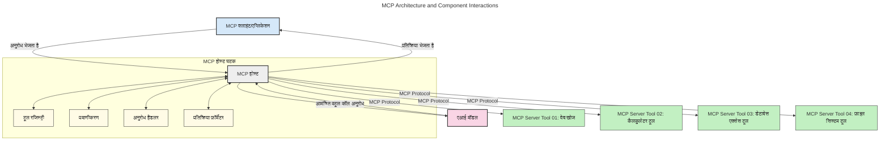
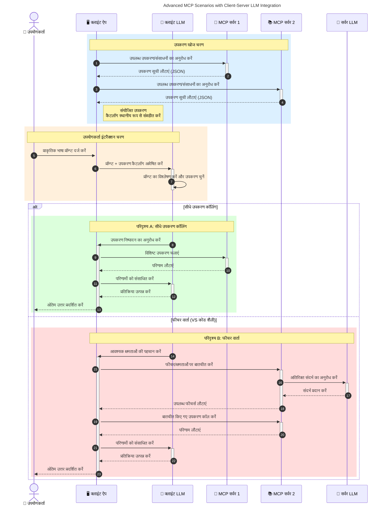

# मॉडल कॉन्टेक्स्ट प्रोटोकॉल (MCP) का परिचय: स्केलेबल AI अनुप्रयोगों के लिए इसका महत्व

[](https://youtu.be/agBbdiOPLQA)

_(इस पाठ का वीडियो देखने के लिए ऊपर की छवि पर क्लिक करें)_

जेनेरेटिव AI अनुप्रयोग एक महत्वपूर्ण कदम हैं क्योंकि ये अक्सर उपयोगकर्ता को प्राकृतिक भाषा प्रॉम्प्ट का उपयोग करके ऐप के साथ बातचीत करने की अनुमति देते हैं। हालांकि, जैसे-जैसे ऐसे ऐप में अधिक समय और संसाधन निवेशित होते हैं, आप सुनिश्चित करना चाहते हैं कि आप कार्यात्मकताओं और संसाधनों को इस तरह से आसानी से एकीकृत कर सकें कि विस्तारित करना आसान हो, आपका ऐप एक से अधिक मॉडलों का समर्थन कर सके, और विभिन्न मॉडल जटिलताओं को संभाल सके। संक्षेप में, जेन AI ऐप बनाना शुरू में आसान है, लेकिन जैसे-जैसे वे बढ़ते हैं और अधिक जटिल होते हैं, आपको एक आर्किटेक्चर परिभाषित करना शुरू करना होगा और संभवतः एक मानक पर निर्भर होना होगा ताकि आपके ऐप एक सुसंगत तरीके से बनाए जा सकें। यहां MCP चीजों को व्यवस्थित करने और एक मानक प्रदान करने में मदद करता है।

---

## **🔍 मॉडल कॉन्टेक्स्ट प्रोटोकॉल (MCP) क्या है?**

**मॉडल कॉन्टेक्स्ट प्रोटोकॉल (MCP)** एक **ओपन, मानकीकृत इंटरफ़ेस** है जो बड़े भाषा मॉडल (LLMs) को बाहरी टूल, एपीआई, और डेटा स्रोतों के साथ निर्बाध रूप से बातचीत करने की अनुमति देता है। यह AI मॉडल की कार्यक्षमता को उनके प्रशिक्षण डेटा से आगे बढ़ाने के लिए एक सुसंगत आर्किटेक्चर प्रदान करता है, जिससे स्मार्ट, स्केलेबल, और अधिक प्रतिक्रियाशील AI सिस्टम संभव होते हैं।

---

## **🎯 AI में मानकीकरण क्यों महत्वपूर्ण है**

जैसे-जैसे जेनेरेटिव AI अनुप्रयोग अधिक जटिल होते जाते हैं, ऐसे मानकों को अपनाना आवश्यक हो जाता है जो **स्केलेबिलिटी, विस्तार योग्यता, रखरखाव**, और **वेंडर लॉक-इन से बचाव** सुनिश्चित करें। MCP इन आवश्यकताओं को पूरा करता है:

- मॉडल-टूल एकीकरण को एकीकृत करना
- कमजोर, एकल उपयोग के कस्टम समाधान को कम करना
- विभिन्न विक्रेताओं के कई मॉडलों को एक ही इकोसिस्टम में सहअस्तित्व की अनुमति देना

**नोट:** जहां MCP खुद को एक खुला मानक बताता है, वहीं इसे किसी भी मौजूदा मानक निकाय जैसे IEEE, IETF, W3C, ISO या किसी अन्य मानक संगठन के माध्यम से मानकीकृत करने की कोई योजना नहीं है।

---

## **📚 शिक्षण उद्देश्य**

इस लेख के अंत तक, आप सक्षम होंगे:

- **मॉडल कॉन्टेक्स्ट प्रोटोकॉल (MCP)** और इसके उपयोग मामलों को परिभाषित करना
- MCP कैसे मॉडल-से-टूल संचार को मानकीकृत करता है यह समझना
- MCP आर्किटेक्चर के मुख्य घटकों की पहचान करना
- उद्यम और विकास संदर्भों में MCP के वास्तविक विश्व अनुप्रयोगों का अन्वेषण करना

---

## **💡 मॉडल कॉन्टेक्स्ट प्रोटोकॉल (MCP) क्यों गेम-चेंजर है**

### **🔗 MCP AI इंटरैक्शन में खंडितता को हल करता है**

MCP से पहले, मॉडलों को टूल्स के साथ जोड़ने के लिए आवश्यक था:

- प्रत्येक टूल-मॉडल जोड़ी के लिए कस्टम कोड
- प्रत्येक विक्रेता के लिए गैर-मानक API
- अपडेट के कारण अक्सर टूट-फूट
- अधिक टूल्स के साथ खराब स्केलेबिलिटी

### **✅ MCP मानकीकरण के फायदे**

| **फायदा**               | **विवरण**                                                                   |
|--------------------------|-------------------------------------------------------------------------------|
| इंटरऑपरेबिलिटी          | LLMs विभिन्न विक्रेताओं के टूल्स के साथ निर्बाध रूप से काम करते हैं           |
| स्थिरता                  | प्लेटफार्म और टूल्स में समान व्यवहार                                       |
| पुन: उपयोग योग्य          | एक बार बनाए हुए टूल्स को परियोजनाओं और सिस्टम में उपयोग किया जा सकता है     |
| विकास में तेजी           | मानकीकृत, प्लग-एंड-प्ले इंटरफेस का उपयोग करके विकास समय कम करें             |

---

## **🧱 उच्च-स्तरीय MCP आर्किटेक्चर अवलोकन**

MCP एक **क्लाइंट-सर्वर मॉडल** का पालन करता है, जहाँ:

- **MCP होस्ट** AI मॉडल चलाते हैं
- **MCP क्लाइंट** अनुरोध आरंभ करते हैं
- **MCP सर्वर** कॉन्टेक्स्ट, टूल, और क्षमताएँ प्रदान करते हैं

### **मुख्य घटक:**

- **रिसोर्सेस** – मॉडलों के लिए स्थिर या गतिशील डेटा  
- **प्रॉम्प्ट्स** – निर्देशित उत्पत्ति के लिए पूर्व-निर्धारित वर्कफ़्लो  
- **टूल्स** – निष्पादित करने योग्य कार्य जैसे खोज, गणना  
- **सैंपलिंग** – पुनरावृत्त बातचीत के माध्यम से एजेंटिक व्यवहार (2026-07-28 रिलीज उम्मीदवार में निष्कासित)  
- **एलीसिटेशन** – उपयोगकर्ता इनपुट के लिए सर्वर-प्रेरित अनुरोध  
- **रूट्स** – सर्वर पहुंच नियंत्रण के लिए फ़ाइल सिस्टम सीमाएँ (2026-07-28 रिलीज उम्मीदवार में निष্কासित)  

### **प्रोटोकॉल आर्किटेक्चर:**

MCP दो-परत आर्किटेक्चर का उपयोग करता है:
- **डेटा लेयर**: JSON-RPC 2.0 आधारित संचार जिसमें जीवनचक्र प्रबंधन और प्रिमिटिव्स शामिल हैं
- **ट्रांसपोर्ट लेयर**: STDIO (स्थानीय) और स्ट्रीमबल HTTP के साथ SSE (रिमोट) संचार चैनल

---

## MCP सर्वर कैसे काम करते हैं

MCP सर्वर निम्नलिखित तरीके से काम करते हैं:

- **अनुरोध प्रवाह**:
    1. एक अनुरोध अंत उपयोगकर्ता या उनके प्रतिनिधित्व में काम करने वाले सॉफ़्टवेयर द्वारा प्रारंभ किया जाता है।
    2. **MCP क्लाइंट** इस अनुरोध को एक **MCP होस्ट** को भेजता है, जो AI मॉडल रनटाइम का प्रबंधन करता है।
    3. **AI मॉडल** उपयोगकर्ता प्रॉम्प्ट प्राप्त करता है और एक या अधिक टूल कॉल के माध्यम से बाहरी टूल या डेटा तक पहुँच का अनुरोध कर सकता है।
    4. **MCP होस्ट**, मॉडल सीधे नहीं, उपयुक्त **MCP सर्वर(ओं)** के साथ मानकीकृत प्रोटोकॉल का उपयोग करके संवाद करता है।
- **MCP होस्ट की कार्यक्षमता**:
    - **टूल रजिस्ट्री**: उपलब्ध टूल्स और उनकी क्षमताओं का कैटलॉग रखता है।
    - **प्रमाणीकरण**: टूल एक्सेस के लिए अनुमतियाँ सत्यापित करता है।
    - **अनुरोध हैंडलर**: मॉडल से आने वाले टूल अनुरोधों को संसाधित करता है।
    - **प्रतिक्रिया फॉर्मैटर**: टूल आउटपुट को मॉडल द्वारा समझे जाने वाले प्रारूप में व्यवस्थित करता है।
- **MCP सर्वर निष्पादन**:
    - **MCP होस्ट** टूल कॉल्स को एक या अधिक **MCP सर्वर** को मार्गदर्शित करता है, जो विशिष्ट कार्य प्रदान करते हैं (जैसे खोज, गणना, डेटाबेस क्वेरी)।
    - **MCP सर्वर** अपने संबंधित ऑपरेशन करते हैं और परिणामों को सुसंगत प्रारूप में **MCP होस्ट** को लौटाते हैं।
    - **MCP होस्ट** इन परिणामों को स्वरूपित करता है और उन्हें **AI मॉडल** को प्रेषित करता है।
- **प्रतिक्रिया पूर्णता**:
    - **AI मॉडल** टूल आउटपुट को अंतिम प्रतिक्रिया में शामिल करता है।
    - **MCP होस्ट** यह प्रतिक्रिया वापस **MCP क्लाइंट** को भेजता है, जो इसे अंत उपयोगकर्ता या कॉलिंग सॉफ़्टवेयर को प्रदान करता है।
    



## 👨‍💻 MCP सर्वर कैसे बनाएं (उदाहरणों के साथ)

MCP सर्वर आपको LLM क्षमताओं का विस्तार करने देते हैं जो डेटा और कार्यक्षमता प्रदान करते हैं। 

इसे आज़माने के लिए तैयार हैं? यहां विभिन्न भाषाओं/स्टैकों में सरल MCP सर्वर बनाने के उदाहरणों के साथ भाषा और/या स्टैक विशिष्ट SDK हैं:

- **Python SDK**: https://github.com/modelcontextprotocol/python-sdk

- **TypeScript SDK**: https://github.com/modelcontextprotocol/typescript-sdk

- **Java SDK**: https://github.com/modelcontextprotocol/java-sdk

- **C#/.NET SDK**: https://github.com/modelcontextprotocol/csharp-sdk


## 🌍 MCP के वास्तविक दुनिया में उपयोग के मामले

MCP AI क्षमताओं का विस्तार करके व्यापक अनुप्रयोग स्वीकार करता है:

| **अनुप्रयोग**              | **विवरण**                                                                |
|------------------------------|-------------------------------------------------------------------------|
| एंटरप्राइज डेटा एकीकरण          | LLMs को डेटाबेस, CRMs, या आंतरिक टूल्स से जोड़ना                     |
| एजेंटिक AI सिस्टम               | टूल एक्सेस और निर्णय-निर्धारण वर्कफ़्लो के साथ स्वायत्त एजेंट को सक्षम बनाना |
| मल्टी-मॉडल अनुप्रयोग           | एक एकीकृत AI ऐप में टेक्स्ट, छवि, और ऑडियो टूल्स को संयोजित करना      |
| वास्तविक समय डेटा एकीकरण       | AI इंटरैक्शन में लाइव डेटा लाना ताकि अधिक सटीक, वर्तमान आउटपुट मिले  |


### 🧠 MCP = AI इंटरैक्शन के लिए सार्वभौमिक मानक

मॉडल कॉन्टेक्स्ट प्रोटोकॉल (MCP) AI इंटरैक्शन के लिए एक सार्वभौमिक मानक के रूप में कार्य करता है, जैसे USB-C ने उपकरणों के लिए भौतिक कनेक्शन को मानकीकृत किया। AI की दुनिया में, MCP एक सुसंगत इंटरफ़ेस प्रदान करता है, जो मॉडलों (क्लाइंट्स) को बाहरी टूल्स और डेटा प्रदाताओं (सर्वर्स) के साथ निर्बाध रूप से एकीकृत होने की अनुमति देता है। इससे प्रत्येक API या डेटा स्रोत के लिए विविध, कस्टम प्रोटोकॉल की आवश्यकता समाप्त हो जाती है।

MCP के तहत, एक MCP-संगत टूल (जिसे MCP सर्वर कहा जाता है) एक एकीकृत मानक का पालन करता है। ये सर्वर वे टूल्स या क्रियाएं सूचीबद्ध कर सकते हैं जो वे प्रदान करते हैं, और AI एजेंट द्वारा अनुरोध किए जाने पर उन क्रियाओं का निष्पादन करते हैं। MCP का समर्थन करने वाले AI एजेंट प्लेटफॉर्म उपलब्ध टूल्स को सर्वरों से खोजने और इस मानक प्रोटोकॉल के माध्यम से उन्हें बुलाने में सक्षम होते हैं।

### 💡 ज्ञान तक पहुँच को सहज बनाता है

टूल्स प्रदान करने के अलावा, MCP ज्ञान तक पहुँच को भी सक्षम बनाता है। यह अनुप्रयोगों को बड़े भाषा मॉडलों (LLMs) को संदर्भ प्रदान करने में सक्षम बनाता है, उन्हें विभिन्न डेटा स्रोतों से जोड़कर। उदाहरण के लिए, एक MCP सर्वर कंपनी के दस्तावेज़ संग्रह को दर्शा सकता है, जो एजेंटों को मांग पर संबंधित जानकारी पुनः प्राप्त करने की अनुमति देता है। एक अन्य सर्वर विशिष्ट क्रियाएं जैसे ईमेल भेजना या रिकॉर्ड अपडेट करना संभाल सकता है। एजेंट के दृष्टिकोण से, ये केवल टूल्स हैं जिन्हें वह उपयोग कर सकता है — कुछ टूल्स डेटा (ज्ञान संदर्भ) लौटाते हैं, जबकि अन्य क्रियाएं करते हैं। MCP दोनों का कुशलता से प्रबंधन करता है।

एक एजेंट जो MCP सर्वर से जुड़ता है, मानक प्रारूप के माध्यम से सर्वर की उपलब्ध क्षमताओं और सुलभ डेटा को स्वचालित रूप से सीख जाता है। यह मानकीकरण गतिशील टूल उपलब्धता को सक्षम बनाता है। उदाहरण के लिए, एजेंट की प्रणाली में नया MCP सर्वर जोड़ना इसकी कार्यक्षमताओं को तुरंत उपयोगी बना देता है बिना एजेंट के निर्देशों में अतिरिक्त कस्टमाइज़ेशन की आवश्यकता के।

यह सुव्यवस्थित एकीकरण नीचे दिए गए आरेख में चित्रित प्रवाह से मेल खाता है, जहां सर्वर टूल्स और ज्ञान दोनों प्रदान करते हैं, जो सिस्टम के बीच निर्बाध सहयोग सुनिश्चित करता है।

### 👉 उदाहरण: स्केलेबल एजेंट समाधान

```mermaid
---
title: Scalable Agent Solution with MCP
description: A diagram illustrating how a user interacts with an LLM that connects to multiple MCP servers, with each server providing both knowledge and tools, creating a scalable AI system architecture
---
graph TD
    User -->|प्रॉम्प्ट| LLM
    LLM -->|प्रतिक्रिया| User
    LLM -->|MCP| ServerA
    LLM -->|MCP| ServerB
    ServerA -->|यूनिवर्सल कनेक्टर| ServerB
    ServerA --> KnowledgeA
    ServerA --> ToolsA
    ServerB --> KnowledgeB
    ServerB --> ToolsB

    subgraph सर्वर A
        KnowledgeA[ज्ञान]
        ToolsA[उपकरण]
    end

    subgraph सर्वर B
        KnowledgeB[ज्ञान]
        ToolsB[उपकरण]
    end
```
यूनिवर्सल कनेक्टर MCP सर्वरों को एक दूसरे के साथ संवाद करने और क्षमताओं को साझा करने में सक्षम बनाता है, जिससे ServerA, ServerB को कार्य सौंप सकता है या उसके टूल्स और ज्ञान तक पहुँच सकता है। यह सर्वरों में टूल्स और डेटा को परिसमित करता है, स्केलेबल और मॉड्यूलर एजेंट आर्किटेक्चर का समर्थन करता है। क्योंकि MCP टूल एक्सपोज़र को मानकीकृत करता है, एजेंट सर्वरों के बीच अनुरोधों को हार्डकोडेड एकीकरण के बिना गतिशील रूप से खोज और मार्गदर्शन कर सकते हैं।


टूल और ज्ञान परिसमिति: टूल्स और डेटा सर्वरों के बीच उपलब्ध होते हैं, जिससे अधिक स्केलेबल और मॉड्यूलर एजेंटिक आर्किटेक्चर संभव होते हैं।

### 🔄 क्लाइंट-साइड LLM एकीकरण के साथ उन्नत MCP परिदृश्य

बुनियादी MCP आर्किटेक्चर से परे, उन्नत परिदृश्य हैं जहाँ क्लाइंट और सर्वर दोनों में LLM होते हैं, जिससे अधिक परिष्कृत इंटरैक्शन संभव होते हैं। निम्न आरेख में, **क्लाइंट ऐप** एक IDE हो सकता है जिसमें कई MCP टूल LLM के उपयोग के लिए उपलब्ध हैं:



## 🔐 MCP के व्यावहारिक लाभ

MCP के उपयोग के व्यावहारिक लाभ यहाँ हैं:

- ** ताजगी**: मॉडल अपने प्रशिक्षण डेटा से परे ताजा जानकारी तक पहुँच सकते हैं
- **क्षमता विस्तार**: मॉडल उन कार्यों के लिए विशिष्ट टूल्स का उपयोग कर सकते हैं जिनके लिए उन्हें प्रशिक्षित नहीं किया गया था
- **भ्रम कम होना**: बाहरी डेटा स्रोत वास्तविक आधार प्रदान करते हैं
- **गोपनीयता**: संवेदनशील डेटा सुरक्षित वातावरणों में रह सकता है, प्रॉम्प्ट में न डालकर

## 📌 मुख्य निष्कर्ष

MCP के उपयोग के लिए मुख्य निष्कर्ष निम्नलिखित हैं:

- **MCP** मानकीकृत करता है कि AI मॉडल टूल्स और डेटा के साथ कैसे इंटरैक्ट करते हैं
- **विस्तार योग्यता, स्थिरता, और इंटरऑपरेबिलिटी** को बढ़ावा देता है
- MCP विकास समय को कम करने, विश्वसनीयता बढ़ाने, और मॉडल क्षमताओं का विस्तार करने में मदद करता है
- क्लाइंट-सर्वर आर्किटेक्चर **लचीले, विस्तार योग्य AI अनुप्रयोगों को सक्षम करता है**

## 🧠 अभ्यास

उस AI अनुप्रयोग के बारे में सोचें जिसे आप बनाना चाहते हैं।

- कौन से **बाहरी टूल्स या डेटा** उसकी क्षमताओं को बढ़ा सकते हैं?
- MCP एकीकरण को **सरल और अधिक विश्वसनीय** कैसे बना सकता है?

## अतिरिक्त संसाधन

- [MCP GitHub रिपॉजिटरी](https://github.com/modelcontextprotocol)


## अगला क्या है

अगला: [अध्याय 1: मुख्य अवधारणाएँ](../01-CoreConcepts/README.md)

---

<!-- CO-OP TRANSLATOR DISCLAIMER START -->
**अस्वीकरण**:
इस दस्तावेज़ का अनुवाद AI अनुवाद सेवा [Co-op Translator](https://github.com/Azure/co-op-translator) का उपयोग करके किया गया है। जबकि हम सटीकता के लिए प्रयास करते हैं, कृपया ध्यान दें कि स्वचालित अनुवादों में त्रुटियाँ या अशुद्धियाँ हो सकती हैं। मूल दस्तावेज़ अपनी मूल भाषा में ही प्रामाणिक स्रोत माना जाना चाहिए। महत्वपूर्ण जानकारी के लिए, पेशेवर मानव अनुवाद की सिफारिश की जाती है। इस अनुवाद के उपयोग से उत्पन्न किसी भी गलतफहमी या गलत व्याख्या के लिए हम उत्तरदायी नहीं हैं।
<!-- CO-OP TRANSLATOR DISCLAIMER END -->