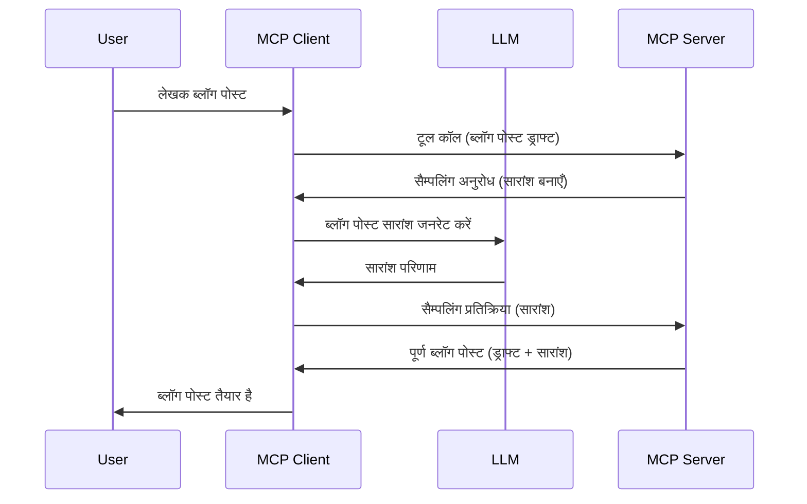

> [अप्रचलित: 2026-07-28 रिलीज़ उम्मीदवार](https://blog.modelcontextprotocol.io/posts/2026-07-28-release-candidate/)

# सैम्पलिंग - क्लाइंट को फीचर्स सौंपना

> **अप्रचलन सूचना:** `2026-07-28` MCP स्पेसिफिकेशन रिलीज़ उम्मीदवार सैम्पलिंग को अप्रचलित घोषित करता है ताकि LLM प्रोवाइडर API के साथ सीधे एकीकरण को प्राथमिकता दी जा सके। सैम्पलिंग `2025-11-25` में और औपचारिक अप्रचलन के कम से कम एक साल बाद भी काम करता रहेगा, इसलिए इस पाठ में सब कुछ मान्य रहता है — लेकिन नए सर्वर डिजाइनों को प्रतिस्थापन पैटर्न का मूल्यांकन करना चाहिए। देखें [MCP में क्या बदल रहा है: 2026-07-28 रिलीज़ उम्मीदवार](../../01-CoreConcepts/mcp-2026-07-28-release-candidate.md)।

कभी-कभी, आपको MCP क्लाइंट और MCP सर्वर को एक सामान्य लक्ष्य प्राप्त करने के लिए सहयोग करना होता है। ऐसा हो सकता है कि सर्वर को उस LLM की मदद चाहिए जो क्लाइंट पर स्थित है। ऐसी स्थिति के लिए, सैम्पलिंग का उपयोग करना चाहिए।

आइए कुछ उपयोग मामलों का पता लगाएं और सैम्पलिंग शामिल एक समाधान कैसे बनाएं यह देखें।

## अवलोकन

इस पाठ में, हम समझाते हैं कि सैम्पलिंग कब और कहाँ उपयोग करनी है और इसे कैसे कॉन्फ़िगर करना है।

## सीखने के उद्देश्य

इस अध्याय में हम:

- समझाएंगे कि सैम्पलिंग क्या है और इसे कब उपयोग करना है।
- दिखाएंगे कि MCP में सैम्पलिंग को कैसे कॉन्फ़िगर करें।
- सैम्पलिंग के उदाहरण देंगे।

## सैम्पलिंग क्या है और क्यों उपयोग करें?

सैम्पलिंग एक उन्नत फीचर है जो निम्न तरीके से काम करता है:



### सैम्पलिंग अनुरोध

ठीक है, अब हमारे पास एक भरोसेमंद परिदृश्य का उच्च स्तरीय परिदृश्य है, चलिए बात करते हैं उस सैम्पलिंग अनुरोध की जो सर्वर क्लाइंट को वापस भेजता है। JSON-RPC फॉर्मेट में ऐसा अनुरोध इस प्रकार दिख सकता है:

```json
{
  "jsonrpc": "2.0",
  "id": 1,
  "method": "sampling/createMessage",
  "params": {
    "messages": [
      {
        "role": "user",
        "content": {
          "type": "text",
          "text": "Create a blog post summary of the following blog post: <BLOG POST>"
        }
      }
    ],
    "modelPreferences": {
      "hints": [
        {
          "name": "claude-3-sonnet"
        }
      ],
      "intelligencePriority": 0.8,
      "speedPriority": 0.5
    },
    "systemPrompt": "You are a helpful assistant.",
    "maxTokens": 100
  }
}
```

यहां कुछ बातें ध्यान देने योग्य हैं:

- कंटेंट -> टेक्स्ट के अंतर्गत प्रॉम्प्ट, हमारा वह प्रॉम्प्ट है जो LLM को ब्लॉग पोस्ट सामग्री का सारांश बनाने का निर्देश देता है।

- **modelPreferences**. यह खंड बस एक प्राथमिकता है, LLM के साथ कौन सी कॉन्फ़िगरेशन उपयोग करनी चाहिए इसके लिए एक सिफारिश। उपयोगकर्ता तय कर सकता है कि वे इन सिफारिशों के साथ जाएं या उनमें बदलाव करें। इस मामले में मॉडल, गति और बुद्धिमत्ता प्राथमिकता पर सिफारिशें हैं।
- **systemPrompt**, यह आपका सामान्य सिस्टम प्रॉम्प्ट है जो आपके LLM को एक व्यक्तित्व देता है और मार्गदर्शन निर्देश शामिल करता है।
- **maxTokens**, यह एक अन्य गुण है जो बताता है कि इस कार्य के लिए कितने टोकन उपयोग करने की सिफारिश है।

### सैम्पलिंग प्रतिक्रिया

यह प्रतिक्रिया है जो MCP क्लाइंट अंततः MCP सर्वर को भेजता है और यह क्लाइंट द्वारा LLM को कॉल करने, उस प्रतिक्रिया का इंतजार करने, और फिर इस संदेश का निर्माण करने का परिणाम होती है। JSON-RPC में यह कुछ इस तरह दिख सकती है:

```json
{
  "jsonrpc": "2.0",
  "id": 1,
  "result": {
    "role": "assistant",
    "content": {
      "type": "text",
      "text": "Here's your abstract <ABSTRACT>"
    },
    "model": "gpt-5",
    "stopReason": "endTurn"
  }
}
```

ध्यान दें कि प्रतिक्रिया ब्लॉग पोस्ट का सारांश है जैसा हमने माँगा था। साथ ही ध्यान दें कि उपयोग किया गया `model` वह नहीं है जो हमने माँगा था बल्कि "gpt-5" "claude-3-sonnet" के ऊपर है। यह यह दिखाने के लिए है कि उपयोगकर्ता यह तय कर सकता है कि क्या उपयोग करना है और आपका सैम्पलिंग अनुरोध केवल एक सिफारिश है।

ठीक है, अब जब हम मुख्य प्रवाह और इसे उपयोग करने वाले उपयोगी कार्य "ब्लॉग पोस्ट निर्माण + सारांश" को समझ चुके हैं, तो आइए देखें कि इसे काम करने के लिए हमें क्या करना होगा।

### संदेश प्रकार

सैम्पलिंग संदेश केवल टेक्स्ट तक सीमित नहीं हैं, बल्कि आप छवियां और ऑडियो भी भेज सकते हैं। JSON-RPC इस प्रकार भिन्न दिखेगा:

**टेक्स्ट**

```json
{
  "type": "text",
  "text": "The message content"
}
```

**छवि सामग्री**

```json
{
  "type": "image",
  "data": "base64-encoded-image-data",
  "mimeType": "image/jpeg"
}
```

**ऑडियो सामग्री**

```json
{
  "type": "audio",
  "data": "base64-encoded-audio-data",
  "mimeType": "audio/wav"
}
```

> नोट: सैम्पलिंग पर अधिक विस्तृत जानकारी के लिए, [आधिकारिक दस्तावेज़](https://modelcontextprotocol.io/specification/2025-11-25/client/sampling) देखें

## क्लाइंट में सैम्पलिंग कैसे कॉन्फ़िगर करें

> नोट: यदि आप केवल एक सर्वर बना रहे हैं, तो यहाँ ज्यादा कुछ करने की आवश्यकता नहीं है।

एक क्लाइंट में, आपको निम्नलिखित फीचर इस तरह निर्दिष्ट करना होगा:

```json
{
  "capabilities": {
    "sampling": {}
  }
}
```

इसे तब आपके चुने हुए क्लाइंट द्वारा सर्वर के साथ इनिशियलाइज़ेशन के समय उठाया जाएगा।

## सैम्पलिंग के क्रियान्वयन का उदाहरण - ब्लॉग पोस्ट बनाएं

चलिए साथ में एक सैम्पलिंग सर्वर कोड करते हैं, हमें निम्नलिखित करना होगा:

1. सर्वर पर एक टूल बनाएं।
1. यह टूल एक सैम्पलिंग अनुरोध बनाए।
1. टूल को क्लाइंट के सैम्पलिंग अनुरोध के उत्तर का इंतजार करना चाहिए।
1. फिर टूल का परिणाम उत्पन्न होना चाहिए।

चलिए कोड को चरण दर चरण देखें:

### -1- टूल बनाएं

**python**

```python
@mcp.tool()
async def create_blog(title: str, content: str, ctx: Context[ServerSession, None]) -> str:
    """Create a blog post and generate a summary"""

```

### -2- सैम्पलिंग अनुरोध बनाएं

अपने टूल का विस्तार निम्न कोड से करें:

**python**

```python
post = BlogPost(
        id=len(posts) + 1,
        title=title,
        content=content,
        abstract=""
    )

prompt = f"Create an abstract of the following blog post: title: {title} and draft: {content} "

result = await ctx.session.create_message(
        messages=[
            SamplingMessage(
                role="user",
                content=TextContent(type="text", text=prompt),
            )
        ],
        max_tokens=100,
)

```

### -3- प्रतिक्रिया का इंतजार करें और प्रतिक्रिया लौटाएं

**python**

```python
post.abstract = result.content.text

posts.append(post)

# पूरी उत्पाद लौटाएं
return json.dumps({
    "id": post.title,
    "abstract": post.abstract
})
```

### -4- पूरा कोड

**python**

```python
from starlette.applications import Starlette
from starlette.routing import Mount, Host

from mcp.server.fastmcp import Context, FastMCP

from mcp.server.session import ServerSession
from mcp.types import SamplingMessage, TextContent

import json


from uuid import uuid4
from typing import List
from pydantic import BaseModel


mcp = FastMCP("Blog post generator")

# app = FastAPI()

posts = []

class BlogPost(BaseModel):
    id: int
    title: str
    content: str
    abstract: str

posts: List[BlogPost] = []

@mcp.tool()
async def create_blog(title: str, content: str, ctx: Context[ServerSession, None]) -> str:
    """Create a blog post and generate a summary"""

    post = BlogPost(
        id=len(posts) + 1,
        title=title,
        content=content,
        abstract=""
    )

    prompt = f"Create an abstract of the following blog post: title: {title} and draft: {content} "

    result = await ctx.session.create_message(
        messages=[
            SamplingMessage(
                role="user",
                content=TextContent(type="text", text=prompt),
            )
        ],
        max_tokens=100,
    )

    post.abstract = result.content.text

    posts.append(post)

    # पूरा ब्लॉग पोस्ट लौटाएं
    return json.dumps({
        "id": post.title,
        "abstract": post.abstract
    })

if __name__ == "__main__":
    print("Starting server...")
    # mcp.run()
    mcp.run(transport="streamable-http")

# ऐप चलाने के लिए: python server.py
```

### -5- इसे विजुअल स्टूडियो कोड में टेस्ट करना

इसे विजुअल स्टूडियो कोड में टेस्ट करने के लिए, निम्न करें:

1. टर्मिनल में सर्वर शुरू करें
1. इसे *mcp.json* में जोड़ें (और सुनिश्चित करें कि यह शुरू हो) उदाहरण के लिए इस तरह:

   ```json
   "servers": {
      "blog-server": {
        "type": "http",
        "url": "http://localhost:8000/mcp"
      }
   }
   ```

1. एक प्रॉम्प्ट टाइप करें:

   ```text
   create a blog post named "Where Python comes from", the content is "Python is actually named after Monty Python Flying Circus"
   ```

1. सैम्पलिंग को होने दें। पहली बार जब आप यह टेस्ट करते हैं, तो आपको एक अतिरिक्त डायलॉग प्रस्तुत किया जाएगा जिसे आपको स्वीकार करना होगा, फिर आपको टूल चलाने के लिए सामान्य डायलॉग दिखाई देगा।

1. परिणामों का निरीक्षण करें। आपको GitHub Copilot Chat में अच्छे से प्रस्तुत परिणाम दिखेंगे और आप कच्चे JSON प्रतिक्रिया का भी निरीक्षण कर सकते हैं।

**बोनस**. विजुअल स्टूडियो कोड टूलिंग में सैम्पलिंग के लिए शानदार समर्थन है। आप इंस्टॉल्ड सर्वर पर सैम्पलिंग एक्सेस इस प्रकार कॉन्फ़िगर कर सकते हैं:

1. एक्सटेंशन सेक्शन पर जाएं।
1. "MCP SERVERS - INSTALLED" सेक्शन में अपने इंस्टॉल्ड सर्वर के लिए कॉग आइकन चुनें।
1 "Configure Model Access" चुनें, यहाँ आप चुन सकते हैं कि GitHub Copilot सैम्पलिंग करते समय किन मॉडलों का उपयोग कर सकता है। आप हाल ही में हुई सभी सैम्पलिंग अनुरोधों को "Show Sampling requests" चुनकर देख सकते हैं।

## असाइनमेंट

इस असाइनमेंट में, आप थोड़ा अलग सैम्पलिंग बनाएंगे, अर्थात एक सैम्पलिंग एकीकरण जो उत्पाद विवरण उत्पन्न करने का समर्थन करता है। आपकी स्थिति इस प्रकार है:

**परिदृश्य**: एक ई-कॉमर्स के बैक ऑफिस कर्मचारी को मदद चाहिए, उत्पाद विवरण बनाने में बहुत समय लगता है। इसलिए, आपको एक समाधान बनाना है जहाँ आप "create_product" नाम का टूल कॉल कर सकते हैं जिसमें "title" और "keywords" तर्क के रूप में हों, और यह एक पूर्ण उत्पाद उत्पन्न करे जिसमें "description" फ़ील्ड भी हो जो क्लाइंट के LLM द्वारा भरा जाए।

टिप: पहले सीखे गए ज्ञान का उपयोग करें इस सर्वर और इसके टूल का निर्माण करने के लिए एक सैम्पलिंग अनुरोध का उपयोग करते हुए।

## समाधान

[समाधान](./solution/README.md)

## मुख्य निष्कर्ष

सैम्पलिंग एक शक्तिशाली फीचर है जो सर्वर को तब क्लाइंट को कार्य सौंपने की अनुमति देता है जब उसे LLM की मदद की जरूरत हो।

## आगे क्या है

- [अध्याय 4 - व्यावहारिक कार्यान्वयन](../../04-PracticalImplementation/README.md)

---

<!-- CO-OP TRANSLATOR DISCLAIMER START -->
**अस्वीकरण**:
इस दस्तावेज़ का अनुवाद AI अनुवाद सेवा [Co-op Translator](https://github.com/Azure/co-op-translator) का उपयोग करके किया गया है। जबकि हम सटीकता के लिए प्रयास करते हैं, कृपया ध्यान दें कि स्वचालित अनुवादों में त्रुटियाँ या अशुद्धियाँ हो सकती हैं। मूल दस्तावेज़ अपनी मूल भाषा में ही प्रामाणिक स्रोत माना जाना चाहिए। महत्वपूर्ण जानकारी के लिए, पेशेवर मानव अनुवाद की सिफारिश की जाती है। इस अनुवाद के उपयोग से उत्पन्न किसी भी गलतफहमी या गलत व्याख्या के लिए हम उत्तरदायी नहीं हैं।
<!-- CO-OP TRANSLATOR DISCLAIMER END -->