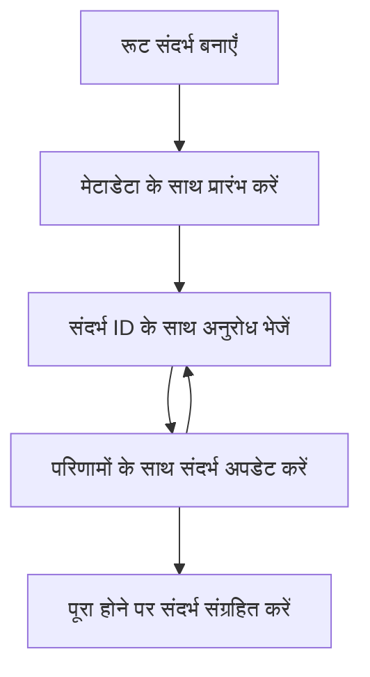

> [अप्रचलित: 2026-07-28 रिलीज़ कैंडिडेट](https://blog.modelcontextprotocol.io/posts/2026-07-28-release-candidate/#roots-sampling-and-logging-are-deprecated)

# MCP रूट संदर्भ

> **अप्रचलन सूचना:** `2026-07-28` MCP विशेषता रिलीज़ कैंडिडेट रूट्स को टूल पैरामीटर, संसाधन URI, या सर्वर कॉन्फ़िगरेशन के पक्ष में अप्रचलित घोषित करता है। रूट्स `2025-11-25` में और किसी भी औपचारिक अप्रचलन के कम से कम एक साल बाद तक काम करते रहेंगे, इसलिए इस पाठ में सब कुछ मान्य रहता है - लेकिन नए सर्वर डिज़ाइनों को प्रतिस्थापन पैटर्न का मूल्यांकन करना चाहिए। देखें [MCP में क्या बदल रहा है: 2026-07-28 रिलीज़ कैंडिडेट](../../01-CoreConcepts/mcp-2026-07-28-release-candidate.md).

रूट संदर्भ मॉडल संदर्भ प्रोटोकॉल में एक मौलिक अवधारणा हैं जो कई अनुरोधों और सत्रों में बातचीत इतिहास और साझा स्थिति बनाए रखने के लिए एक स्थायी परत प्रदान करते हैं।

## परिचय

इस पाठ में, हम MCP में रूट संदर्भ कैसे बनाएं, प्रबंधित करें, और उपयोग करें, इसका अन्वेषण करेंगे।

## सीखने के उद्देश्य

इस पाठ के अंत तक, आप सक्षम होंगे:

- रूट संदर्भों का उद्देश्य और संरचना समझना
- MCP क्लाइंट लाइब्रेरीज़ का उपयोग करके रूट संदर्भ बनाना और प्रबंधित करना
- .NET, Java, JavaScript, और Python अनुप्रयोगों में रूट संदर्भ लागू करना
- मल्टी-टर्न बातचीत और स्थिति प्रबंधन के लिए रूट संदर्भ का उपयोग करना
- रूट संदर्भ प्रबंधन के लिए बेहतरीन प्रथाओं को लागू करना

## रूट संदर्भों को समझना

रूट संदर्भ ऐसे कंटेनर के रूप में कार्य करते हैं जो संबंधित इंटरैक्शनों की एक श्रृंखला के लिए इतिहास और स्थिति को धारण करते हैं। वे सक्षम करते हैं:

- **बातचीत की स्थिरता**: सुसंगत मल्टी-टर्न वार्तालाप बनाए रखना
- **मेमोरी प्रबंधन**: इंटरैक्शनों के बीच जानकारी संग्रहीत और पुनः प्राप्त करना
- **स्थिति प्रबंधन**: जटिल कार्यप्रवाह में प्रगति को ट्रैक करना
- **संदर्भ साझा करना**: कई क्लाइंट्स को एक ही बातचीत स्थिति तक पहुंचने की अनुमति देना

MCP में, रूट संदर्भों के ये मुख्य लक्षण होते हैं:

- प्रत्येक रूट संदर्भ की एक अद्वितीय पहचान होती है।
- वे बातचीत का इतिहास, उपयोगकर्ता वरीयताएँ, और अन्य मेटाडेटा रख सकते हैं।
- इन्हें आवश्यकतानुसार बनाया, एक्सेस किया, और संग्रहित किया जा सकता है।
- वे सूक्ष्म पहुँच नियंत्रण और अनुमतियों का समर्थन करते हैं।

## रूट संदर्भ जीवनचक्र



## रूट संदर्भों के साथ काम करना

यहाँ बताया गया है कि कैसे रूट संदर्भ बनाएं और प्रबंधित करें।

### C# कार्यान्वयन

```csharp
// .NET Example: Root Context Management
using Microsoft.Mcp.Client;
using System;
using System.Threading.Tasks;
using System.Collections.Generic;

public class RootContextExample
{
    private readonly IMcpClient _client;
    private readonly IRootContextManager _contextManager;
    
    public RootContextExample(IMcpClient client, IRootContextManager contextManager)
    {
        _client = client;
        _contextManager = contextManager;
    }
    
    public async Task DemonstrateRootContextAsync()
    {
        // 1. Create a new root context
        var contextResult = await _contextManager.CreateRootContextAsync(new RootContextCreateOptions
        {
            Name = "Customer Support Session",
            Metadata = new Dictionary<string, string>
            {
                ["CustomerName"] = "Acme Corporation",
                ["PriorityLevel"] = "High",
                ["Domain"] = "Cloud Services"
            }
        });
        
        string contextId = contextResult.ContextId;
        Console.WriteLine($"Created root context with ID: {contextId}");
        
        // 2. First interaction using the context
        var response1 = await _client.SendPromptAsync(
            "I'm having issues scaling my web service deployment in the cloud.", 
            new SendPromptOptions { RootContextId = contextId }
        );
        
        Console.WriteLine($"First response: {response1.GeneratedText}");
        
        // Second interaction - the model will have access to the previous conversation
        var response2 = await _client.SendPromptAsync(
            "Yes, we're using containerized deployments with Kubernetes.", 
            new SendPromptOptions { RootContextId = contextId }
        );
        
        Console.WriteLine($"Second response: {response2.GeneratedText}");
        
        // 3. Add metadata to the context based on conversation
        await _contextManager.UpdateContextMetadataAsync(contextId, new Dictionary<string, string>
        {
            ["TechnicalEnvironment"] = "Kubernetes",
            ["IssueType"] = "Scaling"
        });
        
        // 4. Get context information
        var contextInfo = await _contextManager.GetRootContextInfoAsync(contextId);
        
        Console.WriteLine("Context Information:");
        Console.WriteLine($"- Name: {contextInfo.Name}");
        Console.WriteLine($"- Created: {contextInfo.CreatedAt}");
        Console.WriteLine($"- Messages: {contextInfo.MessageCount}");
        
        // 5. When the conversation is complete, archive the context
        await _contextManager.ArchiveRootContextAsync(contextId);
        Console.WriteLine($"Archived context {contextId}");
    }
}
```

ऊपर दिए गए कोड में हमने:

1. ग्राहक सहायता सत्र के लिए एक रूट संदर्भ बनाया।
1. उस संदर्भ के भीतर कई संदेश भेजे, जिससे मॉडल स्थिति बनाए रख सके।
1. बातचीत के आधार पर प्रासंगिक मेटाडेटा के साथ संदर्भ को अपडेट किया।
1. बातचीत के इतिहास को समझने के लिए संदर्भ जानकारी प्राप्त की।
1. बातचीत पूरी होने पर संदर्भ को संग्रहित किया।

## उदाहरण: वित्तीय विश्लेषण के लिए रूट संदर्भ कार्यान्वयन

इस उदाहरण में, हम एक वित्तीय विश्लेषण सत्र के लिए एक रूट संदर्भ बनाएंगे, जो दिखाएगा कि कैसे कई इंटरैक्शनों में स्थिति बनाए रखी जाए।

### Java कार्यान्वयन

```java
// जावा उदाहरण: रूट संदर्भ कार्यान्वयन
package com.example.mcp.contexts;

import com.mcp.client.McpClient;
import com.mcp.client.ContextManager;
import com.mcp.models.RootContext;
import com.mcp.models.McpResponse;

import java.util.HashMap;
import java.util.Map;
import java.util.UUID;

public class RootContextsDemo {
    private final McpClient client;
    private final ContextManager contextManager;
    
    public RootContextsDemo(String serverUrl) {
        this.client = new McpClient.Builder()
            .setServerUrl(serverUrl)
            .build();
            
        this.contextManager = new ContextManager(client);
    }
    
    public void demonstrateRootContext() throws Exception {
        // संदर्भ मेटाडेटा बनाएं
        Map<String, String> metadata = new HashMap<>();
        metadata.put("projectName", "Financial Analysis");
        metadata.put("userRole", "Financial Analyst");
        metadata.put("dataSource", "Q1 2025 Financial Reports");
        
        // 1. एक नया रूट संदर्भ बनाएं
        RootContext context = contextManager.createRootContext("Financial Analysis Session", metadata);
        String contextId = context.getId();
        
        System.out.println("Created context: " + contextId);
        
        // 2. पहला इंटरैक्शन
        McpResponse response1 = client.sendPrompt(
            "Analyze the trends in Q1 financial data for our technology division",
            contextId
        );
        
        System.out.println("First response: " + response1.getGeneratedText());
        
        // 3. प्रतिक्रिया से प्राप्त महत्वपूर्ण जानकारी के साथ संदर्भ अपडेट करें
        contextManager.addContextMetadata(contextId, 
            Map.of("identifiedTrend", "Increasing cloud infrastructure costs"));
        
        // दूसरा इंटरैक्शन - समान संदर्भ का उपयोग करते हुए
        McpResponse response2 = client.sendPrompt(
            "What's driving the increase in cloud infrastructure costs?",
            contextId
        );
        
        System.out.println("Second response: " + response2.getGeneratedText());
        
        // 4. विश्लेषण सत्र का सारांश बनाएं
        McpResponse summaryResponse = client.sendPrompt(
            "Summarize our analysis of the technology division financials in 3-5 key points",
            contextId
        );
        
        // सारांश को संदर्भ मेटाडेटा में स्टोर करें
        contextManager.addContextMetadata(contextId, 
            Map.of("analysisSummary", summaryResponse.getGeneratedText()));
            
        // अपडेटेड संदर्भ जानकारी प्राप्त करें
        RootContext updatedContext = contextManager.getRootContext(contextId);
        
        System.out.println("Context Information:");
        System.out.println("- Created: " + updatedContext.getCreatedAt());
        System.out.println("- Last Updated: " + updatedContext.getLastUpdatedAt());
        System.out.println("- Analysis Summary: " + 
            updatedContext.getMetadata().get("analysisSummary"));
            
        // 5. काम पूरा होने पर संदर्भ को संग्रहित करें
        contextManager.archiveContext(contextId);
        System.out.println("Context archived");
    }
}
```

ऊपर दिए गए कोड में हमने:

1. वित्तीय विश्लेषण सत्र के लिए एक रूट संदर्भ बनाया।
2. उस संदर्भ के भीतर कई संदेश भेजे, जिससे मॉडल स्थिति बनाए रख सके।
3. बातचीत के आधार पर प्रासंगिक मेटाडेटा के साथ संदर्भ को अपडेट किया।
4. विश्लेषण सत्र का सारांश उत्पन्न किया और उसे संदर्भ मेटाडेटा में संग्रहीत किया।
5. बातचीत पूरी होने पर संदर्भ को संग्रहित किया।

## उदाहरण: रूट संदर्भ प्रबंधन

बातचीत इतिहास और स्थिति बनाए रखने के लिए प्रभावी ढंग से रूट संदर्भों का प्रबंधन आवश्यक है। नीचे रूट संदर्भ प्रबंधन को लागू करने का एक उदाहरण है।

### JavaScript कार्यान्वयन

```javascript
// JavaScript उदाहरण: MCP रूट संदर्भ प्रबंधित करना
const { McpClient, RootContextManager } = require('@mcp/client');

class ContextSession {
  constructor(serverUrl, apiKey = null) {
    // MCP क्लाइंट को प्रारंभ करें
    this.client = new McpClient({
      serverUrl,
      apiKey
    });
    
    // संदर्भ प्रबंधक को प्रारंभ करें
    this.contextManager = new RootContextManager(this.client);
  }
  
  /**
   * Create a new conversation context
   * @param {string} sessionName - Name of the conversation session
   * @param {Object} metadata - Additional metadata for the context
   * @returns {Promise<string>} - Context ID
   */
  async createConversationContext(sessionName, metadata = {}) {
    try {
      const contextResult = await this.contextManager.createRootContext({
        name: sessionName,
        metadata: {
          ...metadata,
          createdAt: new Date().toISOString(),
          status: 'active'
        }
      });
      
      console.log(`Created root context '${sessionName}' with ID: ${contextResult.id}`);
      return contextResult.id;
    } catch (error) {
      console.error('Error creating root context:', error);
      throw error;
    }
  }
  
  /**
   * Send a message in an existing context
   * @param {string} contextId - The root context ID
   * @param {string} message - The user's message
   * @param {Object} options - Additional options
   * @returns {Promise<Object>} - Response data
   */
  async sendMessage(contextId, message, options = {}) {
    try {
      // निर्दिष्ट संदर्भ का उपयोग करके संदेश भेजें
      const response = await this.client.sendPrompt(message, {
        rootContextId: contextId,
        temperature: options.temperature || 0.7,
        allowedTools: options.allowedTools || []
      });
      
      // वैकल्पिक रूप से बातचीत से महत्वपूर्ण अंतर्दृष्टि संग्रहीत करें
      if (options.storeInsights) {
        await this.storeConversationInsights(contextId, message, response.generatedText);
      }
      
      return {
        message: response.generatedText,
        toolCalls: response.toolCalls || [],
        contextId
      };
    } catch (error) {
      console.error(`Error sending message in context ${contextId}:`, error);
      throw error;
    }
  }
  
  /**
   * Store important insights from a conversation
   * @param {string} contextId - The root context ID
   * @param {string} userMessage - User's message
   * @param {string} aiResponse - AI's response
   */
  async storeConversationInsights(contextId, userMessage, aiResponse) {
    try {
      // संभावित अंतर्दृष्टि निकालें (वास्तविक ऐप में यह और अधिक परिष्कृत होगा)
      const combinedText = userMessage + "\n" + aiResponse;
      
      // संभावित अंतर्दृष्टि पहचानने के लिए सरल हीयूरिस्टिक
      const insightWords = ["important", "key point", "remember", "significant", "crucial"];
      
      const potentialInsights = combinedText
        .split(".")
        .filter(sentence => 
          insightWords.some(word => sentence.toLowerCase().includes(word))
        )
        .map(sentence => sentence.trim())
        .filter(sentence => sentence.length > 10);
      
      // संदर्भ मेटाडेटा में अंतर्दृष्टि संग्रहीत करें
      if (potentialInsights.length > 0) {
        const insights = {};
        potentialInsights.forEach((insight, index) => {
          insights[`insight_${Date.now()}_${index}`] = insight;
        });
        
        await this.contextManager.updateContextMetadata(contextId, insights);
        console.log(`Stored ${potentialInsights.length} insights in context ${contextId}`);
      }
    } catch (error) {
      console.warn('Error storing conversation insights:', error);
      // गैर-गंभीर त्रुटि, इसलिए केवल चेतावनी लॉग करें
    }
  }
  
  /**
   * Get summary information about a context
   * @param {string} contextId - The root context ID
   * @returns {Promise<Object>} - Context information
   */
  async getContextInfo(contextId) {
    try {
      const contextInfo = await this.contextManager.getContextInfo(contextId);
      
      return {
        id: contextInfo.id,
        name: contextInfo.name,
        created: new Date(contextInfo.createdAt).toLocaleString(),
        lastUpdated: new Date(contextInfo.lastUpdatedAt).toLocaleString(),
        messageCount: contextInfo.messageCount,
        metadata: contextInfo.metadata,
        status: contextInfo.status
      };
    } catch (error) {
      console.error(`Error getting context info for ${contextId}:`, error);
      throw error;
    }
  }
  
  /**
   * Generate a summary of the conversation in a context
   * @param {string} contextId - The root context ID
   * @returns {Promise<string>} - Generated summary
   */
  async generateContextSummary(contextId) {
    try {
      // अब तक की बातचीत का सारांश बनाने के लिए मॉडल से पूछें
      const response = await this.client.sendPrompt(
        "Please summarize our conversation so far in 3-4 sentences, highlighting the main points discussed.",
        { rootContextId: contextId, temperature: 0.3 }
      );
      
      // संदर्भ मेटाडेटा में सारांश संग्रहीत करें
      await this.contextManager.updateContextMetadata(contextId, {
        conversationSummary: response.generatedText,
        summarizedAt: new Date().toISOString()
      });
      
      return response.generatedText;
    } catch (error) {
      console.error(`Error generating context summary for ${contextId}:`, error);
      throw error;
    }
  }
  
  /**
   * Archive a context when it's no longer needed
   * @param {string} contextId - The root context ID
   * @returns {Promise<Object>} - Result of the archive operation
   */
  async archiveContext(contextId) {
    try {
      // संग्रहण से पहले अंतिम सारांश बनाएँ
      const summary = await this.generateContextSummary(contextId);
      
      // संदर्भ को संग्रहित करें
      await this.contextManager.archiveContext(contextId);
      
      return {
        status: "archived",
        contextId,
        summary
      };
    } catch (error) {
      console.error(`Error archiving context ${contextId}:`, error);
      throw error;
    }
  }
}

// उदाहरण उपयोग
async function demonstrateContextSession() {
  const session = new ContextSession('https://mcp-server-example.com');
  
  try {
    // 1. उत्पाद सहायता बातचीत के लिए नया संदर्भ बनाएं
    const contextId = await session.createConversationContext(
      'Product Support - Database Performance',
      {
        customer: 'Globex Corporation',
        product: 'Enterprise Database',
        severity: 'Medium',
        supportAgent: 'AI Assistant'
      }
    );
    
    // 2. बातचीत में पहला संदेश
    const response1 = await session.sendMessage(
      contextId,
      "I'm experiencing slow query performance on our database cluster after the latest update.",
      { storeInsights: true }
    );
    console.log('Response 1:', response1.message);
    
    // उसी संदर्भ में अनुसरण संदेश
    const response2 = await session.sendMessage(
      contextId,
      "Yes, we've already checked the indexes and they seem to be properly configured.",
      { storeInsights: true }
    );
    console.log('Response 2:', response2.message);
    
    // 3. संदर्भ के बारे में जानकारी प्राप्त करें
    const contextInfo = await session.getContextInfo(contextId);
    console.log('Context Information:', contextInfo);
    
    // 4. बातचीत सारांश उत्पन्न करें और प्रदर्शित करें
    const summary = await session.generateContextSummary(contextId);
    console.log('Conversation Summary:', summary);
    
    // 5. कार्य पूरा होने पर संदर्भ संग्रहित करें
    const archiveResult = await session.archiveContext(contextId);
    console.log('Archive Result:', archiveResult);
    
    // 6. किसी भी त्रुटि को सहजता से संभालें
  } catch (error) {
    console.error('Error in context session demonstration:', error);
  }
}

demonstrateContextSession();
```

ऊपर दिए गए कोड में हमने:

1. फ़ंक्शन `createConversationContext` के साथ उत्पाद सहायता बातचीत के लिए एक रूट संदर्भ बनाया। इस मामले में संदर्भ डेटाबेस प्रदर्शन मुद्दों के बारे में है।

1. फ़ंक्शन `sendMessage` के साथ उस संदर्भ के भीतर कई संदेश भेजे। भेजे जा रहे संदेश धीमी क्वेरी प्रदर्शन और इंडेक्स कॉन्फ़िगरेशन के बारे में हैं।

1. बातचीत के आधार पर प्रासंगिक मेटाडेटा के साथ संदर्भ को अपडेट किया।

1. फ़ंक्शन `generateContextSummary` के साथ बातचीत का सारांश उत्पन्न किया और संदर्भ मेटाडेटा में संग्रहीत किया।

1. फ़ंक्शन `archiveContext` के साथ बातचीत पूरी होने पर संदर्भ को संग्रहित किया।

1. मजबूती सुनिश्चित करने के लिए त्रुटियों को सहजता से संभाला।

## मल्टी-टर्न सहायता के लिए रूट संदर्भ

इस उदाहरण में, हम मल्टी-टर्न सहायता सत्र के लिए एक रूट संदर्भ बनाएंगे, जो दिखाएगा कि कैसे कई इंटरैक्शनों में स्थिति बनाए रखी जाए।

### Python कार्यान्वयन

```python
# Python उदाहरण: मल्टी-टर्न सहायता के लिए रूट संदर्भ
import asyncio
from datetime import datetime
from mcp_client import McpClient, RootContextManager

class AssistantSession:
    def __init__(self, server_url, api_key=None):
        self.client = McpClient(server_url=server_url, api_key=api_key)
        self.context_manager = RootContextManager(self.client)
    
    async def create_session(self, name, user_info=None):
        """Create a new root context for an assistant session"""
        metadata = {
            "session_type": "assistant",
            "created_at": datetime.now().isoformat(),
        }
        
        # यदि प्रदान किया गया हो तो उपयोगकर्ता जानकारी जोड़ें
        if user_info:
            metadata.update({f"user_{k}": v for k, v in user_info.items()})
            
        # रूट संदर्भ बनाएँ
        context = await self.context_manager.create_root_context(name, metadata)
        return context.id
    
    async def send_message(self, context_id, message, tools=None):
        """Send a message within a root context"""
        # संदर्भ आईडी के साथ विकल्प बनाएं
        options = {
            "root_context_id": context_id
        }
        
        # यदि निर्दिष्ट हो तो उपकरण जोड़ें
        if tools:
            options["allowed_tools"] = tools
        
        # संदर्भ के भीतर प्रॉम्प्ट भेजें
        response = await self.client.send_prompt(message, options)
        
        # बातचीत की प्रगति के साथ संदर्भ मेटाडेटा अपडेट करें
        await self.context_manager.update_context_metadata(
            context_id,
            {
                f"message_{datetime.now().timestamp()}": message[:50] + "...",
                "last_interaction": datetime.now().isoformat()
            }
        )
        
        return response
    
    async def get_conversation_history(self, context_id):
        """Retrieve conversation history from a context"""
        context_info = await self.context_manager.get_context_info(context_id)
        messages = await self.client.get_context_messages(context_id)
        
        return {
            "context_info": context_info,
            "messages": messages
        }
    
    async def end_session(self, context_id):
        """End an assistant session by archiving the context"""
        # पहले एक सारांश प्रॉम्प्ट बनाएं
        summary_response = await self.client.send_prompt(
            "Please summarize our conversation and any key points or decisions made.",
            {"root_context_id": context_id}
        )
        
        # मेटाडेटा में सारांश संग्रहीत करें
        await self.context_manager.update_context_metadata(
            context_id,
            {
                "summary": summary_response.generated_text,
                "ended_at": datetime.now().isoformat(),
                "status": "completed"
            }
        )
        
        # संदर्भ का अभिलेख
        await self.context_manager.archive_context(context_id)
        
        return {
            "status": "completed",
            "summary": summary_response.generated_text
        }

# उदाहरण उपयोग
async def demo_assistant_session():
    assistant = AssistantSession("https://mcp-server-example.com")
    
    # 1. सत्र बनाएं
    context_id = await assistant.create_session(
        "Technical Support Session",
        {"name": "Alex", "technical_level": "advanced", "product": "Cloud Services"}
    )
    print(f"Created session with context ID: {context_id}")
    
    # 2. पहली बातचीत
    response1 = await assistant.send_message(
        context_id, 
        "I'm having trouble with the auto-scaling feature in your cloud platform.",
        ["documentation_search", "diagnostic_tool"]
    )
    print(f"Response 1: {response1.generated_text}")
    
    # उसी संदर्भ में दूसरी बातचीत
    response2 = await assistant.send_message(
        context_id,
        "Yes, I've already checked the configuration settings you mentioned, but it's still not working."
    )
    print(f"Response 2: {response2.generated_text}")
    
    # 3. इतिहास प्राप्त करें
    history = await assistant.get_conversation_history(context_id)
    print(f"Session has {len(history['messages'])} messages")
    
    # 4. सत्र समाप्त करें
    end_result = await assistant.end_session(context_id)
    print(f"Session ended with summary: {end_result['summary']}")

if __name__ == "__main__":
    asyncio.run(demo_assistant_session())
```

ऊपर दिए गए कोड में हमने:

1. फ़ंक्शन `create_session` के साथ एक तकनीकी समर्थन सत्र के लिए एक रूट संदर्भ बनाया। संदर्भ में उपयोगकर्ता जानकारी जैसे नाम और तकनीकी स्तर शामिल हैं।

1. फ़ंक्शन `send_message` के साथ उस संदर्भ के भीतर कई संदेश भेजे। भेजे जा रहे संदेश ऑटो-स्केलिंग फीचर की समस्याओं के बारे में हैं।

1. फ़ंक्शन `get_conversation_history` का उपयोग करके बातचीत इतिहास प्राप्त किया, जो संदर्भ जानकारी और संदेश प्रदान करता है।

1. फ़ंक्शन `end_session` के साथ संदर्भ को संग्रहित कर और सारांश उत्पन्न करके सत्र समाप्त किया। सारांश बातचीत के मुख्य बिंदुओं को कैप्चर करता है।

## रूट संदर्भ बेहतरीन प्रथाएँ

यहाँ रूट संदर्भों का प्रभावी प्रबंधन करने के लिए कुछ बेहतरीन प्रथाएँ हैं:

- **केन्द्रित संदर्भ बनाएँ**: स्पष्टता बनाए रखने के लिए विभिन्न बातचीत उद्देश्यों या क्षेत्रों के लिए अलग-अलग रूट संदर्भ बनाएँ।

- **समय सीमा नीतियाँ सेट करें**: संग्रहित या पुराने संदर्भों को हटाने की नीतियाँ लागू करें ताकि संग्रहण प्रबंधित हो सके और डेटा प्रतिधारण नीतियों का पालन हो सके।

- **प्रासंगिक मेटाडेटा संग्रहित करें**: बातचीत के बारे में महत्वपूर्ण जानकारी संग्रहीत करने के लिए संदर्भ मेटाडेटा का उपयोग करें जो बाद में उपयोगी हो सकती है।

- **संदर्भ आईडी का निरंतर उपयोग करें**: एक बार संदर्भ बनने के बाद, सभी संबंधित अनुरोधों के लिए उसकी ID का लगातार उपयोग करें ताकि निरंतरता बनी रहे।

- **सारांश उत्पन्न करें**: जब संदर्भ बड़ा हो जाये, तो आवश्यक जानकारी कैप्चर करने के लिए सारांश उत्पन्न करना विचार करें, ताकि संदर्भ का आकार प्रबंधित किया जा सके।

- **एक्सेस नियंत्रण लागू करें**: बहु-उपयोगकर्ता प्रणालियों के लिए, बातचीत संदर्भों की गोपनीयता और सुरक्षा सुनिश्चित करने के लिए उचित एक्सेस नियंत्रण लागू करें।

- **संदर्भ सीमाओं को संभालें**: संदर्भ के आकार की सीमाओं के प्रति जागरूक रहें और बहुत लंबी बातचीतों को संभालने के लिए रणनीतियाँ लागू करें।

- **पूरा होने पर संग्रहित करें**: बातचीत पूरी होने पर संदर्भों को संग्रहित करें ताकि संसाधन मुक्त हों और बातचीत इतिहास सुरक्षित रहे।

## अगला क्या है

- [5.5 रूटिंग](../mcp-routing/README.md)

---

<!-- CO-OP TRANSLATOR DISCLAIMER START -->
**अस्वीकरण**:
इस दस्तावेज़ का अनुवाद AI अनुवाद सेवा [Co-op Translator](https://github.com/Azure/co-op-translator) का उपयोग करके किया गया है। जबकि हम सटीकता के लिए प्रयास करते हैं, कृपया ध्यान दें कि स्वचालित अनुवादों में त्रुटियाँ या अशुद्धियाँ हो सकती हैं। मूल दस्तावेज़ अपनी मूल भाषा में ही प्रामाणिक स्रोत माना जाना चाहिए। महत्वपूर्ण जानकारी के लिए, पेशेवर मानव अनुवाद की सिफारिश की जाती है। इस अनुवाद के उपयोग से उत्पन्न किसी भी गलतफहमी या गलत व्याख्या के लिए हम उत्तरदायी नहीं हैं।
<!-- CO-OP TRANSLATOR DISCLAIMER END -->