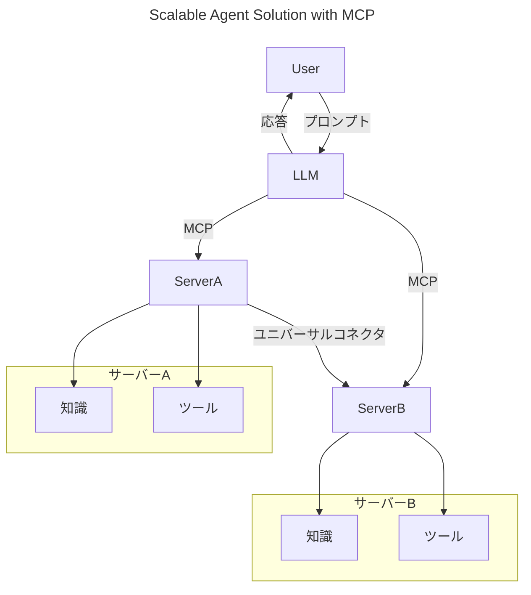
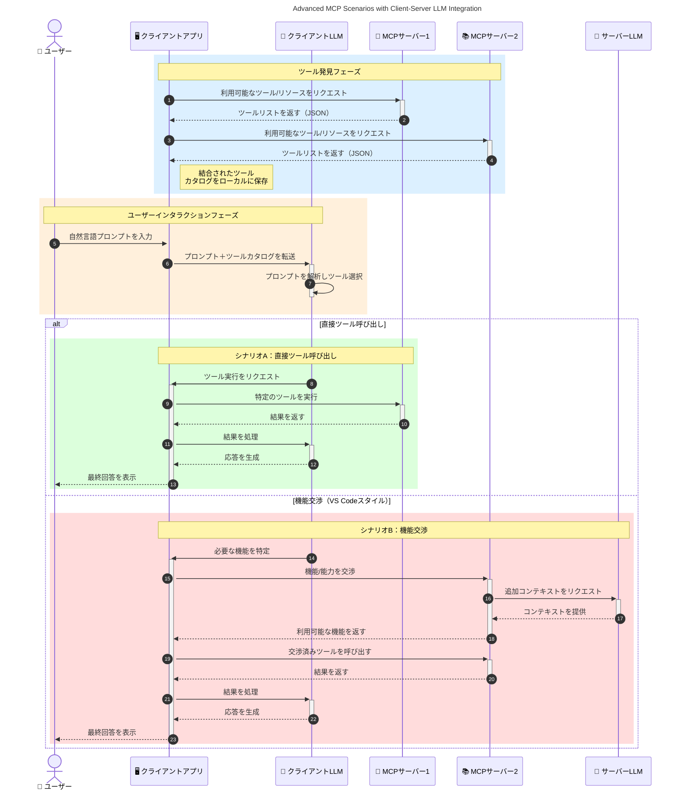

# モデルコンテキストプロトコル（MCP）入門：スケーラブルなAIアプリケーションにおける重要性

[](https://youtu.be/agBbdiOPLQA)

_(このレッスンのビデオを見るには上の画像をクリックしてください)_

生成型AIアプリケーションは、自然言語プロンプトを使用してユーザーがアプリと対話できるため、大きな進歩です。しかし、こうしたアプリにより多くの時間とリソースを投資するにつれて、機能やリソースを簡単に統合でき、拡張が容易で、複数のモデルに対応でき、さまざまなモデルの複雑さを扱えるようにしたいと考えます。つまり、生成AIアプリの構築は最初は簡単でも、成長して複雑になるにつれてアーキテクチャの定義を始める必要があり、おそらく標準に依存してアプリが一貫した方法で構築されるようにする必要があります。ここでMCPが組織化し、標準を提供します。

---

## **🔍 モデルコンテキストプロトコル（MCP）とは？**

<strong>モデルコンテキストプロトコル（MCP）</strong>は、<strong>大規模言語モデル（LLM）が外部のツール、API、およびデータソースとシームレスに連携できるようにするオープンで標準化されたインターフェース</strong>です。これにより、AIモデルの機能をトレーニングデータの範囲を超えて強化し、よりスマートでスケーラブル、かつ応答性の高いAIシステムを実現します。

---

## **🎯 AIにおける標準化の重要性**

生成型AIアプリケーションが複雑化するにつれて、<strong>スケーラビリティ、拡張性、保守性</strong>を確保し、<strong>ベンダーロックインを回避</strong>するための標準を採用することが不可欠です。MCPは次のようなニーズに対応します：

- モデルとツールの統合の統一
- 壊れやすい一回限りのカスタムソリューションの削減
- 複数ベンダーのモデルが同一エコシステム内に共存可能に

**注意：** MCPはオープンスタンダードとして宣伝されていますが、IEEE、IETF、W3C、ISOなど、既存の標準化団体による標準化は予定されていません。

---

## **📚 学習目標**

本記事の最後までに、あなたは以下を理解できるようになります：

- <strong>モデルコンテキストプロトコル（MCP）</strong>の定義と利用ケース
- MCPがモデルからツールへの通信をどのように標準化するか
- MCPアーキテクチャの主要コンポーネント
- 企業や開発分野におけるMCPの実際の応用例

---

## **💡 モデルコンテキストプロトコル（MCP）が変革をもたらす理由**

### **🔗 MCPはAIの断片化問題を解決**

MCP導入前は、モデルとツールの統合には次のような課題がありました：

- ツールとモデルのペアごとにカスタムコードが必要
- ベンダーごとに非標準API
- 更新による頻繁な破損
- ツール増加によるスケーラビリティの低下

### **✅ MCP標準化の利点**

| <strong>利点</strong>               | <strong>説明</strong>                                                                            |
|-----------------------|-------------------------------------------------------------------------------------|
| 相互運用性             | LLMが異なるベンダーのツールとシームレスに連携                                     |
| 一貫性                 | プラットフォームやツール間での統一された振る舞い                                   |
| 再利用性               | 一度構築したツールをプロジェクトやシステム間で活用可能                               |
| 開発の加速             | 標準化されたプラグアンドプレイインターフェースで開発時間を削減                     |

---

## **🧱 MCPアーキテクチャの概要**

MCPは<strong>クライアント-サーバモデル</strong>を採用しており：

- <strong>MCPホスト</strong>がAIモデルを運用
- <strong>MCPクライアント</strong>がリクエストを開始
- <strong>MCPサーバ</strong>がコンテキスト、ツール、機能を提供

### **主要コンポーネント：**

- <strong>リソース</strong> – モデル向けの静的または動的データ  
- <strong>プロンプト</strong> – ガイド付き生成のための事前定義ワークフロー  
- <strong>ツール</strong> – 検索や計算などの実行可能関数  
- <strong>サンプリング</strong> – 再帰的対話によるエージェント行動（`2026-07-28`のリリース候補で非推奨）  
- <strong>エリシテーション</strong> – サーバー主導のユーザー入力要求  
- <strong>ルーツ</strong> – サーバーアクセス制御のためのファイルシステム境界（`2026-07-28`のリリース候補で非推奨）  

### **プロトコルアーキテクチャ：**

MCPは二層アーキテクチャを採用：
- <strong>データレイヤー</strong>：JSON-RPC 2.0 ベースの通信およびライフサイクル管理とプリミティブ
- <strong>トランスポートレイヤー</strong>：STDIO（ローカル）およびSSE対応のストリーミングHTTP（リモート）通信チャネル

---

## MCPサーバの動作

MCPサーバは以下のように動作します：

- <strong>リクエストフロー</strong>：
    1. エンドユーザーまたはその代理のソフトウェアがリクエストを開始します。
    2. <strong>MCPクライアント</strong>がリクエストをAIモデル実行を管理する<strong>MCPホスト</strong>に送信します。
    3. <strong>AIモデル</strong>はユーザープロンプトを受け取り、外部ツールやデータへのアクセスを一つ以上のツール呼び出しで要求する場合があります。
    4. <strong>MCPホスト</strong>は、モデルではなく標準化されたプロトコルを使って適切な<strong>MCPサーバ</strong>と通信します。
- **MCPホストの機能**：
    - <strong>ツールレジストリ</strong>：利用可能なツールとその機能のカタログを管理。
    - <strong>認証</strong>：ツールアクセスの権限を検証。
    - <strong>リクエストハンドラ</strong>：モデルからのツールリクエストを処理。
    - <strong>レスポンスフォーマッタ</strong>：ツール出力をモデルが理解できる形式に構造化。
- **MCPサーバ実行**：
    - <strong>MCPホスト</strong>は、専門機能を持つ複数の<strong>MCPサーバ</strong>（例：検索、計算、データベースクエリ）にツール呼び出しをルーティング。
    - <strong>MCPサーバ</strong>はそれぞれの操作を実行し、結果を統一フォーマットで<strong>MCPホスト</strong>に返却。
    - <strong>MCPホスト</strong>は結果をフォーマットし、<strong>AIモデル</strong>に中継。
- <strong>レスポンスの完結</strong>：
    - <strong>AIモデル</strong>はツール出力を最終応答に組み込みます。
    - <strong>MCPホスト</strong>はこの応答を<strong>MCPクライアント</strong>に送信し、エンドユーザーまたは呼び出し元ソフトウェアに提供します。
    

```mermaid
---
title: MCP Architecture and Component Interactions
description: A diagram showing the flows of the components in MCP.
---
graph TD
    Client[MCP クライアント/アプリケーション] -->|リクエストを送信| H[MCP ホスト]
    H -->|呼び出し| A[AI モデル]
    A -->|ツール呼び出しリクエスト| H
    H -->|MCP Protocol| T1[MCP Server Tool 01: ウェブ検索]
    H -->|MCP Protocol| T2[MCP Server Tool 02: 電卓ツール]
    H -->|MCP Protocol| T3[MCP Server Tool 03: データベースアクセスツール]
    H -->|MCP Protocol| T4[MCP Server Tool 04: ファイルシステムツール]
    H -->|レスポンスを送信| Client

    subgraph 「MCP ホストコンポーネント」
        H
        G[ツールレジストリ]
        I[認証]
        J[リクエストハンドラー]
        K[レスポンスフォーマッター]
    end

    H <--> G
    H <--> I
    H <--> J
    H <--> K

    style A fill:#f9d5e5,stroke:#333,stroke-width:2px
    style H fill:#eeeeee,stroke:#333,stroke-width:2px
    style Client fill:#d5e8f9,stroke:#333,stroke-width:2px
    style G fill:#fffbe6,stroke:#333,stroke-width:1px
    style I fill:#fffbe6,stroke:#333,stroke-width:1px
    style J fill:#fffbe6,stroke:#333,stroke-width:1px
    style K fill:#fffbe6,stroke:#333,stroke-width:1px
    style T1 fill:#c2f0c2,stroke:#333,stroke-width:1px
    style T2 fill:#c2f0c2,stroke:#333,stroke-width:1px
    style T3 fill:#c2f0c2,stroke:#333,stroke-width:1px
    style T4 fill:#c2f0c2,stroke:#333,stroke-width:1px
```

## 👨‍💻 MCPサーバの構築方法（例付き）

MCPサーバはデータや機能を提供してLLMの能力を拡張します。 

さっそく試してみませんか？以下は異なる言語/スタックでの簡単なMCPサーバ作成例を含むSDKです：

- **Python SDK**: https://github.com/modelcontextprotocol/python-sdk

- **TypeScript SDK**: https://github.com/modelcontextprotocol/typescript-sdk

- **Java SDK**: https://github.com/modelcontextprotocol/java-sdk

- **C#/.NET SDK**: https://github.com/modelcontextprotocol/csharp-sdk


## 🌍 MCPの実際のユースケース

MCPはAI機能の拡張により、広範なアプリケーションを可能にします：

| <strong>アプリケーション</strong>                | <strong>説明</strong>                                                                            |
|------------------------------|-------------------------------------------------------------------------------------|
| 企業データ統合                  | LLMをデータベース、CRM、または社内ツールに接続                                      |
| エージェントAIシステム          | ツールアクセスと意思決定ワークフローを持つ自律エージェントを可能に                  |
| マルチモーダルアプリケーション  | テキスト、画像、音声ツールを単一の統合AIアプリで結合                              |
| リアルタイムデータ統合          | ライブデータをAI対話に取り入れ、より正確で最新の出力を実現                          |


### 🧠 MCP = AI相互作用のための共通標準

モデルコンテキストプロトコル（MCP）は、USB-Cが物理的接続を標準化したのと同様に、AI相互作用のための共通標準として機能します。AIの世界では、MCPは一貫したインターフェースを提供し、モデル（クライアント）が外部のツールやデータ提供者（サーバ）とシームレスに統合できるようにします。これにより、各APIやデータソースごとに多様でカスタムなプロトコルを使う必要がなくなります。

MCPに対応したツール（MCPサーバと呼ばれる）は統一された標準に従い、提供可能なツールやアクションの一覧を示したり、AIエージェントの要求に応じてそれらを実行します。MCPをサポートするAIエージェントプラットフォームは、サーバから利用可能なツールを発見し、この標準プロトコル経由で呼び出すことが可能です。

### 💡 知識へのアクセスを促進

MCPはツール提供だけでなく、知識へのアクセスも支援します。アプリケーションはLLMにコンテキストを提供するために複数のデータソースにリンクできます。例えば、MCPサーバは企業のドキュメントリポジトリを表し、エージェントが必要に応じて関連情報を取得できます。別のサーバはメール送信や記録更新のような特定のアクションを処理できます。エージェントの視点では、これらは使用可能なツールであり、一部はデータ（知識コンテキスト）を返し、他はアクションを実行します。MCPは両方を効率的に管理します。

エージェントがMCPサーバに接続すると、標準フォーマットを通じてサーバの利用可能な機能やアクセス可能なデータを自動的に学習します。この標準化により、動的なツールの利用が可能になります。例えば、新たなMCPサーバをエージェントのシステムに追加すると、その機能は即座に利用可能になり、エージェントの命令を改変する必要がありません。

この合理化された統合は、次の図に示されるように、サーバーがツールと知識の両方を提供し、システム間のシームレスな協働を確保します。 

### 👉 例：スケーラブルなエージェントソリューション


ユニバーサルコネクタはMCPサーバ同士が通信し、機能を共有できるようにします。これによりServerAはServerBにタスクを委任したり、そのツールや知識にアクセスしたりできます。これにより、ツールとデータが複数のサーバに分散管理され、スケーラブルでモジュール式のエージェントアーキテクチャを実現します。MCPがツールの公開を標準化するため、エージェントはハードコードされた統合なしでツールの発見とリクエストのルーティングが動的に可能になります。


ツールと知識の連携：サーバ間でツールとデータにアクセスでき、よりスケーラブルでモジュール式のエージェントアーキテクチャを支えます。

### 🔄 クライアント側LLM統合による高度なMCPシナリオ

基本的なMCPアーキテクチャを超えて、クライアントとサーバの両方にLLMを含む高度なシナリオがあります。次の図では、<strong>クライアントアプリ</strong>がIDEで、LLMに利用可能な複数のMCPツールがあるケースが示されています：



## 🔐 MCPの実用的な利点

以下はMCP利用の実用的な利点です：

- <strong>新鮮さ</strong>：モデルはトレーニングデータ以外の最新情報にアクセス可能
- <strong>機能拡張</strong>：モデルはトレーニング外のタスクに特化したツールを活用可能
- <strong>幻覚の減少</strong>：外部データソースが事実の根拠を提供
- <strong>プライバシー</strong>：センシティブデータはプロンプトに埋め込むのではなく安全な環境に保持可能

## 📌 重要なポイント

MCP利用の重要ポイントは以下の通りです：

- <strong>MCP</strong>はAIモデルとツール・データの相互作用を標準化
- <strong>拡張性、一貫性、相互運用性</strong>を促進
- 開発時間の削減、信頼性向上、モデル機能の拡張に貢献
- クライアント・サーバアーキテクチャは柔軟で拡張可能なAIアプリを実現

## 🧠 演習

あなたが作りたいAIアプリについて考えてみましょう。

- どの<strong>外部ツールやデータ</strong>が機能拡張に役立つでしょうか？
- MCPは統合を<strong>より簡単かつ信頼性の高いものに</strong>できそうですか？

## 追加リソース

- [MCP GitHubリポジトリ](https://github.com/modelcontextprotocol)


## 続き

次へ: [第1章：コアコンセプト](../01-CoreConcepts/README.md)

---

<!-- CO-OP TRANSLATOR DISCLAIMER START -->
**免責事項**：
本書類は AI 翻訳サービス [Co-op Translator](https://github.com/Azure/co-op-translator) を使用して翻訳されています。正確性を期していますが、自動翻訳には誤りや不正確な部分が含まれる可能性があることをご承知おきください。原文の原語版が正式な情報源とみなされるべきです。重要な情報については、専門の人間による翻訳を推奨します。本翻訳の利用により生じたいかなる誤解や解釈違いについても、当方は責任を負いかねます。
<!-- CO-OP TRANSLATOR DISCLAIMER END -->