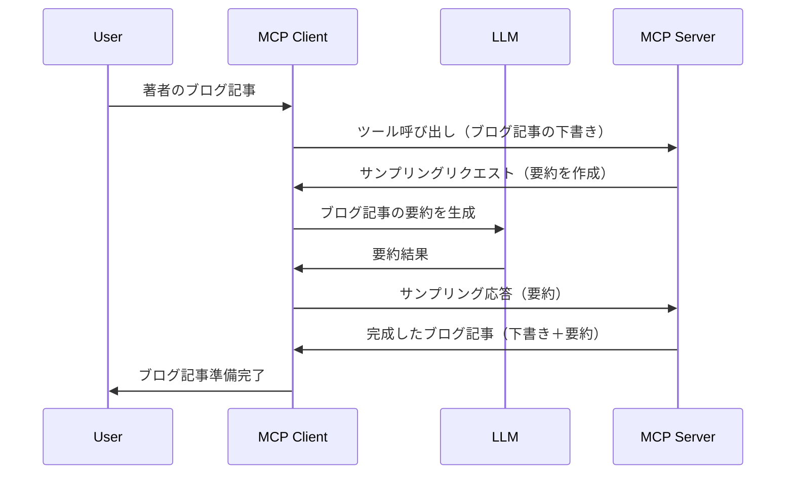

> [非推奨: 2026-07-28 リリース候補](https://blog.modelcontextprotocol.io/posts/2026-07-28-release-candidate/)

# Sampling - クライアントへの機能委譲

> **非推奨のお知らせ:** `2026-07-28` MCP仕様リリース候補は、Samplingを非推奨とし、LLMプロバイダーAPIとの直接統合を推奨しています。Samplingは `2025-11-25` および正式に非推奨となったあと少なくとも1年間は機能しますので、このレッスンの内容は有効ですが、新しいサーバ設計では代替パターンの検討を推奨します。詳細は[What's Changing in MCP: The 2026-07-28 Release Candidate](../../01-CoreConcepts/mcp-2026-07-28-release-candidate.md)を参照してください。

時には、MCPクライアントとMCPサーバが共通の目的を達成するために協力する必要があります。サーバがクライアント上のLLMの助けを必要とするケースがあるでしょう。このような場合に使うのがSamplingです。

いくつかのユースケースとSamplingを利用したソリューションの構築方法を見ていきましょう。

## 概要

このレッスンでは、Samplingの使用時期と方法、及び設定方法に焦点を当てます。

## 学習目標

本章では以下を行います:

- Samplingとは何か、いつ使うべきかを説明します。
- MCPでのSamplingの設定方法を示します。
- Samplingの実例を紹介します。

## Samplingとは何か、なぜ使うのか？

Samplingは次のように動作する高度な機能です:



### Samplingリクエスト

それでは、現実的なシナリオの全体像を掴んだところで、サーバがクライアントに返すsamplingリクエストについて話しましょう。このリクエストはJSON-RPC形式で次のようになります:

```json
{
  "jsonrpc": "2.0",
  "id": 1,
  "method": "sampling/createMessage",
  "params": {
    "messages": [
      {
        "role": "user",
        "content": {
          "type": "text",
          "text": "Create a blog post summary of the following blog post: <BLOG POST>"
        }
      }
    ],
    "modelPreferences": {
      "hints": [
        {
          "name": "claude-3-sonnet"
        }
      ],
      "intelligencePriority": 0.8,
      "speedPriority": 0.5
    },
    "systemPrompt": "You are a helpful assistant.",
    "maxTokens": 100
  }
}
```

ここで注意すべき点がいくつかあります:

- content -> textにあるPromptは、LLMにブログ投稿内容の要約を指示するプロンプトです。

- **modelPreferences**。これはその名の通り、LLM設定の推奨または好みを示しています。ユーザーはこれらの推奨を採用するか変更するか選べます。この場合、使用モデル、速度と知能の優先度に関する推奨が含まれています。
- **systemPrompt**、これは通常のシステムプロンプトで、LLMに人格とガイダンス指示を与えます。
- **maxTokens**、このタスクで推奨される最大トークン数を指定するプロパティです。

### Samplingレスポンス

このレスポンスはMCPクライアントがLLMを呼び出し、その応答を待ってから構築し、MCPサーバに返すものです。JSON-RPC形式では次のようになります:

```json
{
  "jsonrpc": "2.0",
  "id": 1,
  "result": {
    "role": "assistant",
    "content": {
      "type": "text",
      "text": "Here's your abstract <ABSTRACT>"
    },
    "model": "gpt-5",
    "stopReason": "endTurn"
  }
}
```

要求したブログ投稿の要約が含まれていることに注目してください。また、使用モデルが要求したものではなく "gpt-5" で "claude-3-sonnet" ではないことにも注目してください。これはユーザーが使用モデルを変更可能であることを示し、samplingリクエストがあくまで推奨であることを表しています。

主要な流れと、便利なタスク「ブログ投稿作成＋要約」の使い方が分かったので、動作させるために何をすべきか見ていきましょう。

### メッセージタイプ

Samplingメッセージはテキストだけでなく、画像や音声も送信可能です。JSON-RPCの見え方は以下のように異なります:

<strong>テキスト</strong>

```json
{
  "type": "text",
  "text": "The message content"
}
```

<strong>画像コンテンツ</strong>

```json
{
  "type": "image",
  "data": "base64-encoded-image-data",
  "mimeType": "image/jpeg"
}
```

<strong>音声コンテンツ</strong>

```json
{
  "type": "audio",
  "data": "base64-encoded-audio-data",
  "mimeType": "audio/wav"
}
```

> NOTE: Samplingの詳細については[公式ドキュメント](https://modelcontextprotocol.io/specification/2025-11-25/client/sampling)を参照してください

## クライアントでのSampling設定方法

> 注意: サーバのみ構築する場合、ほとんど設定は不要です。

クライアントでは以下の機能を指定する必要があります:

```json
{
  "capabilities": {
    "sampling": {}
  }
}
```

こうすることで、選択したクライアントがサーバ初期化時にこの設定を読み込みます。

## Sampling実例 - ブログ投稿作成

一緒にsamplingサーバをコードしながら以下をやっていきましょう:

１．サーバにツールを作る。
１．そのツールがsamplingリクエストを作成する。
１．ツールはクライアントのsamplingリクエストへの応答を待つ。
１．その後ツール結果を生成する。

コードを段階的に見ていきましょう:

### -1- ツール作成

**python**

```python
@mcp.tool()
async def create_blog(title: str, content: str, ctx: Context[ServerSession, None]) -> str:
    """Create a blog post and generate a summary"""

```

### -2- Samplingリクエスト作成

以下のコードでツールを拡張します:

**python**

```python
post = BlogPost(
        id=len(posts) + 1,
        title=title,
        content=content,
        abstract=""
    )

prompt = f"Create an abstract of the following blog post: title: {title} and draft: {content} "

result = await ctx.session.create_message(
        messages=[
            SamplingMessage(
                role="user",
                content=TextContent(type="text", text=prompt),
            )
        ],
        max_tokens=100,
)

```

### -3- 応答を待ち、レスポンスを返す

**python**

```python
post.abstract = result.content.text

posts.append(post)

# 完成した製品を返します
return json.dumps({
    "id": post.title,
    "abstract": post.abstract
})
```

### -4- 完全なコード

**python**

```python
from starlette.applications import Starlette
from starlette.routing import Mount, Host

from mcp.server.fastmcp import Context, FastMCP

from mcp.server.session import ServerSession
from mcp.types import SamplingMessage, TextContent

import json


from uuid import uuid4
from typing import List
from pydantic import BaseModel


mcp = FastMCP("Blog post generator")

# app = FastAPI()

posts = []

class BlogPost(BaseModel):
    id: int
    title: str
    content: str
    abstract: str

posts: List[BlogPost] = []

@mcp.tool()
async def create_blog(title: str, content: str, ctx: Context[ServerSession, None]) -> str:
    """Create a blog post and generate a summary"""

    post = BlogPost(
        id=len(posts) + 1,
        title=title,
        content=content,
        abstract=""
    )

    prompt = f"Create an abstract of the following blog post: title: {title} and draft: {content} "

    result = await ctx.session.create_message(
        messages=[
            SamplingMessage(
                role="user",
                content=TextContent(type="text", text=prompt),
            )
        ],
        max_tokens=100,
    )

    post.abstract = result.content.text

    posts.append(post)

    # 完全なブログ投稿を返します
    return json.dumps({
        "id": post.title,
        "abstract": post.abstract
    })

if __name__ == "__main__":
    print("Starting server...")
    # mcp.run()
    mcp.run(transport="streamable-http")

# 次のコマンドでアプリを実行します: python server.py
```

### -5- Visual Studio Codeでのテスト

Visual Studio Codeでテストするには以下を行います:

１．ターミナルでサーバ起動
１．*mcp.json* に追加し、起動を確認（例は以下のとおり）

   ```json
   "servers": {
      "blog-server": {
        "type": "http",
        "url": "http://localhost:8000/mcp"
      }
   }
   ```

１．プロンプト入力:

   ```text
   create a blog post named "Where Python comes from", the content is "Python is actually named after Monty Python Flying Circus"
   ```

１．Samplingを許可します。初回のテスト時は追加のダイアログが表示されるので承諾してください。その後、通常のツール実行確認ダイアログが表示されます。

１．結果を確認します。結果はGitHub Copilot Chat上で見やすくレンダリングされますが、元のJSONレスポンスも確認可能です。

<strong>ボーナス</strong>. Visual Studio CodeのツールはSamplingを強力にサポートしています。インストール済みサーバのSamplingアクセス設定は次の手順で行います：

１．拡張機能セクションへ移動
１．「MCP SERVERS - INSTALLED」セクションでサーバの歯車アイコン選択
１．「Configure Model Access」を選択、ここでSampling実行時にGitHub Copilotが使用許可されるモデルを選択できます。また「Show Sampling requests」を選ぶと最近のSamplingリクエスト一覧が見れます。

## 課題

この課題では少し異なるSampling、つまり商品説明文を生成できるサンプリング統合を構築します。以下がシナリオです:

<strong>シナリオ</strong>: ECのバックオフィス担当者は商品説明文作成に時間がかかりすぎています。そこで、「create_product」ツールを作り、「title」と「keywords」を引数に渡すと、クライアントのLLMが「description」フィールドを含む完全な商品情報を生成するソリューションを構築してください。

TIP: これまで学んだことを活かし、samplingリクエストを利用してこのサーバとツールを構築してください。

## 解答例

[解答例](./solution/README.md)

## 主なポイント

SamplingはサーバがLLMの助けが必要なタスクをクライアントに委譲できる強力な機能です。

## 次のステップ

- [第4章 - 実践的実装](../../04-PracticalImplementation/README.md)

---

<!-- CO-OP TRANSLATOR DISCLAIMER START -->
**免責事項**：
本書類は AI 翻訳サービス [Co-op Translator](https://github.com/Azure/co-op-translator) を使用して翻訳されています。正確性を期していますが、自動翻訳には誤りや不正確な部分が含まれる可能性があることをご承知おきください。原文の原語版が正式な情報源とみなされるべきです。重要な情報については、専門の人間による翻訳を推奨します。本翻訳の利用により生じたいかなる誤解や解釈違いについても、当方は責任を負いかねます。
<!-- CO-OP TRANSLATOR DISCLAIMER END -->