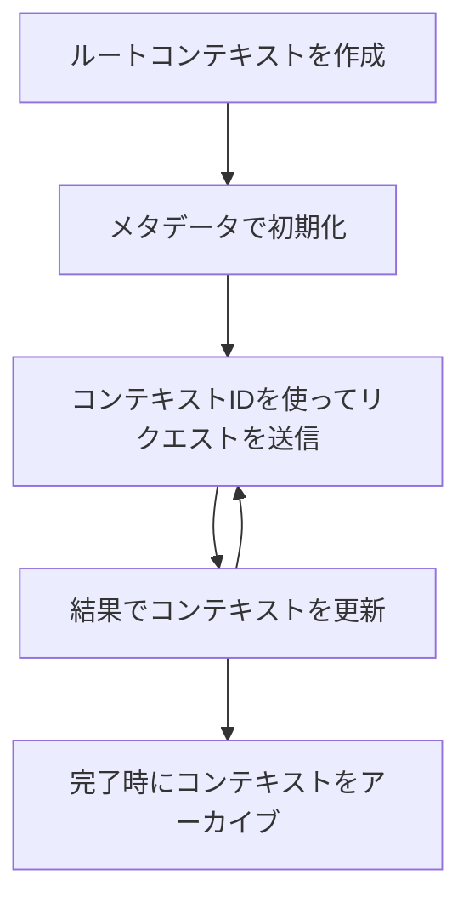

> [非推奨: 2026-07-28 リリース候補](https://blog.modelcontextprotocol.io/posts/2026-07-28-release-candidate/#roots-sampling-and-logging-are-deprecated)

# MCP ルートコンテキスト

> **非推奨通知:** MCP 仕様の `2026-07-28` リリース候補では、ルートはツールパラメーター、リソースURI、またはサーバー構成に置き換えられるものとして非推奨とされています。ルートは `2025-11-25` バージョンおよび正式な廃止後少なくとも1年間機能するため、このレッスンの内容はすべて有効ですが、新しいサーバーデザインでは置換パターンの評価が推奨されます。詳細は [MCPの変更点: 2026-07-28 リリース候補](../../01-CoreConcepts/mcp-2026-07-28-release-candidate.md) を参照してください。

ルートコンテキストは、複数のリクエストやセッションにわたって会話履歴と共有状態を保持するための持続的なレイヤーを提供する、Model Context Protocolの基本的な概念です。

## はじめに

本レッスンでは、MCPにおけるルートコンテキストの作成、管理、活用方法を探ります。

## 学習目標

本レッスンの終了時には、以下が可能になります:

- ルートコンテキストの目的と構造の理解
- MCPクライアントライブラリを用いたルートコンテキストの作成と管理
- .NET、Java、JavaScript、Pythonアプリケーションでのルートコンテキスト実装
- 複数ターンの会話および状態管理のためのルートコンテキストの活用
- ルートコンテキスト管理のベストプラクティスの実装

## ルートコンテキストの理解

ルートコンテキストは関連する一連の対話の履歴と状態を保持するコンテナとして機能します。これによって次のことが可能です:

- <strong>会話の永続性</strong>: 一貫した複数ターンの会話の維持
- <strong>メモリ管理</strong>: 対話をまたいだ情報の保存と取得
- <strong>状態管理</strong>: 複雑なワークフローの進行状況の追跡
- <strong>コンテキスト共有</strong>: 複数のクライアントが同じ会話状態にアクセス可能にすること

MCPにおけるルートコンテキストの主要な特徴は以下の通りです:

- 各ルートコンテキストは一意の識別子を持っています。
- 会話履歴、ユーザーの設定、その他のメタデータを含めることができます。
- 必要に応じて作成、アクセス、アーカイブが可能です。
- 詳細なアクセス制御と権限をサポートしています。

## ルートコンテキストのライフサイクル



## ルートコンテキストの操作方法

ルートコンテキストの作成と管理の例を示します。

### C#による実装

```csharp
// .NET Example: Root Context Management
using Microsoft.Mcp.Client;
using System;
using System.Threading.Tasks;
using System.Collections.Generic;

public class RootContextExample
{
    private readonly IMcpClient _client;
    private readonly IRootContextManager _contextManager;
    
    public RootContextExample(IMcpClient client, IRootContextManager contextManager)
    {
        _client = client;
        _contextManager = contextManager;
    }
    
    public async Task DemonstrateRootContextAsync()
    {
        // 1. Create a new root context
        var contextResult = await _contextManager.CreateRootContextAsync(new RootContextCreateOptions
        {
            Name = "Customer Support Session",
            Metadata = new Dictionary<string, string>
            {
                ["CustomerName"] = "Acme Corporation",
                ["PriorityLevel"] = "High",
                ["Domain"] = "Cloud Services"
            }
        });
        
        string contextId = contextResult.ContextId;
        Console.WriteLine($"Created root context with ID: {contextId}");
        
        // 2. First interaction using the context
        var response1 = await _client.SendPromptAsync(
            "I'm having issues scaling my web service deployment in the cloud.", 
            new SendPromptOptions { RootContextId = contextId }
        );
        
        Console.WriteLine($"First response: {response1.GeneratedText}");
        
        // Second interaction - the model will have access to the previous conversation
        var response2 = await _client.SendPromptAsync(
            "Yes, we're using containerized deployments with Kubernetes.", 
            new SendPromptOptions { RootContextId = contextId }
        );
        
        Console.WriteLine($"Second response: {response2.GeneratedText}");
        
        // 3. Add metadata to the context based on conversation
        await _contextManager.UpdateContextMetadataAsync(contextId, new Dictionary<string, string>
        {
            ["TechnicalEnvironment"] = "Kubernetes",
            ["IssueType"] = "Scaling"
        });
        
        // 4. Get context information
        var contextInfo = await _contextManager.GetRootContextInfoAsync(contextId);
        
        Console.WriteLine("Context Information:");
        Console.WriteLine($"- Name: {contextInfo.Name}");
        Console.WriteLine($"- Created: {contextInfo.CreatedAt}");
        Console.WriteLine($"- Messages: {contextInfo.MessageCount}");
        
        // 5. When the conversation is complete, archive the context
        await _contextManager.ArchiveRootContextAsync(contextId);
        Console.WriteLine($"Archived context {contextId}");
    }
}
```

先のコードでは以下を行いました:

1. カスタマーサポートセッションのためのルートコンテキストを作成。
1. そのコンテキスト内で複数のメッセージを送信し、モデルによる状態維持を実現。
1. 会話に基づいて関連メタデータでコンテキストを更新。
1. 会話履歴を理解するためにコンテキスト情報を取得。
1. 会話完了後にコンテキストをアーカイブ。

## 例：金融分析におけるルートコンテキスト実装

本例では、金融分析セッションのためのルートコンテキストを作成し、複数の対話をまたいだ状態の維持方法を示します。

### Javaによる実装

```java
// Javaの例：ルートコンテキストの実装
package com.example.mcp.contexts;

import com.mcp.client.McpClient;
import com.mcp.client.ContextManager;
import com.mcp.models.RootContext;
import com.mcp.models.McpResponse;

import java.util.HashMap;
import java.util.Map;
import java.util.UUID;

public class RootContextsDemo {
    private final McpClient client;
    private final ContextManager contextManager;
    
    public RootContextsDemo(String serverUrl) {
        this.client = new McpClient.Builder()
            .setServerUrl(serverUrl)
            .build();
            
        this.contextManager = new ContextManager(client);
    }
    
    public void demonstrateRootContext() throws Exception {
        // コンテキストメタデータを作成する
        Map<String, String> metadata = new HashMap<>();
        metadata.put("projectName", "Financial Analysis");
        metadata.put("userRole", "Financial Analyst");
        metadata.put("dataSource", "Q1 2025 Financial Reports");
        
        // 1. 新しいルートコンテキストを作成する
        RootContext context = contextManager.createRootContext("Financial Analysis Session", metadata);
        String contextId = context.getId();
        
        System.out.println("Created context: " + contextId);
        
        // 2. 最初の対話
        McpResponse response1 = client.sendPrompt(
            "Analyze the trends in Q1 financial data for our technology division",
            contextId
        );
        
        System.out.println("First response: " + response1.getGeneratedText());
        
        // 3. 応答から得た重要な情報でコンテキストを更新する
        contextManager.addContextMetadata(contextId, 
            Map.of("identifiedTrend", "Increasing cloud infrastructure costs"));
        
        // 2回目の対話 - 同じコンテキストを使用
        McpResponse response2 = client.sendPrompt(
            "What's driving the increase in cloud infrastructure costs?",
            contextId
        );
        
        System.out.println("Second response: " + response2.getGeneratedText());
        
        // 4. 分析セッションの要約を生成する
        McpResponse summaryResponse = client.sendPrompt(
            "Summarize our analysis of the technology division financials in 3-5 key points",
            contextId
        );
        
        // 要約をコンテキストメタデータに保存する
        contextManager.addContextMetadata(contextId, 
            Map.of("analysisSummary", summaryResponse.getGeneratedText()));
            
        // 更新されたコンテキスト情報を取得する
        RootContext updatedContext = contextManager.getRootContext(contextId);
        
        System.out.println("Context Information:");
        System.out.println("- Created: " + updatedContext.getCreatedAt());
        System.out.println("- Last Updated: " + updatedContext.getLastUpdatedAt());
        System.out.println("- Analysis Summary: " + 
            updatedContext.getMetadata().get("analysisSummary"));
            
        // 5. 完了したらコンテキストをアーカイブする
        contextManager.archiveContext(contextId);
        System.out.println("Context archived");
    }
}
```

先のコードでは以下を行いました:

1. 金融分析セッションのためのルートコンテキストを作成。
2. そのコンテキスト内で複数のメッセージを送信し、モデルによる状態維持を実現。
3. 会話に基づいて関連メタデータでコンテキストを更新。
4. 分析セッションの概要を生成し、コンテキストメタデータに保存。
5. 会話完了後にコンテキストをアーカイブ。

## 例：ルートコンテキスト管理

ルートコンテキストを効果的に管理することは、会話履歴と状態の維持に不可欠です。以下はルートコンテキスト管理の実装例です。

### JavaScriptによる実装

```javascript
// JavaScriptの例：MCPルートコンテキストの管理
const { McpClient, RootContextManager } = require('@mcp/client');

class ContextSession {
  constructor(serverUrl, apiKey = null) {
    // MCPクライアントを初期化する
    this.client = new McpClient({
      serverUrl,
      apiKey
    });
    
    // コンテキストマネージャを初期化する
    this.contextManager = new RootContextManager(this.client);
  }
  
  /**
   * Create a new conversation context
   * @param {string} sessionName - Name of the conversation session
   * @param {Object} metadata - Additional metadata for the context
   * @returns {Promise<string>} - Context ID
   */
  async createConversationContext(sessionName, metadata = {}) {
    try {
      const contextResult = await this.contextManager.createRootContext({
        name: sessionName,
        metadata: {
          ...metadata,
          createdAt: new Date().toISOString(),
          status: 'active'
        }
      });
      
      console.log(`Created root context '${sessionName}' with ID: ${contextResult.id}`);
      return contextResult.id;
    } catch (error) {
      console.error('Error creating root context:', error);
      throw error;
    }
  }
  
  /**
   * Send a message in an existing context
   * @param {string} contextId - The root context ID
   * @param {string} message - The user's message
   * @param {Object} options - Additional options
   * @returns {Promise<Object>} - Response data
   */
  async sendMessage(contextId, message, options = {}) {
    try {
      // 指定されたコンテキストを使ってメッセージを送信する
      const response = await this.client.sendPrompt(message, {
        rootContextId: contextId,
        temperature: options.temperature || 0.7,
        allowedTools: options.allowedTools || []
      });
      
      // 会話から重要な洞察を任意で保存する
      if (options.storeInsights) {
        await this.storeConversationInsights(contextId, message, response.generatedText);
      }
      
      return {
        message: response.generatedText,
        toolCalls: response.toolCalls || [],
        contextId
      };
    } catch (error) {
      console.error(`Error sending message in context ${contextId}:`, error);
      throw error;
    }
  }
  
  /**
   * Store important insights from a conversation
   * @param {string} contextId - The root context ID
   * @param {string} userMessage - User's message
   * @param {string} aiResponse - AI's response
   */
  async storeConversationInsights(contextId, userMessage, aiResponse) {
    try {
      // 潜在的な洞察を抽出する（実際のアプリではより高度になる）
      const combinedText = userMessage + "\n" + aiResponse;
      
      // 潜在的な洞察を特定するための単純なヒューリスティック
      const insightWords = ["important", "key point", "remember", "significant", "crucial"];
      
      const potentialInsights = combinedText
        .split(".")
        .filter(sentence => 
          insightWords.some(word => sentence.toLowerCase().includes(word))
        )
        .map(sentence => sentence.trim())
        .filter(sentence => sentence.length > 10);
      
      // 洞察をコンテキストのメタデータに保存する
      if (potentialInsights.length > 0) {
        const insights = {};
        potentialInsights.forEach((insight, index) => {
          insights[`insight_${Date.now()}_${index}`] = insight;
        });
        
        await this.contextManager.updateContextMetadata(contextId, insights);
        console.log(`Stored ${potentialInsights.length} insights in context ${contextId}`);
      }
    } catch (error) {
      console.warn('Error storing conversation insights:', error);
      // 重大でないエラーなので警告としてログに記録するだけ
    }
  }
  
  /**
   * Get summary information about a context
   * @param {string} contextId - The root context ID
   * @returns {Promise<Object>} - Context information
   */
  async getContextInfo(contextId) {
    try {
      const contextInfo = await this.contextManager.getContextInfo(contextId);
      
      return {
        id: contextInfo.id,
        name: contextInfo.name,
        created: new Date(contextInfo.createdAt).toLocaleString(),
        lastUpdated: new Date(contextInfo.lastUpdatedAt).toLocaleString(),
        messageCount: contextInfo.messageCount,
        metadata: contextInfo.metadata,
        status: contextInfo.status
      };
    } catch (error) {
      console.error(`Error getting context info for ${contextId}:`, error);
      throw error;
    }
  }
  
  /**
   * Generate a summary of the conversation in a context
   * @param {string} contextId - The root context ID
   * @returns {Promise<string>} - Generated summary
   */
  async generateContextSummary(contextId) {
    try {
      // モデルにこれまでの会話の要約を生成させる
      const response = await this.client.sendPrompt(
        "Please summarize our conversation so far in 3-4 sentences, highlighting the main points discussed.",
        { rootContextId: contextId, temperature: 0.3 }
      );
      
      // 要約をコンテキストのメタデータに保存する
      await this.contextManager.updateContextMetadata(contextId, {
        conversationSummary: response.generatedText,
        summarizedAt: new Date().toISOString()
      });
      
      return response.generatedText;
    } catch (error) {
      console.error(`Error generating context summary for ${contextId}:`, error);
      throw error;
    }
  }
  
  /**
   * Archive a context when it's no longer needed
   * @param {string} contextId - The root context ID
   * @returns {Promise<Object>} - Result of the archive operation
   */
  async archiveContext(contextId) {
    try {
      // アーカイブ前に最終的な要約を作成する
      const summary = await this.generateContextSummary(contextId);
      
      // コンテキストをアーカイブする
      await this.contextManager.archiveContext(contextId);
      
      return {
        status: "archived",
        contextId,
        summary
      };
    } catch (error) {
      console.error(`Error archiving context ${contextId}:`, error);
      throw error;
    }
  }
}

// 利用例
async function demonstrateContextSession() {
  const session = new ContextSession('https://mcp-server-example.com');
  
  try {
    // 1. 製品サポートの会話用に新しいコンテキストを作成する
    const contextId = await session.createConversationContext(
      'Product Support - Database Performance',
      {
        customer: 'Globex Corporation',
        product: 'Enterprise Database',
        severity: 'Medium',
        supportAgent: 'AI Assistant'
      }
    );
    
    // 2. 会話の最初のメッセージ
    const response1 = await session.sendMessage(
      contextId,
      "I'm experiencing slow query performance on our database cluster after the latest update.",
      { storeInsights: true }
    );
    console.log('Response 1:', response1.message);
    
    // 同じコンテキストのフォローアップメッセージ
    const response2 = await session.sendMessage(
      contextId,
      "Yes, we've already checked the indexes and they seem to be properly configured.",
      { storeInsights: true }
    );
    console.log('Response 2:', response2.message);
    
    // 3. コンテキストの情報を取得する
    const contextInfo = await session.getContextInfo(contextId);
    console.log('Context Information:', contextInfo);
    
    // 4. 会話の要約を生成して表示する
    const summary = await session.generateContextSummary(contextId);
    console.log('Conversation Summary:', summary);
    
    // 5. 終了時にコンテキストをアーカイブする
    const archiveResult = await session.archiveContext(contextId);
    console.log('Archive Result:', archiveResult);
    
    // 6. エラーを適切に処理する
  } catch (error) {
    console.error('Error in context session demonstration:', error);
  }
}

demonstrateContextSession();
```

先のコードでは以下を行いました:

1. 関数 `createConversationContext` を使い、製品サポートの会話のためのルートコンテキストを作成。今回はデータベースのパフォーマンス問題に関する内容です。

1. 関数 `sendMessage` を使い、そのコンテキスト内で複数のメッセージを送信し、モデルによる状態維持を実現。送信されたメッセージは遅いクエリパフォーマンスとインデックス設定に関するものです。

1. 会話に基づいて関連メタデータでコンテキストを更新。

1. 関数 `generateContextSummary` を使い、会話の概要を生成してコンテキストメタデータに保存。

1. 会話完了後に関数 `archiveContext` でコンテキストをアーカイブ。

1. エラー処理を適切に行い堅牢性を確保。

## 複数ターンアシスタンスのためのルートコンテキスト

本例では、複数ターンアシスタンスセッションのためのルートコンテキストを作成し、複数対話をまたいだ状態の維持方法を示します。

### Pythonによる実装

```python
# Python例：マルチターン支援のルートコンテキスト
import asyncio
from datetime import datetime
from mcp_client import McpClient, RootContextManager

class AssistantSession:
    def __init__(self, server_url, api_key=None):
        self.client = McpClient(server_url=server_url, api_key=api_key)
        self.context_manager = RootContextManager(self.client)
    
    async def create_session(self, name, user_info=None):
        """Create a new root context for an assistant session"""
        metadata = {
            "session_type": "assistant",
            "created_at": datetime.now().isoformat(),
        }
        
        # 提供された場合、ユーザー情報を追加
        if user_info:
            metadata.update({f"user_{k}": v for k, v in user_info.items()})
            
        # ルートコンテキストを作成
        context = await self.context_manager.create_root_context(name, metadata)
        return context.id
    
    async def send_message(self, context_id, message, tools=None):
        """Send a message within a root context"""
        # コンテキストIDを使用してオプションを作成
        options = {
            "root_context_id": context_id
        }
        
        # 指定された場合、ツールを追加
        if tools:
            options["allowed_tools"] = tools
        
        # コンテキスト内でプロンプトを送信
        response = await self.client.send_prompt(message, options)
        
        # 会話の進行状況でコンテキストメタデータを更新
        await self.context_manager.update_context_metadata(
            context_id,
            {
                f"message_{datetime.now().timestamp()}": message[:50] + "...",
                "last_interaction": datetime.now().isoformat()
            }
        )
        
        return response
    
    async def get_conversation_history(self, context_id):
        """Retrieve conversation history from a context"""
        context_info = await self.context_manager.get_context_info(context_id)
        messages = await self.client.get_context_messages(context_id)
        
        return {
            "context_info": context_info,
            "messages": messages
        }
    
    async def end_session(self, context_id):
        """End an assistant session by archiving the context"""
        # まず要約プロンプトを生成
        summary_response = await self.client.send_prompt(
            "Please summarize our conversation and any key points or decisions made.",
            {"root_context_id": context_id}
        )
        
        # 要約をメタデータに保存
        await self.context_manager.update_context_metadata(
            context_id,
            {
                "summary": summary_response.generated_text,
                "ended_at": datetime.now().isoformat(),
                "status": "completed"
            }
        )
        
        # コンテキストをアーカイブ
        await self.context_manager.archive_context(context_id)
        
        return {
            "status": "completed",
            "summary": summary_response.generated_text
        }

# 使用例
async def demo_assistant_session():
    assistant = AssistantSession("https://mcp-server-example.com")
    
    # 1. セッションを作成
    context_id = await assistant.create_session(
        "Technical Support Session",
        {"name": "Alex", "technical_level": "advanced", "product": "Cloud Services"}
    )
    print(f"Created session with context ID: {context_id}")
    
    # 2. 最初のやり取り
    response1 = await assistant.send_message(
        context_id, 
        "I'm having trouble with the auto-scaling feature in your cloud platform.",
        ["documentation_search", "diagnostic_tool"]
    )
    print(f"Response 1: {response1.generated_text}")
    
    # 同じコンテキストでの2回目のやり取り
    response2 = await assistant.send_message(
        context_id,
        "Yes, I've already checked the configuration settings you mentioned, but it's still not working."
    )
    print(f"Response 2: {response2.generated_text}")
    
    # 3. 履歴を取得
    history = await assistant.get_conversation_history(context_id)
    print(f"Session has {len(history['messages'])} messages")
    
    # 4. セッションを終了
    end_result = await assistant.end_session(context_id)
    print(f"Session ended with summary: {end_result['summary']}")

if __name__ == "__main__":
    asyncio.run(demo_assistant_session())
```

先のコードでは以下を行いました:

1. 関数 `create_session` を使い、技術サポートセッションのためのルートコンテキストを作成。コンテキストには名前や技術レベルなどのユーザー情報が含まれます。

1. 関数 `send_message` を使い、そのコンテキスト内で複数のメッセージを送信し、モデルによる状態維持を実現。メッセージはオートスケーリング機能の問題に関するものです。

1. 関数 `get_conversation_history` を使い、コンテキスト情報とメッセージを取得。

1. 関数 `end_session` を使ってセッションを終了し、コンテキストをアーカイブし概要を生成。概要には会話の重要ポイントが含まれます。

## ルートコンテキストのベストプラクティス

ルートコンテキストを効果的に管理するためのベストプラクティスを以下に示します:

- <strong>集中的なコンテキスト作成</strong>: 明確さを保つために、異なる会話目的やドメインごとに別々のルートコンテキストを作成する。

- <strong>有効期限ポリシーの設定</strong>: 古いコンテキストをアーカイブまたは削除するポリシーを実装し、ストレージ管理およびデータ保持ポリシーに準拠する。

- <strong>関連メタデータの保存</strong>: 会話に関する重要情報を後で利用できるようにコンテキストメタデータに保存する。

- **コンテキストIDの一貫した使用**: 一度作成したコンテキストは、そのIDを関連リクエスト全てに一貫して使用し、連続性を維持する。

- <strong>概要の生成</strong>: コンテキストが大きくなった場合は概要を生成し、重要情報を捕捉しつつコンテキストサイズを管理する。

- <strong>アクセス制御の実装</strong>: 複数ユーザーシステムでは、会話コンテキストのプライバシーとセキュリティを確保するため適切なアクセス制御を実装する。

- <strong>コンテキストの制限への対応</strong>: コンテキストサイズ制限を意識し、非常に長い会話に対する処理戦略を実装する。

- <strong>完了時のアーカイブ</strong>: 会話が完了したらコンテキストをアーカイブし、会話履歴を保存しつつリソースを解放する。

## 次に学ぶこと

- [5.5 ルーティング](../mcp-routing/README.md)

---

<!-- CO-OP TRANSLATOR DISCLAIMER START -->
**免責事項**：
本書類は AI 翻訳サービス [Co-op Translator](https://github.com/Azure/co-op-translator) を使用して翻訳されています。正確性を期していますが、自動翻訳には誤りや不正確な部分が含まれる可能性があることをご承知おきください。原文の原語版が正式な情報源とみなされるべきです。重要な情報については、専門の人間による翻訳を推奨します。本翻訳の利用により生じたいかなる誤解や解釈違いについても、当方は責任を負いかねます。
<!-- CO-OP TRANSLATOR DISCLAIMER END -->