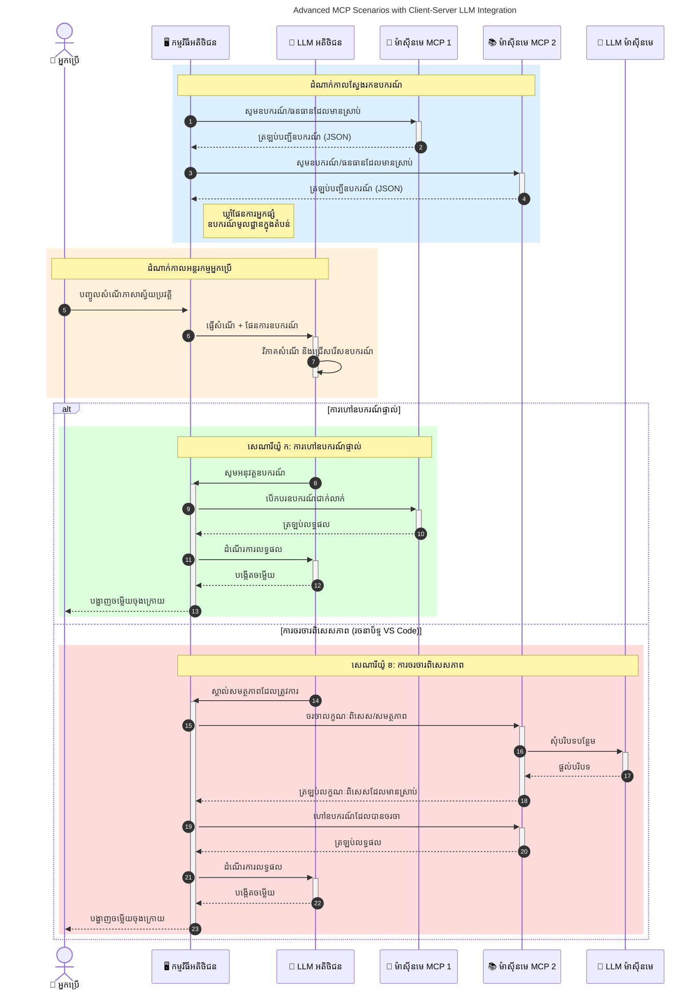

# ការណែនាំអំពីប្រព័ន្ធគន្លងបរិបទម៉ូដែល (MCP): ហេតុអ្វីបានជាវាសំខាន់សម្រាប់កម្មវិធី AI ដែលអាចពុលកម្រិតបាន

[](https://youtu.be/agBbdiOPLQA)

_(ចុចរូបភាពខាងលើដើម្បីមើលវីដេអូរបស់មេរៀននេះ)_

កម្មវិធី AI បង្កើតជា​ច្រើន​ជា​ជំហ៊ានមួយដ៏អស្ចារ្យ ពោលគឺវាលេងជាមួយអ្នកប្រើប្រាស់បានដោយប្រើការបញ្ជា​ភាសា​ធម្មជាតិ។ ប៉ុន្តែពេលវេលានិងធនធានចំណាយច្រើនដល់កម្មវិធីបែបនេះ អ្នកចង់ប្រាកដថាអាចបញ្ចូលមុខងារ និងធនធានបានយ៉ាងងាយស្រួល ដូច្នេះវាក៏មានភាពងាយស្រួលក្នុងការពង្រីក កម្មវិធីរបស់អ្នកអាចគ្រប់គ្រងម៉ូដែលជាច្រើន ហើយដោះស្រាយបញ្ហាប្រែប្រួលរបស់ម៉ូដែលផ្សេងៗគ្នា។ ជាសារសំខាន់ ការកសាងកម្មវិធី Gen AI គឺងាយស្រួលក្នុងការចាប់ផ្តើម ប៉ុន្តេលើកលែងវាធំរីករាលដាលនិងស្មុគស្មាញ អ្នកត្រូវចាប់ផ្តើមកំណត់រចនាសម្ព័ន្ធ និងប្រហែលជានឹងត្រូវពឹងផ្អែកលើស្តង់ដារដើម្បីធានាថាកម្មវិធីរបស់អ្នកត្រូវបានកសាងដោយវិធីសាស្ត្រត្រឹមត្រូវ។ ទីនេះគឺជាទីតាំងដែល MCP ចូលរួមដើម្បីរៀបចំរឿង និងផ្តល់ស្តង់ដារ។

---

## **🔍 ប្រព័ន្ធគន្លងបរិបទម៉ូដែល (MCP) គឺជាអ្វី?**

**ប្រព័ន្ធគន្លងបរិបទម៉ូដែល (MCP)** គឺជាផ្ទាំងអ្នកប្រើប្រាស់ស្តង់ដារបើក ដែលអនុញ្ញាតឱ្យម៉ូដែលភាសាធំៗ (LLMs) ប្រតិបត្តិជាមួយឧបករណ៍ខាងក្រៅ, API, និងប្រភពទិន្នន័យ ដោយឥតខ្ជិលខ្ជាយ។ វាបង្កើតរចនាសម្ព័ន្ធដែលលំអិតដើម្បីពង្រឹងមុខងារម៉ូដែល AI លើសពីទិន្នន័យបណ្តុះបណ្តាលរបស់ពួកវា ធ្វើឱ្យប្រព័ន្ធ AI មានការឆ្លើយតបខ្ពស់ និងអាចពុលកម្រិតបាន។

---

## **🎯 ហេតុអ្វីបានជាស្តង់ដារនៅក្នុង AI សំខាន់**

នៅពេលកម្មវិធី AI បង្កើតកាន់តែមានភាពស្មុគស្មាញ ការទទួលយកស្តង់ដារជា​អត្តិសញ្ញាណគឺជារឿងសំខាន់ ដើម្បីធានា **ការពុលកម្រិត, ភាពអាចពង្រីក, ការថែរក្សា** និង **ជៀសវាងការខ្ជះខ្ជាយទៅកាន់អ្នកផ្គត់ផ្គង់តែម្នាក់ឯង**។ MCP ដោះស្រាយតម្រូវការទាំងនេះដោយ៖

- ការរួមបញ្ចូលម៉ូដែល-ឧបករណ៍ឲ្យជាដំណាក់កាលតែមួយ
- ការកាត់បន្ថយដំណោះស្រាយប្តូរបែបមួយក្បាលដែលងាយខូច
- អនុញ្ញាតឲ្យម៉ូដែលពីអ្នកផ្គត់ផ្គង់នានារួមស្ថិតនៅក្នុងបរិយាកាសតែមួយ

**កំណត់ចំណាំ:** ទោះបី MCP សម្រេចយ៉ាងជាស្តង់ដារបើក ក៏គ្មានផែនការដើម្បីធ្វើស្តង់ដាររបស់ MCP តាមរយៈអង្គការស្តង់ដារដូចជា IEEE, IETF, W3C, ISO ឬអង្គការស្តង់ដារមួយណា។

---

## **📚 គោលបំណងការរៀន**

នៅចប់អត្ថបទនេះ អ្នកនឹងអាច:

- កំណត់និយមន័យ **ប្រព័ន្ធគន្លងបរិបទម៉ូដែល (MCP)** និងករណីប្រើប្រាស់របស់វា
- យល់ការបំពានស្តង់ដាររបស់ MCP សម្រាប់ការប្រាស្រ័យទាក់ទងម៉ូដែលទៅឧបករណ៍
- កំណត់ធាតុសំខាន់ៗនៃរចនាសម្ព័ន្ធ MCP
- ស្ទង់មើលកម្មវិធីពិតប្រាកដនៃ MCP នៅក្នុងឧស្សាហកម្មនិងបរិបទការអភិវឌ្ឍន៍

---

## **💡 ហេតុអ្វីបានជា MCP ជាឧបករណ៍ផ្លាស់ប្តូរ**

### **🔗 MCP ដោះស្រាយបញ្ហាការបំបែកក្នុងការប្រតិបត្តិ AI**

មុន MCP ការបញ្ចូលម៉ូដែលជាមួយឧបករណ៍ត្រូវការត kode ប្តូរដោយផ្ទាល់សម្រាប់គូឧបករណ៍-ម៉ូដែល៖

- កូដប្តូរតាមដំណើរការពិសេសសម្រាប់គូឧបករណ៍-ម៉ូដែល
- API មិនស្តង់ដារសម្រាប់អ្នកផ្គត់ផ្គង់នីមួយៗ
- បំបែកជាយូររ៉ាប់រ៉ាវដោយសារការអាប់ដេត
- ការចងក្រងយ៉ាងខ្សោយនៅពេលមានឧបករណ៍ច្រើន

### **✅ គុណសម្បត្តិរបស់ស្តង់ដារ MCP**

| **គុណសម្បត្តិ**          | **ការពិពណ៌នា**                                                             |
|--------------------------|-----------------------------------------------------------------------------|
| ភាពអាចប្រតិបត្តិរួមបាន   | LLMs ប្រតិបត្តិជាមួយឧបករណ៍នានា ពីអ្នកផ្គត់ផ្គង់ផ្សេងៗគ្នា                     |
| ភាពស្របច្បាប់           | អនុវត្តបទបញ្ជាម៉ូដម៉ូលទាំងមូលលើវេទិកានិងឧបករណ៍                           |
| ការប្រើប្រាស់ឡើងវិញ     | ឧបករណ៍ដែលបានបង្កើតមួយលើគឺអាចប្រើបានលើគម្រោងនិងប្រព័ន្ធផ្សេងៗ          |
| ការអភិវឌ្ឍលឿន           | កាត់បន្ថយពេលអភិវឌ្ឍដោយប្រើផ្ទាំងអ្នកប្រើប្រាស់ស្តង់ដា ដែលអាចភ្ជាប់ហើយលេងបានបន្ទាន់ |

---

## **🧱 សង្ខេបរចនាសម្ព័ន្ធ MCP នៅកម្រិតខ្ពស់**

MCP អនុវត្តម៉ូដែល **client-server model** ដែល៖

- **MCP Hosts** ដំណើរការ ម៉ូដែល AI
- **MCP Clients** ចាប់ផ្តើមសំណើ
- **MCP Servers** ផ្តល់បរិបទ, ឧបករណ៍, និងសមត្ថភាព

### **ធាតុសំខាន់ៗ:**

- **ធនធាន** – ទិន្នន័យស្ថិតិឬសកម្មសម្រាប់ម៉ូដែល  
- **បញ្ជា** – ដំណើរការបង្កើតដែលបានកំណត់មុនសម្រាប់មេរៀនបង្កើត  
- **ឧបករណ៍** – មុខងារអនុវត្តផ្ទាល់ដូចជា ស្វែងរក, គណនា  
- **ការជម្រុះ** – បែបធ្វើបែបប្រតិកម្មតាមជម្រើសដោយស្វ័យប្រវត្តិ (បានលុបចោលក្នុងជម្រើសបញ្ចេញ `2026-07-28`) 
- **ការស្វែងយក** – សំណើរ​ដោយម៉ាស៊ីនបម្រើសម្រាប់ព័ត៌មានអ្នកប្រើ  
- **ដើម** – ជ្រោយព្រេងប្រព័ន្ធឯកសារ សម្រាប់គ្រប់គ្រងការចូលប្រើ (បានលុបចោលក្នុងជម្រើសបញ្ចេញ `2026-07-28`) 

### **រចនាសម្ព័ន្ធស្តង់ដារ:**

MCP ប្រើរចនាសម្ព័ន្ធពីរជាន់:
- **ស្រទាប់ទិន្នន័យ**: ការប្រាស្រ័យទាក់ទងផ្ដល់តាម JSON-RPC 2.0 មានការគ្រប់គ្រងវដ្ដជីវិត និងមូលដ្ឋាន
- **ស្រទាប់ដឹកជញ្ជូន**: STDIO (មូលដ្ឋាន) និង HTTP ប្រើ Streamable ជាមួយ SSE (ពីចម្ងាយ) ជាឆានែលចរចារទិន្នន័យ

---

## របៀប MCP Servers ដំណើរការ

ម៉ាស៊ីនបម្រើ MCP ដំណើរការដូចខាងក្រោម:

- **លំនាំសំណើ**:
    1. សំណើត្រូវបានចាប់ផ្តើមដោយអ្នកប្រើប្រាស់ចុងក្រោយ ឬកម្មវិធីដែលដំណើរការជំនួស។
    2. **MCP Client** ផ្ញើសំណើទៅកាន់ **MCP Host** ដែលគ្រប់គ្រងពេលវេលារបស់ម៉ូដែល AI។
    3. **ម៉ូដែល AI** ទទួលបានបញ្ជារបស់អ្នកប្រើប្រាស់ ហើយអាចស្នើសុំពីឧបករណ៍ ឬទិន្នន័យខាងក្រៅតាមការហៅឧបករណ៍មួយឬច្រើន។
    4. **MCP Host**, មិនមែនម៉ូដែល​ផ្ទាល់, ប្រាស្រ័យទាក់ទងជាមួយ **MCP Server(s)** តាមប្រព័ន្ធស្តង់ដារ។
- **មុខងារ MCP Host**:
    - **បញ្ជីឈ្មោះឧបករណ៍**: រក្សាទុកបញ្ជីឧបករណ៍ដែលមាន និងសមត្ថភាពរបស់ពួកវា។
    - **ការផ្ទៀងផ្ទាត់សិទ្ធិ**: ផ្ទៀងផ្ទាត់សិទ្ធិការចូលប្រើឧបករណ៍។
    - **អ្នកដំណឹងសំណើ**: ដំណើរការសំណើឧបករណ៍ចូលពីម៉ូដែល។
    - **អ្នករៀបចំការឆ្លើយតប**: រៀបចំលទ្ធផលឧបករណ៍ក្នុងទ្រង់ទ្រាយដែលម៉ូដែលអាចយល់បាន។
- **ការប្រតិបត្តិការម៉ាស៊ីនបម្រើ MCP**:
    - **MCP Host** ផ្ញើការហៅឧបករណ៍ទៅកាន់មួយឬច្រើន **MCP Servers** ដែលបង្ហាញមុខងារពិសេស (ដូចជា ស្វែងរក, គណនា, សំណួរទិន្នន័យ)។
    - **MCP Servers** ប្រតិបត្តិការបានហើយតបលទ្ធផលទៅកាន់ **MCP Host** ក្នុងទ្រង់ទ្រាយឯកសារ។
    - **MCP Host** រៀបចំ និងផ្ញើលទ្ធផលទៅម៉ូដែល AI។
- **ការសម្រេចចិត្តចម្លើយ**:
    - **ម៉ូដែល AI** បញ្ចូលលទ្ធផលឧបករណ៍ក្នុងចម្លើយចុងក្រោយ។
    - **MCP Host** ផ្ញើចម្លើយនេះតបវិញទៅ **MCP Client** ដែលចែកចាយវាទៅអ្នកប្រើប្រាស់ចុងក្រោយឬកម្មវិធីហៅ។
    

```mermaid
---
title: MCP Architecture and Component Interactions
description: A diagram showing the flows of the components in MCP.
---
graph TD
    Client[អតិថិជន/កម្មវិធី MCP] -->|ផ្ញើសំណើ| H[ម្ចាស់ផ្ទះ MCP]
    H -->|ដំណើរការ| A[មួយគំរូ AI]
    A -->|សំណើការហៅឧបករណ៍| H
    H -->|MCP Protocol| T1[MCP Server Tool 01: ស្វែងរកវេបសាយ]
    H -->|MCP Protocol| T2[MCP Server Tool 02: ឧបករណ៍គណនាភាគ
    H -->|MCP Protocol| T3[MCP Server Tool 03: ឧបករណ៍ចូលប្រព័ន្ធទិន្នន័យ]
    H -->|MCP Protocol| T4[MCP Server Tool 04: ឧបករណ៍ប្រព័ន្ធឯកសារ]
    H -->|ផ្ញើការឆ្លើយតប| Client

    subgraph "កុំវិញគ្រឿងសង្ហារឹម MCP Host"
        H
        G[ការចុះបញ្ជីឧបករណ៍]
        I[ការផ្ទៀងផ្ទាត់]
        J[អ្នកដោះស្រាយសំណើ]
        K[អ្នករៀបចំការឆ្លើយតប]
    end

    H <--> G
    H <--> I
    H <--> J
    H <--> K

    style A fill:#f9d5e5,stroke:#333,stroke-width:2px
    style H fill:#eeeeee,stroke:#333,stroke-width:2px
    style Client fill:#d5e8f9,stroke:#333,stroke-width:2px
    style G fill:#fffbe6,stroke:#333,stroke-width:1px
    style I fill:#fffbe6,stroke:#333,stroke-width:1px
    style J fill:#fffbe6,stroke:#333,stroke-width:1px
    style K fill:#fffbe6,stroke:#333,stroke-width:1px
    style T1 fill:#c2f0c2,stroke:#333,stroke-width:1px
    style T2 fill:#c2f0c2,stroke:#333,stroke-width:1px
    style T3 fill:#c2f0c2,stroke:#333,stroke-width:1px
    style T4 fill:#c2f0c2,stroke:#333,stroke-width:1px
```

## 👨‍💻 របៀបបង្កើតម៉ាស៊ីនបម្រើ MCP (ជាមួយឧទាហរណ៍)

ម៉ាស៊ីនបម្រើ MCP អនុញ្ញាតឱ្យអ្នកពង្រីកសមត្ថភាព LLM ដោយផ្តល់ទិន្នន័យ និងមុខងារ។ 

ចង់សាកល្បងទេ? អ្នកអាចប្រើ SDK ជាលេខាវិភាគភាសា និង/ឬផ្នែកថ្នាក់ដែលមានឧទាហរណ៍ក្នុងការបង្កើតម៉ាស៊ីនបម្រើ MCP សាមញ្ញក្នុងភាសា/ផ្នែកថ្នាក់ផ្សេងៗខាងក្រោម៖

- **Python SDK**: https://github.com/modelcontextprotocol/python-sdk

- **TypeScript SDK**: https://github.com/modelcontextprotocol/typescript-sdk

- **Java SDK**: https://github.com/modelcontextprotocol/java-sdk

- **C#/.NET SDK**: https://github.com/modelcontextprotocol/csharp-sdk


## 🌍 ករណីប្រើប្រាស់ពិត MCP

MCP អនុញ្ញាតឱ្យកម្មវិធីជាច្រើនដោយពង្រីកសមត្ថភាព AI:

| **កម្មវិធី**              | **ការពិពណ៌នា**                                                                |
|------------------------------|--------------------------------------------------------------------------------|
| ការរួមបញ្ចូលទិន្នន័យសម្រាប់សហគ្រាស  | ភ្ជាប់ LLMs ទៅទិន្នន័យឃ្លាំង, CRM, ឬឧបករណ៍ក្នុងសហគ្រាស                             |
| ប្រព័ន្ធ AI ដែលមានតំណាងអាស័យដ្ឋាន           | អនុញ្ញាតឱ្យភ្នាក់ងារឯករាជ្យមានចូលប្រើឧបករណ៍ និងដំណើរការទម្រាំដំណើរការ                                                                 |
| កម្មវិធីចម្រុះមុខងារ     | បញ្ចូលអត្ថបទ, រូបភាព និងឧបករណ៍សំឡេងក្នុងកម្មវិធី AI ដែលតែមួយ                         |
| ការរួមបញ្ចូលទិន្នន័យពេលវេលាពិត   | នាំទិន្នន័យផ្ទាល់ទៅក្នុងប្រតិបត្តិការណ៍ AI សម្រាប់លទ្ធផលច្បាស់លាស់ និងទាន់សម័យ                 |


### 🧠 MCP = ស្តង់ដារសកលសម្រាប់ការប្រតិបត្ដិ AI

ប្រព័ន្ធគន្លងបរិបទម៉ូដែល (MCP) មានតួនាទីជាស្តង់ដារសកលសម្រាប់ការប្រតិបត្ដិ AI ដូចជា USB-C ដែលធ្វើស្តង់ដារការតភ្ជាប់រឹងសម្រាប់ឧបករណ៍។ នៅក្នុងពិភព AI MCP ផ្តល់ផ្ទាំងធ្វើការសាមញ្ញអាចសំរាប់ម៉ូដែល (client) ក្នុងការបញ្ចូលជាមួយឧបករណ៍ខាងក្រៅ និងអ្នកផ្គត់ផ្គង់ទិន្នន័យ (server)។ វាដកខ្លួនបញ្ហាចាំបាច់ប្រើប្រព័ន្ធបញ្ជាកម្ម-គ្នាផ្សេងៗសម្រាប់ API ឬប្រភពទិន្នន័យនីមួយ។

នៅក្រោម MCP, ឧបករណ៍ដែលគាំទ្រ MCP (ឯកឧទ្ធម្ភាគ MCP) អនុវត្តស្តង់ដារដូចគ្នា។ ម៉ាស៊ីនបម្រើទាំងនេះអាចបញ្ជីឧបករណ៍ ឬសកម្មភាពដែលវាចេញផ្សាយហើយអនុវត្តសកម្មភាពពេលមានការស្នើសុំពីភ្នាក់ងារសិប្បនិម្មិត។ វេទិកាភ្នាក់ងារដែលគាំទ្រ MCP អាចស្វែងរកឧបករណ៍ដែលមានពីម៉ាស៊ីនបម្រើ ហើយហៅឥលូវតាមប្រព័ន្ធស្តង់ដារនេះ។

### 💡 ជួយសម្រួលការចូលប្រើចំណេះដឹង

លើសពីផ្តល់ឧបករណ៍ MCP ក៏ជួយសម្រួលការចូលប្រើចំណេះដឹងផងដែរ។ វាអនុញ្ញាតឲ្យកម្មវិធីផ្តល់បរិបទទៅម៉ូដែលភាសាធំពីការចងក្រងជាមួយប្រភពទិន្នន័យផ្សេងៗ។ ឧទាហរណ៍ ម៉ាស៊ីនបម្រើ MCP មួយអាចតំណាងឲ្យឯកសាររបស់ក្រុមហ៊ុន ដោយអនុញ្ញាតឲ្យភ្នាក់ងារទាញយកព័ត៌មានដែលចាំបាច់។ ម៉ាស៊ីនបម្រើមួយទៀតអាចដោះស្រាយសកម្មភាពជាក់លាក់ដូចជាស៊ងសំបុត្រអ៊ីមែល ឬបន្ទាន់សម័យកំណត់ត្រា។ ពីមើលភ្នាក់ងារ វាជាឧបករណ៍ដែលវាអាចប្រើបាន — បណ្តាសកម្មភាពផ្តល់ទិន្នន័យ (បរិបទចំណេះដឹង) ខណៈដែលឧបករណ៍ផ្សេងទៀតអនុវត្តសកម្មភាពបាន។ MCP គ្រប់គ្រងទាំងពីរជាប្រសិទ្ធភាព។

ភ្នាក់ងារផ្សារភ្ជាប់ទៅម៉ាស៊ីនបម្រើ MCP ដោយស្វ័យប្រវត្តិរៀនអំពីសមត្ថភាពដែលអាចប្រើបាន និងទិន្នន័យដែលអាចចូលប្រើបានតាមរយៈទ្រង់ទ្រាយស្តង់ដារ។ ការស្តង់ដារនេះធ្វើឲ្យមានភាពស្វាគមន៍ក្នុងការផ្លាស់ប្តូរឧបករណ៍។ ឧទាហរណ៍ ការបន្ថែមម៉ាស៊ីនបម្រើ MCP ថ្មីទៅម៉ាស៊ីនរបស់ភ្នាក់ងារធ្វើឱ្យមុខងាររបស់វាអាចប្រើបានភ្លាមៗ ដោយមិនចាំបាច់កែសម្រួលការណែនាំរបស់ភ្នាក់ងារ។

ការចូលរួមសម្រួលនេះផ្គូរផ្គងទៅនឹងដំណើរការ ដែលម៉ាស៊ីនបម្រើផ្តល់មុខងារនិងចំណេះដឹងធានាថាការសហការដែលរលុងគ្នារវាងប្រព័ន្ធ។ 

### 👉 ឧទាហរណ៍៖ ដំណោះស្រាយភ្នាក់ងារដែលអាចពុលកម្រិត

```mermaid
---
title: Scalable Agent Solution with MCP
description: A diagram illustrating how a user interacts with an LLM that connects to multiple MCP servers, with each server providing both knowledge and tools, creating a scalable AI system architecture
---
graph TD
    User -->|ប្រសិនបើ| LLM
    LLM -->|ឆ្លើយតប| User
    LLM -->|MCP| ServerA
    LLM -->|MCP| ServerB
    ServerA -->|ប្រភពភ្ជាប់ទូទៅ| ServerB
    ServerA --> KnowledgeA
    ServerA --> ToolsA
    ServerB --> KnowledgeB
    ServerB --> ToolsB

    subgraph ម៉ាស៊ីនបម្រើ A
        KnowledgeA[ចំណេះដឹង]
        ToolsA[ឧបករណ៍]
    end

    subgraph ម៉ាស៊ីនបម្រើ B
        KnowledgeB[ចំណេះដឹង]
        ToolsB[ឧបករណ៍]
    end
```
អ្នកភ្ជាប់សកលអនុញ្ញាតឲ្យម៉ាស៊ីនបម្រើ MCP អាចប្រាស្រ័យទាក់ទង និងចែករំលែកសមត្ថភាពគ្នាបាន ដូច្នេះ ServerA អាចផ្ញើភារកិច្ចទៅ ServerB ឬចូលប្រើឧបករណ៍និងចំណេះដឹងរបស់វា។ នេះផ្គូរផ្គងឧបករណ៍ និងទិន្នន័យទាំងអស់រវាងម៉ាស៊ីនបម្រើ គាំទ្រ​ស្ថាបត្យកម្មភ្នាក់ងារបែបពុលកម្រិត និងបំបែកផ្នែក។ ដោយសារតែ MCP ស្តង់ដាភ្ជាប់អុកដ្ឋានឧបករណ៍ ឧបករណ៍អាចរកឃើញឆាប់តាមចរន្តស្នើសុំរវាងម៉ាស៊ីនបម្រើ ដោយមិនចាំបាច់បញ្ចូលភ្ជាប់រឹង។


ការតភ្ជាប់ឧបករណ៍និងចំណេះដឹង: អាចចូលឧបករណ៍និងទិន្នន័យបានតាមរយៈម៉ាស៊ីនបម្រើ ត្រូវបានគាំទ្រការតភ្ជាប់ល្អ និងមានរចនាសម្ព័ន្ធភ្នាក់ងារល្អ។

### 🔄 ស្ថានភាព MCP សំរាប់ភ្នាក់ងារជាមួយ LLM ខាងClient

លើសពីរចនាសម្ព័ន្ធ MCP មូលដ្ឋាន មានស្ថានភាពជាច្រើនដែលទាំងភ្នាក់ងារ និងម៉ាស៊ីនបម្រើមាន LLMs ដូច្នេះអាចប្រតិបត្តិនានាដែលស្មុគស្មាញ។ នៅក្នុងរូបភាពខាងក្រោម **កម្មវិធី Client** អាចជាឧបករណ៍ IDE មានឧបករណ៍ MCP ច្រើនសម្រាប់ប្រើប្រាស់ដោយ LLM:



## 🔐 គុណសម្បត្តិបញ្ញាពិត MCP

បញ្ញាពិតនៃការប្រើ MCP មានដូចខាងក្រោម៖

- **ភាពទាន់សម័យ**: ម៉ូដែលអាចចូលមើលព័ត៌មានដែលទាន់សម័យលើសពីទិន្នន័យបណ្តុះបណ្តាល
- **ការពង្រីកសមត្ថភាព**: ម៉ូដែលអាចប្រើឧបករណ៍ពិសេសសម្រាប់ភារកិច្ចដែលមិនបានបណ្តុះ
- **កាត់បន្ថយការស្រមៃមិនពិត**: ប្រភពទិន្នន័យខាងក្រៅផ្ដល់មូលដ្ឋានពិតប្រាកដ
- **ភាពឯកជន**: ទិន្នន័យដែលរឺសារៈសំខាន់អាចរក្សាទុកក្នុងបរិវេណសុវត្ថិភាពដោយមិនបញ្ចូលក្នុងបញ្ជា

## 📌 ចំណុចចម្បងសង្ខេប

ដូចខាងក្រោមជាចំណុចចម្បងសម្រាប់ការប្រើ MCP:

- **MCP** ស្តង់ដារថាបែបណាម៉ូដែល AI ប្រាស្រ័យជាមួយឧបករណ៍និងទិន្នន័យ
- ផ្សព្វផ្សាយ **ភាពអាចពង្រីក, ភាពសំគាល់ និងភាពអាចប្រតិបត្តិរួមបាន**
- MCP ជួយ **កាត់បន្ថយពេលអភិវឌ្ឍ, បង្កើនភាពជឿជាក់, និងពង្រីកសមត្ថភាពម៉ូដែល**
- រចនាសម្ព័ន្ធ client-server **អនុញ្ញាតកម្មវិធី AI ដែលបតបែន និងអាចពង្រីកបាន**

## 🧠 ការអនុវត្ត

សូមគិតអំពីកម្មវិធី AI ដែលអ្នកចាប់អារម្មណ៍បង្កើត។

- អ្វីទៅជា **ឧបករណ៍ ឬទិន្នន័យខាងក្រៅ** ដែលអាចពង្រឹងសមត្ថភាពរបស់វា?
- MCP អាចធ្វើឱ្យការរួមបញ្ចូល **ងាយស្រួល និងមានភាពជឿជាក់កាន់តែខ្ពស់យ៉ាងដូចម្តេច?**

## អ្នកធនធានបន្ថែម

- [ផ្ទាំងគ្រប់គ្រង MCP GitHub](https://github.com/modelcontextprotocol)


## តើបន្ទាប់ពីនេះ

បន្ទាប់៖ [ជំពូក 1៖ គំនិតគ្រឹះ](../01-CoreConcepts/README.md)

---

<!-- CO-OP TRANSLATOR DISCLAIMER START -->
**ការបដិសេធ**:
ឯកសារនេះត្រូវបានបម្លែងភាសា ដោយប្រើសេវាបម្លែងភាសា AI [Co-op Translator](https://github.com/Azure/co-op-translator)។ ទោះយើងខ្ញុំមានក្តីប្រាថ្នាឱ្យបានច្បាស់លាស់ តែសូមយល់ដឹងថាការបម្លែងដោយស្វ័យប្រវត្តិក៏អាចមានកំហុសឬភាពមិនត្រឹមត្រូវ។ ឯកសារដើមជាភាសាទីតាំងគួរត្រូវបានគេប្រើជាប្រភពច្បាស់លាស់។ សម្រាប់ព័ត៌មានសំខាន់ៗ សូមណែនាំឱ្យប្រើប្រាស់ការប្រែដោយមនុស្សជំនាញ។ យើងខ្ញុំមិនទទួលខុសត្រូវចំពោះការយល់ច្រឡំ ឬការបកស្រាយខុសបន្ទាប់ពីការប្រើប្រាស់ការបម្លែងនេះនោះទេ។
<!-- CO-OP TRANSLATOR DISCLAIMER END -->