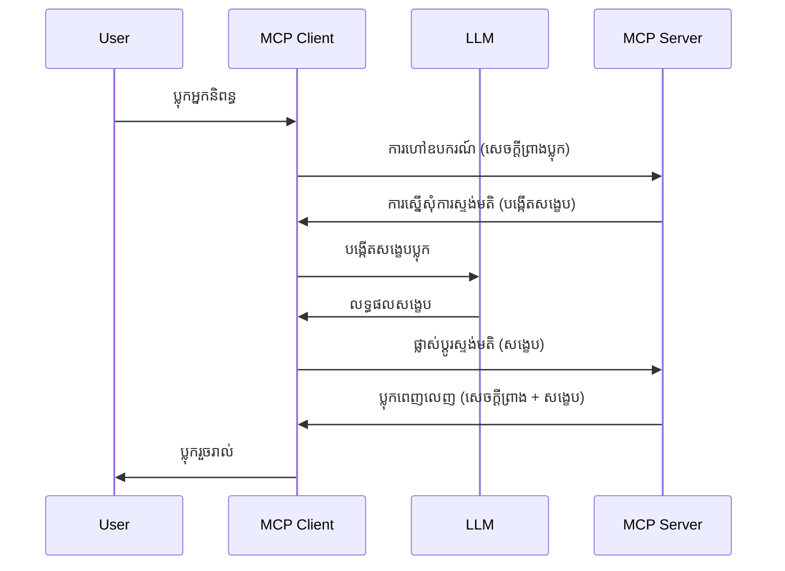

> [ដាច់ចោល៖ 2026-07-28 បេក្ខជនចេញផ្សាយ](https://blog.modelcontextprotocol.io/posts/2026-07-28-release-candidate/)

# ការដកសំគាល់ - ផ្ញើភារកិច្ចទៅអតិថិជន

> **បញ្ចូលជូនដំណឹង៖** បេក្ខជនចេញផ្សាយ MCP ជា `2026-07-28` បានសម្គាល់ការដកសម្គាល់ Sampling ជារូបមន្តអតិផរណា ដើម្បីប្តូរទៅការរួមបញ្ចូលផ្ទាល់ជាមួយ API អ្នកផ្គត់ផ្គង់ LLM។ Sampling នឹងនៅប្រើបាននៅក្នុង `2025-11-25` និងយ៉ាងហោចណាស់មួយឆ្នាំបន្ថែមបន្ទាប់ពីការដកសម្គាល់ផ្លូវការណាមួយ ដូច្នេះរឿងទាំងអស់នៅក្នុងមេរៀននេះនៅតែមានតម្លាភាព — ប៉ុន្តែការរចនាថ្មីរបស់ម៉ាស៊ីនម៉ោនគួរត្រូវបានវាយតម្លៃទំរង់ប្តូរ។ មើល [អ្វីដែលកំពុងផ្លាស់ប្តូរនៅ MCP៖ បេក្ខជនចេញផ្សាយ 2026-07-28](../../01-CoreConcepts/mcp-2026-07-28-release-candidate.md)។

ពេលខ្លះ អ្នកត្រូវការកម្មវិធី MCP Client និង MCP Server ប្រព័ន្ធសហការគ្នាដើម្បីសម្រេចបានគោលបំណងរួម។ អ្នកអាចមានករណីដែលម៉ាស៊ីនម៉ោនត្រូវការជំនួយពី LLM ដែលមាននៅលើអតិថិជន។ សម្រាប់ករណីនេះ Sampling គឺជាអ្វីដែលអ្នកគួរត្រូវប្រើ។

យើងមកសាកល្បងករណីប្រើប្រាស់ខ្លះៗ ហើយរបៀបសាងសង់ដំណោះស្រាយដែលមាន Sampling។

## ទិដ្ឋភាពទូទៅ

ក្នុងមេរៀននេះ យើងផ្ដោតជាពិសេសលើពេលណា និងកន្លែងណា ដែលគួរប្រើ Sampling និងរបៀបកំណត់រចនាសម្ព័ន្ធវា។

## គោលបំណងកំណត់អោយរៀន

ក្នុងជំពូកនេះ យើងនឹង:

- ពន្យល់អំពី Sampling ជាអ្វី និងពេលណាគួរប្រើវា។
- បង្ហាញរបៀបកំណត់រចនាសម្ព័ន្ធ Sampling នៅក្នុង MCP។
- ផ្ដល់ឧទាហរណ៍នៃការប្រើ Sampling ដោយអនុវត្ត។

## Sampling ជាអ្វី ហើយហេតុអ្វីត្រូវប្រើវា?

Sampling ជាផ្នែកលក្ខណៈខ្ពស់ដែលដំណើរការដូចខាងក្រោម៖



### សំណើ Sampling

យល់ដឹងហើយពីទិដ្ឋភាពមួយដែលគួរឲ្យជឿទុកចិត្ត យើងមកនិយាយអំពីសំណើ Sampling ដែលម៉ាស៊ីនម៉ោនផ្ញើត្រឡប់ទៅអតិថិជន។ នេះជារបៀបដែលសំណើវាអាចមានទ្រង់ទ្រាយ JSON-RPC៖

```json
{
  "jsonrpc": "2.0",
  "id": 1,
  "method": "sampling/createMessage",
  "params": {
    "messages": [
      {
        "role": "user",
        "content": {
          "type": "text",
          "text": "Create a blog post summary of the following blog post: <BLOG POST>"
        }
      }
    ],
    "modelPreferences": {
      "hints": [
        {
          "name": "claude-3-sonnet"
        }
      ],
      "intelligencePriority": 0.8,
      "speedPriority": 0.5
    },
    "systemPrompt": "You are a helpful assistant.",
    "maxTokens": 100
  }
}
```

មានរឿងខ្លះៗនៅទីនេះដែលសម្រាប់ហៅចេញ៖

- Prompt, មុខងាររបស់ខ្លួនដែលមាន នៅក្រោម content -> text គឺជាពាក្យជាក់លាក់សម្រាប់ LLM ដើម្បីសង្ខេបមាតិការប្លុក។

- **modelPreferences**។ ផ្នែកនេះគឺជាការរើស ពីការណែនាំនៃការកំណត់រចនាសម្ព័ន្ធដែលគួរប្រើជាមួយ LLM។ អ្នកប្រើអាចជ្រើសរើសតាមការណែនាំនេះ ឬប្ដូរវា។ ក្នុងករណីនេះ មានការណែនាំអំពីម៉ូដែលដែលគួរប្រើ ល្បឿន និងអាទិភាពភាពចំណេះដឹង។
- **systemPrompt**, វាជាពាក្យផ្លូវការប្រព័ន្ធដែលផ្តល់និស្ស័យដល់ LLM របស់អ្នក និងមានការណែនាំដឹកនាំ។
- **maxTokens**, នេះជាគុណលក្ខណៈមួយផ្សេងទៀតដែលប្រើសម្រាប់ប្រាប់ថាត្រូវប្រើប៉ុន្មានលេខកូដសម្រាប់ភារកិច្ចនេះ។

### ចម្លើយ Sampling

ចម្លើយនេះជាវីធីដែល MCP Client ផ្ញើត្រឡប់ទៅ MCP Server ដែលជាលទ្ធផលពីការហៅ LLM របស់អតិថិជន រង់ចាំចម្លើយហើយបង្កើតសារ។ នេះជារបៀបដែលវាអាចទៅក្នុង JSON-RPC៖

```json
{
  "jsonrpc": "2.0",
  "id": 1,
  "result": {
    "role": "assistant",
    "content": {
      "type": "text",
      "text": "Here's your abstract <ABSTRACT>"
    },
    "model": "gpt-5",
    "stopReason": "endTurn"
  }
}
```

សំគាល់របៀបចម្លើយជាសង្ខេបនៃប្លុកបង្ហាញដូចដែលយើងបានស្នើសុំ។ ក៏សំគាល់ថា ម៉ូដែលដែលបានប្រើមិនមែនជាអ្វីដែលយើងបានស្នើទេ ប៉ុន្តែ "gpt-5" ជាជំលង់លើ "claude-3-sonnet"។ នេះបង្ហាញថាអ្នកប្រើអាចប្ដូរអំនិតនៅលើអ្វីដែលត្រូវប្រើ ហើយសំណើ Sampling របស់អ្នកគ្រាន់តែជាការណែនាំ។

យល់ហើយពីលំហូរចម្បង និងភារកិច្ចប្រើសម្រាប់ "បង្កើតបណ្ដុំនៃប្លុក + សង្ខេប", យើងមកមើលថាត្រូវធ្វើអ្វីដើម្បីឲ្យវាដំណើរការ។

### ប្រភេទសារ

សារនៃ Sampling មិនបិទខ្ទប់ត្រឹមតែអក្សរប៉ុណ្ណោះទេ ប៉ុន្តែអ្នកអាចផ្ញើររូបភាព និងសំលេងផងដែរ។ នេះជារបៀបមើល JSON-RPC ដែលផ្សេងគ្នា៖

**អត្ថបទ**

```json
{
  "type": "text",
  "text": "The message content"
}
```

**មាតិការូបភាព**

```json
{
  "type": "image",
  "data": "base64-encoded-image-data",
  "mimeType": "image/jpeg"
}
```

**មាតិកាសំលេង**

```json
{
  "type": "audio",
  "data": "base64-encoded-audio-data",
  "mimeType": "audio/wav"
}
```

> សម្គាល់៖ សម្រាប់ព័ត៌មានលម្អិតបន្ថែមអំពី Sampling សូមមើល [ឯកសារផ្លូវការជាផ្លូវការ](https://modelcontextprotocol.io/specification/2025-11-25/client/sampling)

## របៀបកំណត់រចនាសម្ព័ន្ធ Sampling នៅក្នុង Client

> សម្គាល់៖ ប្រសិនបើអ្នកកំពុងបង្កើតម៉ាស៊ីនម៉ោនតែម្ដង អ្នកមិនចាំបាច់ធ្វើច្រើននៅទីនេះទេ។

នៅក្នុង client អ្នកត្រូវបញ្ជាក់លក្ខណៈដូចខាងក្រោម៖

```json
{
  "capabilities": {
    "sampling": {}
  }
}
```

វានឹងត្រូវបានជ្រើសរើសនៅពេល client ដែលអ្នកជ្រើសរើសចាប់ផ្តើមជាមួយម៉ាស៊ីនម៉ោន។

## ឧទាហរណ៍នៃ Sampling ក្នុងសកម្មភាព - បង្កើតប្រកាស​ប្លុក

យើងមកសរសេរម៉ាស៊ីនម៉ោន sampling ប្រកបដោយសហការគ្នា អ្នកត្រូវការធ្វើដូចខាងក្រោម៖

1. បង្កើតឧបករណ៍នៅលើម៉ាស៊ីនម៉ោន។
1. ឧបករណ៍នោះគួរបង្កើតសំណើ sampling
1. ឧបករណ៍គួររង់ចាំការឆ្លើយតប sampling ពី client។
1. បន្ទាប់មកផលលទ្ធផលឧបករណ៍គួរត្រូវផលិត។

យើងមកមើលកូដជាជំណែកៗ៖

### -1- បង្កើតឧបករណ៍

**python**

```python
@mcp.tool()
async def create_blog(title: str, content: str, ctx: Context[ServerSession, None]) -> str:
    """Create a blog post and generate a summary"""

```

### -2- បង្កើតសំណើ sampling

ពង្រីកឧបករណ៍របស់អ្នកជាមួយកូដខាងក្រោម៖

**python**

```python
post = BlogPost(
        id=len(posts) + 1,
        title=title,
        content=content,
        abstract=""
    )

prompt = f"Create an abstract of the following blog post: title: {title} and draft: {content} "

result = await ctx.session.create_message(
        messages=[
            SamplingMessage(
                role="user",
                content=TextContent(type="text", text=prompt),
            )
        ],
        max_tokens=100,
)

```

### -3- រង់ចាំចម្លើយ និងត្រឡប់ចម្លើយ

**python**

```python
post.abstract = result.content.text

posts.append(post)

# ត្រឡប់ផលិតផលពេញលេញ
return json.dumps({
    "id": post.title,
    "abstract": post.abstract
})
```

### -4- កូដពេញលេញ

**python**

```python
from starlette.applications import Starlette
from starlette.routing import Mount, Host

from mcp.server.fastmcp import Context, FastMCP

from mcp.server.session import ServerSession
from mcp.types import SamplingMessage, TextContent

import json


from uuid import uuid4
from typing import List
from pydantic import BaseModel


mcp = FastMCP("Blog post generator")

# app = FastAPI()

posts = []

class BlogPost(BaseModel):
    id: int
    title: str
    content: str
    abstract: str

posts: List[BlogPost] = []

@mcp.tool()
async def create_blog(title: str, content: str, ctx: Context[ServerSession, None]) -> str:
    """Create a blog post and generate a summary"""

    post = BlogPost(
        id=len(posts) + 1,
        title=title,
        content=content,
        abstract=""
    )

    prompt = f"Create an abstract of the following blog post: title: {title} and draft: {content} "

    result = await ctx.session.create_message(
        messages=[
            SamplingMessage(
                role="user",
                content=TextContent(type="text", text=prompt),
            )
        ],
        max_tokens=100,
    )

    post.abstract = result.content.text

    posts.append(post)

    # ត្រឡប់អត្តបទប្លុកពេញលេញ
    return json.dumps({
        "id": post.title,
        "abstract": post.abstract
    })

if __name__ == "__main__":
    print("Starting server...")
    # mcp.run()
    mcp.run(transport="streamable-http")

# ប្រតិបត្តិកម្មកម្មវិធីជាមួយ: python server.py
```

### -5- សាកល្បងវា​នៅ Visual Studio Code

ដើម្បីសាកល្បងវានៅក្នុង Visual Studio Code សូមធ្វើដូចខាងក្រោម៖

1. ចាប់ផ្តើមម៉ាស៊ីនម៉ោនក្នុង terminal
1. បន្ថែមវានៅក្នុង *mcp.json* (ហើយធានាចាប់ផ្តើមហើយ) ដូចខាងក្រោម៖

   ```json
   "servers": {
      "blog-server": {
        "type": "http",
        "url": "http://localhost:8000/mcp"
      }
   }
   ```

1. សរសេរ prompt:

   ```text
   create a blog post named "Where Python comes from", the content is "Python is actually named after Monty Python Flying Circus"
   ```

1. អនុញ្ញាតឲ្យ sampling រត់។ ពេលផ្តើមធ្វើតេស្តនេះ អ្នកនឹងបានឃើញបន្ទប់ប្រកាសបន្ថែមដែលអ្នកត្រូវទទួលយក បន្ទាប់មកអ្នកនឹងឃើញបន្ទប់ប្រកាសធម្មតាសម្រាប់ស្នើការត្រូវប្រើឧបករណ៍។

1. ពិនិត្យលទ្ធផល។ អ្នកនឹងឃើញលទ្ធផលបានបង្ហាញយ៉ាងស្អាតក្នុង GitHub Copilot Chat ប៉ុន្តែអ្នកក៏អាចពិនិត្យចម្លើយ JSON ដើមបានផងដែរ។

**រង្វាន់**។ កម្មវិធីទំហំ Visual Studio Code មានជំនួយល្អសម្រាប់ sampling។ អ្នកអាចកំណត់ការចូលប្រើ Sampling នៅលើម៉ាស៊ីនម៉ោនដែលបានដំឡើង ដោយទៅកាន់ដូចខាងក្រោម៖

1. ទៅផ្នែកបន្ថែម។
1. ជ្រើសរើសរូបតំណាង cog សម្រាប់ម៉ាស៊ីនម៉ោនដែលបានដំឡើងនៅផ្នែក "MCP SERVERS - INSTALLED"។
1 ជ្រើស "Configure Model Access", នៅទីនេះអ្នកអាចជ្រើសម៉ូដែលដែល GitHub Copilot គួរត្រូវបានអនុញ្ញាតឲ្យប្រើប្រាស់ពេលធ្វើ sampling។ អ្នកក៏អាចមើលសំណើ sampling ទាំងអស់ដែលកើតឡើងថ្មីៗដោយជ្រើស "Show Sampling requests"។

## ការងារ

ក្នុងការងារនេះ អ្នកនឹងបង្កើតការ sampling ខ្លះខុសគ្នាគឺការរួមបញ្ចូល sampling ដែលគាំទ្រការបង្កើតពិពណ៌នាផលិតផល។ នេះជាអាគាររបស់អ្នក៖

**ស្ថានការណ៍**: មន្រ្តីបន្ទប់ក្រោយនៃហាងអេឡិចត្រូនិចត្រូវការជំនួយ ព្រោះវាត្រូវការពេលវេលាច្រើននៅក្នុងការបង្កើតពិពណ៌នាផលិតផល។ ដូចនេះ អ្នកត្រូវសាងសង់រួមបញ្ចូលដែលអាចហៅឧបករណ៍ "create_product" ជាមួយ "title" និង "keywords" ជាអ argumento និងវាគួរត្រូវផលិតផលិតផលពេញលេញ រួមមានវាល "description" ដែលគួរត្រូវបានបំពេញដោយ LLM នៃអតិថិជន។

គន្លឹះ៖ ប្រើអ្វីដែលអ្នកបានរៀនមុននេះដើម្បីបង្កើតម៉ាស៊ីនម៉ោននេះ និងឧបករណ៍របស់វាដោយប្រើសំណើ sampling។

## ដំណោះស្រាយ

[ដំណោះស្រាយ](./solution/README.md)

## ចំណុចមួយចំនួនគួរចងចាំ

Sampling គឺជាលក្ខណៈមានអំណាចដែលអនុញ្ញាតឲ្យម៉ាស៊ីនម៉ោនផ្ញើភារកិច្ចទៅអតិថិជន ពេលវាត្រូវការជំនួយពី LLM។

## តើអ្វីទៅជាជំហានបន្ទាប់

- [ជំពូក 4 - អនុវត្តជាក់ស្តែង](../../04-PracticalImplementation/README.md)

---

<!-- CO-OP TRANSLATOR DISCLAIMER START -->
**ការបដិសេធ**:
ឯកសារនេះត្រូវបានបម្លែងភាសា ដោយប្រើសេវាបម្លែងភាសា AI [Co-op Translator](https://github.com/Azure/co-op-translator)។ ទោះយើងខ្ញុំមានក្តីប្រាថ្នាឱ្យបានច្បាស់លាស់ តែសូមយល់ដឹងថាការបម្លែងដោយស្វ័យប្រវត្តិក៏អាចមានកំហុសឬភាពមិនត្រឹមត្រូវ។ ឯកសារដើមជាភាសាទីតាំងគួរត្រូវបានគេប្រើជាប្រភពច្បាស់លាស់។ សម្រាប់ព័ត៌មានសំខាន់ៗ សូមណែនាំឱ្យប្រើប្រាស់ការប្រែដោយមនុស្សជំនាញ។ យើងខ្ញុំមិនទទួលខុសត្រូវចំពោះការយល់ច្រឡំ ឬការបកស្រាយខុសបន្ទាប់ពីការប្រើប្រាស់ការបម្លែងនេះនោះទេ។
<!-- CO-OP TRANSLATOR DISCLAIMER END -->