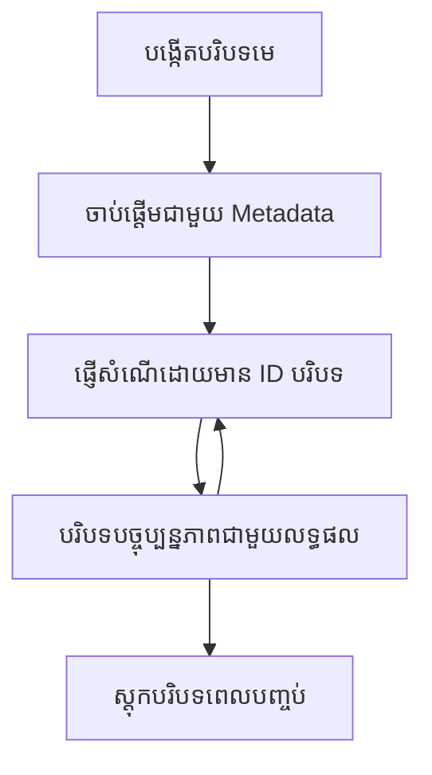

> [ផុតកំណត់ប្រើប្រាស់: មេរៀនបោះពុម្ពផ្សាយ ២០២៦-០៧-២៨](https://blog.modelcontextprotocol.io/posts/2026-07-28-release-candidate/#roots-sampling-and-logging-are-deprecated)

# រដ្ឋបាលមូលដ្ឋាន MCP

> **សេចក្តីជូនដំណឹងអំពីការប៉ាន់ប៉ងបាត់បង់:** មេរៀនបោះពុម្ពផ្សាយ MCP សម្រាប់ការបញ្ចេញលក្ខណៈពិសេស `2026-07-28` បានពិពណ៌នាថារ៉ុតស្តើង (Roots) គឺជារបស់ផុតកំណត់ជំនួសដោយប៉ារ៉ាម៉ែត្រឧបករណ៍, URI ប្រភពទិន្នន័យ ឬកំណត់រចនាសម្ព័ន្ធម៉ាស៊ីនបម្រើ។ Roots នៅតែអាចប្រតិបត្តិបាននៅក្នុង `2025-11-25` និងយ៉ាងហោចណាស់មួយឆ្នាំបន្ទាប់ពីការប៉ាន់ប្រមាណផុតកំណត់ផ្លូវការ ដូច្នេះអ្វីៗក្នុងមេរៀននេះនៅតែត្រឹមត្រូវ - ប៉ុន្តែការរចនាម៉ាស៊ីនបម្រើថ្មីគួរតែពិចារណាគំរូជំនួស។ មើលបន្ថែមនៅ [អ្វីខ្លះកំពុងផ្លាស់ប្តូរនៅក្នុង MCP: មេរៀនបោះពុម្ពផ្សាយ ២០២៦-០៧-២៨](../../01-CoreConcepts/mcp-2026-07-28-release-candidate.md)។

រដ្ឋបាលមូលដ្ឋានគឺជាគំនិតមូលដ្ឋានមួយក្នុង Model Context Protocol ដើម្បីផ្តល់ស្រទាប់ដំណើរការផ្ទុកបន្តខ្សែភាពយន្តនៃការសន្ទនា និងស្ថានភាពចែករំលែករវាងសំណើនិងកម្សាន្តជាច្រើន។

## ការណែនាំ

នៅមេរៀននេះ យើងនឹងសិក្សាអំពីរបៀបបង្កើតគ្រប់គ្រង និងប្រើប្រាស់រដ្ឋបាលមូលដ្ឋាននៅក្នុង MCP។

## គោលបំណងការរៀន

នៅចប់មេរៀននេះ អ្នកនឹងអាច៖

- យល់ដឹងអំពីគោលបំណង និងរចនាសម្ព័ន្ធរដ្ឋបាលមូលដ្ឋាន
- បង្កើតនិងគ្រប់គ្រងរដ្ឋបាលមូលដ្ឋានដោយប្រើបណ្ណាល័យម៉ាស៊ីនភ្ញៀវ MCP
- អនុវត្តរដ្ឋបាលមូលដ្ឋាននៅក្នុងកម្មវិធី .NET, Java, JavaScript និង Python
- ប្រើរដ្ឋបាលមូលដ្ឋានសម្រាប់ការសន្ទនាច្រើនជំហាន និងការគ្រប់គ្រងស្ថានភាព
- អនុវត្តអនុស្សរូបល្អសម្រាប់ការគ្រប់គ្រងរដ្ឋបាលមូលដ្ឋាន

## ការយល់ដឹងអំពីរដ្ឋបាលមូលដ្ឋាន

រដ្ឋបាលមូលដ្ឋានបម្រើជាធុងបំពង់ដែលផ្ទុកប្រវត្តិសំណួរនិងស្ថានភាពសម្រាប់អន្តរកម្មជាប់ទាក់ទងមួយ។ វាអាចធ្វើអោយ៖

- **ការរក្សាសន្ទនាជាប់ទាក់បច្រើនជំហាន**៖ ការរក្សាសន្ទនាដែលមានលំនាំសំខាន់
- **ការគ្រប់គ្រងអង្គចងចាំ**៖ ការផ្ទុក និងទាញយកព័ត៌មានក្នុងអំឡុងការអន្តរកម្ម
- **ការគ្រប់គ្រងស្ថានភាព**៖ ការតាមដានការវិវត្តក្នុងដំណើរការលំបាក
- **ការចែករំលែក Context**៖ អនុញ្ញាតឲ្យម៉ាស៊ីនភ្ញៀវច្រើនអាចជួបប្រទៈនូវស្ថានភាពសន្ទនាដូចគ្នា

នៅក្នុង MCP រដ្ឋបាលមូលដ្ឋានមានលក្ខណៈសំខាន់ៗទាំងនេះ៖

- រាល់រដ្ឋបាលមូលដ្ឋានមានអត្តសញ្ញាណដដែលមួយ។
- អាចមានប្រវត្តិសន្ទនា, ចំណូលចិត្តរបស់អ្នកប្រើ និងមេតាដាតា ផ្សេងទៀត។
- អាចបង្កើត ចូលដំណើរការ និងស្ដុកទុកឡើងវិញបានតាមតម្រូវការ។
- គាំទ្រការត្រួតពិនិត្យចំណូលដំណើរការយ៉ាងម៉ត់ចត់ និង សិទ្ធិប្រើប្រាស់។

## អាយុកាលរបស់រដ្ឋបាលមូលដ្ឋាន



## ការប្រើប្រាស់រដ្ឋបាលមូលដ្ឋាន

នៅទីនេះជាគំរូនៃរបៀបបង្កើតនិងគ្រប់គ្រងរដ្ឋបាលមូលដ្ឋាន។

### ការអនុវត្ត C#

```csharp
// .NET Example: Root Context Management
using Microsoft.Mcp.Client;
using System;
using System.Threading.Tasks;
using System.Collections.Generic;

public class RootContextExample
{
    private readonly IMcpClient _client;
    private readonly IRootContextManager _contextManager;
    
    public RootContextExample(IMcpClient client, IRootContextManager contextManager)
    {
        _client = client;
        _contextManager = contextManager;
    }
    
    public async Task DemonstrateRootContextAsync()
    {
        // 1. Create a new root context
        var contextResult = await _contextManager.CreateRootContextAsync(new RootContextCreateOptions
        {
            Name = "Customer Support Session",
            Metadata = new Dictionary<string, string>
            {
                ["CustomerName"] = "Acme Corporation",
                ["PriorityLevel"] = "High",
                ["Domain"] = "Cloud Services"
            }
        });
        
        string contextId = contextResult.ContextId;
        Console.WriteLine($"Created root context with ID: {contextId}");
        
        // 2. First interaction using the context
        var response1 = await _client.SendPromptAsync(
            "I'm having issues scaling my web service deployment in the cloud.", 
            new SendPromptOptions { RootContextId = contextId }
        );
        
        Console.WriteLine($"First response: {response1.GeneratedText}");
        
        // Second interaction - the model will have access to the previous conversation
        var response2 = await _client.SendPromptAsync(
            "Yes, we're using containerized deployments with Kubernetes.", 
            new SendPromptOptions { RootContextId = contextId }
        );
        
        Console.WriteLine($"Second response: {response2.GeneratedText}");
        
        // 3. Add metadata to the context based on conversation
        await _contextManager.UpdateContextMetadataAsync(contextId, new Dictionary<string, string>
        {
            ["TechnicalEnvironment"] = "Kubernetes",
            ["IssueType"] = "Scaling"
        });
        
        // 4. Get context information
        var contextInfo = await _contextManager.GetRootContextInfoAsync(contextId);
        
        Console.WriteLine("Context Information:");
        Console.WriteLine($"- Name: {contextInfo.Name}");
        Console.WriteLine($"- Created: {contextInfo.CreatedAt}");
        Console.WriteLine($"- Messages: {contextInfo.MessageCount}");
        
        // 5. When the conversation is complete, archive the context
        await _contextManager.ArchiveRootContextAsync(contextId);
        Console.WriteLine($"Archived context {contextId}");
    }
}
```

ក្នុងកូដមុននេះ យើងបាន:

1. បង្កើតរដ្ឋបាលមូលដ្ឋានសម្រាប់កិច្ចប្រជុំគាំទ្រអតិថិជនមួយ។
1. ផ្ញើសារជាច្រើនក្នុងនោះ ដើម្បីអោយម៉ូដែលរក្សាស្ថានភាពបាន។
1. ធ្វើបច្ចុប្បន្នភាពរដ្ឋបាលជាមួយមេតាដាតាដែលពាក់ព័ន្ធផ្អែកលើសន្ទនា។
1. ទាញយកព្រឹត្តិប័ត្ររដ្ឋបាលដើម្បីយល់ពីប្រវត្តិសន្ទនា។
1. ស្ដុកទុករដ្ឋបាលនៅពេលការសន្ទនាបញ្ចប់។

## គំរូ៖ ការអនុវត្តរដ្ឋបាលសម្រាប់វិភាគហិរញ្ញវត្ថុ

ក្នុងគំរូនេះ យើងនឹងបង្កើតរដ្ឋបាលមូលដ្ឋានសម្រាប់កិច្ចប្រជុំវិភាគហិរញ្ញវត្ថុមួយ ដើម្បីបង្ហាញរបៀបរក្សាស្ថានភាពរវាងអន្តរកម្មជាច្រើន។

### ការអនុវត្ត Java

```java
// ឧទាហរណ៍ Java: ការអនុវត្តបរិបទមេ
package com.example.mcp.contexts;

import com.mcp.client.McpClient;
import com.mcp.client.ContextManager;
import com.mcp.models.RootContext;
import com.mcp.models.McpResponse;

import java.util.HashMap;
import java.util.Map;
import java.util.UUID;

public class RootContextsDemo {
    private final McpClient client;
    private final ContextManager contextManager;
    
    public RootContextsDemo(String serverUrl) {
        this.client = new McpClient.Builder()
            .setServerUrl(serverUrl)
            .build();
            
        this.contextManager = new ContextManager(client);
    }
    
    public void demonstrateRootContext() throws Exception {
        // បង្កើតមេតាឌាតាបរិបទ
        Map<String, String> metadata = new HashMap<>();
        metadata.put("projectName", "Financial Analysis");
        metadata.put("userRole", "Financial Analyst");
        metadata.put("dataSource", "Q1 2025 Financial Reports");
        
        // 1. បង្កើតបរិបទមេថ្មី
        RootContext context = contextManager.createRootContext("Financial Analysis Session", metadata);
        String contextId = context.getId();
        
        System.out.println("Created context: " + contextId);
        
        // 2. ការប៉ះពាល់ដំបូង
        McpResponse response1 = client.sendPrompt(
            "Analyze the trends in Q1 financial data for our technology division",
            contextId
        );
        
        System.out.println("First response: " + response1.getGeneratedText());
        
        // 3. អាប់ដេតបរិបទជាមួយព័ត៌មានសំខាន់ដែលទទួលបានពីការឆ្លើយតប
        contextManager.addContextMetadata(contextId, 
            Map.of("identifiedTrend", "Increasing cloud infrastructure costs"));
        
        // ការប៉ះពាល់ទីពីរ - ប្រើបរិបទដដែល
        McpResponse response2 = client.sendPrompt(
            "What's driving the increase in cloud infrastructure costs?",
            contextId
        );
        
        System.out.println("Second response: " + response2.getGeneratedText());
        
        // 4. បង្កើតសេចក្ដីសង្ខេបនៃវេទិកាធ្វើវិភាគ
        McpResponse summaryResponse = client.sendPrompt(
            "Summarize our analysis of the technology division financials in 3-5 key points",
            contextId
        );
        
        // រក្សាទុកសេចក្ដីសង្ខេបនៅក្នុងមេតាឌាតាបរិបទ
        contextManager.addContextMetadata(contextId, 
            Map.of("analysisSummary", summaryResponse.getGeneratedText()));
            
        // ទទួលព័ត៌មានបរិបទដែលបានអាប់ដេត
        RootContext updatedContext = contextManager.getRootContext(contextId);
        
        System.out.println("Context Information:");
        System.out.println("- Created: " + updatedContext.getCreatedAt());
        System.out.println("- Last Updated: " + updatedContext.getLastUpdatedAt());
        System.out.println("- Analysis Summary: " + 
            updatedContext.getMetadata().get("analysisSummary"));
            
        // 5. សន្សំព័ត៌មានបរិបទពេលបញ្ចប់
        contextManager.archiveContext(contextId);
        System.out.println("Context archived");
    }
}
```

ក្នុងកូដមុននេះ យើងបាន:

1. បង្កើតរដ្ឋបាលមូលដ្ឋានសម្រាប់កិច្ចប្រជុំវិភាគហិរញ្ញវត្ថុមួយ។
2. ផ្ញើសារជាច្រើននៅក្នុងនោះ ដើម្បីអោយម៉ូដែលរក្សាស្ថានភាពបាន។
3. ធ្វើបច្ចុប្បន្នភាពរដ្ឋបាលជាមួយមេតាដាតាដែលពាក់ព័ន្ធផ្អែកលើសន្ទនា។
4. បង្កើតសេចក្តីសង្ខេបនៃកិច្ចប្រជុំវិភាគហិរញ្ញវត្ថុនិងរក្សាទុកវានៅក្នុងមេតាដាតារដ្ឋបាល។
5. ស្ដុកទុករដ្ឋបាលនៅពេលសន្ទនាបញ្ចប់។

## គំរូ៖ ការគ្រប់គ្រងរដ្ឋបាលមូលដ្ឋាន

ការគ្រប់គ្រងរដ្ឋបាលមូលដ្ឋានយ៉ាងមានប្រសិទ្ធភាពគឺសំខាន់សម្រាប់ការរក្សាប្រវត្តិសន្ទនានិងស្ថានភាព។ ខាងក្រោមជាគំរូរបៀបអនុវត្តការគ្រប់គ្រងរដ្ឋបាលមូលដ្ឋាន។

### ការអនុវត្ត JavaScript

```javascript
// ឧទាហរណ៍ JavaScript: គ្រប់គ្រង MCP Root Contexts
const { McpClient, RootContextManager } = require('@mcp/client');

class ContextSession {
  constructor(serverUrl, apiKey = null) {
    // បង្ហោះ MCP client
    this.client = new McpClient({
      serverUrl,
      apiKey
    });
    
    // បង្ហោះ context manager
    this.contextManager = new RootContextManager(this.client);
  }
  
  /**
   * Create a new conversation context
   * @param {string} sessionName - Name of the conversation session
   * @param {Object} metadata - Additional metadata for the context
   * @returns {Promise<string>} - Context ID
   */
  async createConversationContext(sessionName, metadata = {}) {
    try {
      const contextResult = await this.contextManager.createRootContext({
        name: sessionName,
        metadata: {
          ...metadata,
          createdAt: new Date().toISOString(),
          status: 'active'
        }
      });
      
      console.log(`Created root context '${sessionName}' with ID: ${contextResult.id}`);
      return contextResult.id;
    } catch (error) {
      console.error('Error creating root context:', error);
      throw error;
    }
  }
  
  /**
   * Send a message in an existing context
   * @param {string} contextId - The root context ID
   * @param {string} message - The user's message
   * @param {Object} options - Additional options
   * @returns {Promise<Object>} - Response data
   */
  async sendMessage(contextId, message, options = {}) {
    try {
      // ផ្ញើសារប្រើ context ដែលបានបញ្ជាក់
      const response = await this.client.sendPrompt(message, {
        rootContextId: contextId,
        temperature: options.temperature || 0.7,
        allowedTools: options.allowedTools || []
      });
      
      // ជាជម្រើសផ្ទុកចំណេះដឹងដែលមានតំលៃពីការសន្ទនា
      if (options.storeInsights) {
        await this.storeConversationInsights(contextId, message, response.generatedText);
      }
      
      return {
        message: response.generatedText,
        toolCalls: response.toolCalls || [],
        contextId
      };
    } catch (error) {
      console.error(`Error sending message in context ${contextId}:`, error);
      throw error;
    }
  }
  
  /**
   * Store important insights from a conversation
   * @param {string} contextId - The root context ID
   * @param {string} userMessage - User's message
   * @param {string} aiResponse - AI's response
   */
  async storeConversationInsights(contextId, userMessage, aiResponse) {
    try {
      // ដកចេញចំណេះដឹងសក្តានុពល (ក្នុងកម្មវិធីពិត នេះនឹងមានភាពចម្រូងចម្រាសជាងនេះ)
      const combinedText = userMessage + "\n" + aiResponse;
      
      // លក្ខណៈពិសេសសាមញ្ញសម្រាប់សម្គាល់ចំណេះដឹងសក្តានុពល
      const insightWords = ["important", "key point", "remember", "significant", "crucial"];
      
      const potentialInsights = combinedText
        .split(".")
        .filter(sentence => 
          insightWords.some(word => sentence.toLowerCase().includes(word))
        )
        .map(sentence => sentence.trim())
        .filter(sentence => sentence.length > 10);
      
      // រក្សាទុកចំណេះដឹងនៅក្នុង context metadata
      if (potentialInsights.length > 0) {
        const insights = {};
        potentialInsights.forEach((insight, index) => {
          insights[`insight_${Date.now()}_${index}`] = insight;
        });
        
        await this.contextManager.updateContextMetadata(contextId, insights);
        console.log(`Stored ${potentialInsights.length} insights in context ${contextId}`);
      }
    } catch (error) {
      console.warn('Error storing conversation insights:', error);
      // កំហុសមិនសំខាន់ ដូច្នេះគ្រាន់តែចុះកំណត់ក្នុង warning
    }
  }
  
  /**
   * Get summary information about a context
   * @param {string} contextId - The root context ID
   * @returns {Promise<Object>} - Context information
   */
  async getContextInfo(contextId) {
    try {
      const contextInfo = await this.contextManager.getContextInfo(contextId);
      
      return {
        id: contextInfo.id,
        name: contextInfo.name,
        created: new Date(contextInfo.createdAt).toLocaleString(),
        lastUpdated: new Date(contextInfo.lastUpdatedAt).toLocaleString(),
        messageCount: contextInfo.messageCount,
        metadata: contextInfo.metadata,
        status: contextInfo.status
      };
    } catch (error) {
      console.error(`Error getting context info for ${contextId}:`, error);
      throw error;
    }
  }
  
  /**
   * Generate a summary of the conversation in a context
   * @param {string} contextId - The root context ID
   * @returns {Promise<string>} - Generated summary
   */
  async generateContextSummary(contextId) {
    try {
      // ស្នើម៉ូដែលបង្កើតសង្ខេបនៃការសន្ទនារហូតមកដល់ពេលនេះ
      const response = await this.client.sendPrompt(
        "Please summarize our conversation so far in 3-4 sentences, highlighting the main points discussed.",
        { rootContextId: contextId, temperature: 0.3 }
      );
      
      // រក្សាទុកសង្ខេបនៅក្នុង context metadata
      await this.contextManager.updateContextMetadata(contextId, {
        conversationSummary: response.generatedText,
        summarizedAt: new Date().toISOString()
      });
      
      return response.generatedText;
    } catch (error) {
      console.error(`Error generating context summary for ${contextId}:`, error);
      throw error;
    }
  }
  
  /**
   * Archive a context when it's no longer needed
   * @param {string} contextId - The root context ID
   * @returns {Promise<Object>} - Result of the archive operation
   */
  async archiveContext(contextId) {
    try {
      // បង្កើតសង្ខេបចុងក្រោយមុនពេលបញ្ចូលសារពើភ័ណ្ឌ
      const summary = await this.generateContextSummary(contextId);
      
      // បញ្ចូល context ដោយសារពើភ័ណ្ឌ
      await this.contextManager.archiveContext(contextId);
      
      return {
        status: "archived",
        contextId,
        summary
      };
    } catch (error) {
      console.error(`Error archiving context ${contextId}:`, error);
      throw error;
    }
  }
}

// លទ្ធផលឧទាហរណ៍
async function demonstrateContextSession() {
  const session = new ContextSession('https://mcp-server-example.com');
  
  try {
    // 1. បង្កើត context ថ្មីសម្រាប់ការសន្ទនាសម្របសម្រួលផលិតផល
    const contextId = await session.createConversationContext(
      'Product Support - Database Performance',
      {
        customer: 'Globex Corporation',
        product: 'Enterprise Database',
        severity: 'Medium',
        supportAgent: 'AI Assistant'
      }
    );
    
    // 2. សារដំបូងក្នុងការសន្ទនា
    const response1 = await session.sendMessage(
      contextId,
      "I'm experiencing slow query performance on our database cluster after the latest update.",
      { storeInsights: true }
    );
    console.log('Response 1:', response1.message);
    
    // សារតាមដាននៅក្នុង context ដូចគ្នា
    const response2 = await session.sendMessage(
      contextId,
      "Yes, we've already checked the indexes and they seem to be properly configured.",
      { storeInsights: true }
    );
    console.log('Response 2:', response2.message);
    
    // 3. ទទួលព័ត៌មានអំពី context
    const contextInfo = await session.getContextInfo(contextId);
    console.log('Context Information:', contextInfo);
    
    // 4. បង្កើត និងបង្ហាញសង្ខេបការសន្ទនា
    const summary = await session.generateContextSummary(contextId);
    console.log('Conversation Summary:', summary);
    
    // 5. បញ្ចូល context ទៅសារពើភ័ណ្ឌពេលបានធ្វើរួច
    const archiveResult = await session.archiveContext(contextId);
    console.log('Archive Result:', archiveResult);
    
    // 6. ដោះស្រាយកំហុសអោយមានភាពទន់ភ្លន់
  } catch (error) {
    console.error('Error in context session demonstration:', error);
  }
}

demonstrateContextSession();
```

ក្នុងកូដមុននេះ យើងបាន:

1. បង្កើតរដ្ឋបាលមូលដ្ឋានសម្រាប់ការសន្ទនាគាំទ្រផលិតផលដោយប្រើមុខងារ `createConversationContext`។ ករណីនេះ រដ្ឋាភិបាលគឺជាពីអំពីបញ្ហាសមត្ថភាពប្រតិបត្ដិការព័ត៌មានក្នុងមូលដ្ឋានទិន្នន័យ។

1. ផ្ញើសារជាច្រើននៅក្នុងនោះ ដើម្បីអោយម៉ូដែលរក្សាស្ថានភាពបានជាមួយមុខងារ `sendMessage`។ សារដែលផ្ញើមានទាក់ទង់ទៅនឹងការស្រាបនិងកំណត់វិញសន្ទស្សន៍។

1. ធ្វើបច្ចុប្បន្នភាពរដ្ឋបាលជាមួយមេតាដាតាដែលពាក់ព័ន្ធផ្អែកលើសន្ទនា។

1. បង្កើតសេចក្តីសង្ខេបនៃសន្ទនានិងរក្សាទុកវានៅក្នុងមេតាដាតារដ្ឋបាលដោយប្រើមុខងារ `generateContextSummary`។

1. ស្ដុកទុករដ្ឋបាលនៅពេលសន្ទនាបញ្ចប់ដោយប្រើមុខងារ `archiveContext`។

1. ដោះស្រាយករណីកំហុសយ៉ាងច្បាស់លាស់ដើម្បីធានាថាមានភាពរឹងមាំ។

## រដ្ឋបាលមូលដ្ឋានសម្រាប់ជំនួយច្រើនជំហាន

ក្នុងគំរូនេះ យើងនឹងបង្កើតរដ្ឋបាលមូលដ្ឋានសម្រាប់កិច្ចប្រជុំជំនួយច្រើនជំហាន ដើម្បីបង្ហាញរបៀបរក្សាស្ថានភាពរវាងអន្តរកម្មជាច្រើន។

### ការអនុវត្ត Python

```python
# ឧទាហរណ៍ Python៖ បរិបទមូលដ្ឋានសម្រាប់ជំនួយច្រើនជាសន្ទាត់
import asyncio
from datetime import datetime
from mcp_client import McpClient, RootContextManager

class AssistantSession:
    def __init__(self, server_url, api_key=None):
        self.client = McpClient(server_url=server_url, api_key=api_key)
        self.context_manager = RootContextManager(self.client)
    
    async def create_session(self, name, user_info=None):
        """Create a new root context for an assistant session"""
        metadata = {
            "session_type": "assistant",
            "created_at": datetime.now().isoformat(),
        }
        
        # បន្ថែមព័ត៌មានអ្នកប្រើបើមានផ្តល់
        if user_info:
            metadata.update({f"user_{k}": v for k, v in user_info.items()})
            
        # បង្កើតបរិបទមូលដ្ឋាន
        context = await self.context_manager.create_root_context(name, metadata)
        return context.id
    
    async def send_message(self, context_id, message, tools=None):
        """Send a message within a root context"""
        # បង្កើតជម្រើសជាមួយ ID បរិបទ
        options = {
            "root_context_id": context_id
        }
        
        # បន្ថែមឧបករណ៍បើបានបញ្ជាក់
        if tools:
            options["allowed_tools"] = tools
        
        # ផ្ញើបញ្ជារបស់ក្នុងបរិបទ
        response = await self.client.send_prompt(message, options)
        
        # បន្ទាន់សម័យព័ត៌មានមេតាដាតាដោយមានការរីកចម្រើននៃការសន្ទនា
        await self.context_manager.update_context_metadata(
            context_id,
            {
                f"message_{datetime.now().timestamp()}": message[:50] + "...",
                "last_interaction": datetime.now().isoformat()
            }
        )
        
        return response
    
    async def get_conversation_history(self, context_id):
        """Retrieve conversation history from a context"""
        context_info = await self.context_manager.get_context_info(context_id)
        messages = await self.client.get_context_messages(context_id)
        
        return {
            "context_info": context_info,
            "messages": messages
        }
    
    async def end_session(self, context_id):
        """End an assistant session by archiving the context"""
        # បង្កើតបញ្ជាសង្ខេបជាមុនសិន
        summary_response = await self.client.send_prompt(
            "Please summarize our conversation and any key points or decisions made.",
            {"root_context_id": context_id}
        )
        
        # រក្សាទុកសង្ខេបលើមេតាដាតា
        await self.context_manager.update_context_metadata(
            context_id,
            {
                "summary": summary_response.generated_text,
                "ended_at": datetime.now().isoformat(),
                "status": "completed"
            }
        )
        
        # ចម្លងបរិបទទៅឯកសារ
        await self.context_manager.archive_context(context_id)
        
        return {
            "status": "completed",
            "summary": summary_response.generated_text
        }

# ឧទាហរណ៍ប្រើប្រាស់
async def demo_assistant_session():
    assistant = AssistantSession("https://mcp-server-example.com")
    
    # 1. បង្កើតសម័យ
    context_id = await assistant.create_session(
        "Technical Support Session",
        {"name": "Alex", "technical_level": "advanced", "product": "Cloud Services"}
    )
    print(f"Created session with context ID: {context_id}")
    
    # 2. អន្តរកម្មដំបូង
    response1 = await assistant.send_message(
        context_id, 
        "I'm having trouble with the auto-scaling feature in your cloud platform.",
        ["documentation_search", "diagnostic_tool"]
    )
    print(f"Response 1: {response1.generated_text}")
    
    # អន្តរកម្មទីពីរនៅក្នុងបរិបទដូចគ្នា
    response2 = await assistant.send_message(
        context_id,
        "Yes, I've already checked the configuration settings you mentioned, but it's still not working."
    )
    print(f"Response 2: {response2.generated_text}")
    
    # 3. ទទួលបានប្រវត្តិ
    history = await assistant.get_conversation_history(context_id)
    print(f"Session has {len(history['messages'])} messages")
    
    # 4. បញ្ចប់សម័យ
    end_result = await assistant.end_session(context_id)
    print(f"Session ended with summary: {end_result['summary']}")

if __name__ == "__main__":
    asyncio.run(demo_assistant_session())
```

ក្នុងកូដមុននេះ យើងបាន:

1. បង្កើតរដ្ឋបាលមូលដ្ឋានសម្រាប់កិច្ចប្រជុំគាំទ្របច្ចេកទេសដោយប្រើមុខងារ `create_session`។ រដ្ឋបាលនេះរួមបញ្ចូលព័ត៌មានអ្នកប្រើដូចជា ឈ្មោះ និងកម្រិតបច្ចេកទេស។

1. ផ្ញើសារជាច្រើនក្នុងនោះ ដើម្បីអោយម៉ូដែលរក្សាស្ថានភាពបានជាមួយមុខងារ `send_message`។ សារដែលផ្ញើគឺអំពីបញ្ហាជាមួយមុខងារ auto-scaling។

1. ទាញយកប្រវត្តិសន្ទនាដោយប្រើមុខងារ `get_conversation_history` ដែលផ្តល់ព័ត៌មានរដ្ឋបាលនិងសារក្នុងការសន្ទនា។

1. បញ្ចប់វគ្គដោយស្ដុកទុករដ្ឋបាលនិងបង្កើតសេចក្តីសង្ខេបដោយប្រើមុខងារ `end_session`។ សេចក្តីសង្ខេបនោះនឹងចាប់យកចំណុចសំខាន់ពីសន្ទនា។

## អនុស្សរូបល្អសម្រាប់រដ្ឋបាលមូលដ្ឋាន

ទីនេះមានអនុស្សរូបល្អខ្លះៗសម្រាប់ការគ្រប់គ្រងរដ្ឋបាលមូលដ្ឋានយ៉ាងមានប្រសិទ្ធភាព៖

- **បង្កើតរដ្ឋាភិបាលផ្តោតលើមុខដំណែង**៖ បង្កើតរដ្ឋបាលផ្តាច់មុខសម្រាប់គោលបំណងសន្ទនាផ្សេងៗឬដែនដី ដើម្បីរក្សាប្អូនភាព។

- **កំណត់គោលការណ៍ផុតកំណត់**៖ អនុវត្តគោលការណ៍ស្តុកទុកឬលុបបំបាត់រដ្ឋបាលចាស់ៗសម្រាប់គ្រប់គ្រងការផ្ទុក និងគោរពតាមគោលការណ៍រក្សាទុកទិន្នន័យ។

- **ផ្ទុកមេតាដាតាដែលពាក់ព័ន្ធ**៖ ប្រើមេតាដាតារដ្ឋបាលសម្រាប់ផ្ទុកព័ត៌មានសំខាន់អំពីសន្ទនាដែលអាចមានប្រយោជន៍ក្នុងពេលក្រោយ។

- **ប្រើអត្តសញ្ញាណរដ្ឋបាលយ៉ាងស្មុគស្មាញ**៖ នៅពេលដែលរដ្ឋបាលត្រូវបានបង្កើត ប្រើអត្តសញ្ញាណរបស់វាអោយជាប់ជាភាពក្នុងសំណើទាំងអស់ដើម្បីរក្សាប្រចាំភាព។

- **បង្កើតសេចក្ដីសង្ខេប**៖ នៅពេលរដ្ឋបាលដុះធំ សូមពិចារណាបង្កើតសេចក្ដីសង្ខេបដើម្បីចាប់យកព័ត៌មានសំខាន់ ខណៈដែលគ្រប់គ្រងទំហំរដ្ឋបាល។

- **អនុវត្តការត្រួតពិនិត្យចូលប្រើ**៖ សម្រាប់ប្រព័ន្ធអតិថិជនច្រើន អនុវត្តការត្រួតពិនិត្យចូលប្រើត្រឹមត្រូវ ដើម្បីធានាសុវត្ថិភាពនិងភាពឯកជនរបស់រដ្ឋបាលសន្ទនា។

- **ដោះស្រាយកំណត់ការរដ្ឋបាល**៖ មានការយល់ដឹងអំពីកំណត់ទំហំរដ្ឋបាល និងអនុវត្តយុទ្ធសាស្រ្តដើម្បីដោះស្រាយករណីសន្ទនាដែលយូរណាស់ណាស់។

- **ស្ដុកទុកពេលបញ្ចប់**៖ ស្ដុកទុករដ្ឋបាលពេលដែលសន្ទនាបញ្ចប់ ដើម្បីផ្តកខ្សែភាពយន្តក៏ដូចជាបង្ហាញប្រវត្តិសន្ទនា។

## តើតើអ្វីជាការបន្តបន្ទាប់

- [5.5 Routing](../mcp-routing/README.md)

---

<!-- CO-OP TRANSLATOR DISCLAIMER START -->
**ការបដិសេធ**:
ឯកសារនេះត្រូវបានបម្លែងភាសា ដោយប្រើសេវាបម្លែងភាសា AI [Co-op Translator](https://github.com/Azure/co-op-translator)។ ទោះយើងខ្ញុំមានក្តីប្រាថ្នាឱ្យបានច្បាស់លាស់ តែសូមយល់ដឹងថាការបម្លែងដោយស្វ័យប្រវត្តិក៏អាចមានកំហុសឬភាពមិនត្រឹមត្រូវ។ ឯកសារដើមជាភាសាទីតាំងគួរត្រូវបានគេប្រើជាប្រភពច្បាស់លាស់។ សម្រាប់ព័ត៌មានសំខាន់ៗ សូមណែនាំឱ្យប្រើប្រាស់ការប្រែដោយមនុស្សជំនាញ។ យើងខ្ញុំមិនទទួលខុសត្រូវចំពោះការយល់ច្រឡំ ឬការបកស្រាយខុសបន្ទាប់ពីការប្រើប្រាស់ការបម្លែងនេះនោះទេ។
<!-- CO-OP TRANSLATOR DISCLAIMER END -->