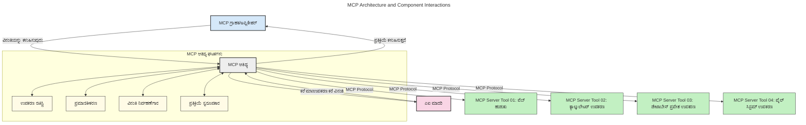
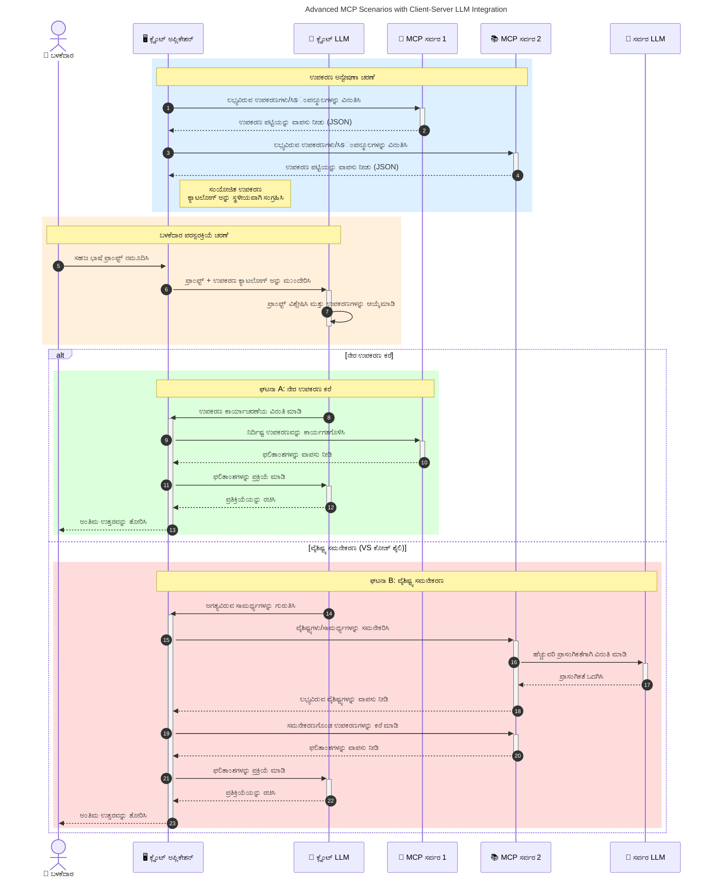

# ಮಾದರಿ ಸಂದರ್ಭದಲ್ಲಿ ಪ್ರೋಟೋಕಾಲ್ (MCP) ಪರಿಚಯ: ಸ್ಕೇಲಬಲ್ AI ಅಪ್ಲಿಕೇಶನ್‌ಗಳಿಗೆ ಅದರ ಮಹತ್ವ ಏಕೆ

[](https://youtu.be/agBbdiOPLQA)

_(ಈ ಪಾಠದ ವೀಡಿಯೊವನ್ನು ವೀಕ್ಷಿಸಲು ಮೇಲಿನ ಚಿತ್ರವನ್ನು ಕ್ಲಿಕ್ ಮಾಡಿ)_

ಜನರೇಟಿವ್ AI ಅಪ್ಲಿಕೇಶನ್‌ಗಳು ಬಳಕೆದಾರರಿಗೆ ಸಹಜ ಭಾಷಾ ಪ್ರಾಂಪ್ಟ್‌ಗಳ ಬಳಕೆ ಮೂಲಕ ಅಪ್ಲಿಕೇಶನ್ ಜೊತೆ ಸಂವಹನ ಮಾಡುವ ಅವಕಾಶವನ್ನು ನೀಡುವ ಉತ್ತಮ ಮೆಲುಕುಗಳು. ಆದರೆ, ಹೆಚ್ಚು ಸಮಯ ಮತ್ತು ಸಂಪನ್ಮೂಲಗಳನ್ನು ಈತ ಮುಖಾಂತರ ಹೂಡಿಕೆ ಮಾಡುತ್ತಿದ್ದಂತೆ, ನೀವು ಕಾರ್ಯಕ್ಷಮತೆಗಳು ಮತ್ತು ಸಂಪನ್ಮೂಲಗಳನ್ನು ಸುಲಭವಾಗಿ ಅಳವಡಿಸಿಕೊಳ್ಳುವಂತೆ ಮಾಡಬೇಕು, ನಿಮ್ಮ ಅಪ್ಲಿಕೇಶನ್ ಬಹುಮಾದರಿ ಬಳಕೆ ಮಾಡಬಹುದಾದ ಮತ್ತು ವಿವಿಧ ಮಾದರಿ ವೈಶಿಷ್ಟ್ಯತೆಯನ್ನು ನಿರ್ವಹಿಸುವುದು ಸುಲಭವಾಗಬೇಕಾಗಿದೆ.简而言之，Gen AI ಅಪ್ಲಿಕೇಶನ್‌ಗಳನ್ನು ನಿರ್ಮಿಸುವುದು ಆರಂಭದಲ್ಲಿ ಸುಲಭ, ಆದರೆ ಅವು ಬೆಳೆಯುವುದಾಗಿದ್ದು ಮತ್ತು ಹೆಚ್ಚು ಸಂಕೀರ್ಣವಾಗುತ್ತಿರುವಾಗ ನೀವು ವಾಸ್ತವ ವಿನ್ಯಾಸವನ್ನು ನಿರ್ಧರಿಸಬೇಕಾಗುತ್ತದೆ ಮತ್ತು ನಿಮ್ಮ ಅಪ್ಲಿಕೇಶನ್‌ಗಳ ಸಾಂಕೇತಿಕ ನಿರ್ಮಾಣವನ್ನು ನಿಶ್ಚಿತಪಡಿಸಲು ಒಂದು ಮಾನಕವನ್ನು ಅವಲಂಬಿಸಬೇಕಾಗುತ್ತದೆ. ಇಲ್ಲಿ MCP ಸಂಗತಿಗಳನ್ನು ಸಂಘಟಿಸುವು ಮತ್ತು ಒಂದು ಮಾನಕವನ್ನು ಒದಗಿಸುವು ಮೂಲಕ ಸಹಾಯ ಮಾಡುತ್ತದೆ.

---

## **🔍 ಮಾದರಿ ಸಂದರ್ಭದಲ್ಲಿ ಪ್ರೋಟೋಕಾಲ್ (MCP) ಎಂದರೇನು?**

**ಮಾದರಿ ಸಂದರ್ಭದಲ್ಲಿ ಪ್ರೋಟೋಕಾಲ್ (MCP)** ಒಂದು **ತಿರಸ್ಕೃತ, ಮಾನ್ಯವಾಗಿರುವ ಇಂಟರ್ಫೇಸ್** ಆಗಿದ್ದು, ದೊಡ್ಡ ಭಾಷಾ ಮಾದರಿಗಳು (LLMs) ಬಾಹ್ಯ ಸಾಧನಗಳು, API ಗಳು, ಮತ್ತು ಡೇಟಾ ಮೂಲಗಳೊಂದಿಗೆ ಸುಗಮವಾಗಿ ಸಂವಹನ ಮಾಡಿಕೊಳ್ಳಲು ಅನುಮತಿಸುತ್ತದೆ. ಇದು AI ಮಾದರಿಯ ಕಾರ್ಯಕ್ಷಮತೆಯನ್ನು ಅವರ ತರಬೇತಿ ಡೇಟಾವಿಗಿಂತ ಮುಂದುವರಿಸಿ, ಬುದ್ಧಿವಂತಿಕೆ, ಸ್ಕೇಲಬಿಲಿಟಿ ಮತ್ತು ಹೆಚ್ಚು ಪ್ರತಿಕ್ರಿಯಾಶೀಲ AI ವ್ಯವಸ್ಥೆಗಳನ್ನು ಅಭಿವೃದ್ಧಿಪಡಿಸಲು ಸ್ಥಿರ معماري ಒದಗಿಸುತ್ತದೆ.

---

## **🎯 AI ನಲ್ಲಿ ಮಾನಕರೀಕರಣವು ಮಹತ್ವಪೂರ್ಣವಾದದ್ದು ಏಕೆ**

ಜನರೇಟಿವ್ AI ಅಪ್ಲಿಕೇಶನ್‌ಗಳು ಹೆಚ್ಚು ಸಂಕೀರ್ಣವಾಗುತ್ತಿದ್ದಂತೆ, **ಸ್ಕೇಲಬಿಲಿಟಿ, ವಿಸ್ತರಣೀಯತೆ, ನಿರ್ವಹಣೆ ಸಾಧ್ಯತೆ** ಮತ್ತು **ವಿಚಾರಕರ ಸ್ಥಿತಿಮರ್ಯಾದೆಯನ್ನು ತಪ್ಪಿಸುವುದು** ನಿಯಮಿತವಾಗಿಸುವ ಮಾನಕರನ್ನು ಅಳವಡಿಸುವುದು ಅತ್ಯಗತ್ಯ. MCP ಈ ಅವಶ್ಯಕತೆಗಳನ್ನು ಈ ಕೆಳಗಿನಂತೆ ನಿಭಾಯಿಸುತ್ತದೆ:

- ಮಾದರಿ-ಸಾಧನೀಕರಣ ಸಂಯೋಜನೆಗಳನ್ನು ಏಕೀಕೃತಗೊಳಿಸುವುದು
- ಬಿರುಕು ಇರುವ, ಒಂದೇ ಬಾರಿ ಸೃಷ್ಟಿಯಾದ ಅಸ್ವಾಭಾವಿಕ ಪರಿಹಾರಗಳನ್ನು ಕಡಿಮೆ ಮಾಡುವುದು
- ಭಿನ್ನವು ವಿತರಕರಿಂದ ಬಹುಮಾದರಿಗಳು ಒಂದೇ ಪರಿಸರದಲ್ಲಿ ಒಟ್ಟಾಗಿ ಇರಲು ಅವಕಾಶ ನೀಡುವುದು

**ಗುರುತಿಸಿ:** MCP ತನ್ನನ್ನು ತೆರೆಯಲಾದ ಮಾನಕವಾಗಿ ಪರಿಗಣಿಸಿದರೂ, IEEE, IETF, W3C, ISO ಅಥವಾ ಯಾವುದೇ ಇತರ ಮಾನಕ ಸಂಸ್ಥೆಗಳ ಮೂಲಕ MCP ಅನ್ನು ಮಾನಕರೀಕರಿಸುವ ಯಾವ ಯೋಜನೆಗಳೂ ಇಲ್ಲ.

---

## **📚 ಕಲಿಕೆ ಗುರಿಗಳು**

ಈ ಲೇಖನದ ಅಂತ್ಯಕ್ಕೆ ನೀವು ಸಾಧ್ಯವಾಗುವುದು:

- **ಮಾದರಿ ಸಂದರ್ಭದಲ್ಲಿ ಪ್ರೋಟೋಕಾಲ್ (MCP)** ಮತ್ತು ಅದರ ಉಪಯೋಗಗಳನ್ನು ವ್ಯಾಖ್ಯಾನಿಸುವುದು
- MCP ಮಾದರಿ-ಸಾಧನ ಸಂವಹನವನ್ನು ಹೇಗೆ ಮಾನಕರೀಕರಿಸುತ್ತದೆ ಎಂದು ಅರ್ಥಮಾಡಿಕೊಳ್ಳುವುದು
- MCP معماريಯ ಪ್ರಮುಖ ಭಾಗಗಳನ್ನು ಗುರುತಿಸುವುದು
- ಉದ್ಯಮ ಮತ್ತು ಅಭಿವೃದ್ಧಿ ಪ್ರContexts ಗಳಲ್ಲಿ MCP ನ ನಿಜ-ಪ್ರಪಂಚ ಉಪಯೋಗಗಳನ್ನು ಅನ್ವೇಷಿಸುವುದು

---

## **💡 ಮಾದರಿ ಸಂದರ್ಭದಲ್ಲಿ ಪ್ರೋಟೋಕಾಲ್ (MCP) ಗೇಮ್-ಚೇಂಜರ್ ಆಗಿರುವುದು ಹೇಗೆ**

### **🔗 MCP AI ಸಂವಹನದಲ್ಲಿ ವಿಭಜನೆ ಸಮಸ್ಯೆಯನ್ನು ಪರಿಹರಿಸುತ್ತದೆ**

MCP ಮೊದಲು, ಮಾದರಿಗಳನ್ನು ಸಾಧನಗಳೊಂದಿಗೆ ಸಂಯೋಜಿಸುವುದು ಅಗತ್ಯವಿತ್ತು:

- ಸಾಧನ-ಮಾದರಿ ಜೋಡಿಗೆ ಕಸ್ಟಮ್ ಕೋಡ್
- ಪ್ರತಿದಾಸಕರಿಗೆ ಅಸಂಯೋಜಿತ APIಗಳು
-頻繁な更新による中断頻発
- ಹೆಚ್ಚು ಸಾಧನಗಳೊಂದಿಗೆ ಅಸ್ವಾಭಾವಿಕವಾದ ಸ್ಕೇಲಬಿಲಿಟಿ ಸಮಸ್ಯೆಗಳು

### **✅ MCP ಮಾನಕರೀಕರಣದ ಲಾಭಗಳು**

| **ಲಾಭ**                | **ವಿವರಣೆ**                                                                 |
|--------------------------|------------------------------------------------------------------------------|
| ಪರಸ್ಪರ ಸಂವಹನ ಸಾಧ್ಯತೆ  | LLM ಗಳು ವಿಭಿನ್ನ ವಿತರಣಕಾರರ ಸಾಧನಗಳೊಂದಿಗೆ ಸುಗಮವಾಗಿ ಕೆಲಸ ಮಾಡುತ್ತವೆ        |
| ಸತತತೆ                  | ವೇದಿಕೆಗಳು ಮತ್ತು ಸಾಧನಗಳ ನಡುವೆ ಏಕಸ್ವರೂಪ ವರ್ತನೆ                            |
| ಪುನರ್ವಿನಿಯೋಗযোগ্যತೆ     | ಒಮ್ಮೆ ನಿರ್ಮಿಸಿದ ಸಾಧನಗಳು ಯೋಜನೆಗಳು ಮತ್ತು ವ್ಯವಸ್ಥೆಗಳಲ್ಲಿಯೇ ಬಳಸಬಹುದು        |
| ವೇಗವಾದ ಅಭಿವೃದ್ಧಿ       | ನಿರ್ದಿಷ್ಟ, ಪ್ಲಗ್-ಅಂಡ್-ಪ್ಲೇ ಇಂಟರ್ಫೇಸ್‌ಗಳ ಬಳಕೆ ಮೂಲಕ ಡೆವ್ ಸಮಯ ಕಡಿಮೆ ಮಾಡುವುದು |

---

## **🧱 MCP ಮೇಲ್ನೋಟ معماري**

MCP ಒಪ್ಪಿಕೊಳ್ಳುವ **ಕ್ಲೈಂಟ್-ಸರ್ವರ್ ಮಾದರಿ**, ಇಲ್ಲಿ:

- **MCP ಹೋಸ್ಟ್‌ಗಳು** AI ಮಾದರಿಗಳನ್ನು ನಿರ್ವಹಿಸುತ್ತವೆ
- **MCP ಕ್ಲೈಂಟ್‌ಗಳು** ವಿನಂತಿಗಳನ್ನು ಪ್ರಾರಂಭಿಸುತ್ತವೆ
- **MCP ಸರ್ವರ್‌ಗಳು** ಸಂದರ್ಭ, ಸಾಧನಗಳು ಮತ್ತು ಸಾಮರ್ಥ್ಯಗಳನ್ನು ಸೇವಿಸುತ್ತವೆ

### **ಪ್ರಮುಖ ಅಂಗಗಳು:**

- **ಸಂಪನ್ಮೂಲಗಳು** – ಗತಿಯಿಲ್ಲದ ಅಥವಾ ಚಲಿಸುವ ಡೇಟಾ ಮಾದರಿಗಾಗಿ  
- **ಪ್ರಾಂಪ್ಟ್‌ಗಳು** – ಮಾರ್ಗದರ್ಶನಕ್ಕಾಗಿ ಪೂರ್ವನಿರ್ಧರಿತ ಕಾರ್ಯಪ್ರವಾಹಗಳು  
- **ಸಾಧನಗಳು** – ಹುಡುಕಾಟ, ಲೆಕ್ಕಾಚಾರಗಳಂತಹ ಕಾರ್ಯನಿರ್ವಹಿಸುವ ಫಂಕ್ಷನ್‌ಗಳು  
- **ಸ್ಯಾಂಪ್ಲಿಂಗ್** – ಪ್ರತಿಕ್ರಿಯಾಶೀಲ ನಡೆ (2026-07-28 ಬಿಡುಗಡೆ ಅಭ್ಯರ್ಥಿಯಲ್ಲಿ ಅವಲಿಪ್ತ)  
- **ಏಲಿಸಿಟೇಶನ್** – ಬಳಕೆದಾರನ ಇನ್‌ಪುಟ್‌ಗಾಗಿ ಸರ್ವರ್ ಪ್ರಾರಂಭಿಸಿದ ವಿನಂತಿಗಳು  
- **ರುಟ್ಸ್** – ಸರ್ವರ್ ಪ್ರವೇಶ ನಿಯಂತ್ರಣಕ್ಕಾಗಿ ಫೈಲ್‌ಸಿಸ್ಟಮ್ ಮಿತಿಗಳು (2026-07-28 ಬಿಡುಗಡೆ ಅಭ್ಯರ್ಥಿಯಲ್ಲಿ ಅವಲಿಪ್ತ)  

### **ಪ್ರೋಟೋಕಾಲ್ معماري:**

MCP ಎರಡು-ಉದ್ದೇಶ معماري ಬಳಸುತ್ತದೆ:
- **ಡೇಟಾ ಲೇಯರ್**: JSON-RPC 2.0 ಆಧಾರಿತ ಸಂವಹನ ಜೀವಚಕ್ರ ನಿರ್ವಹಣೆ ಮತ್ತು ಮೂಲಭೂತ ಕ್ರಮಗಳೊಂದಿಗೆ
- **ಟ್ರಾನ್ಸ್‌ಪೋರ್ಟ್ ಲೇಯರ್**: STDIO (ಸ್ಥಳೀಯ) ಮತ್ತು ಸ್ಟ್ರೀಮಬಲ್ HTTP ಸಹಿತ SSE (ದೂರದ) ಸಂವಹನ ಚಾನೆಲ್‌ಗಳು

---

## MCP ಸರ್ವರ್‌ಗಳು ಹೇಗೆ ಕಾರ್ಯನಿರ್ವಹಿಸುತ್ತವೆ

MCP ಸರ್ವರ್‌ಗಳು ಕೆಳಗಿನ ರೀತಿಯಲ್ಲಿ ಕಾರ್ಯನಿರ್ವಹಿಸುತ್ತವೆ:

- **ವಿನಂತಿ ಪ್ರವಾಹ**:
    1. ಒಂದು ವಿನಂತಿ ಅಂತಿಮ ಬಳಕೆದಾರ ಅಥವಾ ಅವರ ಪರವಾಗಿ ಕೆಲಸಮಾಡುವ ಸಾಫ್ಟ್‌ವೇರ್‌ನಿಂದ ಪ್ರಾರಂಭವಾಗುತ್ತದೆ.
    2. **MCP ಕ್ಲೈಂಟ್** ವಿನಂತಿಯನ್ನು **MCP ಹೋಸ್ಟ್** ಗೆ ಕಳುಹಿಸುತ್ತದೆ, ಇದು AI ಮಾದರಿ ರನ್ಟೈಮ್‌ನ್ನು ನಿರ್ವಹಿಸುತ್ತದೆ.
    3. **AI ಮಾದರಿ** ಬಳಕೆದಾರ ಪ್ರಾಂಪ್ಟ್ ಅನ್ನು ಸ್ವೀಕರಿಸಿ, ಒಂದು ಅಥವಾ ಹೆಚ್ಚಿನ ಸಾಧನ ಕರೆಗಳ ಮೂಲಕ ಬಾಹ್ಯ ಸಾಧನಗಳು ಅಥವಾ ಡೇಟಾಗೆ ಪ್ರವೇಶ ಕೇಳಬಹುದು.
    4. ಮಾದರಿಯಲ್ಲದೆ, **MCP ಹೋಸ್ಟ್** ಮಾನ್ಯ ಪ್ರೋಟೋಕಾಲ್ ಬಳಸಿ ಸೂಕ್ತ **MCP ಸರ್ವರ್‌ಗಳಿಗೆ** ಸಂವಹನ ಮಾಡುತ್ತದೆ.
- **MCP ಹೋಸ್ಟ್ ಕಾರ್ಯಕ್ಷಮತೆ**:
    - **ಸಾಧನ ದಾಖಲೆಗೆಲೆ**: ಲಭ್ಯವಿರುವ ಸಾಧನಗಳ ಮತ್ತು ಅವರ ಸಾಮರ್ಥ್ಯಗಳ ಪಟ್ಟಿಯನ್ನು ನಿರ್ವಹಿಸುತ್ತದೆ.
    - **ಪರಿಮಾಣ ಪರಿಶೀಲನೆ**: ಸಾಧನ ಪ್ರವೇಶಕ್ಕೆ ಅನುಮತಿಗಳನ್ನು ಪರಿಶೀಲಿಸುತ್ತದೆ.
    - **ವಿನಂತಿ ಸಂಚಾಲಕರು**: ಮಾದರಿಯಿಂದ ಬರುವ ಸಾಧನ ವಿನಂತಿಗಳನ್ನು ಪ್ರಕ್ರಿಯೆಗೊಳಿಸುತ್ತದೆ.
    - **ಪ್ರತಿಕ್ರಿಯೆ ಸ್ವರೂಪಕರ**: ಸಾಧನಗಳ ಔಟ್‌ಪುಟ್‌ಗಳನ್ನು ಮಾದರಿ ಬಲ್ಲ ಸ್ವರೂಪದಲ್ಲಿ ರೂಪಿಸುತ್ತದೆ.
- **MCP ಸರ್ವರ್ ಕಾರ್ಯನಿರ್ವಹಣೆ**:
    - **MCP ಹೋಸ್ಟ್** ಸಾಧನ ಕರೆಗಳನ್ನು ಒಂದಾದ ಅಥವಾ ಹೆಚ್ಚಿನ **MCP ಸರ್ವರ್‌ಗಳಿಗೆ** ವಿಳಾಸ ಇಡುವುದು, ಪ್ರತಿಯೊಂದು ನಿರ್ದಿಷ್ಟ ಕಾರ್ಯಗಳನ್ನು (ಹುಡುಕಾಟ, ಲೆಕ್ಕಾಚಾರಗಳು, ಡೇಟಾಬೇಸ್ ಕೇಳಿಕೆ) ಐದು ಪರಿಚಯಿಸುತ್ತದೆ.
    - **MCP ಸರ್ವರ್‌ಗಳು** ತಮ್ಮ ಕಾರ್ಯಗಳನ್ನು ನಿರ್ವಹಿಸಿ ಸಮಾನ ಸ್ವರೂಪದಲ್ಲಿ ಫಲಿತಾಂಶಗಳನ್ನು MCP ಹೋಸ್ಟ್ ಗೆ ಹಿಂತಿರುಗಿಸುತ್ತವೆ.
    - **MCP ಹೋಸ್ಟ್** ಫಲಿತಾಂಶಗಳನ್ನು ಸ್ವರೂಪಗೊಳಿಸಿ AI ಮಾದರಿಗೆ ಕಳುಹಿಸುತ್ತದೆ.
- **ಪ್ರತಿಕ್ರಿಯೆ ಪೂರ್ಣಗೊಳಿಸುವಿಕೆ**:
    - **AI ಮಾದರಿ** ಸಾಧನ ಔಟ್‌ಪುಟ್‌ಗಳನ್ನು ಅಂತಿಮ ಪ್ರತಿಕ್ರಿಯೆಗೆ ಸೇರಿಸುತ್ತದೆ.
    - **MCP ಹೋಸ್ಟ್** ಈ ಪ್ರತಿಕ್ರಿಯೆಯನ್ನು **MCP ಕ್ಲೈಂಟ್** ಗೆ ಕಳುಹಿಸಿ, ಅದು ಅಂತಿಮ ಬಳಕೆದಾರ ಅಥವಾ ಕರೆಯುವ ಸಾಫ್ಟ್‌ವೇರ್ ಗೆ ನೀಡುತ್ತದೆ.
    



## 👨‍💻 MCP ಸರ್ವರ್ ಅನ್ನು ಹೇಗೆ ನಿರ್ಮಿಸುವುದು (ಉದಾಹರಣೆಗಳೊಂದಿಗೆ)

MCP ಸರ್ವರ್‌ಗಳು LLM ಸಾಮರ್ಥ್ಯಗಳನ್ನು ಡೇಟಾ ಮತ್ತು ಕಾರ್ಯಕ್ಷಮತೆಯೊಂದಿಗೆ ವಿಸ್ತರಿಸಲು ಸಹಾಯ ಮಾಡುತ್ತವೆ.

ಪ್ರಯತ್ನಿಸಲು ಸಿದ್ಧರಾ? ವಿಭಿನ್ನ ಭಾಷೆಗಳು/ಸ್ಟ್ಯಾಕ್‌ಗಳಿಗೆ ನಿಗದಿತ SDKಗಳೊಂದಿಗೆ ಸರಳ MCP ಸರ್ವರ್‌ಗಳನ್ನು ನಿರ್ಮಿಸುವ ಉದಾಹರಣೆಗಳಿವೆ:

- **Python SDK**: https://github.com/modelcontextprotocol/python-sdk

- **TypeScript SDK**: https://github.com/modelcontextprotocol/typescript-sdk

- **Java SDK**: https://github.com/modelcontextprotocol/java-sdk

- **C#/.NET SDK**: https://github.com/modelcontextprotocol/csharp-sdk


## 🌍 MCP ನ ನಿಜವಾದ ಬಳಕೆದಾರರು

MCP AI ಸಾಮರ್ಥ್ಯಗಳನ್ನು ವಿಸ್ತರಿಸುವ ಮೂಲಕ ವ್ಯಾಪಕ ಅಪ್ಲಿಕೇಶನ್‌ಗಳಿಗೆ ಅನುವು ಮಾಡಿಕೊಡುತ್ತದೆ:

| **ಅಪ್ಲಿಕೇಶನ್**            | **ವಿವರಣೆ**                                                                |
|----------------------------|----------------------------------------------------------------------------|
| ಉದ್ಯಮ ಡೇಟಾ ಸಮಾಗಮ       | LLM ಗಳನ್ನು ಡೇಟಾಬೇಸ್‌ಗಳು, CRM ಗಳು ಅಥವಾ ಆಂತರಿಕ ಸಾಧನಗಳಿಗೆ ಸಂಪರ್ಕಿಸುವುದು         |
| ಏಜೆಂಟಿಕ್ AI ವ್ಯವಸ್ಥೆಗಳು   | ಸಾಧನ ಪ್ರವೇಶ ಮತ್ತು ತೀರ್ಮಾನ-ಮಾಡುವ ಕಾರ್ಯಪ್ರವಾಹಗಳೊಂದಿಗೆ ಸ್ವಾಯತ್ತ ಏಜೆಂಟ್‌ಗಳನ್ನು ಸಕ್ಷಮಗೊಳಿಸುವುದು          |
| ಬಹು ಮಾಧ್ಯಮ ಅಪ್ಲಿಕೇಶನ್‌ಗಳು | ಪಠ್ಯ, ಚಿತ್ರ ಮತ್ತು ಧ್ವನಿ ಸಾಧನಗಳನ್ನು ಒಂದೇ ಏಐ ಅಪ್ಲಿಕೇಶನ್‌ನಲ್ಲಿ ಸಂಯೋಜಿಸುವುದು            |
|实时データ統合             | AI ಸಂವಹನಗಳಿಗೆ ಬಲವಾದ, ನವೀನ ಔಟ್‌ಪುಟ್‌ಗಾಗಿ ಲೈವ್ ಡೇಟಾವನ್ನು ತಂದಾಗಿಸುವುದು        |


### 🧠 MCP = AI ಸಂವಹನಗಳಿಗೆ ಸಾಮಾನ್ಯ ಮಾನಕ

ಮಾದರಿ ಸಂದರ್ಭದಲ್ಲಿ ಪ್ರೋಟೋಕಾಲ್ (MCP) AI ಸಂವಹನಗಳಿಗೆ USB-C ಹೇಗೆ ಸಾಧನಗಳ ಭೌತಿಕ ಸಂಪರ್ಕಗಳನ್ನು ಮಾನಕರಿತಮಾಡಿತು ಹಾಗೆಯೇ ಸಾಮಾನ್ಯ ಮಾನಕವಾಗಿ ಕಾರ್ಯನಿರ್ವಹಿಸುತ್ತದೆ. AI ಜಗತ್ತಿನಲ್ಲಿ, MCP ಒಂದು ಸತತ ಇಂಟರ್ಫೇಸ್ ಒದಗಿಸುತ್ತದೆ, ಮಾದರಿಗಳು (ಕ್ಲೈಂಟ್‌ಗಳು) ಬಾಹ್ಯ ಸಾಧನಗಳು ಮತ್ತು ಡೇಟಾ ಸರ್ವರ್‌ಗಳ (ಸರ್ವರ್‌ಗಳು)ೊಂದಿಗೆ ಸುಗಮವಾಗಿ ಸಂಯೋಜನೆ ಮಾಡಿಕೊಳ್ಳಲು. ಇದರಿಂದ ಪ್ರತಿಯೊಂದು API ಅಥವಾ ಡೇಟಾ ಮೂಲಕ್ಕೆ ತಾರತಮ್ಯದಿಂದ ಕೂಡಿದ ಕಸ್ಟಮ್ ಪ್ರೋಟೋಕಾಲ್‌ಗಳ ಅಗತ್ಯವಿಲ್ಲ.

MCP ಅಡಿಯಲ್ಲಿ, MCP-ಸಮ್ಮತ ಸಾಧನ (MCP ಸರ್ವರ್ ಎಂದು ಕರೆಯಲ್ಪಡುವುದು) ಏಕೀಕೃತ ಮಾನಕವನ್ನು ಅನುಸರಿಸುತ್ತದೆ. ಈ ಸರ್ವರ್‌ಗಳು ನೀಡುವ ಸಾಧನಗಳು ಅಥವಾ ಕ್ರಿಯೆಗಳ ಪಟ್ಟಿಯನ್ನು ನೀಡಬಹುದು ಮತ್ತು AI ಏಜೆಂಟ್ ಏನು ಕೇಳಿದರೆ ಆ ಕ್ರಿಯೆಗಳನ್ನು ನಿರ್ವಹಿಸುತ್ತವೆ. MCP-ನ ಬೆಂಬಲಿದ AI ಏಜೆಂಟ್ ವೇದಿಕೆಗಳು ಲಭ್ಯವಿರುವ ಸಾಧನಗಳನ್ನು ಅದರಿಂದ ಕಾಣಬಹುದು ಮತ್ತು ಈ ಮಾನಕ ಪ್ರೋಟೋಕಾಲ್ ಮೂಲಕ ಅವುಗಳನ್ನು ಕರೆ ಮಾಡಬಹುದು.

### 💡 ಜ್ಞಾನ ಪ್ರವೇಶಕ್ಕೆ ಸಹಾಯಮಾಡುತ್ತದೆ

ಸಾಧನಗಳನ್ನು ಮಾತ್ರವಲ್ಲದೆ, MCP ಜ್ಞಾನ ಪ್ರವೇಶವನ್ನು ಸಹ ಪ್ರೇರೇಪಿಸುತ್ತದೆ. ಇದು ಅಪ್ಲಿಕೇಶನ್‌ಗಳಿಗೆ ದೊಡ್ಡ ಭಾಷಾ ಮಾದರಿಗಳಿಗೆ (LLMs) ವಿವಿಧ ಡೇಟಾ ಮೂಲಗಳೊಂದಿಗೆ ಸಂಪರ್ಕ ಮಾಡಿಸುವ ಮೂಲಕ ಸಂದರ್ಭ ಒದಗಿಸಲು ಸಹಾಯಮಾಡುತ್ತದೆ. ಉದಾಹರಣೆಗೆ, MCP ಸರ್ವರ್ ಒಂದು ಕಂಪನಿಯ ಡಾಕ್ಯುಮೆಂಟ್ ಸಂಗ್ರಹಣೆಯಾಗಿ ಕಾರ್ಯನಿರ್ವಹಿಸಬಹುದು, ಏಜೆಂಟ್‌ಗಳಿಗೆ ಅಗತ್ಯ ಮಾಹಿತಿಯನ್ನು ಅಗತ್ಯವಿದ್ದಾಗ ತರುತ್ತದೆ. ಮತ್ತೊಂದು ಸರ್ವರ್ ಇಮೇಲ್ ಕಳುಹಿಸುವ ಅಥವಾ ದಾಖಲೆಗಳನ್ನು ನವೀಕರಿಸುವಂತಹ ನಿರ್ದಿಷ್ಟ ಕ್ರಿಯೆಗಳನ್ನು ನಿಭಾಯಿಸಬಹುದು. ಏಜೆಂಟ್ ದೃಷ್ಟಿಕೋನದಿಂದ, ಇವು ಸಾಧನಗಳಾಗಿವೆ—ಕೆಲವು ಸಾಧನಗಳು ಡೇಟಾ (ಜ್ಞಾನ ಸಂದರ್ಭ) ನೀಡುತ್ತವೆ, ಇತರವು ಕ್ರಿಯೆಗಳನ್ನು ನಿಭಾಯಿಸುತ್ತವೆ. MCP ಈ ಎರಡನ್ನೂ ಸಮರ್ಥವಾಗಿ ನಿರ್ವಹಿಸುತ್ತದೆ.

ಒಂದು ಏಜೆಂಟ್ MCP ಸರ್ವರ್‌ಗೆ ಸಂಪರ್ಕಿಸಿದಾಗ, ಸರ್ವರ್ ಲಭ್ಯವಿರುವ ಸಾಮರ್ಥ್ಯಗಳು ಮತ್ತು ಪ್ರವೇಶ ದೊರಕಬಹುದಾದ ಡೇಟಾವನ್ನು ಮಾನಕ ಸ್ವರೂಪದಲ್ಲಿ ಸ್ವಯಂಚಾಲಿತವಾಗಿ ತಿಳಿದುಕೊಳ್ಳುತ್ತದೆ. ಈ ಮಾನಕರಣವು ಪ್ರೇರಕ ಸಾಧನಗಳ ಲಭ್ಯತೆ ಯನ್ನು ಸ್ವಯಂಚಾಲಿತಗೊಳಿಸುತ್ತದೆ. ಉದಾಹರಣೆಗೆ, ಹೊಸ MCP ಸರ್ವರ್ ಅನ್ನು ಏಜೆಂಟ್ ವ್ಯವಸ್ಥೆಗೆ ಸೇರಿಸಿದರೆ, ಸರ್ವರ್‌ನ ಕಾರ್ಯಗಳನ್ನು ಏಜೆಂಟ್ ನಿರ್ದೇಶನಗಳ ಮಾರ್ಪಡಿಸುವ ಅಗತ್ಯವಿಲ್ಲದೆ ತಕ್ಷಣ ಬಳಸಬಹುದಾಗುತ್ತದೆ.

ಈ ಸರಳೀಕೃತ ಸಂಯೋಜನೆ ಕೆಳಗಿನ ರೇಖಾಚಿತ್ರದಲ್ಲಿ ಸೂಚಿಸಲಾದ ಪ್ರক্রಿಯೆಗೆ ಹೊಂದಿಕೊಳ್ಳುತ್ತದೆ, ಇಲ್ಲಿ ಸರ್ವರ್‌ಗಳು ಸಾಧನಗಳು ಮತ್ತು ಜ್ಞಾನ ಒದಗಿಸುವ ಮೂಲಕ ವ್ಯವಸ್ಥೆಗಳ ನಡುವೆ ಸುಗಮ ಸಹಕಾರವನ್ನು ಖಾತ್ರಿ ಪಡಿಸುತ್ತವೆ.

### 👉 ಉದಾಹರಣೆ: ಸ್ಕೇಲಬಲ್ ಏಜೆಂಟ್ ಪರಿಹಾರ

```mermaid
---
title: Scalable Agent Solution with MCP
description: A diagram illustrating how a user interacts with an LLM that connects to multiple MCP servers, with each server providing both knowledge and tools, creating a scalable AI system architecture
---
graph TD
    User -->|ಪ್ರಾಂಪ್ಟ್| LLM
    LLM -->|ಪ್ರತಿಕ್ರಿಯೆ| User
    LLM -->|MCP| ServerA
    LLM -->|MCP| ServerB
    ServerA -->|ವಿಶ್ವಸ್ತ ಸಂಪರ್ಕಕ| ServerB
    ServerA --> KnowledgeA
    ServerA --> ToolsA
    ServerB --> KnowledgeB
    ServerB --> ToolsB

    subgraph ಸರ್ವರ್ ಎ
        KnowledgeA[ಜ್ಞಾನ]
        ToolsA[ಕಾರಾಗಾರಗಳು]
    end

    subgraph ಸರ್ವರ್ ಬಿ
        KnowledgeB[ಜ್ಞಾನ]
        ToolsB[ಕಾರಾಗಾರಗಳು]
    end
```
 The Universal Connector MCP ಸರ್ವರ್‌ಗಳು ಪರಸ್ಪರ ಸಂವಹನ ಮಾಡಿಕೊಳ್ಳಲು ಮತ್ತು ಸಾಮರ್ಥ್ಯಗಳನ್ನು ಹಂಚಿಕೊಳ್ಳಲು ಅನುಮತಿಸುತ್ತದೆ, ಇದರಿಂದ ServerA ServerB ಗೆ ಕೆಲಸಗಳನ್ನು ನಿಯೋಜಿಸಬಹುದು ಅಥವಾ ಅದರ ಸಾಧನಗಳು ಮತ್ತು ಜ್ಞಾನವನ್ನು ಪ್ರವೇಶಿಸಬಹುದು. ಇದು ಸರ್ವರ್‌ಗಳಾದರೋ ಸಾಧನ ಮತ್ತು ಡೇಟಾ ಫೆಡರೇಶನ್ ಅನ್ನು ಸೃಷ್ಟಿಸುತ್ತದೆ, ಸ್ಕೇಲಬಲ್ ಮತ್ತು ಮಾದರೀಯ ಏಜೆಂಟ್ معماريಗಳ ಬೆಂಬಲ ನೀಡುತ್ತದೆ. MCP ಸಾಧನ ಗಳ ಪ್ರದರ್ಶನದಲ್ಲಿ ತಾರತಮ್ಯವಿಲ್ಲದ ಕಾರಣ, ಏಜೆಂಟ್ ಗಳು ಸರ್ವರ್‌ಗಳ ನಡುವೆ ವಿನಂತಿಗಳನ್ನು ಡೈನಾಮಿಕ್ ಆಗಿ ಕಂಡುಹಿಡಿದು ಮಾರ್ಗ ಸೂಚಿಸಬಹುದು.


ಸಾಧನ ಮತ್ತು ಜ್ಞಾನ ಫೆಡರೇಶನ್: ಸಾಧನ ಮತ್ತು ಡೇಟಾವನ್ನು ಸರ್ವರ್‌ಗಳಾದರಲ್ಲಿಯೇ ಪ್ರವೇಶಿಸಬಹುದು, ಇದರಿಂದ ಹೆಚ್ಚು ಸ್ಕೇಲಬಲ್ ಮತ್ತು ಮಾದರೀಯ ಏಜೆಂಟ್ معماريಗಳಿಗೆ ಸಾಧ್ಯತೆ ಸಿಗುತ್ತದೆ.

### 🔄 ಕ್ಲೈಂಟ್-ಬದಿಯ LLM ಸಂಯೋಜನೆಗಳೊಂದಿಗೆ ದೀರ್ಘಕಾಲೀನ MCP ಘಟನೆಗಳು

ಮೂಲ MCP معماريಗೆ ಹೊರತುಪಡಿಸಿ, ಕ್ಲೈಂಟ್ ಮತ್ತು ಸರ್ವರ್ ಎರಡರಲ್ಲಿ LLM ಗಳಿರುವ ಉನ್ನತ ದೃಷ್ಟಾಂತಗಳಿವೆ, ಇದು ಉತ್ತಮ ಸಂವಾದಗಳನ್ನು ಅನುಮತಿಸುತ್ತದೆ. ಕೆಳಗಿನ ರೇಖಾಚಿತ್ರದಲ್ಲಿ, **ಕ್ಲೈಂಟ್ ಅಪ್ಲಿಕೇಶನ್** IDE ಆಗಿದ್ದು ಬಳಕೆದಾರ LLM ನಿಂದ ಹಲವು MCP ಸಾಧನಗಳ ಲಭ್ಯತೆಯನ್ನು ಹೊಂದಿದೆ:



## 🔐 MCP ನ ಪ್ರಾಯೋಗಿಕ ಲಾಭಗಳು

MCP ನ ಉಪಯೋಗದಿಂದ ಪ್ರಾಯೋಗಿಕ ಲಾಭಗಳು ಇವು:

- **ಹೊಸತನ**: ಮಾದರಿಗಳು ತಮ್ಮ ತರಬೇತಿ ಡೇಟಾವಿಗಿಂತ ಹೊರಗಿನ ಇತ್ತೀಚಿನ ಮಾಹಿತಿಗೆ ಪ್ರವೇಶ ಹೊಂದಬಹುದು
- **ಸಾಮರ್ಥ್ಯ ವಿಸ್ತರಣೆ**: ಮಾದರಿಗಳು ತರಬೇತಿಗೆ ಒಳಗಾಗದ ಕಾರ್ಯಗಳಿಗೆ ವಿಶಿಷ್ಟ ಸಾಧನಗಳನ್ನು ಬಳಸಬಹುದು
- **ಅಸಂಬದ್ಧತೆ ಕಡಿಮೆ ಮಾಡುವುದು**: ಬಾಹ್ಯ ಡೇಟಾ ಮೂಲಗಳು ವಾಸ್ತವಿಕ ಪಲ್ಲಟ ಒದಗಿಸುತ್ತವೆ
- **ಗೌಪ್ಯತೆ**: ಸಂವೇದನಶೀಲ ಡೇಟಾ ಪ್ರಾಂಪ್ಟ್‌ಗಳಲ್ಲಿ ಬಂದಿನಿಂದ ಅದೆಲ್ಲಾ ಸುರಕ್ಷಿತ ಪರಿಸರಗಳಲ್ಲಿ ಉಳಿಯುತ್ತದೆ

## 📌 ಪ್ರಮುಖ ಸಂಗ್ರಹಣೆಗಳು

MCP ನ ಉಪಯೋಗದ ಪ್ರಮುಖ ಸಂಗ್ರಹಣೆಗಳು:

- **MCP** ಹೇಗೆ AI ಮಾದರಿಗಳು ಸಾಧನ ಮತ್ತು ಡೇಟಾ ಜೊತೆಗೆ ಸಂವಹನ ಮಾಡುತ್ತವೆ ಎಂಬುದನ್ನು ಮಾನಕರಿಸುತ್ತದೆ
- **ವಿಸ್ತರಣೀಯತೆ, ಸತತತೆ ಮತ್ತು ಪರಸ್ಪರ ಸಂವಹನ ಸಾಧ್ಯತೆ** ಅನ್ನು ಉತ್ತೇಜಿಸುತ್ತದೆ
- MCP ಅಭಿವೃದ್ಧಿ ಸಮಯವನ್ನು ಕಡಿಮೆ ಮಾಡುವುದಕ್ಕೆ, ವಿಶ್ವಾಸಾರ್ಹತೆ ಸುಧಾರಿಸಲು ಮತ್ತು ಮಾದರಿ ಸಾಮರ್ಥ್ಯಗಳನ್ನು ವಿಸ್ತರಿಸುವುದಕ್ಕೆ ಸಹಾಯ ಮಾಡುತ್ತದೆ
- ಕ್ಲೈಂಟ್-ಸರ್ವರ್ معماريಲೋಕವು ನಯವಾದ, ವಿಸ್ತರಣೀಯ AI ಅಪ್ಲಿಕೇಶನ್‌ಗಳನ್ನು ಅನುಮತಿಸುತ್ತದೆ

## 🧠 ಅಭ್ಯಾಸ

ನೀವು ನಿರ್ಮಿಸಲು ಆಸಕ್ತಿಯಾದ AI ಅಪ್ಲಿಕೇಶನ್ ಬಗ್ಗೆ ಯೋಚಿಸಿ.

- ಯಾವ **ಬಾಹ್ಯ ಸಾಧನಗಳು ಅಥವಾ ಡೇಟಾ** ಅದರ ಸಾಮರ್ಥ್ಯಗಳನ್ನು ಹೆಚ್ಚಿಸಲು ಸಹಾಯ ಮಾಡಬಹುದು?
- MCP ಸಂಯೋಜನೆಯನ್ನು **ಸರಳ ಮತ್ತು ಹೆಚ್ಚು ವಿಶ್ವಾಸಾರ್ಹ ವಾಗಿಸಲು** ಹೇಗೆ ನೆರವಾಗಬಹುದು?

## ಹೆಚ್ಚುವರಿ ಸಂಪನ್ಮೂಲಗಳು

- [MCP GitHub Repository](https://github.com/modelcontextprotocol)


## ಮುಂದೇನು

ಮುಂದಿನದು: [ಅಧ್ಯಾಯ 1: ಮೂಲ ತತ್ವಗಳು](../01-CoreConcepts/README.md)

---

<!-- CO-OP TRANSLATOR DISCLAIMER START -->
**ಅಸ್ವೀಕಾರ**:
ಈ ದಸ್ತಾವೇಜು AI ಅನುವಾದ ಸೇವೆ [Co-op Translator](https://github.com/Azure/co-op-translator) ಬಳಸಿ ಅನುವಾದಿಸಲಾಗಿದೆ. ನಾವು ನಿಖರತೆಯನ್ನು ಸಾಧಿಸಲು ಪ್ರಯತ್ನಿಸುತ್ತಿದ್ದರೂ, ದಯವಿಟ್ಟು ಗಮನಿಸಿ, ಸ್ವಯಂಚಾಲಿತ ಅನುವಾದಗಳಲ್ಲಿ ದೋಷಗಳು ಅಥವಾ ಅಸಡ್ಡೆಗಳು ಇರಬಹುದು. ಮೂಲ ಭಾಷೆಯಲ್ಲಿರುವ ಮೂಲ ದಸ್ತಾವೇಜು ಪ್ರಾಮಾಣಿಕ ಮೂಲವೆಂದು ಪರಿಗಣಿಸಬೇಕು. ಪ್ರಮುಖ ಮಾಹಿತಿಗಾಗಿ, ವೃತ್ತಿಪರ ಮಾನವ ಅನುವಾದವನ್ನು ಶಿಫಾರಸು ಮಾಡಲಾಗುತ್ತದೆ. ಈ ಅನುವಾದವನ್ನು ಬಳಸುವ ಮೂಲಕ ಉಂಟಾಗುವ ಯಾವುದೇ ತಪ್ಪು ಅರ್ಥಗಳ ಅಥವಾ ತಪ್ಪು ವ್ಯಾಖ್ಯಾನಗಳ ಬಗ್ಗೆ ನಾವು ಹೊಣೆಗಾರರಲ್ಲ.
<!-- CO-OP TRANSLATOR DISCLAIMER END -->