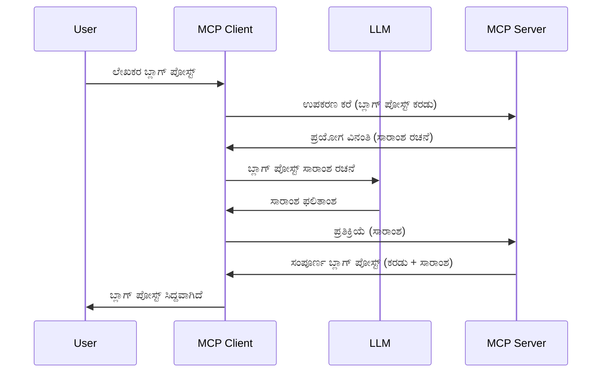

> [ಅಪ್ರಚಲಿತ: 2026-07-28 ಬಿಡುಗಡೆ ಅಭ್ಯರ್ಥಿ](https://blog.modelcontextprotocol.io/posts/2026-07-28-release-candidate/)

# ನಮ್‍ಪಿಕೆಗೊಳ್ಳುವಿಕೆ - ಕ್ಲೈಂಟ್‌ಗೆ ವೈಶಿಷ್ಟ್ಯಗಳನ್ನು ನಿಯೋಜಿಸು

> **ಅಪ್ರಚಲಿತ ಸಮಾಚಾರ:** `2026-07-28` MCP ವಿಶೇಷಣ ಬಿಡುಗಡೆಯ ಅಭ್ಯರ್ಥಿ ನಮ್‍ಪಿಕೆಗೊಳ್ಳುವಿಕೆಯನ್ನು LLM ಪ್ರೊವೈಡರ್ API ಗಳ ನೇರೊಂದಿಗಿನ ಸಮನ್ವಯಕ್ಕಾಗಿ ಅಮಾನ್ಯಗೊಳಿಸಿದೆ. ನಮಪಿಕೆಗೊಳ್ಳುವಿಕೆ `2025-11-25` ರಲ್ಲೂ ಮತ್ತು ಯಾವುದೇ ಅಧಿಕೃತ ಅಮಾನ್ಯಗೊಳಿಸುವಿಕೆಯನ್ನು ಮೇಲಾಗಿ ಕನಿಷ್ಟ ಒಂದು ವರ್ಷಗಳ ಕಾಲ ಕಾರ್ಯನಿರ್ವಹಿಸುತ್ತದೆ, ಆದ್ದರಿಂದ ಈ ಪಾಠದಲ್ಲಿನ ಎಲ್ಲಾ ವಿಷಯಗಳು ಲೆಕ್ಕಪಡುವುದಾಗಿದೆ — ಆದರೆ ಹೊಸ ಸರ್ವರ್ ವಿನ್ಯಾಸಗಳು ಬದಲಾವಣೆಯ ಮಾದರಿಯನ್ನು ಪರಿಶೀಲಿಸಬೇಕು. [MCP ನಲ್ಲಿ ಏನಾಗುತ್ತಿದೆ: 2026-07-28 ಬಿಡುಗಡೆ ಅಭ್ಯರ್ಥಿ](../../01-CoreConcepts/mcp-2026-07-28-release-candidate.md) ನೋಡಿ.

ಕೆಲವೊಮ್ಮೆ, ಒಂದೇ ಗುರಿಯನ್ನು ಸಾಧಿಸಲು MCP ಕ್ಲೈಂಟ್ ಮತ್ತು MCP ಸರ್ವರ್ ಎರಡುಗೂ ಸಹಕರಿಸುವ ಅಗತ್ಯವಿರುತ್ತದೆ. ಸರ್ವರ್‌ಗೆ ಕ್ಲೈಂಟ್‌ನಲ್ಲಿ ಇರುವ LLM ರ ಸಹಾಯ ಬೇಕಾಗುವ ಸಂದರ್ಭವು ಇರಬಹುದು. ಈ ಪರಿಸ್ಥಿತಿಗೆ, ನಮಪಿಕೆಗೊಳ್ಳುವಿಕೆಯನ್ನು ಬಳಸುವುದು ಸೂಕ್ತ.

ನಮಪಿಕೆಗೊಳ್ಳುವಿಕೆಯ ವಿವಿಧ ಉಪಯೋಗಗಳು ಮತ್ತು ಹೇಗೆ ಇದರೊಂದಿಗೆ ಪರಿಹಾರವನ್ನು ನಿರ್ಮಿಸಬಹುದು ಎಂಬುದನ್ನು ತಿಳಿದುಕೊಳ್ಳೋಣ.

## ಅವಲೋಕನ

ಈ ಪಾಠದಲ್ಲಿ, ನಮಪಿಕೆಗೊಳ್ಳುವಿಕೆಯನ್ನು ಯಾವಾಗ ಮತ್ತು ಎಲ್ಲಿಗೆ ಬಳಸಬೇಕು ಮತ್ತು ಅದನ್ನು ಹೇಗೆರೊಳಗಾಗಿ ಮಾಡಬೇಕು ಎಂಬುದನ್ನು ಗಮನಿಸೋಣ.

## ಕಲಿಕಾ ಉದ್ದೇಶಗಳು

ಈ ಅಧ್ಯಾಯದಲ್ಲಿ, ನಾವು:

- ನಮಪಿಕೆಗೊಳ್ಳುವಿಕೆ ಎಂದರೆ 무엇 ಮತ್ತು ಯಾವಾಗ ಬಳಸಬೇಕೆಂದು ವಿವರಿಸುವುದು.
- MCP ಯಲ್ಲಿ ನಮಪಿಕೆಗೊಳ್ಳುವಿಕೆಯನ್ನು ಹೇಗೆ ಕಾನ್ಫಿಗರ್ ಮಾಡಲು ತಿಳಿಸುವುದು.
- ನಮ್‍ಪಿಕೆಗೊಳ್ಳುವಿಕೆಯ ಉದಾಹರಣೆಗಳನ್ನು ನೀಡುವುದು.

## ನಮಪಿಕೆಗೊಳ್ಳುವಿಕೆ ಎಂದರೇನು ಮತ್ತು ಇದರ ಉಪಯೋಗ ಏನು?

ನಮಪಿಕೆಗೊಳ್ಳುವಿಕೆ ಒಂದು ಉನ್ನತ ವೈಶಿಷ್ಟ್ಯವಾಗಿದ್ದು, ಕೆಳಗಿನ ರೀತಿಯಲ್ಲಿ ಕಾರ್ಯನಿರ್ವಹಿಸುತ್ತದೆ:



### ನಮ್‍ಪಿಕೆಗೊಳ್ಳುವಿಕೆ ವಿನಂತಿ

ಸರಿಯಾಗಿದೆ, ಈಗ ನಮ್ಮ ಬಳಿ ನಂಬಲಾರದ ಸನ್ನಿವೇಶದ ಬೊմբೆಯು ಇದೆ, ಸರ್ವರ್ ಕ್ಲೈಂಟ್‌ಗೆ ಕಳುಹಿಸುವ ನಮ್‍ಪಿಕೆಗೊಳ್ಳುವಿಕೆ ವಿನಂತಿ ಬಗ್ಗೆ ಮಾತಾಡೋಣ. JSON-RPC ಸ್ವರೂಪದಲ್ಲಿ ಈ ರೀತಿ ಕಾಣಬಹುದು:

```json
{
  "jsonrpc": "2.0",
  "id": 1,
  "method": "sampling/createMessage",
  "params": {
    "messages": [
      {
        "role": "user",
        "content": {
          "type": "text",
          "text": "Create a blog post summary of the following blog post: <BLOG POST>"
        }
      }
    ],
    "modelPreferences": {
      "hints": [
        {
          "name": "claude-3-sonnet"
        }
      ],
      "intelligencePriority": 0.8,
      "speedPriority": 0.5
    },
    "systemPrompt": "You are a helpful assistant.",
    "maxTokens": 100
  }
}
```

ಇಲ್ಲಿ ಕೆಲವು ವಿಶೇಷಾಂಶಗಳನ್ನು ಗಮನಿಸುವುದು ಸೂಕ್ತ:

- ವಿಷಯದಡಿ -> ಪಠ್ಯದಲ್ಲಿ, ಪ್ರಾಂಪ್ಟ್ ನಮ್ಮ LLM ಗೆ ಬ್ಲಾಗ್ ಪೋಸ್ಟ್ ವಿಷಯವನ್ನು ಸಂಕ್ಷೇಪಿಸುವ ಸೂಚನೆ.

- **modelPreferences**. ಇದು ಒಂದು ವಿಧದ ಆಸಕ್ತಿಯಿದ್ದು, LLM ಜೊತೆಗೆ ಇರುವ ನಿಯಂತ್ರಣಗಳ ಶಿಫಾರಸು. ಬಳಕೆದಾರ ಇದನ್ನು ಪಾಲಿಸಬಹುದಾದ ಅಥವಾ ಬದಲಾಯಿಸಬಹುದಾದ ಅವಕಾಶ.
- **systemPrompt**, ಇದು ನಿಮ್ಮ ಸಾಮಾನ್ಯ ಸಿಸ್ಟಂ ಪ್ರಾಂಪ್ಟ್, ನಿಮ್ಮ LLM ಗೆ ವ್ಯಕ್ತಿತ್ವವನ್ನು ನೀಡುತ್ತದೆ ಮತ್ತು ಮಾರ್ಗದರ್ಶನವನ್ನು ಒಳಗೊಂಡಿದೆ.
- **maxTokens**, ಈ ದುಂಡಾಗ, ಈ ಕಾರ್ಯಕ್ಕೆ ಬಳಸಬಹುದಾದ ಟೋಕನ್ ಗಳ ಶಿಫಾರಸು ಸಂಖ್ಯೆಯನ್ನು ಸೂಚಿಸುತ್ತದೆ.

### ನಮ್‍ಪಿಕೆಗೊಳ್ಳುವಿಕೆ ಪ್ರತಿಕ್ರಿಯೆ

ಈ ಪ್ರತಿಕ್ರಿಯೆ MCP ಕ್ಲೈಂಟ್ MCP ಸರ್ವರ್‌ಗೆ ಕಳುಹಿಸುತ್ತದೆ, ಇದು ಕ್ಲೈಂಟ್ LLM ಕರೆ ಮಾಡಿ ಪ್ರತಿಕ್ರಿಯೆಯಿಗಾಗಿ ಕಾಯುತ್ತದೆ ಮತ್ತು ನಂತರ ಸಂದೇಶ ರಚಿಸುತ್ತದೆ. JSON-RPC ನಲ್ಲಿ ಇದರ ರೀತಿ ಕಾಣಬಹುದು:

```json
{
  "jsonrpc": "2.0",
  "id": 1,
  "result": {
    "role": "assistant",
    "content": {
      "type": "text",
      "text": "Here's your abstract <ABSTRACT>"
    },
    "model": "gpt-5",
    "stopReason": "endTurn"
  }
}
```

ಪ್ರತಿಕ್ರಿಯೆ ಬ್ಲಾಗ್ ಪೋಸ್ಟ್‌ನ ಸಂಕ್ಷೇಪವಾಗಿದೆ, ನಾವು ಕೇಳಿದಂತೆ. ಬಳಕೆಯಾದ `model` ನಮ್ಮ ಕೇಳಿದ ಮಾದರಿ ಅಲ್ಲ, ಆದರೆ "gpt-5" "claude-3-sonnet" ಮೇಲೆ ಇದೆ. ಇದು ಬಳಕೆದಾರ ತನ್ನ ಆಯ್ಕೆಯನ್ನು ಬದಲಾಯಿಸಬಹುದು ಮತ್ತು ನಿಮ್ಮ ನಮ್‍ಪಿಕೆಗೊಳ್ಳುವಿಕೆ ವಿನಂತಿ ಶಿಫಾರಸು ಮಾತ್ರ ಎಂಬುದನ್ನು ಪ್ರದರ್ಶಿಸಲು.

ಈಗ අපಟದ ಮುಖ್ಯ ಪ್ರಕ್ರಿಯೆ ತಿಳಿದಿದೆ ಮತ್ತು ಉಪಯುಕ್ತ ಕಾರ್ಯ 'ಬ್ಲಾಗ್ ಪೋಸ್ಟ್ ರಚನೆ + ಸಂಕ್ಷೇಪ' ಬಗೆಗೆ, ಕಾರ್ಯ ನಿರ್ವಹಿಸಲು ಏನು ಬೇಕಾಗಿದೆ ನೋಡೋಣ.

### ಸಂದೇಶ ವಿಧಗಳು

ನಮ್‍ಪಿಕೆಗೊಳ್ಳುವಿಕೆ ಸಂದೇಶಗಳು ಕೇವಲ ಪಠ್ಯಕ್ಕೆ ಸೀಮಿತವಲ್ಲದೆ, ಚಿತ್ರಗಳು ಮತ್ತು ಧ್ವನಿಯೂ ಕಳುಹಿಸಬಹುದು. JSON-RPC ನಲ್ಲಿ ಹೇಗೆ ಬದಲಾಗುತ್ತದೆ ನೋಡಿ:

**ಪಠ್ಯ**

```json
{
  "type": "text",
  "text": "The message content"
}
```

**ಚಿತ್ರ ವಿಷಯ**

```json
{
  "type": "image",
  "data": "base64-encoded-image-data",
  "mimeType": "image/jpeg"
}
```

**ಧ್ವನಿ ವಿಷಯ**

```json
{
  "type": "audio",
  "data": "base64-encoded-audio-data",
  "mimeType": "audio/wav"
}
```

> NOTE: ನಮ್‍ಪಿಕೆಗೊಳ್ಳುವಿಕೆಗೆ ಹೆಚ್ಚಿನ ಮಾಹಿತಿ ಮತ್ತು ವಿವರಗಳಿಗೆ [ಅಧಿಕೃತ ಡಾಕ್ಯುಮೆಂಟ್](https://modelcontextprotocol.io/specification/2025-11-25/client/sampling) ನೋಡಿ

## ಕ್ಲೈಂಟ್‌ನಲ್ಲಿ ನಮ್‍ಪಿಕೆಗೊಳ್ಳುವಿಕೆಯನ್ನು ಹೇಗೆ ಹೊಂದಿಸಲು

> ಟಿಪ್ಪಣಿ: ನೀವು ಕೇವಲ ಸರ್ವರ್ ನಿರ್ಮಿಸುತ್ತಿದ್ದರೆ, ಇಲ್ಲಿ ಹೆಚ್ಚಿನದು ಮಾಡಲು ಅಗತ್ಯವಿಲ್ಲ.

ಕ್ಲೈಂಟ್‌ನಲ್ಲಿ ನೀವು ಕೆಳಕಂಡ ವೈಶಿಷ್ಟ್ಯವನ್ನು ಈ ರೀತಿ ವಿವರಿಸಬೇಕು:

```json
{
  "capabilities": {
    "sampling": {}
  }
}
```

ನಂತರ ನಿಮ್ಮ ಆಯ್ಕೆ ಮಾಡಿದ ಕ್ಲೈಂಟ್ ಸರ್ವರ್ ಜೊತೆಗೆ ಚಾಲನೆಯಾಗುವಾಗ ಇದು ತೆಗೆದುಕೊಳ್ಳಲಾಗುತ್ತದೆ.

## ನಮ್‍ಪಿಕೆಗೊಳ್ಳುವಿಕೆಯ ಒಂದು ಉದಾಹರಣೆ - ಬ್ಲಾಗ್ ಪೋಸ್ಟ್ ರಚನೆ

ನಮ್‍ಪಿಕೆಗೊಳ್ಳುವಿಕೆಗೊಳ್ಳುವಿಕೆ ಸರ್ವರ್ ರಚಿಸೋಣ, ಕೆಲವು ಹಂತಗಳು:

1. ಸರ್ವರ್‌ನಲ್ಲಿ ಒಂದು ಸಾಧನ (ಟೂಲ್) ರಚಿಸು.
1. ಆ ಸಾಧನ ನಮಪಿಕೆಗೊಳ್ಳುವಿಕೆಗೆ ವಿನಂತಿ ರಚಿಸಬೇಕು.
1. ಸಾಧನವು ಕ್ಲೈಂಟ್ ನ ನಮಪಿಕೆಗೊಳ್ಳುವಿಕೆ ವಿನಂತಿಯ ಉತ್ತರಕ್ಕಾಗಿ ನಿರೀಕ್ಷಿಸಬೇಕು.
1. ನಂತರ ಸಾಧನ ಫಲಿತಾಂಶವನ್ನು ರಚಿಸಬೇಕು.

ಹಂತದೆನ್ ಹಂತೇ ಕೋಡ್ ನೋಡೋಣ:

### -1- ಸಾಧನವನ್ನು ರಚಿಸು

**python**

```python
@mcp.tool()
async def create_blog(title: str, content: str, ctx: Context[ServerSession, None]) -> str:
    """Create a blog post and generate a summary"""

```

### -2- ನಮ್‍ಪಿಕೆಗೊಳ್ಳುವಿಕೆ ವಿನಂತಿ ರಚಿಸು

ಕೆಳಗಿನ ಕೋಡ್‍ನೊಂದಿಗೆ ನಿಮ್ಮ ಸಾಧನವನ್ನು ವಿಸ್ತರಿಸು:

**python**

```python
post = BlogPost(
        id=len(posts) + 1,
        title=title,
        content=content,
        abstract=""
    )

prompt = f"Create an abstract of the following blog post: title: {title} and draft: {content} "

result = await ctx.session.create_message(
        messages=[
            SamplingMessage(
                role="user",
                content=TextContent(type="text", text=prompt),
            )
        ],
        max_tokens=100,
)

```

### -3- ಪ್ರತಿಕ್ರಿಯೆಗೆ ನಿರೀಕ್ಷಿಸಿ ಮತ್ತು ಪ್ರತಿಕ್ರಿಯೆ ಹಿಂತಿರುಗಿಸಿ

**python**

```python
post.abstract = result.content.text

posts.append(post)

# ಪೂರ್ಣ ಉತ್ಪನ್ನವನ್ನು ಹಿಂತೆಗೆದುಕೊಳ್ಳಿ
return json.dumps({
    "id": post.title,
    "abstract": post.abstract
})
```

### -4- ಸಂಪೂರ್ಣ ಕೋಡ್

**python**

```python
from starlette.applications import Starlette
from starlette.routing import Mount, Host

from mcp.server.fastmcp import Context, FastMCP

from mcp.server.session import ServerSession
from mcp.types import SamplingMessage, TextContent

import json


from uuid import uuid4
from typing import List
from pydantic import BaseModel


mcp = FastMCP("Blog post generator")

# app = ಫಾಸ್ಟ್API()

posts = []

class BlogPost(BaseModel):
    id: int
    title: str
    content: str
    abstract: str

posts: List[BlogPost] = []

@mcp.tool()
async def create_blog(title: str, content: str, ctx: Context[ServerSession, None]) -> str:
    """Create a blog post and generate a summary"""

    post = BlogPost(
        id=len(posts) + 1,
        title=title,
        content=content,
        abstract=""
    )

    prompt = f"Create an abstract of the following blog post: title: {title} and draft: {content} "

    result = await ctx.session.create_message(
        messages=[
            SamplingMessage(
                role="user",
                content=TextContent(type="text", text=prompt),
            )
        ],
        max_tokens=100,
    )

    post.abstract = result.content.text

    posts.append(post)

    # ಸಂಪೂರ್ಣ ಬ್ಲಾಗ್ ಪೋಸ್ಟ್ ಅನ್ನು ಹಿಂತಿರುಗಿಸಿ
    return json.dumps({
        "id": post.title,
        "abstract": post.abstract
    })

if __name__ == "__main__":
    print("Starting server...")
    # mcp.ಚಲಾಯಿಸಿ()
    mcp.run(transport="streamable-http")

# ಆಪ್ ಅನ್ನು ಈ ಕೆಳಗಿನಂತೆ ಚಲಾಯಿಸಿ: python server.py
```

### -5- ದೃಷ್ಯ ಸ್ಟುಡಿಯೋ ಕೋಡಿನಲ್ಲಿ ಪರೀಕ್ಷಿಸುವುದು

ದೃಷ್ಯ ಸ್ಟುಡಿಯೋ ಕೋಡಿನಲ್ಲಿ ಇದನ್ನು ಪರೀಕ್ಷಿಸಲು, ಈ ಕೆಳಗಿನ ವಿಧಾನ ಅನುಸರಿಸಿ:

1. ಟರ್ಮಿನಲ್‌ನಲ್ಲಿ ಸರ್ವರ್ ಪ್ರಾರಂಭಿಸು
1. ಅದನ್ನು *mcp.json* ಗೆ ಸೇರಿಸಿ (ಮತ್ತು ಅದು ಪ್ರಾರಂಭವಾಗಿದೆ ಎಂದು ಖಚಿತಪಡಿಸಿಕೊಳ್ಳಿ)

   ```json
   "servers": {
      "blog-server": {
        "type": "http",
        "url": "http://localhost:8000/mcp"
      }
   }
   ```

1. ಪ್ರಾಂಪ್ಟ್ ಟೈಪ್ ಮಾಡು:

   ```text
   create a blog post named "Where Python comes from", the content is "Python is actually named after Monty Python Flying Circus"
   ```

1. ನಮ್‍ಪಿಕೆಗೊಳ್ಳುವಿಕೆ ನಡೆಯಲಿ. ಮೊದಲ ಬಾರಿಗೆ ಇದು ಪರೀಕ್ಷಿಸುವಾಗ ನೀವು ಹೆಚ್ಚುವರಿ ಸಂವಾದವನ್ನು ಒಪ್ಪಬೇಕಾಗುತ್ತದೆ, ನಂತರ ಸಾಧನ ನಡೆಯಬೇಕೆಂದು ಕೇಳುವ ಸಾಮಾನ್ಯ ಸಂವಾದ ಕಾಣಿಸುತ್ತೆ.

1. ಫಲಿತಾಂಶಗಳನ್ನು ಪರಿಶೀಲಿಸು. ನೀವು ಫಲಿತಾಂಶಗಳನ್ನು GitHub Copilot ಚಾಟ್ ನಲ್ಲಿ ಚೆನ್ನಾಗಿ ತೋರಿಸುತ್ತೀರಿ ಜೊತೆಗೆ ಕಚ್ಚಾ JSON ಪ್ರತಿಕ್ರಿಯೆ ಪರಿಶೀಲಿಸಬಹುದಾಗಿದೆ.

**ಬಹುಮುಖತೆ**: ದೃಷ್ಯ ಸ್ಟುಡಿಯೋ ಕೋಡ್ ಸಾಧನ ನಮ್‍ಪಿಕೆಗೊಳ್ಳುವಿಕೆಗೆ ಉತ್ತಮ ಬೆಂಬಲವನ್ನು ಒದಗಿಸುತ್ತದೆ. ನೀವು ನಿಮ್ಮ ಇನ್ಸ್ಟಾಲ್ ಮಾಡಿದ ಸರ್ವರ್ ನಲ್ಲಿ "Sampling access" ಅನ್ನು ಹೀಗೆ ಕಾನ್ಫಿಗರ್ ಮಾಡಬಹುದು:

1. ವಿಸ್ತರಣೆ ವಿಭಾಗಕ್ಕೆ ಹೋಗಿ.
1. "MCP SERVERS - INSTALLED" ವಿಭಾಗದಲ್ಲಿ ನಿಮ್ಮ ಇನ್ಸ್ಟಾಲ್ ಮಾಡಿದ ಸರ್ವರ್ ಕಾಗ್ ಐಕಾನ್ ಆಯ್ಕೆಮಾಡಿ.
1 "Configure Model Access" ಆಯ್ಕೆಮಾಡಿ, ಇಲ್ಲಿ ನೀವು "sampling" ಕಾರ್ಯಾಚರಣೆಗೆ GitHub Copilot ಯಾವ ಮಾದರಿಗಳನ್ನು ಬಳಸಬಹುದು ಎಂದು ಆಯ್ಕೆಮಾಡಬಹುದು. ಇತ್ತೀಚೆಗೆ ಸಂಭವಿಸಿದ ಎಲ್ಲಾ ನಮಪಿಕೆಗೊಳ್ಳುವಿಕೆ ವಿನಂತಿಗಳೂ "Show Sampling requests" ಆಯ್ಕೆಮಾಡಿ ನೋಡಬಹುದು.

## ನಿಯೋಜನೆ

ಈ ನಿಯೋಜನೆಯಲ್ಲಿ, ನೀವು ಸ್ವಲ್ಪ ವಿಭಿನ್ನವಾದ ನಮಪಿಕೆಗೊಳ್ಳುವಿಕೆಯನ್ನು ನಿರ್ಮಿಸುವಿರಿ, ಇದು ಉತ್ಪನ್ನ ವಿವರಣೆಯನ್ನು ತಯಾರಿಸುವ sampling ಒಕ್ಕೂಟವಾಗಿರುತ್ತದೆ. ನಿಮ್ಮ ಸನ್ನಿವೇಶ:

**ಸನ್ನಿವೇಶ**: ಇ-ಕಾಮರ್ಸ್ ಬ್ಯಾಕ್ ಆಫೀಸ್ ಕೆಲಸಗಾರನಿಗೆ ಸಹಾಯ ಬೇಕಾಗುತ್ತದೆ, ಉತ್ಪನ್ನ ವಿವರಣೆ ತಯಾರಿಸಲು ತುಂಬ ಸಮಯ ತೆಗೆದುಕೊಳ್ಳುತ್ತದೆ. ಆದ್ದರಿಂದ, ನೀವು "create_product" ಎಂಬ ಸಾಧನವನ್ನು "title" ಮತ್ತು "keywords" ಆಗಿರುವ ಆರ್ಗ್ಯುಮೆಂಟ್‌ಗಳೊಂದಿಗೆ ಕರೆಮಾಡಿ, ಇದು ಸಂಪೂರ್ಣ ಉತ್ಪನ್ನವನ್ನು "description" ಕ್ಷೇತ್ರ ಸೇರಿದಂತೆ ತಯಾರಿಸುತ್ತದೆ, ಅದು ಕ್ಲೈಂಟ್ LLM ಮೂಲಕ ತುಂಬಲ್ಪಡುತ್ತದೆ.

ಸೂಚನೆ: ನೀವು ಮೊದಲು ಕಲಿತಂತೆ ಈ ಸರ್ವರ್ ಮತ್ತು ಅದರ ಸಾಧನವನ್ನು sampling ವಿನಂತಿಯೊಂದಿಗೆ ರಚಿಸಿ.

## ಪರಿಹಾರ

[ಪರಿಹಾರ](./solution/README.md)

## ಮುಖ್ಯ ಅಂಶಗಳು

ನಮ್‍ಪಿಕೆಗೊಳ್ಳುವಿಕೆ ಸರ್ವರ್ LLM ಸಹಾಯ ಬೇಕಾದಾಗ ಕೆಲಸಗಳನ್ನು ಕ್ಲೈಂಟ್‌ಗೆ ನಿಯೋಜಿಸಲು ಶಕ್ತಿಶಾಲಿ ವೈಶಿಷ್ಟ್ಯ.

## ಮುಂದಿನ ಹಂತ

- [ಅಥವಾ ಅಧ್ಯಾಯ 4 - ಪ್ರಾಯೋಗಿಕ ಜರುಗು](../../04-PracticalImplementation/README.md)

---

<!-- CO-OP TRANSLATOR DISCLAIMER START -->
**ಅಸ್ವೀಕಾರ**:
ಈ ದಸ್ತಾವೇಜು AI ಅನುವಾದ ಸೇವೆ [Co-op Translator](https://github.com/Azure/co-op-translator) ಬಳಸಿ ಅನುವಾದಿಸಲಾಗಿದೆ. ನಾವು ನಿಖರತೆಯನ್ನು ಸಾಧಿಸಲು ಪ್ರಯತ್ನಿಸುತ್ತಿದ್ದರೂ, ದಯವಿಟ್ಟು ಗಮನಿಸಿ, ಸ್ವಯಂಚಾಲಿತ ಅನುವಾದಗಳಲ್ಲಿ ದೋಷಗಳು ಅಥವಾ ಅಸಡ್ಡೆಗಳು ಇರಬಹುದು. ಮೂಲ ಭಾಷೆಯಲ್ಲಿರುವ ಮೂಲ ದಸ್ತಾವೇಜು ಪ್ರಾಮಾಣಿಕ ಮೂಲವೆಂದು ಪರಿಗಣಿಸಬೇಕು. ಪ್ರಮುಖ ಮಾಹಿತಿಗಾಗಿ, ವೃತ್ತಿಪರ ಮಾನವ ಅನುವಾದವನ್ನು ಶಿಫಾರಸು ಮಾಡಲಾಗುತ್ತದೆ. ಈ ಅನುವಾದವನ್ನು ಬಳಸುವ ಮೂಲಕ ಉಂಟಾಗುವ ಯಾವುದೇ ತಪ್ಪು ಅರ್ಥಗಳ ಅಥವಾ ತಪ್ಪು ವ್ಯಾಖ್ಯಾನಗಳ ಬಗ್ಗೆ ನಾವು ಹೊಣೆಗಾರರಲ್ಲ.
<!-- CO-OP TRANSLATOR DISCLAIMER END -->