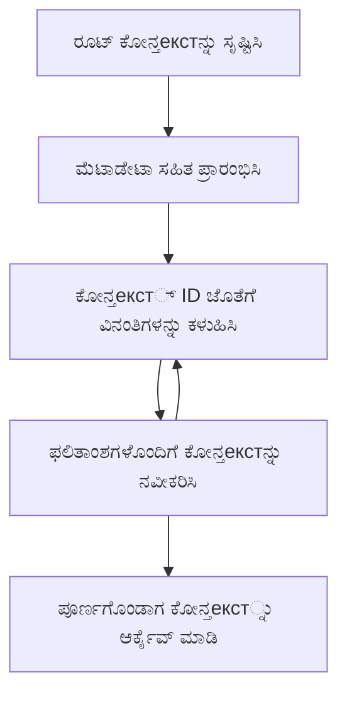

> [ಹಳವಡಿಕೆ: 2026-07-28 ಬಿಡುಗಡೆ ಅಭ್ಯರ್ಥಿ](https://blog.modelcontextprotocol.io/posts/2026-07-28-release-candidate/#roots-sampling-and-logging-are-deprecated)

# MCP ಮೂಲ ಸಂದರ್ಭಗಳು

> **ಹಳವಡಿಕೆ ಸೂಚನೆ:** `2026-07-28` MCP ನಿರ್ದಿಷ್ಟತೆ ಬಿಡುಗಡೆ ಅಭ್ಯರ್ಥಿ ಮೂಲಗಳನ್ನು ಉಪಕರಣದ ಪರಿಮಾಣಗಳು, ಸಂಪನ್ಮೂಲ URIಗಳು ಅಥವಾ ಸರ್ವರ್ ಸಂರಚನೆಯ ಬದಿಗೆ ಹಳವಡಿಸಿದ್ದಾರೆ ಎಂದು ಗುರುತಿಸುತ್ತದೆ. ಮೂಲಗಳು `2025-11-25` ಮತ್ತು ಯಾವುದೇ ಅಧಿಕೃತ ಹಳವಡಿಕೆಯಿಂದ ಕನಿಷ್ಠ ಒಂದು ವರ್ಷ ಸಕ್ರಿಯವಾಗಿರುತ್ತವೆ, ಆದ್ದರಿಂದ ಈ ಪಾಠದಲ್ಲಿ ಎಲ್ಲವೂ ಮಾನ್ಯವಾಗಿರುವುದು - ಆದರೆ ಹೊಸ ಸರ್ವರ್ ವಿನ್ಯಾಸಗಳು ಬದಲಾವಣೆಯ ಮಾದರಿಯನ್ನು ಪರಿಶೀಲಿಸಬೇಕು. [MCPದಲ್ಲಿ ಏನೆಲ್ಲಾ ಬದಲಾಗುತ್ತಿದೆ: 2026-07-28 ಬಿಡುಗಡೆ ಅಭ್ಯರ್ಥಿ](../../01-CoreConcepts/mcp-2026-07-28-release-candidate.md) ಅನ್ನು ನೋಡಿ.

ಮೂಲ ಸಂದರ್ಭಗಳು Model Context Protocol ನ ಮೂಲಭೂತ ಸಂಧ್ಯೆ, ಮತ್ತು ಅವು ಹಲವಾರು ವಿನಂತಿಗಳು ಮತ್ತು ಅಧಿವೇಶನಗಳ ಮೂಲಕ ಸಂವಾದ ಇತಿಹಾಸ ಮತ್ತು ಹಂಚಿದ ಸ್ಥಿತಿಯನ್ನು ಸ್ಥಿರ ಸ್ಥಿತಿಯಲ್ಲಿ ಕಾಪಾಡಿಕೊಳ್ಳಲು ಒದಗಿಸುತ್ತವೆ.

## ಪರಿಚಯ

ಈ ಪಾಠದಲ್ಲಿ, ನಾವು MCPಯಲ್ಲಿ ಮೂಲ ಸಂದರ್ಭಗಳನ್ನು ರಚಿಸುವುದು, ನಿರ್ವಹಿಸುವುದು ಮತ್ತು ಉಪಯೋಗಿಸುವುದನ್ನು ಅನ್ವೇಷಿಸೋಣ.

## ಕಲಿಕೆ ಉದ್ದೇಶಗಳು

ಈ ಪಾಠದ ಅಂತ್ಯಕ್ಕೆ, ನೀವು ಕೆಳಕಂಡವುಗಳಿಗೆ ಸಾಮರ್ಥ್ಯ ಹೊಂದಿರುತ್ತೀರಿ:

- ಮೂಲ ಸಂದರ್ಭಗಳ ಉದ್ದೇಶ ಮತ್ತು ರಚನೆಯನ್ನು ಅರ್ಥ ಮಾಡಿಕೊಳ್ಳುವುದು
- MCP ಕ್ಲೈಂಟ್ ಗ್ರಂಥಾಲಯಗಳನ್ನು ಬಳಸಿ ಮೂಲ ಸಂದರ್ಭಗಳನ್ನು ರಚಿಸಿ ಮತ್ತು ನಿರ್ವಹಿಸಿ
- .NET, Java, JavaScript, ಮತ್ತು Python ಅಪ್ಲಿಕೇಶನ್‌ಗಳಲ್ಲಿ ಮೂಲ ಸಂದರ್ಭಗಳನ್ನು ಅನುಷ್ಠಾನಗೊಳಿಸಿ
- ಬಹು-ತಿರುಗುವ ಸಂವಾದಗಳು ಮತ್ತು ಸ್ಥಿತಿ ನಿರ್ವಹಣೆಗೆ ಮೂಲ ಸಂದರ್ಭಗಳನ್ನು ಉಪಯೋಗಿಸಿ
- ಮೂಲ ಸಂದರ್ಭ ನಿರ್ವಹಣೆಗೆ ಉತ್ತಮ ಅಭ್ಯಾಸಗಳನ್ನು ಅನುಷ್ಠಾನಗೊಳಿಸಿ

## ಮೂಲ ಸಂದರ್ಭಗಳನ್ನು ಅರ್ಥಮಾಡಿಕೊಳ್ಳುವುದು

ಮೂಲ ಸಂದರ್ಭಗಳು ಸಂವಾದಗಳ ಸರಣಿಗೆ ಇತಿಹಾಸ ಮತ್ತು ಸ್ಥಿತಿಯನ್ನು ಕಾಯುವೆಟ್ ಆಗಿದ್ದು, ಈ ಕೆಳಕಂಡವುಗಳನ್ನು ನೀಡುತ್ತವೆ:

- **ಸಂವಾದ ಸ್ಥಿರತೆ**: ಸಕಲತೆಯುಳ್ಳ ಬಹು-ತಿರುಗುವ ಸಂವಾದಗಳನ್ನು ಕಾಪಾಡುವುದು
- **ಸ್ಮೃತಿ ನಿರ್ವಹಣೆ**: ಸಂವಾದಗಳಲ್ಲಿನ ಮಾಹಿತಿಯನ್ನು ಸಂಗ್ರಹಿಸುವುದು ಮತ್ತು ಪುನಃ ಪ್ರಾಪ್ತಿಗೊಳಿಸುವುದು
- **ಸ್ಥಿತಿ ನಿರ್ವಹಣೆ**: ಸಂಕೀರ್ಣ ಕಾರ್ಯಪ್ರವಾಹಗಳಲ್ಲಿ ಪ್ರಗತಿಯನ್ನು ಗಮನಿಸುವುದು
- **ಸಂದರ್ಭ ಹಂಚಿಕೆ**: ಹಲವಾರು ಕ್ಲೈಂಟ್‌ಗಳು ಒಂದೇ ಸಂವಾದ ಸ್ಥಿತಿಯನ್ನು ಪ್ರವೇಶಿಸಲು ಅನುಮತಿಸುವುದು

MCPಯಲ್ಲಿ ಮೂಲ ಸಂದರ್ಭಗಳು ಇವುಳ್ಳ ಪ್ರಮುಖ ಲಕ್ಷಣಗಳನ್ನು ಹೊಂದಿರುತ್ತವೆ:

- ಪ್ರತಿ ಮೂಲ ಸಂದರ್ಭಕ್ಕೆ ವಿಶಿಷ್ಟ ಗುರುತು ಇರುತ್ತದೆ.
- ಅವು ಸಂವಾದ ಇತಿಹಾಸ, ಬಳಕೆದಾರ ಇಚ್ಛೆಗಳು ಮತ್ತು ಇತರ ಮೆಟಾಡೇಟಾಗಳನ್ನು ಹೊಂದುತ್ತವೆ.
- ಅವು ಎಗೆಯಬಹುದು, ಪ್ರವೇಶಿಸಬಹುದು ಮತ್ತು ಅಗತ್ಯವಿದ್ದಾಗಾ ಅರ್ಚಿವ್ ಮಾಡಬಹುದು.
- ಅವು ಸೂಕ್ಷ್ಮ ಪ್ರವೇಶ ನಿಯಂತ್ರಣ ಮತ್ತು ಅನುಮತಿಗಳನ್ನು ಬೆಂಬಲಿಸುತ್ತವೆ.

## ಮೂಲ ಸಂದರ್ಭ ಜೀವಚಕ್ರ



## ಮೂಲ ಸಂದರ್ಬಗಳೊಂದಿಗೆ ಕೆಲಸ ಮಾಡುವುದು

ಇಲ್ಲಿ ಮೂಲ ಸಂದರ್ಭಗಳನ್ನು ರಚಿಸುವುದು ಮತ್ತು ನಿರ್ವಹಿಸುವುದರ ಉದಾಹರಣೆ ಇದೆ.

### C# ಅನುಷ್ಠಾನ

```csharp
// .NET Example: Root Context Management
using Microsoft.Mcp.Client;
using System;
using System.Threading.Tasks;
using System.Collections.Generic;

public class RootContextExample
{
    private readonly IMcpClient _client;
    private readonly IRootContextManager _contextManager;
    
    public RootContextExample(IMcpClient client, IRootContextManager contextManager)
    {
        _client = client;
        _contextManager = contextManager;
    }
    
    public async Task DemonstrateRootContextAsync()
    {
        // 1. Create a new root context
        var contextResult = await _contextManager.CreateRootContextAsync(new RootContextCreateOptions
        {
            Name = "Customer Support Session",
            Metadata = new Dictionary<string, string>
            {
                ["CustomerName"] = "Acme Corporation",
                ["PriorityLevel"] = "High",
                ["Domain"] = "Cloud Services"
            }
        });
        
        string contextId = contextResult.ContextId;
        Console.WriteLine($"Created root context with ID: {contextId}");
        
        // 2. First interaction using the context
        var response1 = await _client.SendPromptAsync(
            "I'm having issues scaling my web service deployment in the cloud.", 
            new SendPromptOptions { RootContextId = contextId }
        );
        
        Console.WriteLine($"First response: {response1.GeneratedText}");
        
        // Second interaction - the model will have access to the previous conversation
        var response2 = await _client.SendPromptAsync(
            "Yes, we're using containerized deployments with Kubernetes.", 
            new SendPromptOptions { RootContextId = contextId }
        );
        
        Console.WriteLine($"Second response: {response2.GeneratedText}");
        
        // 3. Add metadata to the context based on conversation
        await _contextManager.UpdateContextMetadataAsync(contextId, new Dictionary<string, string>
        {
            ["TechnicalEnvironment"] = "Kubernetes",
            ["IssueType"] = "Scaling"
        });
        
        // 4. Get context information
        var contextInfo = await _contextManager.GetRootContextInfoAsync(contextId);
        
        Console.WriteLine("Context Information:");
        Console.WriteLine($"- Name: {contextInfo.Name}");
        Console.WriteLine($"- Created: {contextInfo.CreatedAt}");
        Console.WriteLine($"- Messages: {contextInfo.MessageCount}");
        
        // 5. When the conversation is complete, archive the context
        await _contextManager.ArchiveRootContextAsync(contextId);
        Console.WriteLine($"Archived context {contextId}");
    }
}
```

ಮೆಚ್ಚಿನ ಕೋಡ್‌ನಲ್ಲಿ ನಾವು:

1. ಗ್ರಾಹಕ ಬೆಂಬಲ ಅಧಿವೇಶನಕ್ಕೆ ಮೂಲ ಸಂದರ್ಭವನ್ನು ರಚಿಸಿದ್ದೇವೆ.
1. ಆ ಸಂದರ್ಭದೊಳಗೆ ಬಹು ಸಂದೇಶಗಳನ್ನು ಕಳುಹಿಸಿದ್ದು, ಮಾದರಿಯನ್ನು ಸ್ಥಿತಿಯನ್ನು ಕಾಯ್ದುಕೊಳ್ಳಲು ಅನುಮತಿಸಿದೆ.
1. ಸಂವಾದದ ಆಧಾರದ ಮೇಲೆ ಸಂಬಂಧಿತ ಮೆಟಾಡೇಟಾ ಸಹಿತ ಸಂದರ್ಭವನ್ನು ನವೀಕರಿಸಿದೆ.
1. ಸಂವಾದ ಇತಿಹಾಸ್ ತಿಳಿದುಕೊಳ್ಳಲು ಸಂದರ್ಭ ಮಾಹಿತಿ ಪಡೆದುಕೊಂಡು ಬಂದಿದೆ.
1. ಸಂವಾದ ಮುಗಿದಾಗ ಸಂದರ್ಭವನ್ನು ಅರ್ಚಿವ್ ಮಾಡಲಾಗಿದೆ.

## ಉದಾಹರಣೆ: ಹಣಕಾಸು ವಿಶ್ಲೇಷಣೆಗೆ ಮೂಲ ಸಂದರ್ಭ ಅನುಷ್ಠಾನ

ಈ ಉದಾಹರಣೆಯಲ್ಲಿ, ನಾವು ಬಹು ಸಂವಾದಗಳ ಮೂಲಕ ಸ್ಥಿತಿಯನ್ನು ಕಾಯ್ದುಕೊಳ್ಳುವ ಮೂಲಕ ಹಣಕಾಸು ವಿಶ್ಲೇಷಣಾ ಅಧಿವೇಶನಕ್ಕೆ ಮೂಲ ಸಂದರ್ಭವನ್ನು ರಚಿಸುವುದನ್ನು ತೋರಿಸುತ್ತೇವೆ.

### ಜಾವಾ ಅನುಷ್ಠಾನ

```java
// ಜಾವಾ ಉದಾಹರಣೆ: ರೂಟ್ ಕಾನ್ಟೆಕ್ಸ್ಟ್ ಅನುಷ್ಠಾನ
package com.example.mcp.contexts;

import com.mcp.client.McpClient;
import com.mcp.client.ContextManager;
import com.mcp.models.RootContext;
import com.mcp.models.McpResponse;

import java.util.HashMap;
import java.util.Map;
import java.util.UUID;

public class RootContextsDemo {
    private final McpClient client;
    private final ContextManager contextManager;
    
    public RootContextsDemo(String serverUrl) {
        this.client = new McpClient.Builder()
            .setServerUrl(serverUrl)
            .build();
            
        this.contextManager = new ContextManager(client);
    }
    
    public void demonstrateRootContext() throws Exception {
        // ಕಾನ್ಟೆಕ್ಸ್ಟ್ ಮೆಟಾಡೇಟಾ ರಚಿಸಿ
        Map<String, String> metadata = new HashMap<>();
        metadata.put("projectName", "Financial Analysis");
        metadata.put("userRole", "Financial Analyst");
        metadata.put("dataSource", "Q1 2025 Financial Reports");
        
        // 1. ಹೊಸ ರೂಟ್ ಕಾನ್ಟೆಕ್ಸ್ಟ್ ರಚಿಸಿ
        RootContext context = contextManager.createRootContext("Financial Analysis Session", metadata);
        String contextId = context.getId();
        
        System.out.println("Created context: " + contextId);
        
        // 2. ಮೊದಲ ಸಂವಹನ
        McpResponse response1 = client.sendPrompt(
            "Analyze the trends in Q1 financial data for our technology division",
            contextId
        );
        
        System.out.println("First response: " + response1.getGeneratedText());
        
        // 3. ಪ್ರತಿಕ್ರಿಯೆಯಿಂದ ದೊರಕುವ ಪ್ರಮುಖ ಮಾಹಿತಿಯಿಂದ ಕಾನ್ಟೆಕ್ಸ್ಟ್ ನವೀಕರಿಸಿ
        contextManager.addContextMetadata(contextId, 
            Map.of("identifiedTrend", "Increasing cloud infrastructure costs"));
        
        // ಎರಡನೆ ಸಂವಹನ - ಅದೇ ಕಾನ್ಟೆಕ್ಸ್ಟ್ ಬಳಸಿ
        McpResponse response2 = client.sendPrompt(
            "What's driving the increase in cloud infrastructure costs?",
            contextId
        );
        
        System.out.println("Second response: " + response2.getGeneratedText());
        
        // 4. ವಿಶ್ಲೇಷಣಾ ಅಧಿವೇಶನದ ಸಾರಾಂಶ ರಚಿಸಿ
        McpResponse summaryResponse = client.sendPrompt(
            "Summarize our analysis of the technology division financials in 3-5 key points",
            contextId
        );
        
        // ಸಾರಾಂಶವನ್ನು ಕಾನ್ಟೆಕ್ಸ್ಟ್ ಮೆಟಾಡೇಟಾದಲ್ಲಿ ಸಂಗ್ರಹಿಸಿ
        contextManager.addContextMetadata(contextId, 
            Map.of("analysisSummary", summaryResponse.getGeneratedText()));
            
        // ನವೀಕೃತ ಕಾನ್ಟೆಕ್ಸ್ಟ್ ಮಾಹಿತಿಯನ್ನು ಪಡೆಯಿರಿ
        RootContext updatedContext = contextManager.getRootContext(contextId);
        
        System.out.println("Context Information:");
        System.out.println("- Created: " + updatedContext.getCreatedAt());
        System.out.println("- Last Updated: " + updatedContext.getLastUpdatedAt());
        System.out.println("- Analysis Summary: " + 
            updatedContext.getMetadata().get("analysisSummary"));
            
        // 5. ಕಾರ್ಯ ಮುಗಿದಾಗ ಕಾನ್ಟೆಕ್ಸ್ಟ್ ಅನ್ನು ಸಂಗ್ರಹಿಸಿ
        contextManager.archiveContext(contextId);
        System.out.println("Context archived");
    }
}
```

ಮೆಚ್ಚಿನ ಕೋಡ್‌ನಲ್ಲಿ ನಾವು:

1. ಹಣಕಾಸು ವಿಶ್ಲೇಷಣಾ ಅಧಿವೇಶನಕ್ಕೆ ಮೂಲ ಸಂದರ್ಭವನ್ನು ರಚಿಸಿದ್ದೇವೆ.
2. ಆ ಸಂದರ್ಭದಲ್ಲಿ ಬಹು ಸಂದೇಶಗಳನ್ನು ಕಳುಹಿಸಿದ್ದು, ಮಾದರಿಯನ್ನು ಸ್ಥಿತಿಯನ್ನು ಕಾಯ್ದುಕೊಳ್ಳಲು ಅನುಮತಿಸಿದೆ.
3. ಸಂವಾದದ ಆಧಾರದ ಮೆಟಾಡೇಟಾ ಸಹಿತ ಸಂದರ್ಭವನ್ನು ನವೀಕರಿಸಿದೆ.
4. ವಿಶ್ಲೇಷಣಾ ಅಧಿವೇಶನದ ಸಾರಾಂಶವನ್ನು ಸೃಷ್ಟಿಸಿ, ಅದನ್ನು ಸಂದರ್ಭದ ಮೆಟಾಡೇಟಾದಲ್ಲಿ ಸಂಗ್ರಹಿಸಿದೆ.
5. ಸಂವಾದ ಮುಗಿದಾಗ ಸಂದರ್ಭವನ್ನು ಅರ್ಚಿವ್ ಮಾಡಲಾಗಿದೆ.

## ಉದಾಹರಣೆ: ಮೂಲ ಸಂದರ್ಭ ನಿರ್ವಹಣೆ

ಸಂವಾದ ಇತಿಹಾಸ ಮತ್ತು ಸ್ಥಿತಿಯನ್ನು ಕಾಯ್ದುಕೊಳ್ಳುವಲ್ಲಿ ಮೂಲ ಸಂದರ್ಭಗಳನ್ನು ಪರಿಣಾಮಕಾರಿಯಾಗಿ ನಿರ್ವಹಿಸುವುದು ಅತ್ಯಂತ ಮುಖ್ಯ. ಕೆಳಗಿನವು ಮೂಲ ಸಂದರ್ಭ ನಿರ್ವಹಿಸಲು ಉದಾಹರಣೆ.

### ಜಾವಾಸ್ಕ್ರಿಪ್ಟ್ ಅನುಷ್ಠಾನ

```javascript
// ಜಾವಾಸ್ಕ್ರಿಪ್ಟ್ ಉದಾಹರಣೆಯು: MCP ರೂಟ್ ಕಂಟೆಕ್ಸ್‌ಗಳನ್ನು ನಿರ್ವಹಿಸುವುದು
const { McpClient, RootContextManager } = require('@mcp/client');

class ContextSession {
  constructor(serverUrl, apiKey = null) {
    // MCP ಕ್ಲೈಂಟ್ ಅನ್ನು ಪ್ರಾರಂಭಿಸಿ
    this.client = new McpClient({
      serverUrl,
      apiKey
    });
    
    // ಕಂಟೆಕ್ಸ್ ಮ್ಯಾನೇಜರ್ ಅನ್ನು ಪ್ರಾರಂಭಿಸಿ
    this.contextManager = new RootContextManager(this.client);
  }
  
  /**
   * Create a new conversation context
   * @param {string} sessionName - Name of the conversation session
   * @param {Object} metadata - Additional metadata for the context
   * @returns {Promise<string>} - Context ID
   */
  async createConversationContext(sessionName, metadata = {}) {
    try {
      const contextResult = await this.contextManager.createRootContext({
        name: sessionName,
        metadata: {
          ...metadata,
          createdAt: new Date().toISOString(),
          status: 'active'
        }
      });
      
      console.log(`Created root context '${sessionName}' with ID: ${contextResult.id}`);
      return contextResult.id;
    } catch (error) {
      console.error('Error creating root context:', error);
      throw error;
    }
  }
  
  /**
   * Send a message in an existing context
   * @param {string} contextId - The root context ID
   * @param {string} message - The user's message
   * @param {Object} options - Additional options
   * @returns {Promise<Object>} - Response data
   */
  async sendMessage(contextId, message, options = {}) {
    try {
      // ನಿರ್ದಿಷ್ಟ ಕಂಟೆಕ್ಸ್ ಬಳಸಿ ಸಂದೇಶವನ್ನು ಕಳುಹಿಸಿ
      const response = await this.client.sendPrompt(message, {
        rootContextId: contextId,
        temperature: options.temperature || 0.7,
        allowedTools: options.allowedTools || []
      });
      
      // ಸಂಭಾಷಣೆಯಿಂದ ಪ್ರಮುಖ ಮಾಹಿತಿಗಳನ್ನು ಐಚ್ಛಿಕವಾಗಿ ಸಂಗ್ರಹಿಸಬಹುದು
      if (options.storeInsights) {
        await this.storeConversationInsights(contextId, message, response.generatedText);
      }
      
      return {
        message: response.generatedText,
        toolCalls: response.toolCalls || [],
        contextId
      };
    } catch (error) {
      console.error(`Error sending message in context ${contextId}:`, error);
      throw error;
    }
  }
  
  /**
   * Store important insights from a conversation
   * @param {string} contextId - The root context ID
   * @param {string} userMessage - User's message
   * @param {string} aiResponse - AI's response
   */
  async storeConversationInsights(contextId, userMessage, aiResponse) {
    try {
      // ಸಾಧ್ಯವಿರುವ ಮಾಹಿತಿಗಳನ್ನು ಹಿಂಪಡೆಯಿರಿ (ನಿಜವಾದ ಅಪ್ಲಿಕೇಶನ್‌ನಲ್ಲಿ ಇದು ಹೆಚ್ಚು ಸುಧಾರಿತವಾಗಿರುತ್ತದೆ)
      const combinedText = userMessage + "\n" + aiResponse;
      
      // ಸಾಧ್ಯವಿರುವ ಮಾಹಿತಿಗಳನ್ನು ಗುರುತಿಸಲು ಸರಳ ನಿಯಮ
      const insightWords = ["important", "key point", "remember", "significant", "crucial"];
      
      const potentialInsights = combinedText
        .split(".")
        .filter(sentence => 
          insightWords.some(word => sentence.toLowerCase().includes(word))
        )
        .map(sentence => sentence.trim())
        .filter(sentence => sentence.length > 10);
      
      // ಕಂಟೆಕ್ಸ್ ಮೆಟಾಡೇಟಾದಲ್ಲಿ ಮಾಹಿತಿಗಳನ್ನು ಸಂಗ್ರಹಿಸಿ
      if (potentialInsights.length > 0) {
        const insights = {};
        potentialInsights.forEach((insight, index) => {
          insights[`insight_${Date.now()}_${index}`] = insight;
        });
        
        await this.contextManager.updateContextMetadata(contextId, insights);
        console.log(`Stored ${potentialInsights.length} insights in context ${contextId}`);
      }
    } catch (error) {
      console.warn('Error storing conversation insights:', error);
      // ಗಂಭೀರವಲ್ಲದ ದೋಷ, ಆದ್ದರಿಂದ ಕೇವಲ ಎಚ್ಚರಿಕೆ ಲಾಗ್ ಮಾಡಿ
    }
  }
  
  /**
   * Get summary information about a context
   * @param {string} contextId - The root context ID
   * @returns {Promise<Object>} - Context information
   */
  async getContextInfo(contextId) {
    try {
      const contextInfo = await this.contextManager.getContextInfo(contextId);
      
      return {
        id: contextInfo.id,
        name: contextInfo.name,
        created: new Date(contextInfo.createdAt).toLocaleString(),
        lastUpdated: new Date(contextInfo.lastUpdatedAt).toLocaleString(),
        messageCount: contextInfo.messageCount,
        metadata: contextInfo.metadata,
        status: contextInfo.status
      };
    } catch (error) {
      console.error(`Error getting context info for ${contextId}:`, error);
      throw error;
    }
  }
  
  /**
   * Generate a summary of the conversation in a context
   * @param {string} contextId - The root context ID
   * @returns {Promise<string>} - Generated summary
   */
  async generateContextSummary(contextId) {
    try {
      // ಈಗಿನವರೆಗೆ ಇದ್ದ ಸಂಭಾಷಣೆಯ ಸಾರಾಂಶವನ್ನು ಉತ್ಪಾದಿಸಲು ಮಾದರಿಯನ್ನು ಕೇಳಿ
      const response = await this.client.sendPrompt(
        "Please summarize our conversation so far in 3-4 sentences, highlighting the main points discussed.",
        { rootContextId: contextId, temperature: 0.3 }
      );
      
      // ಸಾರಾಂಶವನ್ನು ಕಂಟೆಕ್ಸ್ ಮೆಟಾಡೇಟಾದಲ್ಲಿ ಸಂಗ್ರಹಿಸಿ
      await this.contextManager.updateContextMetadata(contextId, {
        conversationSummary: response.generatedText,
        summarizedAt: new Date().toISOString()
      });
      
      return response.generatedText;
    } catch (error) {
      console.error(`Error generating context summary for ${contextId}:`, error);
      throw error;
    }
  }
  
  /**
   * Archive a context when it's no longer needed
   * @param {string} contextId - The root context ID
   * @returns {Promise<Object>} - Result of the archive operation
   */
  async archiveContext(contextId) {
    try {
      // ಸಂಗ್ರಹಿಸುವ ಮುಂಚೆ ಅಂತಿಮ ಸಾರಾಂಶವನ್ನು ಉತ್ಪಾದಿಸಿ
      const summary = await this.generateContextSummary(contextId);
      
      // ಕಂಟೆಕ್ಸ್ ಅನ್ನು ಸಂಗ್ರಹಿಸಿ
      await this.contextManager.archiveContext(contextId);
      
      return {
        status: "archived",
        contextId,
        summary
      };
    } catch (error) {
      console.error(`Error archiving context ${contextId}:`, error);
      throw error;
    }
  }
}

// ಉದಾಹರಣೆಯ ಬಳಕೆ
async function demonstrateContextSession() {
  const session = new ContextSession('https://mcp-server-example.com');
  
  try {
    // 1. ಉತ್ಪನ್ನ ಬೆಂಬಲ ಸಂಭಾಷಣೆಗೆ ಹೊಸ ಕಂಟೆಕ್ಸ್ ರಚಿಸಿ
    const contextId = await session.createConversationContext(
      'Product Support - Database Performance',
      {
        customer: 'Globex Corporation',
        product: 'Enterprise Database',
        severity: 'Medium',
        supportAgent: 'AI Assistant'
      }
    );
    
    // 2. ಸಂಭಾಷಣೆಯ ಮೊದಲ ಸಂದೇಶ
    const response1 = await session.sendMessage(
      contextId,
      "I'm experiencing slow query performance on our database cluster after the latest update.",
      { storeInsights: true }
    );
    console.log('Response 1:', response1.message);
    
    // ಅದೇ ಕಂಟೆಕ್ಸ್‌ನಲ್ಲಿನ ಅನುಸರಣಾ ಸಂದೇಶ
    const response2 = await session.sendMessage(
      contextId,
      "Yes, we've already checked the indexes and they seem to be properly configured.",
      { storeInsights: true }
    );
    console.log('Response 2:', response2.message);
    
    // 3. ಕಂಟೆಕ್ಸ್ ಬಗ್ಗೆ ಮಾಹಿತಿ ಪಡೆಯಿರಿ
    const contextInfo = await session.getContextInfo(contextId);
    console.log('Context Information:', contextInfo);
    
    // 4. ಸಂಭಾಷಣೆಯ ಸಾರಾಂಶವನ್ನು ಉತ್ಪಾದಿಸಿ ಮತ್ತು ಪ್ರದರ್ಶಿಸಿ
    const summary = await session.generateContextSummary(contextId);
    console.log('Conversation Summary:', summary);
    
    // 5. ಕೆಲಸ ಮುಗಿದಾಗ ಕಂಟೆಕ್ಸ್ ಅನ್ನು ಸಂಗ್ರಹಿಸಿ
    const archiveResult = await session.archiveContext(contextId);
    console.log('Archive Result:', archiveResult);
    
    // 6. ಯಾವುದೇ ದೋಷಗಳನ್ನು ಸೌಕರ್ಯವಾಗಿ ನಿರ್ವಹಿಸಿ
  } catch (error) {
    console.error('Error in context session demonstration:', error);
  }
}

demonstrateContextSession();
```

ಮೆಚ್ಚಿನ ಕೋಡ್‌ನಲ್ಲಿ ನಾವು:

1. ”createConversationContext” ಫಂಕ್ಷನ್ ಬಳಸಿ ಉತ್ಪನ್ನ ಬೆಂಬಲ ಸಂವಾದಕ್ಕೆ ಮೂಲ ಸಂದರ್ಭವನ್ನು ರಚಿಸಿದ್ದೇವೆ. ಈ ಸಂದರ್ಭದಲ್ಲಿ, ತೆರತಳ ಸಾಮರ್ಥ್ಯದ ಸಮಸ್ಯೆಗಳ ಸಂಬಂಧಿತ.

1. ”sendMessage” ಫಂಕ್ಷನ್ ಬಳಸಿ ಆ ಸಂದರ್ಭದಲ್ಲಿ ಬಹು ಸಂದೇಶಗಳನ್ನು ಕಳುಹಿಸಿ, ಮಾದರಿಯನ್ನು ಸ್ಥಿತಿಯನ್ನು ಕಾಯ್ದುಕೊಳ್ಳಲು ಅನುಮತಿಸಿದೆ. ಕಳುಹಿಸಲಾದ ಸಂದೇಶಗಳು ನಿಧಾನವಾದ ತಲವಾಟ ಮತ್ತು ಸೂಚ್ಯಂಕ ಸಂರಚನೆಯ ಕುರಿತು.

1. ಸಂವಾದದ ಆಧಾರದ ಮೆಟಾಡೇಟಾ ಸಹಿತ ಸಂದರ್ಭವನ್ನು ನವೀಕರಿಸಿದೆ.

1. ”generateContextSummary” ಫಂಕ್ಷನ್ ಬಳಸಿ ಸಂವಾದದ ಸಾರಾಂಶವನ್ನು ರಚಿಸಿ, ಸಂದರ್ಭದ ಮೆಟಾಡೇಟಾದಲ್ಲಿ ಸಂಗ್ರಹಿಸಿದೆ.

1. ”archiveContext” ಫಂಕ್ಷನ್ ಬಳಸಿ ಸಂವಾದ ಮುಗಿದಾಗ ಸಂದರ್ಭವನ್ನು ಅರ್ಚಿವ್ ಮಾಡಲಾಗಿದೆ.

1. ದೋಷಗಳನ್ನು ಸುಲಭವಾಗಿ ನಿಭಾಯಿಸಿ ದ್ರಢತೆ ಖಚಿತಪಡಿಸಿದೆ.

## ಬಹು-ತಿರುಗುವ ನೆರವಿಗಾಗಿ ಮೂಲ ಸಂದರ್ಭ

ಈ ಉದಾಹರಣೆಯಲ್ಲಿ, ನಾವು ಬಹು ಸಂವಾದಗಳ ಮೂಲಕ ಸ್ಥಿತಿಯನ್ನು ಕಾಯ್ದುಕೊಳ್ಳುವ ಬಹು-ತಿರುಗುವ ನೆರವೇಂದಿರಿಗಾಗಿ ಮೂಲ ಸಂದರ್ಭವನ್ನು ರಚಿಸುವುದನ್ನು ತೋರಿಸುತ್ತೇವೆ.

### ಪೈಥಾನ್ ಅನುಷ್ಠಾನ

```python
# Python ಉದಾಹರಣೆ: ಬಹು-ತಿರುಗು ಸಹಾಯಕ್ಕೆ ರೂಟ್ ಸੰਦਰಭ
import asyncio
from datetime import datetime
from mcp_client import McpClient, RootContextManager

class AssistantSession:
    def __init__(self, server_url, api_key=None):
        self.client = McpClient(server_url=server_url, api_key=api_key)
        self.context_manager = RootContextManager(self.client)
    
    async def create_session(self, name, user_info=None):
        """Create a new root context for an assistant session"""
        metadata = {
            "session_type": "assistant",
            "created_at": datetime.now().isoformat(),
        }
        
        # ನೀಡಿದ್ದಲ್ಲಿ ಬಳಕೆದಾರ ಮಾಹಿತಿಯನ್ನು ಸೇರಿಸಿ
        if user_info:
            metadata.update({f"user_{k}": v for k, v in user_info.items()})
            
        # ರೂಟ್ ಸੰਦਰಭವನ್ನು ಸೃಷ್ಟಿಸಿ
        context = await self.context_manager.create_root_context(name, metadata)
        return context.id
    
    async def send_message(self, context_id, message, tools=None):
        """Send a message within a root context"""
        # ಸಂದ್ರಭ ID ಯೊಂದಿಗೆ ಆಯ್ಕೆಗಳನ್ನು ಸೃಷ್ಟಿಸಿ
        options = {
            "root_context_id": context_id
        }
        
        # ಸೂಚಿಸಲಿದ್ದರೆ ಸಾಧನಗಳನ್ನು ಸೇರಿಸಿ
        if tools:
            options["allowed_tools"] = tools
        
        # ಸಂದ್ರಭದೊಳಗೆ ಪ್ರಾಂಪ್ಟ್ ಕಳುಹಿಸಿ
        response = await self.client.send_prompt(message, options)
        
        # ಸಂಭಾಷಣಾ ಪ್ರಗತಿಯೊಂದಿಗೆ ಸನ್‌ದರಭ ಮೆಟಾಡೇಟಾವನ್ನು ನವೀಕರಿಸಿ
        await self.context_manager.update_context_metadata(
            context_id,
            {
                f"message_{datetime.now().timestamp()}": message[:50] + "...",
                "last_interaction": datetime.now().isoformat()
            }
        )
        
        return response
    
    async def get_conversation_history(self, context_id):
        """Retrieve conversation history from a context"""
        context_info = await self.context_manager.get_context_info(context_id)
        messages = await self.client.get_context_messages(context_id)
        
        return {
            "context_info": context_info,
            "messages": messages
        }
    
    async def end_session(self, context_id):
        """End an assistant session by archiving the context"""
        # ಮೊದಲಿಗೆ ಸಾರಾಂಶ ಪ್ರಾಂಪ್ಟ್ ಅನ್ನು ರಚಿಸಿ
        summary_response = await self.client.send_prompt(
            "Please summarize our conversation and any key points or decisions made.",
            {"root_context_id": context_id}
        )
        
        # ಮೆಟಾಡೇಟಾದಲ್ಲಿ ಸಾರಾಂಶವನ್ನು ಸಂಗ್ರಹಿಸಿ
        await self.context_manager.update_context_metadata(
            context_id,
            {
                "summary": summary_response.generated_text,
                "ended_at": datetime.now().isoformat(),
                "status": "completed"
            }
        )
        
        # ಸನ್‌ದರಭವನ್ನು ಸಂಗ್ರಹಿಸಿ
        await self.context_manager.archive_context(context_id)
        
        return {
            "status": "completed",
            "summary": summary_response.generated_text
        }

# ಉದಾಹರಣೆಯ ಬಳಕೆ
async def demo_assistant_session():
    assistant = AssistantSession("https://mcp-server-example.com")
    
    # 1. ಸೆಷನ್ ಅನ್ನು ರಚಿಸಿ
    context_id = await assistant.create_session(
        "Technical Support Session",
        {"name": "Alex", "technical_level": "advanced", "product": "Cloud Services"}
    )
    print(f"Created session with context ID: {context_id}")
    
    # 2. ಮೊದಲ ಸಂವಹನ
    response1 = await assistant.send_message(
        context_id, 
        "I'm having trouble with the auto-scaling feature in your cloud platform.",
        ["documentation_search", "diagnostic_tool"]
    )
    print(f"Response 1: {response1.generated_text}")
    
    # ಅದೇ ಸಂದ್ರಭದಲ್ಲಿ ಎರಡನೇ ಸಂವಹನ
    response2 = await assistant.send_message(
        context_id,
        "Yes, I've already checked the configuration settings you mentioned, but it's still not working."
    )
    print(f"Response 2: {response2.generated_text}")
    
    # 3. ಇತಿಹಾಸವನ್ನು ಪಡೆಯಿರಿ
    history = await assistant.get_conversation_history(context_id)
    print(f"Session has {len(history['messages'])} messages")
    
    # 4. ಸೆಷನ್ അവസാനಿಸಿ
    end_result = await assistant.end_session(context_id)
    print(f"Session ended with summary: {end_result['summary']}")

if __name__ == "__main__":
    asyncio.run(demo_assistant_session())
```

ಮೆಚ್ಚಿನ ಕೋಡ್‌ನಲ್ಲಿ ನಾವು:

1. ”create_session” ಫಂಕ್ಷನ್ ಬಳಸಿ ತಾಂತ್ರಿಕ ಬೆಂಬಲ ಅಧಿವೇಶನಕ್ಕೆ ಮೂಲ ಸಂದರ್ಭವನ್ನು ರಚಿಸಿದ್ದು, ಸಂದರ್ಭದಲ್ಲಿ ಬಳಕೆದಾರರ ವಿವರಗಳು ಇದ್ದವು - ಹೆಸರು ಮತ್ತು ತಾಂತ್ರಿಕ ಮಟ್ಟ.

1. ”send_message” ಫಂಕ್ಷನ್ ಬಳಸಿ ಆ ಸಂಬರ್ಭದಲ್ಲಿ ಬಹು ಸಂದೇಶಗಳನ್ನು ಕಳುಹಿಸಿ, ಮಾದರಿಯನ್ನು ಸ್ಥಿತಿಯನ್ನು ಕಾಯ್ದುಕೊಳ್ಳಲು ಅನುಮತಿಸಿದೆ. ಕಳುಹಿಸಲಾದ ಸಂದೇಶಗಳು ಸ್ವಯಂ-ಸ್ಕೇಲಿಂಗ್ ವೈಶಿಷ್ಟ್ಯದ ಸಮಸ್ಯೆಗಳ ಕುರಿತಾಗಿವೆ.

1. ”get_conversation_history” ಫಂಕ್ಷನ್ ಬಳಸಿ ಸಂವಾದ ಇತಿಹಾಸವನ್ನು ಪಡೆದುಕೊಂಡು ಬಂದಿದೆ, ಇದು ಸಂದರ್ಭ ಮಾಹಿತಿ ಮತ್ತು ಸಂದೇಶಗಳನ್ನು ಒದಗಿಸುತ್ತದೆ.

1. ”end_session” ಫಂಕ್ಷನ್ ಬಳಸಿ ಸಂದರ್ಭವನ್ನು ಅರ್ಚಿವ್ ಮಾಡಿ, ಸಂವಾದದ ಮುಖ್ಯ ಅಂಶಗಳನ್ನು ಹಿಡಿದಿಟ್ಟುಕೊಳ್ಳುವ ಸಾರಾಂಶವನ್ನು ರಚಿಸಿ ಅಧಿವೇಶನವನ್ನು ಮುಗಿಸಿದೆ.

## ಮೂಲ ಸಂದರ್ಭ ಉತ್ತಮ ಅಭ್ಯಾಸಗಳು

ಮೂಲ ಸಂದರ್ಭಗಳನ್ನು ಪರಿಣಾಮಕಾರಿಯಾಗಿ ನಿರ್ವಹಿಸಲು ಕೆಲವು ಉತ್ತಮ ಅಭ್ಯಾಸಗಳು ಇವೆ:

- **ಕೇಂದ್ರೀಕೃತ ಸಂದರ್ಭ ರಚನೆ**: ವಿಭಿನ್ನ ಸಂವಾದ ಉದ್ದೇಶಗಳು ಅಥವಾ ಕ್ಷೇತ್ರಗಳಿಗೆ ಪ್ರತ್ಯೇಕ ಮೂಲ ಸಂದರ್ಭಗಳನ್ನು ನಿರ್ಮಿಸಿ ಸ್ಪಷ್ಟತೆ ಕಾಯ್ದುಕೊಳ್ಳಿ.

- **ಅವಧಿ ನೀತಿಗಳನ್ನು 설정 ಮಾಡು**: ಹಳೇ ಸಂದರ್ಭಗಳನ್ನು ಅರ್ಚಿವ್ ಮಾಡುವುದು ಅಥವಾ ಅಳಿಸುವ ಮೂಲಕ ಸಂಗ್ರಹಣೆ ನಿರ್ವಹಿಸಿ ಹಾಗೂ ಡೇಟಾ ಉಳಿಸುವ ನೀತಿಗಳ ಅನುಕೂಲತೆ ಪಡೆಯಿರಿ.

- **ಸಂದರ್ಭ ಮೆಟಾಡೇಟಾ ಸಂಗ್ರಹಿಕೆ**: ಭವಿಷ್ಯದಲ್ಲಿ ಉಪಯೋಗಿಸಲು ಸಾಧ್ಯವಾದ ಮಹತ್ವದ ಮಾಹಿತಿಯನ್ನೇ ಸಂದರ್ಭ ಮೆಟಾಡೇಟಾದಲ್ಲಿ ಸಂಗ್ರಹಿಸಿ.

- **ಸಂದರ್ಭ IDಗಳನ್ನು ಸತತವಾಗಿ ಬಳಸಿ**: ಸಂದರ್ಭ ರಚನೆಯ ನಂತರ ಅದರ ID ಯನ್ನು ಸಂಬಂಧಿತ ಎಲ್ಲಾ ವಿನಂತಿಗಳಲ್ಲಿ ಸ್ಥಿರವಾಗಿ ಬಳಸಿ.

- **ಸಾರಾಂಶ ರಚನೆಯನ್ನು ಅನುಷ್ಠಾನ ಮಾಡಿ**: ಸಂದರ್ಭದ ಗಾತ್ರ ಹೆಚ್ಚಾದಾಗ ಅಗತ್ಯಮೂಲಕ ಪ್ರಮುಖ ಮಾಹಿತಿಯನ್ನು ಹಿಡಿದುಕೊಳ್ಳಲು ಸಾರಾಂಶಗಳನ್ನು ಸೃಷ್ಟಿ ಮಾಡಿರಿ.

- **ಪ್ರವೇಶ ನಿಯಂತ್ರಣ ಅನುಷ್ಠಾನ ಮಾಡಿ**: ಬಹು-ಬಳಕೆದಾರ ವ್ಯವಸ್ಥೆಗಳಲ್ಲಿ, ಸಂವಾದ ಸಂದರ್ಭಗಳ ಗೌಪ್ಯತೆ ಮತ್ತು ಭದ್ರತೆ ಖಚಿತಪಡಿಸಲು ಸರಿಯಾದ ಪ್ರವೇಶ ನಿಯಂತ್ರಣಗಳನ್ನು ಅನುಷ್ಠಾನ ಮಾಡಿ.

- **ಸಂದರ್ಭದ ಮಿತಿಗಳನ್ನು ನಿರ್ವಹಿಸಿ**: ಸಂದರ್ಭದ ಗಾತ್ರ ಮಿತಿ ಬಗ್ಗೆ ತಿಳಿಯಿರಿ ಮತ್ತು ಬಹು ದಿನಗಳ ಸಂವಾದಗಳನ್ನು ನಿರ್ವಹಿಸಲು ತಂತ್ರಗಳನ್ನು ಅನುಷ್ಠಾನ ಮಾಡಿ.

- **ಮುಗಿದಾಗ архив ಮಾಡಿ**: ಸಂವಾದ ಮುಗಿದಾಗ ಮೂಲ ಸಂದರ್ಭಗಳನ್ನು ಅರ್ಚಿವ್ ಮಾಡಿ ಸಂಪನ್ಮೂಲಗಳನ್ನು ಬಿಡುಗಡೆ ಮಾಡುತ್ತಾ ಸಂವಾದ ಇತಿಹಾಸವನ್ನು ಉಳಿಸಿ.

## ಮುಂದಿನವು ಏನು

- [5.5 ಮಾರ್ಗದರ್ಶನ](../mcp-routing/README.md)

---

<!-- CO-OP TRANSLATOR DISCLAIMER START -->
**ಅಸ್ವೀಕಾರ**:
ಈ ದಸ್ತಾವೇಜು AI ಅನುವಾದ ಸೇವೆ [Co-op Translator](https://github.com/Azure/co-op-translator) ಬಳಸಿ ಅನುವಾದಿಸಲಾಗಿದೆ. ನಾವು ನಿಖರತೆಯನ್ನು ಸಾಧಿಸಲು ಪ್ರಯತ್ನಿಸುತ್ತಿದ್ದರೂ, ದಯವಿಟ್ಟು ಗಮನಿಸಿ, ಸ್ವಯಂಚಾಲಿತ ಅನುವಾದಗಳಲ್ಲಿ ದೋಷಗಳು ಅಥವಾ ಅಸಡ್ಡೆಗಳು ಇರಬಹುದು. ಮೂಲ ಭಾಷೆಯಲ್ಲಿರುವ ಮೂಲ ದಸ್ತಾವೇಜು ಪ್ರಾಮಾಣಿಕ ಮೂಲವೆಂದು ಪರಿಗಣಿಸಬೇಕು. ಪ್ರಮುಖ ಮಾಹಿತಿಗಾಗಿ, ವೃತ್ತಿಪರ ಮಾನವ ಅನುವಾದವನ್ನು ಶಿಫಾರಸು ಮಾಡಲಾಗುತ್ತದೆ. ಈ ಅನುವಾದವನ್ನು ಬಳಸುವ ಮೂಲಕ ಉಂಟಾಗುವ ಯಾವುದೇ ತಪ್ಪು ಅರ್ಥಗಳ ಅಥವಾ ತಪ್ಪು ವ್ಯಾಖ್ಯಾನಗಳ ಬಗ್ಗೆ ನಾವು ಹೊಣೆಗಾರರಲ್ಲ.
<!-- CO-OP TRANSLATOR DISCLAIMER END -->