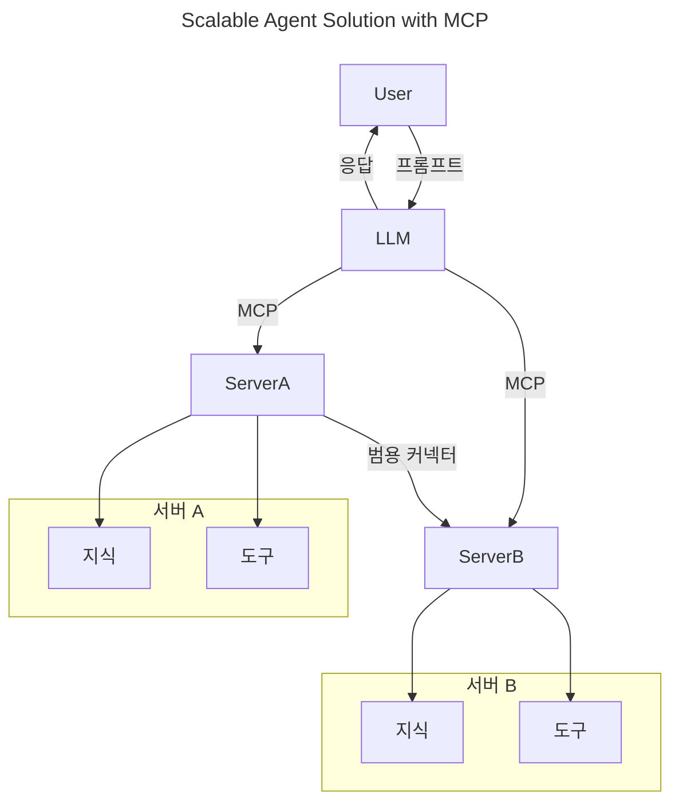
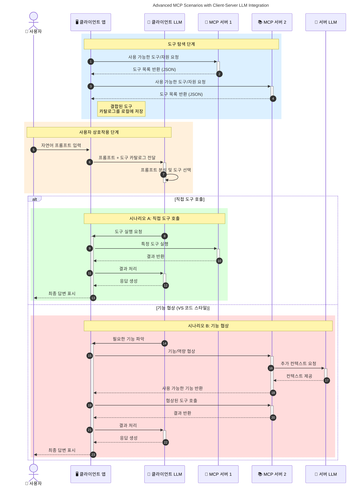

# 모델 컨텍스트 프로토콜(MCP) 소개: 확장 가능한 AI 애플리케이션에 왜 중요한가

[](https://youtu.be/agBbdiOPLQA)

_(위 이미지를 클릭하면 이 수업의 비디오를 볼 수 있습니다)_

생성 AI 애플리케이션은 사용자가 자연어 프롬프트를 사용하여 앱과 상호작용할 수 있게 하는 데 큰 진전입니다. 하지만 이러한 앱에 더 많은 시간과 자원을 투자할수록, 기능과 자원을 쉽게 통합하고 확장 가능하게 유지하며, 앱이 여러 모델을 지원하고 다양한 모델 특성을 처리할 수 있도록 하려면 일관된 아키텍처를 정의하고 표준에 의존할 필요가 있습니다. 즉, 생성 AI 앱을 시작하는 것은 쉽지만, 규모가 커지고 복잡해짐에 따라 아키텍처를 정의하고 MCP가 제공하는 표준을 통해 앱을 일관되게 구축해야 합니다.

---

## **🔍 모델 컨텍스트 프로토콜(MCP)이란?**

<strong>모델 컨텍스트 프로토콜(MCP)</strong>는 대규모 언어 모델(LLM)이 외부 도구, API, 데이터 소스와 원활하게 상호작용할 수 있도록 하는 <strong>개방형 표준화 인터페이스</strong>입니다. MCP는 AI 모델의 기능을 학습 데이터 그 이상으로 확장할 수 있게 하는 일관된 아키텍처를 제공하여 더 스마트하고 확장 가능하며 반응성 높은 AI 시스템을 가능하게 합니다.

---

## **🎯 AI에서 표준화가 중요한 이유**

생성 AI 애플리케이션이 복잡해짐에 따라, **확장성, 확장 가능성, 유지 보수성** 그리고 <strong>공급업체 종속 방지</strong>를 보장하는 표준을 채택하는 것이 필수적입니다. MCP는 이러한 요구 사항을 다음과 같이 해결합니다:

- 모델-도구 통합의 통합  
- 부서지기 쉬운 일회성 맞춤형 솔루션 감소  
- 여러 공급업체의 여러 모델이 하나의 생태계 내에서 공존할 수 있도록 허용  

**참고:** MCP는 개방형 표준으로 자신을 내세우고 있지만, IEEE, IETF, W3C, ISO 또는 기타 표준기구를 통해 MCP를 표준화할 계획은 없습니다.

---

## **📚 학습 목표**

이 글을 마치면 다음을 할 수 있게 됩니다:

- <strong>모델 컨텍스트 프로토콜(MCP)</strong>과 적용 사례 정의  
- MCP가 모델과 도구 간 통신을 표준화하는 방법 이해  
- MCP 아키텍처의 핵심 구성 요소 식별  
- 기업 및 개발 맥락에서 MCP의 실제 적용 사례 탐색  

---

## **💡 모델 컨텍스트 프로토콜(MCP)이 게임 체인저인 이유**

### **🔗 MCP는 AI 상호작용의 분열 문제를 해결합니다**

MCP 이전에는 모델과 도구를 통합하려면 다음이 필요했습니다:

- 도구-모델 쌍마다 맞춤 코드  
- 각 공급업체별 비표준 API  
- 업데이트로 인한 잦은 통합 중단  
- 도구 수가 늘어날수록 확장성 저하  

### **✅ MCP 표준화의 이점**

| <strong>이점</strong>                   | <strong>설명</strong>                                                                      |
|----------------------------|-------------------------------------------------------------------------------|
| 상호운용성                  | LLM이 여러 공급업체의 도구와 원활하게 작동                                    |
| 일관성                     | 플랫폼과 도구 전반에 걸친 균일한 동작                                          |
| 재사용성                   | 한 번 구축한 도구를 여러 프로젝트와 시스템에서 사용 가능                       |
| 개발 가속화                | 표준화된 플러그 앤 플레이 인터페이스로 개발 시간 단축                          |

---

## **🧱 MCP 고수준 아키텍처 개요**

MCP는 <strong>클라이언트-서버 모델</strong>을 따릅니다:

- <strong>MCP 호스트</strong>는 AI 모델을 실행합니다  
- <strong>MCP 클라이언트</strong>가 요청을 시작합니다  
- <strong>MCP 서버</strong>가 컨텍스트, 도구, 기능을 제공합니다  

### **핵심 구성 요소:**

- <strong>리소스</strong> – 모델에 제공되는 정적 또는 동적 데이터  
- <strong>프롬프트</strong> – 안내 생성용 사전 정의된 워크플로  
- <strong>도구</strong> – 검색, 계산 같은 실행 가능한 기능  
- <strong>샘플링</strong> – 재귀적 상호작용을 통한 에이전트 행동(`2026-07-28` 릴리스 후보에서 폐기 예정)  
- **요청 유도** – 서버가 시작하는 사용자 입력 요청  
- <strong>루트</strong> – 서버 접근 제어를 위한 파일 시스템 경계(`2026-07-28` 릴리스 후보에서 폐기 예정)  

### **프로토콜 아키텍처:**

MCP는 두 계층 아키텍처를 사용합니다:
- **데이터 계층**: 라이프사이클 관리와 원시 기능을 갖춘 JSON-RPC 2.0 기반 통신  
- **전송 계층**: STDIO(로컬) 및 SSE가 포함된 HTTP 스트림 가능 통신 채널(원격)  

---

## MCP 서버 작동 방식

MCP 서버는 다음과 같은 방식으로 작동합니다:

- **요청 흐름**:
    1. 최종 사용자 또는 사용자를 대신하는 소프트웨어가 요청을 시작합니다.  
    2. <strong>MCP 클라이언트</strong>는 요청을 AI 모델 런타임을 관리하는 <strong>MCP 호스트</strong>에 전송합니다.  
    3. <strong>AI 모델</strong>은 사용자 프롬프트를 받고, 하나 이상의 도구 호출을 통해 외부 도구나 데이터 접근을 요청할 수 있습니다.  
    4. <strong>MCP 호스트</strong>가 적절한 <strong>MCP 서버</strong>와 표준 프로토콜을 사용하여 통신하며, 모델이 직접 통신하지 않습니다.  
- **MCP 호스트 기능**:
    - **도구 레지스트리**: 이용 가능한 도구와 기능 목록 유지  
    - <strong>인증</strong>: 도구 접근 권한 검증  
    - **요청 처리기**: 모델의 도구 요청 처리  
    - **응답 포매터**: 모델이 이해할 수 있는 형식으로 도구 출력을 구조화  
- **MCP 서버 실행**:
    - <strong>MCP 호스트</strong>는 도구 호출을 검색, 계산, 데이터베이스 쿼리 등 특화된 기능을 제공하는 하나 이상의 <strong>MCP 서버</strong>로 라우팅  
    - <strong>MCP 서버</strong>는 해당 작업을 수행하고, 결과를 일관된 형식으로 <strong>MCP 호스트</strong>에 반환  
    - <strong>MCP 호스트</strong>는 결과를 포맷팅하여 <strong>AI 모델</strong>에 전달  
- **응답 완료**:
    - <strong>AI 모델</strong>은 도구 출력을 최종 응답에 통합  
    - <strong>MCP 호스트</strong>는 이 응답을 <strong>MCP 클라이언트</strong>에 보내 최종 사용자 또는 호출 소프트웨어에 전달  
    

```mermaid
---
title: MCP Architecture and Component Interactions
description: A diagram showing the flows of the components in MCP.
---
graph TD
    Client[MCP 클라이언트/애플리케이션] -->|요청 전송| H[MCP 호스트]
    H -->|호출함| A[AI 모델]
    A -->|도구 호출 요청| H
    H -->|MCP Protocol| T1[MCP Server Tool 01: 웹 검색
    H -->|MCP Protocol| T2[MCP Server Tool 02: 계산기 도구
    H -->|MCP Protocol| T3[MCP Server Tool 03: 데이터베이스 접근 도구
    H -->|MCP Protocol| T4[MCP Server Tool 04: 파일 시스템 도구
    H -->|응답 전송| Client

    subgraph "MCP 호스트 구성요소"
        H
        G[도구 등록부]
        I[인증]
        J[요청 처리기]
        K[응답 포매터]
    end

    H <--> G
    H <--> I
    H <--> J
    H <--> K

    style A fill:#f9d5e5,stroke:#333,stroke-width:2px
    style H fill:#eeeeee,stroke:#333,stroke-width:2px
    style Client fill:#d5e8f9,stroke:#333,stroke-width:2px
    style G fill:#fffbe6,stroke:#333,stroke-width:1px
    style I fill:#fffbe6,stroke:#333,stroke-width:1px
    style J fill:#fffbe6,stroke:#333,stroke-width:1px
    style K fill:#fffbe6,stroke:#333,stroke-width:1px
    style T1 fill:#c2f0c2,stroke:#333,stroke-width:1px
    style T2 fill:#c2f0c2,stroke:#333,stroke-width:1px
    style T3 fill:#c2f0c2,stroke:#333,stroke-width:1px
    style T4 fill:#c2f0c2,stroke:#333,stroke-width:1px
```

## 👨‍💻 MCP 서버 구축 방법 (예제 포함)

MCP 서버를 통해 LLM 기능을 데이터와 기능 제공으로 확장할 수 있습니다. 

시작할 준비가 되셨나요? 다양한 언어 및 스택별 SDK와 간단한 MCP 서버 생성 예제는 다음과 같습니다:

- **Python SDK**: https://github.com/modelcontextprotocol/python-sdk

- **TypeScript SDK**: https://github.com/modelcontextprotocol/typescript-sdk

- **Java SDK**: https://github.com/modelcontextprotocol/java-sdk

- **C#/.NET SDK**: https://github.com/modelcontextprotocol/csharp-sdk


## 🌍 MCP의 실제 적용 사례

MCP는 AI 기능 확장을 통해 다양한 애플리케이션을 가능하게 합니다:

| <strong>애플리케이션</strong>             | <strong>설명</strong>                                                                     |
|-----------------------------|------------------------------------------------------------------------------|
| 엔터프라이즈 데이터 통합    | LLM을 데이터베이스, CRM 또는 내부 도구에 연결                                |
| 에이전트 AI 시스템          | 도구 접근 및 의사결정 워크플로우가 가능한 자율 에이전트 구동                 |
| 멀티모달 애플리케이션       | 텍스트, 이미지, 오디오 도구를 단일 통합 AI 앱 내에서 결합                    |
| 실시간 데이터 통합          | 라이브 데이터를 AI 상호작용에 반영하여 더 정확하고 최신 결과 제공           |


### 🧠 MCP = AI 상호작용의 범용 표준

모델 컨텍스트 프로토콜(MCP)은 USB-C가 기기의 물리적 연결을 표준화한 것과 같이 AI 상호작용을 위한 범용 표준 역할을 합니다. AI 세계에서 MCP는 모델(클라이언트)이 외부 도구 및 데이터 제공자(서버)와 원활하게 통합할 수 있는 일관된 인터페이스를 제공합니다. 이를 통해 각 API나 데이터 소스마다 다양한 맞춤 프로토콜을 사용할 필요가 없어집니다.

MCP 하에 MCP 호환 도구(즉 MCP 서버)는 통일된 표준을 따릅니다. 이 서버들은 제공하는 도구나 작업을 나열할 수 있고, AI 에이전트가 요청 시 해당 작업을 실행합니다. MCP를 지원하는 AI 에이전트 플랫폼은 서버에서 이용 가능한 도구를 탐색하고 표준 프로토콜을 통해 호출할 수 있습니다.

### 💡 지식 접근 촉진

도구 제공을 넘어서 MCP는 지식 접근도 촉진합니다. 애플리케이션이 대규모 언어 모델(LLM)에 컨텍스트를 제공할 수 있도록 다양한 데이터 소스와 연결하는 것을 가능하게 합니다. 예를 들어, MCP 서버는 기업의 문서 저장소를 나타내어 에이전트가 필요에 따라 관련 정보를 검색할 수 있게 할 수 있습니다. 또 다른 서버는 이메일 전송이나 기록 업데이트 같은 특정 작업을 처리할 수 있습니다. 에이전트 관점에서 이러한 것들은 단지 사용할 수 있는 도구로, 일부 도구는 데이터(지식 컨텍스트)를 반환하고 다른 도구는 작업을 수행합니다. MCP는 이 두 가지를 효율적으로 관리합니다.

MCP 서버에 연결하는 에이전트는 표준 형식을 통해 서버가 제공하는 기능과 접근 가능한 데이터를 자동으로 학습합니다. 이 표준화 덕분에 도구의 가용성이 동적으로 변화할 수 있습니다. 예를 들어, 새로운 MCP 서버를 에이전트 시스템에 추가하면, 에이전트의 추가 맞춤화 없이도 해당 서버의 기능을 즉시 사용할 수 있습니다.

이 간소화된 통합은 다음 도표에 나타난 흐름과 일치하며, 서버가 도구와 지식을 모두 제공하여 시스템 간 원활한 협업을 보장합니다. 

### 👉 예시: 확장 가능한 에이전트 솔루션


유니버셜 커넥터는 MCP 서버들이 서로 통신하고 기능을 공유할 수 있게 하여 ServerA가 ServerB에 작업을 위임하거나 ServerB의 도구 및 지식에 접근할 수 있게 합니다. 이는 서버 간 도구와 데이터의 연합을 만들어 확장 가능하고 모듈화된 에이전트 아키텍처를 지원합니다. MCP가 도구 노출을 표준화하기 때문에, 에이전트는 하드코딩된 통합 없이 동적으로 도구를 발견하고 서버 간 요청을 라우팅할 수 있습니다.


도구 및 지식 연합: 도구와 데이터가 서버 간에 접근 가능하여 더욱 확장 가능하고 모듈화된 에이전트 아키텍처를 가능하게 합니다.

### 🔄 클라이언트 측 LLM 통합을 포함한 고급 MCP 시나리오

기본 MCP 아키텍처를 넘어서, 클라이언트와 서버 모두에 LLM이 포함되어 더 정교한 상호작용을 가능하게 하는 고급 시나리오가 있습니다. 아래 도표에서 <strong>클라이언트 앱</strong>은 LLM이 사용할 수 있는 여러 MCP 도구를 갖춘 IDE일 수 있습니다:



## 🔐 MCP의 실제 혜택

MCP 사용의 실제 이점은 다음과 같습니다:

- <strong>최신성</strong>: 모델이 학습 데이터를 넘어 최신 정보를 접근 가능  
- **기능 확장**: 모델이 훈련받지 않은 작업에 특화된 도구 활용 가능  
- **환각 감소**: 외부 데이터 소스가 사실 근거 제공  
- **개인 정보 보호**: 민감한 데이터는 프롬프트에 포함되지 않고 안전한 환경에 유지  

## 📌 주요 요점

MCP 사용에 대한 주요 요점은 다음과 같습니다:

- <strong>MCP</strong>는 AI 모델과 도구 및 데이터 간 상호작용 방식을 표준화  
- **확장성, 일관성, 상호운용성** 촉진  
- MCP는 <strong>개발 시간 단축, 신뢰성 향상, 모델 기능 확장</strong>에 기여  
- 클라이언트-서버 아키텍처는 **유연하고 확장 가능한 AI 애플리케이션 구현을 가능케 함**  

## 🧠 연습 문제

관심 있는 AI 애플리케이션을 생각해 보세요.

- 어떤 <strong>외부 도구나 데이터</strong>가 기능을 향상시킬 수 있을까요?  
- MCP가 통합을 **더 간단하고 신뢰할 수 있게** 만드는 방법은 무엇일까요?  

## 추가 자료

- [MCP GitHub Repository](https://github.com/modelcontextprotocol)


## 다음 내용

다음: [Chapter 1: Core Concepts](../01-CoreConcepts/README.md)

---

<!-- CO-OP TRANSLATOR DISCLAIMER START -->
**면책 조항**:
이 문서는 AI 번역 서비스 [Co-op Translator](https://github.com/Azure/co-op-translator)를 사용하여 번역되었습니다. 정확성을 기하기 위해 노력하고 있으나, 자동 번역은 오류나 부정확한 부분이 있을 수 있음을 유의하시기 바랍니다. 원본 문서의 원어본이 권위 있는 자료로 간주되어야 합니다. 중요한 정보의 경우, 전문가의 인간 번역을 권장합니다. 이 번역 사용으로 인해 발생하는 오해나 잘못된 해석에 대해 당사는 책임을 지지 않습니다.
<!-- CO-OP TRANSLATOR DISCLAIMER END -->