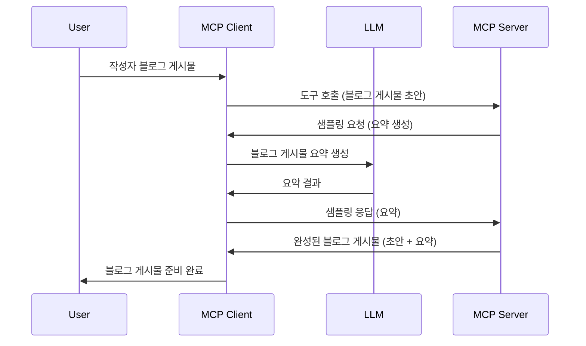

> [더 이상 사용되지 않음: 2026-07-28 릴리스 후보](https://blog.modelcontextprotocol.io/posts/2026-07-28-release-candidate/)

# 샘플링 - 클라이언트에 기능 위임하기

> **중단 알림:** `2026-07-28` MCP 사양 릴리스 후보는 샘플링을 더 이상 사용하지 않고 LLM 제공자 API와의 직접 통합을 권장합니다. 샘플링은 `2025-11-25` 버전과 공식 폐기 후 최소 1년간 계속 작동하므로 이 강의의 내용은 유효하지만, 새로운 서버 설계는 대체 패턴을 평가해야 합니다. 자세한 내용은 [MCP 변경 사항: 2026-07-28 릴리스 후보](../../01-CoreConcepts/mcp-2026-07-28-release-candidate.md)를 참고하세요.

때때로 MCP 클라이언트와 MCP 서버가 공동 목표를 달성하기 위해 협력해야 할 때가 있습니다. 서버가 클라이언트 쪽에 있는 LLM의 도움이 필요한 경우가 있을 수 있습니다. 이러한 상황에서 샘플링을 사용하는 것이 좋습니다.

몇 가지 사용 사례를 살펴보고 샘플링을 활용한 솔루션 구축 방법을 알아보겠습니다.

## 개요

이 강의에서는 샘플링을 언제 어디서 사용하는지, 그리고 어떻게 구성하는지에 대해 집중적으로 설명합니다.

## 학습 목표

이 장에서는 다음을 수행합니다:

- 샘플링이 무엇이며 언제 사용하는지 설명합니다.
- MCP에서 샘플링을 구성하는 방법을 보여줍니다.
- 샘플링의 실제 적용 예제를 제공합니다.

## 샘플링이란 무엇이며 왜 사용하는가?

샘플링은 다음과 같은 방식으로 작동하는 고급 기능입니다:



### 샘플링 요청

자, 이제 신뢰할 수 있는 시나리오의 큰 그림을 이해했으니, 서버가 클라이언트에 보내는 샘플링 요청에 대해 이야기해봅시다. JSON-RPC 형식의 요청은 다음과 같습니다:

```json
{
  "jsonrpc": "2.0",
  "id": 1,
  "method": "sampling/createMessage",
  "params": {
    "messages": [
      {
        "role": "user",
        "content": {
          "type": "text",
          "text": "Create a blog post summary of the following blog post: <BLOG POST>"
        }
      }
    ],
    "modelPreferences": {
      "hints": [
        {
          "name": "claude-3-sonnet"
        }
      ],
      "intelligencePriority": 0.8,
      "speedPriority": 0.5
    },
    "systemPrompt": "You are a helpful assistant.",
    "maxTokens": 100
  }
}
```

여기서 주목할 점이 몇 가지 있습니다:

- Content -> text 아래의 프롬프트는 LLM에게 블로그 게시물 내용을 요약하라는 지침입니다.

- **modelPreferences**: 이 섹션은 LLM 구성에 대한 권장 사항입니다. 사용자가 이 권장 사항을 따르거나 변경할 수 있습니다. 여기서는 사용할 모델과 속도, 지능 우선순위에 대한 권장 사항이 포함되어 있습니다.
- **systemPrompt**: LLM에 성격을 부여하고 지침을 담은 일반 시스템 프롬프트입니다.
- **maxTokens**: 이 작업에 권장되는 토큰 수를 지정하는 속성입니다.

### 샘플링 응답

이 응답은 MCP 클라이언트가 LLM을 호출하고 그 응답을 받은 후 구성하여 MCP 서버로 보내는 결과입니다. JSON-RPC는 다음과 같습니다:

```json
{
  "jsonrpc": "2.0",
  "id": 1,
  "result": {
    "role": "assistant",
    "content": {
      "type": "text",
      "text": "Here's your abstract <ABSTRACT>"
    },
    "model": "gpt-5",
    "stopReason": "endTurn"
  }
}
```

응답이 우리가 요청한 것처럼 블로그 게시물의 요약이라는 점에 주목하세요. 그리고 사용된 `model`이 요청한 모델이 아니라 "claude-3-sonnet" 대신 "gpt-5"인 점을 주목하세요. 이는 사용자가 사용할 모델을 마음대로 변경할 수 있으며, 샘플링 요청은 권장 사항임을 보여주기 위함입니다.

자, 이제 주요 흐름과 "블로그 게시물 작성 + 요약" 같은 유용한 작업을 이해했으니, 실제 작동시키기 위해 무엇을 해야 하는지 살펴봅시다.

### 메시지 유형

샘플링 메시지는 단순 텍스트에 국한되지 않고 이미지 및 오디오도 보낼 수 있습니다. JSON-RPC 형식은 다음과 같이 다릅니다:

<strong>텍스트</strong>

```json
{
  "type": "text",
  "text": "The message content"
}
```

**이미지 콘텐츠**

```json
{
  "type": "image",
  "data": "base64-encoded-image-data",
  "mimeType": "image/jpeg"
}
```

**오디오 콘텐츠**

```json
{
  "type": "audio",
  "data": "base64-encoded-audio-data",
  "mimeType": "audio/wav"
}
```

> 참고: 샘플링에 대한 자세한 정보는 [공식 문서](https://modelcontextprotocol.io/specification/2025-11-25/client/sampling)를 확인하세요.

## 클라이언트에서 샘플링 구성하기

> 참고: 서버만 구축한다면 여기서 많은 작업이 필요하지 않습니다.

클라이언트에서는 다음과 같이 기능을 지정해야 합니다:

```json
{
  "capabilities": {
    "sampling": {}
  }
}
```

그러면 선택한 클라이언트가 서버와 초기화될 때 이 설정이 적용됩니다.

## 실제 샘플링 예제 - 블로그 게시물 작성하기

함께 샘플링 서버를 코딩해 봅시다. 다음 작업을 수행해야 합니다:

1. 서버에 도구를 만듭니다.
1. 해당 도구가 샘플링 요청을 생성해야 합니다.
1. 도구가 클라이언트의 샘플링 응답을 기다려야 합니다.
1. 그리고 도구 결과를 생성해야 합니다.

단계별로 코드를 살펴봅시다:

### -1- 도구 만들기

**python**

```python
@mcp.tool()
async def create_blog(title: str, content: str, ctx: Context[ServerSession, None]) -> str:
    """Create a blog post and generate a summary"""

```

### -2- 샘플링 요청 만들기

도구에 다음 코드를 추가하세요:

**python**

```python
post = BlogPost(
        id=len(posts) + 1,
        title=title,
        content=content,
        abstract=""
    )

prompt = f"Create an abstract of the following blog post: title: {title} and draft: {content} "

result = await ctx.session.create_message(
        messages=[
            SamplingMessage(
                role="user",
                content=TextContent(type="text", text=prompt),
            )
        ],
        max_tokens=100,
)

```

### -3- 응답 기다리고 반환하기

**python**

```python
post.abstract = result.content.text

posts.append(post)

# 완성된 제품을 반환하십시오
return json.dumps({
    "id": post.title,
    "abstract": post.abstract
})
```

### -4- 전체 코드

**python**

```python
from starlette.applications import Starlette
from starlette.routing import Mount, Host

from mcp.server.fastmcp import Context, FastMCP

from mcp.server.session import ServerSession
from mcp.types import SamplingMessage, TextContent

import json


from uuid import uuid4
from typing import List
from pydantic import BaseModel


mcp = FastMCP("Blog post generator")

# app = FastAPI()

posts = []

class BlogPost(BaseModel):
    id: int
    title: str
    content: str
    abstract: str

posts: List[BlogPost] = []

@mcp.tool()
async def create_blog(title: str, content: str, ctx: Context[ServerSession, None]) -> str:
    """Create a blog post and generate a summary"""

    post = BlogPost(
        id=len(posts) + 1,
        title=title,
        content=content,
        abstract=""
    )

    prompt = f"Create an abstract of the following blog post: title: {title} and draft: {content} "

    result = await ctx.session.create_message(
        messages=[
            SamplingMessage(
                role="user",
                content=TextContent(type="text", text=prompt),
            )
        ],
        max_tokens=100,
    )

    post.abstract = result.content.text

    posts.append(post)

    # 전체 블로그 게시물을 반환합니다
    return json.dumps({
        "id": post.title,
        "abstract": post.abstract
    })

if __name__ == "__main__":
    print("Starting server...")
    # mcp.run()
    mcp.run(transport="streamable-http")

# 다음 명령어로 앱을 실행하세요: python server.py
```

### -5- Visual Studio Code에서 테스트하기

Visual Studio Code에서 테스트하려면 다음을 수행하세요:

1. 터미널에서 서버 시작
1. <em>mcp.json</em>에 서버 추가(그리고 실행 상태 확인), 예:

   ```json
   "servers": {
      "blog-server": {
        "type": "http",
        "url": "http://localhost:8000/mcp"
      }
   }
   ```

1. 프롬프트 입력:

   ```text
   create a blog post named "Where Python comes from", the content is "Python is actually named after Monty Python Flying Circus"
   ```

1. 샘플링이 진행되도록 허용하세요. 처음 테스트할 때는 추가 확인 대화 상자가 나타나며 이를 수락해야 하며, 이후에는 도구 실행 요청 대화 상자가 나타납니다.

1. 결과를 확인하세요. 결과가 GitHub Copilot Chat에서 깔끔하게 렌더링되고, 원시 JSON 응답도 확인할 수 있습니다.

<strong>보너스</strong>. Visual Studio Code 도구는 샘플링을 훌륭하게 지원합니다. 서버에서 샘플링 접근 권한을 다음과 같이 구성할 수 있습니다:

1. 확장 섹션으로 이동
1. "MCP SERVERS - INSTALLED" 섹션에서 설치된 서버의 톱니바퀴 아이콘 선택
1 "모델 접근 구성" 선택, 여기서 GitHub Copilot이 샘플링 시 사용할 수 있는 모델을 선택할 수 있습니다. 또한 "샘플링 요청 보기"를 선택해 최근 샘플링 요청도 볼 수 있습니다.

## 과제

이 과제에서는 제품 설명 생성을 지원하는 약간 다른 샘플링 통합을 구축합니다. 다음이 시나리오입니다:

<strong>시나리오</strong>: 전자상거래의 백오피스 담당자는 제품 설명 작성에 너무 많은 시간이 걸려 도움을 필요로 합니다. 따라서 "title"과 "keywords"를 인수로 받아 "description" 필드를 클라이언트 LLM으로 채워 완성된 제품을 생성하는 "create_product" 도구를 호출할 수 있는 솔루션을 구축하세요.

TIP: 앞서 배운 내용을 활용하여 이 서버와 도구를 샘플링 요청으로 구성하세요.

## 솔루션

[솔루션](./solution/README.md)

## 핵심 요점

샘플링은 서버가 LLM의 도움이 필요할 때 클라이언트에 작업을 위임할 수 있게 하는 강력한 기능입니다.

## 다음 단계

- [4장 - 실제 구현](../../04-PracticalImplementation/README.md)

---

<!-- CO-OP TRANSLATOR DISCLAIMER START -->
**면책 조항**:
이 문서는 AI 번역 서비스 [Co-op Translator](https://github.com/Azure/co-op-translator)를 사용하여 번역되었습니다. 정확성을 기하기 위해 노력하고 있으나, 자동 번역은 오류나 부정확한 부분이 있을 수 있음을 유의하시기 바랍니다. 원본 문서의 원어본이 권위 있는 자료로 간주되어야 합니다. 중요한 정보의 경우, 전문가의 인간 번역을 권장합니다. 이 번역 사용으로 인해 발생하는 오해나 잘못된 해석에 대해 당사는 책임을 지지 않습니다.
<!-- CO-OP TRANSLATOR DISCLAIMER END -->