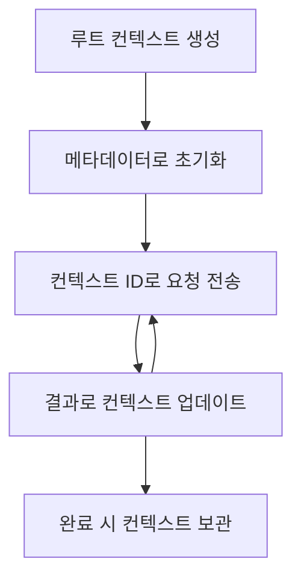

> [사용 중단 예정: 2026-07-28 릴리스 후보](https://blog.modelcontextprotocol.io/posts/2026-07-28-release-candidate/#roots-sampling-and-logging-are-deprecated)

# MCP 루트 컨텍스트

> **사용 중단 알림:** `2026-07-28` MCP 사양 릴리스 후보는 루트를 도구 매개변수, 리소스 URI 또는 서버 구성으로 대체하는 것을 권장하면서 루트를 사용 중단 대상으로 지정합니다. 루트는 `2025-11-25` 및 공식적인 사용 중단 후 최소 1년간 계속 작동하므로 이 수업의 내용은 모두 유효하지만, 새로운 서버 설계는 대체 패턴을 평가해야 합니다. 자세한 내용은 [MCP에서 변경 사항: 2026-07-28 릴리스 후보](../../01-CoreConcepts/mcp-2026-07-28-release-candidate.md)를 참조하세요.

루트 컨텍스트는 여러 요청과 세션에 걸쳐 대화 기록과 공유 상태를 유지하기 위한 지속적인 계층을 제공하는 모델 컨텍스트 프로토콜의 기본 개념입니다.

## 소개

이 강의에서는 MCP에서 루트 컨텍스트를 생성, 관리 및 활용하는 방법을 살펴봅니다. 

## 학습 목표

이 강의가 끝나면 다음을 수행할 수 있습니다:

- 루트 컨텍스트의 목적과 구조 이해
- MCP 클라이언트 라이브러리를 사용하여 루트 컨텍스트 생성 및 관리
- .NET, Java, JavaScript 및 Python 애플리케이션에서 루트 컨텍스트 구현
- 다중 턴 대화 및 상태 관리에 루트 컨텍스트 활용
- 루트 컨텍스트 관리 모범 사례 구현

## 루트 컨텍스트 이해하기

루트 컨텍스트는 관련 상호작용 시퀀스의 기록과 상태를 담는 컨테이너 역할을 합니다. 다음을 가능하게 합니다:

- **대화 지속성**: 일관된 다중 턴 대화 유지
- **메모리 관리**: 상호작용 간 정보 저장 및 검색
- **상태 관리**: 복잡한 워크플로우 진행 상황 추적
- **컨텍스트 공유**: 여러 클라이언트가 동일한 대화 상태에 접근 가능

MCP의 루트 컨텍스트 주요 특징은 다음과 같습니다:

- 각 루트 컨텍스트는 고유 식별자를 가집니다.
- 대화 기록, 사용자 환경 설정 및 기타 메타데이터를 포함할 수 있습니다.
- 필요에 따라 생성, 접근, 보관할 수 있습니다.
- 세밀한 접근 제어 및 권한을 지원합니다.

## 루트 컨텍스트 수명 주기



## 루트 컨텍스트 작업하기

다음은 루트 컨텍스트를 생성하고 관리하는 예제입니다. 

### C# 구현

```csharp
// .NET Example: Root Context Management
using Microsoft.Mcp.Client;
using System;
using System.Threading.Tasks;
using System.Collections.Generic;

public class RootContextExample
{
    private readonly IMcpClient _client;
    private readonly IRootContextManager _contextManager;
    
    public RootContextExample(IMcpClient client, IRootContextManager contextManager)
    {
        _client = client;
        _contextManager = contextManager;
    }
    
    public async Task DemonstrateRootContextAsync()
    {
        // 1. Create a new root context
        var contextResult = await _contextManager.CreateRootContextAsync(new RootContextCreateOptions
        {
            Name = "Customer Support Session",
            Metadata = new Dictionary<string, string>
            {
                ["CustomerName"] = "Acme Corporation",
                ["PriorityLevel"] = "High",
                ["Domain"] = "Cloud Services"
            }
        });
        
        string contextId = contextResult.ContextId;
        Console.WriteLine($"Created root context with ID: {contextId}");
        
        // 2. First interaction using the context
        var response1 = await _client.SendPromptAsync(
            "I'm having issues scaling my web service deployment in the cloud.", 
            new SendPromptOptions { RootContextId = contextId }
        );
        
        Console.WriteLine($"First response: {response1.GeneratedText}");
        
        // Second interaction - the model will have access to the previous conversation
        var response2 = await _client.SendPromptAsync(
            "Yes, we're using containerized deployments with Kubernetes.", 
            new SendPromptOptions { RootContextId = contextId }
        );
        
        Console.WriteLine($"Second response: {response2.GeneratedText}");
        
        // 3. Add metadata to the context based on conversation
        await _contextManager.UpdateContextMetadataAsync(contextId, new Dictionary<string, string>
        {
            ["TechnicalEnvironment"] = "Kubernetes",
            ["IssueType"] = "Scaling"
        });
        
        // 4. Get context information
        var contextInfo = await _contextManager.GetRootContextInfoAsync(contextId);
        
        Console.WriteLine("Context Information:");
        Console.WriteLine($"- Name: {contextInfo.Name}");
        Console.WriteLine($"- Created: {contextInfo.CreatedAt}");
        Console.WriteLine($"- Messages: {contextInfo.MessageCount}");
        
        // 5. When the conversation is complete, archive the context
        await _contextManager.ArchiveRootContextAsync(contextId);
        Console.WriteLine($"Archived context {contextId}");
    }
}
```

앞 코드에서는:

1. 고객 지원 세션을 위한 루트 컨텍스트를 생성했습니다.
1. 해당 컨텍스트 내에서 여러 메시지를 보내 모델이 상태를 유지하도록 했습니다.
1. 대화에 기반해 관련 메타데이터로 컨텍스트를 업데이트했습니다.
1. 대화 기록을 이해하기 위해 컨텍스트 정보를 조회했습니다.
1. 대화가 완료되면 컨텍스트를 보관했습니다.

## 예제: 금융 분석용 루트 컨텍스트 구현

이 예제에서는 여러 상호작용에 걸쳐 상태를 유지하는 금융 분석 세션을 위한 루트 컨텍스트를 생성하는 방법을 보여줍니다.

### Java 구현

```java
// 자바 예제: 루트 컨텍스트 구현
package com.example.mcp.contexts;

import com.mcp.client.McpClient;
import com.mcp.client.ContextManager;
import com.mcp.models.RootContext;
import com.mcp.models.McpResponse;

import java.util.HashMap;
import java.util.Map;
import java.util.UUID;

public class RootContextsDemo {
    private final McpClient client;
    private final ContextManager contextManager;
    
    public RootContextsDemo(String serverUrl) {
        this.client = new McpClient.Builder()
            .setServerUrl(serverUrl)
            .build();
            
        this.contextManager = new ContextManager(client);
    }
    
    public void demonstrateRootContext() throws Exception {
        // 컨텍스트 메타데이터 생성
        Map<String, String> metadata = new HashMap<>();
        metadata.put("projectName", "Financial Analysis");
        metadata.put("userRole", "Financial Analyst");
        metadata.put("dataSource", "Q1 2025 Financial Reports");
        
        // 1. 새로운 루트 컨텍스트 생성
        RootContext context = contextManager.createRootContext("Financial Analysis Session", metadata);
        String contextId = context.getId();
        
        System.out.println("Created context: " + contextId);
        
        // 2. 첫 번째 상호작용
        McpResponse response1 = client.sendPrompt(
            "Analyze the trends in Q1 financial data for our technology division",
            contextId
        );
        
        System.out.println("First response: " + response1.getGeneratedText());
        
        // 3. 응답에서 얻은 중요한 정보로 컨텍스트 업데이트
        contextManager.addContextMetadata(contextId, 
            Map.of("identifiedTrend", "Increasing cloud infrastructure costs"));
        
        // 두 번째 상호작용 - 동일한 컨텍스트 사용
        McpResponse response2 = client.sendPrompt(
            "What's driving the increase in cloud infrastructure costs?",
            contextId
        );
        
        System.out.println("Second response: " + response2.getGeneratedText());
        
        // 4. 분석 세션 요약 생성
        McpResponse summaryResponse = client.sendPrompt(
            "Summarize our analysis of the technology division financials in 3-5 key points",
            contextId
        );
        
        // 요약을 컨텍스트 메타데이터에 저장
        contextManager.addContextMetadata(contextId, 
            Map.of("analysisSummary", summaryResponse.getGeneratedText()));
            
        // 업데이트된 컨텍스트 정보 가져오기
        RootContext updatedContext = contextManager.getRootContext(contextId);
        
        System.out.println("Context Information:");
        System.out.println("- Created: " + updatedContext.getCreatedAt());
        System.out.println("- Last Updated: " + updatedContext.getLastUpdatedAt());
        System.out.println("- Analysis Summary: " + 
            updatedContext.getMetadata().get("analysisSummary"));
            
        // 5. 완료 후 컨텍스트 보관
        contextManager.archiveContext(contextId);
        System.out.println("Context archived");
    }
}
```

앞 코드에서는:

1. 금융 분석 세션을 위한 루트 컨텍스트를 생성했습니다.
2. 해당 컨텍스트 내 여러 메시지를 보내 모델이 상태를 유지하도록 했습니다.
3. 대화에 기반해 관련 메타데이터로 컨텍스트를 업데이트했습니다.
4. 분석 세션 요약을 생성해 컨텍스트 메타데이터에 저장했습니다.
5. 대화 완료 시 컨텍스트를 보관했습니다.

## 예제: 루트 컨텍스트 관리

효과적인 루트 컨텍스트 관리는 대화 기록과 상태를 유지하는 데 중요합니다. 아래는 루트 컨텍스트 관리 구현 예시입니다.

### JavaScript 구현

```javascript
// JavaScript 예제: MCP 루트 컨텍스트 관리
const { McpClient, RootContextManager } = require('@mcp/client');

class ContextSession {
  constructor(serverUrl, apiKey = null) {
    // MCP 클라이언트 초기화
    this.client = new McpClient({
      serverUrl,
      apiKey
    });
    
    // 컨텍스트 관리자 초기화
    this.contextManager = new RootContextManager(this.client);
  }
  
  /**
   * Create a new conversation context
   * @param {string} sessionName - Name of the conversation session
   * @param {Object} metadata - Additional metadata for the context
   * @returns {Promise<string>} - Context ID
   */
  async createConversationContext(sessionName, metadata = {}) {
    try {
      const contextResult = await this.contextManager.createRootContext({
        name: sessionName,
        metadata: {
          ...metadata,
          createdAt: new Date().toISOString(),
          status: 'active'
        }
      });
      
      console.log(`Created root context '${sessionName}' with ID: ${contextResult.id}`);
      return contextResult.id;
    } catch (error) {
      console.error('Error creating root context:', error);
      throw error;
    }
  }
  
  /**
   * Send a message in an existing context
   * @param {string} contextId - The root context ID
   * @param {string} message - The user's message
   * @param {Object} options - Additional options
   * @returns {Promise<Object>} - Response data
   */
  async sendMessage(contextId, message, options = {}) {
    try {
      // 지정된 컨텍스트를 사용하여 메시지 전송
      const response = await this.client.sendPrompt(message, {
        rootContextId: contextId,
        temperature: options.temperature || 0.7,
        allowedTools: options.allowedTools || []
      });
      
      // 대화의 중요한 인사이트를 선택적으로 저장
      if (options.storeInsights) {
        await this.storeConversationInsights(contextId, message, response.generatedText);
      }
      
      return {
        message: response.generatedText,
        toolCalls: response.toolCalls || [],
        contextId
      };
    } catch (error) {
      console.error(`Error sending message in context ${contextId}:`, error);
      throw error;
    }
  }
  
  /**
   * Store important insights from a conversation
   * @param {string} contextId - The root context ID
   * @param {string} userMessage - User's message
   * @param {string} aiResponse - AI's response
   */
  async storeConversationInsights(contextId, userMessage, aiResponse) {
    try {
      // 잠재적 인사이트 추출 (실제 앱에서는 더 정교함)
      const combinedText = userMessage + "\n" + aiResponse;
      
      // 잠재적 인사이트를 식별하기 위한 간단한 휴리스틱
      const insightWords = ["important", "key point", "remember", "significant", "crucial"];
      
      const potentialInsights = combinedText
        .split(".")
        .filter(sentence => 
          insightWords.some(word => sentence.toLowerCase().includes(word))
        )
        .map(sentence => sentence.trim())
        .filter(sentence => sentence.length > 10);
      
      // 인사이트를 컨텍스트 메타데이터에 저장
      if (potentialInsights.length > 0) {
        const insights = {};
        potentialInsights.forEach((insight, index) => {
          insights[`insight_${Date.now()}_${index}`] = insight;
        });
        
        await this.contextManager.updateContextMetadata(contextId, insights);
        console.log(`Stored ${potentialInsights.length} insights in context ${contextId}`);
      }
    } catch (error) {
      console.warn('Error storing conversation insights:', error);
      // 중요하지 않은 오류이므로 경고만 기록
    }
  }
  
  /**
   * Get summary information about a context
   * @param {string} contextId - The root context ID
   * @returns {Promise<Object>} - Context information
   */
  async getContextInfo(contextId) {
    try {
      const contextInfo = await this.contextManager.getContextInfo(contextId);
      
      return {
        id: contextInfo.id,
        name: contextInfo.name,
        created: new Date(contextInfo.createdAt).toLocaleString(),
        lastUpdated: new Date(contextInfo.lastUpdatedAt).toLocaleString(),
        messageCount: contextInfo.messageCount,
        metadata: contextInfo.metadata,
        status: contextInfo.status
      };
    } catch (error) {
      console.error(`Error getting context info for ${contextId}:`, error);
      throw error;
    }
  }
  
  /**
   * Generate a summary of the conversation in a context
   * @param {string} contextId - The root context ID
   * @returns {Promise<string>} - Generated summary
   */
  async generateContextSummary(contextId) {
    try {
      // 지금까지의 대화 요약을 모델에 요청
      const response = await this.client.sendPrompt(
        "Please summarize our conversation so far in 3-4 sentences, highlighting the main points discussed.",
        { rootContextId: contextId, temperature: 0.3 }
      );
      
      // 요약을 컨텍스트 메타데이터에 저장
      await this.contextManager.updateContextMetadata(contextId, {
        conversationSummary: response.generatedText,
        summarizedAt: new Date().toISOString()
      });
      
      return response.generatedText;
    } catch (error) {
      console.error(`Error generating context summary for ${contextId}:`, error);
      throw error;
    }
  }
  
  /**
   * Archive a context when it's no longer needed
   * @param {string} contextId - The root context ID
   * @returns {Promise<Object>} - Result of the archive operation
   */
  async archiveContext(contextId) {
    try {
      // 보관하기 전에 최종 요약 생성
      const summary = await this.generateContextSummary(contextId);
      
      // 컨텍스트 보관
      await this.contextManager.archiveContext(contextId);
      
      return {
        status: "archived",
        contextId,
        summary
      };
    } catch (error) {
      console.error(`Error archiving context ${contextId}:`, error);
      throw error;
    }
  }
}

// 사용 예제
async function demonstrateContextSession() {
  const session = new ContextSession('https://mcp-server-example.com');
  
  try {
    // 1. 제품 지원 대화를 위한 새 컨텍스트 생성
    const contextId = await session.createConversationContext(
      'Product Support - Database Performance',
      {
        customer: 'Globex Corporation',
        product: 'Enterprise Database',
        severity: 'Medium',
        supportAgent: 'AI Assistant'
      }
    );
    
    // 2. 대화의 첫 번째 메시지
    const response1 = await session.sendMessage(
      contextId,
      "I'm experiencing slow query performance on our database cluster after the latest update.",
      { storeInsights: true }
    );
    console.log('Response 1:', response1.message);
    
    // 같은 컨텍스트에서 후속 메시지
    const response2 = await session.sendMessage(
      contextId,
      "Yes, we've already checked the indexes and they seem to be properly configured.",
      { storeInsights: true }
    );
    console.log('Response 2:', response2.message);
    
    // 3. 컨텍스트 정보 가져오기
    const contextInfo = await session.getContextInfo(contextId);
    console.log('Context Information:', contextInfo);
    
    // 4. 대화 요약 생성 및 표시
    const summary = await session.generateContextSummary(contextId);
    console.log('Conversation Summary:', summary);
    
    // 5. 완료 시 컨텍스트 보관
    const archiveResult = await session.archiveContext(contextId);
    console.log('Archive Result:', archiveResult);
    
    // 6. 오류를 부드럽게 처리
  } catch (error) {
    console.error('Error in context session demonstration:', error);
  }
}

demonstrateContextSession();
```

앞 코드에서는:

1. `createConversationContext` 함수를 사용해 데이터베이스 성능 문제에 관한 제품 지원 대화를 위한 루트 컨텍스트를 생성했습니다.

1. `sendMessage` 함수를 이용해 여러 메시지를 보내 모델이 속도 저하 쿼리 성능과 인덱스 구성에 대해 상태를 유지하도록 했습니다.

1. 대화에 기반해 관련 메타데이터로 컨텍스트를 업데이트했습니다.

1. `generateContextSummary` 함수를 이용해 대화 요약을 생성해 컨텍스트 메타데이터에 저장했습니다.

1. `archiveContext` 함수를 사용해 대화 완료 시 컨텍스트를 보관했습니다.

1. 오류를 우아하게 처리하여 견고성을 보장했습니다.

## 다중 턴 지원을 위한 루트 컨텍스트

이 예제에서는 다중 턴 지원 세션을 위한 루트 컨텍스트를 생성해 여러 상호작용에 걸쳐 상태를 유지하는 방법을 보여줍니다.

### Python 구현

```python
# Python 예제: 다중 턴 지원을 위한 루트 컨텍스트
import asyncio
from datetime import datetime
from mcp_client import McpClient, RootContextManager

class AssistantSession:
    def __init__(self, server_url, api_key=None):
        self.client = McpClient(server_url=server_url, api_key=api_key)
        self.context_manager = RootContextManager(self.client)
    
    async def create_session(self, name, user_info=None):
        """Create a new root context for an assistant session"""
        metadata = {
            "session_type": "assistant",
            "created_at": datetime.now().isoformat(),
        }
        
        # 사용자 정보가 제공된 경우 추가
        if user_info:
            metadata.update({f"user_{k}": v for k, v in user_info.items()})
            
        # 루트 컨텍스트 생성
        context = await self.context_manager.create_root_context(name, metadata)
        return context.id
    
    async def send_message(self, context_id, message, tools=None):
        """Send a message within a root context"""
        # 컨텍스트 ID로 옵션 생성
        options = {
            "root_context_id": context_id
        }
        
        # 도구가 지정된 경우 추가
        if tools:
            options["allowed_tools"] = tools
        
        # 컨텍스트 내에서 프롬프트 전송
        response = await self.client.send_prompt(message, options)
        
        # 대화 진행 상황으로 컨텍스트 메타데이터 업데이트
        await self.context_manager.update_context_metadata(
            context_id,
            {
                f"message_{datetime.now().timestamp()}": message[:50] + "...",
                "last_interaction": datetime.now().isoformat()
            }
        )
        
        return response
    
    async def get_conversation_history(self, context_id):
        """Retrieve conversation history from a context"""
        context_info = await self.context_manager.get_context_info(context_id)
        messages = await self.client.get_context_messages(context_id)
        
        return {
            "context_info": context_info,
            "messages": messages
        }
    
    async def end_session(self, context_id):
        """End an assistant session by archiving the context"""
        # 먼저 요약 프롬프트 생성
        summary_response = await self.client.send_prompt(
            "Please summarize our conversation and any key points or decisions made.",
            {"root_context_id": context_id}
        )
        
        # 요약을 메타데이터에 저장
        await self.context_manager.update_context_metadata(
            context_id,
            {
                "summary": summary_response.generated_text,
                "ended_at": datetime.now().isoformat(),
                "status": "completed"
            }
        )
        
        # 컨텍스트 보관
        await self.context_manager.archive_context(context_id)
        
        return {
            "status": "completed",
            "summary": summary_response.generated_text
        }

# 사용 예
async def demo_assistant_session():
    assistant = AssistantSession("https://mcp-server-example.com")
    
    # 1. 세션 생성
    context_id = await assistant.create_session(
        "Technical Support Session",
        {"name": "Alex", "technical_level": "advanced", "product": "Cloud Services"}
    )
    print(f"Created session with context ID: {context_id}")
    
    # 2. 첫 상호작용
    response1 = await assistant.send_message(
        context_id, 
        "I'm having trouble with the auto-scaling feature in your cloud platform.",
        ["documentation_search", "diagnostic_tool"]
    )
    print(f"Response 1: {response1.generated_text}")
    
    # 같은 컨텍스트에서 두 번째 상호작용
    response2 = await assistant.send_message(
        context_id,
        "Yes, I've already checked the configuration settings you mentioned, but it's still not working."
    )
    print(f"Response 2: {response2.generated_text}")
    
    # 3. 기록 가져오기
    history = await assistant.get_conversation_history(context_id)
    print(f"Session has {len(history['messages'])} messages")
    
    # 4. 세션 종료
    end_result = await assistant.end_session(context_id)
    print(f"Session ended with summary: {end_result['summary']}")

if __name__ == "__main__":
    asyncio.run(demo_assistant_session())
```

앞 코드에서는:

1. `create_session` 함수를 사용해 사용자 이름 및 기술 수준과 같은 정보를 포함하는 기술 지원 세션용 루트 컨텍스트를 생성했습니다.

1. `send_message` 함수를 이용해 여러 메시지를 보내 자동 확장 기능 문제에 대해 상태를 유지하도록 했습니다.

1. `get_conversation_history` 함수를 사용해 대화 이력 및 메시지 정보를 조회했습니다.

1. `end_session` 함수를 이용해 컨텍스트를 보관하고 요약을 생성해 대화 핵심 내용을 캡처하며 세션을 종료했습니다.

## 루트 컨텍스트 모범 사례

다음은 루트 컨텍스트를 효과적으로 관리하기 위한 모범 사례입니다:

- **집중된 컨텍스트 생성**: 명확성을 유지하기 위해 대화 목적이나 도메인별로 별도 루트 컨텍스트를 만드세요.

- **만료 정책 설정**: 저장소 관리 및 데이터 보존 정책 준수를 위해 오래된 컨텍스트를 보관하거나 삭제하는 정책을 구현하세요.

- **관련 메타데이터 저장**: 대화에 유용할 수 있는 중요한 정보를 컨텍스트 메타데이터에 저장하세요.

- **컨텍스트 ID 일관성 유지**: 컨텍스트 생성 후 모든 관련 요청에 대해 해당 ID를 일관되게 사용하여 연속성을 유지하세요.

- **요약 생성**: 컨텍스트가 커지면 요약을 생성해 필수 정보를 포착하고 컨텍스트 크기를 관리하세요.

- **접근 제어 구현**: 다중 사용자 시스템에서는 대화 컨텍스트의 프라이버시와 보안을 위해 적절한 접근 제어를 구현하세요.

- **컨텍스트 제한 처리**: 컨텍스트 크기 제한을 인지하고 매우 긴 대화에 대한 처리 전략을 마련하세요.

- **완료 시 보관**: 대화가 완료되면 자원을 해제하면서 대화 기록을 보존하기 위해 컨텍스트를 보관하세요.

## 다음 단계

- [5.5 라우팅](../mcp-routing/README.md)

---

<!-- CO-OP TRANSLATOR DISCLAIMER START -->
**면책 조항**:
이 문서는 AI 번역 서비스 [Co-op Translator](https://github.com/Azure/co-op-translator)를 사용하여 번역되었습니다. 정확성을 기하기 위해 노력하고 있으나, 자동 번역은 오류나 부정확한 부분이 있을 수 있음을 유의하시기 바랍니다. 원본 문서의 원어본이 권위 있는 자료로 간주되어야 합니다. 중요한 정보의 경우, 전문가의 인간 번역을 권장합니다. 이 번역 사용으로 인해 발생하는 오해나 잘못된 해석에 대해 당사는 책임을 지지 않습니다.
<!-- CO-OP TRANSLATOR DISCLAIMER END -->