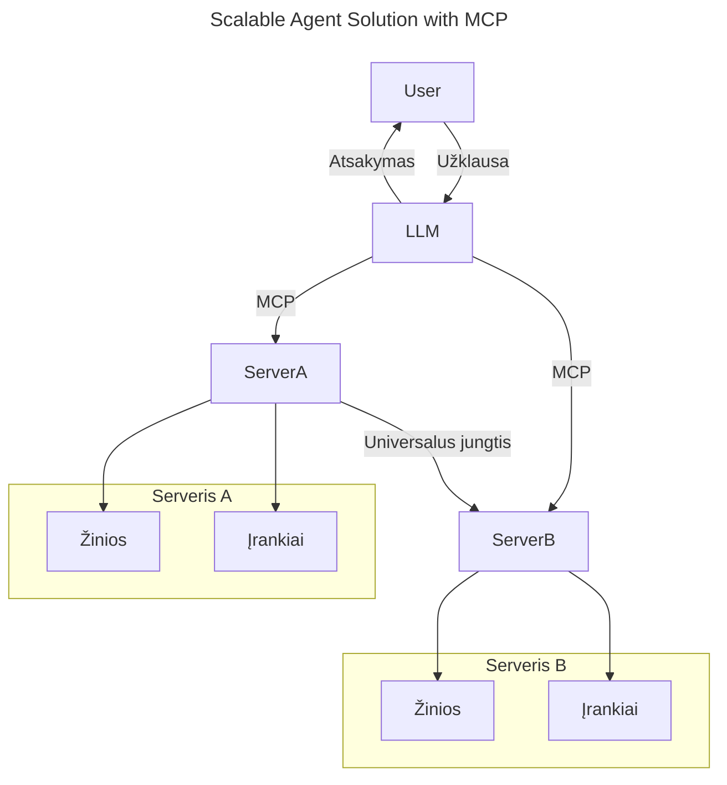
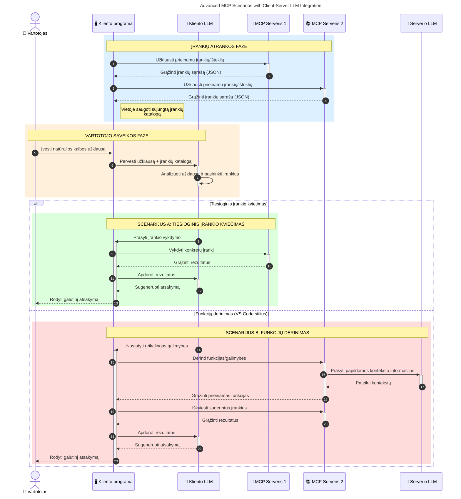

# Modelio konteksto protokolo (MCP) pristatymas: kodėl tai svarbu mastelio didinimo AI programoms

[](https://youtu.be/agBbdiOPLQA)

_(Spustelėkite aukščiau esančią nuotrauką, kad peržiūrėtumėte šio pamokos vaizdo įrašą)_

Generatyviosios dirbtinio intelekto (AI) programos yra didelis žingsnis į priekį, nes dažnai leidžia vartotojui bendrauti su programa natūralios kalbos užklausomis. Tačiau, kai tokiose programose investuojama daugiau laiko ir išteklių, norite įsitikinti, kad galite lengvai integruoti funkcijas ir išteklius taip, kad būtų lengva plėsti, programa galėtų išnaudoti daugiau nei vieną modelį ir tvarkyti įvairius modeliavimo niuansus. Trumpai tariant, kurti generatyvias AI programas pradžioje yra paprasta, bet kai jos auga ir tampa sudėtingesnės, reikia pradėti apibrėžti architektūrą ir tikriausiai naudotis standartu, kad programos būtų kuriamos nuosekliai. Čia į pagalbą ateina MCP, organizuodamas procesus ir teikdamas standartą.

---

## **🔍 Kas yra Modelio konteksto protokolas (MCP)?**

**Modelio konteksto protokolas (MCP)** yra **atviras, standartizuotas sąsajos protokolas**, leidžiantis didelės apimties kalbos modeliams (LLM) sklandžiai bendrauti su išoriniais įrankiais, API ir duomenų šaltiniais. Jis suteikia nuoseklią architektūrą, leidžiančią praplėsti AI modelio funkcionalumą už jų mokymosi duomenų ribų, užtikrinant protingesnes, mastelius didinančias ir lankstesnes AI sistemas.

---

## **🎯 Kodėl standartizacija AI yra svarbi**

Kai generatyvios AI programos tampa sudėtingesnės, būtina priimti standartus, užtikrinančius **masto didinimą, plėtimą, palaikomumą** ir **apsaugą nuo tiekėjų izoliavimo**. MCP atlieka šias funkcijas:

- Vienodina modelių ir įrankių integracijas
- Mažina trapias, vienkartines pritaikytas sprendimus
- Leidžia keliems skirtingų tiekėjų modeliams egzistuoti vienoje ekosistemoje

**Pastaba:** Nors MCP reklamuoja save kaip atvirą standartą, nėra planų standartizuoti MCP per esamus standartų kūrėjų organus, tokius kaip IEEE, IETF, W3C, ISO ar kitus.

---

## **📚 Mokymosi Tikslai**

Šio straipsnio pabaigoje jūs galėsite:

- Apibrėžti **Modelio konteksto protokolą (MCP)** ir jo panaudojimo atvejus
- Suprasti, kaip MCP standartizuoja modelio ir įrankio komunikaciją
- Nustatyti MCP architektūros pagrindines sudedamąsias dalis
- Išnagrinėti realius MCP panaudojimo atvejus įmonių ir kūrimo kontekstuose

---

## **💡 Kodėl Modelio konteksto protokolas (MCP) yra revoliucinis**

### **🔗 MCP sprendžia AI sąveikų fragmentaciją**

Prieš MCP modelių ir įrankių integravimas reikalaudavo:

- Kiekvienam įrankio ir modelio porai parašyto specialaus kodo
- Nestandartinių API kiekvienam tiekėjui
- Dažnų trikdžių dėl atnaujinimų
- Prastos mastelio galimybės su daugeliu įrankių

### **✅ MCP standartizacijos privalumai**

| **Privalumas**              | **Aprašymas**                                                                |
|--------------------------|--------------------------------------------------------------------------------|
| Sąveikumas               | LLM dirba sklandžiai su įrankiais iš skirtingų tiekėjų                       |
| Nuoseklumas              | Vienodas elgesys platformose ir įrankiuose                                   |
| Pakartotinis naudojimas  | Kartą sukurti įrankiai gali būti naudojami įvairiuose projektuose ir sistemose|
| Greitesnis vystymas      | Sutrumpinkite kūrimo laiką naudodami standartizuotas sąsajas                  |

---

## **🧱 MCP aukšto lygio architektūros apžvalga**

MCP naudoja **kliento-serverio modelį**, kur:

- **MCP šeimininkai** vykdo AI modelius
- **MCP klientai** inicijuoja užklausas
- **MCP serveriai** teikia kontekstą, įrankius ir galimybes

### **Pagrindinės dalys:**

- **Ištekliai** – statiniai arba dinaminiai duomenys modeliams  
- **Užklausos** – iš anksto apibrėžti darbo srautai vediniam generavimui  
- **Įrankiai** – vykdomos funkcijos, pvz., paieška, skaičiavimai  
- **Atranka** – agentinis elgesys per pasikartojančias sąveikas (atsisakyta `2026-07-28` leidimo kandidatuose)
- **Iškvietimas** – serverio inicijuotos užklausos vartotojo įvedimui
- **Šaknys** – failų sistemos ribos serverio prieigos kontrolei (atsisakyta `2026-07-28` leidimo kandidatuose)

### **Protokolo architektūra:**

MCP naudoja dviejų sluoksnių architektūrą:
- **Duomenų sluoksnis**: JSON-RPC 2.0 pagrindu bendraujama su gyvenimo ciklo valdymu ir pirminėmis operacijomis
- **Transporto sluoksnis**: STDIO (vietinis) ir srautinio HTTP su SSE (nuotolinis) komunikacijos kanalai

---

## Kaip veikia MCP serveriai

MCP serveriai veikia taip:

- **Užklausos srautas**:
    1. Užklausą inicijuoja galutinis vartotojas ar programinė įranga jo vardu.
    2. **MCP klientas** perduoda užklausą **MCP šeimininkui**, kuris valdo AI modelio vykdymą.
    3. **AI modelis** gauna vartotojo užklausą ir gali prašyti prieigos prie išorinių įrankių ar duomenų per vieną ar kelis įrankių kvietimus.
    4. **MCP šeimininkas**, ne modelis tiesiogiai, bendrauja su tinkamu **MCP serveriu(-iais)** naudodamas standartizuotą protokolą.
- **MCP šeimininko funkcionalumas**:
    - **Įrankių registras**: Laiko katalogą turimų įrankių ir jų galimybių.
    - **Autentifikacija**: Patikrina įrankių prieigos leidimus.
    - **Užklausų apdorojimo modulis**: Tvarko gaunamas įrankių užklausas iš modelio.
    - **Atsakymų formatavimo modulis**: Struktūruoja įrankių rezultatus formatu, kurį modelis gali suprasti.
- **MCP serverio vykdymas**:
    - **MCP šeimininkas** nukreipia įrankių kvietimus vienam ar keliems **MCP serveriams**, kurie teikia specializuotas funkcijas (pvz., paieška, skaičiavimai, duomenų bazės užklausos).
    - **MCP serveriai** atlieka savo operacijas ir grąžina rezultatus **MCP šeimininkui** nuosekliu formatu.
    - **MCP šeimininkas** formatavę rezultatus perduoda juos **AI modeliui**.
- **Atsakymo užbaigimas**:
    - **AI modelis** įtraukia įrankių rezultatus į galutinį atsakymą.
    - **MCP šeimininkas** išsiunčia atsakymą atgal **MCP klientui**, kuris pristato jį galutiniam vartotojui ar iškviečiančiai programai.
    

```mermaid
---
title: MCP Architecture and Component Interactions
description: A diagram showing the flows of the components in MCP.
---
graph TD
    Client[MCP klientas/programa] -->|Siunčia užklausą| H[MCP šeimininkas]
    H -->|Iškviečia| A[DI modelis]
    A -->|Įrankio kvietimo užklausa| H
    H -->|MCP Protocol| T1[MCP Server Tool 01: Internetinės paieškos
    H -->|MCP Protocol| T2[MCP Server Tool 02: Skaičiuoklio įrankis
    H -->|MCP Protocol| T3[MCP Server Tool 03: Duomenų bazės prieigos įrankis
    H -->|MCP Protocol| T4[MCP Server Tool 04: Failų sistemos įrankis
    H -->|Siunčia atsakymą| Client

    subgraph "MCP šeimininko komponentai"
        H
        G[Įrankių registras]
        I[Autentifikacija]
        J[Užklausų tvarkytojas]
        K[Atsakymo formatuotojas]
    end

    H <--> G
    H <--> I
    H <--> J
    H <--> K

    style A fill:#f9d5e5,stroke:#333,stroke-width:2px
    style H fill:#eeeeee,stroke:#333,stroke-width:2px
    style Client fill:#d5e8f9,stroke:#333,stroke-width:2px
    style G fill:#fffbe6,stroke:#333,stroke-width:1px
    style I fill:#fffbe6,stroke:#333,stroke-width:1px
    style J fill:#fffbe6,stroke:#333,stroke-width:1px
    style K fill:#fffbe6,stroke:#333,stroke-width:1px
    style T1 fill:#c2f0c2,stroke:#333,stroke-width:1px
    style T2 fill:#c2f0c2,stroke:#333,stroke-width:1px
    style T3 fill:#c2f0c2,stroke:#333,stroke-width:1px
    style T4 fill:#c2f0c2,stroke:#333,stroke-width:1px
```

## 👨‍💻 Kaip sukurti MCP serverį (su pavyzdžiais)

MCP serveriai leidžia praplėsti LLM galimybes teikdami duomenis ir funkcionalumą.

Norite išbandyti? Štai kalbų ir/ar technologijų specifiniai SDK su pavyzdžiais, kaip sukurti paprastus MCP serverius skirtingose kalbose/technologijose:

- **Python SDK**: https://github.com/modelcontextprotocol/python-sdk

- **TypeScript SDK**: https://github.com/modelcontextprotocol/typescript-sdk

- **Java SDK**: https://github.com/modelcontextprotocol/java-sdk

- **C#/.NET SDK**: https://github.com/modelcontextprotocol/csharp-sdk


## 🌍 Realaus pasaulio MCP panaudojimo atvejai

MCP leidžia įvairiems taikymams praplėsti AI galimybes:

| **Panaudojimas**              | **Aprašymas**                                                                |
|------------------------------|--------------------------------------------------------------------------------|
| Įmonių duomenų integracija    | Prijungti LLM prie duomenų bazių, CRM ar vidinių įrankių                      |
| Agentiniai AI sistemos         | Leidžia autonominiams agentams naudotis įrankiais ir priimti sprendimus darbo procesuose |
| Multi-modalios programos       | Derinti tekstą, vaizdą ir garsą vienoje suvienytoje AI programoje              |
| Realaus laiko duomenų integracija | Įtraukti gyvus duomenis į AI sąveikas tikslesniems, aktualesniems rezultatams  |


### 🧠 MCP = Universalus standartas AI sąveikoms

Modelio konteksto protokolas (MCP) veikia kaip universalus AI sąveikų standartas, panašiai kaip USB-C standartizavo fizinius prietaisų jungtukus. AI pasaulyje MCP suteikia nuoseklią sąsają, leidžiančią modeliams (klientams) sklandžiai integruotis su išoriniais įrankiais ir duomenų tiekėjais (serveriai). Tai pašalina poreikį naudoti įvairius, specialius protokolus kiekvienam API ar duomenų šaltiniui.

Pagal MCP MCP suderinamas įrankis (vadinamas MCP serveriu) laikosi vieningo standarto. Šie serveriai gali pateikti sąrašą siūlomų įrankių ar veiksmų ir vykdyti juos, kai to prašo AI agentas. MCP palaikančios AI agentų platformos gali atrasti įrankius iš serverių ir kvieti juos naudodamos šį standartinį protokolą.

### 💡 Palengvina prieigą prie žinių

Be įrankių teikimo, MCP taip pat palengvina prieigą prie žinių. Jis leidžia programoms suteikti kontekstą dideliems kalbos modeliams (LLM), jungiant juos su įvairiais duomenų šaltiniais. Pavyzdžiui, MCP serveris gali atstovauti įmonės dokumentų saugyklą, leidžiant agentams reikalui esant gauti reikiamą informaciją. Kitas serveris gali vykdyti specifinius veiksmus, pvz., siųsti el. laiškus ar atnaujinti įrašus. Agentui tai yra tiesiog įrankiai – kai kurie įrankiai grąžina duomenis (žinių kontekstą), kiti atlieka veiksmus. MCP efektyviai valdo abu.

Agentas, jungdamasis prie MCP serverio, automatiškai sužino apie serverio turimas galimybes ir prieinamą informaciją per standartizuotą formatą. Toks standartizavimas leidžia dinamiškai keičiamą įrankių prieinamumą. Pvz., pridėjus naują MCP serverį agento sistemoje, jo funkcijos tampa naudojamos nedelsiant, nereikalaujant papildomo agento instrukcijų pritaikymo.

Ši supaprastinta integracija atitinka žemiau pateiktą schemą, kur serveriai teikia tiek įrankius, tiek žinias, užtikrindami sklandų bendradarbiavimą tarp sistemų.

### 👉 Pavyzdys: mastelį didinantis agento sprendimas


Universalusis jungiklis leidžia MCP serveriams tarpusavyje bendrauti ir dalytis galimybėmis, todėl ServerA gali deleguoti užduotis ServerB arba pasiekti jo įrankius ir informaciją. Tai federuoja įrankius ir duomenis tarp serverių, palaikydama mastelį didinančią ir modulinę agento architektūrą. Kadangi MCP standartizuoja įrankių atskleidimą, agentai gali dinamiškai atrasti ir nukreipti užklausas tarp serverių be standartiškai įrašytų integracijų.


Įrankių ir žinių federacija: Įrankius ir duomenis galima pasiekti per serverius, leidžiant kurti labiau masto didinamas ir modulinio tipo agentines architektūras.

### 🔄 Išplėstiniai MCP scenarijai su kliento Pusės LLM integracija

Be bazinės MCP architektūros, egzistuoja išplėstiniai scenarijai, kai tiek klientas, tiek serveris turi LLM, leidžiantys sudėtingesnes sąveikas. Šioje schemoje **Kliento programa** gali būti IDE su keliomis MCP įrankių galimybėmis, kurias naudoja LLM:



## 🔐 Praktiniai MCP privalumai

Štai praktiniai MCP naudojimo privalumai:

- **Naujumas**: Modeliai gali pasiekti naujausią informaciją už savo mokymosi duomenų ribų
- **Galimybių plėtra**: Modeliai gali naudoti specializuotus įrankius užduotims, kurioms jie nebuvo apmokyti
- **Sumažintos klaidingos išvados**: Išoriniai duomenų šaltiniai suteikia faktinį pagrindą
- **Privatumas**: Jautrūs duomenys gali likti saugiose aplinkose vietoje įtraukiami į užklausas

## 📌 Pagrindinės išvados

Toliau pateikiamos pagrindinės išvados apie MCP naudojimą:

- **MCP** standartizuoja, kaip AI modeliai bendrauja su įrankiais ir duomenimis
- Skatina **plėtimą, nuoseklumą ir sąveikumą**
- MCP padeda **sutrumpinti kūrimo laiką, pagerinti patikimumą ir praplėsti modeliavimo galimybes**
- Kliento-serverio architektūra **leidžia kurti lanksčias, pritaikomas AI programas**

## 🧠 Užduotis

Pagalvokite apie AI programą, kurią norėtumėte kurti.

- Kokie **išoriniai įrankiai ar duomenys** galėtų pagerinti jos galimybes?
- Kaip MCP galėtų padaryti integraciją **paprastesnę ir patikimesnę?**

## Papildomi ištekliai

- [MCP GitHub saugykla](https://github.com/modelcontextprotocol)


## Kas toliau

Toliau: [1 skyrius: Pagrindinės sąvokos](../01-CoreConcepts/README.md)

---

<!-- CO-OP TRANSLATOR DISCLAIMER START -->
**Atsakomybės apribojimas**:
Šis dokumentas buvo išverstas naudojant dirbtinio intelekto vertimo paslaugą [Co-op Translator](https://github.com/Azure/co-op-translator). Nors siekiame tikslumo, prašome atkreipti dėmesį, kad automatiniai vertimai gali turėti klaidų ar netikslumų. Originalus dokumentas jo gimtąja kalba laikomas autoritetingu šaltiniu. Svarbiai informacijai rekomenduojama naudoti profesionalų žmogiškąjį vertimą. Mes neatsakome už jokius nesusipratimus ar neteisingą interpretaciją, kilusią naudojantis šiuo vertimu.
<!-- CO-OP TRANSLATOR DISCLAIMER END -->