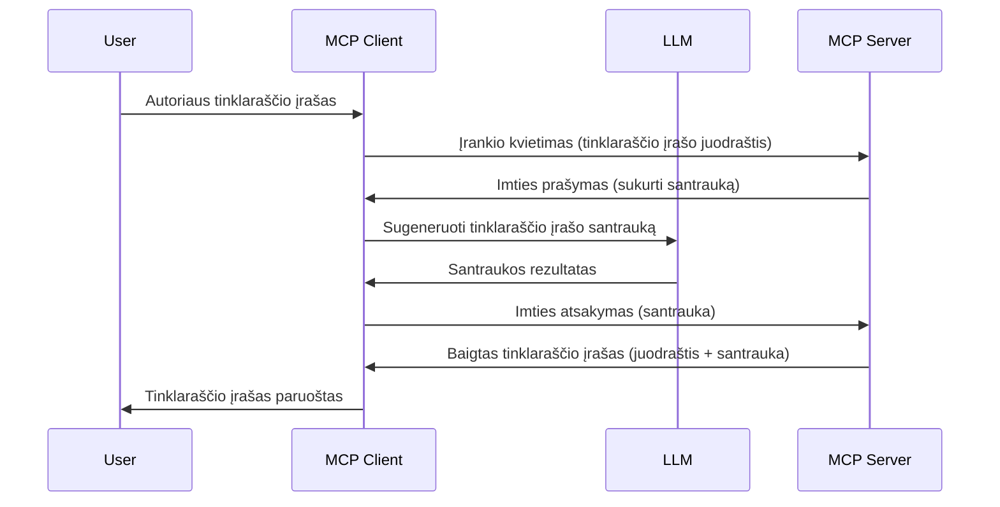

> [ATSISAKYTA: 2026-07-28 IŠLEIDIMO KANDIDATAS](https://blog.modelcontextprotocol.io/posts/2026-07-28-release-candidate/)

# Imties ėmimas - deleguoti funkcijas Klientui

> **Atsisakymo pranešimas:** `2026-07-28` MCP specifikacijos išleidimo kandidatas žymi Imties ėmimą kaip atsisakytiną, rekomenduojant tiesioginę integraciją su LLM tiekėjų API. Imties ėmimas toliau veikia `2025-11-25` verijoje ir bent metus po bet kokio formalio atsisakymo, todėl visa ši pamoka išlieka galiojanti — tačiau nauji serverio dizainai turėtų įvertinti pakeitimo modelį. Žr. [Kas keičiasi MCP: 2026-07-28 Išleidimo kandidatas](../../01-CoreConcepts/mcp-2026-07-28-release-candidate.md).

Kartais reikia, kad MCP Klientas ir MCP Serveris bendradarbiautų, siekdami bendro tikslo. Gali būti situacijų, kai Serveriui reikia LLM pagalbos, esančios kliento pusėje. Tokiu atveju turėtumėte naudoti imties ėmimą (Sampling).

Pažvelkime į keletą naudojimo atvejų ir kaip sukurti sprendimą, kuriame naudojamas imties ėmimas.

## Apžvalga

Šioje pamokoje dėmesys sutelktas į tai, kada ir kur naudoti Imties ėmimą bei kaip jį konfigūruoti.

## Mokymosi tikslai

Šiame skyriuje mes:

- Paaiškinsime, kas yra Imties ėmimas ir kada jį naudoti.
- Parodysime, kaip konfigūruoti Imties ėmimą MCP.
- Pateiksime Imties ėmimo pavyzdžių veikiant.

## Kas yra Imties ėmimas ir kodėl jį naudoti?

Imties ėmimas yra pažangi funkcija, veikiančią šiuo būdu:



### Imties ėmimo užklausa

Gerai, turime platų patikimos situacijos vaizdą, pažiūrėkime, kokia atrodo imties ėmimo užklausa, kurią serveris siunčia klientui. Štai kaip tokia užklausa gali atrodyti JSON-RPC formatu:

```json
{
  "jsonrpc": "2.0",
  "id": 1,
  "method": "sampling/createMessage",
  "params": {
    "messages": [
      {
        "role": "user",
        "content": {
          "type": "text",
          "text": "Create a blog post summary of the following blog post: <BLOG POST>"
        }
      }
    ],
    "modelPreferences": {
      "hints": [
        {
          "name": "claude-3-sonnet"
        }
      ],
      "intelligencePriority": 0.8,
      "speedPriority": 0.5
    },
    "systemPrompt": "You are a helpful assistant.",
    "maxTokens": 100
  }
}
```

Čia verta atkreipti dėmesį į keletą dalykų:

- Prompt, po content -> text, yra mūsų užklausa, t.y. instrukcija LLM suvesti tinklaraščio įrašo turinį.

- **modelPreferences**. Ši dalis yra pageidavimų skyrius, rekomendacija, kokią LLM konfigūraciją naudoti. Vartotojas gali pasirinkti naudoti šias rekomendacijas arba jas keisti. Šiuo atveju yra rekomendacijų dėl modelio, greičio ir intelekto prioriteto.
- **systemPrompt**, tai jūsų įprastinė sistemos užklausa, suteikianti LLM asmenybę ir turinti nurodymus.
- **maxTokens**, tai kita savybė, nurodanti, kiek žetonų rekomenduojama naudoti šiam užduočiai.

### Imties ėmimo atsakymas

Šis atsakymas yra tai, ką MCP Klientas siunčia atgal MCP Serveriui ir kuris yra kliento kvietimo LLM rezultatas, laukiamas atsakymas ir tada sukonstruojamas pranešimas. Štai kaip tai atrodo JSON-RPC formatu:

```json
{
  "jsonrpc": "2.0",
  "id": 1,
  "result": {
    "role": "assistant",
    "content": {
      "type": "text",
      "text": "Here's your abstract <ABSTRACT>"
    },
    "model": "gpt-5",
    "stopReason": "endTurn"
  }
}
```

Atkreipkite dėmesį, kad atsakymas yra tinklaraščio įrašo santrauka, kaip ir prašėme. Taip pat matykite, kad naudotas `model` nėra tas, kurio prašėme, bet "gpt-5" vietoje "claude-3-sonnet". Tai iliustruoja, kad vartotojas gali pasirinkti, ką naudoti, ir jūsų imties užklausa yra rekomendacija.

Gerai, dabar, kai suprantame pagrindinį srautą ir naudingą užduotį „tinklaraščio įrašo kūrimas + santrauka“, pažiūrėkime, ką turime padaryti, kad tai veiktų.

### Žinučių tipai

Imties ėmimo žinutės nėra ribojamos tik tekstu, bet galite siųsti ir paveikslėlius bei garsą. Štai kaip JSON-RPC atrodo kitaip:

**Tekstas**

```json
{
  "type": "text",
  "text": "The message content"
}
```

**Paveikslėlio turinys**

```json
{
  "type": "image",
  "data": "base64-encoded-image-data",
  "mimeType": "image/jpeg"
}
```

**Garso turinys**

```json
{
  "type": "audio",
  "data": "base64-encoded-audio-data",
  "mimeType": "audio/wav"
}
```

> PASTABA: daugiau informacijos apie Imties ėmimą rasite [oficialioje dokumentacijoje](https://modelcontextprotocol.io/specification/2025-11-25/client/sampling)

## Kaip konfigūruoti Imties ėmimą Kliente

> Pastaba: jei kuriate tik serverį, čia daug ko daryti nereikia.

Kliente turite nurodyti šią funkciją taip:

```json
{
  "capabilities": {
    "sampling": {}
  }
}
```

Tai bus priimta, kai jūsų pasirinktas klientas inicijuos ryšį su serveriu.

## Imties ėmimo pavyzdys veikime - sukurti tinklaraščio įrašą

Sukurkime kartu imties serverį, mums reikės padaryti šiuos veiksmus:

1. Sukurti įrankį serveryje.
1. Šis įrankis turėtų sukurti imties užklausą.
1. Įrankis turėtų laukti, kol kliento imties užklausa bus atsakyta.
1. Tada turi būti pagamintas įrankio rezultatas.

Pažiūrėkime kodą žingsnis po žingsnio:

### -1- Sukurkite įrankį

**python**

```python
@mcp.tool()
async def create_blog(title: str, content: str, ctx: Context[ServerSession, None]) -> str:
    """Create a blog post and generate a summary"""

```

### -2- Sukurkite imties užklausą

Išplėskite savo įrankį šiuo kodu:

**python**

```python
post = BlogPost(
        id=len(posts) + 1,
        title=title,
        content=content,
        abstract=""
    )

prompt = f"Create an abstract of the following blog post: title: {title} and draft: {content} "

result = await ctx.session.create_message(
        messages=[
            SamplingMessage(
                role="user",
                content=TextContent(type="text", text=prompt),
            )
        ],
        max_tokens=100,
)

```

### -3- Laukite atsakymo ir grąžinkite atsakymą

**python**

```python
post.abstract = result.content.text

posts.append(post)

# grąžinti galutinį produktą
return json.dumps({
    "id": post.title,
    "abstract": post.abstract
})
```

### -4- Pilnas kodas

**python**

```python
from starlette.applications import Starlette
from starlette.routing import Mount, Host

from mcp.server.fastmcp import Context, FastMCP

from mcp.server.session import ServerSession
from mcp.types import SamplingMessage, TextContent

import json


from uuid import uuid4
from typing import List
from pydantic import BaseModel


mcp = FastMCP("Blog post generator")

# app = FastAPI()

posts = []

class BlogPost(BaseModel):
    id: int
    title: str
    content: str
    abstract: str

posts: List[BlogPost] = []

@mcp.tool()
async def create_blog(title: str, content: str, ctx: Context[ServerSession, None]) -> str:
    """Create a blog post and generate a summary"""

    post = BlogPost(
        id=len(posts) + 1,
        title=title,
        content=content,
        abstract=""
    )

    prompt = f"Create an abstract of the following blog post: title: {title} and draft: {content} "

    result = await ctx.session.create_message(
        messages=[
            SamplingMessage(
                role="user",
                content=TextContent(type="text", text=prompt),
            )
        ],
        max_tokens=100,
    )

    post.abstract = result.content.text

    posts.append(post)

    # grąžinti visą tinklaraščio įrašą
    return json.dumps({
        "id": post.title,
        "abstract": post.abstract
    })

if __name__ == "__main__":
    print("Starting server...")
    # mcp.run()
    mcp.run(transport="streamable-http")

# paleisti programą su: python server.py
```

### -5- Testavimas Visual Studio Code

Norėdami tai patikrinti Visual Studio Code, atlikite šiuos veiksmus:

1. Paleiskite serverį terminale.
1. Įtraukite jį į *mcp.json* (ir įsitikinkite, kad jis veikia), pvz., štai taip:

   ```json
   "servers": {
      "blog-server": {
        "type": "http",
        "url": "http://localhost:8000/mcp"
      }
   }
   ```

1. Įveskite užklausą:

   ```text
   create a blog post named "Where Python comes from", the content is "Python is actually named after Monty Python Flying Circus"
   ```

1. Leiskite vykti imčiai. Pirmą kartą testuodami matysite papildomą dialogo langą, kurį turėsite patvirtinti, tuomet pasirodys įprastas dialogas, prašantis paleisti įrankį.

1. Apžiūrėkite rezultatus. Matysite rezultatus gražiai atvaizduotus GitHub Copilot Chat, taip pat galėsite peržiūrėti žalią JSON atsakymą.

**Papildymas**. Visual Studio Code įrankiai puikiai palaiko imties ėmimą. Galite konfigūruoti Imties prieigą savo įdiegto serveryje, eidami taip:

1. Eikite į plėtinių skyrių.
1. Pasirinkite krumpliaračio piktogramą savo įdiegtam serveriui „MCP SERVERS - INSTALLED“ skiltyje.
1 Pasirinkite „Configure Model Access“, čia galite pasirinkti, kuriuos modelius GitHub Copilot gali naudoti atlikdamas imties ėmimą. Taip pat galite matyti visas nesenas imties užklausas, pasirinkdami „Show Sampling requests“.

## Užduotis

Šioje užduotyje kursite šiek tiek kitokį Imties ėmimą, būtent – imties integraciją, palaikančią produkto aprašymo generavimą. Štai jūsų scenarijus:

**Scenarijus**: E-komercijos biuro darbuotojui reikia pagalbos, nes produkto aprašymų generavimas užtrunka pernelyg ilgai. Todėl turite sukurti sprendimą, kuriame galite iškviesti įrankį „create_product“ su „title“ ir „keywords“ argumentais, o jis turi pagaminti pilną produktą, įskaitant „description“ lauką, kurį užpildo kliento LLM.

PATARIMAS: naudokite anksčiau įgytas žinias, kad sukurtumėte šį serverį ir jo įrankį, naudodami imties užklausą.

## Sprendimas

[Sprendimas](./solution/README.md)

## Pagrindinės išvados

Imties ėmimas yra galinga funkcija, leidžianti serveriui deleguoti užduotis klientui, kai reikia LLM pagalbos.

## Kas toliau

- [4 skyrius - praktinė įgyvendinimas](../../04-PracticalImplementation/README.md)

---

<!-- CO-OP TRANSLATOR DISCLAIMER START -->
**Atsakomybės apribojimas**:
Šis dokumentas buvo išverstas naudojant dirbtinio intelekto vertimo paslaugą [Co-op Translator](https://github.com/Azure/co-op-translator). Nors siekiame tikslumo, prašome atkreipti dėmesį, kad automatiniai vertimai gali turėti klaidų ar netikslumų. Originalus dokumentas jo gimtąja kalba laikomas autoritetingu šaltiniu. Svarbiai informacijai rekomenduojama naudoti profesionalų žmogiškąjį vertimą. Mes neatsakome už jokius nesusipratimus ar neteisingą interpretaciją, kilusią naudojantis šiuo vertimu.
<!-- CO-OP TRANSLATOR DISCLAIMER END -->