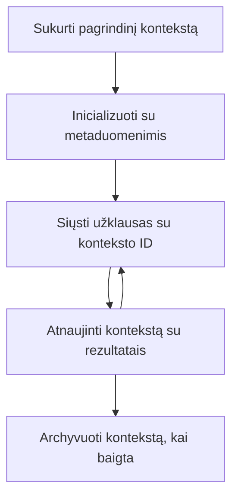

> [NEBENAUDOTINA: 2026-07-28 LEIDIMO KANDIDATAS](https://blog.modelcontextprotocol.io/posts/2026-07-28-release-candidate/#roots-sampling-and-logging-are-deprecated)

# MCP Šaknų kontekstai

> **Neberodomas pranešimas:** `2026-07-28` MCP specifikacijos leidimo kandidatas žymi Šaknis kaip nebereikalingas, jas keičiant įrankių parametrais, išteklių URI arba serverio konfigūracija. Šaknys veikia `2025-11-25` versijoje ir bent metus po bet kokio oficialaus atsisakymo, todėl viskas šioje pamokoje išlieka tinkama – bet nauji serverio dizainai turėtų įvertinti pakeitimo modelį. Žr. [Kas keičiasi MCP: 2026-07-28 leidimo kandidatas](../../01-CoreConcepts/mcp-2026-07-28-release-candidate.md).

Šaknų kontekstai yra pagrindinė Modelio konteksto protokolo sąvoka, užtikrinanti nuolatinį sluoksnį pokalbių istorijos ir bendros būsenos palaikymui per kelis užklausų ir sesijų ciklus.

## Įvadas

Šioje pamokoje išnagrinėsime, kaip kurti, valdyti ir naudoti šaknų kontekstus MCP.

## Mokymosi tikslai

Baigę šią pamoką, galėsite:

- Suprasti šaknų kontekstų paskirtį ir struktūrą
- Kurti ir valdyti šaknų kontekstus naudojant MCP klientų bibliotekas
- Įgyvendinti šaknų kontekstus .NET, Java, JavaScript ir Python programose
- Naudoti šaknų kontekstus daugiajame pokalbyje ir būsenos valdyme
- Įgyvendinti geriausias praktikas šaknų kontekstų valdyme

## Supratimas apie Šaknų kontekstus

Šaknų kontekstai veikia kaip konteineriai, kuriuose saugoma istorija ir būsena serijai susijusių sąveikų. Jie leidžia:

- **Pokalbių nuoseklumas**: Palaikyti sklandžias daugiaetapes diskusijas
- **Atminties valdymas**: Saugojimą ir informacijos gavimą per sąveikas
- **Būsenos valdymas**: Sekti pažangą sudėtinguose darbo procesuose
- **Konteksto dalijimasis**: Leisti keliems klientams pasiekti tą pačią pokalbio būseną

MCP, šaknų kontekstai turi šias pagrindines savybes:

- Kiekvienas šaknų kontekstas turi unikalų identifikatorių.
- Jie gali talpinti pokalbių istoriją, vartotojo nuostatas ir kitą metaduomenų informaciją.
- Jie gali būti kuriami, pasiekiami ir archyvuojami pagal poreikį.
- Jie palaiko smulkų prieigos kontrolę ir leidimus.

## Šaknų konteksto gyvavimo ciklas



## Darbas su Šaknų Kontekstais

Štai pavyzdys, kaip kurti ir valdyti šaknų kontekstus.

### C# įgyvendinimas

```csharp
// .NET Example: Root Context Management
using Microsoft.Mcp.Client;
using System;
using System.Threading.Tasks;
using System.Collections.Generic;

public class RootContextExample
{
    private readonly IMcpClient _client;
    private readonly IRootContextManager _contextManager;
    
    public RootContextExample(IMcpClient client, IRootContextManager contextManager)
    {
        _client = client;
        _contextManager = contextManager;
    }
    
    public async Task DemonstrateRootContextAsync()
    {
        // 1. Create a new root context
        var contextResult = await _contextManager.CreateRootContextAsync(new RootContextCreateOptions
        {
            Name = "Customer Support Session",
            Metadata = new Dictionary<string, string>
            {
                ["CustomerName"] = "Acme Corporation",
                ["PriorityLevel"] = "High",
                ["Domain"] = "Cloud Services"
            }
        });
        
        string contextId = contextResult.ContextId;
        Console.WriteLine($"Created root context with ID: {contextId}");
        
        // 2. First interaction using the context
        var response1 = await _client.SendPromptAsync(
            "I'm having issues scaling my web service deployment in the cloud.", 
            new SendPromptOptions { RootContextId = contextId }
        );
        
        Console.WriteLine($"First response: {response1.GeneratedText}");
        
        // Second interaction - the model will have access to the previous conversation
        var response2 = await _client.SendPromptAsync(
            "Yes, we're using containerized deployments with Kubernetes.", 
            new SendPromptOptions { RootContextId = contextId }
        );
        
        Console.WriteLine($"Second response: {response2.GeneratedText}");
        
        // 3. Add metadata to the context based on conversation
        await _contextManager.UpdateContextMetadataAsync(contextId, new Dictionary<string, string>
        {
            ["TechnicalEnvironment"] = "Kubernetes",
            ["IssueType"] = "Scaling"
        });
        
        // 4. Get context information
        var contextInfo = await _contextManager.GetRootContextInfoAsync(contextId);
        
        Console.WriteLine("Context Information:");
        Console.WriteLine($"- Name: {contextInfo.Name}");
        Console.WriteLine($"- Created: {contextInfo.CreatedAt}");
        Console.WriteLine($"- Messages: {contextInfo.MessageCount}");
        
        // 5. When the conversation is complete, archive the context
        await _contextManager.ArchiveRootContextAsync(contextId);
        Console.WriteLine($"Archived context {contextId}");
    }
}
```

Ankstesniame kode mes:

1. Sukūrėme šaknų kontekstą klientų palaikymo sesijai.
1. Išsiuntėme kelis pranešimus viduje to konteksto, leidžiant modeliui palaikyti būseną.
1. Atnaujinome kontekstą aktualiais metaduomenimis, remiantis pokalbiu.
1. Gautą konteksto informaciją, siekiant suprasti pokalbio istoriją.
1. Archyvavome kontekstą, kai pokalbis buvo baigtas.

## Pavyzdys: Šaknų konteksto įgyvendinimas finansų analizei

Šiame pavyzdyje kursime šaknų kontekstą finansų analizės sesijai, demonstruodami, kaip palaikyti būseną per kelias sąveikas.

### Java įgyvendinimas

```java
// Java pavyzdys: Šakninis konteksto įgyvendinimas
package com.example.mcp.contexts;

import com.mcp.client.McpClient;
import com.mcp.client.ContextManager;
import com.mcp.models.RootContext;
import com.mcp.models.McpResponse;

import java.util.HashMap;
import java.util.Map;
import java.util.UUID;

public class RootContextsDemo {
    private final McpClient client;
    private final ContextManager contextManager;
    
    public RootContextsDemo(String serverUrl) {
        this.client = new McpClient.Builder()
            .setServerUrl(serverUrl)
            .build();
            
        this.contextManager = new ContextManager(client);
    }
    
    public void demonstrateRootContext() throws Exception {
        // Sukurti konteksto metaduomenis
        Map<String, String> metadata = new HashMap<>();
        metadata.put("projectName", "Financial Analysis");
        metadata.put("userRole", "Financial Analyst");
        metadata.put("dataSource", "Q1 2025 Financial Reports");
        
        // 1. Sukurkite naują šakninį kontekstą
        RootContext context = contextManager.createRootContext("Financial Analysis Session", metadata);
        String contextId = context.getId();
        
        System.out.println("Created context: " + contextId);
        
        // 2. Pirmas sąveika
        McpResponse response1 = client.sendPrompt(
            "Analyze the trends in Q1 financial data for our technology division",
            contextId
        );
        
        System.out.println("First response: " + response1.getGeneratedText());
        
        // 3. Atnaujinkite kontekstą svarbia informacija, gauta iš atsakymo
        contextManager.addContextMetadata(contextId, 
            Map.of("identifiedTrend", "Increasing cloud infrastructure costs"));
        
        // Antras sąveika - naudojant tą patį kontekstą
        McpResponse response2 = client.sendPrompt(
            "What's driving the increase in cloud infrastructure costs?",
            contextId
        );
        
        System.out.println("Second response: " + response2.getGeneratedText());
        
        // 4. Sugeneruokite analizės sesijos santrauką
        McpResponse summaryResponse = client.sendPrompt(
            "Summarize our analysis of the technology division financials in 3-5 key points",
            contextId
        );
        
        // Išsaugokite santrauką konteksto metaduomenyse
        contextManager.addContextMetadata(contextId, 
            Map.of("analysisSummary", summaryResponse.getGeneratedText()));
            
        // Gaukite atnaujintą konteksto informaciją
        RootContext updatedContext = contextManager.getRootContext(contextId);
        
        System.out.println("Context Information:");
        System.out.println("- Created: " + updatedContext.getCreatedAt());
        System.out.println("- Last Updated: " + updatedContext.getLastUpdatedAt());
        System.out.println("- Analysis Summary: " + 
            updatedContext.getMetadata().get("analysisSummary"));
            
        // 5. Archivizuokite kontekstą pasibaigus darbui
        contextManager.archiveContext(contextId);
        System.out.println("Context archived");
    }
}
```

Ankstesniame kode mes:

1. Sukūrėme šaknų kontekstą finansų analizės sesijai.
2. Išsiuntėme kelis pranešimus viduje to konteksto, leidžiant modeliui palaikyti būseną.
3. Atnaujinome kontekstą aktualiais metaduomenimis, remiantis pokalbiu.
4. Sugeneravome analizės sesijos santrauką ir įrašėme ją į konteksto metaduomenis.
5. Archyvavome kontekstą, kai pokalbis buvo užbaigtas.

## Pavyzdys: Šaknų kontekstų valdymas

Efektyvus šaknų kontekstų valdymas yra esminis siekiant palaikyti pokalbių istoriją ir būseną. Žemiau pateiktas pavyzdys, kaip įgyvendinti šaknų kontekstų valdymą.

### JavaScript įgyvendinimas

```javascript
// JavaScript pavyzdys: MCP Root kontekstų valdymas
const { McpClient, RootContextManager } = require('@mcp/client');

class ContextSession {
  constructor(serverUrl, apiKey = null) {
    // Inicializuoti MCP klientą
    this.client = new McpClient({
      serverUrl,
      apiKey
    });
    
    // Inicializuoti kontekstų valdytoją
    this.contextManager = new RootContextManager(this.client);
  }
  
  /**
   * Create a new conversation context
   * @param {string} sessionName - Name of the conversation session
   * @param {Object} metadata - Additional metadata for the context
   * @returns {Promise<string>} - Context ID
   */
  async createConversationContext(sessionName, metadata = {}) {
    try {
      const contextResult = await this.contextManager.createRootContext({
        name: sessionName,
        metadata: {
          ...metadata,
          createdAt: new Date().toISOString(),
          status: 'active'
        }
      });
      
      console.log(`Created root context '${sessionName}' with ID: ${contextResult.id}`);
      return contextResult.id;
    } catch (error) {
      console.error('Error creating root context:', error);
      throw error;
    }
  }
  
  /**
   * Send a message in an existing context
   * @param {string} contextId - The root context ID
   * @param {string} message - The user's message
   * @param {Object} options - Additional options
   * @returns {Promise<Object>} - Response data
   */
  async sendMessage(contextId, message, options = {}) {
    try {
      // Išsiųsti žinutę naudojant nurodytą kontekstą
      const response = await this.client.sendPrompt(message, {
        rootContextId: contextId,
        temperature: options.temperature || 0.7,
        allowedTools: options.allowedTools || []
      });
      
      // Pasirinktinai saugoti svarbias pokalbio įžvalgas
      if (options.storeInsights) {
        await this.storeConversationInsights(contextId, message, response.generatedText);
      }
      
      return {
        message: response.generatedText,
        toolCalls: response.toolCalls || [],
        contextId
      };
    } catch (error) {
      console.error(`Error sending message in context ${contextId}:`, error);
      throw error;
    }
  }
  
  /**
   * Store important insights from a conversation
   * @param {string} contextId - The root context ID
   * @param {string} userMessage - User's message
   * @param {string} aiResponse - AI's response
   */
  async storeConversationInsights(contextId, userMessage, aiResponse) {
    try {
      // Išgauti galimas įžvalgas (realiame pritaikyme tai būtų sudėtingiau)
      const combinedText = userMessage + "\n" + aiResponse;
      
      // Paprasta heuristika galimų įžvalgų identifikavimui
      const insightWords = ["important", "key point", "remember", "significant", "crucial"];
      
      const potentialInsights = combinedText
        .split(".")
        .filter(sentence => 
          insightWords.some(word => sentence.toLowerCase().includes(word))
        )
        .map(sentence => sentence.trim())
        .filter(sentence => sentence.length > 10);
      
      // Saugo įžvalgas konteksto metaduomenyse
      if (potentialInsights.length > 0) {
        const insights = {};
        potentialInsights.forEach((insight, index) => {
          insights[`insight_${Date.now()}_${index}`] = insight;
        });
        
        await this.contextManager.updateContextMetadata(contextId, insights);
        console.log(`Stored ${potentialInsights.length} insights in context ${contextId}`);
      }
    } catch (error) {
      console.warn('Error storing conversation insights:', error);
      // Nesvarbi klaida, todėl tiesiog užfiksuoti įspėjimą
    }
  }
  
  /**
   * Get summary information about a context
   * @param {string} contextId - The root context ID
   * @returns {Promise<Object>} - Context information
   */
  async getContextInfo(contextId) {
    try {
      const contextInfo = await this.contextManager.getContextInfo(contextId);
      
      return {
        id: contextInfo.id,
        name: contextInfo.name,
        created: new Date(contextInfo.createdAt).toLocaleString(),
        lastUpdated: new Date(contextInfo.lastUpdatedAt).toLocaleString(),
        messageCount: contextInfo.messageCount,
        metadata: contextInfo.metadata,
        status: contextInfo.status
      };
    } catch (error) {
      console.error(`Error getting context info for ${contextId}:`, error);
      throw error;
    }
  }
  
  /**
   * Generate a summary of the conversation in a context
   * @param {string} contextId - The root context ID
   * @returns {Promise<string>} - Generated summary
   */
  async generateContextSummary(contextId) {
    try {
      // Paprašyti modelio sukurti iki šiol vykusio pokalbio santrauką
      const response = await this.client.sendPrompt(
        "Please summarize our conversation so far in 3-4 sentences, highlighting the main points discussed.",
        { rootContextId: contextId, temperature: 0.3 }
      );
      
      // Saugo santrauką konteksto metaduomenyse
      await this.contextManager.updateContextMetadata(contextId, {
        conversationSummary: response.generatedText,
        summarizedAt: new Date().toISOString()
      });
      
      return response.generatedText;
    } catch (error) {
      console.error(`Error generating context summary for ${contextId}:`, error);
      throw error;
    }
  }
  
  /**
   * Archive a context when it's no longer needed
   * @param {string} contextId - The root context ID
   * @returns {Promise<Object>} - Result of the archive operation
   */
  async archiveContext(contextId) {
    try {
      // Sukurti galutinę santrauką prieš archyvavimą
      const summary = await this.generateContextSummary(contextId);
      
      // Archyvuoti kontekstą
      await this.contextManager.archiveContext(contextId);
      
      return {
        status: "archived",
        contextId,
        summary
      };
    } catch (error) {
      console.error(`Error archiving context ${contextId}:`, error);
      throw error;
    }
  }
}

// Pavyzdinis naudojimas
async function demonstrateContextSession() {
  const session = new ContextSession('https://mcp-server-example.com');
  
  try {
    // 1. Sukurti naują kontekstą produkto palaikymo pokalbiui
    const contextId = await session.createConversationContext(
      'Product Support - Database Performance',
      {
        customer: 'Globex Corporation',
        product: 'Enterprise Database',
        severity: 'Medium',
        supportAgent: 'AI Assistant'
      }
    );
    
    // 2. Pirmoji pokalbio žinutė
    const response1 = await session.sendMessage(
      contextId,
      "I'm experiencing slow query performance on our database cluster after the latest update.",
      { storeInsights: true }
    );
    console.log('Response 1:', response1.message);
    
    // Tolimesnė žinutė tame pačiame kontekste
    const response2 = await session.sendMessage(
      contextId,
      "Yes, we've already checked the indexes and they seem to be properly configured.",
      { storeInsights: true }
    );
    console.log('Response 2:', response2.message);
    
    // 3. Gauti informaciją apie kontekstą
    const contextInfo = await session.getContextInfo(contextId);
    console.log('Context Information:', contextInfo);
    
    // 4. Generuoti ir parodyti pokalbio santrauką
    const summary = await session.generateContextSummary(contextId);
    console.log('Conversation Summary:', summary);
    
    // 5. Baigus archyvuoti kontekstą
    const archiveResult = await session.archiveContext(contextId);
    console.log('Archive Result:', archiveResult);
    
    // 6. Tvarkingai tvarkyti bet kokias klaidas
  } catch (error) {
    console.error('Error in context session demonstration:', error);
  }
}

demonstrateContextSession();
```

Ankstesniame kode mes:

1. Sukūrėme šaknų kontekstą produkto palaikymo pokalbiui su funkcija `createConversationContext`. Šiuo atveju kontekstas yra apie duomenų bazės našumo problemas.

1. Išsiuntėme kelis pranešimus tame kontekste, leidžiant modeliui palaikyti būseną su funkcija `sendMessage`. Siunčiami pranešimai apie lėtą užklausų vykdymą ir indeksų konfigūraciją.

1. Atnaujinome kontekstą aktualiais metaduomenimis, remiantis pokalbiu.

1. Sugeneravome pokalbio santrauką ir įrašėme ją į konteksto metaduomenis su funkcija `generateContextSummary`.

1. Archyvavome kontekstą, kai pokalbis buvo baigtas, naudojant funkciją `archiveContext`.

1. Klaidų tvarkymas buvo atliktas sklandžiai siekiant užtikrinti patikimumą.

## Šaknų kontekstas daugiaetapėms pagalbos sesijoms

Šiame pavyzdyje kursime šaknų kontekstą daugiaetapei pagalbos sesijai, demonstruodami, kaip palaikyti būseną per kelias sąveikas.

### Python įgyvendinimas

```python
# Python pavyzdys: šakninis kontekstas daugkartiniam pagalbos sukeitimui
import asyncio
from datetime import datetime
from mcp_client import McpClient, RootContextManager

class AssistantSession:
    def __init__(self, server_url, api_key=None):
        self.client = McpClient(server_url=server_url, api_key=api_key)
        self.context_manager = RootContextManager(self.client)
    
    async def create_session(self, name, user_info=None):
        """Create a new root context for an assistant session"""
        metadata = {
            "session_type": "assistant",
            "created_at": datetime.now().isoformat(),
        }
        
        # Pridėti vartotojo informaciją, jei pateikta
        if user_info:
            metadata.update({f"user_{k}": v for k, v in user_info.items()})
            
        # Sukurkite šakninį kontekstą
        context = await self.context_manager.create_root_context(name, metadata)
        return context.id
    
    async def send_message(self, context_id, message, tools=None):
        """Send a message within a root context"""
        # Sukurkite pasirinkimus su konteksto ID
        options = {
            "root_context_id": context_id
        }
        
        # Pridėti įrankius, jei nurodyta
        if tools:
            options["allowed_tools"] = tools
        
        # Siųsti raginimą kontekste
        response = await self.client.send_prompt(message, options)
        
        # Atnaujinti konteksto metaduomenis su pokalbio eiga
        await self.context_manager.update_context_metadata(
            context_id,
            {
                f"message_{datetime.now().timestamp()}": message[:50] + "...",
                "last_interaction": datetime.now().isoformat()
            }
        )
        
        return response
    
    async def get_conversation_history(self, context_id):
        """Retrieve conversation history from a context"""
        context_info = await self.context_manager.get_context_info(context_id)
        messages = await self.client.get_context_messages(context_id)
        
        return {
            "context_info": context_info,
            "messages": messages
        }
    
    async def end_session(self, context_id):
        """End an assistant session by archiving the context"""
        # Pirmiausia generuoti santraukos raginimą
        summary_response = await self.client.send_prompt(
            "Please summarize our conversation and any key points or decisions made.",
            {"root_context_id": context_id}
        )
        
        # Saugyti santrauką metaduomenyse
        await self.context_manager.update_context_metadata(
            context_id,
            {
                "summary": summary_response.generated_text,
                "ended_at": datetime.now().isoformat(),
                "status": "completed"
            }
        )
        
        # Archyvuoti kontekstą
        await self.context_manager.archive_context(context_id)
        
        return {
            "status": "completed",
            "summary": summary_response.generated_text
        }

# Naudojimo pavyzdys
async def demo_assistant_session():
    assistant = AssistantSession("https://mcp-server-example.com")
    
    # 1. Sukurti sesiją
    context_id = await assistant.create_session(
        "Technical Support Session",
        {"name": "Alex", "technical_level": "advanced", "product": "Cloud Services"}
    )
    print(f"Created session with context ID: {context_id}")
    
    # 2. Pirmas sąveikos etapas
    response1 = await assistant.send_message(
        context_id, 
        "I'm having trouble with the auto-scaling feature in your cloud platform.",
        ["documentation_search", "diagnostic_tool"]
    )
    print(f"Response 1: {response1.generated_text}")
    
    # Antras sąveikos etapas tame pačiame kontekste
    response2 = await assistant.send_message(
        context_id,
        "Yes, I've already checked the configuration settings you mentioned, but it's still not working."
    )
    print(f"Response 2: {response2.generated_text}")
    
    # 3. Gauti istoriją
    history = await assistant.get_conversation_history(context_id)
    print(f"Session has {len(history['messages'])} messages")
    
    # 4. Baigti sesiją
    end_result = await assistant.end_session(context_id)
    print(f"Session ended with summary: {end_result['summary']}")

if __name__ == "__main__":
    asyncio.run(demo_assistant_session())
```

Ankstesniame kode mes:

1. Sukūrėme šaknų kontekstą techninės pagalbos sesijai su funkcija `create_session`. Kontekste yra vartotojo informacija, tokia kaip vardas ir techninis lygis.

1. Išsiuntėme kelis pranešimus tame kontekste, leidžiant modeliui palaikyti būseną su funkcija `send_message`. Pranešimai yra apie problemas su automatinio mastelio keitimo funkcija.

1. Gavome pokalbių istoriją naudodami funkciją `get_conversation_history`, kuri teikia konteksto informaciją ir pranešimus.

1. Baigėme sesiją archyvuodami kontekstą ir sugeneruodami santrauką su funkcija `end_session`. Santrauka apima svarbius pokalbio punktus.

## Šaknų kontekstų geriausios praktikos

Štai keletas geriausių praktikų efektyviam šaknų kontekstų valdymui:

- **Kurti susitelkusius kontekstus**: Kurkite atskirus šaknų kontekstus skirtingoms pokalbių paskirtims ar sritims, kad būtų išlaikytas aiškumas.

- **Nustatyti galiojimo politiką**: Įgyvendinkite politiką senų kontekstų archyvavimui ar ištrynimui, kad valdytumėte saugojimą ir atitiktumėte duomenų saugojimo taisykles.

- **Saugojimo aktualūs metaduomenys**: Naudokite konteksto metaduomenis, kad saugotumėte svarbią informaciją apie pokalbį, kuri gali praversti vėliau.

- **Naudokite konteksto ID nuosekliai**: Sukūrus kontekstą, naudokite jo ID nuosekliai visoms susijusioms užklausoms, kad būtų palaikomas tęstinumas.

- **Generuoti santraukas**: Kai kontekstas tampa didelis, apsvarstykite galimybę kurti santraukas, kurios sugrupuotų svarbiausią informaciją valdant konteksto dydį.

- **Įgyvendinti prieigos kontrolę**: Daugiauserių sistemų atveju užtikrinkite tinkamą prieigos kontrolę, kad būtų saugomas pokalbių kontekstų privatumą ir saugumas.

- **Tvarkyti konteksto apribojimus**: Žinokite apie konteksto dydžio ribas ir įgyvendinkite strategijas ilgų pokalbių tvarkymui.

- **Archyvuoti pabaigus**: Archyvuokite kontekstus, kai pokalbiai baigti, kad atlaisvintumėte išteklius ir išsaugotumėte pokalbių istoriją.

## Kas toliau

- [5.5 Maršrutizavimas](../mcp-routing/README.md)

---

<!-- CO-OP TRANSLATOR DISCLAIMER START -->
**Atsakomybės apribojimas**:
Šis dokumentas buvo išverstas naudojant dirbtinio intelekto vertimo paslaugą [Co-op Translator](https://github.com/Azure/co-op-translator). Nors siekiame tikslumo, prašome atkreipti dėmesį, kad automatiniai vertimai gali turėti klaidų ar netikslumų. Originalus dokumentas jo gimtąja kalba laikomas autoritetingu šaltiniu. Svarbiai informacijai rekomenduojama naudoti profesionalų žmogiškąjį vertimą. Mes neatsakome už jokius nesusipratimus ar neteisingą interpretaciją, kilusią naudojantis šiuo vertimu.
<!-- CO-OP TRANSLATOR DISCLAIMER END -->