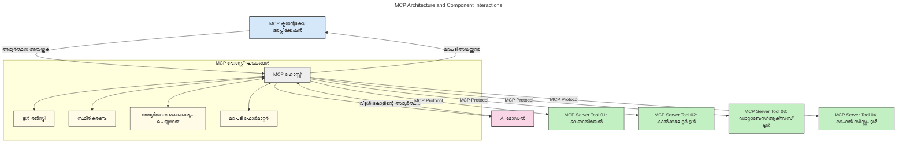
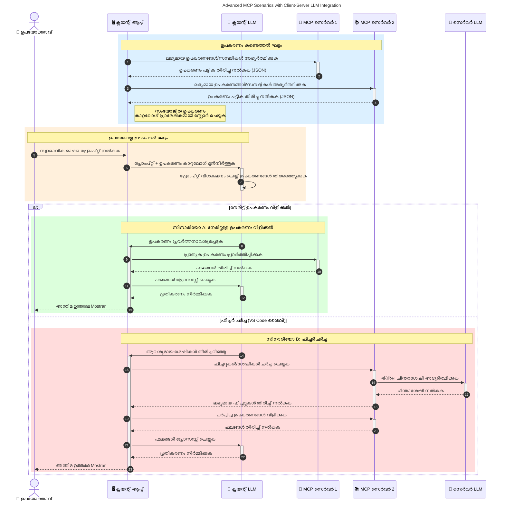

# മോഡൽ കോൺടെക്സ്റ്റ് പ്രോട്ടോക്കോൾ (MCP) പരിചയം: സ്‌ക്കെയിലബിൾ AI അപ്ലിക്കേഷനുകൾക്ക് ഇത് എന്ത് കൊണ്ടാണ് പ്രധാനപ്പെട്ടത്

[](https://youtu.be/agBbdiOPLQA)

_(ഈ പാഠത്തിന്റെ വീഡിയോ കാണാൻ മുകളിൽ ചിത്രത്തിൽ ക്ലിക്ക് ചെയ്യുക)_

ജനറേറ്റീവ് AI അപ്ലിക്കേഷനുകൾ വലിയ പുരോഗതിയാണ്, കാരണം അവർ സാധാരണ ഭാഷ പ്രൊംപ്റ്റുകൾ ഉപയോഗിച്ച് ഉപയോക്താവിനോട് ഇന്ററാക്റ്റ് ചെയ്യാൻ അനുവദിക്കുന്നു. എങ്കിലും, ഇത്തരം അപ്ലിക്കേഷനുകളിൽ കൂടുതൽ സമയം, സ്രോതസ്സുകൾ നിക്ഷേപിക്കുമ്പോൾ, ഫംഗ്ഷണാലിറ്റികളെയും സ്രോതസ്സുകളെയും എളുപ്പത്തിൽ ഇന്റഗ്രേറ്റ് ചെയ്യാൻ കഴിയേണ്ടതുണ്ട്, നിങ്ങളുടെ അപ്ലിക്കേഷൻ പല മോഡലുകളും ഉപയോഗിക്കുന്നതിനെ പിന്തുണയ്ക്കുകയും വിവിധ മോഡൽ സങ്കീർണ്ണതകൾ കൈകാര്യം ചെയ്യുകയും ചെയ്യണം. ലഘുവായി പറഞ്ഞാൽ, ജനറേറ്റീവ് AI അപ്ലിക്കേഷനുകൾ ആരംഭിക്കാൻ എളുപ്പമാണ്, പക്ഷേ അവ വളരുക, കൂടുതൽ സങ്കീർണ്ണമാകുക, ആർക്കിടെക്ചർ നിർവചിക്കേണ്ടതും, സാന്ദർഭികമായി സ്റ്റാൻഡേർഡ് ആശ്രയിക്കേണ്ടതും ആവശ്യമുണ്ട്. ഇതുകൊണ്ടുതന്നെ MCP ഈ ജോലികൾ ക്രമീകരിക്കുകയും ഒരു സ്റ്റാൻഡേർഡ് നൽകുകയും ചെയ്യുന്നു.

---

## **🔍 മോഡൽ കോൺടെക്സ്റ്റ് പ്രോട്ടോക്കോൾ (MCP) എന്നത് എന്താണ്?**

**മോഡൽ കോൺടെക്സ്റ്റ് പ്രോട്ടോക്കോൾ (MCP)** ഒരു **ഒരു തുറന്ന, സ്റ്റാൻഡേർഡൈസ്ഡ് ഇന്റർഫെയ്സ്** ആണ്, ഇത് ലാർജ് ലാംഗ്വേജ് മോഡലുകൾ (LLMs) ബാഹ്യ ടൂൾസ്, APIകൾ, ഡാറ്റ സ്രോതസുകളുമായി എളുപ്പത്തിൽ സംവദിക്കാൻ സാധിക്കും. ഇത് AI മോഡലുകളുടെ പ്രവർത്തനക്ഷമതയിൽ അവരുടെ ട്രെയിനിംഗ് ഡാറ്റയ്ക്ക് പുറമെ മെച്ചപ്പെടുത്താൻ സ്ഥിരമായ ആർക്കിടെക്ചർ നൽകുന്നു, സ്മാർട്ടും സ്കെയിലബിളും മറുപടി നല്‍കുന്ന AI സിസ്റ്റങ്ങൾ സൃഷ്ടിക്കാൻ സഹായിക്കുന്നു.

---

## **🎯 AI-യിൽ സ്റ്റാൻഡേർഡൈസേഷൻ എന്തുകൊണ്ട് പ്രധാനമാണ്**

ജനറേറ്റീവ് AI അപ്ലിക്കേഷനുകൾ കൂടുതൽ സങ്കീർണ്ണമായിരിക്കുമ്പോൾ, **സ്കെയിലബിലിറ്റി, വിപുലീകരണക്ഷമത, നിലനിർത്തലും,** **വെൻഡർ ലോക്കിന്റെ ഒഴിവാക്കലും** ഉറപ്പാക്കുന്ന സ്റ്റാൻഡേർഡുകൾ സ്വീകരിക്കുന്നത് അനിവാര്യമാണ്. MCP ഈ ആവശ്യങ്ങൾ ഈ രീതിയിൽ മറുപടി നൽകുന്നു:

- മോഡൽ-ടൂൾ സംയോജനങ്ങൾ ഏകോപിപ്പിക്കുന്നു
- ഭേദഗതി കീഴിലെ ഒറ്റപ്പെട്ട ഇലവേറ്റഡ് കസ്റ്റം സൊല്യൂഷനുകൾ കുറക്കുന്നു
- വ്യത്യസ്ത ആനുകൂല്യദായകരിൽ നിന്നുള്ള പല മോഡലുകളും ഒരേ ഇക്കോസിസ്റ്റത്തിൽ പ്രവർത്തിക്കാനിടയാക്കുന്നു

**കുറിപ്പ്:** MCP ഒരു തുറന്ന സ്റ്റാൻഡേർഡായി സ്വയം വിചാരിച്ചേക്കാം, എന്നാൽ MCP നിലവിലുള്ള സ്റ്റാൻഡേർഡുകൾ (IEEE, IETF, W3C, ISO എന്നിവ) മുഖേന സ്റ്റാൻഡേർഡാക്കാനുള്ള പദ്ധതികൾ ഇല്ല.

---

## **📚 പഠന ലക്ഷ്യങ്ങൾ**

ഈ ലേഖനം അവസാനിപ്പിക്കുന്നപ്പോൾ, ന siz് മറ്റൊരു ശ്രമം എന്തെന്നാൽ:

- **മോഡൽ കോൺടെക്സ്റ്റ് പ്രോട്ടോക്കോൾ (MCP)** സൂക്ഷ്മമായി നിർവ്വചിക്കുക, അതിന്റെ ഉപയോഗ സംഭവങ്ങൾ മനസിലാക്കുക
- MCP മോഡൽ-ടൂൾ കമ്മ്യൂണിക്കേഷൻ സ്റ്റാൻഡേർഡായി എങ്ങനെ പ്രവർത്തിക്കുന്നുവെന്ന് മനസിലാക്കുക
- MCP ആർക്കിടെക്ചർ കോർ ഘടകങ്ങൾ തിരിച്ചറിയുക
- MCP വിനിയോഗത്തിന്റെ വ്യവസായവും വികസന പരിസരവും പരിഗണിക്കുക

---

## **💡 മോഡൽ കോൺടെക്സ്റ്റ് പ്രോട്ടോക്കോൾ (MCP) എന്തുകൊണ്ട് ഗെയിം-ചെയഞ്ചറാണ്**

### **🔗 MCP AI ഇടപെടലുകളിലെ വിഭജനത്തെ പരിഹരിക്കുന്നു**

MCP എത്തിയതിന് മുമ്പ്, മോഡലുകളും ടൂളുകളും ചേർക്കുന്നതിന്:

- ടൂൾ-മോഡൽ ജോഡിക്ക് പ്രത്യേക കസ്റ്റം കോഡ് ആവശ്യമായിരുന്നു
- ഓരോ വെണ്ടറിനും വ്യത്യസ്ത സ്റ്റാൻഡേർഡ് അല്ലാത്ത APIകൾ
- അപ്ഡേറ്റ് മൂലം കേടുപാടുകൾ സംഭവിച്ചിരുന്നത് സാധാരണമായിരുന്നു
- കൂടുതൽ ടൂൾസുമായി സ്കെയിലിംഗിൽ പ്രശ്നങ്ങൾ

### **✅ MCP സ്റ്റാൻഡേർഡൈസേഷന്റെ ലാഭങ്ങൾ**

| **ലാഭം**              | **വിവരണം**                                                                |
|--------------------------|--------------------------------------------------------------------------------|
| ഇന്ററോപ്പറബിലിറ്റി         | LLMs വിവിധ വെൻഡറുകളുടെ ടൂളുകളുമായി എളുപ്പത്തിൽ പ്രവർത്തിക്കുന്നു                       |
| സ്ഥിരത                   | പ്ലാറ്റ്ഫോമുകൾക്കും ടൂളുകൾക്കും ഏകസന്ധമായ പെരുമാറ്റം                                    |
| പുനരുപയോഗം                | ഒരിക്കൽ നിർമ്മിച്ച ടൂളുകൾ വിവിധ പ്രോജക്റ്റുകളിലും സംവിധാനങ്ങളിലും ഉപയോഗിക്കാം                       |
| വികസനം വേഗത           | സ്റ്റാൻഡേർഡൈസ്ഡ്, പ്ലഗ്-ആൻഡ്-പ്ലേ ഇന്റർഫേസുകൾ ഉപയോഗിച്ച് ഡെവലപ്പ്മെന്റ് സമയം കുറയ്ക്കുക                |

---

## **🧱 MCP ആർക്കിടെക്ചർ പരിചയം**

MCP ഒരു **ക്ലയന്റ്-സർവർ മോഡൽ** പിന്തുടരുന്നു, അതിൽ:

- **MCP ഹോസ്റ്റുകൾ** AI മോഡലുകൾ പ്രവർത്തിപ്പിക്കുന്നു
- **MCP ക്ലയന്റുകൾ** അഭ്യർത്ഥനകൾ ആരംഭിക്കുന്നു
- **MCP സർവർകൾ** കോൺടെക്സ്റ്റ്, ടൂളുകൾ, ശേഷികൾ നൽകുന്നു

### **പ്രധാന ഘടകങ്ങൾ:**

- **റിസോഴ്സ്** – മോഡലുകളിൽ വേണ്ടി സ്റ്റാറ്റിക് അല്ലെങ്കിൽ ഡൈനാമിക് ഡാറ്റ  
- **പ്രൊംപ്റ്റുകൾ** – നിർവ്വചിച്ച പ്രവൃത്തിവഴികൾ വഴി ഗൈഡഡ് ജനറേഷൻ  
- **ടൂളുകൾ** – സ്റ്റേഷനുകളായുള്ള പ്രവർത്തനങ്ങൾ, ഉദാ: സേർച്ചും കാൽക്കുലേഷനും  
- **സാമ്പ്ലിംഗ്** – ആജന്റിക് ബിഹേവിയർ റികഴ്‌സീവ് ഇടപെടലിലൂടെ (2026-07-28 റിലീസ് കാൻഡിഡറ്റിൽ പരിഷ്കരിക്കപ്പെട്ടത്)
- **ഇലിസിറ്റേഷൻ** – സർവറിന്റെ ഭാഗത്ത് നിന്നുള്ള ഉപയോക്തൃ വിവരം അഭ്യർത്ഥന
- **റൂട്ട്സ്** – സർവർ ആക്‌സസ് നിയന്ത്രണത്തിനുള്ള ഫയൽസിസ്റ്റം പരിധികൾ (2026-07-28 റിലീസ് കാൻഡിഡറ്റിൽ പരിഷ്കരിക്കപ്പെട്ടത്)

### **പ്രോട്ടോക്കോൾ ആർക്കിടെക്ചർ:**

MCP രണ്ട്-ലെയർ ആർക്കിടെക്ചർ ഉപയോഗിക്കുന്നു:
- **ഡാറ്റ ലെയർ**: JSON-RPC 2.0 അടിസ്ഥാനപരമായ സംവാദം, ലൈഫ് സൈക്കിൾ മാനേജ്മെന്റ്, പ്രീമിറ്റീവുകൾ
- **ട്രാൻസ്പോർട്ട് ലെയർ**: STDIO (ലോകൽ), Streamable HTTP SSE (റിമോട്ട്) സംവാദ ചാനലുകൾ

---

## MCP സർവർകൾ എങ്ങനെ പ്രവർത്തിക്കുന്നു

MCP സർവർകൾ താഴെപ്പറയുന്നപോലെ പ്രവർത്തിക്കുന്നു:

- **അഭ്യർത്ഥന പ്രവാഹം**:
    1. ഒരു അവസാനം ഉപയോക്താവോ, അവരെയും പ്രതിനിധാനം ചെയ്യുന്ന സോഫ്ട്വെയറോ അഭ്യർത്ഥന ആരംഭിക്കുന്നു.
    2. **MCP ക്ലയന്റ്** അഭ്യർത്ഥന **MCP ഹോസ്റ്റിന്** അയയ്ക്കുന്നു, അവ AI മോഡൽ റൺടൈം കൈകാര്യം ചെയ്യുന്നു.
    3. **AI മോഡൽ** ഉപയോക്തൃ പ്രൊംപ്റ്റ് സ്വീകരിച്ച്, ബാഹ്യ ടൂളുകൾക്കോ ഡാറ്റയിലേക്കോ പലതും ആവശ്യപ്പെടാം.
    4. **MCP ഹോസ്റ്റ്**, മോഡൽ നേരിട്ട് അല്ല, ശരിയായ **MCP സർവർ(കൾ)** നിലവാരമുള്ള പ്രോട്ടോക്കോൾ ഉപയോഗിച്ച് സംസാരിച്ചു.
- **MCP ഹോസ്റ്റ് ഫംഗ്ഷണാലിറ്റി**:
    - **ടൂൾ രജിസ്റ്ററി**: ലഭ്യമായ ടൂളുകളുടെ വിഭാഗം പരിപാലിക്കുന്നു.
    - **ഓത്ത്‌ന്റിക്കേഷൻ**: ടൂൾ ആക്‌സസിനുള്ള അനുവാദം പരിശോദിക്കുന്നു.
    - **അഭ്യർത്ഥന ഹാൻഡ്ലർ**: മോഡലിൽ നിന്ന് വരുന്ന ടൂൾ അഭ്യർത്ഥന പ്രോസസ്സുചെയ്യുന്നു.
    - **റസ്പോൺസ് ഫോർമാറ്ററൻ**: മോഡലിന് മനസിലാകുന്ന രീതിയിൽ ടൂൾ ഔട്ട്പുട്ടുകൾ ഘടിപ്പിക്കുന്നു.
- **MCP സർവർ നിർവഹണം**:
    - **MCP ഹോസ്റ്റ്** പലതരം **MCP സർവറുകൾക്ക്** ടൂൾ കോളുകൾ റൂട്ടുചെയ്യുന്നു, ഓരോ സർവർ കുറിയ്ക്കുന്ന ഫംഗ്ഷനുകളും പൊരുത്തപ്പെടുത്തിയുള്ളവ (ഉദാ: സെർച്ചും കാൽക്കുലേഷനും ഡാറ്റാബേസ് ക്വെറിയും).
    - **MCP സർവർകൾ** അവരുടെ പ്രവർത്തനങ്ങൾ നിർവഹിച്ചു ഫലങ്ങൾ സ്റ്റാൻഡേർഡ് ഫോർമാറ്റിൽ **MCP ഹോസ്റ്റിന്** തിരികെ നൽകുന്നു.
    - **MCP ഹോസ്റ്റ്** ആ ഫലങ്ങൾ ഫോർമാറ്റ് ചെയ്ത് **AI മോഡലിന്** അയയ്ക്കുന്നു.
- **ഫലം പൂർത്തിയാക്കൽ**:
    - **AI മോഡൽ** ടൂൾ ഔട്ട്പുട്ടുകൾ ഒരു അന്തിമ ഫലത്തിൽ ഉൾപ്പെടുത്തുന്നു.
    - **MCP ഹോസ്റ്റ്** ഫലം തിരിച്ചറിയുന്ന **MCP ക്ലയന്റിന്** അയയ്ക്കുകയും, അത് അവസാന ഉപയോക്താവിനോ വിളിക്കുന്ന സോഫ്ട്വെയറിനോ നൽകുന്നു.
    



## 👨‍💻 MCP സർവർ എങ്ങനെ നിർമ്മിക്കാം (ഉദാഹരണങ്ങളോടൊപ്പം)

MCP സർവർകൾ LLM ശേഷികളെ വർദ്ധിപ്പിക്കാൻ ഡാറ്റയും ഫംഗ്ഷനാലിറ്റിയും നൽകുന്നു.

പരീക്ഷിക്കാൻ തയ്യാറാണോ? ഭാഷകളിലും സ്റ്റാക് പ്രത്യേക SDKകൾക്കും വിവിധ ഭാഷകളിലും MCP സർവർ എളുപ്പത്തിൽ ഉണ്ടാക്കാനുള്ള ഉദാഹരണങ്ങളും:

- **Python SDK**: https://github.com/modelcontextprotocol/python-sdk

- **TypeScript SDK**: https://github.com/modelcontextprotocol/typescript-sdk

- **Java SDK**: https://github.com/modelcontextprotocol/java-sdk

- **C#/.NET SDK**: https://github.com/modelcontextprotocol/csharp-sdk


## 🌍 MCP യുടെ യാഥാർത്ഥ്യപഠനത്തിനുള്ള ഉപയോഗങ്ങൾ

MCP AI ശേഷികൾ വിപുലീകരിച്ച് വിവിധ അപ്ലിക്കേഷനുകൾക്ക് സഹായകമാണ്:

| **ഉപയോഗം**              | **വിവരണം**                                                                |
|------------------------------|--------------------------------------------------------------------------------|
| എന്റർപ്രൈസ് ഡേറ്റ ഇൻറഗ്രേഷൻ  | LLMകൾ ഡാറ്റാബേസുകളിലേക്കും CRM-കളിലേക്കും ഉൾപ്പെടുത്തിയ ടൂളുകളിലേക്കും ബന്ധിപ്പിക്കുന്നു                             |
| ആജന്റിക് AI സിസ്റ്റങ്ങൾ           | ടൂൾ ആക്‌സസ്സും തീരുമാനമെടുക്കൽ പ്രവൃത്തികളുമുള്ള സ്വയംഛായാഭാസ ആജന്റുകൾ സാധ്യമാക്കുക        |
| മൾട്ടി-മോഡൽ അപ്ലിക്കേഷനുകൾ     | ടെക്സ്റ്റ്, ഇമേജ്, ഓഡിയോ ടൂളുകൾ ഒരേ ഐക്യപ്പെടുത്തിയ AI അപ്ലിക്കേഷനിൽ സംയോജിപ്പിക്കുക            |
| റിയൽടൈം ഡാറ്റ ഇൻറഗ്രേഷൻ   | AI ഇടപെടലുകളിൽ സ്റ്റെർലിൻവളള ഡാറ്റ എത്തിച്ച് കൂടുതൽ കൃത്യമായ ഫലങ്ങൾ ലഭ്യമാക്കുക        |


### 🧠 MCP = AI ഇടപെടലുകൾക്കുള്ള സർവത്രിയായ സ്റ്റാൻഡേർഡ്

മോഡൽ കോൺടെക്സ്റ്റ് പ്രോട്ടോക്കോൾ (MCP) AI ഇടപെടലുകൾക്കുള്ള സർവത്രിയായ സ്റ്റാൻഡേർഡിനെപ്പോലെ പ്രവർത്തിക്കുന്നു, USB-C ഫിസിക്കൽ കണക്ഷനുകൾ സ്റ്റാൻഡേർഡ് ചെയ്തത് പോലെ. AI ലോകത്ത്, MCP സംയോജിപ്പിച്ച ഇൻറർഫെയ്സ് നൽകുന്നു, മോഡലുകൾ (ക്ലയന്റുകൾ) ബാഹ്യ ടൂളുകളുമായി, ഡാറ്റ പ്രൊവൈഡറുമാരായ സർവറുകളുമായി എളുപ്പത്തിൽ ചേർന്ന് പ്രവർത്തിക്കാൻ. ഇതുപോലെ വ്യത്യസ്ത APIകളിലേക്കും ഡാറ്റ സ്രോതസുകളിലേക്കും വ്യത്യസ്തമായ കസ്റ്റം പ്രോട്ടോക്കോളുകൾ വേണമെന്ന ആവശ്യം ഇല്ലാതാക്കി.

MCP-സഹായിച്ചുള്ള ടൂൾ (MCP സർവർ എന്ന് പരാമർശിക്കുന്നു) ഏകസന്ധ സ്റ്റാൻഡേർഡ് പാലിക്കുന്നു. ഈ സർവർകൾ അവരുടെ ടൂളുകളും പ്രവർത്തനങ്ങളും ലിസ്റ്റ് ചെയ്യുകയും AI ഏജന്റ് അഭ്യർത്ഥിക്കുമ്പോൾ ആ പ്രവർത്തനങ്ങൾ നടത്തുകയും ചെയ്യുന്നു. MCP പിന്തുണയ്ക്കുന്ന AI ഏജന്റ് പ്ലാറ്റ്ഫോമുകൾ, സർവറുകളിൽ ലഭ്യമായ ടൂളുകളെ കണ്ടെത്തുകയും ഈ സ്റ്റാൻഡേർഡ് പ്രോട്ടോക്കോൾ വഴി അവയെ കോളുചെയ്യുകയും ചെയ്യാൻ കഴിയും.

### 💡 അറിവ് ആക്‌സസിൽ സഹായിക്കുന്നു

ടൂളുകൾ നൽകുന്നത് മാറ്റി, MCP അറിവിലേക്കും ആക്‌സസ് സുഗമമാക്കുന്നു. അതായത്, വിവിധ ഡാറ്റ സ്രോതസുകളുമായി ബന്ധിപ്പിച്ച് വലിയ ഭാഷാ മോഡലുകൾക്ക് (LLMs) കോൺടെക്സ്റ്റ് നൽകാൻ അപ്ലിക്കേഷനുകൾ പ്രാപ്തമാക്കുന്നു. ഉദാഹരണത്തിന്, ഒരു MCP സർവർ കമ്പനിയുടേയുടെ ഡോക്യുമെന്റ് റിപോസിറ്ററിയായിരിക്കാം, അതിലൂടെ ഏജന്റുകൾ ആവശ്യത്തിന് അനുയോജ്യമായ വിവരങ്ങൾ തർച്ച്ചെയ്യാൻ കഴിയും. മറ്റൊരു സർവർ പ്രത്യേക നടപടികള്‍ കൈകാര്യം ചെയ്യുന്നു, ഉദാ: ഇമെയിൽ അയയ്ക്കൽ, റെക്കോഡുകൾ അപ്‌ഡേറ്റ് ചെയ്യൽ. ഏജന്റിന്റെ കാഴ്ചപ്പാട് ഈ വീതിയിലുള്ള ടൂളുകൾ മാത്രം ആണ് — ചില ടൂളുകൾ ഡാറ്റ (അറിയും കോൺടെക്സ്റ്റും) നൽകുന്നു, ചിലത് നടപടികൾ നടത്തുന്നു. MCP ഇരു കാര്യങ്ങളും ഫലപ്രദമായി കൈകാര്യം ചെയ്യുന്നു.

MCP സർവറുമായി കണക്ട് ചെയ്യുന്ന ഏജന്റ്, സർവറിന്റെ ലഭ്യമായ സവിശേഷതകളും ആക്‌സസിബിൾ ഡാറ്റയും ഒരു സ്റ്റാൻഡേർഡ് ഫോർമാറ്റിലൂടെയാണ് സ്വയം പഠിക്കുന്നത്. ഈ സ്റ്റാൻഡേർഡൈസേഷൻ ഡൈനാമിക് ടൂൾ ലഭ്യതക്ക് സഹായിക്കുന്നു. ഉദാഹരണത്തിന്, പുതിയ MCP സർവർ ഒരു ഏജന്റിന്റെ സംവിധാനത്തിൽ ചേർക്കുമ്പോൾ, അതിന്റെ ഫംഗ്ഷനാലിറ്റികൾ എളുപ്പത്തിൽ ഉപയോഗിക്കാനാകുന്നു, ഏജന്റിന്റെ നിർദേശങ്ങൾ അധികമായി മാറ്റേണ്ടതില്ല.

ഈ ലളിതമായ സംയോജനം ഈ താഴെ സൂചിപ്പിച്ച ചിത്രം പോലെ, സർവർകൾ ടൂളുകൾക്കും അറിവിനും ഒരേ സമയം അവകാശമുണ്ടാകും, പല സിസ്റ്റങ്ങളിലേക്കും സുഗമമായ കൂട്ടായ്മ ഉറപ്പുവരുത്തുന്നു.

### 👉 ഉദാഹരണം: സ്‌കെയിലബിൾ ഏജന്റ് പരിഹാരം

```mermaid
---
title: Scalable Agent Solution with MCP
description: A diagram illustrating how a user interacts with an LLM that connects to multiple MCP servers, with each server providing both knowledge and tools, creating a scalable AI system architecture
---
graph TD
    User -->|പ്രോംപ്റ്റ്| LLM
    LLM -->|പ്രതികരണം| User
    LLM -->|എംസിപി| ServerA
    LLM -->|എംസിപി| ServerB
    ServerA -->|സർവ്വത്ര ബന്ധിപ്പിക്കുന്ന ഉപകരണം| ServerB
    ServerA --> KnowledgeA
    ServerA --> ToolsA
    ServerB --> KnowledgeB
    ServerB --> ToolsB

    subgraph സെർവർ എ
        KnowledgeA[വിജ്ഞാനം]
        ToolsA[ഉപകരണങ്ങൾ]
    end

    subgraph സെർവർ ബി
        KnowledgeB[വിജ്ഞാനം]
        ToolsB[ഉപകരണങ്ങൾ]
    end
```
യൂണിവേഴ്സൽ കണക്ടർ MCP സർവറുകൾ തമ്മിൽ സംവദിക്കുകയും കഴിവുകൾ പങ്കിടുകയും ചെയ്യുന്നു, ServerA ServerB-യ്ക്ക് ജോലികൾ ചുമത്തുകയും ടൂളുകൾക്കും അറിവുകൾക്കും ആക്സസ് നേടുകയും ചെയ്യുന്നു. ഇത് ടൂളുകളും ഡാറ്റയും സർവറുകൾക്കിടയിലെ സ്വാഗതം ചെയ്‌തുകൊണ്ട് സ്‌കെയിലബിൾ, മൊഡുലാർ ഏജന്റ് ആർക്കിടെക്ചറുകൾക്ക് പിന്തുണ നൽകുന്നു. MCP ടൂൾ എക്‌സ്‌പോഷൻ സ്റ്റാൻഡേർഡ് ആകുന്നതിനാൽ, ഏജന്റുകൾ ഡൈനാമിക്കായി ടൂളുകളെ കണ്ടെത്തുകയും അഭ്യർത്ഥനകൾ സർവറുകൾക്കിടയിൽ റൂട്ട് ചെയ്യുകയും ചെയ്യാം, അതിനായി ഹാർഡ്‌കോഡ് ചെയ്ത ഇന്റഗ്രേഷനുകൾ ആവശ്യമില്ല.


ടൂൾ, അറിവ് ഫെഡറേഷൻ: ടൂളുകളും ഡാറ്റയും സർവറുകൾക്കിടയിൽ ആക്‌സസ് ചെയ്യാവുന്നതാണ്, ഇത് കൂടുതൽ സ്കെയിലബിൾ, മൊഡുലാർ ഏജന്റ് ആർക്കിടെക്ചറുകൾക്ക് സഹായകമാണ്.

### 🔄 ക്ലയന്റ്-സൈഡ് LLM ഇന്റഗ്രേഷനോടുള്ള പുരോഗമന MCP സീനാരിയോകൾ

അടിസ്ഥാന MCP ആർക്കിടെക്ചറിനപ്പുറം, ക്ലയന്റിലും സർവ്വറിലും LLM കളുള്ള പരിസരങ്ങൾ ഉണ്ട്, കൂടുതൽ സങ്കീർണ്ണ ഇടപെടലുകൾ സാധ്യമാക്കുന്നു. താഴെ ചിത്രത്തിൽ, **ക്ലയന്റ് അപ്ലിക്കേഷൻ** IDE ആവാം, അതിൽ പലയിടത്തും MCP ടൂളുകൾ LLM ഉപയോക്താവിനായി ലഭ്യമാണ്:



## 🔐 MCP യുടെ പ്രായോഗിക ലാഭങ്ങൾ

MCP ഉപയോഗിക്കുന്നതിന് ഇതാ പ്രായോഗിക ഗുണങ്ങൾ:

- **തുടർച്ചയായ പുതുമ**: മോഡലുകൾക്ക് അവരുടെ പരിശീലന ഡാറ്റയ്ക്ക് പുറമെ പുതിയ വിവരങ്ങൾ ആക്‌സസ് ചെയ്യാം
- **ശേഷികളുടെ വിപുലീകരണം**: മോഡലുകൾക്ക് അവർ പരിശീലിച്ചതല്ലാത്ത പ്രവർത്തനങ്ങൾക്ക് പ്രത്യേക ടൂളുകൾ ഉപയോഗിക്കാം
- **കുറഞ്ഞ ഹല്യൂസിനേഷനുകൾ**: ബാഹ്യ ഡാറ്റ സ്രോതസുകൾ സത്യാത്മക അടിസ്ഥാനം നൽകുന്നു
- **സ്വകാര്യത**: സുസ്ഥിരമായ സങ്കേതങ്ങളിൽ സംവേദനശേഷിയായ ഡാറ്റ prompts-ൽ ഉൾപ്പെടുത്താതെ സൂക്ഷിക്കാനാകും

## 📌 പ്രധാന ചിന്തകൾ

MCP ഉപയോഗിക്കുമ്പോൾ പ്രധാനമായി ശ്രദ്ദിക്കേണ്ട കാര്യങ്ങൾ:

- **MCP** AI മോഡലുകൾ ടൂളുകളുമായി ഡാറ്റയുമായി എങ്ങിനെ ഇടപെടുകയെന്നു സ്റ്റാൻഡേർഡ് ആകുന്നു
- **വിപുലീകരണമോ, സ്ഥിരതയോ, ഇന്ററോപ്പറബിലിറ്റിയോ** പ്രോത്സാഹിപ്പിക്കുന്നു
- MCP विकासസമയം കുറക്കുകയും വിശ്വാസ്യത മെച്ചപ്പെടുത്തുകയും മോഡൽ ശേഷികൾ വിപുലീകരിക്കുകയും ചെയ്യുന്നു
- ക്ലയന്റ്-സർവർ ആർക്കിടെക്ചർ **ലൂസിലായും വിപുലീകരണമാും AI അപ്ലിക്കേഷനുകൾക്ക് സാധ്യമാക്കുന്നു**

## 🧠 വ്യായാമം

നിങ്ങൾ നിർമ്മിക്കുകയാണ് ആഗ്രഹിക്കുന്ന AI അപ്ലിക്കേഷൻ ഏതെങ്കിലും ഒരു പരിഗണന ചെയ്യുക.

- ഏത് **ബാഹ്യ ടൂളുകളും ഡാറ്റയും** അതിന്റെ കഴിവുകൾ മെച്ചപ്പെടുത്താൻ സഹായിക്കും?
- MCP ഇന്റഗ്രേഷൻ എങ്ങനെ **സൂക്ഷ്മവും വിശ്വസനീയവും** ആക്കും?

## അധിക സ്രോതസ്സുകൾ

- [MCP GitHub Repository](https://github.com/modelcontextprotocol)


## അടുത്തത്

അടുത്തത്: [അധ്യായം 1: കോർ ആശയങ്ങൾ](../01-CoreConcepts/README.md)

---

<!-- CO-OP TRANSLATOR DISCLAIMER START -->
**അറിയിപ്പ്**:
ഈ രേഖ AI പരിഭാഷാ സേവനം [Co-op Translator](https://github.com/Azure/co-op-translator) ഉപയോഗിച്ച് പരിഭാഷപ്പെടുത്തിയതാണ്. ഞങ്ങൾ കൃത്യതയ്ക്കായി ശ്രമിക്കുന്നുവെങ്കിലും, ഓട്ടോമേറ്റഡ് പരിഭാഷകളിൽ പിഴവുകൾ അല്ലെങ്കിൽ തെറ്റായ വിവരങ്ങൾ ഉണ്ടാകാൻ സാധ്യതയുണ്ട്. അതിന്റെ സ്വാഭാവിക ഭാഷയിലുള്ള അസൽ രേഖയാണ് പ്രാമാണികമായ ഉറവിടമായി പരിഗണിക്കേണ്ടത്. നിർണായകമായ വിവരങ്ങൾക്ക്, പ്രൊഫഷണൽ മനുഷ്യ പരിഭാഷ ശുപാർശ ചെയ്യുന്നു. ഈ പരിഭാഷ ഉപയോഗിച്ച് ഉണ്ടാകുന്ന തെറ്റിദ്ധാരണകൾ അല്ലെങ്കിൽ തെറ്റായ വ്യാഖ്യാനങ്ങൾക്കായി ഞങ്ങൾ ഉത്തരവാദികളല്ല.
<!-- CO-OP TRANSLATOR DISCLAIMER END -->