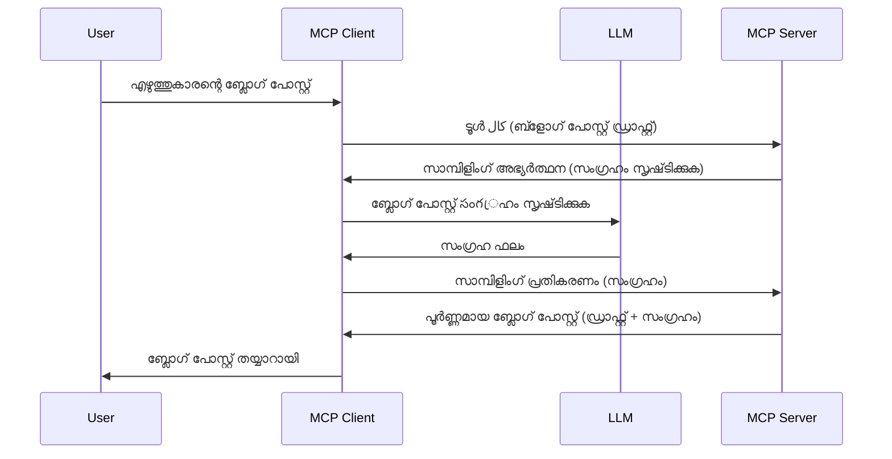

> [ഡീപ്രിക്കെയ്റ്റഡ്: 2026-07-28 റിലീസ് ക്യാൻഡിഡേറ്റ്](https://blog.modelcontextprotocol.io/posts/2026-07-28-release-candidate/)

# സാമ്പ്ലിംഗ് - ക്ലയന്റിന് ഫീച്ചറുകൾ ഡെലിഗേറ്റ് ചെയ്യുക

> **ഡീപ്രിക്കേഷൻ നോട്ടീസ്:** `2026-07-28` MCP സ്പെസിഫിക്കേഷൻ റിലീസ് ക്യാൻഡിഡേറ്റ് സാമ്പ്ലിംഗിനെ ഡീപ്രിക്കേറ്റഡ് ആയി അടയാളപ്പെടുത്തി LLM പ്രൊവൈഡർ APIs-നോട് നേരിട്ട് ഇന്റഗ്രേറ്റ് ചെയ്യലിന് പ്രാധാന്യം നൽകുന്നു. സാമ്പ്ലിംഗ് `2025-11-25`-ൽ പ്രവർത്തിക്കുന്നത് തുടരും, കൂടാതെ ഔദ്യോഗിക ഡീപ്രിക്കേഷൻ ഉണ്ടായ ഒരു വർഷംകുടി വരെ പ്രവർത്തിക്കും, അതുകൊണ്ട് ഈ പാഠത്തിൽ ഉള്ളവ എല്ലാം പ്രാമാണികമാണ് — പക്ഷെ പുതിയ സർവർ ഡിസൈനുകൾ പകരക്കാരനായ മാതൃകയുടെ വിലയിരുത്തണം. കൂടുതൽ അറിയാൻ നോക്കൂ [MCP-യിലെ മാറ്റങ്ങൾ: 2026-07-28 റിലീസ് ക്യാൻഡിഡേറ്റ്](../../01-CoreConcepts/mcp-2026-07-28-release-candidate.md).

ചിലപ്പോൾ, സാധാരണ ലക്ഷ്യത്തിന് MCP ക്ലയന്റും MCP സർവർയും ചേർന്ന് പ്രവർത്തിക്കേണ്ടി വരും. സർവർക്ക് ക്ലയന്റിൽ ഉള്ള LLM-ന്റെ സഹായം ആവശ്യമുള്ള സാഹചര്യങ്ങളുണ്ടാവാം. ഈ സാഹചര്യത്തിൽ, സാമ്പ്ലിംഗാണ് ഇതിന് ഉചിതമുള്ളത്.

ചില ഉപയോഗ കേസുകളും സാമ്പ്ലിംഗ് ഉൾപ്പെടെയുള്ള പരിഹാരത്തെ உருவാക്കുന്നതെങ്ങനെ എന്നതും പരിശോധിക്കാം.

## അവലോകനം

ഈ പാഠത്തിൽ, സാമ്പ്ലിംഗ് എപ്പോൾ എങ്ങനെ ഉപയോഗിക്കാമെന്ന് വിശദീകരിക്കുന്നതിനാണ് ഞങ്ങൾ ശ്രദ്ധ കേന്ദ്രീകരിക്കുന്നത്, കൂടാതെ അതിനെ എങ്ങനെ കോൺഫിഗർ ചെയ്യാമെന്നും.

## പഠന ലക്ഷ്യങ്ങൾ

ഈ അധ്യായത്തിൽ, ഞങ്ങൾ ചെയ്യും:

- സാമ്പ്ലിംഗ് എന്താണെന്നും എപ്പോൾ ഉപയോഗിക്കണമെന്ന് വിശദീകരിക്കുക.
- MCP-യിൽ സാമ്പ്ലിംഗ് കോൺഫിഗർ ചെയ്യുന്നത് കാണിക്കുക.
- സാമ്പ്ലിംഗ് പ്രവർത്തനത്തിലെ ഉദാഹരണങ്ങൾ നൽകുക.

## സാമ്പ്ലിംഗ് എന്താണ്, അത് എന്തിന് ഉപയോഗിക്കണം?

സാമ്പ്ലിംഗ് ഒരു ആധുനിക ഫീച്ചർ ആണ്, ഇത് താഴെയുള്ള വിധത്തിൽ പ്രവർത്തിക്കുന്നു:



### സാമ്പ്ലിംഗ് അഭ്യർഥന

ശരി, ഇപ്പോൾ നമ്മുടെ കാഴ്‌ചപ്പാടിൽ ഒരു വിശ്വസനീയമായ സാഹചര്യമാണ്, ക്ലയന്റിന് MCP സർവർ അയക്കുന്ന സാമ്പ്ലിംഗ് അഭ്യർഥനയെക്കുറിച്ച് സംസാരിക്കാം. JSON-RPC ഫോർമാറ്റിൽ അതുപോലെ ഒരു അഭ്യർഥന ഇങ്ങനെ കാണപ്പെടും:

```json
{
  "jsonrpc": "2.0",
  "id": 1,
  "method": "sampling/createMessage",
  "params": {
    "messages": [
      {
        "role": "user",
        "content": {
          "type": "text",
          "text": "Create a blog post summary of the following blog post: <BLOG POST>"
        }
      }
    ],
    "modelPreferences": {
      "hints": [
        {
          "name": "claude-3-sonnet"
        }
      ],
      "intelligencePriority": 0.8,
      "speedPriority": 0.5
    },
    "systemPrompt": "You are a helpful assistant.",
    "maxTokens": 100
  }
}
```

ഇവിടെ ചില കാര്യങ്ങൾ ചൂണ്ടിക്കാണിക്കുവാൻ ഉണ്ട്:

- Prompt, content -> text എന്ന ഹാൻഡിലിൽ, LLM-ക്ക് ബ്ലോഗ് പോസ്റ്റ് ഉള്ളടക്കം സംക്ഷേപിക്കാൻ നൽകുന്ന നിർദ്ദേശമാണ്.

- **modelPreferences**. ഈ വിഭാഗം ഒരു മുൻഗണന മാത്രമാണ്, LLM-നുമായി ഉപയോഗിക്കാനുള്ള കോൺഫിഗറേഷൻ എന്തെന്നതിനെക്കുറിച്ചുള്ള നിർദ്ദേശം. ഉപയോക്താവ് ഈ നിർദ്ദേശങ്ങളും മാറ്റങ്ങളും തിരഞ്ഞെടുക്കാം. ഈ കേസിൽ മോഡൽ തിരഞ്ഞെടുക്കൽ, വേഗതയും ബുദ്ധിമുട്ടും മുൻഗണനകളാണ്.
- **systemPrompt**, ഇത് സാധാരണ സിസ്റ്റം പ്രോംപ് ആണ്, ഇത് LLM-ന് വ്യക്തിത്വം നൽകി മാർഗ്ഗനിർദ്ദേശങ്ങൾ അടങ്ങിയിരിക്കും.
- **maxTokens**, ഈ പ്രോപ്പർട്ടി ഉപയോക്താവിന് ഈ ദൗത്യത്തിന് ഉപയോഗിക്കേണ്ട ടോക്കൺ കരുതലുകൾ അളക്കുന്നു.

### sampling പ്രതികരണം

MCP Client തിരിച്ചയക്കുന്ന ഈ പ്രതികരണം, LLM-നെ വിളിച്ച്, അതിന്റെ മറുപടി കാത്തിരിക്കുന്നതിന്റെ ഫലമാണ്. JSON-RPC ൽ ഇത് ഇങ്ങനെ കാണാം:

```json
{
  "jsonrpc": "2.0",
  "id": 1,
  "result": {
    "role": "assistant",
    "content": {
      "type": "text",
      "text": "Here's your abstract <ABSTRACT>"
    },
    "model": "gpt-5",
    "stopReason": "endTurn"
  }
}
```

പ്രതികരണത്തിൽ ബ്ലോഗ് പോസ്റ്റ് സംക്ഷേപം ചേർത്തിരിക്കുന്നതിൽ ശ്രദ്ധിക്കുക, തന്നത് പോലെ തന്നെ ആണ്. കൂടാതെ "model" ഉപയോഗിച്ചത് ഞങ്ങൾ അഭ്യർത്ഥിച്ച മോഡൽ അല്ല, "claude-3-sonnet" പകരം "gpt-5" ആണ്. ഇത് ഉപയോക്താവ് ആവശ്യത്തിന് മാറ്റം വരുത്താമെന്ന് കാണിക്കാൻ ആണ്, Sampling അഭ്യർത്ഥന നിർദ്ദേശം മാത്രമാണെന്ന് വ്യക്തമാക്കുന്നു.

ശരി, ഇപ്പോൾ മുഖ്യ പ്രവാഹവും, ഉപകാരപ്രദമായ ജോലി "ബ്ലോഗ് പോസ്റ്റ് സൃഷ്ടി + സംക്ഷേപം" ഉപയോഗിക്കുന്നതും മനസ്സിലാക്കിയപ്പോൾ, ഇത് പ്രവർത്തിപ്പിക്കാൻ എന്ത് ചെയ്യണം എന്ന് നോക്കാം.

### സന്ദേശ തരം

സാമ്പ്ലിംഗ് സന്ദേശങ്ങൾ നിർബന്ധമായി ടെക്സ്റ്റ് മാത്രം അല്ല, ചിത്രങ്ങളും ഓഡിയോയും അയയ്ക്കാം. JSON-RPC എങ്ങനെ വ്യത്യസ്തമാണ് നോക്കാം:

**ടെക്സ്റ്റ്**

```json
{
  "type": "text",
  "text": "The message content"
}
```

**ചിത്ര ഉള്ളടക്കം**

```json
{
  "type": "image",
  "data": "base64-encoded-image-data",
  "mimeType": "image/jpeg"
}
```

**ഓഡിയോ ഉള്ളടക്കം**

```json
{
  "type": "audio",
  "data": "base64-encoded-audio-data",
  "mimeType": "audio/wav"
}
```

> NOTE: സാമ്പ്ലിംഗ് കുറിച്ച് കൂടുതല്‍ വിവരങ്ങള്‍ക്കായി, [ഓഫീഷ്യല്‍ ഡോക്സ്](https://modelcontextprotocol.io/specification/2025-11-25/client/sampling) കാണുക

## ക്ലയന്റിൽ സാമ്പ്ലിംഗ് എങ്ങനെ കോൺഫിഗർ ചെയ്യാം

> ശ്രദ്ധിക്കുക: നിങ്ങൾ ഒരു സർവർ മാത്രം നിർമ്മിക്കുന്നുവെങ്കിൽ, ഇവിടെ കൂടുതലൊന്നും ചെയ്യേണ്ടതില്ല.

ക്ലയന്റിൽ നിങ്ങൾക്ക് താഴെ പറയുന്ന ഫീച്ചർ ഇങ്ങനെ വ്യക്തമാക്കണം:

```json
{
  "capabilities": {
    "sampling": {}
  }
}
```

ഇത് നിങ്ങൾ തിരഞ്ഞെടുക്കുന്ന ക്ലയന്റ് സർവറുമായി തുടക്കം കുറിക്കുമ്പോൾ സ്വീകരിക്കപ്പെടും.

## പ്രവർത്തനത്തിലെ സാമ്പ്ലിംഗ് ഉദാഹരണം - ഒരു ബ്ലോഗ് പോസ്റ്റ് സൃഷ്ടിക്കുക

ഒരു സാമ്പ്ലിംഗ് സർവർ കോഡ് ചെയ്യാം, താഴെ പറയുന്നവ വേണം:

1. സർവറിൽ ഒരു ടൂൾ സൃഷ്ടിക്കുക.
1. ഈ ടൂൾ ഒരു sampling അഭ്യർഥന സൃഷ്ടിക്കണം
1. ക്ലയന്റിന്റെ sampling അഭ്യർഥനയുടെ മറുപടി വരുന്നത് ടൂൾ കാത്തിരിക്കണം.
1. പിന്നീട് ടൂൾ ഫലം നിർമ്മിക്കണം.

ഇനി ഘട്ടത്തിൽ കോഡ് നോക്കാം:

### -1- ടൂൾ സൃഷ്ടിക്കുക

**python**

```python
@mcp.tool()
async def create_blog(title: str, content: str, ctx: Context[ServerSession, None]) -> str:
    """Create a blog post and generate a summary"""

```

### -2- sampling അഭ്യർഥന സൃഷ്ടിക്കുക

താഴെ കൊടുത്ത കോഡ് ഉപയോഗിച്ച് ടൂൾ വിപുലീകരിക്കുക:

**python**

```python
post = BlogPost(
        id=len(posts) + 1,
        title=title,
        content=content,
        abstract=""
    )

prompt = f"Create an abstract of the following blog post: title: {title} and draft: {content} "

result = await ctx.session.create_message(
        messages=[
            SamplingMessage(
                role="user",
                content=TextContent(type="text", text=prompt),
            )
        ],
        max_tokens=100,
)

```

### -3- മറുപടി കാത്തിരിക്കുക, മറുപടി തിരികെ നൽകുക

**python**

```python
post.abstract = result.content.text

posts.append(post)

# ಸಂಪೂರ್ಣ ಉತ್ಪನ್ನം മടക്കുക
return json.dumps({
    "id": post.title,
    "abstract": post.abstract
})
```

### -4- മുഴുവൻ കോഡ്

**python**

```python
from starlette.applications import Starlette
from starlette.routing import Mount, Host

from mcp.server.fastmcp import Context, FastMCP

from mcp.server.session import ServerSession
from mcp.types import SamplingMessage, TextContent

import json


from uuid import uuid4
from typing import List
from pydantic import BaseModel


mcp = FastMCP("Blog post generator")

# app = FastAPI()

posts = []

class BlogPost(BaseModel):
    id: int
    title: str
    content: str
    abstract: str

posts: List[BlogPost] = []

@mcp.tool()
async def create_blog(title: str, content: str, ctx: Context[ServerSession, None]) -> str:
    """Create a blog post and generate a summary"""

    post = BlogPost(
        id=len(posts) + 1,
        title=title,
        content=content,
        abstract=""
    )

    prompt = f"Create an abstract of the following blog post: title: {title} and draft: {content} "

    result = await ctx.session.create_message(
        messages=[
            SamplingMessage(
                role="user",
                content=TextContent(type="text", text=prompt),
            )
        ],
        max_tokens=100,
    )

    post.abstract = result.content.text

    posts.append(post)

    # പൂർണ്ണ ബ്ലോഗ് പോസ്റ്റ് മടക്കു
    return json.dumps({
        "id": post.title,
        "abstract": post.abstract
    })

if __name__ == "__main__":
    print("Starting server...")
    # mcp.run()
    mcp.run(transport="streamable-http")

# app ഓടിക്കാൻ: python server.py
```

### -5- Visual Studio Code-ൽ ഇത് പരീക്ഷിക്കുക

Visual Studio Code-ൽ ഇത് പരീക്ഷിക്കാൻ, താഴെയുള്ളത് ആസംവിധാനം ചെയ്യുക:

1. ടെർമിനലിൽ സർവർ ആരംഭിക്കുക
1. അതിനെ *mcp.json*-ൽ ചേർക്കുക (ആരും തുടങ്ങുമെന്ന് ഉറപ്പാക്കുക) ഉദാഹരണത്തിന്:

   ```json
   "servers": {
      "blog-server": {
        "type": "http",
        "url": "http://localhost:8000/mcp"
      }
   }
   ```

1. ഒരു പ്രോംപ്റ്റ് ടൈപ്പ് ചെയ്യുക:

   ```text
   create a blog post named "Where Python comes from", the content is "Python is actually named after Monty Python Flying Circus"
   ```

1. sampling നടക്കാൻ അനുവദിക്കുക. ഒന്നാം തവണ പരീക്ഷിക്കുമ്പോൾ നിങ്ങൾക്കു് ഒരു അധിക ഡയലോഗ് കാണിക്കും, അത് അംഗീകരിക്കണം, പിന്നീട് സാധാരണ ടൂൾ നടത്താൻ ആവശ്യപ്പെടുന്ന ഡയലോഗ് കാണും

1. ഫലങ്ങൾ നിരീക്ഷിക്കുക. ഫലങ്ങൾ GitHub Copilot Chat-ൽ ചേർത്ത രൂപത്തിൽ കാണാമല്ലോ, എന്നാൽ നിങ്ങളുടേത് അതിന്റെ മൂല JSON പ്രതികരണവും പരിശോധിക്കാം.

**ബോണസ്**. Visual Studio Code ടൂളിംഗ് sampling-ന് മികച്ച പിന്തുണ നൽകുന്നു. ഇൻസ്റ്റാൾ ചെയ്ത സർവറിലെ Sampling ആക്‌സസ് ഇങ്ങനെ കോൺഫിഗർ ചെയ്യാം:

1. എക്സ്റ്റൻഷൻ വിഭാഗത്തിലേക്ക് പോകുക.
1. "MCP SERVERS - INSTALLED" വിഭാഗത്തിൽ ഇൻസ്റ്റാൾ ചെയ്ത സർവറിനുള്ള  കോഗ് ഐക്കൺ തിരഞ്ഞെടുക്കുക.
1 "Configure Model Access" തിരഞ്ഞെടുക്കുക, ഇവിടെ Sampling നടത്തുന്നതിനായി GitHub Copilot ഉപയോഗിക്കാൻ അനുവദിക്കാവുന്ന മോഡലുകൾ തിരഞ്ഞെടുക്കാം. "Show Sampling requests" തിരഞ്ഞെടുക്കുമ്പോൾ അടുത്തകാലത്ത് നടന്ന sampling അഭ്യർത്ഥനകൾ കാണാനാകും.

## അസൈൻമെന്റ്

ഈ അസൈൻമെന്റിൽ, നിങ്ങൾക്കു് സ്വല്‍പ്പ വ്യത്യസ്ഥമായി sampling സംയോജനം രൂപീകരിക്കണം, അതായത് ഉൽപ്പന്ന വിവരണം സൃഷ്ടിക്കാൻ സഹായിക്കുന്ന sampling സംയോജനം. ഇത് നിങ്ങൾക്കുള്ള സാഹചര്യമാണ്:

**സഹജ സ്ഥിതി**: ഒരു ഇ-കൊമേഴ്സ് ബാക്ക് ഓഫീസ് ജീവനക്കാർക്ക് ഉൽപ്പന്ന വിവരണങ്ങൾ ഒരുക്കാൻ വളരെ സമയം വേണ്ടിവരുന്നു. അതുകൊണ്ട്, "create_product" എന്ന ടൂൾ "title" ഉം "keywords" ഉം ഉള്ള arguments ഉപയോഗിച്ച് വിളിയ്ക്കുമ്പോൾ, ക്ലയന്റ് LLM ഉപയോഗിച്ച് തന്ത്രവെണ്ണം bias ചെയ്ത "description" എന്ന ഫീൽഡും ഉള്‍പ്പെടെ സമ്പൂർണ്ണ ഉൽപ്പന്നം സൃഷ്ടിക്കേണ്ടതാണ്.

TIP: മുമ്പ് പഠിച്ചതുപോലെ sampling അഭ്യർഥന ഉപയോഗിച്ച് ഈ സർവർ ടൂൾ ക്രമീകരിക്കുക.

## പരിഹാരം

[പരിഹാരം](./solution/README.md)

## പ്രധാന സംഗ്രഹങ്ങൾ

sampling-ന് LLM സഹായം വേണമെന്ന് സർവർക്ക് ആവശ്യമുള്ളപ്പോൾ ക്ലയന്റിന് പ്രവർത്തനങ്ങൾ നിയോഗിക്കാൻ കഴിയുന്ന ശക്തിയായ ഫീച്ചർ ആണ്.

## അടുത്തത്

- [അദ്ധ്യായം 4 -  പ്രായോഗിക നടപ്പാക്കൽ](../../04-PracticalImplementation/README.md)

---

<!-- CO-OP TRANSLATOR DISCLAIMER START -->
**അറിയിപ്പ്**:
ഈ രേഖ AI പരിഭാഷാ സേവനം [Co-op Translator](https://github.com/Azure/co-op-translator) ഉപയോഗിച്ച് പരിഭാഷപ്പെടുത്തിയതാണ്. ഞങ്ങൾ കൃത്യതയ്ക്കായി ശ്രമിക്കുന്നുവെങ്കിലും, ഓട്ടോമേറ്റഡ് പരിഭാഷകളിൽ പിഴവുകൾ അല്ലെങ്കിൽ തെറ്റായ വിവരങ്ങൾ ഉണ്ടാകാൻ സാധ്യതയുണ്ട്. അതിന്റെ സ്വാഭാവിക ഭാഷയിലുള്ള അസൽ രേഖയാണ് പ്രാമാണികമായ ഉറവിടമായി പരിഗണിക്കേണ്ടത്. നിർണായകമായ വിവരങ്ങൾക്ക്, പ്രൊഫഷണൽ മനുഷ്യ പരിഭാഷ ശുപാർശ ചെയ്യുന്നു. ഈ പരിഭാഷ ഉപയോഗിച്ച് ഉണ്ടാകുന്ന തെറ്റിദ്ധാരണകൾ അല്ലെങ്കിൽ തെറ്റായ വ്യാഖ്യാനങ്ങൾക്കായി ഞങ്ങൾ ഉത്തരവാദികളല്ല.
<!-- CO-OP TRANSLATOR DISCLAIMER END -->