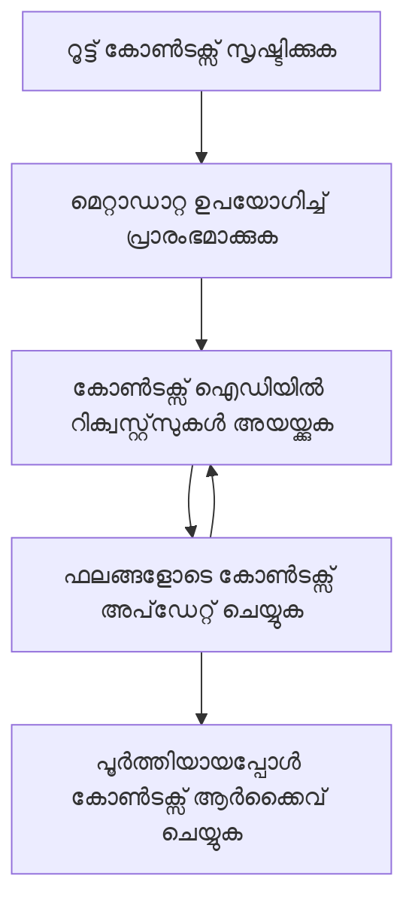

> [പ്രാചീനമാക്കി: 2026-07-28 റിലീസ് കാന്‍‌ഡിഡേറ്റ്](https://blog.modelcontextprotocol.io/posts/2026-07-28-release-candidate/#roots-sampling-and-logging-are-deprecated)

# MCP റൂട്ട് കോൺടെക്സ്റ്റുകൾ

> **പ്രാചീനമാക്കൽ അറിയിപ്പ്:** `2026-07-28` MCP സ്പെസിഫിക്കേഷൻ റിലീസ് കാൻഡിഡേറ്റ് റൂട്ട്‌ുകൾ ടൂൾ പാരാമീറ്ററുകൾ, റിസോഴ്സ് URI-കൾ, അല്ലെങ്കിൽ സർവർ കോൺഫിഗറേഷൻ ഉൾപ്പെടെയുള്ളവയ്ക്ക് പകരം പ്രാചീനമാക്കപ്പെട്ടതായി അടയാളപ്പെടുത്തുന്നു. റൂട്ട്‌ുകൾ `2025-11-25`-ൽ പ്രവർത്തനം തുടരും, കൂടാതെ ഔപചാരികമായി പ്രാചീനമാക്കിയ ശേഷം കുറഞ്ഞത് ഒരു വർഷം പ്രവർത്തിക്കുന്നു, അതിനാൽ ഈ പാഠത്തിലെ എല്ലാം സാധുവാണ് - പക്ഷേ പുതിയ സർവർ ഡിസൈനുകൾ പകരം സ്വീകരിക്കുന്ന മാതൃക വിലയിരുത്തേണ്ടതാണ്. [MCP ലെ മാറ്റങ്ങൾ എന്തൊക്കെയാണ്: 2026-07-28 റിലീസ് കാൻഡിഡേറ്റ്](../../01-CoreConcepts/mcp-2026-07-28-release-candidate.md) കാണുക.

റൂട്ട് കോൺടെക്സ്റ്റുകൾ മൾട്ടിപ്പിൾ അഭ്യർത്ഥനകൾക്കും സെഷനുകൾക്കും ആഘാതം ചെലുത്തുന്ന സംഭാഷണ ചരിത്രവും പങ്കുവെക്കുന്ന സ്റ്റേറ്റും നിലനിർത്തുന്നതിനുള്ള സ്ഥിരമായ ഘടകമായി മോഡൽ കോൺടെക്സ്റ്റ് പ്രോട്ടോക്കോളിൽ ഒരു അടിസ്ഥാന ആശയമാണ്.

## പരിചയം

ഈ പാഠത്തിൽ, ഞങ്ങൾ MCP-ൽ റൂട്ട് കോൺടെക്സ്റ്റുകൾ എങ്ങനെ സൃഷ്ടിക്കാമെന്നും, നയിക്കാമെന്നും, പ്രയോജനപ്പെടുത്താമെന്നും പഠിക്കുമെന്ന്.

## പഠന ലക്ഷ്യങ്ങൾ

ഈ പാഠം അവസാനിക്കുമ്പോൾ, നിങ്ങൾക്ക് സാധിക്കേണ്ടത്:

- റൂട്ട് കോൺടെക്സ്റ്റുകളുടെ ഉദ്ദേശ്യവും ഘടനയും മനസ്സിലാക്കുക
- MCP ക്ലയന്റ് ലൈബ്രറിയുകൾ ഉപയോഗിച്ച് റൂട്ട് കോൺടെക്സ്റ്റുകൾ സൃഷ്ടിക്കുകയും നടത്തുകയും ചെയ്യുക
- .NET, ജാവ, ജാവാസ്ക്രിപ്റ്റ്, പൈഥൺ പ്രയോഗങ്ങളിൽ റൂട്ട് കോൺടെക്സ്റ്റുകൾ നടപ്പിലാക്കുക
- മൾട്ടി-ടേൺ സംഭാഷണങ്ങൾക്കും സ്റ്റേറ്റ് മാനേജ്മെന്റിനും റൂട്ട് കോൺടെക്സ്റ്റുകൾ പ്രയോജനപ്പെടുത്തുക
- റൂട്ട് കോൺടെക്സ്റ്റ് മാനേജ്മെന്റിനുള്ള മികച്ച പ്രാക്ടീസുകൾ നടപ്പിലാക്കുക

## റൂട്ട് കോൺടെക്സ്റ്റുകൾ മനസ്സിലാക്കൽ

റൂട്ട് കോൺടെക്സ്റ്റുകൾ ബന്ധപ്പെട്ടു പ്രവർത്തിക്കുന്ന ഇടപാടുകളുടെ ഒരു ശ്രേണിയെക്കുറിച്ചുള്ള ചരിത്രവും സ്റ്റേറ്റും വെച്ചുനിൽക്കുന്ന കണ്ടെയ്‌നറുകളാണ്. അവ ഇതെല്ലാം സാധ്യമാക്കുന്നു:

- **സമ്പാദിക്കപ്പെട്ട സംഭാഷണം**: ഒരേ സമയം പല ടേണുകൾക്കുമുള്ള സുസ്ഥിരമായ സംഭാഷണ സംവരണം
- **മെമ്മറി മാനേജ്‌മെന്റ്**: ഇടപാടുകൾക്കിടയിൽ വിവരങ്ങൾ സൂക്ഷിക്കുകയും പുനരുപയോഗം ചെയ്യുകയും ചെയ്യുന്നു
- **സ്റ്റേറ്റ് മാനേജ്‌മെന്റ്**: സങ്കീർണ്ണ വർക്ക്‌ഫ്ലോകളിലെ പുരോഗതി നിരീക്ഷിക്കൽ
- **കോൺടെക്സ്റ്റ് ഷെയറിംഗ്**: ഒറ്റ സംഭാഷണ സ്റ്റേറ്റിൽ പല ക്ലയന്റുകളും പ്രവേശനം നേടുന്നത് അനുവദിക്കല്‍

MCP-ൽ, റൂട്ട് കോൺടെക്സ്റ്റുകൾ താഴെ പറയുന്ന പ്രധാന ഗുണങ്ങളോടെയാണ്:

- ഓരോ റൂട്ട് കോൺടെക്സ്റ്റിന് വ്യത്യസ്തമായ തിരിച്ചറിവ് ഉണ്ടാകും.
- അവ സംഭാഷണ ചരിത്രം, ഉപയോക്തൃ ഇഷ്ടങ്ങൾ, മറ്റ് മെറ്റാഡേറ്റ എന്നിവ ഉൾക്കൊള്ളാം.
- അവ സൃഷ്‌ടിക്കുകയും, ആക്സസ് ചെയ്യുകയും, ആവശ്യമുള്ളപ്പോഴേയ്ക്ക് ആർക്കൈവ് ചെയ്യുകയും ചെയ്യാം.
- അവർ സൂക്ഷ്മമായ ആക്‌സസ് നിയന്ത്രണങ്ങളും അനുമതികളും പിന്തുണയ്ക്കുന്നു.

## റൂട്ട് കോൺടെക്സ്റ്റ് ജീവിതചക്രം



## റൂട്ട് കോൺടെക്സ്റ്റുകളുമായി പ്രവർത്തിക്കൽ

റൂട്ട് കോൺടെക്സ്റ്റുകൾ എങ്ങനെ സൃഷ്ടിക്കുകയും കൈകാര്യം ചെയ്യുകയും ചെയ്യാമെന്നെ ഒരു ഉദാഹരണമാണ് ഇവിടെ.

### C# നടപ്പാക്കൽ

```csharp
// .NET Example: Root Context Management
using Microsoft.Mcp.Client;
using System;
using System.Threading.Tasks;
using System.Collections.Generic;

public class RootContextExample
{
    private readonly IMcpClient _client;
    private readonly IRootContextManager _contextManager;
    
    public RootContextExample(IMcpClient client, IRootContextManager contextManager)
    {
        _client = client;
        _contextManager = contextManager;
    }
    
    public async Task DemonstrateRootContextAsync()
    {
        // 1. Create a new root context
        var contextResult = await _contextManager.CreateRootContextAsync(new RootContextCreateOptions
        {
            Name = "Customer Support Session",
            Metadata = new Dictionary<string, string>
            {
                ["CustomerName"] = "Acme Corporation",
                ["PriorityLevel"] = "High",
                ["Domain"] = "Cloud Services"
            }
        });
        
        string contextId = contextResult.ContextId;
        Console.WriteLine($"Created root context with ID: {contextId}");
        
        // 2. First interaction using the context
        var response1 = await _client.SendPromptAsync(
            "I'm having issues scaling my web service deployment in the cloud.", 
            new SendPromptOptions { RootContextId = contextId }
        );
        
        Console.WriteLine($"First response: {response1.GeneratedText}");
        
        // Second interaction - the model will have access to the previous conversation
        var response2 = await _client.SendPromptAsync(
            "Yes, we're using containerized deployments with Kubernetes.", 
            new SendPromptOptions { RootContextId = contextId }
        );
        
        Console.WriteLine($"Second response: {response2.GeneratedText}");
        
        // 3. Add metadata to the context based on conversation
        await _contextManager.UpdateContextMetadataAsync(contextId, new Dictionary<string, string>
        {
            ["TechnicalEnvironment"] = "Kubernetes",
            ["IssueType"] = "Scaling"
        });
        
        // 4. Get context information
        var contextInfo = await _contextManager.GetRootContextInfoAsync(contextId);
        
        Console.WriteLine("Context Information:");
        Console.WriteLine($"- Name: {contextInfo.Name}");
        Console.WriteLine($"- Created: {contextInfo.CreatedAt}");
        Console.WriteLine($"- Messages: {contextInfo.MessageCount}");
        
        // 5. When the conversation is complete, archive the context
        await _contextManager.ArchiveRootContextAsync(contextId);
        Console.WriteLine($"Archived context {contextId}");
    }
}
```

മുകളിൽ കൊടുത്ത കോഡിൽ ഞങ്ങൾ:

1. ഒരു കസ്റ്റമർ പിന്തുണ സെഷനിനായി ഒരു റൂട്ട് കോൺടെക്സ്റ്റ് സൃഷ്ടിച്ചു.
1. ആ കോൺടെക്സ്റ്റിൽ പല സന്ദേശങ്ങളും അയച്ചു, മോഡൽ സ്റ്റേറ്റ് നിലനിർത്താൻ അനുവദിച്ചു.
1. സംഭാഷണത്തിന്റെ അടിസ്ഥാനത്തിൽ ബന്ധപ്പെട്ട മെറ്റാഡേറ്റ ഉപയോഗിച്ച് കോൺടെക്സ്റ്റ് പുതുക്കി.
1. സംഭാഷണ ചരിത്രം മനസ്സിലാക്കാൻ കോൺടെക്സ്റ്റ് വിവരം നേടി.
1. സംഭാഷണം പൂർത്തിയായപ്പോള്‍ കോൺടെക്സ്റ്റ് ആർക്കൈവ് ചെയ്തു.

## ഉദാഹരണം: സാമ്പത്തിക വിശകലനത്തിനായി റൂട്ട് കോൺടെക്സ്റ്റ് നടപ്പാക്കൽ

ഈ ഉദാഹരണത്തിൽ, പല ഇടപാടുകളിലായി സ്റ്റേറ്റ് നിലനിർത്തുന്നതിന് സാമ്പത്തിക വിശകലന സെഷനായി ഒരു റൂട്ട് കോൺടെക്സ്റ്റ് സൃഷ്ടಿಸುವ വിധം കാണിക്കും.

### ജാവ നടപ്പാക്കൽ

```java
// ജावा ഉദാഹരണം: റൂട്ട് കോൺടെക്സ്റ്റ് ഇംപ്ലിമെന്റേഷൻ
package com.example.mcp.contexts;

import com.mcp.client.McpClient;
import com.mcp.client.ContextManager;
import com.mcp.models.RootContext;
import com.mcp.models.McpResponse;

import java.util.HashMap;
import java.util.Map;
import java.util.UUID;

public class RootContextsDemo {
    private final McpClient client;
    private final ContextManager contextManager;
    
    public RootContextsDemo(String serverUrl) {
        this.client = new McpClient.Builder()
            .setServerUrl(serverUrl)
            .build();
            
        this.contextManager = new ContextManager(client);
    }
    
    public void demonstrateRootContext() throws Exception {
        // കോൺടെക്സ്റ്റ് മെറ്റാഡേറ്റ സൃഷ്ടിക്കുക
        Map<String, String> metadata = new HashMap<>();
        metadata.put("projectName", "Financial Analysis");
        metadata.put("userRole", "Financial Analyst");
        metadata.put("dataSource", "Q1 2025 Financial Reports");
        
        // 1. പുതിയ റൂട്ട് കോൺടെക്സ്റ്റ് സൃഷ്ടിക്കുക
        RootContext context = contextManager.createRootContext("Financial Analysis Session", metadata);
        String contextId = context.getId();
        
        System.out.println("Created context: " + contextId);
        
        // 2. ആദ്യക്രമ ഇടപാട്
        McpResponse response1 = client.sendPrompt(
            "Analyze the trends in Q1 financial data for our technology division",
            contextId
        );
        
        System.out.println("First response: " + response1.getGeneratedText());
        
        // 3. പ്രതികരണത്തിൽനിന്ന് ലഭിച്ച പ്രധാന വിവരങ്ങൾ കൊണ്ട് കോൺടെക്സ്റ്റ് അപ്ഡേറ്റ് ചെയ്യുക
        contextManager.addContextMetadata(contextId, 
            Map.of("identifiedTrend", "Increasing cloud infrastructure costs"));
        
        // രണ്ടാമത്തെ ഇടപാട് - ഒരേ കോൺടെക്സ്റ്റ് ഉപയോഗിച്ച്
        McpResponse response2 = client.sendPrompt(
            "What's driving the increase in cloud infrastructure costs?",
            contextId
        );
        
        System.out.println("Second response: " + response2.getGeneratedText());
        
        // 4. വിശകലന സെഷന്റെ സംഗ്രഹിച്ചു സൃഷ്ടിക്കുക
        McpResponse summaryResponse = client.sendPrompt(
            "Summarize our analysis of the technology division financials in 3-5 key points",
            contextId
        );
        
        // സംഗ്രഹിച്ചു കോൺടെക്സ്റ്റ് മെറ്റാഡേറ്റയിൽ സൂക്ഷിക്കുക
        contextManager.addContextMetadata(contextId, 
            Map.of("analysisSummary", summaryResponse.getGeneratedText()));
            
        // അപ്ഡേറ്റ് ചെയ്ത കോൺടെക്സ്റ്റ് വിവരങ്ങൾ നേടുക
        RootContext updatedContext = contextManager.getRootContext(contextId);
        
        System.out.println("Context Information:");
        System.out.println("- Created: " + updatedContext.getCreatedAt());
        System.out.println("- Last Updated: " + updatedContext.getLastUpdatedAt());
        System.out.println("- Analysis Summary: " + 
            updatedContext.getMetadata().get("analysisSummary"));
            
        // 5. തീർന്നപ്പോൾ കോൺടെക്സ്റ്റ് ആർക്കൈവ് ചെയ്യുക
        contextManager.archiveContext(contextId);
        System.out.println("Context archived");
    }
}
```

മുകളിൽ കൊടുത്ത കോഡിൽ ഞങ്ങൾ:

1. സാമ്പത്തിക വിശകലന സെഷനായി ഒരു റൂട്ട് കോൺടെക്സ്റ്റ് സൃഷ്‌ടിച്ചു.
2. മോഡൽ സ്റ്റേറ്റ് നിലനിർത്താനായി ആ കോൺടെക്സ്റ്റിൽ പല സന്ദേശങ്ങളും അയച്ചു.
3. സംഭാഷണത്തിന്റെ അടിസ്ഥാനത്തിൽ ബന്ധപ്പെട്ട മെറ്റാഡേറ്റ ഉപയോഗിച്ച് കോൺടെക്സ്റ്റ് പുതുക്കി.
4. വിശകലന സെഷന്റെ സംഗ്രഹം സൃഷ്ടിച്ച് കോൺടെക്സ്റ്റ് മെറ്റാഡേറ്റയിൽ സംഭരിച്ചു.
5. സംഭാഷണം പൂർത്തിയായപ്പോൾ കോൺടെക്സ്റ്റ് ആർക്കൈവ് ചെയ്തു.

## ഉദാഹരണം: റൂട്ട് കോൺടെക്സ്റ്റ് മാനേജ്മെന്റ്

സംഭാഷണ ചരിത്രവും സ്റ്റേറ്റും നിലനിർത്തുവാൻ റൂട്ട് കോൺടെക്സ്റ്റുകൾ ഫലപ്രദമായി കൈകാര്യം ചെയ്യുന്നത് അനിവാര്യമാണ്. ഇവിടെ ഒരു റൂട്ട് കോൺടെക്സ്റ്റ് മാനേജ്മെന്റ് നടപ്പാക്കൽ സഹിതം ഉദാഹരണമാണ്.

### ജാവാസ്‌ക്രിപ്റ്റ് നടപ്പാക്കൽ

```javascript
// ജാവാസ്ക്രിപ്റ്റ് ഉദാഹരണം: MCP റൂട്ട് കോൺടക്സ്റ്റുകൾ നിയന്ത്രിക്കൽ
const { McpClient, RootContextManager } = require('@mcp/client');

class ContextSession {
  constructor(serverUrl, apiKey = null) {
    // MCP ക്ലയന്റ് ആരംഭിക്കുക
    this.client = new McpClient({
      serverUrl,
      apiKey
    });
    
    // കോൺടക്സ്റ്റ് മാനേജർ ആരംഭിക്കുക
    this.contextManager = new RootContextManager(this.client);
  }
  
  /**
   * Create a new conversation context
   * @param {string} sessionName - Name of the conversation session
   * @param {Object} metadata - Additional metadata for the context
   * @returns {Promise<string>} - Context ID
   */
  async createConversationContext(sessionName, metadata = {}) {
    try {
      const contextResult = await this.contextManager.createRootContext({
        name: sessionName,
        metadata: {
          ...metadata,
          createdAt: new Date().toISOString(),
          status: 'active'
        }
      });
      
      console.log(`Created root context '${sessionName}' with ID: ${contextResult.id}`);
      return contextResult.id;
    } catch (error) {
      console.error('Error creating root context:', error);
      throw error;
    }
  }
  
  /**
   * Send a message in an existing context
   * @param {string} contextId - The root context ID
   * @param {string} message - The user's message
   * @param {Object} options - Additional options
   * @returns {Promise<Object>} - Response data
   */
  async sendMessage(contextId, message, options = {}) {
    try {
      // निर्दिष्ट കണ്ടെക്സ്റ്റ് ഉപയോഗിച്ച് സന്ദേശം അയയ്ക്കുക
      const response = await this.client.sendPrompt(message, {
        rootContextId: contextId,
        temperature: options.temperature || 0.7,
        allowedTools: options.allowedTools || []
      });
      
      // സംവാദത്തിൽ നിന്നുള്ള പ്രധാന洞察ങ്ങൾ ആകാംക്ഷയോടെ സൂക്ഷിക്കുക
      if (options.storeInsights) {
        await this.storeConversationInsights(contextId, message, response.generatedText);
      }
      
      return {
        message: response.generatedText,
        toolCalls: response.toolCalls || [],
        contextId
      };
    } catch (error) {
      console.error(`Error sending message in context ${contextId}:`, error);
      throw error;
    }
  }
  
  /**
   * Store important insights from a conversation
   * @param {string} contextId - The root context ID
   * @param {string} userMessage - User's message
   * @param {string} aiResponse - AI's response
   */
  async storeConversationInsights(contextId, userMessage, aiResponse) {
    try {
      // സാധ്യതയുള്ള洞察ങ്ങള്‍ എക്സ്‌ട്രാക്‌ട് ചെയ്യുക (ഒരു യഥാർത്ഥ അപ്ലിക്കേഷനിൽ ഇത് കൂടുതൽ സങ്കീർണ്ണമായിരിക്കും)
      const combinedText = userMessage + "\n" + aiResponse;
      
      // സാധ്യതയുള്ള洞察ങ്ങള്‍ തിരിച്ചറിയാൻ ലളിതമായ ഹ്യൂറിസ്റ്റിക്
      const insightWords = ["important", "key point", "remember", "significant", "crucial"];
      
      const potentialInsights = combinedText
        .split(".")
        .filter(sentence => 
          insightWords.some(word => sentence.toLowerCase().includes(word))
        )
        .map(sentence => sentence.trim())
        .filter(sentence => sentence.length > 10);
      
      // 洞察ങ്ങള്‍ കോൺടക്സ്റ്റ് മെറ്റാഡേറ്റയിൽ സൂക്ഷിക്കുക
      if (potentialInsights.length > 0) {
        const insights = {};
        potentialInsights.forEach((insight, index) => {
          insights[`insight_${Date.now()}_${index}`] = insight;
        });
        
        await this.contextManager.updateContextMetadata(contextId, insights);
        console.log(`Stored ${potentialInsights.length} insights in context ${contextId}`);
      }
    } catch (error) {
      console.warn('Error storing conversation insights:', error);
      // നിർണ്ണായക కాకാത്ത പിശക്, അതിനാൽ മുന്നറിയിപ്പ് മാത്രം ലോഗ് ചെയ്യുക
    }
  }
  
  /**
   * Get summary information about a context
   * @param {string} contextId - The root context ID
   * @returns {Promise<Object>} - Context information
   */
  async getContextInfo(contextId) {
    try {
      const contextInfo = await this.contextManager.getContextInfo(contextId);
      
      return {
        id: contextInfo.id,
        name: contextInfo.name,
        created: new Date(contextInfo.createdAt).toLocaleString(),
        lastUpdated: new Date(contextInfo.lastUpdatedAt).toLocaleString(),
        messageCount: contextInfo.messageCount,
        metadata: contextInfo.metadata,
        status: contextInfo.status
      };
    } catch (error) {
      console.error(`Error getting context info for ${contextId}:`, error);
      throw error;
    }
  }
  
  /**
   * Generate a summary of the conversation in a context
   * @param {string} contextId - The root context ID
   * @returns {Promise<string>} - Generated summary
   */
  async generateContextSummary(contextId) {
    try {
      // ഇതുവരെ ഉണ്ടായ സംവാദത്തിന്റെ സംക്ഷേപം സൃഷ്ടിക്കാൻ മോഡലിനെ ചോദിക്കുക
      const response = await this.client.sendPrompt(
        "Please summarize our conversation so far in 3-4 sentences, highlighting the main points discussed.",
        { rootContextId: contextId, temperature: 0.3 }
      );
      
      // സംക്ഷേപം കോൺടക്സ്റ്റ് മെറ്റാഡേറ്റയിൽ സൂക്ഷിക്കുക
      await this.contextManager.updateContextMetadata(contextId, {
        conversationSummary: response.generatedText,
        summarizedAt: new Date().toISOString()
      });
      
      return response.generatedText;
    } catch (error) {
      console.error(`Error generating context summary for ${contextId}:`, error);
      throw error;
    }
  }
  
  /**
   * Archive a context when it's no longer needed
   * @param {string} contextId - The root context ID
   * @returns {Promise<Object>} - Result of the archive operation
   */
  async archiveContext(contextId) {
    try {
      // ആർക്കൈവിംഗിന് മുമ്പ് അന്തിമ സംക്ഷേപം സൃഷ്ടിക്കുക
      const summary = await this.generateContextSummary(contextId);
      
      // കോൺടക്സ്റ്റ് ആർക്കൈവ് ചെയ്യുക
      await this.contextManager.archiveContext(contextId);
      
      return {
        status: "archived",
        contextId,
        summary
      };
    } catch (error) {
      console.error(`Error archiving context ${contextId}:`, error);
      throw error;
    }
  }
}

// ഉദാഹരണ ഉപയോഗം
async function demonstrateContextSession() {
  const session = new ContextSession('https://mcp-server-example.com');
  
  try {
    // 1. ഉൽപ്പന്ന പിന്തുണ സംവാദത്തിനായി പുതിയ ഒരു കോൺടക്സ്റ്റ് സൃഷ്ടിക്കുക
    const contextId = await session.createConversationContext(
      'Product Support - Database Performance',
      {
        customer: 'Globex Corporation',
        product: 'Enterprise Database',
        severity: 'Medium',
        supportAgent: 'AI Assistant'
      }
    );
    
    // 2. സംവാദത്തിലെ ആദ്യ സന്ദേശം
    const response1 = await session.sendMessage(
      contextId,
      "I'm experiencing slow query performance on our database cluster after the latest update.",
      { storeInsights: true }
    );
    console.log('Response 1:', response1.message);
    
    // അതേ കോൺടക്സ്റ്റിൽ ഫോളോ-അപ്പ് സന്ദേശം
    const response2 = await session.sendMessage(
      contextId,
      "Yes, we've already checked the indexes and they seem to be properly configured.",
      { storeInsights: true }
    );
    console.log('Response 2:', response2.message);
    
    // 3. കോൺടക്സ്റ്റിനെ പറ്റി വിവരങ്ങൾ കിട്ടിക്കുക
    const contextInfo = await session.getContextInfo(contextId);
    console.log('Context Information:', contextInfo);
    
    // 4. സംവാദത്തിന്റെ സംക്ഷേപം സൃഷ്ടിച്ച് പ്രദർശിപ്പിക്കുക
    const summary = await session.generateContextSummary(contextId);
    console.log('Conversation Summary:', summary);
    
    // 5. പൂർത്തിയായാൽ കോൺടക്സ്റ്റ് ആർക്കൈവ് ചെയ്യുക
    const archiveResult = await session.archiveContext(contextId);
    console.log('Archive Result:', archiveResult);
    
    // 6. ഏതെങ്കിലും പിഴവുകൾ സുതാര്യമായി കൈകാര്യം ചെയ്യുക
  } catch (error) {
    console.error('Error in context session demonstration:', error);
  }
}

demonstrateContextSession();
```

മുകളിൽ കൊടുത്ത കോഡിൽ ഞങ്ങൾ:

1. `createConversationContext` ഫംഗ്ഷൻ ഉപയോഗിച്ച് ഒരു പ്രോഡ്‌ക്കട്ട് സപ്പോർട്ട് സംഭാഷണത്തിനായി റൂട്ട് കോൺടെക്സ്റ്റ് സൃഷ്ടിച്ചു. ഈ കോൺടെക്സ്റ്റ് ഡാറ്റാബേസ് പെർഫോമൻസ് പ്രശ്നങ്ങളെക്കുറിച്ചാണ്.

1. `sendMessage` ഫംഗ്ഷൻ ഉപയോഗിച്ച് ആ കോൺടെക്സ്റ്റിൽ പല സന്ദേശങ്ങളും അയച്ചു, മോഡലിന് സ്റ്റേറ്റ് നിലനിർത്താൻ അനുവദിച്ചു. അയച്ച സന്ദേശങ്ങൾ മന്ദഗതിയിലുള്ള ക്വറി പെർഫോമൻസ്, ഇൻഡക്സ് കോൺഫിഗറേഷൻ എന്നിവയുമായി ബന്ധപ്പെട്ടതാണ്.

1. സംഭാഷണത്തിന്റെ അടിസ്ഥാനത്തിൽ ബന്ധപ്പെട്ട മെറ്റാഡേറ്റ ഉപയോഗിച്ച് കോൺടെക്സ്റ്റ് പുതുക്കി.

1. `generateContextSummary` ഫംഗ്ഷൻ ഉപയോഗിച്ച് സംഭാഷണത്തിന്റെ സംഗ്രഹം സൃഷ്ടിക്കുകയും അത് കോൺടെക്സ്റ്റ് മെറ്റാഡേറ്റയിൽ സംഭരിക്കുകയും ചെയ്തു.

1. `archiveContext` ഫംഗ്ഷൻ ഉപയോഗിച്ച് സംഭാഷണം പൂർത്തിയായപ്പോൾ കോൺടെക്സ്റ്റ് ആർക്കൈവ് ചെയ്തു.

1. ക്ലേശം നേരിടുമ്പോൾ ശ്രദ്ധാപൂർവ്വം കൈകാര്യം ചെയ്തു, ശക്തമായ പ്രവർത്തനക്ഷമത ഉറപ്പാക്കി.

## മൾട്ടി-ടേൺ സഹായത്തിനായുള്ള റൂട്ട് കോൺടെക്സ്റ്റ്

ഈ ഉദാഹരണത്തിൽ, മൾട്ടി-ടേൺ സഹായ സെഷനായി ഒരു റൂട്ട് കോൺടെക്സ്റ്റ് സൃഷ്ടിക്കുന്ന വിധം കാണിക്കും, പല ഇടപാടുകളിലായി സ്റ്റേറ്റ് നിലനിർത്തുന്നതിന്.

### പൈത്തൺ നടപ്പാക്കൽ

```python
# പൈഥൺ ഉദാഹരണം: മൾട്ടി-ടേൺ സഹായത്തിനായുള്ള റൂട്ട് കോൺടെക്‌സ്‌റ്റ്
import asyncio
from datetime import datetime
from mcp_client import McpClient, RootContextManager

class AssistantSession:
    def __init__(self, server_url, api_key=None):
        self.client = McpClient(server_url=server_url, api_key=api_key)
        self.context_manager = RootContextManager(self.client)
    
    async def create_session(self, name, user_info=None):
        """Create a new root context for an assistant session"""
        metadata = {
            "session_type": "assistant",
            "created_at": datetime.now().isoformat(),
        }
        
        # നൽകപ്പെട്ടാൽ ഉപയോക്തൃ വിവരങ്ങൾ ചേർക്കുക
        if user_info:
            metadata.update({f"user_{k}": v for k, v in user_info.items()})
            
        # റൂട്ട് കോൺടെക്‌സ്‌റ്റ് സൃഷ്ടിക്കുക
        context = await self.context_manager.create_root_context(name, metadata)
        return context.id
    
    async def send_message(self, context_id, message, tools=None):
        """Send a message within a root context"""
        # കോൺടെക്‌സ്‌റ്റ് ID ഉപയോഗിച്ച് ഓപ്ഷനുകൾ സൃഷ്ടിക്കുക
        options = {
            "root_context_id": context_id
        }
        
        # നിർദ്ദേശിച്ചെങ്കിൽ ടൂളുകൾ ചേർക്കുക
        if tools:
            options["allowed_tools"] = tools
        
        # കോൺടെക്‌സ്‌റ്റിൽ പ്രോംപ്റ്റ് അയയ്ക്കുക
        response = await self.client.send_prompt(message, options)
        
        # സംഭാഷണ പുരോഗതിയോടെ കോൺടെക്‌സ്‌റ്റ് മെടാഡേറ്റ അപ്‌ഡേറ്റ് ചെയ്യുക
        await self.context_manager.update_context_metadata(
            context_id,
            {
                f"message_{datetime.now().timestamp()}": message[:50] + "...",
                "last_interaction": datetime.now().isoformat()
            }
        )
        
        return response
    
    async def get_conversation_history(self, context_id):
        """Retrieve conversation history from a context"""
        context_info = await self.context_manager.get_context_info(context_id)
        messages = await self.client.get_context_messages(context_id)
        
        return {
            "context_info": context_info,
            "messages": messages
        }
    
    async def end_session(self, context_id):
        """End an assistant session by archiving the context"""
        # ആദ്യം ഒരു സംഗ്രഹ പ്രോംപ്റ്റ് നിർമ്മിക്കുക
        summary_response = await self.client.send_prompt(
            "Please summarize our conversation and any key points or decisions made.",
            {"root_context_id": context_id}
        )
        
        # മെടാഡേറ്റയിൽ സംഗ്രഹം സൂക്ഷിക്കുക
        await self.context_manager.update_context_metadata(
            context_id,
            {
                "summary": summary_response.generated_text,
                "ended_at": datetime.now().isoformat(),
                "status": "completed"
            }
        )
        
        # കോൺടെക്‌സ്‌റ്റ് ആർക്കൈവ് ചെയ്യുക
        await self.context_manager.archive_context(context_id)
        
        return {
            "status": "completed",
            "summary": summary_response.generated_text
        }

# പ്രവർത്തന ഉദാഹരണം
async def demo_assistant_session():
    assistant = AssistantSession("https://mcp-server-example.com")
    
    # 1. സെഷൻ സൃഷ്ടിക്കുക
    context_id = await assistant.create_session(
        "Technical Support Session",
        {"name": "Alex", "technical_level": "advanced", "product": "Cloud Services"}
    )
    print(f"Created session with context ID: {context_id}")
    
    # 2. ആദ്യ ഇടപാട്
    response1 = await assistant.send_message(
        context_id, 
        "I'm having trouble with the auto-scaling feature in your cloud platform.",
        ["documentation_search", "diagnostic_tool"]
    )
    print(f"Response 1: {response1.generated_text}")
    
    # ഒരേ കോൺടെക്‌സ്‌റ്റിലുള്ള രണ്ടാം ഇടപാട്
    response2 = await assistant.send_message(
        context_id,
        "Yes, I've already checked the configuration settings you mentioned, but it's still not working."
    )
    print(f"Response 2: {response2.generated_text}")
    
    # 3. ചരിത്രം എടുക്കുക
    history = await assistant.get_conversation_history(context_id)
    print(f"Session has {len(history['messages'])} messages")
    
    # 4. സെഷൻ അവസാനിക്കുക
    end_result = await assistant.end_session(context_id)
    print(f"Session ended with summary: {end_result['summary']}")

if __name__ == "__main__":
    asyncio.run(demo_assistant_session())
```

മുകളിൽ കൊടുത്ത കോഡിൽ ഞങ്ങൾ:

1. `create_session` ഫംഗ്ഷൻ ഉപയോഗിച്ച് ടെക്നിക്കൽ സപ്പോർട്ട് സെഷനായി ഒരു റൂട്ട് കോൺടെക്സ്റ്റ് സൃഷ്ടിച്ചു. കോൺടെക്സ്റ്റിൽ ഉപയോക്താവിന്റെ പേര്, ടെക്നിക്കൽ തലമുള്ള വിവരങ്ങൾ ഉൾപ്പെട്ടിരിക്കുന്നു.

1. `send_message` ഫംഗ്ഷൻ ഉപയോഗിച്ച് ആ കോൺടെക്സ്റ്റിൽ പല സന്ദേശങ്ങളും അയച്ചു, മോഡലിന് സ്റ്റേറ്റ് നിലനിർത്താൻ അനുവദിച്ചു. അയച്ച സന്ദേശങ്ങൾ ഓട്ടോ-സ്കെയിലിംഗ് ഫീച്ചറുമായി ബന്ധപ്പെട്ട പ്രശ്നങ്ങളെക്കുറിച്ചാണ്.

1. `get_conversation_history` ഫംഗ്ഷൻ ഉപയോഗിച്ച് സംഭാഷണ ചരിത്രം നേടി, കോൺടെക്സ്റ്റ് വിവരംയും സന്ദേശങ്ങളും ലഭിച്ചു.

1. `end_session` ഫംഗ്ഷൻ ഉപയോഗിച്ച് കോൺടെക്സ്റ്റ് ആർക്കൈവ് ചെയ്ത് സംഗ്രഹം സൃഷ്ടിക്കുകയും സെഷൻ അവസാനിപ്പിക്കുകയും ചെയ്തു. സന്ദർശനത്തിൽ നിന്നുള്ള പ്രധാന പോയിന്റുകൾ സംഗ്രഹം ഉൾക്കൊള്ളുന്നു.

## റൂട്ട് കോൺടെക്സ്റ്റ് മികച്ച പ്രാക്ടീസുകൾ

റൂട്ട് കോൺടെക്സ്റ്റുകൾ ഫലപ്രദമായി കൈകാര്യം ചെയ്യുന്നതിനുള്ള ചില മികച്ച പ്രായോഗിക മാർഗങ്ങൾ ഇവയാണ്:

- **കेंद्रിത കോൺടെക്സ്റ്റുകൾ സൃഷ്ടിക്കുക**: വ്യത്യസ്ത സംഭാഷണ ഉദ്ദേശ്യങ്ങൾക്കോ ഡൊമെയ്‌നുകളിലോ വ്യത്യസ്ത റൂട്ട് കോൺടെക്സ്റ്റുകൾ സൃഷ്ടിച്ച് വ്യക്തത നിലനിർത്തുക.

- **കാലഹരണ നയം ക്രമീകരിക്കുക**: പഴയ കോൺടെക്സ്റ്റുകൾആർക്കൈവ് ചെയ്യുകയോ ഇല്ലാതാക്കുകയോ ചെയ്യുന്ന നയങ്ങൾ നടപ്പിലാക്കി ഡാറ്റാ സംഭരണവും നിർത്തി വെക്കൽ നയങ്ങൾ പാലിക്കുക.

- **പ്രസംഗവുമായി ബന്ധപ്പെട്ട മെറ്റാഡേറ്റ സൂക്ഷിക്കുക**: സംഭാഷണത്തെക്കുറിച്ച് പിന്നീട് ഉപയോഗപ്രദമാകാവുന്ന പ്രധാന വിവരങ്ങൾ കോൺടെക്സ്റ്റ് മെറ്റാഡേറ്റയിൽ സൂക്ഷിക്കുക.

- **കോൺടെക്സ്റ്റ് ID-കൾ സ്ഥിരതയോടെ ഉപയോഗിക്കുക**: ഒരു കോൺടെക്സ്റ്റ് സൃഷ്ടിച്ചതിന് ശേഷം എല്ലാ ബന്ധപ്പെട്ട അഭ്യർത്ഥനകൾക്കും അതിന്റെ ID നിരന്തരം ഉപയോഗിക്കുക.

- **സംഗ്രഹങ്ങൾ സൃഷ്ടിക്കുക**: കോൺടെക്സ്റ്റ് വലുതാകുമ്പോൾ, പ്രധാന വിവരങ്ങൾ ഉൾപ്പെടുത്തുന്ന സംഗ്രഹങ്ങൾ സൃഷ്ടിക്കുന്നതിന് പരിഗണിക്കുക, ഇതു കോൺടെക്സ്റ്റിന്റെ വലിപ്പം നിയന്ത്രിക്കുന്നതിനും സഹായിക്കും.

- **ആക്‌സസ് നിയന്ത്രണം നടപ്പിലാക്കുക**: മൾട്ടി-യൂസർ സിസ്റ്റങ്ങൾക്കായി, സ്വകാര്യതയും സുരക്ഷയും ഉറപ്പാക്കാൻ അനുയോജ്യമായ ആക്‌സസ് നിയന്ത്രണങ്ങൾ നടപ്പിലാക്കുക.

- **കോൺടെക്സ്റ്റ് പരിധികൾ കൈകാര്യം ചെയ്യുക**: കോൺടെക്സ്റ്റ് വലിപ്പപരിധികളെക്കുറിച്ച് അറിയുകയും വമ്പിച്ച സംഭാഷണക്കൾ കൈകാര്യം ചെയ്യാനുള്ള മാർഗങ്ങൾ നടപ്പിലാക്കുകയും ചെയ്യുക.

- **പൂർത്തിയായാൽ ആർക്കൈവ് ചെയ്യുക**: സംഭാഷണങ്ങൾ പൂർത്തിയായപ്പോൾ കോൺടെക്സ്റ്റ് ആർക്കൈവ് ചെയ്ത് വിഭവങ്ങൾ റിലീസ് ചെയ്യുക, എന്നാൽ സംഭാഷണ ചരിത്രം സംരക്ഷിക്കുക.

## ഇനി എന്ത്

- [5.5 റൂട്ടിംഗ്](../mcp-routing/README.md)

---

<!-- CO-OP TRANSLATOR DISCLAIMER START -->
**അറിയിപ്പ്**:
ഈ രേഖ AI പരിഭാഷാ സേവനം [Co-op Translator](https://github.com/Azure/co-op-translator) ഉപയോഗിച്ച് പരിഭാഷപ്പെടുത്തിയതാണ്. ഞങ്ങൾ കൃത്യതയ്ക്കായി ശ്രമിക്കുന്നുവെങ്കിലും, ഓട്ടോമേറ്റഡ് പരിഭാഷകളിൽ പിഴവുകൾ അല്ലെങ്കിൽ തെറ്റായ വിവരങ്ങൾ ഉണ്ടാകാൻ സാധ്യതയുണ്ട്. അതിന്റെ സ്വാഭാവിക ഭാഷയിലുള്ള അസൽ രേഖയാണ് പ്രാമാണികമായ ഉറവിടമായി പരിഗണിക്കേണ്ടത്. നിർണായകമായ വിവരങ്ങൾക്ക്, പ്രൊഫഷണൽ മനുഷ്യ പരിഭാഷ ശുപാർശ ചെയ്യുന്നു. ഈ പരിഭാഷ ഉപയോഗിച്ച് ഉണ്ടാകുന്ന തെറ്റിദ്ധാരണകൾ അല്ലെങ്കിൽ തെറ്റായ വ്യാഖ്യാനങ്ങൾക്കായി ഞങ്ങൾ ഉത്തരവാദികളല്ല.
<!-- CO-OP TRANSLATOR DISCLAIMER END -->