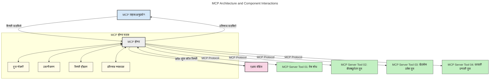
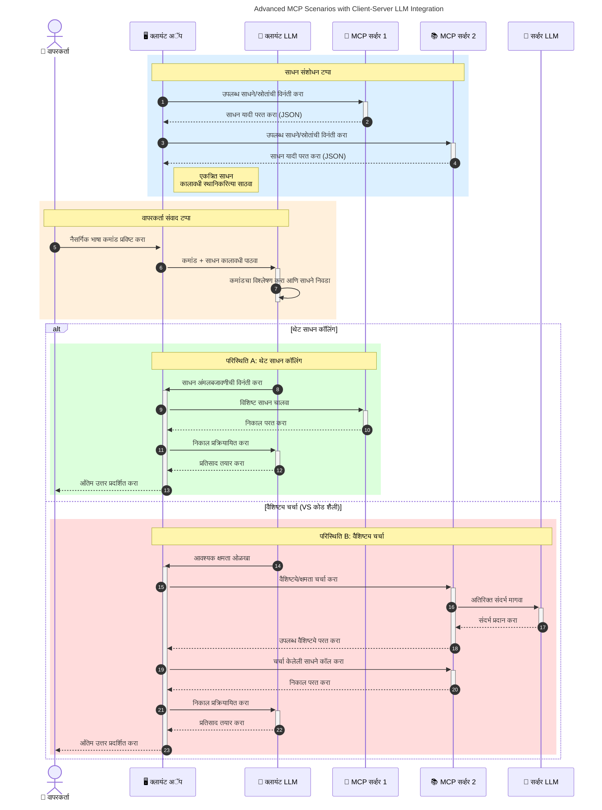

# मॉडेल संदर्भ प्रोटोकॉल (MCP) परिचय: स्केलेबल AI अनुप्रयोगांसाठी हे का महत्त्वाचे आहे

[](https://youtu.be/agBbdiOPLQA)

_(वरील प्रतिमेवर क्लिक करून या धड्याचा व्हिडिओ पाहा)_

जनरेटिव्ह AI अनुप्रयोग हे एक मोठे पाऊल आहे कारण ते वापरकर्त्याला नॅचरल लँग्वेज प्रॉम्प्ट्स वापरून अ‍ॅपशी संवाद साधण्याची संधी देतात. मात्र, जेव्हा आपण अशा अनुप्रयोगात अधिक वेळ आणि संसाधने गुंतवता, तेव्हा आपल्याला असे सुनिश्चित करायचे असते की आपण सहजपणे कार्यक्षमता आणि संसाधने अशा प्रकारे एकत्र करू शकता की ते वाढवणे सोपे आहे, आपले अ‍ॅप अनेक मॉडेल वापरल्यास त्यांची योग्य समज आणि व्यवस्थापन करू शकते. थोडक्यात, जन AI अ‍ॅप्स तयार करणे सुरुवातीला सोपे असते, पण ती वाढत आणि जटिल होत गेल्यानंतर आपल्याला आर्किटेक्चर निश्चित करावे लागते आणि बहुधा एक मानक अवलंबावे लागते जेणेकरून आपले अ‍ॅप सुसंगत पद्धतीने तयार होईल. हेच MCP येत्या वेळेस वस्तूंची व्यवस्था करण्यासाठी आणि मानक पुरवण्यासाठी आहे.

---

## **🔍 मॉडेल संदर्भ प्रोटोकॉल (MCP) म्हणजे काय?**

**मॉडेल संदर्भ प्रोटोकॉल (MCP)** हे एक **खुलं, प्रमाणित इंटरफेस** आहे जे लार्ज लँग्वेज मॉडेल्स (LLMs) ला बाह्य साधने, API, आणि डेटा स्रोतांशी सुसंगत संवाद साधण्याची परवानगी देते. हे AI मॉडेलच्या प्रशिक्षण डेटाच्या पलीकडे कार्यक्षमता वाढवण्यासाठी एकसंध आर्किटेक्चर पुरवते, जे स्मार्ट, स्केलेबल, आणि प्रतिसादक्षम AI सिस्टम तयार करते.

---

## **🎯 AI मध्ये मानकीकरण का महत्त्वाचे आहे**

जनरेटिव्ह AI अनुप्रयोग अधिक जटिल होत असतानाच, स्केलेबिलिटी, विस्तारयोग्यते, देखभाली योग्यता, आणि विक्रेता लॉक-इन टाळण्यासाठी मानके अवलंबणे आवश्यक आहे. MCP या गरजा पूर्ण करते:

- मॉडेल-साधन एकत्रिकरण एकसंध करणे
- तूटलेले, एकदाच वापरले जाणारे सानुकूल उपाय कमी करणे
- विविध विक्रेत्यांकडून येणारे अनेक मॉडेल एका प्रणालीमध्ये वापरण्याची परवानगी देणे

**टीप:** MCP स्वतःला एक खुला मानक मानतो, परंतु IEEE, IETF, W3C, ISO किंवा इतर कुठल्याही मानक संस्थांद्वारे MCP चा मानकीकरण करण्याचा कोणताही योजना नाही.

---

## **📚 शिकण्याचे उद्दिष्टे**

या लेखाच्या शेवटी, आपण सक्षम असाल:

- **मॉडेल संदर्भ प्रोटोकॉल (MCP)** आणि त्याचे वापर प्रकरणे समजावून घेणे
- कसे MCP मॉडेल-ते-टूल संवादाचे मानकीकरण करते हे समजून घेणे
- MCP आर्किटेक्चरचे मुख्य घटक ओळखणे
- उद्योजकीय आणि विकास संदर्भातील MCP च्या वास्तविक-अर्थातील उपयोगांचा अभ्यास करणे

---

## **💡 मॉडेल संदर्भ प्रोटोकॉल (MCP) म्हणजे एक गेम-चेंजर का आहे**

### **🔗 MCP AI संवादांमधील विभागणी सोडवते**

MCP आधी, मॉडेल्ससह साधने एकत्र करण्यासाठी आवश्यक होते:

- प्रत्येक साधन-मॉडेल जोड्याकरिता सानुकूल कोड
- प्रत्येक विक्रेत्यासाठी गैर-मानक API
- अपडेट्समुळे वारंवार तुटणे
- अधिक साधनांसह कमी स्केलेबिलिटी

### **✅ MCP मानकीकरणाचे फायदे**

| **फायदा**               | **वर्णन**                                                                  |
|-------------------------|----------------------------------------------------------------------------|
| इंटरऑपरेबिलिटी         | LLMs विविध विक्रेत्यांकडील साधनांसह सुरळीत काम करतात                    |
| सुसंगतता               | प्लॅटफॉर्म आणि साधनांत एकसंध वर्तन                                     |
| पुनर्वापरयोग्यता         | एकदा तयार केलेली साधने प्रकल्पांमध्ये आणि सिस्टममध्ये पुन्हा वापरता येतात |
| वेगवान विकास           | प्रमाणित, प्लग-अँड-प्ले इंटरफेसचा वापर करून विकास वेळ कमी करणे              |

---

## **🧱 MCP आर्किटेक्चरचे उच्च-स्तरीय अवलोकन**

MCP एक **क्लायंट-सर्व्हर मॉडेल** वापरते, जिथे:

- **MCP होस्ट** AI मॉडेल चालवतात
- **MCP क्लायंट** विनंत्या सुरू करतात
- **MCP सर्व्हर** संदर्भ, साधने, आणि क्षमता पुरवतात

### **मुख्य घटक:**

- **संसाधने** – मॉडेलसाठी स्थिर किंवा गतिशील डेटा  
- **प्रॉम्प्ट्स** – मार्गदर्शित जनरेशनसाठी पूर्वनिर्धारित वर्कफ्लोज  
- **साधने** – शोध, गणना यांसारखे अमलात आणण्याजोगे फंक्शन्स  
- **सॅंपलिंग** – पुनरावृत्ती संवादाद्वारे एजंटिक वर्तन (`2026-07-28` रिलीझ कँडिडेटमध्ये बंद)  
- **एलिसिटेशन** – सर्व्हर-प्रेरित वापरकर्ता इनपुटसाठी विनंत्या
- **रूट्स** – सर्व्हर प्रवेश नियंत्रणासाठी फाइलसिस्टम मर्यादा (`2026-07-28` रिलीझ कँडिडेटमध्ये बंद)

### **प्रोटोकॉल आर्किटेक्चर:**

MCP दोन स्तरांचा आर्किटेक्चर वापरते:
- **डेटा स्तर**: JSON-RPC 2.0 आधारित संवाद जीवनचक्र व्यवस्थापन आणि प्राथमिकेसह
- **ट्रान्सपोर्ट स्तर**: STDIO (स्थानिक) आणि स्ट्रीमबल HTTP SSE (रिमोट) संवाद चॅनेलसह

---

## MCP सर्व्हर कसे काम करतात

MCP सर्व्हर खालीलप्रमाणे कार्य करतात:

- **विनंती प्रवाह**:
    1. एखादी विनंती अंतिम वापरकर्ता किंवा त्याच्या वतीने सॉफ्टवेअरद्वारे सुरु केली जाते.
    2. **MCP क्लायंट** ही विनंती एक **MCP होस्ट** कडे पाठवतो, जो AI मॉडेल रनटाइम व्यवस्थापित करतो.
    3. **AI मॉडेल** वापरकर्ता प्रॉम्प्ट प्राप्त करते आणि साधने किंवा डेटा वापरण्यासाठी एक किंवा अधिक साधन कॉल्स मागू शकते.
    4. **MCP होस्ट**, थेट मॉडेल नव्हे, योग्य **MCP सर्व्हर(स)** शी प्रमाणित प्रोटोकॉल वापरून संवाद साधतो.
- **MCP होस्ट कार्यक्षमता**:
    - **साधन नोंदणी**: उपलब्ध साधने आणि त्यांच्या क्षमता व्यवस्थापित करते.
    - **प्रमाणिकरण**: साधन प्रवेशासाठी परवानग्या तपासतं.
    - **विनंती हाताळणारा**: मॉडेलकडून येणाऱ्या साधन विनंत्या प्रक्रिया करतो.
    - **प्रतिक्रिया स्वरूपक**: साधन आउटपुट्स मॉडेल समजू शकणाऱ्या स्वरूपात तयार करतो.
- **MCP सर्व्हर अंमलबजावणी**:
    - **MCP होस्ट** साधन कॉल एका किंवा अधिक **MCP सर्व्हर** कडे पाठवतो, जे विशिष्ट फंक्शन्स जसे की शोध, गणना, डेटाबेस क्वेरी एक्सपोज करतात.
    - **MCP सर्व्हर** आपली कार्ये पार पाडतात आणि परिणाम एकसंध स्वरूपात **MCP होस्ट** कडे परत पाठवतात.
    - **MCP होस्ट** हे निकाल स्वरूपित करून **AI मॉडेल** कडे पाठवतो.
- **प्रतिक्रिया पूर्णता**:
    - **AI मॉडेल** साधन आउटपुट्स अंतिम प्रतिक्रियेत समाविष्ट करते.
    - **MCP होस्ट** ही प्रतिक्रिया परत **MCP क्लायंट** कडे पाठवतो, जो तो अंतिम वापरकर्ता किंवा कॉल करणाऱ्या सॉफ्टवेअर कडे पोहोचवतो.
    



## 👨‍💻 MCP सर्व्हर कसे तयार करावे (उदाहरणांसह)

MCP सर्व्हर LLM क्षमता वाढविण्यासाठी डेटा आणि कार्यक्षमता प्रदान करतात. 

तयार आहात का? येथे वेगवेगळ्या भाषांमध्ये/स्टॅक्समध्ये सोपे MCP सर्व्हर तयार करण्यासाठी SDKs आणि उदाहरणे आहेत:

- **Python SDK**: https://github.com/modelcontextprotocol/python-sdk

- **TypeScript SDK**: https://github.com/modelcontextprotocol/typescript-sdk

- **Java SDK**: https://github.com/modelcontextprotocol/java-sdk

- **C#/.NET SDK**: https://github.com/modelcontextprotocol/csharp-sdk


## 🌍 MCP चे वास्तविक उपयोग प्रकरणे

MCP AI क्षमता विस्तारित करून अनेक अनुप्रयोग सक्षम करते:

| **अ‍ॅप्लिकेशन**                | **वर्णन**                                                                |
|-----------------------------|-------------------------------------------------------------------------|
| उद्योजक डेटा समाकलन        | LLMs ला डेटाबेस, CRM, किंवा अंतर्गत साधनांशी जोडणं                     |
| एजंटिक AI सिस्टम्स          | साधन प्रवेश आणि निर्णय-मेकिंग वर्कफ्लो सह स्वायत्त एजंट सक्षम करणे  |
| बहुमाध्यमीय अ‍ॅप्लिकेशन्स  | मल्टीमोडल टूल्स (टेक्स्ट, इमेज, ऑडिओ) एकत्र करुन AI अ‍ॅप तयार करणे    |
| रिअल-टाइम डेटा समाकलन      | AI संवादांमध्ये लाइव्ह डेटा आणून अधिक अचूक आणि सध्याचे आउटपुट्स देणे |


### 🧠 MCP = AI संवादांसाठी सार्वत्रिक मानक

मॉडेल संदर्भ प्रोटोकॉल (MCP) हे AI संवादांसाठी एक सार्वत्रिक मानक म्हणून कार्य करते, जसे USB-C हे उपकरणांसाठी भौतिक कनेक्शनचे मानकीकरण करते. AI च्या दुनियेत, MCP एकसंध इंटरफेस पुरवते, ज्यामुळे मॉडेल (क्लायंट्स) सहजपणे बाह्य साधने आणि डेटा पुरवठादार (सर्व्हर्स) सह एकत्र काम करू शकतात. यामुळे प्रत्येक API किंवा डेटा स्रोतासाठी वेगवेगळ्या, सानुकूल प्रोटोकॉलची गरज नाहीशी होते.

MCP अंतर्गत, MCP-सुसंगत साधन (जे MCP सर्व्हर म्हणून संबोधले जाते) एकसंध मानक पाळते. हे सर्व्हर त्यांची ऑफर केलेली साधने किंवा क्रिया सूचीबद्ध करू शकतात आणि विनंती केल्यावर त्या क्रिया पार पाडू शकतात. MCP समर्थन करणाऱ्या AI एजंट प्लॅटफॉर्मना सर्व्हर कडून उपलब्ध साधने शोधणे आणि ही साधने या मानक प्रोटोकॉल द्वारे वापरणे शक्य आहे.

### 💡 ज्ञान प्रवेश सुलभ करते

साधने देण्याबरोबरच, MCP ज्ञानावर प्रवेश सुलभ करते. हे अनुप्रयोगांना लार्ज लँग्वेज मॉडेल्स (LLMs) साठी संदर्भ पुरवू देते ज्याद्वारे ते विविध डेटा स्रोतांशी जोडले जातात. उदाहरणार्थ, एक MCP सर्व्हर कंपनीच्या दस्तऐवज संग्रहाचे प्रतिनिधित्व करू शकतो, ज्यामुळे एजंट आवश्यक माहिती मागवू शकतात. दुसरा सर्व्हर विशिष्ट क्रिया जसे की ईमेल पाठवणे किंवा नोंदी अपडेट करणे यासाठी वापरला जाऊ शकतो. एजंटच्या दृष्टीने, ही साधने वापरण्यासाठी आहेत—काही साधने डेटा (ज्ञान संदर्भ) परत करतात, तर काही क्रिया पार पाडतात. MCP हे दोन्ही कार्यप्रणाली प्रभावीपणे सांभाळते.

एक एजंट जेव्हा MCP सर्व्हरशी जोडतो, तेव्हा तो सर्व्हरच्या उपलब्ध क्षमता आणि प्रवेशयोग्य डेटा ओळखतो अस्थायीएन एक मानक स्वरूपात. हे मानकीकरण डायनॅमिक साधन उपलब्धता सक्षम करते. उदाहरणार्थ, एजंटच्या प्रणाल्यामध्ये नवीन MCP सर्व्हर जोडल्यावर त्याच्या कार्यांची त्वरित उपलब्धता होते, ज्याला एजंटच्या सूचनांमध्ये अतिरिक्त सानुकूलनाची गरज नाही.

हा सुलभ एकत्रीकरण खालील आकृतीत पाहिल्याप्रमाणे आहे, जिथे सर्व्हर दोन्ही साधने आणि ज्ञान पुरवतात, प्रणालींमधील निर्बाध सहकार्य सुनिश्चित करते. 

### 👉 उदाहरण: स्केलेबल एजंट सोल्यूशन

```mermaid
---
title: Scalable Agent Solution with MCP
description: A diagram illustrating how a user interacts with an LLM that connects to multiple MCP servers, with each server providing both knowledge and tools, creating a scalable AI system architecture
---
graph TD
    User -->|सूचक| LLM
    LLM -->|उत्तर| User
    LLM -->|MCP| ServerA
    LLM -->|MCP| ServerB
    ServerA -->|सार्वत्रिक कनेक्टर| ServerB
    ServerA --> KnowledgeA
    ServerA --> ToolsA
    ServerB --> KnowledgeB
    ServerB --> ToolsB

    subgraph सर्व्हर A
        KnowledgeA[ज्ञान]
        ToolsA[साधने]
    end

    subgraph सर्व्हर B
        KnowledgeB[ज्ञान]
        ToolsB[साधने]
    end
```
युनिव्हर्सल कनेक्टरने MCP सर्व्हरांना परस्पर संवाद साधणे आणि क्षमता सामायिक करण्यास सक्षम केले, ज्यामुळे ServerA, ServerB कडे कार्ये डेलीगेट करू शकतो किंवा त्याच्या साधनांना आणि ज्ञानाला प्रवेश करू शकतो. हे सर्व्हरमधील साधन आणि डेटा फेडरेशन करते, ज्यामुळे स्केलेबल आणि मॉड्यूलर एजंट आर्किटेक्चर समर्थित असतात. MCP साधने प्रकट करण्यास मानकीकरण करते, त्यामुळे एजंट सहजपणे साधने शोधू शकतो आणि कोणत्याही हार्डकोडेड इंटिग्रेशनशिवाय विनंत्या मार्गदर्शित करू शकतो.


साधने आणि ज्ञान फेडरेशन: साधने आणि डेटा सर्व्हरमधून प्रवेशयोग्य होऊ शकतात, ज्यामुळे अधिक स्केलेबल आणि मॉड्यूलर एजंटिक आर्किटेक्चर सक्षम होते.

### 🔄 क्लायंट-साइड LLM इंटिग्रेशनसह प्रगत MCP योजना

मूलभूत MCP आर्किटेक्चरच्या पुढे, काही प्रगत योजना आहेत जिथे दोन्ही क्लायंट आणि सर्व्हरमध्ये LLM असतात, ज्यामुळे अधिक सूक्ष्म संवाद संभवतात. खालील आकृतीमध्ये, **क्लायंट अ‍ॅप** हा IDE असू शकतो ज्यात LLM वापरासाठी अनेक MCP साधने उपलब्ध आहेत:



## 🔐 MCP चे व्यावहारिक फायदे

MCP वापरण्याचे व्यावहारिक फायदे येथे आहेत:

- **ताजेपणा**: मॉडेल त्यांच्या प्रशिक्षण डेटाच्या पलीकडे अद्ययावत माहिती मिळवू शकतात
- **क्षमता विस्तार**: मॉडेल ते कामे करू शकतात ज्यासाठी त्यांना प्रशिक्षित केले गेले नव्हते, विशेष साधने वापरून
- **कमी भ्रम निर्माण होणे**: बाह्य डेटा स्रोत वास्तवज्ञान पुरवतात
- **गोपनीयता**: संवेदनशील डेटा सुरक्षा पर्यावरणात राहू शकतो, प्रॉम्प्टमध्ये समाविष्ट होण्याऐवजी

## 📌 मुख्य मुद्दे

MCP वापरण्याचे मुख्य मुद्दे येथे आहेत:

- **MCP** AI मॉडेल्सना साधने आणि डेटाशी संवाद कसा साधायचा हे मानकीकृत करते
- विस्तारयोग्यता, सुसंगतता आणि इंटरऑपरेबिलिटीला प्रोत्साहन देते
- विकासाचा वेळ कमी करण्यास, विश्वासार्हता सुधारण्यास आणि मॉडेल क्षमतांचा विस्तार करण्यास मदत करते
- क्लायंट-सर्व्हर आर्किटेक्चर लवचिक, विस्तारयोग्य AI अनुप्रयोग सक्षम करते

## 🧠 व्यायाम

आपल्याला ज्या AI अनुप्रयोगामध्ये स्वारस्य आहे त्याबद्दल विचार करा.

- कोणती **बाह्य साधने किंवा डेटा** त्याच्या क्षमतांना वाढवू शकतात?
- MCP एकत्रीकरण कसे **सुलभ आणि अधिक विश्वसनीय** करू शकतो?

## अतिरिक्त संसाधने

- [MCP GitHub Repository](https://github.com/modelcontextprotocol)


## पुढे काय

पुढे: [अध्याय 1: मुख्य संकल्पना](../01-CoreConcepts/README.md)

---

<!-- CO-OP TRANSLATOR DISCLAIMER START -->
**अस्वीकरण**:
हा दस्तऐवज AI भाषांतर सेवा [Co-op Translator](https://github.com/Azure/co-op-translator) चा वापर करून अनुवादित केला आहे. जरी आम्ही अचूकतेसाठी प्रयत्न करतो, तरी कृपया लक्षात घ्या की स्वयंचलित भाषांतरांमध्ये त्रुटी किंवा अचूकतेची कमतरता असू शकते. मूळ दस्तऐवज त्याच्या मूळ भाषेत अधिकृत स्रोत मानला पाहिजे. महत्त्वाची माहिती असल्यास, व्यावसायिक मानवी भाषांतराची शिफारस केली जाते. या भाषांतराच्या वापरामुळे उद्भवणाऱ्या कोणत्याही गैरसमज किंवा चुकीच्या अर्थलावणीसाठी आम्ही जबाबदार नाही.
<!-- CO-OP TRANSLATOR DISCLAIMER END -->