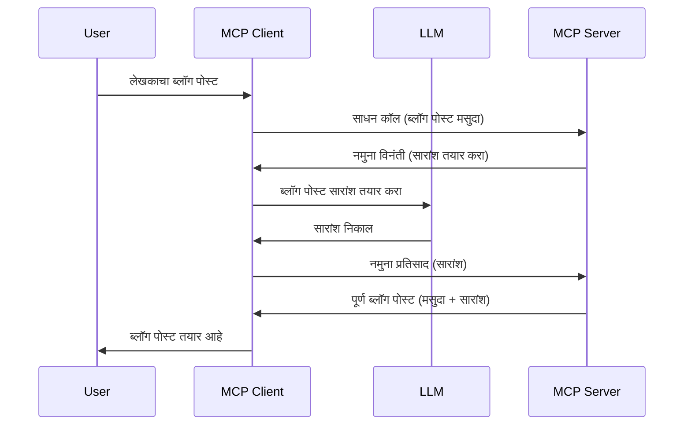

> [अप्रियायोजित: 2026-07-28 प्रकाशन उमेदवार](https://blog.modelcontextprotocol.io/posts/2026-07-28-release-candidate/)

# सॅम्पलिंग - क्लायंटसाठी वैशिष्ट्ये डिलिगेट करा

> **अप्रियायोजन सूचना:** `2026-07-28` MCP तपशीलिका प्रकाशन उमेदवार सॅम्पलिंग ला अप्रियायोजित म्हणून चिन्हांकित करतो आणि LLM प्रदाता API सोबत थेट एकत्रिकरणाच्या बाजूने समर्थन करतो. सॅम्पलिंग `2025-11-25` मध्ये आणि कोणत्याही औपचारिक अप्रियायोजनानंतर किमान एका वर्षासाठी कार्यरत राहते, म्हणून या धड्यातील सर्व काही वैध आहे — परंतु नवीन सर्व्हर डिझाईनने बदललेल्या नमुन्याचा आढावा घ्यावा. पहा [MCP मध्ये काय बदलत आहे: 2026-07-28 प्रकाशन उमेदवार](../../01-CoreConcepts/mcp-2026-07-28-release-candidate.md).

कधी कधी, तुम्हाला MCP क्लायंट आणि MCP सर्व्हर यांना एकत्र काम करावे लागते सामान्य उद्दिष्ट साध्य करण्यासाठी. तुमच्याकडे असा एक प्रकरण असू शकते जिथे सर्व्हरला क्लायंटवर असलेल्या LLM ची मदत हवी असते. अशा परिस्थितीत, सॅम्पलिंग वापरणे योग्य आहे.

चला काही उपयोग प्रकरणांचा अभ्यास करू आणि सॅम्पलिंगचा समावेश असलेली उपाययोजना कशी तयार करायची ते पाहू.

## आढावा

या धड्यात, आपण सॅम्पलिंग कधी आणि कुठे वापरावे यावर लक्ष केंद्रित करू तसेच त्याचे कॉन्फिगर करणे कसे करायचे ते समजून घेऊ.

## शिकण्याच्या उद्दिष्टे

या अध्यायात, आम्ही:

- सॅम्पलिंग काय आहे आणि ते कधी वापरायचे ते समजावून सांगू.
- MCP मध्ये सॅम्पलिंग कसे कॉन्फिगर करायचे ते दाखवू.
- सॅम्पलिंग प्रत्यक्षात कसे काम करते याची उदाहरणे प्रदान करू.

## सॅम्पलिंग काय आहे आणि का वापरावे?

सॅम्पलिंग ही एक प्रगत वैशिष्ट्य आहे जी पुढीलप्रमाणे कार्य करते:



### सॅम्पलिंग विनंती

ठीक आहे, आता आपल्याकडे एक विश्वासार्ह संदर्भाचा उच्चस्तरीय आढावा आहे, चला सॅम्पलिंग विनंतीबाबत बोलू ज्याचे सर्व्हर क्लायंटकडे परत पाठवते. अशा विनंतीचा JSON-RPC स्वरूपात कसा दिसतो ते येथे आहे:

```json
{
  "jsonrpc": "2.0",
  "id": 1,
  "method": "sampling/createMessage",
  "params": {
    "messages": [
      {
        "role": "user",
        "content": {
          "type": "text",
          "text": "Create a blog post summary of the following blog post: <BLOG POST>"
        }
      }
    ],
    "modelPreferences": {
      "hints": [
        {
          "name": "claude-3-sonnet"
        }
      ],
      "intelligencePriority": 0.8,
      "speedPriority": 0.5
    },
    "systemPrompt": "You are a helpful assistant.",
    "maxTokens": 100
  }
}
```

येथे काही गोष्टी महत्त्वाच्या आहेत:

- कंटेंट अंतर्गत -> टेक्स्ट मध्ये असलेला प्रॉम्प्ट, हा आमचा प्रॉम्प्ट आहे जो LLM ला ब्लॉग पोस्ट सामग्रीचे सारांश देण्यासाठी सूचना देतो.

- **modelPreferences**. हा विभाग फक्त एक प्राधान्य आहे, LLM सोबत कोणती कॉन्फिगरेशन वापरावी याचा शिफारस करणारा भाग. वापरकर्ता या शिफारशींसह जाणे किंवा त्यात बदल करणे निवडू शकतो. या प्रकरणात वापरायच्या मॉडेल आणि गती व बुद्धिमत्तेची प्राधान्ये दिलेली आहेत.
- **systemPrompt**, हा तुमचा सामान्य सिस्टम प्रॉम्प्ट आहे जो तुमच्या LLM ला व्यक्तिमत्व देतो आणि मार्गदर्शन सूचना समाविष्ट करतो.
- **maxTokens**, हा दुसरा गुणधर्म आहे जो सांगतो की या कामासाठी किती टोकन्स वापरणे शिफारसीय आहे.

### सॅम्पलिंग प्रतिसाद

हा प्रतिसाद म्हणजे MCP क्लायंटने MCP सर्व्हरला परत पाठवलेला परिणाम आहे ज्यात क्लायंटने LLM ला कॉल करून त्याची उत्तर प्राप्त केली आणि नंतर हा संदेश तयार केला. JSON-RPC मध्ये ते कसे दिसू शकते ते येथे आहे:

```json
{
  "jsonrpc": "2.0",
  "id": 1,
  "result": {
    "role": "assistant",
    "content": {
      "type": "text",
      "text": "Here's your abstract <ABSTRACT>"
    },
    "model": "gpt-5",
    "stopReason": "endTurn"
  }
}
```

लक्षात घ्या की प्रतिसाद ब्लॉग पोस्टचा सारांश आहे जसे आपण मागणी केली होती. तसेच लक्षात घ्या की वापरलेले `model` हा आपल्याला मागितलेला "claude-3-sonnet" नाही, तर "gpt-5" आहे. हे दर्शविण्यासाठी की वापरकर्ता काय वापरायचे ते बदलू शकतो आणि तुमची सॅम्पलिंग विनंती ही शिफारस आहे.

ठीक आहे, आता आपण मुख्य प्रवाह समजला आहे, आणि उपयुक्त कामासाठी "ब्लॉग पोस्ट निर्मिती + सारांश" वापरण्यासाठी, चला पाहू काय करावयाचे आहे ते कार्यान्वित करण्यासाठी.

### संदेश प्रकार

सॅम्पलिंग संदेश फक्त टेक्स्टपुरते मर्यादित नाहीत परंतु तुम्ही प्रतिमा आणि ऑडिओ देखील पाठवू शकता. JSON-RPC कसे वेगळे दिसते ते येथे आहे:

**टेक्स्ट**

```json
{
  "type": "text",
  "text": "The message content"
}
```

**प्रतिमा सामग्री**

```json
{
  "type": "image",
  "data": "base64-encoded-image-data",
  "mimeType": "image/jpeg"
}
```

**ऑडिओ सामग्री**

```json
{
  "type": "audio",
  "data": "base64-encoded-audio-data",
  "mimeType": "audio/wav"
}
```

> नोट: सॅम्पलिंगवर अधिक तपशीलवार माहिती साठी, [अधिकृत दस्तऐवज](https://modelcontextprotocol.io/specification/2025-11-25/client/sampling) पहा

## क्लायंटमध्ये सॅम्पलिंग कसे कॉन्फिगर करावे

> टिप: जर तुम्ही फक्त सर्व्हर तयार करत असाल, तर तुम्हाला येथे बहुतांश काही करण्याची गरज नाही.

क्लायंटमध्ये, तुम्हाला खालील वैशिष्ट्ये अशी निर्दिष्ट करावी लागतात:

```json
{
  "capabilities": {
    "sampling": {}
  }
}
```

यानंतर तुमच्या निवडलेल्या क्लायंटने सर्व्हरशी प्रारंभ केल्यावर हे घेतले जाईल.

## प्रत्यक्षात सॅम्पलिंगचे उदाहरण - ब्लॉग पोस्ट तयार करा

चला एकत्रितपणे सॅम्पलिंग सर्व्हर कोड करू, आपल्याला खालील करणे आवश्यक आहे:

1. सर्व्हरवर एक टूल तयार करा.
1. त्या टूलने सॅम्पलिंग विनंती तयार करावी.
1. टूलने क्लायंटच्या सॅम्पलिंग विनंतीच्या उत्तरासाठी वाट पाहावी.
1. नंतर टूलचे निकाल तयार करावे.

चरणानुसार कोड पाहू:

### -1- टूल तयार करा

**python**

```python
@mcp.tool()
async def create_blog(title: str, content: str, ctx: Context[ServerSession, None]) -> str:
    """Create a blog post and generate a summary"""

```

### -2- सॅम्पलिंग विनंती तयार करा

तुमच्या टूलमध्ये पुढील कोड जोडा:

**python**

```python
post = BlogPost(
        id=len(posts) + 1,
        title=title,
        content=content,
        abstract=""
    )

prompt = f"Create an abstract of the following blog post: title: {title} and draft: {content} "

result = await ctx.session.create_message(
        messages=[
            SamplingMessage(
                role="user",
                content=TextContent(type="text", text=prompt),
            )
        ],
        max_tokens=100,
)

```

### -3- प्रतिसादासाठी वाट पाहा आणि प्रतिसाद परत करा

**python**

```python
post.abstract = result.content.text

posts.append(post)

# पूर्ण उत्पादन परत करा
return json.dumps({
    "id": post.title,
    "abstract": post.abstract
})
```

### -4- पूर्ण कोड

**python**

```python
from starlette.applications import Starlette
from starlette.routing import Mount, Host

from mcp.server.fastmcp import Context, FastMCP

from mcp.server.session import ServerSession
from mcp.types import SamplingMessage, TextContent

import json


from uuid import uuid4
from typing import List
from pydantic import BaseModel


mcp = FastMCP("Blog post generator")

# app = FastAPI()

posts = []

class BlogPost(BaseModel):
    id: int
    title: str
    content: str
    abstract: str

posts: List[BlogPost] = []

@mcp.tool()
async def create_blog(title: str, content: str, ctx: Context[ServerSession, None]) -> str:
    """Create a blog post and generate a summary"""

    post = BlogPost(
        id=len(posts) + 1,
        title=title,
        content=content,
        abstract=""
    )

    prompt = f"Create an abstract of the following blog post: title: {title} and draft: {content} "

    result = await ctx.session.create_message(
        messages=[
            SamplingMessage(
                role="user",
                content=TextContent(type="text", text=prompt),
            )
        ],
        max_tokens=100,
    )

    post.abstract = result.content.text

    posts.append(post)

    # पूर्ण ब्लॉग पोस्ट परत करा
    return json.dumps({
        "id": post.title,
        "abstract": post.abstract
    })

if __name__ == "__main__":
    print("Starting server...")
    # mcp.run()
    mcp.run(transport="streamable-http")

# रन app सह: python server.py
```

### -5- Visual Studio Code मध्ये तपासणी

Visual Studio Code मध्ये हे तपासण्यासाठी, खालील करा:

1. टर्मिनलमध्ये सर्व्हर चालवा
1. ते *mcp.json* मध्ये जोडा (आणि ते सुरू आहे याची खात्री करा) जसे खालीलप्रमाणे काहीतरी:

   ```json
   "servers": {
      "blog-server": {
        "type": "http",
        "url": "http://localhost:8000/mcp"
      }
   }
   ```

1. एक प्रॉम्प्ट टाइप करा:

   ```text
   create a blog post named "Where Python comes from", the content is "Python is actually named after Monty Python Flying Circus"
   ```

1. सॅम्पलिंग होऊ द्या. पहिली वेळ तुम्ही हे तपासता तेव्हा अतिरिक्त डायलॉग दिसेल ज्याला तुम्हाला मान्यता द्यावी लागेल, नंतर सामान्य डायलॉग दिसेल जे तुम्हाला टूल चालवायला विचारेल.

1. निकाल तपासा. तुम्हाला निकाल GitHub Copilot Chat मध्ये छान रेंडर रूपात दिसेल तसेच तुम्ही कच्चा JSON प्रतिसाद देखील तपासू शकता.

**बोनस**. Visual Studio Code मध्ये सॅम्पलिंगसाठी उत्कृष्ट समर्थन आहे. तुम्ही तुमच्या स्थापित सर्व्हरवर सॅम्पलिंग प्रवेश कॉन्फिगर करू शकता असे:

1. विस्तार विभागात जा.
1. "MCP SERVERS - INSTALLED" विभागात तुमच्या स्थापित सर्व्हरसाठी कॉग चिन्ह निवडा.
1. "Configure Model Access" निवडा, येथे तुम्ही GitHub Copilot ला कोणत्या मॉडेल वापरायचे हे निवडू शकता जेव्हा ते सॅम्पलिंग करत असते. तुम्ही अलीकडील सॅम्पलिंग विनंत्याही "Show Sampling requests" निवडून पाहू शकता.

## असाइनमेंट

या असाइनमेंटमध्ये, तुम्ही थोडे वेगळे सॅम्पलिंग तयार कराल म्हणजेच एक सॅम्पलिंग एकत्रिकरण जे उत्पादन वर्णन तयार करण्यात मदत करते. तुमचा संदर्भ असा आहे:

**परिस्थिती**: ई-कॉमर्स मध्ये बॅक ऑफिस कामगारांना मदत हवी आहे, उत्पादन वर्णने तयार करण्यात खूप वेळ जातो. म्हणून, तुम्हाला एक उपाय विकसित करायचा आहे जिथे तुम्ही "create_product" नावाचे टूल कॉल करू शकता ज्याला "title" आणि "keywords" हा आर्ग्युमेंट म्हणून दिला जातो आणि ते एक पूर्ण उत्पादन तयार करेल ज्यात "description" फील्ड असावी जी क्लायंटच्या LLM ने भरली जाईल.

टीप: यापूर्वी शिकलेले वापरून हा सर्व्हर आणि त्याचे टूल सॅम्पलिंग विनंती वापरून तयार करा.

## उपाय

[उपाय](./solution/README.md)

## मुख्य मुद्दे

सॅम्पलिंग एक शक्तिशाली वैशिष्ट्य आहे जे सर्व्हरला तेव्हा क्लायंटकडे कामे डिलिगेट करण्याची परवानगी देते जेव्हा त्याला LLM ची मदत हवी असते.

## पुढे काय

- [अध्याय 4 - व्यावहारिक अंमलबजावणी](../../04-PracticalImplementation/README.md)

---

<!-- CO-OP TRANSLATOR DISCLAIMER START -->
**अस्वीकरण**:
हा दस्तऐवज AI भाषांतर सेवा [Co-op Translator](https://github.com/Azure/co-op-translator) चा वापर करून अनुवादित केला आहे. जरी आम्ही अचूकतेसाठी प्रयत्न करतो, तरी कृपया लक्षात घ्या की स्वयंचलित भाषांतरांमध्ये त्रुटी किंवा अचूकतेची कमतरता असू शकते. मूळ दस्तऐवज त्याच्या मूळ भाषेत अधिकृत स्रोत मानला पाहिजे. महत्त्वाची माहिती असल्यास, व्यावसायिक मानवी भाषांतराची शिफारस केली जाते. या भाषांतराच्या वापरामुळे उद्भवणाऱ्या कोणत्याही गैरसमज किंवा चुकीच्या अर्थलावणीसाठी आम्ही जबाबदार नाही.
<!-- CO-OP TRANSLATOR DISCLAIMER END -->