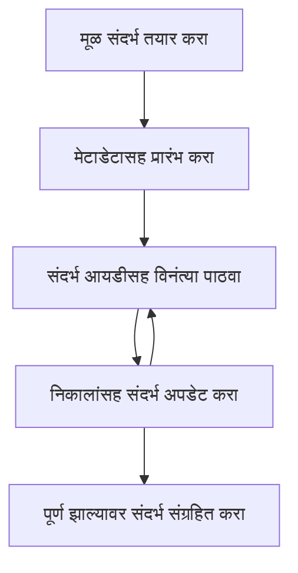

> [अप्रचलित: 2026-07-28 प्रकाशन उमेदवार](https://blog.modelcontextprotocol.io/posts/2026-07-28-release-candidate/#roots-sampling-and-logging-are-deprecated)

# MCP रूट संदर्भ

> **अप्रचलित सूचना:** `2026-07-28` MCP विनिर्देशन प्रकाशन उमेदवार रूट्सना अप्रचलित म्हणून मार्क करतो, टूल पॅरामीटर्स, संसाधन URI किंवा सर्व्हर कॉन्फिगरेशनच्या बाजूने. रूट्स `2025-11-25` मध्ये कार्यरत राहतात आणि कोणत्याही औपचारिक अप्रचलनानंतर कमीत कमी एका वर्षासाठी चालू राहतात, त्यामुळे या धड्यातील सर्वकाही वैध राहील - पण नवीन सर्व्हर डिझाईन्सने पर्यायी नमुन्याचा आढावा घ्यावा. पहा [MCP मध्ये काय बदल होत आहे: 2026-07-28 प्रकाशन उमेदवार](../../01-CoreConcepts/mcp-2026-07-28-release-candidate.md).

रूट संदर्भ हे मॉडेल संदर्भ प्रोटोकॉलमधील एक मूलभूत संकल्पना आहेत जे संभाषणाचा इतिहास आणि सामायिक स्थिती अनेक विनंत्या आणि सत्रांमध्ये जतन करण्यासाठी एक कायमस्वरूपी थर प्रदान करतात.

## परिचय

या धड्यात, आपण MCP मध्ये रूट संदर्भ कसे तयार करायचे, व्यवस्थापित करायचे आणि वापरायचे ते पाहणार आहोत.

## शिकण्याचे उद्दिष्टे

या धड्याच्या शेवटी, तुम्ही सक्षम असाल:

- रूट संदर्भांचे हेतू आणि संरचना समजून घेणे
- MCP क्लायंट लायब्ररी वापरून रूट संदर्भ तयार करणे आणि व्यवस्थापित करणे
- .NET, Java, JavaScript आणि Python अनुप्रयोगांमध्ये रूट संदर्भ लागू करणे
- बहु-टर्न संभाषणे आणि स्थिती व्यवस्थापनासाठी रूट संदर्भांचा वापर करणे
- रूट संदर्भ व्यवस्थापनासाठी सर्वोत्तम पद्धती अमलात आणणे

## रूट संदर्भ समजून घेणे

रूट संदर्भ हे कंटेनर म्हणून कार्य करतात जे संबंधित संवादांची इतिहास आणि स्थिती टिकवून ठेवतात. ते सक्षम करतात:

- **संभाषण टिकाव:** सुसंगत बहु-टर्न संभाषणे टिकवून ठेवणे
- **स्मृती व्यवस्थापन:** संवादांदरम्यान माहिती संग्रहित आणि पुनःप्राप्त करणे
- **स्थिती व्यवस्थापन:** गुंतागुंतीच्या कार्यप्रवाहांतील प्रगतीवर लक्ष ठेवणे
- **संदर्भ सामायिकरण:** अनेक क्लायंटना समान संभाषण स्थितीमध्ये प्रवेश देणे

MCP मध्ये, रूट संदर्भांची अशी काही मुख्य वैशिष्ट्ये आहेत:

- प्रत्येक रूट संदर्भाचा एक अद्वितीय ओळखपत्र असतो.
- ते संभाषण इतिहास, वापरकर्ता प्राधान्ये आणि इतर मेटाडेटा समाविष्ट करू शकतात.
- ते आवश्यकतेनुसार तयार, प्रवेश आणि संग्रहित केले जाऊ शकतात.
- ते सूक्ष्म प्रवेश नियंत्रण आणि परवानग्या समर्थन करतात.

## रूट संदर्भ जीवनचक्र



## रूट संदर्भांसह काम करणे

येथे रूट संदर्भ कसे तयार करायचे आणि व्यवस्थापित करायचे याचे उदाहरण आहे.

### C# अंमलबजावणी

```csharp
// .NET Example: Root Context Management
using Microsoft.Mcp.Client;
using System;
using System.Threading.Tasks;
using System.Collections.Generic;

public class RootContextExample
{
    private readonly IMcpClient _client;
    private readonly IRootContextManager _contextManager;
    
    public RootContextExample(IMcpClient client, IRootContextManager contextManager)
    {
        _client = client;
        _contextManager = contextManager;
    }
    
    public async Task DemonstrateRootContextAsync()
    {
        // 1. Create a new root context
        var contextResult = await _contextManager.CreateRootContextAsync(new RootContextCreateOptions
        {
            Name = "Customer Support Session",
            Metadata = new Dictionary<string, string>
            {
                ["CustomerName"] = "Acme Corporation",
                ["PriorityLevel"] = "High",
                ["Domain"] = "Cloud Services"
            }
        });
        
        string contextId = contextResult.ContextId;
        Console.WriteLine($"Created root context with ID: {contextId}");
        
        // 2. First interaction using the context
        var response1 = await _client.SendPromptAsync(
            "I'm having issues scaling my web service deployment in the cloud.", 
            new SendPromptOptions { RootContextId = contextId }
        );
        
        Console.WriteLine($"First response: {response1.GeneratedText}");
        
        // Second interaction - the model will have access to the previous conversation
        var response2 = await _client.SendPromptAsync(
            "Yes, we're using containerized deployments with Kubernetes.", 
            new SendPromptOptions { RootContextId = contextId }
        );
        
        Console.WriteLine($"Second response: {response2.GeneratedText}");
        
        // 3. Add metadata to the context based on conversation
        await _contextManager.UpdateContextMetadataAsync(contextId, new Dictionary<string, string>
        {
            ["TechnicalEnvironment"] = "Kubernetes",
            ["IssueType"] = "Scaling"
        });
        
        // 4. Get context information
        var contextInfo = await _contextManager.GetRootContextInfoAsync(contextId);
        
        Console.WriteLine("Context Information:");
        Console.WriteLine($"- Name: {contextInfo.Name}");
        Console.WriteLine($"- Created: {contextInfo.CreatedAt}");
        Console.WriteLine($"- Messages: {contextInfo.MessageCount}");
        
        // 5. When the conversation is complete, archive the context
        await _contextManager.ArchiveRootContextAsync(contextId);
        Console.WriteLine($"Archived context {contextId}");
    }
}
```

वरील कोडमध्ये आपण:

1. ग्राहक समर्थन सत्रासाठी रूट संदर्भ तयार केला आहे.
1. त्या संदर्भात अनेक संदेश पाठविले, ज्यामुळे मॉडेल स्थिती टिकवून ठेवू शकले.
1. संभाषणावर आधारित संबंधित मेटाडेटा सह संदर्भ अद्यतनित केला.
1. संभाषण इतिहास समजण्यासाठी संदर्भ माहिती पुनःप्राप्त केली.
1. संभाषण पूर्ण झाल्यावर संदर्भ संग्रहित केला.

## उदाहरण: वित्तीय विश्लेषणासाठी रूट संदर्भ अंमलबजावणी

या उदाहरणात, आपण वित्तीय विश्लेषण सत्रासाठी रूट संदर्भ तयार करणार आहोत, ज्यामुळे अनेक संवादांमध्ये स्थिती टिकवण्याचे प्रदर्शन होईल.

### Java अंमलबजावणी

```java
// Java उदाहरण: रूट कॉन्टेक्स्ट अंमलबजावणी
package com.example.mcp.contexts;

import com.mcp.client.McpClient;
import com.mcp.client.ContextManager;
import com.mcp.models.RootContext;
import com.mcp.models.McpResponse;

import java.util.HashMap;
import java.util.Map;
import java.util.UUID;

public class RootContextsDemo {
    private final McpClient client;
    private final ContextManager contextManager;
    
    public RootContextsDemo(String serverUrl) {
        this.client = new McpClient.Builder()
            .setServerUrl(serverUrl)
            .build();
            
        this.contextManager = new ContextManager(client);
    }
    
    public void demonstrateRootContext() throws Exception {
        // संदर्भ मेटाडेटा तयार करा
        Map<String, String> metadata = new HashMap<>();
        metadata.put("projectName", "Financial Analysis");
        metadata.put("userRole", "Financial Analyst");
        metadata.put("dataSource", "Q1 2025 Financial Reports");
        
        // 1. नवीन रूट कॉन्टेक्स्ट तयार करा
        RootContext context = contextManager.createRootContext("Financial Analysis Session", metadata);
        String contextId = context.getId();
        
        System.out.println("Created context: " + contextId);
        
        // 2. पहिला संवाद
        McpResponse response1 = client.sendPrompt(
            "Analyze the trends in Q1 financial data for our technology division",
            contextId
        );
        
        System.out.println("First response: " + response1.getGeneratedText());
        
        // 3. प्रतिसादातून मिळालेल्या महत्त्वाच्या माहितीसह संदर्भ अद्यतनित करा
        contextManager.addContextMetadata(contextId, 
            Map.of("identifiedTrend", "Increasing cloud infrastructure costs"));
        
        // दुसरा संवाद - त्याच संदर्भाचा वापर करत
        McpResponse response2 = client.sendPrompt(
            "What's driving the increase in cloud infrastructure costs?",
            contextId
        );
        
        System.out.println("Second response: " + response2.getGeneratedText());
        
        // 4. विश्लेषण सत्राचा सारांश तयार करा
        McpResponse summaryResponse = client.sendPrompt(
            "Summarize our analysis of the technology division financials in 3-5 key points",
            contextId
        );
        
        // सारांश संदर्भ मेटाडेटामध्ये संग्रहित करा
        contextManager.addContextMetadata(contextId, 
            Map.of("analysisSummary", summaryResponse.getGeneratedText()));
            
        // अद्ययावत संदर्भ माहिती मिळवा
        RootContext updatedContext = contextManager.getRootContext(contextId);
        
        System.out.println("Context Information:");
        System.out.println("- Created: " + updatedContext.getCreatedAt());
        System.out.println("- Last Updated: " + updatedContext.getLastUpdatedAt());
        System.out.println("- Analysis Summary: " + 
            updatedContext.getMetadata().get("analysisSummary"));
            
        // 5. पूर्ण झाल्यावर संदर्भ संग्रहित करा
        contextManager.archiveContext(contextId);
        System.out.println("Context archived");
    }
}
```

वरील कोडमध्ये आपण:

1. वित्तीय विश्लेषण सत्रासाठी रूट संदर्भ तयार केला.
2. त्या संदर्भात अनेक संदेश पाठविले, ज्यामुळे मॉडेल स्थिती टिकवू शकले.
3. संभाषणावर आधारित संबंधित मेटाडेटा सह संदर्भ अद्यतनित केला.
4. विश्लेषण सत्राचा सारांश तयार करून तो संदर्भ मेटाडेटामध्ये संग्रहित केला.
5. संभाषण पूर्ण झाल्यावर संदर्भ संग्रहित केला.

## उदाहरण: रूट संदर्भ व्यवस्थापन

संभाषण इतिहास आणि स्थिती टिकविण्यासाठी रूट संदर्भ प्रभावीपणे व्यवस्थापित करणे महत्त्वाचे आहे. खाली रूट संदर्भ व्यवस्थापन कसे अंमलात आणावे याचे उदाहरण दिले आहे.

### JavaScript अंमलबजावणी

```javascript
// JavaScript उदाहरण: MCP मूळ संदर्भ व्यवस्थापन
const { McpClient, RootContextManager } = require('@mcp/client');

class ContextSession {
  constructor(serverUrl, apiKey = null) {
    // MCP क्लायंट सुरू करा
    this.client = new McpClient({
      serverUrl,
      apiKey
    });
    
    // संदर्भ व्यवस्थापक सुरू करा
    this.contextManager = new RootContextManager(this.client);
  }
  
  /**
   * Create a new conversation context
   * @param {string} sessionName - Name of the conversation session
   * @param {Object} metadata - Additional metadata for the context
   * @returns {Promise<string>} - Context ID
   */
  async createConversationContext(sessionName, metadata = {}) {
    try {
      const contextResult = await this.contextManager.createRootContext({
        name: sessionName,
        metadata: {
          ...metadata,
          createdAt: new Date().toISOString(),
          status: 'active'
        }
      });
      
      console.log(`Created root context '${sessionName}' with ID: ${contextResult.id}`);
      return contextResult.id;
    } catch (error) {
      console.error('Error creating root context:', error);
      throw error;
    }
  }
  
  /**
   * Send a message in an existing context
   * @param {string} contextId - The root context ID
   * @param {string} message - The user's message
   * @param {Object} options - Additional options
   * @returns {Promise<Object>} - Response data
   */
  async sendMessage(contextId, message, options = {}) {
    try {
      // दिलेल्या संदर्भाचा वापर करून संदेश पाठवा
      const response = await this.client.sendPrompt(message, {
        rootContextId: contextId,
        temperature: options.temperature || 0.7,
        allowedTools: options.allowedTools || []
      });
      
      // संभाषणातून महत्त्वाचे निरीक्षणे आवश्यक असल्यास संग्रहित करा
      if (options.storeInsights) {
        await this.storeConversationInsights(contextId, message, response.generatedText);
      }
      
      return {
        message: response.generatedText,
        toolCalls: response.toolCalls || [],
        contextId
      };
    } catch (error) {
      console.error(`Error sending message in context ${contextId}:`, error);
      throw error;
    }
  }
  
  /**
   * Store important insights from a conversation
   * @param {string} contextId - The root context ID
   * @param {string} userMessage - User's message
   * @param {string} aiResponse - AI's response
   */
  async storeConversationInsights(contextId, userMessage, aiResponse) {
    try {
      // संभाव्य निरीक्षणे काढा (खऱ्या अॅपमध्ये हे अधिक प्रगत असेल)
      const combinedText = userMessage + "\n" + aiResponse;
      
      // संभाव्य निरीक्षणे ओळखण्यासाठी सोपा नियम
      const insightWords = ["important", "key point", "remember", "significant", "crucial"];
      
      const potentialInsights = combinedText
        .split(".")
        .filter(sentence => 
          insightWords.some(word => sentence.toLowerCase().includes(word))
        )
        .map(sentence => sentence.trim())
        .filter(sentence => sentence.length > 10);
      
      // संदर्भ मेटाडेटामध्ये निरीक्षणे संग्रहित करा
      if (potentialInsights.length > 0) {
        const insights = {};
        potentialInsights.forEach((insight, index) => {
          insights[`insight_${Date.now()}_${index}`] = insight;
        });
        
        await this.contextManager.updateContextMetadata(contextId, insights);
        console.log(`Stored ${potentialInsights.length} insights in context ${contextId}`);
      }
    } catch (error) {
      console.warn('Error storing conversation insights:', error);
      // गैर-गौण त्रुटी, म्हणून फक्त इशारा नोंदवा
    }
  }
  
  /**
   * Get summary information about a context
   * @param {string} contextId - The root context ID
   * @returns {Promise<Object>} - Context information
   */
  async getContextInfo(contextId) {
    try {
      const contextInfo = await this.contextManager.getContextInfo(contextId);
      
      return {
        id: contextInfo.id,
        name: contextInfo.name,
        created: new Date(contextInfo.createdAt).toLocaleString(),
        lastUpdated: new Date(contextInfo.lastUpdatedAt).toLocaleString(),
        messageCount: contextInfo.messageCount,
        metadata: contextInfo.metadata,
        status: contextInfo.status
      };
    } catch (error) {
      console.error(`Error getting context info for ${contextId}:`, error);
      throw error;
    }
  }
  
  /**
   * Generate a summary of the conversation in a context
   * @param {string} contextId - The root context ID
   * @returns {Promise<string>} - Generated summary
   */
  async generateContextSummary(contextId) {
    try {
      // आतापर्यंतच्या संभाषणाचा सारांश तयार करण्यासाठी मॉडेलला विचारा
      const response = await this.client.sendPrompt(
        "Please summarize our conversation so far in 3-4 sentences, highlighting the main points discussed.",
        { rootContextId: contextId, temperature: 0.3 }
      );
      
      // सारांश संदर्भ मेटाडेटामध्ये संग्रहित करा
      await this.contextManager.updateContextMetadata(contextId, {
        conversationSummary: response.generatedText,
        summarizedAt: new Date().toISOString()
      });
      
      return response.generatedText;
    } catch (error) {
      console.error(`Error generating context summary for ${contextId}:`, error);
      throw error;
    }
  }
  
  /**
   * Archive a context when it's no longer needed
   * @param {string} contextId - The root context ID
   * @returns {Promise<Object>} - Result of the archive operation
   */
  async archiveContext(contextId) {
    try {
      // संग्रहणपूर्वी अंतिम सारांश तयार करा
      const summary = await this.generateContextSummary(contextId);
      
      // संदर्भ संग्रहित करा
      await this.contextManager.archiveContext(contextId);
      
      return {
        status: "archived",
        contextId,
        summary
      };
    } catch (error) {
      console.error(`Error archiving context ${contextId}:`, error);
      throw error;
    }
  }
}

// उदाहरण वापर
async function demonstrateContextSession() {
  const session = new ContextSession('https://mcp-server-example.com');
  
  try {
    // 1. उत्पादन सहाय्य संभाषणासाठी नवीन संदर्भ तयार करा
    const contextId = await session.createConversationContext(
      'Product Support - Database Performance',
      {
        customer: 'Globex Corporation',
        product: 'Enterprise Database',
        severity: 'Medium',
        supportAgent: 'AI Assistant'
      }
    );
    
    // 2. संभाषणातील पहिले संदेश
    const response1 = await session.sendMessage(
      contextId,
      "I'm experiencing slow query performance on our database cluster after the latest update.",
      { storeInsights: true }
    );
    console.log('Response 1:', response1.message);
    
    // त्याच संदर्भांत फॉलो-अप संदेश
    const response2 = await session.sendMessage(
      contextId,
      "Yes, we've already checked the indexes and they seem to be properly configured.",
      { storeInsights: true }
    );
    console.log('Response 2:', response2.message);
    
    // 3. संदर्भाची माहिती मिळवा
    const contextInfo = await session.getContextInfo(contextId);
    console.log('Context Information:', contextInfo);
    
    // 4. संभाषण सारांश तयार करा आणि दर्शवा
    const summary = await session.generateContextSummary(contextId);
    console.log('Conversation Summary:', summary);
    
    // 5. पूर्ण झाल्यावर संदर्भ संग्रहित करा
    const archiveResult = await session.archiveContext(contextId);
    console.log('Archive Result:', archiveResult);
    
    // 6. कोणत्याही त्रुटींसोबत नीट वागा
  } catch (error) {
    console.error('Error in context session demonstration:', error);
  }
}

demonstrateContextSession();
```

वरील कोडमध्ये आपण:

1. `createConversationContext` फंक्शनसह उत्पादन समर्थन संभाषणासाठी रूट संदर्भ तयार केला. या प्रकरणात संदर्भ डेटाबेस कार्यप्रदर्शन समस्यांबाबत आहे.

1. `sendMessage` फंक्शनसह त्या संदर्भात अनेक संदेश पाठविले. पाठविलेले संदेश स्लो क्वेरी कार्यप्रदर्शन आणि इंडेक्स कॉन्फिगरेशनबाबत आहेत.

1. संभाषणावर आधारित संबंधित मेटाडेटा सह संदर्भ अद्यतनित केला.

1. संभाषणाचा सारांश तयार करून `generateContextSummary` फंक्शनसह तो संदर्भ मेटाडेटामध्ये संग्रहित केला.

1. संभाषण पूर्ण झाल्यावर `archiveContext` फंक्शनसह संदर्भ संग्रहित केला.

1. मजबूतपणासाठी त्रुटी सौम्यतेने हाताळल्या.

## बहु-टर्न सहाय्यासाठी रूट संदर्भ

या उदाहरणात, आपण बहु-टर्न सहाय्य सत्रासाठी रूट संदर्भ तयार करणार आहोत, ज्यामुळे अनेक संवादांमध्ये स्थिती टिकवण्याचे प्रदर्शन होईल.

### Python अंमलबजावणी

```python
# Python उदाहरण: मल्टी-टर्न सहाय्यासाठी मूळ संदर्भ
import asyncio
from datetime import datetime
from mcp_client import McpClient, RootContextManager

class AssistantSession:
    def __init__(self, server_url, api_key=None):
        self.client = McpClient(server_url=server_url, api_key=api_key)
        self.context_manager = RootContextManager(self.client)
    
    async def create_session(self, name, user_info=None):
        """Create a new root context for an assistant session"""
        metadata = {
            "session_type": "assistant",
            "created_at": datetime.now().isoformat(),
        }
        
        # वापरकर्ता माहिती दिल्यास जोडा
        if user_info:
            metadata.update({f"user_{k}": v for k, v in user_info.items()})
            
        # मूळ संदर्भ तयार करा
        context = await self.context_manager.create_root_context(name, metadata)
        return context.id
    
    async def send_message(self, context_id, message, tools=None):
        """Send a message within a root context"""
        # संदर्भ ID सह पर्याय तयार करा
        options = {
            "root_context_id": context_id
        }
        
        # साधने दिल्यास जोडा
        if tools:
            options["allowed_tools"] = tools
        
        # संदर्भाच्या आत प्रांप्ट पाठवा
        response = await self.client.send_prompt(message, options)
        
        # संभाषण प्रगतीसह संदर्भ मेटाडाटा अद्यतनित करा
        await self.context_manager.update_context_metadata(
            context_id,
            {
                f"message_{datetime.now().timestamp()}": message[:50] + "...",
                "last_interaction": datetime.now().isoformat()
            }
        )
        
        return response
    
    async def get_conversation_history(self, context_id):
        """Retrieve conversation history from a context"""
        context_info = await self.context_manager.get_context_info(context_id)
        messages = await self.client.get_context_messages(context_id)
        
        return {
            "context_info": context_info,
            "messages": messages
        }
    
    async def end_session(self, context_id):
        """End an assistant session by archiving the context"""
        # प्रथम सारांश प्रांप्ट तयार करा
        summary_response = await self.client.send_prompt(
            "Please summarize our conversation and any key points or decisions made.",
            {"root_context_id": context_id}
        )
        
        # मेटाडाटामध्ये सारांश संग्रहित करा
        await self.context_manager.update_context_metadata(
            context_id,
            {
                "summary": summary_response.generated_text,
                "ended_at": datetime.now().isoformat(),
                "status": "completed"
            }
        )
        
        # संदर्भ संग्रहित करा
        await self.context_manager.archive_context(context_id)
        
        return {
            "status": "completed",
            "summary": summary_response.generated_text
        }

# वापराचा उदाहरण
async def demo_assistant_session():
    assistant = AssistantSession("https://mcp-server-example.com")
    
    # 1. सत्र तयार करा
    context_id = await assistant.create_session(
        "Technical Support Session",
        {"name": "Alex", "technical_level": "advanced", "product": "Cloud Services"}
    )
    print(f"Created session with context ID: {context_id}")
    
    # 2. पहिले संवाद
    response1 = await assistant.send_message(
        context_id, 
        "I'm having trouble with the auto-scaling feature in your cloud platform.",
        ["documentation_search", "diagnostic_tool"]
    )
    print(f"Response 1: {response1.generated_text}")
    
    # त्याच संदर्भातील दुसरे संवाद
    response2 = await assistant.send_message(
        context_id,
        "Yes, I've already checked the configuration settings you mentioned, but it's still not working."
    )
    print(f"Response 2: {response2.generated_text}")
    
    # 3. इतिहास मिळवा
    history = await assistant.get_conversation_history(context_id)
    print(f"Session has {len(history['messages'])} messages")
    
    # 4. सत्र समाप्त करा
    end_result = await assistant.end_session(context_id)
    print(f"Session ended with summary: {end_result['summary']}")

if __name__ == "__main__":
    asyncio.run(demo_assistant_session())
```

वरील कोडमध्ये आपण:

1. `create_session` फंक्शनसह तांत्रिक समर्थन सत्रासाठी रूट संदर्भ तयार केला. संदर्भात नाव आणि तांत्रिक स्तरासारखी वापरकर्ता माहिती समाविष्ट आहे.

1. `send_message` फंक्शनसह त्या संदर्भात अनेक संदेश पाठविले. पाठविलेले संदेश ऑटो-स्केलिंग वैशिष्ट्यावर समस्या याबाबत आहेत.

1. `get_conversation_history` फंक्शन वापरून संभाषण इतिहास पुनःप्राप्त केला, ज्यामुळे संदर्भ माहिती आणि संदेश मिळाले.

1. `end_session` फंक्शनसह संदर्भ संग्रहित करून सत्र संपवले आणि संभाषणातील मुख्य मुद्दे अचूकपणे टिपले.

## रूट संदर्भ सर्वोत्तम पद्धती

येथे रूट संदर्भ प्रभावीपणे व्यवस्थापित करण्यासाठी काही सर्वोत्तम पद्धती दिल्या आहेत:

- **केंद्रित संदर्भ तयार करा:** वेगवेगळ्या संभाषण हेतू किंवा क्षेत्रांसाठी वेगळे रूट संदर्भ तयार करा जेणेकरून स्पष्टता टिकेल.

- **कालबाह्य धोरणे सेट करा:** जुन्या संदर्भांना संग्रहित किंवा दूर करण्याच्या धोरणांची अंमलबजावणी करा जेणेकरून संचयन व्यवस्थापन होईल आणि डेटा ठेवण्याच्या धोरणांचा पालन होईल.

- **संबंधित मेटाडेटा संग्रहित करा:** संदर्भ मेटाडेटाचा वापर करून संभाषणाबाबत महत्त्वाची माहिती नंतर उपयोगासाठी साठवा.

- **संदर्भ ID चा सातत्याने वापर करा:** एकदा संदर्भ तयार केल्यावर, त्याचा ID संबंधित सर्व विनंत्यांसाठी सातत्याने वापरा जेणेकरून सलगता निर्माण होईल.

- **सारांश तयार करा:** जेव्हा संदर्भ मोठा होतो, तेव्हा आवश्यक माहिती टिपण्यासाठी सारांश तयार करणे विचारात घ्या आणि संदर्भाचा आकार व्यवस्थापित करा.

- **प्रवेश नियंत्रण अंमलात आणा:** बहु-वापरकर्ता प्रणालींसाठी योग्य प्रवेश नियंत्रण लागू करा जेणेकरून संभाषण संदर्भांची गोपनीयता आणि सुरक्षा सुनिश्चित होईल.

- **संदर्भ मर्यादा हाताळा:** संदर्भ आकाराच्या मर्यादांपासून सावध रहा आणि खूप लांब संवाद हाताळण्यासाठी धोरणे लागू करा.

- **पूर्ण झाल्यावर संग्रहित करा:** संभाषणे पूर्ण झाल्यावर संदर्भ संग्रहित करा जेणेकरून संसाधने मुक्त होतील आणि संभाषणाचा इतिहास टिकेल.

## पुढे काय

- [5.5 रूटिंग](../mcp-routing/README.md)

---

<!-- CO-OP TRANSLATOR DISCLAIMER START -->
**अस्वीकरण**:
हा दस्तऐवज AI भाषांतर सेवा [Co-op Translator](https://github.com/Azure/co-op-translator) चा वापर करून अनुवादित केला आहे. जरी आम्ही अचूकतेसाठी प्रयत्न करतो, तरी कृपया लक्षात घ्या की स्वयंचलित भाषांतरांमध्ये त्रुटी किंवा अचूकतेची कमतरता असू शकते. मूळ दस्तऐवज त्याच्या मूळ भाषेत अधिकृत स्रोत मानला पाहिजे. महत्त्वाची माहिती असल्यास, व्यावसायिक मानवी भाषांतराची शिफारस केली जाते. या भाषांतराच्या वापरामुळे उद्भवणाऱ्या कोणत्याही गैरसमज किंवा चुकीच्या अर्थलावणीसाठी आम्ही जबाबदार नाही.
<!-- CO-OP TRANSLATOR DISCLAIMER END -->