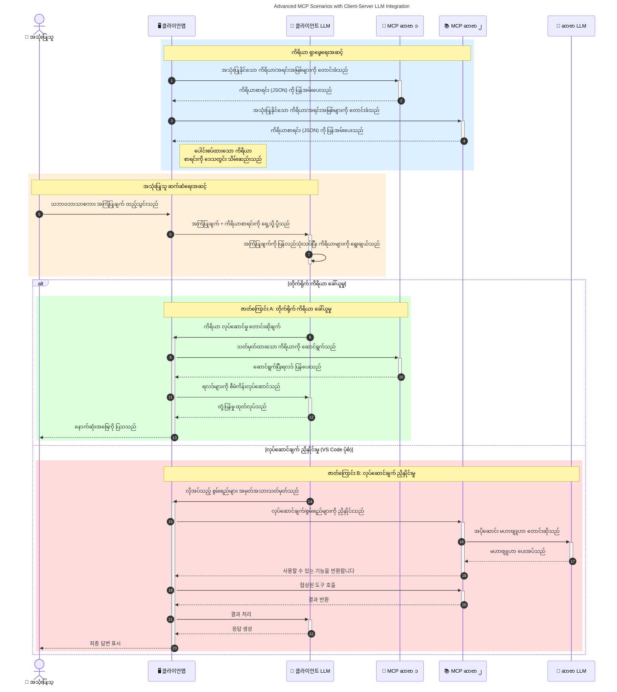

# မော်ဒယ် အကြောင်းအရာ ပရိုတိုကောလ် (MCP) အကြောင်း မိတ်ဆက်ခြင်း- အဘယ်ကြောင့် စွမ်းအားမြှင့် AI လျှောက်လွှာများအတွက် အရေးကြီးသနည်း

[](https://youtu.be/agBbdiOPLQA)

_(ဤသင်ခန်းစာ ရုပ်ရှင်ကို ကြည့်ရန် အပေါ်မှ ပုံကိုနှိပ်ပါ)_

Generative AI လျှောက်လွှာများသည် သဘာဝဘာသာစကား ညွှန်ကြားချက်များဖြင့် အသုံးပြုသူအား လွယ်ကူစွာ ဆက်သွယ်နိုင်စေသည့် ခေတ်သစ် အဆင့်မြှင့် လျှောက်လွှာများဖြစ်သည်။ သို့သော် အချိန်နှင့် အရင်းအမြစ်များ ပိုမိုရင်းနှီးလာသည်နှင့်အမျှ၊ သင်သည် ၎င်းအတိုင်း အသုံးပြုနိုင်သော လုပ်ဆောင်ချက်များနှင့် အရင်းအမြစ်များကို လွယ်ကူစွာ တွဲဖက်အသုံးပြုနိုင်စေရန်၊ ဂျင် AI လျှောက်လွှာများသည် မော်ဒယ် တစ်ခုထက် မော်ဒယ်များစွာ အသုံးပြုနိုင်ပြီး၊ မော်ဒယ်အပြောင်းအလဲမျိုးစုံကို ကိုင်တွယ်နိုင်ရန် တကယ်လိုအပ်သည်။ ရှင်းလင်း၍ ပြောရရင် ဂျင် AI လျှောက်လွှာများကို တည်ဆောက်ရတာတော့ လွယ်ကူပေမဲ့၊ အင်္ဂါရပ်များ တိုးလာပြီး ခက်ခဲလာသည်နှင့်အမျှ နမူနာတစ်ခု များသည့် ရုပ်သုံရေးဆောက်တာကဲ့သို့ စံပြပုံစံနှင့် မဟာဗျူဟာ တည်ဆောက်မှသာ တည်ငြိမ်ပြီး ယုံကြည်စိတ်ချရသောလျှောက်လွှာများ ဖြစ်လာစေမှာ ဖြစ်သည်။ ဒီနေရာမှာ MCP ကဲ့သို့သော စံတော်ချိန်ပုံစံတစ်ခု လိုအပ်လာပြီး အမှုဆောင်ပုံစံတည်ဆောက်ပေးသည်။

---

## **🔍 မော်ဒယ် အကြောင်းအရာ ပရိုတိုကောလ် (MCP) ဆိုတာဘာလဲ?**

**မော်ဒယ် အကြောင်းအရာ ပရိုတိုကောလ် (MCP)** သည် **ဖွင့်လှစ်ထားသော စံပြ ပုံစံ တစ်ခု** ဖြစ်ပြီး, များမကြီးသော ဘာသာစကားမော်ဒယ်များ (LLMs) ကို နေရာအပြင်က စက်ပစ္စည်းများ၊ API များနှင့် ဒေတာ အရင်းအမြစ်များနှင့် အဆင်ပြေစွာ ဆက်သွယ်အသုံးပြုနိုင်စေသည်။ ၎င်းသည် AI မော်ဒယ်များကို သင်ကြားမှုဒေတာ အပြင်သို့ များစွာ ထိထိရောက်ရောက် လည်ပတ်စေပြီး အိထိခိုက်စေခြင်း၊ အဆင့်မြှင့် ဆွဲဆောင်မှုရှိခြင်းနှင့် ရုပ်သုံကျသော AI စနစ်များ ဖန်တီးနိုင်စေရန် တူညီသော စနစ်တစ်ခုကို ပံ့ပိုးပေးသည်။

---

## **🎯 AI တွင် စံသတ်မှတ်ခြင်း ရဲ့ အရေးပါမှု**

Generative AI လျှောက်လွှာများ ပိုမိုရှုပ်ထွေးလာသဖြင့်, **မြှင့်တင်မှု၊ တိုးချဲ့နိုင်မှု၊ ပြုပြင်ထိန်းသိမ်းမှု** နှင့် **Vendor Lock-in (ပတ်သက်ကုန်စွဲမှု) ရှောင်ရှားနိုင်မှု** စသည်ဖြင့် စံသတ်မှတ်ချက်များ ကျင့်သုံးရန် လိုအပ်သည်။ MCP သည် ဤလိုအပ်ချက်များကို အောက်ပါအတိုင်း ဖြေရှင်းပေးသည်–

- မော်ဒယ်နှင့် စက်ပစ္စည်း အပြန်အလှန် ပေါင်းစပ်မှုများကို စုစည်းပေးခြင်း
- ချောမွေ့မှုနည်းသော၊ တစ်ခါတစ်ရံ အထူးပြုဖြေရှင်းချက်များ လျော့ချပေးခြင်း
- ကုမ္ပဏီအားလုံးမှာ မတူညီသော မော်ဒယ်များ စုစည်း အသုံးပြုနိုင်ခြင်း

**မှတ်ချက်** - MCP သည် ဖွင့်လှစ်သော စံတော်ချိန်ပုံစံတစ်ခု အနေဖြင့် မြှင့်တင်ထားပေမဲ့, IEEE, IETF, W3C, ISO သို့မဟုတ် အခြား စံချိန်သား အဖွဲ့များမှတဆင့် စံခွဲသတ်မှတ်မှု မရှိသေးပါ။

---

## **📚 သင်ယူရမည့် ရည်ရွယ်ချက်များ**

ဤဆောင်းပါး၏အဆုံးသတ်အထိ သင်သည်:

- **မော်ဒယ် အကြောင်းအရာ ပရိုတိုကောလ် (MCP)** အဓိပ္ပါယ်နှင့် အသုံးပြုမှုများကို သေချာ ပြောနိုင်မည်
- MCP သည် မော်ဒယ်မှ စက်ပစ္စည်းဆီ သဘောတူညီမှုကို စံပြအတိုင်း ပြုလုပ်ပုံ ဆွဲနိုင်မည်ကို သဘောပေါက်မည်
- MCP အတွင်း အဓိက ပါဝင်သော အစိတ်အပိုင်းများကို ထုတ်ဖော်နိုင်မည်
- MCP ကို စီးပွားရေးနှင့် ဖွံ့ဖြိုးရေး နှစ်ခုစလုံး၌ အသုံးချနေသော ကိစ္စများကို ရှာဖွေပြီး လေ့လာနိုင်မည်

---

## **💡 မော်ဒယ် အကြောင်းအရာ ပရိုတိုကောလ် (MCP) ရဲ့ အချက်အလက်ပြောင်းလဲမှု**

### **🔗 MCP သည် AI ဆက်သွယ်မှုမှ တစ်ဆင့် ခွဲခြမ်းမှုများကို ဖြေရှင်းသည်**

MCP မရှိမီ၌ မော်ဒယ်နှင့် စက်ပစ္စည်း ပေါင်းစပ်မှုများအတွက်:

- စက်ပစ္စည်းနှင့် မော်ဒယ် တစ်စုံတစ်ရာ စုစည်းရေးအတွက် အထူးစကားရေးသားရမည်
- ကုမ္ပဏီ အလိုက် API မတူညီမှုများရှိသည်
- နေ့စဉ်အပ်ဒိတ်များအတွက် ဆက်တိုက်ပြင်ဆင်ရနိုင်သည်
- စက်ပစ္စည်း များနဲ့ ပေါင်းသုံးရာတွင် ကန့်သတ်မှုများရှိသည်

### **✅ MCP စံချိန်ပုံစံရရှိခြင်း၏ အကျိုးကျေးဇူးများ**

| **အကျိုးကျေးဇူးများ**     | **ဖော်ပြချက်**                                                              |
|--------------------------|--------------------------------------------------------------------------------|
| ဆက်သွယ်ဆောင်ရွက်နိုင်မှု    | LLMs များသည် ကုမ္ပဏီ များစွာမှ စက်ပစ္စည်းများနှင့် အဆင်ပြေစွာ လုပ်ဆောင်နိုင်သည် |
| တူညီမှုရှိမှု            | ပလက်ဖောင်းများနှင့် စက်ပစ္စည်းများ၌ တူညီသော အပြုအမူရှိသည်                 |
| ပြန်လည်အသုံးပြုနိုင်မှု     | တစ်ကြိမ်တည်ဆောက်ထားသည့် စက်ပစ္စည်းများကို စီမံကိန်းများနှင့် စနစ်များတွင် အသုံးပြုနိုင်သည် |
| အမြန်တောင်တက် ဖွံ့ဖြိုးမှု | စံချိန်ထားပြီး ပလပ်ဂ်အန် ပလေဆွေ များ အသုံးပြု၍ ဖွံ့ဖြိုးမှုအချိန်လျော့နည်းစေသည်    |

---

## **🧱 MCP ၏ အဆင့်မြင့် ပုံစံအဆိုပုံ**

MCP သည် **client-server မော်ဒယ်** ကို လိုက်နာပြီး –

- **MCP Hosts** မှ AI မော်ဒယ်များ လည်ပတ်သည်
- **MCP Clients** မှ တောင်းဆိုမှုများ စတင်ပေးသည်
- **MCP Servers** မှ အကြောင်းအရာများ၊ စက်ပစ္စည်းများနှင့် စွမ်းဆောင်ရည်များ ပေးဆောင်သည်

### **အဓိက ပါဝင်ပစ္စည်းများ**

- **အရင်းအမြစ်များ** – မော်ဒယ်များအတွက် အတိတ် ဒေတာ (static) သို့မဟုတ် တိုးပွားလာသော ဒေတာ (dynamic)  
- **ညွှန်ကြားချက်များ** – ဦးတည်ချက်သတ်မှတ်ထားသော လုပ်ထုံးလုပ်နည်းများ  
- **စက်ပစ္စည်းများ** – ရှာဖွေရေး၊ လက်ချက်တွက်ချက်မှု ကဲ့သို့ လုပ်ဆောင်နိုင်သည့် လုပ်ငန်းများ  
- **Sampling** – ပြန်လည်ဆက်သွယ်မှုများမှတဆင့် အေးဂျင့်တစ်ရပ်တစ်နိုင် (2026-07-28 တွင် ဖယ်ရှားခံရမည့် လွှင့်ပေးသူ)  
- **Elicitation** – ဝဘ်ဆာဗာက မေးမြန်းမှုများလက်ခံခြင်း  
- **Roots** – ဖိုင်စနစ် ဝင်ရောက်ခွင့် ထိန်းချုပ်မှု (2026-07-28 တွင် ဖယ်ရှားခံရမည့် လွှင့်ပေးသူ)  

### **ပရိုတိုကောလ် အဆောက်အအုံ**

MCP သည် အဆင့် နှစ်ခုပိုင်း Architecture ကို အသုံးပြုသည် –
- **ဒေတာအဆင့်** - JSON-RPC 2.0 ကို အသုံးပြုသော ဆက်သွယ်မှုနှင့် အသက်တမ်းစီမံခန့်ခွဲမှု၊ အခြေခံလုပ်ဆောင်ချက်များ
- **ပို့ဆောင်မှုအဆင့်** - STDIO (ဒေသခံ) နှင့် SSE ပါရှိသည့် Streamable HTTP (ခေဝး) ဆက်သွယ်မှု ချန္နယ်များ

---

## MCP Servers များ လည်ပတ်ပုံ

MCP Servers များ လုပ်ဆောင်ပုံမှာအောက်ပါအတိုင်း ဖြစ်သည် –

- **တောင်းဆိုမှုလည်ပတ်မှု**:
    1. တောင်းဆိုမှုကို အသုံးပြုသူ သို့မဟုတ် ၎င်း၏ နိုင်ငံတော်မှ တစ်စိတ်တစ်ပိုင်းအနေဖြင့် ဆော့ဖ်ဝဲ မှစတင်သည်
    2. **MCP Client** မှ တောင်းဆိုမှုကို **MCP Host** သို့ ပို့သည်၊ ယင်းသည် AI မော်ဒယ် ဖော်ပြလည်ပတ်မှုကို စီမံခန့်ခွဲသည်
    3. **AI မော်ဒယ်** သည် အသုံးပြုသူ ထည့်သွင်းချက်ကို လက်ခံပြီး၊ တစ်ခု သို့မဟုတ် အတော်များသော စက်ပစ္စည်းခေါ်ဆိုမှုခြင်းမှတဆင့် ထိပ်တန်း စက်ပစ္စည်းများ သို့ ဒေတာများ ဆက်သွယ်ရန် တောင်းဆိုနိုင်သည်
    4. **MCP Host** သည် မော်ဒယ်ကို မရောက်ရင် အဖြစ်မှန် မဟုတ် ကာ၊ အတတ်နိုင်ဆုံး **MCP Server(s)** နှင့် စံသတ်မှတ်မှု အခြေခံ ပရိုတိုကောလ်အသုံးပြု ပြောဆက်သည်
- **MCP Host လုပ်ငန်းများ**:
    - **စက်ပစ္စည်းစာရင်း**: ရရှိနိုင်သည့် စက်ပစ္စည်းများနှင့် ၎င်းတို့၏ စွမ်းရည်များ စာရင်းကို ထိန်းသိမ်းသည်
    - **အသိအမှတ်ပြုခြင်း**: စက်ပစ္စည်း အသုံးပြုမှု အခွင့်အရေးများကို အတည်ပြုသည်
    - **တောင်းဆိုမှု ကုမ္ပဏီ**: မော်ဒယ်မှရောက်နေသော စက်ပစ္စည်း တောင်းဆိုမှုများကို ကုန်ကြမ်း ပေးလုပ်သည်
    - **တုံ့ပြန်မှု ပုံစံနှင့် တိုက်ဆိုင်မှု**: စက်ပစ္စည်း ထုတ်လုပ်ချက်များကို မော်ဒယ်နားလည်နိုင်သော ပုံစံအဖြစ် ဖွဲ့စည်းပေးသည်
- **MCP Server အကောင်အထည်ဖော်မှု**:
    - **MCP Host** သည် စက်ပစ္စည်း ခေါ်ဆိုမှုများကို စက်ပစ္စည်းများအားလုံး (ဥပမာ- ရှာဖွေမှု၊ တွက်ချက်မှု၊ ဒေတာစုံစမ်းမှု) သို့ ပို့သည်
    - **MCP Servers** မှ လုပ်ငန်းများကို လုပ်ဆောင်ပြီး အလားတူပုံစံဖြင့် **MCP Host** သို့ ရလဒ်ပြန်ပေးသည်
    - **MCP Host** သည် ရလဒ်များအား မော်ဒယ်သို့ ပေးပို့ရန် ဖွဲ့စည်းပေးသည်
- **တုံ့ပြန်မှု ပြီးမြောက်မှု**:
    - **AI မော်ဒယ်** သည် စက်ပစ္စည်း ထုတ်ကုန်များကို နောက်ဆုံးဖြေရှင်းချက်ထဲ ထည့်သွင်းသည်
    - **MCP Host** သည် တုံ့ပြန်ချက်ကို **MCP Client** ဆီ ပြန်ပို့ပြီး အသုံးပြုသူ သို့မဟုတ် ဆော့ဖ်ဝဲ ဆီ ထောက်ပံ့ပေးသည်
    

```mermaid
---
title: MCP Architecture and Component Interactions
description: A diagram showing the flows of the components in MCP.
---
graph TD
    Client[MCP ဖောက်သည်/လျှောက်လွှာ] -->|အဆိုပြုချက် ပို့သည်| H[MCP ဟုတ်စ်]
    H -->|ခေါ်ဆိုသည်| A[AI မော်ဒယ်]
    A -->|ကိရိယာ ခေါ်သုံးရန် အဆိုပြုချက်| H
    H -->|MCP Protocol| T1[MCP Server Tool 01: ဝက်ဘ်ရှာဖွေရေး
    H -->|MCP Protocol| T2[MCP Server Tool 02: အရိပ်စာရ calculator မှာယူမှု
    H -->|MCP Protocol| T3[MCP Server Tool 03: ဒေတာဘေ့စ် ဝင်ရောက်မှု ကိရိယာ
    H -->|MCP Protocol| T4[MCP Server Tool 04: ဖိုင်စနစ် ကိရိယာ
    H -->|တုံ့ပြန်ချက် ပို့သည်| Client

    subgraph "MCP ဟုတ်စ် အစိတ်အပိုင်းများ"
        H
        G[ကိရိယာ မှတ်ပုံတင်စာရင်း]
        I[အတည်ပြုခြင်း]
        J[အဆိုပြုချက် ကိုင်တွယ်သူ]
        K[တုံ့ပြန်ချက် ဖော်မြူလာပြုသူ]
    end

    H <--> G
    H <--> I
    H <--> J
    H <--> K

    style A fill:#f9d5e5,stroke:#333,stroke-width:2px
    style H fill:#eeeeee,stroke:#333,stroke-width:2px
    style Client fill:#d5e8f9,stroke:#333,stroke-width:2px
    style G fill:#fffbe6,stroke:#333,stroke-width:1px
    style I fill:#fffbe6,stroke:#333,stroke-width:1px
    style J fill:#fffbe6,stroke:#333,stroke-width:1px
    style K fill:#fffbe6,stroke:#333,stroke-width:1px
    style T1 fill:#c2f0c2,stroke:#333,stroke-width:1px
    style T2 fill:#c2f0c2,stroke:#333,stroke-width:1px
    style T3 fill:#c2f0c2,stroke:#333,stroke-width:1px
    style T4 fill:#c2f0c2,stroke:#333,stroke-width:1px
```

## 👨‍💻 MCP Server တည်ဆောက်နည်း (ဥပမာများ အသုံးပြု၍)

MCP servers များသည် LLM ၏ စွမ်းသတ္တိများ ဖြည့်စွက်ပေးရန် ဒေတာနှင့် လုပ်ဆောင်ချက်များ ပေးဆောင်သည်။

စမ်းသပ်ကြည့်လိုပါသလား? အောက်တွင် နိုင်ငံဘာသာနှင့် စက်ပစ္စည်းအလိုက် SDK များနှင့် နမူနာ MCP Server များ ဖန်တီးနည်းများ ရရှိနိုင်ပါသည်။

- **Python SDK**: https://github.com/modelcontextprotocol/python-sdk

- **TypeScript SDK**: https://github.com/modelcontextprotocol/typescript-sdk

- **Java SDK**: https://github.com/modelcontextprotocol/java-sdk

- **C#/.NET SDK**: https://github.com/modelcontextprotocol/csharp-sdk


## 🌍 MCP အတွက် လက်တွေ့ အသုံးချမှု များ

MCP သည် AI စွမ်းဆောင်ရည် တိုးမြှင့်ခြင်းအားဖြင့် အမျိုးမျိုးသောလျှောက်လွှာများ ဖန်တီးနိုင်သည်။

| **လျှောက်လွှာ**                | **ဖော်ပြချက်**                                                                |
|------------------------------|--------------------------------------------------------------------------------|
| စီးပွားရေး ဒေတာ ပေါင်းစပ်မှု       | LLM များကို ဒေတာဘေ့စ်များ၊ CRM များ သို့မဟုတ် အတွင်းစနစ်များနှင့် ချိတ်ဆက်ပေးသည်         |
| Agentic AI စနစ်များ            | စက်ပစ္စည်း အသုံးပြု၍ ကိုယ်ပိုင် ဆုံးဖြတ်ချက်ချနိုင်သော အေးဂျင့်များ ဖန်တီးပေးသည်         |
| Multi-modal လျှောက်လွှာများ    | စာသား၊ ပုံနှင့် အသံစက်ပစ္စည်းများကို တစ်ခုတည်း AI လျှောက်လွှာတွင် ပေါင်းစပ်အသုံးပြုသည်        |
| အချိန်နှင့် တပြိုင်နက် ဒေတာ ပေါင်းစပ်မှု | ဇိမ်ခံသောcurrent data နှင့် AI ဆက်သွယ်မှုများ ပိုမိုတိကျ အောင် ပြုလုပ်ပေးသည်                 |


### 🧠 MCP = AI ဆက်သွယ်မှုအတွက် စံချိန်တစ်ခု

မော်ဒယ် အကြောင်းအရာ ပရိုတိုကောလ် (MCP) သည် USB-C ကွန်နက်ရှင်များ စံချိန်တက်စေသည့် လိုပဲ, AI ဆက်သွယ်မှုများတွင် စံချိန်တစ်ခုအား ဖန်တီးပေးသည်။ AI ၏ကမ္ဘာတွင် MCP သည် မော်ဒယ်များ (clients) ကို ကျယ်ပြန့်စွာသော စက်ပစ္စည်းများနှင့် ဒေတာ ပေးသူများ (servers) နှင့် တိကျကျ ဆက်သွယ်နိုင်ရန် မျှတစွာသော အင်တာဖေ့စ်တစ်ခု ပေးစွမ်းသည်။ ၎င်းမှာ အမျိုးမျိုးသော API သို့ ဒေတာ အရင်းအမြစ်များအတွက် သီးခြားစံချိန်များ ရှိရန် မလိုအပ်တော့ပါ။

MCP အောက်တွင် MCP ကို အထောက်အပံ့ပေးသော စက်ပစ္စည်း (MCP server ဟု ခေါ်သည်) သည် စံချိန်တစ်ခု ဖြင့် လိုက်နာသည်။ ၎င်းတို့သည် ၎င်းတို့ ပေးနိုင်သော စက်ပစ္စည်းများ သို့မဟုတ် လုပ်ဆောင်ချက်များ အား တင်ပြရန်နှင့် AI အေးဂျင့်တစ်ရပ်မှ တောင်းဆိုမှုအရ လုပ်ဆောင်ရန် အသင့်ရှိသည်။ MCP ကို ဖြည့်ဆည်းသည့် AI အေးဂျင့် ပလက်ဖောင်းများသည် ရရှိနိုင်သည့်စက်ပစ္စည်းများကို ရှာဖွေကြည့်နိုင်ပြီး စံတော်ချိန်ပုံစံဖြင့် အဲဒီစက်ပစ္စည်းများကို ခေါ်ယူအသုံးပြုနိုင်သည်။

### 💡 အသိပညာ ဝင်ရောက်ပေးမှု အားကောင်းစေမှု

MCP သည် စက်ပစ္စည်းများပေးသည့် လုပ်ဆောင်ချက်များအပြင် အသိပညာဝင်ရောက်မှုကိုလည်း ကူညီပေးသည်။ ၎င်းသည် ဂျင်းဘာသာစကားမော်ဒယ် (LLM) များအား မတူညီသော ဒေတာ အရင်းအမြစ်များနှင့် ချိတ်ဆက်ပေးရန် အကောင်းဆုံးနည်းလမ်းဖြစ်သည်။ ဥပမာအားဖြင့် MCP server တစ်ခုမှာ ကုမ္ပဏီစာရွက်စာတမ်း စုဆောင်းနေသောဒေတာဘေ့စ် တစ်ခုသာ ဖြစ်နိုင်သည်၊ ၎င်းမှ အေးဂျင့်များ အသုံးပြု၍ လိုအပ်သည့်အချက်အလက်များ အချိန်မရွေး ရယူနိုင်သည်။ အခြား server တစ်ခုမှာ အီးမေးလ်ပို့ခြင်း သို့မဟုတ် မှတ်တမ်းများ မွမ်းမံခြင်း ကဲ့သို့သော လုပ်ဆောင်ချက်များကို စီမံနိုင်သည်။ ၎င်းတို့အား အေးဂျင့်အနေနှင့် သုံးစွဲနိုင်သည့် စက်ပစ္စည်းများဟု မှတ်ယူနိုင်သည်။ MCP သည် ဤလုပ်သက်များနှစ်မျိုးစလုံးကို ထိထိထိရောက်ရောက် စီမံခန့်ခွဲပေးသည်။

အေးဂျင့်တစ်ရပ် MCP server သို့ ချိတ်ဆက်သည်နှင့် တစ်ချက်တည်း ချိတ်ဆက်ထားသော server ၏ စွမ်းဆောင်ရည်များနှင့် ရနိုင်သည့်ဒေတာများကို အလိုအလျောက် လေ့လာသိရှိသွားသည်။ သပ်ရပ်သော စံချိန်ရေးဖြင့် စက်ပစ္စည်းရရှိနိုင်မှုသည် တိုးတက်စေသည်။ ဥပမာ၊ MCP server အသစ်တစ်ခုကို အေးဂျင့်စနစ်တွင် ထပ်မံထည့်လှမ်းသည့်အခါ အခြားဆက်စပ်မှု မလိုပဲ စက်ပစ္စည်းထည့်သွင်းမှု အလယ်အလတ်အထိ သုံးနိုင်သွားသည်။

ဤပိုင်းဆက်သွယ်မှုမှာ အောက်ပါ ပုံကဲ့သို့ ပြသထားပြီး server များသည် စက်ပစ္စည်းများ နှင့် အသိပညာနှစ်မျိုးလုံးကို ပေးဆောင်ကာ စနစ်များအကြား မျှတစွာ ပူးပေါင်းဆောင်ရွက်နိုင်စေသည်။

### 👉 ဥပမာ - စွမ်းဆောင်ရည် မြှင့်တင်နိုင်သည့် အေးဂျင့် ဖြေရှင်းချက်

```mermaid
---
title: Scalable Agent Solution with MCP
description: A diagram illustrating how a user interacts with an LLM that connects to multiple MCP servers, with each server providing both knowledge and tools, creating a scalable AI system architecture
---
graph TD
    User -->|အမိန့်| LLM
    LLM -->|တုံ့ပြန်ချက်| User
    LLM -->|MCP| ServerA
    LLM -->|MCP| ServerB
    ServerA -->|ဇာတိဆက်သွယ်ကိရိယာ| ServerB
    ServerA --> KnowledgeA
    ServerA --> ToolsA
    ServerB --> KnowledgeB
    ServerB --> ToolsB

    subgraph ဆာဗာ A
        KnowledgeA[သိမ်းဆည်းမှု]
        ToolsA[ကိရိယာများ]
    end

    subgraph ဆာဗာ B
        KnowledgeB[သိမ်းဆည်းမှု]
        ToolsB[ကိရိယာများ]
    end
```
Universal Connector သည် MCP server များအကြား ဆက်သွယ်ခြင်းနှင့် စွမ်းဆောင်ရည်များ မျှဝေခြင်းကို ကူညီပေးကာ ServerA သည် ServerB သို့ တာဝန်များ လွှဲပြောင်းပေးခြင်း သို့မဟုတ် ၎င်း၏ စက်ပစ္စည်း နှင့် အသိပညာကို အသုံးပြုနိုင်သည်။ ဤနေရာတွင် စက်ပစ္စည်းများနှင့် ဒေတာများ ဆက်စပ်ခြင်းဖြင့် စွမ်းအားမြင့်ပြီး အပိုင်းပိုင်းဖွဲ့ထားသော အေးဂျင့် အတွင်းကိရိယာကျယ်များ ဖန်တီးနိုင်သည်။ MCP သည် စက်ပစ္စည်း ဖော်ပြမှုကို စံပြပုံစံဖြင့် ပြုလုပ်ရာမှ အေးဂျင့်များသည် ဆန့်ကျင်ဘက် server များနှင့် စေမှုရှင်တက် ပို့ဆောင်မှုများကို စမ်းသပ်ကာ တာဝန်ဖြန့်ဝေမှုများကို လွယ်ကူစွာ ဆောင်ရွက်နိုင်သည်၊ ယခုလို နည်းမှသာ စက်ပစ္စည်းများ ပေါင်းစပ်ခြင်းမှ စနစ်တကျ ဖြစ်လာသည်။


စက်ပစ္စည်းနှင့် အသိပညာ မျှဝေမှု - Server များအကြား စက်ပစ္စည်းနှင့် ဒေတာ ထိတွေ့မှုနိုင်ခြင်းသည် စွမ်းအားမြင့်ပြီး အပိုင်းပိုင်း အေးဂျင့်အဆောက်အအုံများကို ပံ့ပိုးပေးသည်။

### 🔄 Client-Side LLM ပေါင်းစည်းမှုပါရှိသည့် MCP ၏ အဆင့်မြင့်အခြေအနေများ

အခြေခံ MCP အဆောက်အအုံအပြင်၊ client နှင့် server နှစ်ဖက်လုံးတွင် LLM များပါဝင်၍ ပိုမိုတိုးတက်ပြီး စွမ်းဆောင်ရည်မြင့် ဆက်သွယ်မှုများကို ဖန်တီးနိုင်သော အခြေအနေများလည်း ရှိပါသည်။ အောက်ပါ ပုံတွင် **Client App** က LLM ဖြင့် အသုံးပြုနိုင်သော MCP tools များစွာ ပါဝင်သည့် IDE ဖြစ်နိုင်သည်။



## 🔐 MCP ၏ လုပ်ငန်းဆောင်တာ အကျိုးကျေးဇူးများ

MCP သုံးခြင်းအားဖြင့် ရရှိနိုင်သော လုပ်ငန်းဆောင်တာ အကျိုးကျေးဇူးများမှာ –

- **အသစ်တွေပါဝင်မှု**: မော်ဒယ်များသည် ၎င်းတို့ သင်ကြားခဲ့သည့်ဒေတာထက် ပိုမိုနောက်ဆုံးရသတင်းအချက်အလက်များကို လက်လှမ်းမီနိုင်သည်
- **စွမ်းဆောင်ရန် တိုးချဲ့နိုင်ခြင်း**: မော်ဒယ်များသည် မသင်ကြားပေးခဲ့သော အလုပ်များအတွက် အထူးပြု စက်ပစ္စည်းများကို အသုံးပြုနိုင်သည်
- **မှားယွင်းမှန်ကန်မှု လျော့ကျခြင်း**: ပြင်ပဒေတာအရင်းအမြစ်များမှ တည်ရှိမှုအတည်ပြုချက်များ ရရှိစေသည်
- **ကိုယ်ရေးကိုယ်တာ မူဝါဒ**: အဘိဓာန်ဒေတာများကို prompt ထဲတွင် ထည့်သွင်းခြင်းမပြုဘဲ လုံခြုံသော ပတ်ဝန်းကျင်များအတွင်း ထိန်းသိမ်းနိုင်သည်

## 📌 အဓိကယူဆချက်များ

MCP သုံးစွဲရာတွင် အဓိကယူဆရန်အချက်များမှာ –

- **MCP** သည် AI မော်ဒယ်များသည် စက်ပစ္စည်းများနှင့် ဒေတာများအတွက် မည်သို့ ဆက်သွယ်ပြီး ပြောဆိုသည့် နည်းလမ်းများကို စံပြပုံစံ ဖန်တီးပေးသည်။
- **တိုးချဲ့နိုင်မှု၊ တူညီမှုနှင့် စနစ်တကျ ဆက်သွယ်နိုင်မှု ပံ့ပိုးမှုကို ဖော်ဆောင်သည်**
- MCP သည် ဖွံ့ဖြိုးမှု အချိန် ရှော့ချခြင်း၊ ယုံကြည်စိတ်ချမှု တိုးမြှင့်ခြင်းနှင့် မော်ဒယ် စွမ်းဆောင်ရည်များ တိုးတက်စေခြင်းတို့တွင် ကူညီပေးသည်။
- client-server အဆောက်အအုံသည် လွယ်ကူစွာ စွမ်းဆောင်ရည် တိုးချဲ့နိုင်သည့် AI လျှောက်လွှာများ ဖန်တီးနိုင်သည်။

## 🧠 လေ့ကျင့်မှု

သင် ဆောက်လုပ်လိုသော AI လျှောက်လွှာကို စဉ်းစားကြည့်ပါ။

- ဤလျှောက်လွှာ၏ စွမ်းဆောင်ရည်များ တိုးတက်စေရန် ဘယ် **ပြင်ပ စက်ပစ္စည်းများ သို့မဟုတ် ဒေတာများ** ပါဝင်နိုင်မလဲ။
- MCP သည် ပေါင်းစပ်မှုကို **ပိုမို လွယ်ကူပြီး ယုံကြည်စိတ်ချရသော နည်းလမ်း**ဖြင့် ပြုလုပ်နိုင်စေမလဲ။

## နောက်ထပ် အရင်းအမြစ်များ

- [MCP GitHub Repository](https://github.com/modelcontextprotocol)


## နောက်တစ်ခု ဘာလဲ

နောက်တစ်ခု: [Chapter 1: Core Concepts](../01-CoreConcepts/README.md)

---

<!-- CO-OP TRANSLATOR DISCLAIMER START -->
**ပြောကြားချက်**
ဤစာတမ်းကို AI ဘာသာပြန်ဝန်ဆောင်မှု [Co-op Translator](https://github.com/Azure/co-op-translator) အသုံးပြု၍ ဘာသာပြန်ထားပါသည်။ ကျွန်ုပ်တို့သည် တိကျမှန်ကန်မှုအတွက် ကြိုးပမ်းနေသော်လည်း၊ စက်ကိရိယာဘာသာပြန်ခြင်းများတွင် အမှားများ သို့မဟုတ် မှားယွင်းချက်များ ပါဝင်နိုင်ကြောင်း သတိပြုပါရန် လိုအပ်ပါသည်။ မူလစာတမ်းကို မူရင်းဘာသာဖြင့်သာ ယုံကြည်စိတ်ချရသော အချက်အလက်အဖြစ် သတ်မှတ်သင့်သည်။ အရေးကြီးသည့် သတင်းအချက်အလက်များအတွက် ပရော်ဖက်ရှင်နယ် လူသားဘာသာပြန်သူဝန်ဆောင်မှုကို အကြံပြုပါသည်။ ဤဘာသာပြန်ချက်ကို အသုံးပြုခြင်းမှ ဖြစ်ပေါ်လာသော နားလည်မှုကွာခြားမှုများ သို့မဟုတ် မမှန်ကန်သော အသုံးပြုမှုများအတွက် ကျွန်ုပ်တို့ တာဝန်မခံပါ။
<!-- CO-OP TRANSLATOR DISCLAIMER END -->